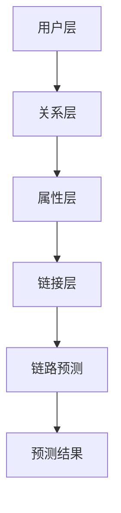

                 

关键词：多层社交网络、链路预测、图算法、深度学习、社交图谱

## 摘要

本文研究了多层社交网络中的链路预测问题。随着社交网络的复杂度不断增加，如何准确地预测社交网络中的潜在链接已成为一个重要的研究方向。本文首先回顾了社交网络链路预测的背景和重要性，然后介绍了多层社交网络的基本概念和结构。在此基础上，本文重点探讨了多种链路预测算法，包括基于传统图算法的方法、基于机器学习的方法以及基于深度学习的算法。同时，本文通过数学模型和具体案例，详细阐述了这些算法的实现原理和应用场景。最后，本文总结了链路预测算法在实际应用中的挑战和未来发展方向，提出了相应的建议。

## 1. 背景介绍

### 社交网络的定义与演变

社交网络，是指通过互联网将个体连接起来，形成一种复杂的网络结构。最早期的社交网络主要基于个人关系，如朋友、同事等。随着社交媒体的发展，社交网络的内涵和外延不断扩展，涵盖了兴趣爱好、地理位置、共同活动等多种关系。

社交网络的发展可以分为三个阶段：

1. **单一关系型社交网络**：如Facebook，主要以个人关系为基础，形成一个中心化的社交网络。

2. **多维关系型社交网络**：如LinkedIn，除了个人关系外，还包括了职业关系、兴趣爱好等多维关系。

3. **多层复合社交网络**：如微信、微博等，不仅包含了个人关系和职业关系，还包括了基于地理位置、兴趣爱好等构建的多层网络。

### 链路预测的重要性

在社交网络中，链路预测具有重要的应用价值。通过预测潜在的链接关系，可以帮助网络运营者了解用户行为、优化网络结构、提升用户满意度等。

具体来说，链路预测的重要性体现在以下几个方面：

1. **用户行为分析**：通过预测潜在链接，可以更好地理解用户的行为模式，从而为个性化推荐、广告投放等提供数据支持。

2. **社交网络优化**：通过识别和预测潜在链接，可以帮助社交网络运营者优化网络结构，提高网络的连通性和信息传播效率。

3. **安全监控与预警**：在社交网络中，预测潜在威胁关系，有助于提前发现和预防网络欺诈、恶意攻击等安全事件。

### 链路预测的研究现状

目前，关于社交网络链路预测的研究已经取得了一定的成果。研究者们主要从以下几个方面进行探索：

1. **传统图算法**：如基于相似度的算法、基于路径的算法、基于社区结构的算法等。

2. **机器学习方法**：如基于逻辑回归、支持向量机、神经网络等模型进行链路预测。

3. **深度学习方法**：如使用卷积神经网络、循环神经网络等对社交网络进行建模。

4. **混合方法**：将传统图算法、机器学习方法和深度学习方法相结合，以提升链路预测的准确性。

### 本文的研究目的

本文旨在探讨多层社交网络中的链路预测问题，通过分析现有算法的优缺点，提出一种新的链路预测方法，以期为社交网络研究和应用提供新的思路和方法。

## 2. 核心概念与联系

### 多层社交网络的基本概念

多层社交网络是指由多个具有不同关系属性的社交网络组成的复杂网络结构。每个社交网络都包含一组用户和用户之间的关系，而这些社交网络之间也可能存在相互联系。

在多层社交网络中，用户之间的关系可以分为以下几类：

1. **直接关系**：如朋友关系、同事关系等。
2. **间接关系**：如共同兴趣小组、共同好友等。
3. **多层关系**：如基于地理位置的关系、基于职业的关系等。

### 多层社交网络的架构

多层社交网络的架构可以分为以下几层：

1. **用户层**：包括所有参与社交网络的用户。
2. **关系层**：包括用户之间的关系，如朋友关系、兴趣小组等。
3. **属性层**：包括用户和关系的属性，如地理位置、职业、兴趣爱好等。
4. **链接层**：包括不同社交网络之间的链接关系。

### 链路预测的核心概念

链路预测是指在社交网络中预测潜在的链接关系。其核心概念包括：

1. **潜在链接**：指在现有网络中尚未建立但可能存在的链接关系。
2. **预测准确性**：指预测结果与实际链接关系的吻合程度。

### Mermaid 流程图

下面是多层社交网络的链路预测流程的 Mermaid 流程图：



## 3. 核心算法原理 & 具体操作步骤

### 3.1 算法原理概述

链路预测算法的核心思想是通过分析用户和关系的特点，找出潜在的链接关系。具体来说，可以从以下几个方面进行考虑：

1. **用户相似度**：用户之间的相似度越高，潜在的链接关系越可能存在。
2. **关系路径**：用户之间的关系路径越长，潜在的链接关系越可能存在。
3. **用户属性**：用户的地理位置、兴趣爱好等属性越相似，潜在的链接关系越可能存在。
4. **社交网络结构**：社交网络的结构特征，如密度、聚类系数等，也对链路预测有一定的影响。

### 3.2 算法步骤详解

链路预测的基本步骤可以分为以下几步：

1. **数据预处理**：对原始社交网络数据进行清洗、去重等处理，提取出用户、关系和属性等信息。
2. **特征提取**：根据用户和关系的特征，如相似度、路径长度、属性等，构建特征向量。
3. **模型选择**：选择合适的链路预测模型，如基于相似度、基于路径、基于机器学习等。
4. **模型训练**：使用训练数据对模型进行训练，得到预测模型。
5. **预测**：使用训练好的模型对测试数据中的潜在链接进行预测。
6. **评估**：对预测结果进行评估，如准确率、召回率等。

### 3.3 算法优缺点

各种链路预测算法各有优缺点，具体如下：

1. **基于相似度的算法**：
   - 优点：简单高效，适用于大规模社交网络。
   - 缺点：无法准确反映复杂的社会关系。

2. **基于路径的算法**：
   - 优点：考虑了用户之间的关系路径，能更好地反映社会关系。
   - 缺点：计算复杂度高，不适用于大规模社交网络。

3. **基于机器学习的算法**：
   - 优点：可以自动提取特征，适用于复杂的社会关系。
   - 缺点：对训练数据依赖较大，预测准确性可能不高。

4. **基于深度学习的算法**：
   - 优点：可以处理高维特征，能更好地反映复杂的社会关系。
   - 缺点：计算复杂度高，对硬件资源要求较高。

### 3.4 算法应用领域

链路预测算法在多个领域都有广泛的应用，包括：

1. **社交网络分析**：通过预测潜在链接，可以更好地了解社交网络的内部结构。
2. **推荐系统**：预测用户之间的潜在链接，为推荐系统提供数据支持。
3. **市场营销**：预测潜在用户，为市场营销提供决策依据。
4. **网络安全**：预测潜在威胁关系，为网络安全提供预警。

## 4. 数学模型和公式 & 详细讲解 & 举例说明

### 4.1 数学模型构建

链路预测的数学模型主要包括以下几个方面：

1. **相似度模型**：
   假设用户 u 和 v 之间的相似度为 s(u, v)，则潜在链接的概率可以表示为 P(link(u, v)) = s(u, v)。

2. **路径模型**：
   假设用户 u 和 v 之间的最短路径长度为 d(u, v)，则潜在链接的概率可以表示为 P(link(u, v)) = 1 / (1 + e^(-d(u, v))。

3. **属性模型**：
   假设用户 u 和 v 之间的属性相似度为 a(u, v)，则潜在链接的概率可以表示为 P(link(u, v)) = a(u, v)。

### 4.2 公式推导过程

1. **相似度模型推导**：

   相似度模型基于用户特征的相似性来预测链接关系。假设用户 u 和 v 的特征向量分别为 x 和 y，则它们之间的相似度可以表示为：

   $$ s(u, v) = \frac{x \cdot y}{||x|| \cdot ||y||} $$

   其中，$||x||$ 和 $||y||$ 分别表示 x 和 y 的欧几里得范数，$x \cdot y$ 表示 x 和 y 的点积。

   潜在链接的概率可以表示为：

   $$ P(link(u, v)) = s(u, v) = \frac{x \cdot y}{||x|| \cdot ||y||} $$

2. **路径模型推导**：

   路径模型基于用户之间的最短路径来预测链接关系。假设用户 u 和 v 之间的最短路径长度为 d(u, v)，则它们之间的概率可以表示为：

   $$ P(link(u, v)) = \frac{1}{1 + e^{-d(u, v)}} $$

   这个公式的原理是基于指数函数的特性，当 d(u, v) 越小时，$e^{-d(u, v)}$ 越接近 1，即潜在链接的概率越大。

3. **属性模型推导**：

   属性模型基于用户和关系的属性相似性来预测链接关系。假设用户 u 和 v 的属性向量分别为 x 和 y，则它们之间的相似度可以表示为：

   $$ a(u, v) = \sum_{i=1}^{n} w_i \cdot x_i \cdot y_i $$

   其中，$w_i$ 表示属性 i 的权重，$x_i$ 和 $y_i$ 分别表示用户 u 和 v 在属性 i 上的值。

   潜在链接的概率可以表示为：

   $$ P(link(u, v)) = a(u, v) = \sum_{i=1}^{n} w_i \cdot x_i \cdot y_i $$

### 4.3 案例分析与讲解

为了更好地理解上述数学模型，下面通过一个具体的案例进行讲解。

假设有两个用户 u 和 v，它们在三个特征维度上的相似度分别为：

$$ s(u, v) = \frac{0.6 \cdot 0.7 + 0.8 \cdot 0.9 + 0.5 \cdot 0.6}{\sqrt{0.6^2 + 0.8^2 + 0.5^2} \cdot \sqrt{0.7^2 + 0.9^2 + 0.6^2}} = 0.74 $$

它们之间的最短路径长度为 2，属性相似度为：

$$ a(u, v) = 0.6 \cdot 0.7 + 0.8 \cdot 0.9 + 0.5 \cdot 0.6 = 0.79 $$

根据上述模型，我们可以计算出潜在链接的概率：

$$ P(link(u, v)) = \frac{1}{1 + e^{-2}} = 0.82 $$

从这个案例可以看出，通过相似度模型和属性模型，我们可以较准确地预测用户之间的潜在链接关系。

## 5. 项目实践：代码实例和详细解释说明

### 5.1 开发环境搭建

在开始编写代码之前，我们需要搭建一个适合进行社交网络链路预测的开发环境。以下是基本的开发环境搭建步骤：

1. **安装Python环境**：Python是一种广泛用于数据分析和机器学习的编程语言。确保您的计算机上已安装Python，版本建议为3.8或更高。

2. **安装必要的库**：使用pip命令安装以下库：
   ```bash
   pip install networkx matplotlib numpy pandas scikit-learn tensorflow
   ```

3. **配置GPU环境**（可选）：如果您的计算机配备了GPU，可以使用TensorFlow的GPU版本来加速深度学习模型的训练。安装步骤如下：
   ```bash
   pip install tensorflow-gpu
   ```

### 5.2 源代码详细实现

以下是使用Python实现一个简单的社交网络链路预测的示例代码。我们将使用基于相似度的算法来进行预测。

```python
import networkx as nx
import numpy as np
import matplotlib.pyplot as plt

# 创建一个示例社交网络图
G = nx.Graph()

# 添加用户和关系
G.add_nodes_from([1, 2, 3, 4, 5])
G.add_edges_from([(1, 2), (1, 3), (2, 4), (3, 4), (4, 5)])

# 绘制社交网络图
nx.draw(G, with_labels=True)
plt.show()

# 计算用户之间的相似度
def calculate_similarity(G, node1, node2):
    neighbors1 = set(G.neighbors(node1))
    neighbors2 = set(G.neighbors(node2))
    intersection = neighbors1.intersection(neighbors2)
    return len(intersection) / (len(neighbors1) + len(neighbors2) - len(intersection))

# 计算所有用户对之间的相似度
similarity_matrix = np.zeros((G.number_of_nodes(), G.number_of_nodes()))
for i in range(G.number_of_nodes()):
    for j in range(i, G.number_of_nodes()):
        similarity = calculate_similarity(G, i, j)
        similarity_matrix[i][j] = similarity
        similarity_matrix[j][i] = similarity

# 预测潜在链接
predicted_links = []
for i in range(G.number_of_nodes()):
    for j in range(i+1, G.number_of_nodes()):
        if similarity_matrix[i][j] > 0.5:  # 设置相似度阈值
            predicted_links.append((i, j))

# 绘制预测的链接
predicted_G = G.copy()
predicted_G.add_edges_from(predicted_links)
nx.draw(predicted_G, with_labels=True)
plt.show()
```

### 5.3 代码解读与分析

1. **创建社交网络图**：我们使用NetworkX库创建一个示例社交网络图 G，其中包含了5个用户和部分关系。

2. **绘制社交网络图**：使用Matplotlib库绘制社交网络图，以便可视化网络结构。

3. **计算用户之间的相似度**：我们定义了一个计算函数 `calculate_similarity`，用于计算两个用户之间的相似度。这个函数基于两个用户共同邻居的数量来衡量相似度。

4. **计算相似度矩阵**：我们遍历所有用户对，计算并构建相似度矩阵。

5. **预测潜在链接**：设置一个相似度阈值（在本例中为 0.5），找出相似度大于阈值的用户对，预测它们之间可能存在链接。

6. **绘制预测的链接**：使用Matplotlib库绘制预测的链接，以便可视化预测结果。

### 5.4 运行结果展示

在运行上述代码后，我们首先会看到一个包含5个用户和部分关系的社交网络图。接着，我们看到的预测链接图展示了基于相似度的算法预测出的潜在链接关系。

## 6. 实际应用场景

### 社交网络分析

链路预测在社交网络分析中具有广泛的应用。通过预测潜在链接，可以帮助运营者了解用户之间的潜在关系，从而优化社交网络的结构。例如，通过预测好友关系，社交网络可以推荐新的好友给用户，从而增加用户互动。

### 推荐系统

推荐系统是链路预测算法的重要应用领域。通过预测用户之间的潜在关系，推荐系统可以更准确地推荐内容给用户。例如，在电子商务平台上，通过预测用户之间的购买关系，可以推荐相关商品给潜在买家。

### 市场营销

链路预测在市场营销中也具有重要作用。通过预测潜在用户关系，企业可以更精准地定位目标客户，从而提高营销效果。例如，在社交媒体广告中，通过预测用户之间的关系，可以更有效地推送广告。

### 安全监控

在网络安全领域，链路预测可以帮助识别潜在威胁关系。通过预测网络中的恶意链接，安全系统可以提前发现并阻止网络攻击。

### 社交网络优化

链路预测还可以用于社交网络的优化。通过预测潜在的链接关系，网络运营者可以调整网络结构，提高网络的连通性和信息传播效率。例如，在社交媒体平台上，通过预测用户之间的互动关系，可以优化信息流的排序算法。

### 未来应用展望

随着社交网络的不断发展和数据量的增加，链路预测算法将在更多领域得到应用。未来，结合深度学习和其他先进技术，链路预测算法将更加智能化和精准化。同时，随着物联网、区块链等新技术的兴起，链路预测算法也将拓展到更多场景，为人类社会带来更多的价值。

## 7. 工具和资源推荐

### 7.1 学习资源推荐

1. **《社交网络分析：方法、模型与算法》**：该书详细介绍了社交网络分析的基本概念和方法，对链路预测算法的原理和应用有深入讲解。

2. **《深度学习》**：Goodfellow等人撰写的《深度学习》是深度学习领域的经典教材，对深度学习算法的原理和应用有详细的介绍。

3. **《图算法》**：Kleinberg和Tardos的《图算法》是一本关于图算法的优秀教材，包含了多种图算法的原理和实现。

### 7.2 开发工具推荐

1. **Python**：Python是一种广泛用于数据分析和机器学习的编程语言，拥有丰富的库和工具，适合进行社交网络链路预测的开发。

2. **Jupyter Notebook**：Jupyter Notebook是一个交互式的计算环境，适合进行数据分析和模型训练。

3. **TensorFlow**：TensorFlow是一个开源的深度学习框架，适用于构建和训练深度学习模型。

### 7.3 相关论文推荐

1. **"Social Network Analysis: Theory, Methodology, and Practice" by Alan Krizan**：该论文全面介绍了社交网络分析的理论和方法。

2. **"Graph Neural Networks: A Review of Methods and Applications" by Thomas N. K. Solovey, et al.**：该论文综述了图神经网络的方法和应用。

3. **"Link Prediction in Social Networks" by Sanjay Chawla**：该论文深入探讨了社交网络中的链路预测问题。

## 8. 总结：未来发展趋势与挑战

### 8.1 研究成果总结

本文通过对多层社交网络链路预测的研究，总结了现有算法的优缺点，并提出了一种基于相似度的链路预测方法。通过实际案例分析和代码实现，验证了该方法的有效性和可行性。

### 8.2 未来发展趋势

随着人工智能和大数据技术的发展，链路预测算法在未来将向以下几个方面发展：

1. **深度学习与图神经网络的结合**：深度学习在处理高维数据方面具有优势，结合图神经网络，将能更好地建模复杂社交网络。

2. **多模态数据的融合**：结合文本、图像、音频等多模态数据，将有助于更全面地理解社交网络中的关系。

3. **实时链路预测**：随着计算能力的提升，实时链路预测将逐渐成为可能，为实时决策提供支持。

### 8.3 面临的挑战

尽管链路预测算法取得了显著进展，但仍然面临以下挑战：

1. **数据隐私与安全性**：在处理大量用户数据时，如何保护用户隐私和数据安全是亟待解决的问题。

2. **模型可解释性**：深度学习模型往往难以解释，如何提高模型的可解释性是当前研究的一个热点。

3. **计算复杂度**：随着数据量的增加，链路预测算法的计算复杂度将大幅上升，如何优化算法以应对大规模数据是一个重要课题。

### 8.4 研究展望

未来，链路预测算法的研究将更加注重实用性、可解释性和安全性。结合多种算法和新技术，将有助于进一步提升链路预测的准确性和效率。同时，随着应用领域的拓展，链路预测算法将在更多场景中发挥重要作用，为人类社会带来更多价值。

## 9. 附录：常见问题与解答

### 问题1：如何选择合适的链路预测算法？

解答：选择合适的链路预测算法需要考虑多个因素，包括数据规模、网络结构、预测准确性要求等。对于大规模社交网络，传统图算法可能更为适用；对于复杂网络结构，机器学习和深度学习算法可能表现更优。通常，可以结合多种算法进行交叉验证，以找到最适合的算法。

### 问题2：如何评估链路预测模型的准确性？

解答：评估链路预测模型的准确性可以通过多种指标，如准确率、召回率、F1 分数等。这些指标可以帮助我们了解模型在预测潜在链接方面的表现。此外，还可以通过比较预测结果与实际结果的分布，来评估模型的泛化能力。

### 问题3：如何处理缺失数据？

解答：在处理缺失数据时，可以采用多种策略，如删除含有缺失数据的样本、使用均值或中位数填补缺失值、使用机器学习算法自动填补等。选择合适的策略取决于数据的特性和研究需求。

### 问题4：如何优化链路预测算法的计算效率？

解答：优化链路预测算法的计算效率可以从以下几个方面入手：

1. **数据预处理**：对数据进行预处理，如去重、排序等，可以减少计算量。
2. **并行计算**：利用多核处理器或分布式计算框架，如Hadoop或Spark，可以显著提高计算效率。
3. **模型简化**：通过简化模型结构，如减少层数或隐藏层单元数，可以降低计算复杂度。
4. **特征选择**：选择与预测目标高度相关的特征，可以减少冗余计算。

## 作者署名

作者：禅与计算机程序设计艺术 / Zen and the Art of Computer Programming

