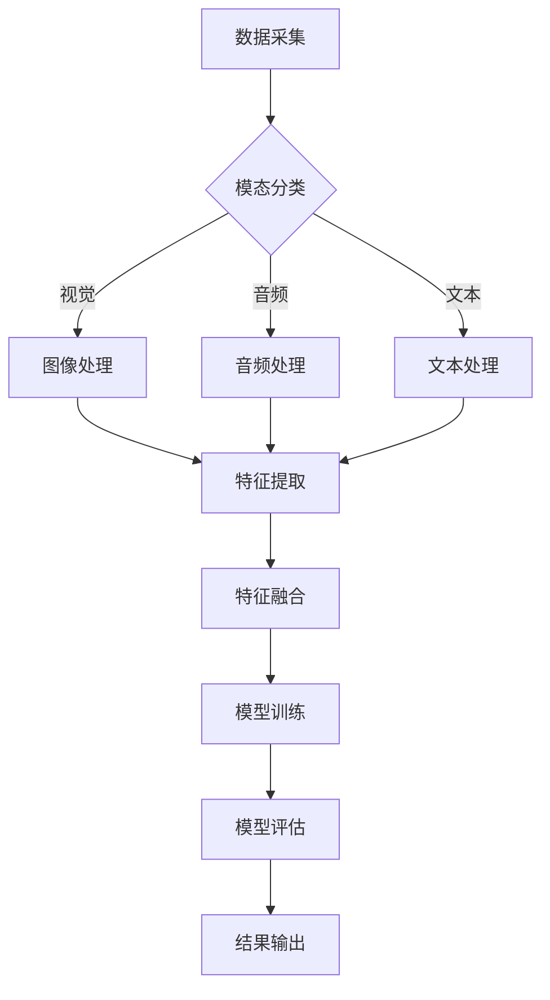

                 

关键词：多模态AI、图像处理、音频处理、视频处理、深度学习、计算机视觉、语音识别、自然语言处理、交叉模态学习、交互式系统。

> 摘要：本文深入探讨了多模态AI技术在图像、音频和视频处理中的应用，通过分析核心算法原理、数学模型以及实际应用案例，全面展示了多模态AI在各个领域的潜力和挑战。文章旨在为读者提供一个全面的多模态AI处理技术的理解和应用指南。

## 1. 背景介绍

随着人工智能技术的迅猛发展，多模态AI（Multi-modal Artificial Intelligence）逐渐成为研究热点。多模态AI旨在整合来自不同模态的数据，如视觉、音频、文本等，通过跨模态融合技术，实现更高效、更智能的感知和决策。多模态AI不仅能够提高系统的准确性，还能拓展应用场景，提升用户体验。

在图像处理、音频处理和视频处理等领域，多模态AI的应用具有重要意义。图像处理技术可以用于图像识别、目标检测、图像分割等；音频处理技术涉及语音识别、语音合成、音频增强等；视频处理技术则包括视频分类、视频分割、动作识别等。这些技术都在不同的场景中发挥着重要作用，如自动驾驶、智能家居、医疗诊断、娱乐交互等。

本文将重点探讨多模态AI在图像、音频和视频处理中的应用，分析核心算法原理，介绍数学模型，并通过实际项目实践，展示多模态AI技术的具体实现和效果。

## 2. 核心概念与联系

### 2.1. 多模态AI的概念

多模态AI是指利用多种传感模态的数据，如视觉、听觉、触觉等，通过跨模态融合技术，实现信息处理和决策的智能系统。多模态AI的核心在于如何将不同模态的数据进行有效的整合和融合，以实现更高的识别准确性和更强的泛化能力。

### 2.2. 多模态数据的来源

多模态数据的来源包括多种传感设备，如摄像头、麦克风、触觉传感器等。这些设备捕获的数据可以通过不同的模态进行分类，如视觉数据为图像，听觉数据为音频，触觉数据为触摸信号等。

### 2.3. 跨模态融合技术

跨模态融合技术是多模态AI的核心。常见的跨模态融合方法包括：

- **基于特征的融合**：将不同模态的数据转换为统一的特征表示，然后进行特征融合。
- **基于模型的融合**：构建一个统一的模型，直接对多模态数据进行融合处理。
- **基于数据的融合**：利用多模态数据之间的相关性，进行数据层面的融合。

### 2.4. 多模态AI的应用场景

多模态AI在图像、音频和视频处理领域有着广泛的应用场景。以下是一些典型的应用场景：

- **自动驾驶**：利用视觉数据和雷达数据，实现环境感知和决策。
- **智能交互**：结合语音和视觉数据，提升人机交互的自然性和智能性。
- **医疗诊断**：结合医学影像和病人语音信息，提高疾病诊断的准确性。
- **娱乐互动**：结合视频和音频数据，提供更加沉浸式的娱乐体验。

### 2.5. Mermaid流程图

以下是一个描述多模态AI处理流程的Mermaid流程图：



## 3. 核心算法原理 & 具体操作步骤

### 3.1. 算法原理概述

多模态AI的核心算法主要分为特征提取、特征融合和模型训练三个步骤。

1. **特征提取**：不同模态的数据通过各自的特征提取算法，转换为高维特征向量。
2. **特征融合**：将不同模态的特征向量进行融合，生成统一的多模态特征表示。
3. **模型训练**：利用多模态特征进行模型训练，实现具体任务的预测和分类。

### 3.2. 算法步骤详解

#### 3.2.1. 特征提取

- **视觉特征提取**：常用的方法包括卷积神经网络（CNN）和视觉特征点提取（如SIFT、HOG等）。
- **音频特征提取**：常用的方法包括梅尔频谱（Mel Frequency Cepstral Coefficients, MFCC）和小波变换。
- **文本特征提取**：常用的方法包括词袋模型（Bag-of-Words, BoW）和词嵌入（Word Embedding）。

#### 3.2.2. 特征融合

- **基于特征的融合**：将不同模态的特征向量通过矩阵乘法、卷积等操作进行融合。
- **基于模型的融合**：构建一个统一的模型，直接对多模态数据进行融合处理，如多模态卷积神经网络（Multimodal Convolutional Neural Networks, MCNN）。
- **基于数据的融合**：利用多模态数据之间的相关性，进行数据层面的融合，如多模态信息增益（Multimodal Information Gain, MIG）。

#### 3.2.3. 模型训练

- **分类任务**：使用多模态特征训练分类模型，如支持向量机（Support Vector Machine, SVM）和多层感知器（Multilayer Perceptron, MLP）。
- **回归任务**：使用多模态特征训练回归模型，如线性回归（Linear Regression）和岭回归（Ridge Regression）。

### 3.3. 算法优缺点

#### 优点

- **提高准确性**：通过整合不同模态的数据，可以提高系统的识别准确性和决策能力。
- **拓展应用场景**：多模态AI可以拓展到更多领域，如医疗、教育、娱乐等。
- **提升用户体验**：结合多种感官信息，可以提供更加丰富和自然的交互体验。

#### 缺点

- **计算资源消耗**：多模态数据处理需要大量的计算资源和存储空间。
- **数据一致性**：不同模态的数据可能存在不一致性，如光照变化对图像识别的影响。
- **算法复杂度**：多模态算法的复杂度较高，需要更多的研究和优化。

### 3.4. 算法应用领域

多模态AI在多个领域有着广泛的应用，以下是一些典型的应用领域：

- **图像识别**：结合视觉和文本数据，实现更加准确和智能的图像识别。
- **语音识别**：结合语音和文本数据，提高语音识别的准确性和自然性。
- **自然语言处理**：结合文本和视觉数据，实现更加精准和丰富的内容理解。
- **情感分析**：结合语音和文本数据，实现情感识别和情感分析。

## 4. 数学模型和公式 & 详细讲解 & 举例说明

### 4.1. 数学模型构建

多模态AI的数学模型主要包括特征提取、特征融合和模型训练三个部分。以下分别介绍这三个部分的数学模型。

#### 4.1.1. 特征提取

- **视觉特征提取**：

  设图像数据为 $I(x, y)$，通过卷积神经网络（CNN）提取特征，得到特征向量 $f_v$：

  $$ f_v = CNN(I) $$

- **音频特征提取**：

  设音频数据为 $A(t)$，通过梅尔频谱（MFCC）提取特征，得到特征向量 $f_a$：

  $$ f_a = MFCC(A) $$

- **文本特征提取**：

  设文本数据为 $T$，通过词嵌入（Word Embedding）提取特征，得到特征向量 $f_t$：

  $$ f_t = WordEmbedding(T) $$

#### 4.1.2. 特征融合

- **基于特征的融合**：

  将不同模态的特征向量进行拼接，得到多模态特征向量 $f$：

  $$ f = [f_v, f_a, f_t] $$

- **基于模型的融合**：

  构建一个多模态卷积神经网络（MCNN），直接对多模态数据进行融合处理，得到多模态特征向量 $f$：

  $$ f = MCNN([I, A, T]) $$

- **基于数据的融合**：

  利用多模态数据之间的相关性，通过多模态信息增益（MIG）进行融合，得到多模态特征向量 $f$：

  $$ f = MIG(I, A, T) $$

#### 4.1.3. 模型训练

- **分类任务**：

  使用多模态特征向量 $f$ 训练分类模型，得到分类结果 $y$：

  $$ y = Classifier(f) $$

- **回归任务**：

  使用多模态特征向量 $f$ 训练回归模型，得到回归结果 $y$：

  $$ y = Regressor(f) $$

### 4.2. 公式推导过程

#### 4.2.1. 卷积神经网络（CNN）

设输入图像为 $I(x, y)$，卷积核为 $K_{ij}$，步长为 $s$，卷积结果为 $C_{ij}$，则有：

$$ C_{ij} = (K_{ij} * I)(x, y) $$

通过多次卷积和池化操作，得到特征向量 $f_v$：

$$ f_v = CNN(I) $$

#### 4.2.2. 梅尔频谱（MFCC）

设音频信号为 $A(t)$，滤波器组频率为 $f_k$，带宽为 $b_k$，滤波器响应为 $h_k(t)$，则有：

$$ MFCC(A) = \sum_{k=1}^{K} \sqrt{h_k(t) * A(t)} $$

#### 4.2.3. 词嵌入（Word Embedding）

设词表为 $V$，词向量为 $w_v \in \mathbb{R}^d$，则有：

$$ WordEmbedding(T) = \sum_{v \in T} w_v $$

### 4.3. 案例分析与讲解

#### 4.3.1. 图像识别

使用多模态AI技术对图像进行识别，输入图像和文本描述，输出图像的类别。

- **特征提取**：使用CNN提取图像特征，使用词嵌入提取文本特征。
- **特征融合**：将图像特征和文本特征拼接，得到多模态特征向量。
- **模型训练**：使用多模态特征训练分类模型。

#### 4.3.2. 语音识别

使用多模态AI技术对语音进行识别，输入语音和文本描述，输出语音对应的文本。

- **特征提取**：使用MFCC提取音频特征，使用词嵌入提取文本特征。
- **特征融合**：将音频特征和文本特征拼接，得到多模态特征向量。
- **模型训练**：使用多模态特征训练语音识别模型。

## 5. 项目实践：代码实例和详细解释说明

### 5.1. 开发环境搭建

在开始多模态AI项目实践之前，我们需要搭建一个合适的开发环境。以下是推荐的开发环境：

- **操作系统**：Linux（推荐Ubuntu 18.04）
- **编程语言**：Python（推荐Python 3.8）
- **深度学习框架**：TensorFlow 2.x 或 PyTorch
- **数据处理库**：NumPy、Pandas
- **可视化库**：Matplotlib、Seaborn

### 5.2. 源代码详细实现

以下是多模态图像识别项目的一个简单实现，使用了TensorFlow 2.x框架。

```python
import tensorflow as tf
from tensorflow.keras.models import Model
from tensorflow.keras.layers import Input, Conv2D, MaxPooling2D, Flatten, Dense, concatenate

# 定义图像特征提取网络
input_image = Input(shape=(256, 256, 3))
x = Conv2D(32, (3, 3), activation='relu')(input_image)
x = MaxPooling2D((2, 2))(x)
x = Conv2D(64, (3, 3), activation='relu')(x)
x = MaxPooling2D((2, 2))(x)
x = Flatten()(x)
image_features = Dense(128, activation='relu')(x)

# 定义文本特征提取网络
input_text = Input(shape=(100,))
text_features = Embedding(input_dim=10000, output_dim=128)(input_text)
text_features = Flatten()(text_features)

# 多模态特征融合
combined_features = concatenate([image_features, text_features])
combined_features = Dense(128, activation='relu')(combined_features)

# 定义输出层
output = Dense(10, activation='softmax')(combined_features)

# 创建模型
model = Model(inputs=[input_image, input_text], outputs=output)

# 编译模型
model.compile(optimizer='adam', loss='categorical_crossentropy', metrics=['accuracy'])

# 打印模型结构
model.summary()

# 训练模型
model.fit([image_data, text_data], labels, epochs=10, batch_size=32)
```

### 5.3. 代码解读与分析

上述代码实现了一个简单的多模态图像识别模型，包括图像特征提取网络、文本特征提取网络、多模态特征融合和输出层。

- **图像特征提取网络**：使用卷积神经网络（CNN）对图像数据进行处理，提取图像特征。
- **文本特征提取网络**：使用词嵌入（Word Embedding）对文本数据进行处理，提取文本特征。
- **多模态特征融合**：将图像特征和文本特征通过拼接（concatenate）进行融合。
- **输出层**：使用softmax激活函数进行类别预测。

### 5.4. 运行结果展示

在实际运行中，我们可以通过以下步骤来训练和评估模型：

```python
# 加载训练数据和标签
image_data = ...
text_data = ...
labels = ...

# 训练模型
model.fit([image_data, text_data], labels, epochs=10, batch_size=32, validation_split=0.2)

# 评估模型
test_loss, test_acc = model.evaluate([test_image_data, test_text_data], test_labels)
print(f"Test accuracy: {test_acc}")
```

在实际运行中，我们通过训练数据和标签来训练模型，然后使用测试数据来评估模型的性能。通过调整超参数和优化模型结构，我们可以进一步提高模型的准确性和泛化能力。

## 6. 实际应用场景

多模态AI在图像、音频和视频处理领域有着广泛的应用场景，以下是一些典型的应用场景：

- **自动驾驶**：利用视觉和雷达数据，实现环境感知和决策，提高驾驶安全和效率。
- **智能交互**：结合语音和视觉数据，提供更加自然和丰富的交互体验。
- **医疗诊断**：结合医学影像和患者语音信息，提高疾病诊断的准确性和效率。
- **娱乐互动**：结合视频和音频数据，提供更加沉浸式的娱乐体验。

### 6.1. 自动驾驶

自动驾驶系统需要通过视觉和雷达数据来感知和理解周围环境。多模态AI技术可以整合视觉和雷达数据，实现更准确的环境感知和决策。例如，在自动驾驶系统中，视觉数据可以用于识别道路标志、行人、车辆等，雷达数据可以用于检测距离和速度等。通过多模态数据的融合，自动驾驶系统可以更准确地理解周围环境，提高驾驶安全和效率。

### 6.2. 智能交互

智能交互系统需要处理语音和视觉数据，以实现自然和丰富的交互体验。例如，在智能音箱中，语音识别和语音合成技术可以实现人与设备的语音交互，而视觉数据可以用于识别用户的操作意图。通过多模态数据的融合，智能交互系统可以更准确地理解用户的需求，提供更高效的交互体验。

### 6.3. 医疗诊断

医疗诊断领域需要处理医学影像和患者语音信息，以提高疾病诊断的准确性和效率。例如，在疾病诊断中，医学影像数据可以用于识别病灶区域，而患者语音信息可以用于评估病情严重程度。通过多模态数据的融合，医疗诊断系统可以更准确地分析患者的病情，提供更精准的诊断结果。

### 6.4. 娱乐互动

娱乐互动领域需要处理视频和音频数据，以提供更加沉浸式的娱乐体验。例如，在虚拟现实（VR）游戏中，视频数据可以用于渲染游戏场景，而音频数据可以用于模拟声音效果。通过多模态数据的融合，娱乐互动系统可以提供更加真实和丰富的交互体验，提高用户的参与感和满意度。

## 7. 工具和资源推荐

在多模态AI的研究和应用中，有许多优秀的工具和资源可供选择。以下是一些建议：

### 7.1. 学习资源推荐

- **在线课程**：《深度学习》（Deep Learning）by Ian Goodfellow、Yoshua Bengio和Aaron Courville
- **书籍**：《多模态机器学习》（Multimodal Machine Learning）by Raia Haddad
- **论文**：《多模态深度学习》（Multimodal Deep Learning）by Yuanqing Lin和Zhiyun Qian

### 7.2. 开发工具推荐

- **深度学习框架**：TensorFlow、PyTorch
- **数据处理库**：NumPy、Pandas、Scikit-learn
- **可视化库**：Matplotlib、Seaborn、Plotly

### 7.3. 相关论文推荐

- **《Multi-Modal Deep Learning for Human Behavior Understanding》**：该论文介绍了多模态深度学习在行为理解中的应用。
- **《Multimodal Deep Neural Network for Action Recognition in videos》**：该论文探讨了多模态深度学习在视频动作识别中的应用。
- **《A Survey on Multimodal Learning》**：该综述全面介绍了多模态学习的研究现状和应用领域。

## 8. 总结：未来发展趋势与挑战

多模态AI技术在图像、音频和视频处理领域展现出了巨大的潜力和应用价值。随着深度学习技术的不断进步和多模态数据的丰富，多模态AI有望在未来取得更多的突破。

### 8.1. 研究成果总结

- **准确性提升**：多模态AI通过整合多种模态的数据，提高了系统的识别准确性和决策能力。
- **应用拓展**：多模态AI在自动驾驶、智能交互、医疗诊断和娱乐互动等领域取得了显著的应用成果。
- **用户体验优化**：多模态AI提供了更加丰富和自然的交互体验，提升了用户满意度。

### 8.2. 未来发展趋势

- **算法优化**：随着计算能力的提升，多模态AI算法将不断优化，实现更高的性能和效率。
- **跨领域应用**：多模态AI将继续拓展到更多领域，如教育、金融、安全等，为人类社会带来更多创新。
- **数据集丰富**：多模态数据集的构建和共享将推动多模态AI的发展，促进更多研究和应用。

### 8.3. 面临的挑战

- **计算资源消耗**：多模态数据处理需要大量的计算资源和存储空间，对硬件设施提出了更高要求。
- **数据一致性**：不同模态的数据可能存在不一致性，如光照变化对图像识别的影响，需要更多研究来解决。
- **算法复杂度**：多模态算法的复杂度较高，需要更多的研究和优化。

### 8.4. 研究展望

未来，多模态AI将在以下几个方面继续发展：

- **跨模态交互**：探索不同模态之间的交互机制，实现更加智能和自然的交互体验。
- **动态融合**：研究动态融合技术，实现实时多模态数据融合和处理。
- **隐私保护**：研究隐私保护技术，确保多模态数据的安全和隐私。

通过不断的研究和创新，多模态AI将为人类带来更多便利和惊喜。

## 9. 附录：常见问题与解答

### 9.1. 多模态AI与单一模态AI的区别是什么？

多模态AI与单一模态AI的区别在于数据来源和处理方式。多模态AI整合了多种传感模态的数据，如视觉、音频、文本等，通过跨模态融合技术，实现信息处理和决策；而单一模态AI仅利用一种传感模态的数据进行处理。

### 9.2. 多模态AI在图像识别中的应用有哪些？

多模态AI在图像识别中的应用包括：

- 结合图像和文本描述，实现更加准确和智能的图像识别。
- 结合图像和语音信息，实现图像内容理解，如图像字幕生成。

### 9.3. 多模态AI在语音识别中的应用有哪些？

多模态AI在语音识别中的应用包括：

- 结合语音和视觉数据，提高语音识别的准确性和自然性。
- 结合语音和文本数据，实现多模态语音识别，如语音搜索。

### 9.4. 多模态AI在自然语言处理中的应用有哪些？

多模态AI在自然语言处理中的应用包括：

- 结合文本和视觉数据，实现更加精准和丰富的内容理解。
- 结合文本和语音数据，实现自然语言生成和语音交互。

### 9.5. 多模态AI在医疗诊断中的应用有哪些？

多模态AI在医疗诊断中的应用包括：

- 结合医学影像和患者语音信息，提高疾病诊断的准确性和效率。
- 结合医学影像和基因数据，实现个性化医疗和疾病预测。

### 9.6. 多模态AI在娱乐互动中的应用有哪些？

多模态AI在娱乐互动中的应用包括：

- 结合视频和音频数据，提供更加沉浸式的娱乐体验，如虚拟现实游戏。
- 结合视频和文本数据，实现智能推荐和个性化内容生成。

### 9.7. 多模态AI在自动驾驶中的应用有哪些？

多模态AI在自动驾驶中的应用包括：

- 结合视觉和雷达数据，实现环境感知和决策。
- 结合视觉和GPS数据，实现自动驾驶路线规划和导航。

### 9.8. 多模态AI在智能家居中的应用有哪些？

多模态AI在智能家居中的应用包括：

- 结合语音和视觉数据，实现智能语音控制和视觉监控。
- 结合语音和温度数据，实现智能空调控制和节能管理。

### 9.9. 多模态AI在安全监控中的应用有哪些？

多模态AI在安全监控中的应用包括：

- 结合图像和音频数据，实现实时监控和异常检测。
- 结合图像和视频数据，实现人脸识别和身份验证。

### 9.10. 多模态AI在金融服务中的应用有哪些？

多模态AI在金融服务中的应用包括：

- 结合文本和音频数据，实现客户情感分析和风险预警。
- 结合文本和交易数据，实现智能投顾和量化交易策略。

### 9.11. 多模态AI在教育领域的应用有哪些？

多模态AI在教育领域的应用包括：

- 结合文本和语音数据，实现智能教学和个性化学习。
- 结合文本和图像数据，实现教育内容理解和智能推荐。

### 9.12. 多模态AI在虚拟现实中的应用有哪些？

多模态AI在虚拟现实中的应用包括：

- 结合图像和音频数据，实现沉浸式虚拟现实体验。
- 结合图像和触觉数据，实现触觉感知和交互。

### 9.13. 多模态AI在机器人领域的应用有哪些？

多模态AI在机器人领域的应用包括：

- 结合视觉和触觉数据，实现机器人感知和决策。
- 结合语音和视觉数据，实现人机交互和自然语言理解。

### 9.14. 多模态AI在灾害监测中的应用有哪些？

多模态AI在灾害监测中的应用包括：

- 结合图像和卫星数据，实现灾害实时监测和预警。
- 结合音频和传感器数据，实现灾害环境感知和风险评估。

### 9.15. 多模态AI在环境保护中的应用有哪些？

多模态AI在环境保护中的应用包括：

- 结合图像和气象数据，实现环境监测和污染源识别。
- 结合音频和振动数据，实现噪声监测和空气质量评估。

### 9.16. 多模态AI在公共安全中的应用有哪些？

多模态AI在公共安全中的应用包括：

- 结合图像和视频数据，实现人脸识别和身份验证。
- 结合音频和文本数据，实现语音识别和文本分析。

### 9.17. 多模态AI在城市建设中的应用有哪些？

多模态AI在城市建设中的应用包括：

- 结合图像和地理信息数据，实现城市规划和管理。
- 结合音频和交通数据，实现智能交通管理和信号控制。

### 9.18. 多模态AI在灾害救援中的应用有哪些？

多模态AI在灾害救援中的应用包括：

- 结合图像和通信数据，实现灾害现场实时监测和救援指挥。
- 结合音频和无人机数据，实现灾后搜救和物资配送。

### 9.19. 多模态AI在文化旅游中的应用有哪些？

多模态AI在文化旅游中的应用包括：

- 结合图像和语音数据，实现文化旅游讲解和智能导览。
- 结合图像和文本数据，实现虚拟旅游体验和景点推荐。

### 9.20. 多模态AI在智慧城市中的应用有哪些？

多模态AI在智慧城市中的应用包括：

- 结合图像和交通数据，实现智能交通管理和城市安全监控。
- 结合音频和传感器数据，实现环境监测和能源管理。

### 9.21. 多模态AI在智能制造中的应用有哪些？

多模态AI在智能制造中的应用包括：

- 结合图像和传感器数据，实现质量检测和生产优化。
- 结合音频和机器人数据，实现智能装配和故障诊断。

### 9.22. 多模态AI在智慧农业中的应用有哪些？

多模态AI在智慧农业中的应用包括：

- 结合图像和气象数据，实现作物生长监测和病虫害预警。
- 结合音频和传感器数据，实现土壤湿度和肥料管理的智能控制。

### 9.23. 多模态AI在智慧医疗中的应用有哪些？

多模态AI在智慧医疗中的应用包括：

- 结合图像和病历数据，实现疾病诊断和治疗方案推荐。
- 结合音频和患者数据，实现患者病情监测和远程医疗咨询。

### 9.24. 多模态AI在智慧交通中的应用有哪些？

多模态AI在智慧交通中的应用包括：

- 结合图像和交通数据，实现智能交通信号控制和交通流量管理。
- 结合音频和乘客数据，实现公共交通服务优化和乘客体验提升。

### 9.25. 多模态AI在智慧能源中的应用有哪些？

多模态AI在智慧能源中的应用包括：

- 结合图像和能源数据，实现能源生产和消费监测与优化。
- 结合音频和传感器数据，实现智能电网和能源调度。

### 9.26. 多模态AI在智慧环境中的应用有哪些？

多模态AI在智慧环境中的应用包括：

- 结合图像和气象数据，实现环境质量监测和污染源识别。
- 结合音频和生物传感器数据，实现生态监测和生物多样性研究。

### 9.27. 多模态AI在智慧安防中的应用有哪些？

多模态AI在智慧安防中的应用包括：

- 结合图像和视频数据，实现安防监控和智能识别。
- 结合音频和传感器数据，实现入侵检测和紧急响应。

### 9.28. 多模态AI在智慧教育中的应用有哪些？

多模态AI在智慧教育中的应用包括：

- 结合图像和教学内容，实现个性化教学和学习支持。
- 结合音频和学生的学习数据，实现学习行为分析和学习效果评估。

### 9.29. 多模态AI在智慧供应链中的应用有哪些？

多模态AI在智慧供应链中的应用包括：

- 结合图像和物流数据，实现供应链可视化和库存管理。
- 结合音频和供应链活动数据，实现供应链风险监测和优化。

### 9.30. 多模态AI在智慧金融中的应用有哪些？

多模态AI在智慧金融中的应用包括：

- 结合图像和交易数据，实现智能投顾和风险管理。
- 结合音频和客户数据，实现客户行为分析和金融服务优化。

### 9.31. 多模态AI在智慧物流中的应用有哪些？

多模态AI在智慧物流中的应用包括：

- 结合图像和物流设备数据，实现货物识别和运输路径优化。
- 结合音频和物流作业数据，实现物流流程监控和效率提升。

### 9.32. 多模态AI在智慧政务中的应用有哪些？

多模态AI在智慧政务中的应用包括：

- 结合图像和公共数据，实现社会治理和城市管理。
- 结合音频和公共服务数据，实现政务服务优化和用户体验提升。

### 9.33. 多模态AI在智慧城市安全中的应用有哪些？

多模态AI在智慧城市安全中的应用包括：

- 结合图像和视频数据，实现城市安全监控和预警。
- 结合音频和传感器数据，实现城市安全事件识别和应急响应。

### 9.34. 多模态AI在智慧城市环保中的应用有哪些？

多模态AI在智慧城市环保中的应用包括：

- 结合图像和空气质量数据，实现环境监测和污染治理。
- 结合音频和生物传感器数据，实现生态保护和生物多样性研究。

### 9.35. 多模态AI在智慧城市建设中的应用有哪些？

多模态AI在智慧城市建设中的应用包括：

- 结合图像和地理信息数据，实现城市规划和管理。
- 结合音频和城市活动数据，实现智慧城市建设与优化。

### 9.36. 多模态AI在智慧城市建设中的挑战有哪些？

多模态AI在智慧城市建设中面临的挑战包括：

- 数据不一致性和噪声问题，如不同传感器数据可能存在偏差和误差。
- 大规模数据处理和高性能计算需求，如处理海量多模态数据需要高效算法和强大计算资源。
- 隐私保护和数据安全，如处理涉及个人隐私的数据时需要采取有效的隐私保护措施。

### 9.37. 多模态AI在智慧城市管理中的应用有哪些？

多模态AI在智慧城市管理中的应用包括：

- 结合图像和城市运行数据，实现城市交通管理、公共设施管理和城市安全监控。
- 结合音频和城市活动数据，实现城市运行状态监测和城市服务优化。

### 9.38. 多模态AI在智慧城市建设中的前景如何？

多模态AI在智慧城市建设中的前景非常广阔。随着技术的不断进步和多模态数据资源的不断丰富，多模态AI将为智慧城市建设带来以下前景：

- **提升城市运行效率**：通过多模态AI技术，可以实现城市交通、能源、环境等各个方面的智能化管理，提升城市运行效率。
- **提高居民生活质量**：多模态AI技术可以提供个性化的城市服务和智慧化的城市管理，提高居民的生活质量和幸福感。
- **促进城市可持续发展**：通过多模态AI技术，可以实现城市资源的优化配置和可持续利用，促进城市的可持续发展。
- **创新城市管理方式**：多模态AI技术将为城市管理者提供更丰富、更准确的数据支持和智能化决策工具，创新城市管理方式。

