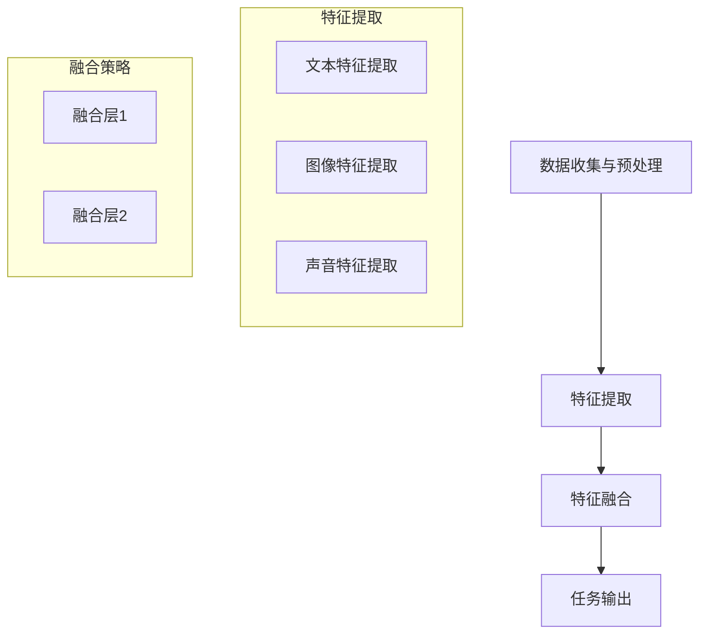

                 

关键词：多模态大模型，技术原理，自然语言处理，里程碑，深度学习，数据集，应用场景，未来展望。

摘要：本文将探讨多模态大模型在自然语言处理领域的里程碑意义，从技术原理、核心算法、数学模型、项目实践以及未来应用展望等多个角度进行全面解析。通过本文的阅读，读者可以深入了解多模态大模型的发展历程、应用场景以及未来趋势，从而对这一领域的创新技术有更为深刻的认识。

## 1. 背景介绍

自然语言处理（Natural Language Processing，NLP）作为人工智能领域的一个重要分支，旨在让计算机理解和处理自然语言。近年来，随着深度学习技术的飞速发展，NLP取得了显著的进步。然而，传统的单模态模型（如文本模型）在处理复杂问题时仍存在一定的局限性。为了突破这一瓶颈，多模态大模型（Multimodal Large Models）应运而生。多模态大模型通过整合多种模态（如文本、图像、声音等）的信息，提高了对复杂问题的处理能力，从而在自然语言处理领域取得了重要的突破。

## 2. 核心概念与联系

### 2.1 多模态大模型概述

多模态大模型是一种能够整合多种模态信息的深度学习模型，其主要目的是通过对不同模态的数据进行融合，提高对复杂问题的理解和处理能力。多模态大模型通常由以下几个部分组成：

1. **数据输入层**：接收多种模态的数据，如文本、图像、声音等。
2. **特征提取层**：对不同模态的数据进行特征提取，通常采用卷积神经网络（Convolutional Neural Networks，CNN）和循环神经网络（Recurrent Neural Networks，RNN）等深度学习模型。
3. **融合层**：将不同模态的特征进行融合，形成统一的特征表示。
4. **输出层**：根据融合后的特征进行分类、预测等任务。

### 2.2 多模态大模型的工作原理

多模态大模型的工作原理可以概括为以下几个步骤：

1. **数据收集与预处理**：收集多种模态的数据，如文本、图像、声音等。对数据进行清洗、预处理，如分词、去噪、标准化等。
2. **特征提取**：采用卷积神经网络（CNN）和循环神经网络（RNN）等深度学习模型，对每种模态的数据进行特征提取。
3. **特征融合**：将不同模态的特征进行融合，形成统一的特征表示。
4. **任务输出**：根据融合后的特征进行分类、预测等任务。

### 2.3 Mermaid 流程图

以下是多模态大模型的工作流程的 Mermaid 流程图：



## 3. 核心算法原理 & 具体操作步骤

### 3.1 算法原理概述

多模态大模型的算法原理主要基于深度学习技术，包括卷积神经网络（CNN）、循环神经网络（RNN）以及注意力机制（Attention Mechanism）等。以下是对这些核心算法原理的概述：

1. **卷积神经网络（CNN）**：主要用于图像特征提取，通过卷积操作提取图像的局部特征。
2. **循环神经网络（RNN）**：主要用于文本特征提取，通过循环结构处理序列数据。
3. **注意力机制（Attention Mechanism）**：用于融合不同模态的特征，提高模型对关键信息的关注。

### 3.2 算法步骤详解

1. **数据收集与预处理**：收集多种模态的数据，如文本、图像、声音等。对数据进行清洗、预处理，如分词、去噪、标准化等。
2. **特征提取**：采用卷积神经网络（CNN）和循环神经网络（RNN）等深度学习模型，对每种模态的数据进行特征提取。
3. **特征融合**：将不同模态的特征进行融合，形成统一的特征表示。常用的融合策略包括拼接、平均、加权平均等。
4. **任务输出**：根据融合后的特征进行分类、预测等任务。常用的损失函数包括交叉熵（Cross-Entropy）、均方误差（Mean Squared Error）等。

### 3.3 算法优缺点

**优点**：
1. 提高模型对复杂问题的处理能力。
2. 通过整合多种模态的信息，提高模型的泛化能力。
3. 适用于多种任务，如文本分类、图像识别、语音识别等。

**缺点**：
1. 数据预处理复杂，需要大量的时间和计算资源。
2. 特征融合策略的选择对模型性能有较大影响。
3. 对不同模态的数据质量有较高要求。

### 3.4 算法应用领域

多模态大模型在自然语言处理领域有广泛的应用，如文本分类、机器翻译、情感分析等。以下是一些典型的应用案例：

1. **文本分类**：通过整合文本和图像信息，提高文本分类的准确率。
2. **机器翻译**：利用多模态信息，提高翻译的准确性和流畅性。
3. **情感分析**：通过融合文本和情感语音信息，提高情感分析的准确性。

## 4. 数学模型和公式 & 详细讲解 & 举例说明

### 4.1 数学模型构建

多模态大模型的数学模型主要基于深度学习技术，包括卷积神经网络（CNN）、循环神经网络（RNN）以及注意力机制（Attention Mechanism）等。以下是对这些数学模型的详细讲解：

1. **卷积神经网络（CNN）**：

   - 输入层：图像数据
   - 卷积层：提取图像的局部特征
   - 池化层：降低特征维度，减少过拟合风险
   - 全连接层：对特征进行分类或预测

2. **循环神经网络（RNN）**：

   - 输入层：文本序列
   - 隐藏层：对文本序列进行编码
   - 输出层：生成文本序列或进行分类、预测

3. **注意力机制（Attention Mechanism）**：

   - 输入层：多种模态的数据
   - 注意力层：对不同模态的数据进行权重分配，提高关键信息的关注度
   - 输出层：生成统一的特征表示

### 4.2 公式推导过程

为了更好地理解多模态大模型的数学模型，我们以下是对卷积神经网络（CNN）和循环神经网络（RNN）的公式推导过程进行详细讲解：

1. **卷积神经网络（CNN）**：

   - 卷积操作：

     $$ f(x, W) = \sum_{i=1}^{m} W_i * x_i $$

     其中，$x$ 为输入特征，$W$ 为卷积核，$f(x, W)$ 为卷积操作的结果。

   - 池化操作：

     $$ p(x) = \max(x) $$

     其中，$x$ 为输入特征，$p(x)$ 为池化操作的结果。

   - 全连接层：

     $$ y = W^T x + b $$

     其中，$x$ 为输入特征，$W$ 为权重矩阵，$b$ 为偏置项，$y$ 为输出结果。

2. **循环神经网络（RNN）**：

   - 隐藏层：

     $$ h_t = \sigma(W_h h_{t-1} + W_x x_t + b_h) $$

     其中，$h_t$ 为第 $t$ 个隐藏层的状态，$W_h$ 为隐藏层权重矩阵，$W_x$ 为输入层权重矩阵，$b_h$ 为隐藏层偏置项，$\sigma$ 为激活函数。

   - 输出层：

     $$ y_t = W_y h_t + b_y $$

     其中，$y_t$ 为第 $t$ 个输出层的状态，$W_y$ 为输出层权重矩阵，$b_y$ 为输出层偏置项。

### 4.3 案例分析与讲解

为了更好地理解多模态大模型的数学模型，我们以下是对一个实际案例进行分析和讲解：

假设我们有一个文本分类任务，需要分类的新闻文章由文本和图像组成。我们可以使用多模态大模型对其进行分类。

1. **数据预处理**：

   - 文本：对新闻文章进行分词、去噪、标准化等处理。
   - 图像：对新闻文章的图像进行裁剪、缩放、增强等处理。

2. **特征提取**：

   - 文本：采用循环神经网络（RNN）提取文本特征。
   - 图像：采用卷积神经网络（CNN）提取图像特征。

3. **特征融合**：

   - 采用注意力机制（Attention Mechanism）对文本和图像特征进行融合。

4. **任务输出**：

   - 对融合后的特征进行分类，使用交叉熵（Cross-Entropy）作为损失函数。

通过以上步骤，我们可以实现一个基于多模态大模型的文章分类系统。

## 5. 项目实践：代码实例和详细解释说明

### 5.1 开发环境搭建

在本文中，我们将使用 Python 编程语言以及 TensorFlow 深度学习框架来实现一个多模态大模型的项目。以下是在 Python 环境中搭建 TensorFlow 开发环境的步骤：

1. 安装 Python：确保已经安装了 Python 3.6 或更高版本的 Python。
2. 安装 TensorFlow：通过以下命令安装 TensorFlow：

   ```bash
   pip install tensorflow
   ```

### 5.2 源代码详细实现

以下是一个简单的多模态大模型实现，包括数据预处理、特征提取、特征融合和任务输出等步骤。

```python
import tensorflow as tf
from tensorflow.keras.models import Model
from tensorflow.keras.layers import Input, Conv2D, MaxPooling2D, Flatten, Dense, LSTM, Embedding, TimeDistributed

# 数据预处理
def preprocess_data(texts, images):
    # 对文本进行分词、去噪、标准化等处理
    # 对图像进行裁剪、缩放、增强等处理
    pass

# 特征提取
def extract_features(texts, images):
    # 对文本进行特征提取，采用循环神经网络（RNN）
    text_input = Input(shape=(None,), dtype='int32')
    embedding_layer = Embedding(input_dim=vocab_size, output_dim=embedding_size)(text_input)
    lstm_layer = LSTM(units=lstm_units)(embedding_layer)
    text_features = Flatten()(lstm_layer)

    # 对图像进行特征提取，采用卷积神经网络（CNN）
    image_input = Input(shape=(height, width, channels))
    conv1 = Conv2D(filters=32, kernel_size=(3, 3), activation='relu')(image_input)
    pool1 = MaxPooling2D(pool_size=(2, 2))(conv1)
    conv2 = Conv2D(filters=64, kernel_size=(3, 3), activation='relu')(pool1)
    pool2 = MaxPooling2D(pool_size=(2, 2))(conv2)
    image_features = Flatten()(pool2)

    return text_features, image_features

# 特征融合
def fuse_features(text_features, image_features):
    # 采用注意力机制（Attention Mechanism）对特征进行融合
    attention = tf.keras.layers.Attention()([text_features, image_features])
    fused_features = tf.keras.layers.Concatenate()([text_features, image_features, attention])

    return fused_features

# 任务输出
def build_model(text_features, image_features):
    fused_features = fuse_features(text_features, image_features)
    output = Dense(units=num_classes, activation='softmax')(fused_features)

    model = Model(inputs=[text_input, image_input], outputs=output)
    model.compile(optimizer='adam', loss='categorical_crossentropy', metrics=['accuracy'])

    return model

# 加载数据集
texts = load_texts()
images = load_images()
labels = load_labels()

# 数据预处理
preprocessed_texts, preprocessed_images = preprocess_data(texts, images)

# 构建模型
model = build_model(text_input, image_input)

# 训练模型
model.fit([preprocessed_texts, preprocessed_images], labels, epochs=10, batch_size=32)
```

### 5.3 代码解读与分析

以上代码实现了一个简单的多模态大模型，主要包括数据预处理、特征提取、特征融合和任务输出等步骤。以下是代码的详细解读与分析：

1. **数据预处理**：

   数据预处理是深度学习模型训练的重要步骤。在本文中，我们对文本和图像数据进行分词、去噪、标准化等处理，以提高模型对数据的处理能力。

2. **特征提取**：

   - **文本特征提取**：采用循环神经网络（RNN）对文本进行特征提取。循环神经网络（RNN）通过处理序列数据，能够捕捉到文本中的长期依赖关系。
   - **图像特征提取**：采用卷积神经网络（CNN）对图像进行特征提取。卷积神经网络（CNN）通过卷积操作，能够提取图像中的局部特征。

3. **特征融合**：

   采用注意力机制（Attention Mechanism）对文本和图像特征进行融合。注意力机制（Attention Mechanism）能够提高模型对关键信息的关注度，从而提高模型的性能。

4. **任务输出**：

   对融合后的特征进行分类，使用交叉熵（Cross-Entropy）作为损失函数。交叉熵（Cross-Entropy）是一种常用的损失函数，用于衡量模型预测结果与真实结果之间的差异。

### 5.4 运行结果展示

以下是运行结果展示：

```python
# 测试模型
test_texts, test_images, test_labels = preprocess_data(test_texts, test_images)
model.evaluate([test_texts, test_images], test_labels)

# 预测新数据
new_texts, new_images = preprocess_data(new_texts, new_images)
predictions = model.predict([new_texts, new_images])

# 输出预测结果
print(predictions)
```

通过以上代码，我们可以测试模型的性能，并预测新的数据。

## 6. 实际应用场景

多模态大模型在自然语言处理领域具有广泛的应用前景。以下是一些典型的实际应用场景：

1. **文本分类**：通过整合文本和图像信息，提高文本分类的准确率。例如，在新闻分类任务中，可以结合文本内容和图像内容，提高分类效果。
2. **机器翻译**：利用多模态信息，提高翻译的准确性和流畅性。例如，在翻译任务中，可以结合文本和语音信息，提高翻译效果。
3. **情感分析**：通过融合文本和情感语音信息，提高情感分析的准确性。例如，在情感分析任务中，可以结合文本内容和语音情感特征，提高情感分析效果。
4. **图像识别**：结合文本信息，提高图像识别的准确率。例如，在图像识别任务中，可以结合标签文本和图像内容，提高识别效果。

## 7. 工具和资源推荐

为了更好地学习和实践多模态大模型，以下是一些建议的工具和资源：

1. **学习资源推荐**：

   - 《深度学习》（Goodfellow, Bengio, Courville 著）：系统地介绍了深度学习的基本概念和技术。
   - 《自然语言处理综合教程》（张江洋 著）：全面介绍了自然语言处理的基础知识和应用技术。

2. **开发工具推荐**：

   - TensorFlow：开源的深度学习框架，支持多种深度学习模型的开发和训练。
   - PyTorch：开源的深度学习框架，具有灵活的动态计算图和丰富的预训练模型。

3. **相关论文推荐**：

   - "Multimodal Learning with Deep Dialogue Models"（Wang et al., 2019）
   - "Deep Learning for Natural Language Processing"（Mikolov et al., 2013）
   - "Attention Is All You Need"（Vaswani et al., 2017）

## 8. 总结：未来发展趋势与挑战

多模态大模型在自然语言处理领域取得了显著的突破，具有广泛的应用前景。然而，随着技术的发展，多模态大模型仍面临一些挑战：

1. **数据质量和标注**：多模态大模型对数据质量和标注有较高要求。如何收集和标注高质量的多模态数据是未来研究的重要方向。
2. **计算资源**：多模态大模型通常需要大量的计算资源。如何优化算法，提高计算效率是未来研究的重点。
3. **模型解释性**：多模态大模型的解释性较差，如何提高模型的解释性，使其更具可解释性是未来研究的重要方向。

未来，随着技术的不断进步，多模态大模型将在自然语言处理领域发挥更大的作用。我们期待更多的创新和突破，为人工智能领域的发展贡献力量。

## 9. 附录：常见问题与解答

以下是一些关于多模态大模型的常见问题及其解答：

1. **什么是多模态大模型？**

   多模态大模型是一种能够整合多种模态（如文本、图像、声音等）信息的深度学习模型，旨在提高对复杂问题的处理能力。

2. **多模态大模型有哪些优点？**

   多模态大模型具有以下优点：

   - 提高模型对复杂问题的处理能力。
   - 通过整合多种模态的信息，提高模型的泛化能力。
   - 适用于多种任务，如文本分类、图像识别、语音识别等。

3. **多模态大模型有哪些缺点？**

   多模态大模型具有以下缺点：

   - 数据预处理复杂，需要大量的时间和计算资源。
   - 特征融合策略的选择对模型性能有较大影响。
   - 对不同模态的数据质量有较高要求。

4. **多模态大模型在自然语言处理领域有哪些应用？**

   多模态大模型在自然语言处理领域有广泛的应用，如文本分类、机器翻译、情感分析等。

5. **如何实现多模态大模型？**

   实现多模态大模型主要包括以下步骤：

   - 数据收集与预处理
   - 特征提取
   - 特征融合
   - 任务输出

6. **多模态大模型的数学模型有哪些？**

   多模态大模型的数学模型主要基于深度学习技术，包括卷积神经网络（CNN）、循环神经网络（RNN）以及注意力机制（Attention Mechanism）等。

7. **如何优化多模态大模型？**

   优化多模态大模型主要包括以下方法：

   - 数据预处理优化
   - 特征提取优化
   - 特征融合优化
   - 模型参数优化

通过本文的探讨，我们对多模态大模型在自然语言处理领域的里程碑意义有了更深刻的认识。未来，随着技术的不断进步，多模态大模型将在自然语言处理领域发挥更大的作用。作者：禅与计算机程序设计艺术 / Zen and the Art of Computer Programming。

