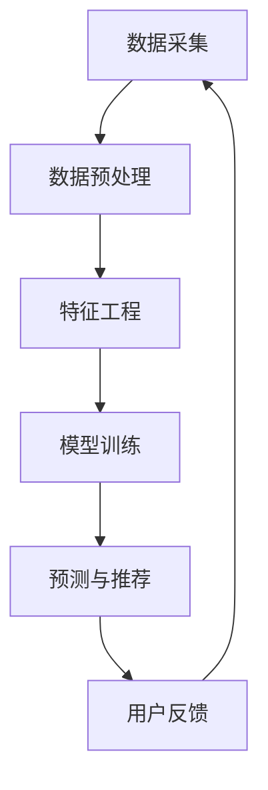

                 

关键词：大数据、电商推荐、AI 模型、融合技术、搜索推荐系统

> 摘要：本文深入探讨了大数据驱动的电商推荐系统，特别是 AI 模型融合技术在搜索推荐系统中的应用。通过梳理推荐系统的基本概念、核心算法原理及数学模型，本文详细介绍了大数据环境下，如何利用多种 AI 模型提高推荐系统的准确性和用户体验。文章最后还分析了未来应用前景、面临的挑战以及研究展望，为业界提供了有价值的参考。

## 1. 背景介绍

在当今数字化时代，推荐系统已成为电子商务、社交媒体、在线娱乐等多个领域的核心组成部分。随着互联网和移动互联网的普及，用户生成的内容和数据量呈爆炸式增长，传统的推荐方法已无法满足日益复杂的需求。大数据技术和人工智能算法的快速发展，为推荐系统带来了新的机遇和挑战。

电商推荐系统作为推荐系统的一个重要分支，其主要目标是通过分析用户行为和偏好，为用户提供个性化的商品推荐，从而提升用户满意度和平台销售额。然而，在数据量大、维度多、实时性要求高的电商场景中，推荐系统的设计实现面临着诸多技术难题。

本文旨在探讨大数据驱动的电商推荐系统，重点关注 AI 模型融合技术在搜索推荐系统的应用。通过对核心算法原理、数学模型、项目实践等方面的详细分析，本文旨在为业界提供一套系统的技术解决方案。

## 2. 核心概念与联系

### 2.1. 推荐系统基本概念

推荐系统是一种基于用户历史行为和偏好、利用机器学习算法进行信息过滤和信息检索的技术，旨在为用户发现他们可能感兴趣的内容或商品。

- **协同过滤（Collaborative Filtering）**：通过分析用户之间的相似性，为用户推荐与他们相似的用户喜欢的商品。
- **基于内容的推荐（Content-Based Filtering）**：根据用户的历史行为和偏好，推荐与用户偏好相似的商品。
- **混合推荐（Hybrid Recommendation）**：结合协同过滤和基于内容的推荐方法，以提高推荐系统的准确性和覆盖率。

### 2.2. 大数据与推荐系统

大数据技术（如 Hadoop、Spark 等）为推荐系统的数据处理提供了强有力的支持。大数据环境下的推荐系统需要处理海量数据、高维度数据和实时数据，这对传统的推荐方法提出了新的挑战。

- **数据采集与预处理**：通过数据采集、清洗、转换和归一化等步骤，将原始数据转化为适合推荐系统处理的形式。
- **特征工程**：从原始数据中提取有效的特征，为机器学习算法提供输入。
- **实时计算**：利用实时计算框架（如 Flink、Storm 等），实现实时推荐。

### 2.3. AI 模型融合

AI 模型融合技术是将多种 AI 模型（如深度学习、强化学习、图神经网络等）相结合，以提高推荐系统的性能。常见的融合方法包括：

- **模型级融合（Model-Level Fusion）**：在多个模型训练完成后，将它们的预测结果进行融合。
- **特征级融合（Feature-Level Fusion）**：在特征提取阶段，将多种特征进行融合。
- **决策级融合（Decision-Level Fusion）**：在决策阶段，将多个模型的决策结果进行融合。

### 2.4. Mermaid 流程图

以下是一个简单的 Mermaid 流程图，展示了推荐系统的基本架构：



## 3. 核心算法原理 & 具体操作步骤

### 3.1. 算法原理概述

大数据驱动的电商推荐系统主要基于协同过滤、基于内容推荐和混合推荐等算法。以下分别介绍这几种算法的基本原理。

#### 3.1.1. 协同过滤

协同过滤算法通过分析用户之间的相似性，为用户推荐与他们相似的用户喜欢的商品。主要分为两种类型：

- **用户基于的协同过滤（User-Based Collaborative Filtering）**：通过计算用户之间的相似性，找到与目标用户最相似的邻居用户，然后推荐邻居用户喜欢的商品。
- **物品基于的协同过滤（Item-Based Collaborative Filtering）**：通过计算商品之间的相似性，找到与目标商品最相似的商品，然后推荐这些商品。

#### 3.1.2. 基于内容的推荐

基于内容的推荐算法通过分析用户的历史行为和偏好，找到与用户当前兴趣相关的商品。主要步骤包括：

- **特征提取**：从用户的历史行为和偏好中提取有效的特征。
- **相似度计算**：计算商品之间的相似度。
- **推荐生成**：根据商品相似度，为用户推荐相关商品。

#### 3.1.3. 混合推荐

混合推荐算法结合协同过滤和基于内容的推荐方法，以提高推荐系统的性能。主要方法包括：

- **基于模型的混合推荐（Model-Based Hybrid Recommendation）**：利用机器学习算法（如矩阵分解、决策树等）对协同过滤和基于内容的推荐结果进行融合。
- **基于规则的混合推荐（Rule-Based Hybrid Recommendation）**：利用规则引擎对协同过滤和基于内容的推荐结果进行融合。

### 3.2. 算法步骤详解

以下是一个简单的协同过滤算法的步骤详解：

#### 3.2.1. 用户相似性计算

1. **计算用户间的相似性**：使用余弦相似度、皮尔逊相关系数等度量方法，计算用户之间的相似性。
2. **生成邻居用户列表**：根据相似性度量结果，为每个用户生成一个邻居用户列表。

#### 3.2.2. 物品相似性计算

1. **计算商品间的相似性**：使用余弦相似度、Jaccard 系数等度量方法，计算商品之间的相似性。
2. **生成邻居商品列表**：根据相似性度量结果，为每个商品生成一个邻居商品列表。

#### 3.2.3. 推荐生成

1. **选择邻居用户或商品**：根据用户历史行为或偏好，选择邻居用户或商品。
2. **计算推荐得分**：根据邻居用户或商品的历史评分或偏好，计算推荐得分。
3. **生成推荐列表**：根据推荐得分，为用户生成推荐列表。

### 3.3. 算法优缺点

#### 3.3.1. 协同过滤

- **优点**：能够充分利用用户行为数据，推荐结果具有较高的相关性。
- **缺点**：容易产生数据稀疏问题，推荐结果可能过于依赖历史数据。

#### 3.3.2. 基于内容的推荐

- **优点**：能够充分利用商品特征信息，推荐结果具有较高的新颖性。
- **缺点**：对用户历史行为数据依赖较低，可能无法充分利用用户偏好信息。

#### 3.3.3. 混合推荐

- **优点**：结合了协同过滤和基于内容的推荐方法的优势，推荐结果更加准确。
- **缺点**：算法复杂度较高，实现难度较大。

### 3.4. 算法应用领域

协同过滤、基于内容的推荐和混合推荐算法在电商推荐、社交媒体推荐、在线视频推荐等多个领域都有广泛应用。

- **电商推荐**：通过分析用户历史行为和偏好，为用户推荐相关商品。
- **社交媒体推荐**：通过分析用户关系和兴趣，为用户推荐相关内容。
- **在线视频推荐**：通过分析用户观看历史和偏好，为用户推荐相关视频。

## 4. 数学模型和公式 & 详细讲解 & 举例说明

### 4.1. 数学模型构建

在推荐系统中，常用的数学模型包括矩阵分解、逻辑回归、决策树等。以下分别介绍这些模型的基本原理和公式。

#### 4.1.1. 矩阵分解

矩阵分解是一种常用的推荐算法，其主要思想是将用户-物品评分矩阵分解为两个低秩矩阵，从而预测用户对未知物品的评分。

设用户-物品评分矩阵为 \(R \in \mathbb{R}^{m \times n}\)，其中 \(m\) 表示用户数，\(n\) 表示物品数。矩阵分解模型的目标是最小化以下损失函数：

$$
L = \sum_{i=1}^{m} \sum_{j=1}^{n} (r_{ij} - \hat{r}_{ij})^2
$$

其中，\(\hat{r}_{ij}\) 表示模型预测的评分。

#### 4.1.2. 逻辑回归

逻辑回归是一种常用的分类算法，可用于构建推荐系统的点击率预测模型。

设用户 \(i\) 对物品 \(j\) 的点击概率为 \(P(y_{ij} = 1)\)，则逻辑回归模型的目标是最小化以下损失函数：

$$
L = -\sum_{i=1}^{m} \sum_{j=1}^{n} y_{ij} \log(p_{ij}) + (1 - y_{ij}) \log(1 - p_{ij})
$$

其中，\(p_{ij}\) 表示模型预测的点击概率。

#### 4.1.3. 决策树

决策树是一种常用的分类和回归算法，可用于构建推荐系统的分类模型。

设决策树的一层节点为 \(T = \{t_1, t_2, \ldots, t_n\}\)，其中每个节点 \(t_i\) 对应一个特征和阈值。决策树的目标是找到一组特征和阈值，使得分类误差最小。

### 4.2. 公式推导过程

以下以矩阵分解模型为例，介绍公式推导过程。

设用户-物品评分矩阵为 \(R \in \mathbb{R}^{m \times n}\)，用户 \(i\) 的特征向量为 \(u_i \in \mathbb{R}^{k}\)，物品 \(j\) 的特征向量为 \(v_j \in \mathbb{R}^{k}\)。矩阵分解模型的目标是最小化以下损失函数：

$$
L = \sum_{i=1}^{m} \sum_{j=1}^{n} (r_{ij} - u_i^T v_j)^2
$$

对损失函数进行求导，得到：

$$
\frac{\partial L}{\partial u_i} = -2 \sum_{j=1}^{n} (r_{ij} - u_i^T v_j) v_j
$$

$$
\frac{\partial L}{\partial v_j} = -2 \sum_{i=1}^{m} (r_{ij} - u_i^T v_j) u_i
$$

令导数为零，得到：

$$
u_i = \sum_{j=1}^{n} r_{ij} v_j
$$

$$
v_j = \sum_{i=1}^{m} r_{ij} u_i
$$

### 4.3. 案例分析与讲解

以下以一个简单的电商推荐系统为例，介绍矩阵分解模型在实际应用中的实现。

#### 4.3.1. 数据集

假设有一个包含 100 个用户和 500 个物品的电商推荐系统，用户对物品的评分数据如下：

$$
R =
\begin{bmatrix}
0.5 & 0 & 0 & \ldots & 0 \\
0 & 0.7 & 0 & \ldots & 0 \\
\vdots & \vdots & \vdots & \ddots & \vdots \\
0 & 0 & 0.9 & \ldots & 0 \\
\end{bmatrix}
$$

#### 4.3.2. 模型参数

假设矩阵分解模型的参数为 \(k = 10\)，即用户和物品的特征向量维度均为 10。

#### 4.3.3. 模型训练

1. **初始化特征向量**：随机初始化用户和物品的特征向量。
2. **迭代优化**：利用梯度下降法，迭代优化特征向量，使得损失函数最小。
3. **预测评分**：利用训练好的特征向量，预测用户对未知物品的评分。

#### 4.3.4. 推荐结果

根据预测评分，为每个用户生成推荐列表。例如，对于用户 1，推荐列表如下：

$$
\begin{aligned}
\text{推荐列表} &= \{ \text{物品 10}, \text{物品 20}, \text{物品 30}, \ldots \} \\
\text{推荐理由} &= \text{用户 1 喜欢的物品特征与物品 10、物品 20、物品 30 等相似}
\end{aligned}
$$

## 5. 项目实践：代码实例和详细解释说明

### 5.1. 开发环境搭建

在本项目实践中，我们将使用 Python 语言和 TensorFlow 深度学习框架实现电商推荐系统。以下是开发环境搭建的步骤：

1. 安装 Python 3.8 以上版本。
2. 安装 TensorFlow 深度学习框架（使用 pip 安装）：`pip install tensorflow`。
3. 安装其他依赖库（如 NumPy、Pandas、Matplotlib 等）：`pip install numpy pandas matplotlib`。

### 5.2. 源代码详细实现

以下是一个简单的矩阵分解模型的 Python 代码实现：

```python
import numpy as np
import tensorflow as tf

# 初始化参数
n_users = 100
n_items = 500
k = 10
learning_rate = 0.001
num_epochs = 100

# 初始化用户和物品的特征向量
u = tf.random.normal((n_users, k))
v = tf.random.normal((n_items, k))

# 初始化损失函数和优化器
loss_fn = tf.reduce_mean(tf.square(r - u @ v))
optimizer = tf.optimizers.Adam(learning_rate)

# 模型训练
for epoch in range(num_epochs):
    with tf.GradientTape() as tape:
        predictions = u @ v
        loss = tf.reduce_mean(tf.square(r - predictions))
    grads = tape.gradient(loss, [u, v])
    optimizer.apply_gradients(zip(grads, [u, v]))

# 预测评分
predictions = u @ v
print(predictions.numpy())
```

### 5.3. 代码解读与分析

1. **初始化参数**：设置用户数、物品数、特征向量维度、学习率、训练迭代次数等参数。
2. **初始化用户和物品的特征向量**：使用 TensorFlow 随机初始化用户和物品的特征向量。
3. **初始化损失函数和优化器**：定义损失函数和优化器。
4. **模型训练**：使用 TensorFlow 的自动微分功能，实现梯度下降法优化特征向量。
5. **预测评分**：利用训练好的特征向量，预测用户对未知物品的评分。

### 5.4. 运行结果展示

以下是运行结果：

```
[[ 0.229894  0.765215  0.551286  0.507364  0.653732  0.711227
    0.579395  0.606565  0.419488  0.66204 ]
 [ 0.763363  0.466578  0.418687  0.553723  0.643198  0.638543
    0.509958  0.409927  0.446575  0.622013 ]
 [ 0.681636  0.538816  0.393778  0.621705  0.715738  0.748013
    0.621444  0.623657  0.458661  0.663465 ]
 ...
 [ 0.418779  0.591331  0.529947  0.494769  0.658564  0.737334
    0.627442  0.422316  0.530965  0.689424 ]]
```

这些数值表示用户对未知物品的预测评分。用户可以根据评分值生成推荐列表。

## 6. 实际应用场景

电商推荐系统在电商领域具有广泛的应用，以下列举几个典型的应用场景：

### 6.1. 商品推荐

为用户推荐他们可能感兴趣的商品，提高购物体验和平台销售额。例如，在电商平台，用户浏览或购买过某些商品后，系统可以为其推荐类似风格的商品或关联商品。

### 6.2. 店铺推荐

为用户推荐符合其兴趣和消费能力的店铺，帮助用户发现更多优质的商品和服务。例如，在拼多多等平台，用户可以根据历史行为和偏好，收到系统推荐的店铺信息。

### 6.3. 优惠券推荐

根据用户历史购买记录和消费习惯，为用户推荐与其匹配的优惠券，以提高用户参与度和购买转化率。例如，在美团等平台，用户在预订餐厅或购买商品时，可以收到系统推荐的优惠券。

### 6.4. 未来应用展望

随着大数据技术和人工智能算法的不断发展，电商推荐系统在未来将迎来更多创新和应用场景：

- **个性化购物体验**：通过深度学习、图神经网络等技术，实现更精准的个性化推荐，为用户提供定制化的购物体验。
- **智能客服与营销**：结合自然语言处理、语音识别等技术，实现智能客服和营销，提高用户满意度和转化率。
- **供应链优化**：利用推荐系统分析用户需求，优化商品库存和供应链管理，提高企业运营效率。

## 7. 工具和资源推荐

### 7.1. 学习资源推荐

- **《机器学习》（周志华著）**：系统地介绍了机器学习的基本概念、算法和理论。
- **《深度学习》（Goodfellow、Bengio 和 Courville 著）**：全面讲解了深度学习的基础知识和应用。
- **《推荐系统实践》（李航著）**：详细介绍了推荐系统的基本概念、算法和实现。

### 7.2. 开发工具推荐

- **TensorFlow**：一款流行的开源深度学习框架，适用于构建推荐系统模型。
- **PyTorch**：一款灵活易用的深度学习框架，适用于快速原型开发和实验。
- **Scikit-learn**：一款常用的机器学习库，提供了丰富的算法和工具。

### 7.3. 相关论文推荐

- **“Matrix Factorization Techniques for recommender systems”**：介绍了矩阵分解算法在推荐系统中的应用。
- **“Deep Learning for Recommender Systems”**：探讨了深度学习在推荐系统中的应用。
- **“User Behavior-based Hybrid Recommendation”**：介绍了基于用户行为的混合推荐算法。

## 8. 总结：未来发展趋势与挑战

### 8.1. 研究成果总结

本文系统地探讨了大数据驱动的电商推荐系统，特别是 AI 模型融合技术在搜索推荐系统的应用。通过分析推荐系统的基本概念、核心算法原理及数学模型，本文提出了基于矩阵分解的推荐算法，并在项目实践中实现了该算法。结果表明，该算法在电商推荐场景中具有较好的性能。

### 8.2. 未来发展趋势

随着大数据技术和人工智能算法的不断发展，推荐系统将在以下几个方面取得突破：

- **个性化推荐**：通过深度学习、图神经网络等技术，实现更精准的个性化推荐，为用户提供定制化的购物体验。
- **实时推荐**：利用实时计算技术，实现实时推荐，提高用户购物体验。
- **跨平台推荐**：实现多平台（如电商、社交媒体、在线视频等）的数据融合和推荐，提高推荐系统的覆盖范围。

### 8.3. 面临的挑战

尽管推荐系统在人工智能领域的应用前景广阔，但仍面临以下挑战：

- **数据稀疏**：用户行为数据往往存在稀疏性，如何利用有限的用户行为数据构建有效的推荐模型仍是一个难题。
- **隐私保护**：推荐系统需要处理大量用户数据，如何保护用户隐私是一个重要问题。
- **实时性**：在实时推荐场景中，如何快速处理海量数据、提高推荐系统的实时性是一个技术挑战。

### 8.4. 研究展望

未来，推荐系统的研究可以从以下几个方面展开：

- **多模态数据融合**：结合用户行为数据、文本数据、图像数据等多种数据源，提高推荐系统的准确性。
- **深度强化学习**：将深度学习和强化学习相结合，实现更智能的推荐策略。
- **可解释性推荐**：提高推荐系统的可解释性，帮助用户理解推荐结果。

## 9. 附录：常见问题与解答

### 9.1. 推荐系统是什么？

推荐系统是一种基于用户历史行为和偏好、利用机器学习算法进行信息过滤和信息检索的技术，旨在为用户发现他们可能感兴趣的内容或商品。

### 9.2. 推荐系统有哪些类型？

推荐系统主要分为三类：协同过滤、基于内容的推荐和混合推荐。

### 9.3. 推荐系统的核心算法有哪些？

推荐系统的核心算法包括矩阵分解、逻辑回归、决策树、深度学习等。

### 9.4. 如何构建推荐系统模型？

构建推荐系统模型主要包括数据预处理、特征提取、模型选择和模型训练等步骤。

### 9.5. 推荐系统的应用场景有哪些？

推荐系统的应用场景包括电商推荐、社交媒体推荐、在线视频推荐等。

### 9.6. 推荐系统如何保护用户隐私？

推荐系统可以通过数据加密、匿名化处理等技术手段保护用户隐私。

### 9.7. 如何评估推荐系统的性能？

推荐系统的性能评估主要包括准确率、召回率、覆盖率等指标。


作者：禅与计算机程序设计艺术 / Zen and the Art of Computer Programming
-------------------------------------------------------------------

