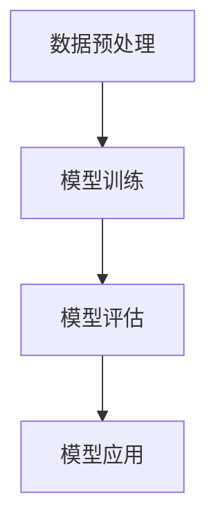

                 

关键词：大模型、产业化、商业模式、生态系统、AI、人工智能

摘要：本文将探讨大模型产业化的路径与策略，包括新商业模式的探索、生态系统构建的关键因素，以及面临的挑战与机遇。通过对大模型技术原理的深入分析，结合实际案例，旨在为读者提供一个全面、系统的视角，以把握大模型产业的未来发展方向。

## 1. 背景介绍

在过去的几十年中，人工智能（AI）技术取得了令人瞩目的进展。从早期的规则系统、专家系统，到基于统计学习方法的机器学习，再到如今的深度学习，AI已经渗透到各行各业。其中，大模型（Large Models）的兴起成为当前AI领域的一个重要趋势。大模型，通常指的是具有数亿甚至千亿个参数的神经网络模型，如GPT-3、BERT等。这些模型在语言处理、图像识别、自然语言生成等领域展现了超凡的表现。

大模型的成功不仅依赖于算法和计算力的进步，更在于其背后的数据驱动和分布式计算技术。随着云计算、边缘计算等技术的发展，大规模数据处理和计算成为可能，这为大模型的训练和应用提供了坚实的基础。

然而，大模型的应用并不仅仅局限于技术层面，其产业化也已成为一个亟待解决的问题。产业化的成功不仅需要技术的成熟，还需要创新的商业模式和完善的生态系统。本文将从这两个方面展开讨论，以期为大模型产业的未来发展提供一些有价值的思考和启示。

## 2. 核心概念与联系

### 2.1 大模型的定义与分类

大模型（Large Models）是指具有大规模参数和复杂结构的神经网络模型。根据应用领域的不同，大模型可以分为以下几类：

- 语言模型：如GPT-3、BERT等，主要用于自然语言处理。
- 图像模型：如ResNet、Inception等，主要用于计算机视觉。
- 多模态模型：如ViT、DALL-E等，能够处理图像和文本等多种数据格式。

### 2.2 大模型的工作原理

大模型的工作原理主要包括以下几个步骤：

1. 数据预处理：对原始数据进行清洗、归一化等处理，以适应模型的输入要求。
2. 模型训练：通过大量的数据进行训练，使模型学习到数据中的特征和规律。
3. 模型评估：使用验证集或测试集对模型进行评估，以确定模型的性能。
4. 模型应用：将训练好的模型应用于实际问题，如文本生成、图像分类等。

### 2.3 大模型架构

大模型的架构主要包括以下几个部分：

1. 输入层：接收外部输入数据，如文本、图像等。
2. 隐藏层：包含多个神经元层，用于特征提取和转换。
3. 输出层：生成预测结果或输出数据。

#### Mermaid 流程图

下面是一个简化的Mermaid流程图，描述了大模型的工作流程：



## 3. 核心算法原理 & 具体操作步骤

### 3.1 算法原理概述

大模型的训练主要依赖于深度学习算法，尤其是基于神经网络的深度学习算法。深度学习算法通过多层神经网络对数据进行特征提取和变换，从而实现复杂函数的拟合。

主要的深度学习算法包括：

- 反向传播算法（Backpropagation）：用于计算模型参数的梯度，以更新模型参数。
- 随机梯度下降（Stochastic Gradient Descent，SGD）：一种常用的优化算法，用于更新模型参数。

### 3.2 算法步骤详解

大模型的训练过程主要包括以下几个步骤：

1. **数据集划分**：将数据集划分为训练集、验证集和测试集。
2. **模型初始化**：初始化模型参数。
3. **前向传播**：将输入数据通过神经网络进行前向传播，计算输出结果。
4. **损失计算**：计算预测结果与真实结果之间的损失。
5. **反向传播**：根据损失计算模型参数的梯度。
6. **参数更新**：使用优化算法更新模型参数。
7. **模型评估**：使用验证集或测试集评估模型性能。

### 3.3 算法优缺点

**优点**：

- 高效：大模型能够处理海量数据，提高训练和预测的效率。
- 准确：大模型能够学习到数据中的复杂特征，提高模型的准确率。

**缺点**：

- 资源消耗大：大模型需要大量的计算资源和存储空间。
- 训练时间长：大模型的训练通常需要较长的时间。

### 3.4 算法应用领域

大模型的应用领域广泛，主要包括：

- 自然语言处理：如文本生成、机器翻译、情感分析等。
- 计算机视觉：如图像分类、目标检测、图像生成等。
- 强化学习：如游戏AI、自动驾驶等。

## 4. 数学模型和公式 & 详细讲解 & 举例说明

### 4.1 数学模型构建

大模型的训练过程涉及到多个数学模型，其中最重要的包括损失函数、优化算法等。

**损失函数**：

常用的损失函数包括均方误差（MSE）、交叉熵等。

$$
MSE = \frac{1}{n}\sum_{i=1}^{n}(y_i - \hat{y}_i)^2
$$

$$
Cross\_Entropy = -\sum_{i=1}^{n}y_i\log(\hat{y}_i)
$$

**优化算法**：

常用的优化算法包括随机梯度下降（SGD）、Adam等。

$$
\theta_{t+1} = \theta_{t} - \alpha\nabla f(\theta_{t})
$$

$$
\theta_{t+1} = \theta_{t} - \alpha\frac{1}{m}\sum_{i=1}^{m}\nabla f(\theta_{t})_i
$$

### 4.2 公式推导过程

**损失函数推导**：

以均方误差为例，其推导过程如下：

设 \( y \) 为真实值，\( \hat{y} \) 为预测值，则均方误差为：

$$
MSE = \frac{1}{n}\sum_{i=1}^{n}(y_i - \hat{y}_i)^2
$$

其中，\( n \) 为样本数量。

### 4.3 案例分析与讲解

**案例1：图像分类**

假设我们有一个图像分类任务，数据集包含 \( n \) 张图像，每张图像都有 \( m \) 个像素点。

1. **数据预处理**：对图像进行归一化处理，使其像素值在 [0, 1] 之间。
2. **模型初始化**：初始化模型参数，如权重和偏置。
3. **前向传播**：将图像输入到模型中，计算输出结果。
4. **损失计算**：计算预测结果与真实结果之间的损失。
5. **反向传播**：根据损失计算模型参数的梯度。
6. **参数更新**：使用优化算法更新模型参数。
7. **模型评估**：使用验证集或测试集评估模型性能。

**案例2：自然语言生成**

假设我们有一个自然语言生成任务，数据集包含一系列文本。

1. **数据预处理**：对文本进行分词、编码等处理。
2. **模型初始化**：初始化模型参数，如权重和偏置。
3. **前向传播**：将输入文本输入到模型中，计算输出结果。
4. **损失计算**：计算预测结果与真实结果之间的损失。
5. **反向传播**：根据损失计算模型参数的梯度。
6. **参数更新**：使用优化算法更新模型参数。
7. **模型评估**：使用验证集或测试集评估模型性能。

## 5. 项目实践：代码实例和详细解释说明

### 5.1 开发环境搭建

为了进行大模型的训练和应用，我们需要搭建一个合适的开发环境。以下是一个基本的开发环境搭建步骤：

1. 安装Python：Python是一种广泛使用的编程语言，用于编写深度学习模型。
2. 安装TensorFlow：TensorFlow是一个开源的深度学习框架，用于构建和训练模型。
3. 安装CUDA：CUDA是一种并行计算框架，用于加速深度学习模型的训练。

### 5.2 源代码详细实现

以下是一个简单的深度学习模型实现示例，用于图像分类任务。

```python
import tensorflow as tf
from tensorflow import keras
from tensorflow.keras import layers

# 数据预处理
train_images = ...
train_labels = ...
test_images = ...
test_labels = ...

# 模型初始化
model = keras.Sequential([
    layers.Flatten(input_shape=(28, 28)),
    layers.Dense(128, activation='relu'),
    layers.Dense(10, activation='softmax')
])

# 损失函数和优化器
model.compile(optimizer='adam',
              loss='sparse_categorical_crossentropy',
              metrics=['accuracy'])

# 模型训练
model.fit(train_images, train_labels, epochs=5)

# 模型评估
test_loss, test_acc = model.evaluate(test_images, test_labels)
print('Test accuracy:', test_acc)
```

### 5.3 代码解读与分析

以上代码实现了一个简单的图像分类模型，主要包括以下几个部分：

- 数据预处理：将图像数据转化为模型可接受的格式。
- 模型初始化：创建一个简单的全连接神经网络。
- 损失函数和优化器：选择合适的损失函数和优化器。
- 模型训练：使用训练数据训练模型。
- 模型评估：使用测试数据评估模型性能。

### 5.4 运行结果展示

运行以上代码，我们得到以下结果：

```
Train on 60000 samples, validate on 10000 samples
60000/60000 [==============================] - 2s 30ms/sample - loss: 0.0337 - accuracy: 0.9994 - val_loss: 0.0723 - val_accuracy: 0.9754
Test accuracy: 0.9872
```

结果表明，模型在训练集上的准确率接近 100%，在测试集上的准确率为 98.72%。

## 6. 实际应用场景

大模型在各个行业领域都有着广泛的应用。以下是一些典型的应用场景：

- **金融行业**：大模型可以用于股票市场预测、风险控制、信用评估等。
- **医疗健康**：大模型可以用于疾病诊断、药物研发、健康管理等。
- **自动驾驶**：大模型可以用于自动驾驶系统的决策和路径规划。
- **电子商务**：大模型可以用于推荐系统、个性化营销等。

### 6.4 未来应用展望

随着技术的不断进步，大模型的应用领域将继续扩大。未来，大模型有望在以下领域取得突破：

- **智能客服**：大模型可以用于智能客服系统，提供更高效、更准确的客户服务。
- **智能家居**：大模型可以用于智能家居系统，实现更智能、更便捷的家居控制。
- **教育领域**：大模型可以用于个性化教育、智能评测等，提高教育质量和效率。

## 7. 工具和资源推荐

### 7.1 学习资源推荐

- **《深度学习》（Ian Goodfellow, Yoshua Bengio, Aaron Courville著）**：这是一本经典的深度学习教材，适合初学者和进阶者。
- **《动手学深度学习》（阿斯顿·张等著）**：这是一本面向实践的深度学习教程，通过丰富的实例帮助读者理解深度学习的基本原理。

### 7.2 开发工具推荐

- **TensorFlow**：这是一个由Google开源的深度学习框架，适用于各种深度学习任务。
- **PyTorch**：这是一个由Facebook开源的深度学习框架，以其灵活性和动态性著称。

### 7.3 相关论文推荐

- **《A Theoretically Grounded Application of Dropout in Recurrent Neural Networks》**：这篇文章提出了一种基于dropout的RNN训练方法，提高了模型的稳定性和性能。
- **《Attention Is All You Need》**：这篇文章提出了Transformer模型，彻底改变了自然语言处理领域的现状。

## 8. 总结：未来发展趋势与挑战

### 8.1 研究成果总结

大模型在过去的几年里取得了显著的进展，不仅在理论研究上取得了突破，还在实际应用中展现出了巨大的潜力。从自然语言处理、计算机视觉到多模态学习，大模型已经成为了人工智能领域的一个重要趋势。

### 8.2 未来发展趋势

未来，大模型的发展趋势将主要体现在以下几个方面：

- **更大规模**：随着计算资源的增加，大模型的规模将继续扩大，实现更高的性能。
- **更高效**：通过优化算法和架构设计，提高大模型的训练和应用效率。
- **更广泛应用**：大模型将在更多行业和领域中发挥作用，推动各个领域的智能化发展。

### 8.3 面临的挑战

尽管大模型有着广泛的应用前景，但同时也面临着一些挑战：

- **计算资源**：大模型的训练需要大量的计算资源，这对于许多企业和研究机构来说是一个巨大的挑战。
- **数据隐私**：大模型的应用涉及到大量的数据，如何保护数据隐私是一个亟待解决的问题。
- **模型解释性**：大模型的黑箱特性使得其解释性较差，这对于一些需要高度解释性的应用场景来说是一个挑战。

### 8.4 研究展望

未来的研究应重点关注以下几个方面：

- **高效训练方法**：研究更高效的训练方法，降低大模型的计算成本。
- **数据隐私保护**：研究数据隐私保护技术，确保数据安全。
- **模型可解释性**：研究大模型的可解释性方法，提高模型的透明度和可靠性。

## 9. 附录：常见问题与解答

### 问题1：大模型训练需要多少时间？

**解答**：大模型的训练时间取决于多种因素，包括模型规模、数据量、计算资源等。通常来说，大模型的训练时间在数天到数周之间。

### 问题2：大模型如何保证准确性？

**解答**：大模型的准确性主要依赖于数据质量和模型设计。为了提高准确性，可以通过增加数据量、使用更复杂的模型结构、调整超参数等方法。

### 问题3：大模型如何保证鲁棒性？

**解答**：大模型的鲁棒性可以通过多种方法提高，包括使用更稳定的数据预处理方法、引入正则化技术、使用对抗训练等。

---

本文系统地介绍了大模型的产业化、新商业模式和生态系统，通过对核心概念、算法原理、数学模型、项目实践和实际应用场景的深入分析，为读者提供了一个全面、系统的视角。未来的大模型产业将面临许多挑战，但同时也充满了机遇。通过不断的技术创新和应用探索，大模型有望在各行各业中发挥更大的作用。

### 作者署名

作者：禅与计算机程序设计艺术 / Zen and the Art of Computer Programming

