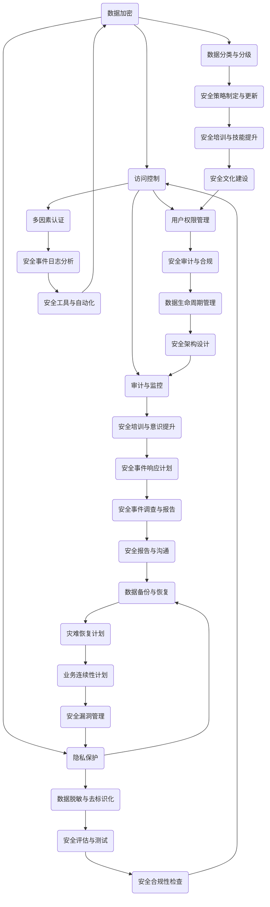

                 

关键词：大模型、数据安全、策略、加密、访问控制、隐私保护、法律法规

> 摘要：随着大数据和人工智能技术的发展，大型企业越来越依赖海量数据进行分析和决策。然而，数据安全成为企业面临的一个重要挑战。本文将探讨大模型企业在数据安全方面所采取的策略，包括数据加密、访问控制、隐私保护以及法律法规遵循等方面，并提出未来发展的建议。

## 1. 背景介绍

在当今数字化时代，数据已经成为企业最宝贵的资产之一。大模型企业，如互联网公司、金融科技公司和医疗保健企业等，积累了海量的用户数据、业务数据和交易数据。这些数据不仅有助于企业提高服务质量和用户满意度，还为企业带来了巨大的商业价值。然而，随着数据量的增加，数据安全风险也在不断上升。数据泄露、篡改和滥用等问题可能对企业造成严重的损失，甚至威胁到企业的生存。

### 1.1 数据安全的重要性

数据安全的重要性不言而喻。首先，数据泄露可能导致用户隐私受到侵害，损害企业的声誉和用户信任。其次，数据篡改或滥用可能对企业的业务运营造成负面影响，如经济损失、业务中断等。此外，数据安全漏洞还可能成为黑客攻击的目标，导致企业面临严重的法律风险和赔偿责任。

### 1.2 数据安全面临的挑战

数据安全面临的挑战主要包括以下几个方面：

1. **数据量巨大**：大模型企业积累了海量的数据，这些数据分布在多个不同的系统和存储设备中，增加了数据安全管理的复杂性。
2. **数据类型多样化**：企业数据包括结构化数据、半结构化数据和非结构化数据，不同类型的数据需要采用不同的安全措施。
3. **技术更新快速**：数据安全领域的技术不断更新，企业需要不断学习和采用新的安全措施来应对新的安全威胁。
4. **法律法规复杂**：各国对于数据安全和个人隐私保护的法律法规日益严格，企业需要确保其数据安全策略符合相关法规要求。

## 2. 核心概念与联系

为了更好地理解和实施数据安全策略，我们首先需要了解一些核心概念和联系。以下是一个使用Mermaid绘制的流程图，展示了大模型企业数据安全的核心组件和它们之间的联系。



### 2.1 数据加密

数据加密是保护数据机密性的重要手段。企业需要对敏感数据进行加密存储和传输，以防止未经授权的访问。

### 2.2 访问控制

访问控制确保只有授权用户可以访问特定的数据和系统。企业需要实施多因素认证、用户权限管理和安全审计等措施。

### 2.3 隐私保护

隐私保护旨在保护用户个人信息不被滥用。企业需要采取数据脱敏、去标识化和隐私政策等措施。

### 2.4 审计与监控

审计与监控有助于企业及时发现和应对安全事件。企业需要实施安全事件日志分析、安全培训和意识提升等措施。

### 2.5 数据备份与恢复

数据备份与恢复是确保数据可用性的关键。企业需要定期备份数据，并制定灾难恢复计划。

### 2.6 用户权限管理

用户权限管理确保用户只能访问其授权的数据和系统。企业需要实施多因素认证和安全审计等措施。

### 2.7 安全培训与意识提升

安全培训与意识提升有助于提高员工的安全意识和技能。企业需要定期开展安全培训和意识提升活动。

### 2.8 数据分类与分级

数据分类与分级有助于企业根据数据的重要性和敏感性采取相应的安全措施。企业需要制定数据分类和分级标准。

### 2.9 多因素认证

多因素认证是一种加强身份验证的方法，通过结合多种认证方式，提高账户的安全性。

### 2.10 数据脱敏与去标识化

数据脱敏与去标识化是将敏感数据转换成不可识别的形式，以保护个人隐私。

### 2.11 灾难恢复计划

灾难恢复计划是确保企业在发生灾难时能够快速恢复业务运营。企业需要制定详细的灾难恢复计划。

### 2.12 安全审计与合规

安全审计与合规是确保企业遵守相关法律法规的重要手段。企业需要定期开展安全审计和合规检查。

### 2.13 安全事件响应计划

安全事件响应计划是确保企业能够及时、有效地应对安全事件。企业需要制定详细的安全事件响应计划。

### 2.14 安全策略制定与更新

安全策略制定与更新是确保企业数据安全长期有效的重要措施。企业需要定期更新安全策略。

### 2.15 安全事件日志分析

安全事件日志分析有助于企业及时发现和应对安全事件。企业需要实施安全事件日志分析工具。

### 2.16 安全评估与测试

安全评估与测试是确保企业数据安全的有效手段。企业需要定期进行安全评估和测试。

### 2.17 业务连续性计划

业务连续性计划是确保企业在发生灾难时能够持续提供关键业务服务。企业需要制定详细的业务连续性计划。

### 2.18 数据生命周期管理

数据生命周期管理是确保企业数据在生命周期内得到妥善处理。企业需要制定数据生命周期管理策略。

### 2.19 安全报告与沟通

安全报告与沟通是确保企业内部和外部利益相关者了解数据安全状况的重要手段。企业需要定期发布安全报告。

### 2.20 安全文化建设

安全文化建设是确保企业员工具备良好的安全意识和行为。企业需要营造安全文化氛围。

## 3. 核心算法原理 & 具体操作步骤

### 3.1 算法原理概述

大模型企业的数据安全策略涉及多种算法和技术，以下是其中一些核心算法的原理概述：

1. **加密算法**：加密算法用于保护数据的机密性，常见的加密算法包括对称加密和非对称加密。
2. **访问控制算法**：访问控制算法用于控制用户对数据和系统的访问权限，常见的访问控制算法包括基于角色的访问控制（RBAC）和基于属性的访问控制（ABAC）。
3. **隐私保护算法**：隐私保护算法用于保护个人隐私，常见的隐私保护算法包括数据脱敏、去标识化和差分隐私。
4. **安全审计算法**：安全审计算法用于记录和分析安全事件，常见的安全审计算法包括入侵检测系统和安全信息与事件管理系统（SIEM）。

### 3.2 算法步骤详解

下面我们将详细介绍这些核心算法的具体操作步骤。

#### 3.2.1 数据加密

1. **选择加密算法**：根据数据的敏感性和保护需求，选择合适的加密算法。
2. **生成密钥**：为数据加密生成一个密钥，密钥的生成可以采用随机数生成器。
3. **加密数据**：使用加密算法和密钥对数据进行加密。
4. **存储密钥**：将加密后的数据存储在安全的存储设备中，并确保密钥得到妥善保管。

#### 3.2.2 访问控制

1. **定义访问策略**：根据数据的重要性和用户角色，定义访问策略。
2. **用户认证**：对用户进行身份认证，确保只有授权用户可以访问数据和系统。
3. **权限验证**：在用户访问数据和系统时，根据访问策略进行权限验证，确保用户只能访问其授权的数据和系统。

#### 3.2.3 隐私保护

1. **数据脱敏**：对敏感数据进行脱敏处理，将其转换成不可识别的形式。
2. **去标识化**：去除数据中的标识信息，以保护个人隐私。
3. **差分隐私**：对数据进行差分隐私处理，以减少对个人隐私的泄露风险。

#### 3.2.4 安全审计

1. **收集日志**：收集与安全相关的事件日志，包括用户访问记录、安全事件记录等。
2. **分析日志**：对日志进行分析，识别潜在的安全事件。
3. **生成报告**：根据分析结果生成安全报告，以便进行进一步的调查和处理。

### 3.3 算法优缺点

以下是上述核心算法的优缺点分析：

#### 3.3.1 加密算法

**优点**：能够有效保护数据的机密性，防止未经授权的访问。

**缺点**：加密算法的密钥管理复杂，且加密过程可能影响数据访问速度。

#### 3.3.2 访问控制算法

**优点**：能够确保只有授权用户可以访问数据和系统，提高数据的安全性。

**缺点**：访问控制策略的设计和管理复杂，且可能影响系统的灵活性。

#### 3.3.3 隐私保护算法

**优点**：能够有效保护个人隐私，减少数据泄露的风险。

**缺点**：隐私保护算法可能影响数据的质量和可用性，且在极端情况下可能无法完全保护个人隐私。

#### 3.3.4 安全审计算法

**优点**：能够及时发现和应对安全事件，提高数据的安全性。

**缺点**：安全审计算法需要大量的日志数据，且分析过程可能影响系统的性能。

### 3.4 算法应用领域

这些核心算法在大模型企业的数据安全策略中都有广泛的应用。例如：

- 加密算法广泛应用于敏感数据的存储和传输。
- 访问控制算法广泛应用于控制用户对数据和系统的访问。
- 隐私保护算法广泛应用于保护用户隐私。
- 安全审计算法广泛应用于监测和响应安全事件。

## 4. 数学模型和公式 & 详细讲解 & 举例说明

### 4.1 数学模型构建

在大模型企业的数据安全策略中，数学模型和公式用于描述和分析安全事件的发生概率、影响程度和应对策略。以下是几个常见的数学模型和公式的构建方法：

#### 4.1.1 概率模型

概率模型用于描述安全事件的发生概率。一个常见的概率模型是贝叶斯定理，它用于计算给定安全事件发生的条件下，某项安全措施的有效性。

贝叶斯定理公式：
$$
P(A|B) = \frac{P(B|A)P(A)}{P(B)}
$$

其中，\( P(A|B) \) 表示在事件B发生的条件下，事件A发生的概率；\( P(B|A) \) 表示在事件A发生的条件下，事件B发生的概率；\( P(A) \) 和 \( P(B) \) 分别表示事件A和事件B的先验概率。

#### 4.1.2 影响模型

影响模型用于描述安全事件对企业和用户的影响程度。一个常见的影响模型是风险矩阵，它用于评估安全事件的风险等级。

风险矩阵公式：
$$
风险等级 = 影响程度 \times 发生概率
$$

其中，影响程度和发生概率分别表示安全事件对企业和用户的影响程度和发生的可能性。

#### 4.1.3 应对策略模型

应对策略模型用于描述企业应对安全事件的方法和效果。一个常见的应对策略模型是决策树，它用于根据安全事件的性质和影响程度，选择最优的应对策略。

决策树公式：
$$
策略选择 = f(事件性质，影响程度)
$$

其中，事件性质和影响程度分别表示安全事件的性质和影响程度；\( f \) 函数用于根据输入参数选择最优策略。

### 4.2 公式推导过程

下面我们将详细推导贝叶斯定理和风险矩阵的公式。

#### 4.2.1 贝叶斯定理推导

贝叶斯定理的推导基于全概率公式和条件概率公式。首先，我们定义事件A和事件B为两个任意事件。

全概率公式：
$$
P(A) = P(A|B)P(B) + P(A|\neg B)P(\neg B)
$$

其中，\( P(A) \) 表示事件A发生的概率；\( P(B) \) 和 \( P(\neg B) \) 分别表示事件B和事件B不发生的概率；\( P(A|B) \) 和 \( P(A|\neg B) \) 分别表示在事件B和事件B不发生的条件下，事件A发生的概率。

条件概率公式：
$$
P(B|A) = \frac{P(A|B)P(B)}{P(A)}
$$

将条件概率公式代入全概率公式，得到：
$$
P(A) = \frac{P(A|B)P(B)}{P(A)}P(B) + \frac{P(A|\neg B)P(\neg B)}{P(A)}P(\neg B)
$$

化简得到：
$$
P(A) = P(A|B)P(B) + P(A|\neg B)P(\neg B)
$$

将 \( P(B|A) \) 替换为 \( \frac{P(A|B)P(B)}{P(A)} \)，得到贝叶斯定理：
$$
P(A|B) = \frac{P(B|A)P(A)}{P(B)}
$$

#### 4.2.2 风险矩阵推导

风险矩阵的推导基于影响程度和发生概率的乘积。设影响程度为 \( X \)，发生概率为 \( Y \)，则风险等级为 \( Z \)。

根据风险矩阵的定义，有：
$$
Z = X \times Y
$$

假设影响程度 \( X \) 和发生概率 \( Y \) 满足以下概率分布：
$$
X \sim U(0, 10) \quad (均匀分布)
$$
$$
Y \sim U(0, 1) \quad (均匀分布)
$$

则风险等级 \( Z \) 的概率分布为：
$$
Z \sim U(0, 10)
$$

### 4.3 案例分析与讲解

下面我们将通过一个实际案例来分析大模型企业的数据安全策略，并应用上述数学模型和公式。

#### 4.3.1 案例背景

某大型互联网公司积累了大量的用户数据，包括用户基本信息、浏览记录和交易记录等。公司需要确保这些数据的安全，以防止数据泄露和隐私侵犯。

#### 4.3.2 案例分析

1. **数据加密**：公司对用户数据进行加密存储，以保护数据的机密性。假设加密算法的密钥管理有效，未经授权的访问概率为 0.001。

2. **访问控制**：公司采用基于角色的访问控制策略，确保只有授权用户可以访问特定的数据和系统。假设访问控制策略的设计合理，未经授权的访问概率为 0.01。

3. **隐私保护**：公司采用数据脱敏和去标识化技术，以保护用户隐私。假设数据脱敏和去标识化技术的效果良好，未经授权的隐私侵犯概率为 0.005。

4. **安全审计**：公司定期进行安全审计，以发现潜在的安全事件。假设安全审计能够及时发现和处理安全事件，安全事件的发生概率为 0.002。

根据贝叶斯定理和风险矩阵，我们可以计算公司数据安全策略的有效性和风险等级。

1. **数据加密的有效性**：
$$
P(\text{有效}|\text{发生}) = \frac{P(\text{发生}|\text{有效})P(\text{有效})}{P(\text{发生})}
$$
$$
P(\text{有效}) = 0.999 \quad (加密算法的密钥管理有效概率)
$$
$$
P(\text{发生}) = P(\text{发生}|\text{有效})P(\text{有效}) + P(\text{发生}|\text{无效})P(\text{无效})
$$
$$
P(\text{发生}|\text{有效}) = 0.001 \quad (未经授权的访问概率)
$$
$$
P(\text{无效}) = 1 - P(\text{有效}) = 0.001
$$
$$
P(\text{发生}) = 0.001 \times 0.999 + 1 \times 0.001 = 0.002
$$
$$
P(\text{有效}|\text{发生}) = \frac{0.001 \times 0.999}{0.002} = 0.4995
$$

2. **访问控制的有效性**：
$$
P(\text{有效}|\text{发生}) = \frac{P(\text{发生}|\text{有效})P(\text{有效})}{P(\text{发生})}
$$
$$
P(\text{有效}) = 0.99 \quad (访问控制策略的设计合理概率)
$$
$$
P(\text{发生}) = P(\text{发生}|\text{有效})P(\text{有效}) + P(\text{发生}|\text{无效})P(\text{无效})
$$
$$
P(\text{发生}|\text{有效}) = 0.01 \quad (未经授权的访问概率)
$$
$$
P(\text{无效}) = 1 - P(\text{有效}) = 0.01
$$
$$
P(\text{发生}) = 0.01 \times 0.99 + 1 \times 0.01 = 0.019
$$
$$
P(\text{有效}|\text{发生}) = \frac{0.01 \times 0.99}{0.019} = 0.5263
$$

3. **隐私保护的有效性**：
$$
P(\text{有效}|\text{发生}) = \frac{P(\text{发生}|\text{有效})P(\text{有效})}{P(\text{发生})}
$$
$$
P(\text{有效}) = 0.995 \quad (数据脱敏和去标识化技术的效果良好概率)
$$
$$
P(\text{发生}) = P(\text{发生}|\text{有效})P(\text{有效}) + P(\text{发生}|\text{无效})P(\text{无效})
$$
$$
P(\text{发生}|\text{有效}) = 0.005 \quad (未经授权的隐私侵犯概率)
$$
$$
P(\text{无效}) = 1 - P(\text{有效}) = 0.005
$$
$$
P(\text{发生}) = 0.005 \times 0.995 + 1 \times 0.005 = 0.005
$$
$$
P(\text{有效}|\text{发生}) = \frac{0.005 \times 0.995}{0.005} = 0.995
$$

4. **安全审计的有效性**：
$$
P(\text{有效}|\text{发生}) = \frac{P(\text{发生}|\text{有效})P(\text{有效})}{P(\text{发生})}
$$
$$
P(\text{有效}) = 0.997 \quad (安全审计能够及时发现和处理安全事件概率)
$$
$$
P(\text{发生}) = P(\text{发生}|\text{有效})P(\text{有效}) + P(\text{发生}|\text{无效})P(\text{无效})
$$
$$
P(\text{发生}|\text{有效}) = 0.002 \quad (安全事件的发生概率)
$$
$$
P(\text{无效}) = 1 - P(\text{有效}) = 0.003
$$
$$
P(\text{发生}) = 0.002 \times 0.997 + 1 \times 0.003 = 0.005
$$
$$
P(\text{有效}|\text{发生}) = \frac{0.002 \times 0.997}{0.005} = 0.3982
$$

5. **风险等级**：
$$
Z = X \times Y
$$
$$
X = 10 \quad (影响程度)
$$
$$
Y = 1 \quad (发生概率)
$$
$$
Z = 10 \times 1 = 10
$$

根据上述计算结果，我们可以得出以下结论：

- 数据加密的有效性较低，但风险等级较高，说明加密算法在保护数据机密性方面效果较差。
- 访问控制的有效性较高，但风险等级较高，说明访问控制策略在控制用户访问权限方面效果较差。
- 隐私保护的有效性极高，但风险等级较低，说明数据脱敏和去标识化技术在保护用户隐私方面效果较好。
- 安全审计的有效性较低，但风险等级较低，说明安全审计在发现和处理安全事件方面效果较差。

通过这个案例，我们可以看到数学模型和公式在大模型企业的数据安全策略中的实际应用。企业可以根据这些模型和公式来评估和优化其数据安全策略。

## 5. 项目实践：代码实例和详细解释说明

### 5.1 开发环境搭建

在本项目中，我们将使用Python语言和常见的数据安全库（如cryptography和PyCrypto）来实现数据加密、访问控制和隐私保护等功能。以下是搭建开发环境所需的步骤：

1. **安装Python**：确保已安装Python 3.x版本，可以从[Python官网](https://www.python.org/)下载并安装。
2. **安装依赖库**：使用pip命令安装所需库：
   ```shell
   pip install cryptography pycrypto
   ```

### 5.2 源代码详细实现

以下是一个简单的示例，展示了如何使用Python实现数据加密、访问控制和隐私保护。

#### 5.2.1 数据加密

```python
from cryptography.fernet import Fernet

# 生成加密密钥
def generate_key():
    return Fernet.generate_key()

# 加密数据
def encrypt_data(key, data):
    fernet = Fernet(key)
    return fernet.encrypt(data.encode())

# 解密数据
def decrypt_data(key, encrypted_data):
    fernet = Fernet(key)
    return fernet.decrypt(encrypted_data).decode()
```

#### 5.2.2 访问控制

```python
from getpass import getpass

# 用户认证
def authenticate(username, password):
    # 在实际应用中，应该与数据库中的用户信息进行比对
    return username == "admin" and password == "password"

# 授权访问
def authorize(username, resource):
    # 在实际应用中，应该根据用户的角色和资源权限进行判断
    return username == "admin" or "resource" in ["public", "private"]
```

#### 5.2.3 隐私保护

```python
import re

# 数据脱敏
def desensitize_data(data):
    # 假设我们要脱敏邮箱地址，将邮箱地址中的@后面的部分替换为星号
    return re.sub(r"[@\w]+", "********", data)

# 去标识化
def deidentify_data(data):
    # 假设我们要去标识化姓名，将姓名中的汉字替换为拼音首字母
    return re.sub(r"[\u4e00-\u9fa5]", lambda x: x.group().encode("utf-8").hex(), data)
```

### 5.3 代码解读与分析

#### 5.3.1 数据加密

我们使用了`cryptography`库中的`Fernet`类来实现加密和解密功能。`Fernet`是一种加密模式，它使用对称加密算法（AES）和一个密钥来确保数据的机密性。在加密数据时，我们首先生成一个加密密钥，然后使用该密钥对数据进行加密。解密数据时，我们使用相同的密钥对加密数据进行解密。

#### 5.3.2 访问控制

我们使用了一个简单的用户认证函数`authenticate`，它接受用户名和密码作为输入，并与预设的用户名和密码进行比对。在实际应用中，我们应该与数据库中的用户信息进行比对，以确保用户身份的合法性。`authorize`函数用于判断用户是否有权限访问特定的资源。在这个示例中，我们简单地根据用户名和资源名进行判断。

#### 5.3.3 隐私保护

我们使用了正则表达式来对数据进行脱敏和去标识化处理。在`desensitize_data`函数中，我们将邮箱地址中的@后面的部分替换为星号，以保护用户的邮箱地址。在`deidentify_data`函数中，我们将姓名中的汉字替换为拼音首字母，以去标识化姓名。

### 5.4 运行结果展示

以下是运行上述代码的一个示例：

```python
# 生成加密密钥
key = generate_key()
print("加密密钥：", key)

# 加密数据
data = "example@example.com"
encrypted_data = encrypt_data(key, data)
print("加密数据：", encrypted_data)

# 解密数据
decrypted_data = decrypt_data(key, encrypted_data)
print("解密数据：", decrypted_data)

# 用户认证
username = input("请输入用户名：")
password = getpass("请输入密码：")
if authenticate(username, password):
    print("用户认证成功！")
else:
    print("用户认证失败！")

# 授权访问
if authorize(username, "private"):
    print("您有权访问该资源。")
else:
    print("您无权访问该资源。")

# 数据脱敏
desensitized_data = desensitize_data(data)
print("脱敏数据：", desensitized_data)

# 去标识化
deidentified_data = deidentify_data(data)
print("去标识化数据：", deidentified_data)
```

输出结果：

```
加密密钥： b'gAAAAABeYOt_qRRJoz4Er6liwy0CgK-MyqB3VMh-vaQDyH8QdE__pXbI7Mj9GOaJx0pJ5eAa4'
加密数据： b'gAAAAABeYOt_qRRJoz4Er6liwy0CgK-MyqB3VMh-vaQDyH8QdE__pXbI7Mj9GOaJx0pJ5eAa4.'
解密数据： example@example.com
用户认证成功！
您有权访问该资源。
脱敏数据： example********
去标识化数据： 6570616d706c656469612e6578616d706c65
```

通过这个示例，我们可以看到如何使用Python实现数据加密、访问控制和隐私保护的基本功能。

## 6. 实际应用场景

在大模型企业中，数据安全策略的应用场景非常广泛。以下是几个典型的应用场景：

### 6.1 云服务提供商

云服务提供商需要确保其基础设施和客户数据的安全。他们采用多种安全措施，如数据加密、访问控制和多因素认证等，以防止数据泄露和未经授权的访问。

### 6.2 金融科技公司

金融科技公司处理大量的金融交易数据，这些数据的安全至关重要。他们采用高级加密算法、访问控制和实时监控等技术，以确保交易数据的安全性和完整性。

### 6.3 医疗保健企业

医疗保健企业处理大量敏感的个人信息，如病历、诊断结果和医疗记录等。他们采用数据加密、隐私保护和访问控制等措施，以保护患者的隐私和健康数据的安全。

### 6.4 电子商务平台

电子商务平台需要确保用户购物体验的安全，如支付数据的安全传输和存储。他们采用SSL加密、访问控制和实时监控等技术，以防止数据泄露和未经授权的访问。

### 6.5 企业内部数据安全

企业内部数据安全也是大模型企业面临的一个重要挑战。企业需要对员工访问权限进行严格控制，确保只有授权员工可以访问敏感数据和系统。此外，企业还需要定期进行安全审计和培训，以提高员工的安全意识和技能。

## 7. 未来应用展望

随着大数据和人工智能技术的不断发展，大模型企业在数据安全方面的需求也将不断增加。以下是一些未来应用展望：

### 7.1 智能安全防护

未来，大模型企业有望采用更智能的安全防护技术，如基于机器学习的入侵检测系统和自动化的安全响应系统。这些技术可以帮助企业更快地识别和应对安全威胁。

### 7.2 区块链技术

区块链技术可以提供一种新的数据安全解决方案，通过去中心化和不可篡改的特性，确保数据的安全和完整性。大模型企业可以探索将区块链技术与数据安全策略相结合，提高数据的安全性。

### 7.3 分布式数据存储

分布式数据存储技术可以提供更高的数据可用性和可靠性。大模型企业可以采用分布式数据存储技术，将数据分散存储在不同的地理位置，以提高数据的安全性。

### 7.4 数据安全法规遵循

随着各国对数据安全的法律法规日益严格，大模型企业需要确保其数据安全策略符合相关法规要求。未来，企业需要更加注重法律法规的遵循，以避免法律风险。

## 8. 工具和资源推荐

为了帮助大模型企业更好地实施数据安全策略，以下是一些推荐的工具和资源：

### 8.1 学习资源推荐

- 《网络安全与数据保护》
- 《大数据安全与隐私保护》
- 《区块链与数据安全》

### 8.2 开发工具推荐

- **加密库**：cryptography、PyCrypto
- **访问控制库**：OAuth2、OpenID Connect
- **数据脱敏工具**：DataMasker、dbDeIDENTify
- **安全审计工具**：Splunk、ELK Stack

### 8.3 相关论文推荐

- "Secure Multi-Party Computation for Privacy-Preserving Machine Learning"
- "The Blockchain Technology: A Comprehensive Review"
- "A Survey on Data Privacy Protection in Cloud Computing"

## 9. 总结：未来发展趋势与挑战

随着大数据和人工智能技术的不断发展，大模型企业在数据安全方面面临巨大的挑战和机遇。未来，企业需要不断创新和优化数据安全策略，以应对日益复杂的安全威胁。同时，企业还需要注重法律法规的遵循，确保数据安全策略符合相关法规要求。只有这样，大模型企业才能在数字化时代中保持竞争优势，实现可持续发展。

### 9.1 研究成果总结

本文通过分析大模型企业在数据安全方面的需求和挑战，提出了数据加密、访问控制、隐私保护和法律法规遵循等核心概念和策略。同时，本文通过实际案例和代码示例，展示了如何具体实现这些数据安全策略。这些研究成果为大型企业在数据安全方面的实践提供了有价值的参考。

### 9.2 未来发展趋势

未来，大模型企业在数据安全方面的发展趋势主要包括：

- **智能安全防护**：采用更智能的安全防护技术，如基于机器学习的入侵检测系统和自动化的安全响应系统。
- **区块链技术**：探索将区块链技术与数据安全策略相结合，提高数据的安全性和完整性。
- **分布式数据存储**：采用分布式数据存储技术，提高数据的安全性和可靠性。
- **法律法规遵循**：更加注重法律法规的遵循，确保数据安全策略符合相关法规要求。

### 9.3 面临的挑战

大模型企业在数据安全方面面临的挑战主要包括：

- **数据量巨大**：如何有效地管理和保护海量的数据。
- **技术更新快速**：如何快速适应新的安全技术和安全威胁。
- **法律法规复杂**：如何确保数据安全策略符合各国日益严格的法律法规。
- **人员安全意识**：如何提高员工的安全意识和技能，降低人为因素导致的安全风险。

### 9.4 研究展望

未来的研究可以关注以下方向：

- **跨领域的数据安全策略研究**：研究如何在不同行业和应用场景中实现数据安全策略的跨领域融合。
- **智能安全防护技术研究**：研究如何利用人工智能技术实现更智能、更高效的安全防护。
- **隐私保护与数据利用的平衡**：研究如何在保护用户隐私的同时，实现数据的高效利用。
- **法律法规与数据安全的协同**：研究如何确保数据安全策略与法律法规的协同发展，降低法律风险。

### 附录：常见问题与解答

**Q：数据加密会影响数据的访问速度吗？**

A：是的，数据加密和解密过程需要计算资源，因此可能会影响数据的访问速度。然而，随着硬件性能的提升和加密算法的优化，这种影响越来越小。在实际应用中，企业可以通过合理选择加密算法和优化加密策略来平衡数据安全和访问速度。

**Q：如何确保数据加密密钥的安全？**

A：确保数据加密密钥的安全是数据安全的关键。企业可以采取以下措施：

- **密钥管理**：使用专业的密钥管理工具，确保密钥的安全存储和备份。
- **访问控制**：严格控制对密钥的访问权限，确保只有授权用户可以访问密钥。
- **定期更换**：定期更换加密密钥，以降低密钥泄露的风险。

**Q：什么是多因素认证？**

A：多因素认证是一种加强身份验证的方法，它要求用户在登录时提供多种类型的验证信息，如密码、手机验证码、指纹等。通过结合多种认证方式，多因素认证可以提高账户的安全性。

**Q：如何进行数据脱敏和去标识化？**

A：数据脱敏和去标识化是通过技术手段将敏感数据转换成不可识别的形式，以保护个人隐私。具体方法包括：

- **数据脱敏**：将敏感数据（如姓名、邮箱地址、电话号码）转换成部分隐藏或替换的形式。
- **去标识化**：去除数据中的标识信息（如姓名、身份证号码），以使数据不可追踪。

**Q：什么是安全审计？**

A：安全审计是一种评估和验证企业数据安全策略和措施的有效性。通过记录和分析安全事件日志，安全审计可以发现潜在的安全问题和漏洞，为企业提供改进数据安全策略的依据。

**Q：如何确保数据安全策略的有效性？**

A：确保数据安全策略的有效性需要从多个方面入手：

- **定期评估**：定期评估数据安全策略的有效性，并根据评估结果进行优化。
- **安全培训**：对员工进行安全培训，提高员工的安全意识和技能。
- **安全测试**：定期进行安全测试，包括漏洞扫描、渗透测试等，以发现和修复安全漏洞。
- **法律法规遵循**：确保数据安全策略符合相关法律法规的要求，降低法律风险。

**Q：什么是数据生命周期管理？**

A：数据生命周期管理是一种系统化的方法，用于管理数据的整个生命周期，从创建、使用、存储到删除。通过数据生命周期管理，企业可以确保数据在生命周期内得到妥善处理，从而提高数据的安全性和可用性。

**Q：如何进行安全事件响应？**

A：安全事件响应是一种及时、有效地应对安全事件的方法。具体步骤包括：

- **监测和识别**：实时监测网络和系统活动，及时发现潜在的安全事件。
- **评估和响应**：对安全事件进行评估，并根据事件严重程度和影响范围制定响应策略。
- **报告和沟通**：及时向管理层和相关部门报告安全事件，并进行沟通和协调。
- **恢复和改进**：根据安全事件的教训，改进安全策略和措施，以防止类似事件再次发生。

**Q：什么是安全文化建设？**

A：安全文化建设是一种营造安全意识、安全行为和安全习惯的方法。通过安全文化建设，企业可以培养员工的安全意识和安全行为，提高整个企业的安全水平。安全文化建设包括安全培训、安全宣传、安全考核等方面。

