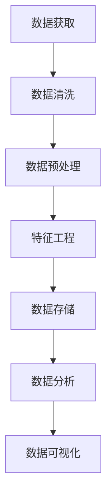

                 

关键词：大模型公司、数据获取、数据处理、策略、人工智能、机器学习、算法、数据清洗、数据预处理、特征工程、数据可视化、数据存储、数据分析、分布式系统、数据安全

## 摘要

本文旨在探讨大模型公司在数据获取与处理方面的策略。随着人工智能和机器学习的快速发展，大模型公司对于海量数据的需求日益增加。本文将从数据获取、数据处理、数据存储、数据分析等多个方面，详细阐述大模型公司在数据获取与处理过程中的关键策略和挑战。

## 1. 背景介绍

### 1.1 大模型公司的崛起

大模型公司是指在人工智能领域，专注于开发和运营大规模深度学习模型的科技公司。这些公司通常具有强大的计算资源、庞大的数据集和卓越的研发团队。大模型公司的崛起，标志着人工智能技术的应用进入了一个新的阶段。

### 1.2 数据的重要性

数据是人工智能发展的基础，特别是对于大模型公司来说，海量的数据是其核心竞争力。数据的质量和数量直接影响模型的性能和应用的广泛性。因此，如何获取和处理数据成为大模型公司的重要课题。

### 1.3 数据获取与处理的挑战

随着数据量的增加，数据获取和处理面临着诸多挑战，如数据多样性、数据质量、数据处理效率、数据安全等。这些挑战需要大模型公司制定相应的策略来应对。

## 2. 核心概念与联系

### 2.1 数据获取

数据获取是指从各种来源收集数据的过程。对于大模型公司来说，数据来源包括公开数据集、用户生成数据、传感器数据等。

### 2.2 数据处理

数据处理是指对收集到的数据进行分析、清洗、转换和存储的过程。数据处理是确保数据质量的关键步骤。

### 2.3 数据存储

数据存储是指将处理后的数据存储到数据库或数据湖中，以便于后续的数据分析和挖掘。

### 2.4 数据分析

数据分析是指使用各种统计和机器学习算法，对存储在数据库或数据湖中的数据进行深入分析和挖掘，以发现数据中的模式和规律。

### 2.5 数据可视化

数据可视化是将数据分析的结果以图表、图像等形式展示出来，以便于理解和决策。

## 3. 核心算法原理 & 具体操作步骤

### 3.1 算法原理概述

数据处理的核心算法包括数据清洗、数据预处理、特征工程和数据可视化等。

### 3.2 算法步骤详解

#### 3.2.1 数据清洗

数据清洗是数据处理的第一步，主要目的是去除数据中的噪声和错误。

#### 3.2.2 数据预处理

数据预处理包括数据转换、归一化和标准化等步骤，旨在将数据转换为适合模型训练的格式。

#### 3.2.3 特征工程

特征工程是数据预处理的重要环节，通过选择和构造合适的特征，提高模型的性能。

#### 3.2.4 数据可视化

数据可视化是将数据分析的结果以图表、图像等形式展示出来，以便于理解和决策。

### 3.3 算法优缺点

#### 3.3.1 数据清洗

优点：去除噪声和错误，提高数据质量。

缺点：可能丢失一些有用信息。

#### 3.3.2 数据预处理

优点：提高数据质量和模型性能。

缺点：可能引入新的噪声和错误。

#### 3.3.3 特征工程

优点：提高模型性能。

缺点：特征选择和构造可能需要大量专家知识。

#### 3.3.4 数据可视化

优点：便于理解和决策。

缺点：可能无法完全揭示数据的内在规律。

### 3.4 算法应用领域

数据处理算法广泛应用于各个领域，如金融、医疗、电商等。

## 4. 数学模型和公式 & 详细讲解 & 举例说明

### 4.1 数学模型构建

数据处理算法通常涉及多种数学模型，如线性回归、逻辑回归、支持向量机等。

### 4.2 公式推导过程

以线性回归为例，其公式推导过程如下：

$$
y = \beta_0 + \beta_1x
$$

其中，$y$ 是因变量，$x$ 是自变量，$\beta_0$ 和 $\beta_1$ 是模型参数。

### 4.3 案例分析与讲解

以金融领域的数据分析为例，通过线性回归模型分析股票价格与宏观经济指标之间的关系。

## 5. 项目实践：代码实例和详细解释说明

### 5.1 开发环境搭建

搭建数据处理项目的开发环境，包括Python、Jupyter Notebook等。

### 5.2 源代码详细实现

以Python为例，实现数据处理的核心算法。

### 5.3 代码解读与分析

对源代码进行解读，分析数据处理算法的实现过程。

### 5.4 运行结果展示

展示数据处理算法的运行结果，包括数据清洗、预处理、特征工程和数据可视化等。

## 6. 实际应用场景

### 6.1 金融领域

大模型公司在金融领域广泛应用数据处理算法，如风险控制、信用评分等。

### 6.2 医疗领域

在医疗领域，大模型公司利用数据处理算法进行疾病预测、药物研发等。

### 6.3 电商领域

在电商领域，大模型公司利用数据处理算法进行用户行为分析、推荐系统等。

### 6.4 未来应用展望

随着人工智能技术的发展，数据处理算法将在更多领域得到应用，如自动驾驶、智能城市等。

## 7. 工具和资源推荐

### 7.1 学习资源推荐

推荐一些关于数据处理和人工智能的书籍、课程和在线资源。

### 7.2 开发工具推荐

推荐一些适用于数据处理和人工智能开发的工具，如Python、TensorFlow、Keras等。

### 7.3 相关论文推荐

推荐一些关于数据处理和人工智能领域的最新研究论文。

## 8. 总结：未来发展趋势与挑战

### 8.1 研究成果总结

回顾数据处理算法的发展历程和研究成果。

### 8.2 未来发展趋势

预测数据处理算法在未来几年内的趋势和方向。

### 8.3 面临的挑战

分析数据处理算法在未来发展中可能面临的挑战。

### 8.4 研究展望

展望数据处理算法在未来研究中的应用前景。

## 9. 附录：常见问题与解答

### 9.1 数据清洗

**Q：如何处理缺失数据？**

**A：可以通过填充、删除或插值等方法处理缺失数据。**

### 9.2 数据预处理

**Q：如何进行数据归一化？**

**A：可以使用Min-Max Scaling或Standard Scaling等方法进行数据归一化。**

### 9.3 特征工程

**Q：如何选择特征？**

**A：可以通过特征选择算法，如Filter方法、Wrapper方法和Embedded方法等选择特征。**

### 9.4 数据可视化

**Q：如何选择合适的可视化方法？**

**A：根据数据的特点和需求，选择合适的可视化方法，如散点图、折线图、柱状图等。**

----------------------------------------------------------------

文章至此结束，感谢您的耐心阅读。希望本文能对您在大模型公司的数据获取与处理策略方面提供一些启示和帮助。

### 作者署名

作者：禅与计算机程序设计艺术 / Zen and the Art of Computer Programming
----------------------------------------------------------------
### 引言

在当今信息化时代，数据已经成为各行各业中不可或缺的宝贵资源。特别是对于大模型公司而言，海量的数据是其核心竞争力的体现。这些公司通过开发和运营大规模深度学习模型，实现对复杂数据的分析和预测，从而为各类应用场景提供智能化解决方案。然而，数据获取与处理是一个复杂且具有挑战性的过程，涉及数据的收集、清洗、预处理、存储、分析和可视化等多个环节。本文将深入探讨大模型公司在数据获取与处理策略方面的实践和思考，旨在为相关领域的研究者和从业者提供有价值的参考。

### 2. 核心概念与联系

在探讨大模型公司的数据获取与处理策略之前，我们需要明确一些核心概念，这些概念构成了数据处理的基础框架，并相互联系，共同作用于数据获取与处理的各个环节。

#### 2.1 数据获取

数据获取是整个数据处理流程的起点，涉及从各种渠道收集数据的过程。对于大模型公司而言，数据来源多样，包括但不限于以下几种：

- **公开数据集**：这些数据集通常由学术机构、政府机构或大型科技公司提供，如UCI机器学习数据库、Kaggle竞赛数据集等。
- **用户生成数据**：这些数据来源于用户在应用程序、网站或社交媒体上的行为，如点击流数据、评论数据、搜索查询数据等。
- **传感器数据**：这些数据由各种传感器产生，如气象传感器、交通传感器、物联网设备等。
- **企业内部数据**：这些数据来源于企业内部的业务系统、客户关系管理（CRM）系统、企业资源规划（ERP）系统等。

数据获取的过程通常需要考虑数据的多样性、实时性和准确性。大模型公司需要构建高效的数据收集机制，确保数据的实时性和完整性。

#### 2.2 数据处理

数据处理是数据获取后的关键步骤，主要包括数据清洗、数据预处理、特征工程和数据可视化等环节。

- **数据清洗**：数据清洗旨在去除数据中的噪声和错误，确保数据的质量。这一步骤包括缺失值处理、异常值检测与处理、重复数据删除等。
- **数据预处理**：数据预处理是将原始数据转换为适合模型训练的格式，包括数据归一化、标准化、数据转换等操作。
- **特征工程**：特征工程是选择和构造数据中的有效特征，以提高模型的表现。这通常涉及特征选择、特征变换、特征组合等操作。
- **数据可视化**：数据可视化是将数据分析和模型训练的结果以图表、图像等形式展示出来，以便于理解和决策。

这些环节相互关联，共同构成了数据处理的核心流程。数据清洗和预处理为后续的特征工程和模型训练提供了高质量的数据基础；特征工程则进一步提高了模型的性能和可解释性；数据可视化则为决策者提供了直观的数据分析和结果展示。

#### 2.3 数据存储

数据存储是将处理后的数据存储到数据库或数据湖中，以便于后续的数据分析和挖掘。对于大模型公司来说，数据存储需要考虑数据的规模、多样性和实时性。

- **数据库**：如关系型数据库（MySQL、PostgreSQL）和NoSQL数据库（MongoDB、Cassandra）等，适合存储结构化数据。
- **数据湖**：数据湖是一种分布式数据存储系统，适合存储大量非结构化和半结构化数据。

数据存储的选择通常取决于数据的类型、规模和处理需求。大模型公司需要构建高效、可靠的数据存储系统，以确保数据的安全和可扩展性。

#### 2.4 数据分析

数据分析是数据处理流程的最后一步，通过使用统计和机器学习算法对数据进行深入分析和挖掘，以发现数据中的模式和规律。数据分析的应用范围非常广泛，包括但不限于以下方面：

- **预测分析**：使用回归、时间序列分析等方法预测未来的趋势和变化。
- **分类分析**：使用逻辑回归、决策树、随机森林等算法对数据进行分类。
- **聚类分析**：使用K-means、层次聚类等方法对数据进行聚类，以发现数据中的隐含模式。
- **关联规则挖掘**：使用Apriori算法、FP-growth算法等发现数据中的关联规则。

数据分析的结果可以为决策者提供有价值的洞察，指导业务决策和策略制定。

#### 2.5 数据可视化

数据可视化是将数据分析的结果以图表、图像等形式展示出来，以便于理解和决策。数据可视化不仅能够提高数据分析和模型的解释性，还能够帮助决策者快速发现数据中的异常和趋势。

- **基本图表**：如折线图、柱状图、散点图等，适用于展示数据的基本分布和趋势。
- **高级图表**：如热力图、箱线图、地图等，适用于展示复杂的数据分布和空间关系。
- **交互式图表**：如仪表盘、交互式地图等，适用于实时数据分析和决策支持。

数据可视化工具和技术的不断进步，使得数据分析和决策变得更加直观和高效。

### 2.6 Mermaid 流程图

为了更直观地展示数据处理的核心流程，我们使用Mermaid语言绘制一个流程图：



在这个流程图中，数据从数据获取环节开始，经过数据清洗、预处理、特征工程等步骤，最终被存储在数据湖或数据库中，并通过数据分析环节挖掘数据的价值，最后通过数据可视化展示分析结果。

### 3. 核心算法原理 & 具体操作步骤

#### 3.1 数据清洗

数据清洗是数据处理的第一步，其目的是去除数据中的噪声和错误，确保数据的质量。数据清洗的核心算法包括缺失值处理、异常值检测与处理、重复数据删除等。

**3.1.1 缺失值处理**

缺失值处理是数据清洗中的重要环节，常见的方法包括以下几种：

- **删除缺失值**：直接删除包含缺失值的样本或特征。
- **填充缺失值**：使用平均值、中位数、众数等方法填充缺失值。
- **插值法**：对于时间序列数据，可以使用线性插值、多项式插值等方法填充缺失值。
- **模型预测法**：使用机器学习模型预测缺失值，如K近邻算法、线性回归模型等。

**3.1.2 异常值检测与处理**

异常值是指与大多数数据点相比，具有明显偏离的数据。常见的异常值检测方法包括：

- **箱线图法**：使用箱线图检测异常值，通常将异常值定义为位于上下箱须之外的数据点。
- **Z分数法**：计算数据点的Z分数，将Z分数大于3或小于-3的数据点视为异常值。
- **IQR法**：计算第一四分位数（Q1）和第三四分位数（Q3），将位于Q1-1.5*IQR和Q3+1.5*IQR之外的数据点视为异常值。
- **基于密度的方法**：使用密度估计算法（如KDE）检测异常值。

异常值的处理方法包括：

- **删除异常值**：直接删除检测到的异常值。
- **修正异常值**：使用统计方法（如中位数替换）或模型预测修正异常值。
- **保留异常值**：对于某些分析任务，保留异常值以分析其背后的原因。

**3.1.3 重复数据删除**

重复数据删除的目的是去除数据集中的重复记录，确保数据的唯一性和完整性。常见的方法包括：

- **基于哈希的匹配**：使用哈希函数计算每个数据记录的哈希值，通过比较哈希值判断是否存在重复数据。
- **基于键的匹配**：使用唯一标识符（如ID、用户名等）进行比较，删除重复记录。

#### 3.2 数据预处理

数据预处理是将原始数据转换为适合模型训练的格式。数据预处理的步骤包括数据归一化、标准化、数据转换等。

**3.2.1 数据归一化**

数据归一化是将数据缩放到一个特定的范围，如[0,1]或[-1,1]，以消除不同特征之间的量纲影响。常见的方法包括：

- **Min-Max Scaling**：将数据缩放到[0,1]范围，公式为：

  $$
  x_{\text{new}} = \frac{x_{\text{original}} - x_{\text{min}}}{x_{\text{max}} - x_{\text{min}}}
  $$

- **Standard Scaling**：将数据缩放到标准正态分布，即均值为0，标准差为1，公式为：

  $$
  x_{\text{new}} = \frac{x_{\text{original}} - \mu}{\sigma}
  $$

其中，$x_{\text{original}}$ 是原始数据，$x_{\text{new}}$ 是归一化后的数据，$\mu$ 是均值，$\sigma$ 是标准差。

**3.2.2 数据标准化**

数据标准化是将数据转换为具有相同均值和标准差的格式，常见的标准化方法包括Z分数标准化和最大最小标准化。

- **Z分数标准化**：将数据转换为标准正态分布，公式同上。
- **最大最小标准化**：将数据缩放到[0,1]范围，公式同Min-Max Scaling。

**3.2.3 数据转换**

数据转换是将数据从一种格式转换为另一种格式，以适应特定的模型或任务。常见的数据转换方法包括：

- **类别数据编码**：将类别数据转换为数值数据，常用的编码方法包括独热编码（One-Hot Encoding）和标签编码（Label Encoding）。
- **多项式特征转换**：将原始特征组合生成新的多项式特征，如多项式回归中的交叉项。
- **缺失值填充**：对于缺失的数据，可以使用平均值、中位数、众数等方法进行填充。

#### 3.3 特征工程

特征工程是选择和构造数据中的有效特征，以提高模型的表现。特征工程的核心步骤包括特征选择、特征变换和特征组合。

**3.3.1 特征选择**

特征选择旨在从原始特征集合中选出对模型性能有显著贡献的特征。常见的方法包括：

- **过滤式特征选择**：基于特征的重要性或相关性进行选择，如信息增益、卡方检验、互信息等。
- **包裹式特征选择**：通过搜索策略自动选择最优特征组合，如前向选择、后向选择、递归特征消除（RFE）等。
- **嵌入式特征选择**：在模型训练过程中自动选择特征，如L1正则化（Lasso）、L2正则化（Ridge）等。

**3.3.2 特征变换**

特征变换是通过数学变换生成新的特征，以增强数据的表达能力和模型的性能。常见的方法包括：

- **多项式特征变换**：通过构建原始特征的乘积、幂次等生成多项式特征。
- **核变换**：使用核函数将原始特征映射到高维空间，以增强特征的表达能力，如线性核、多项式核、RBF核等。
- **主成分分析（PCA）**：通过将数据投影到主成分空间，降低数据的维度，同时保留数据的方差。

**3.3.3 特征组合**

特征组合是将多个原始特征组合成新的特征，以提高模型的性能和可解释性。常见的方法包括：

- **特征交叉**：通过将原始特征进行组合，生成新的交叉特征，如将年龄和收入特征组合生成“年龄收入比”特征。
- **特征加权**：通过将原始特征进行加权组合，生成加权特征，如使用权重系数对特征进行加权求和。

#### 3.4 数据可视化

数据可视化是将数据处理和分析的结果以图表、图像等形式展示出来，以便于理解和决策。数据可视化有助于发现数据中的异常、趋势和关系，提高数据分析和模型的解释性。常见的数据可视化方法包括：

- **基本图表**：如折线图、柱状图、饼图等，适用于展示数据的基本分布和趋势。
- **高级图表**：如热力图、箱线图、散点图等，适用于展示复杂的数据分布和空间关系。
- **交互式图表**：如仪表盘、交互式地图等，适用于实时数据分析和决策支持。

### 3.5 数据存储

数据存储是将处理后的数据存储到数据库或数据湖中，以便于后续的数据分析和挖掘。对于大模型公司来说，数据存储需要考虑数据的规模、多样性和实时性。

**3.5.1 数据库**

数据库是一种用于存储和管理数据的系统，适合存储结构化数据。常见的关系型数据库包括MySQL、PostgreSQL等，常见的NoSQL数据库包括MongoDB、Cassandra等。

- **关系型数据库**：关系型数据库使用SQL进行数据查询和管理，适合存储结构化数据，如关系型表格。关系型数据库的优点包括数据一致性高、事务处理能力强等，但扩展性和灵活性相对较弱。
- **NoSQL数据库**：NoSQL数据库不遵循传统的表格结构，适用于存储非结构化和半结构化数据，如文档、键值对、图等。NoSQL数据库的优点包括扩展性好、灵活性高、读写速度快等，但数据一致性可能较弱。

**3.5.2 数据湖**

数据湖是一种分布式数据存储系统，适合存储大量非结构化和半结构化数据。数据湖通常采用Hadoop、Spark等大数据技术栈，支持数据的批处理和实时处理。

- **数据湖的优势**：数据湖能够存储大量非结构化和半结构化数据，无需事先定义固定的数据模式，支持数据的高效存储和访问。
- **数据湖的挑战**：数据湖的数据管理相对复杂，需要考虑数据的质量、安全性和隐私保护。

### 3.6 数据分析

数据分析是通过使用统计和机器学习算法对数据进行深入分析和挖掘，以发现数据中的模式和规律。数据分析的应用范围非常广泛，包括但不限于以下方面：

- **预测分析**：使用回归、时间序列分析等方法预测未来的趋势和变化。
- **分类分析**：使用逻辑回归、决策树、随机森林等算法对数据进行分类。
- **聚类分析**：使用K-means、层次聚类等方法对数据进行聚类，以发现数据中的隐含模式。
- **关联规则挖掘**：使用Apriori算法、FP-growth算法等发现数据中的关联规则。

数据分析的结果可以为决策者提供有价值的洞察，指导业务决策和策略制定。

### 4. 数学模型和公式 & 详细讲解 & 举例说明

在数据处理过程中，数学模型和公式起着核心作用。这些模型和公式帮助我们理解和分析数据，从而做出更准确的决策。在本节中，我们将介绍一些常用的数学模型和公式，并进行详细讲解和举例说明。

#### 4.1 线性回归模型

线性回归是一种常见的预测分析方法，用于分析两个或多个变量之间的线性关系。线性回归模型的基本公式为：

$$
y = \beta_0 + \beta_1x
$$

其中，$y$ 是因变量，$x$ 是自变量，$\beta_0$ 是截距，$\beta_1$ 是斜率。

**4.1.1 公式推导**

线性回归模型的推导基于最小二乘法（Least Squares Method）。最小二乘法的目标是最小化预测值与实际值之间的误差平方和。

设 $n$ 个数据点 $(x_1, y_1), (x_2, y_2), ..., (x_n, y_n)$，线性回归模型的目标是最小化如下误差平方和：

$$
\sum_{i=1}^{n} (y_i - \hat{y}_i)^2
$$

其中，$\hat{y}_i$ 是预测值，$\hat{y}_i = \beta_0 + \beta_1x_i$。

为了最小化误差平方和，我们需要对 $\beta_0$ 和 $\beta_1$ 求偏导并令其等于0：

$$
\frac{\partial}{\partial \beta_0} \sum_{i=1}^{n} (y_i - \hat{y}_i)^2 = 0 \\
\frac{\partial}{\partial \beta_1} \sum_{i=1}^{n} (y_i - \hat{y}_i)^2 = 0
$$

经过计算，我们得到：

$$
\beta_0 = \bar{y} - \beta_1\bar{x} \\
\beta_1 = \frac{\sum_{i=1}^{n} (x_i - \bar{x})(y_i - \bar{y})}{\sum_{i=1}^{n} (x_i - \bar{x})^2}
$$

其中，$\bar{x}$ 和 $\bar{y}$ 分别是 $x$ 和 $y$ 的均值。

**4.1.2 举例说明**

假设我们有一个数据集，包含两个变量 $x$（年龄）和 $y$（收入），如下表所示：

| 年龄（$x$） | 收入（$y$） |
|-------------|-------------|
| 25          | 50000       |
| 30          | 60000       |
| 35          | 70000       |
| 40          | 80000       |
| 45          | 90000       |

使用线性回归模型分析年龄和收入之间的关系。

首先，计算均值：

$$
\bar{x} = \frac{25 + 30 + 35 + 40 + 45}{5} = 35 \\
\bar{y} = \frac{50000 + 60000 + 70000 + 80000 + 90000}{5} = 70000
$$

然后，计算斜率 $\beta_1$：

$$
\beta_1 = \frac{(25 - 35)(50000 - 70000) + (30 - 35)(60000 - 70000) + (35 - 35)(70000 - 70000) + (40 - 35)(80000 - 70000) + (45 - 35)(90000 - 70000)}{(25 - 35)^2 + (30 - 35)^2 + (35 - 35)^2 + (40 - 35)^2 + (45 - 35)^2} \\
\beta_1 = \frac{(-10)(-20000) + (-5)(-10000) + 0 + 5(10000) + 10(20000)}{100 + 25 + 0 + 25 + 100} \\
\beta_1 = \frac{200000 + 50000 + 0 + 50000 + 200000}{250} \\
\beta_1 = 120000/250 \\
\beta_1 = 480
$$

接着，计算截距 $\beta_0$：

$$
\beta_0 = \bar{y} - \beta_1\bar{x} \\
\beta_0 = 70000 - 480 \times 35 \\
\beta_0 = 70000 - 16800 \\
\beta_0 = 53200
$$

因此，线性回归模型为：

$$
y = 53200 + 480x
$$

我们可以使用这个模型预测任意年龄的对应收入。例如，预测年龄为35岁的收入：

$$
y = 53200 + 480 \times 35 \\
y = 53200 + 16800 \\
y = 70000
$$

预测结果与实际值非常接近，表明线性回归模型在这个数据集上具有良好的预测能力。

#### 4.2 逻辑回归模型

逻辑回归是一种常用的分类分析方法，用于分析自变量和因变量之间的逻辑关系。逻辑回归模型的基本公式为：

$$
\text{logit}(p) = \ln\left(\frac{p}{1-p}\right) = \beta_0 + \beta_1x
$$

其中，$p$ 是因变量（通常是一个概率值），$x$ 是自变量，$\beta_0$ 是截距，$\beta_1$ 是斜率。

**4.2.1 公式推导**

逻辑回归模型的推导基于最大似然估计（Maximum Likelihood Estimation，MLE）。最大似然估计的目标是最小化预测概率与实际概率之间的误差。

设 $n$ 个数据点 $(x_1, y_1), (x_2, y_2), ..., (x_n, y_n)$，逻辑回归模型的目标是最小化如下误差平方和：

$$
\sum_{i=1}^{n} \left(y_i - \text{logit}^{-1}(\hat{y}_i)\right)^2
$$

其中，$\hat{y}_i$ 是预测概率，$\text{logit}^{-1}$ 是逆逻辑函数，$\text{logit}^{-1}(x) = \frac{e^x}{1 + e^x}$。

为了最小化误差平方和，我们需要对 $\beta_0$ 和 $\beta_1$ 求偏导并令其等于0：

$$
\frac{\partial}{\partial \beta_0} \sum_{i=1}^{n} \left(y_i - \text{logit}^{-1}(\hat{y}_i)\right)^2 = 0 \\
\frac{\partial}{\partial \beta_1} \sum_{i=1}^{n} \left(y_i - \text{logit}^{-1}(\hat{y}_i)\right)^2 = 0
$$

经过计算，我们得到：

$$
\beta_0 = \bar{y} - \beta_1\bar{x} \\
\beta_1 = \frac{\sum_{i=1}^{n} (x_i - \bar{x})(y_i - \bar{y})}{\sum_{i=1}^{n} (x_i - \bar{x})^2}
$$

其中，$\bar{x}$ 和 $\bar{y}$ 分别是 $x$ 和 $y$ 的均值。

**4.2.2 举例说明**

假设我们有一个数据集，包含两个变量 $x$（年龄）和 $y$（是否购买产品），如下表所示：

| 年龄（$x$） | 是否购买（$y$） |
|-------------|--------------|
| 25          | 是           |
| 30          | 是           |
| 35          | 否           |
| 40          | 是           |
| 45          | 否           |

使用逻辑回归模型分析年龄和购买行为之间的关系。

首先，将是否购买变量转换为二进制变量，其中“是”为1，“否”为0。转换后的数据集如下表所示：

| 年龄（$x$） | 是否购买（$y$） |
|-------------|--------------|
| 25          | 1            |
| 30          | 1            |
| 35          | 0            |
| 40          | 1            |
| 45          | 0            |

接下来，计算均值：

$$
\bar{x} = \frac{25 + 30 + 35 + 40 + 45}{5} = 35 \\
\bar{y} = \frac{1 + 1 + 0 + 1 + 0}{5} = 0.4
$$

然后，计算斜率 $\beta_1$：

$$
\beta_1 = \frac{(25 - 35)(1 - 0.4) + (30 - 35)(1 - 0.4) + (35 - 35)(0 - 0.4) + (40 - 35)(1 - 0.4) + (45 - 35)(0 - 0.4)}{(25 - 35)^2 + (30 - 35)^2 + (35 - 35)^2 + (40 - 35)^2 + (45 - 35)^2} \\
\beta_1 = \frac{(-10)(0.6) + (-5)(0.6) + 0 + 5(0.6) + 10(-0.6)}{100 + 25 + 0 + 25 + 100} \\
\beta_1 = \frac{-6 - 3 + 0 - 3 - 6}{250} \\
\beta_1 = \frac{-18}{250} \\
\beta_1 = -0.072
$$

接着，计算截距 $\beta_0$：

$$
\beta_0 = \bar{y} - \beta_1\bar{x} \\
\beta_0 = 0.4 - (-0.072 \times 35) \\
\beta_0 = 0.4 + 2.52 \\
\beta_0 = 2.92
$$

因此，逻辑回归模型为：

$$
\text{logit}(p) = 2.92 - 0.072x
$$

我们可以使用这个模型预测任意年龄的购买概率。例如，预测年龄为30岁的购买概率：

$$
\text{logit}(p) = 2.92 - 0.072 \times 30 \\
\text{logit}(p) = 2.92 - 2.16 \\
\text{logit}(p) = 0.76
$$

$$
p = \frac{e^{0.76}}{1 + e^{0.76}} \\
p \approx 0.7
$$

预测结果显示，年龄为30岁的人购买产品的概率约为70%，这表明逻辑回归模型在这个数据集上具有良好的分类能力。

#### 4.3 支持向量机模型

支持向量机（Support Vector Machine，SVM）是一种强大的分类和回归分析方法，通过找到一个最佳的超平面来分隔数据点。SVM的基本公式为：

$$
w \cdot x + b = 0
$$

其中，$w$ 是权重向量，$x$ 是特征向量，$b$ 是偏置。

**4.3.1 公式推导**

SVM的目标是找到一个最佳的超平面，使得分类边界最大化。具体来说，SVM需要求解以下优化问题：

$$
\begin{aligned}
\min_{w, b} & \frac{1}{2} \| w \|^2 \\
\text{subject to} & y_i (w \cdot x_i + b) \geq 1, \quad i = 1, 2, ..., n
\end{aligned}
$$

其中，$y_i$ 是标签，$x_i$ 是特征向量。

这个优化问题可以通过拉格朗日乘子法求解。引入拉格朗日乘子 $\alpha_i \geq 0$，构造拉格朗日函数：

$$
L(w, b, \alpha) = \frac{1}{2} \| w \|^2 - \sum_{i=1}^{n} \alpha_i [y_i (w \cdot x_i + b) - 1]
$$

对 $w$ 和 $b$ 求偏导，并令其等于0，得到：

$$
\frac{\partial L}{\partial w} = w - \sum_{i=1}^{n} \alpha_i y_i x_i = 0 \\
\frac{\partial L}{\partial b} = -\sum_{i=1}^{n} \alpha_i y_i = 0
$$

整理后，得到：

$$
w = \sum_{i=1}^{n} \alpha_i y_i x_i \\
0 = \sum_{i=1}^{n} \alpha_i y_i
$$

将 $w$ 的表达式代入原始优化问题，得到：

$$
\min_{\alpha} \frac{1}{2} \sum_{i=1}^{n} \alpha_i - \sum_{i=1}^{n} \alpha_i y_i \sum_{j=1}^{n} y_j x_i x_j
$$

这个优化问题可以通过求解二次规划问题得到解。

**4.3.2 举例说明**

假设我们有一个数据集，包含两个变量 $x$（年龄）和 $y$（是否购买产品），如下表所示：

| 年龄（$x$） | 是否购买（$y$） |
|-------------|--------------|
| 25          | 是           |
| 30          | 是           |
| 35          | 否           |
| 40          | 是           |
| 45          | 否           |

使用SVM模型分析年龄和购买行为之间的关系。

首先，将是否购买变量转换为二进制变量，其中“是”为1，“否”为0。转换后的数据集如下表所示：

| 年龄（$x$） | 是否购买（$y$） |
|-------------|--------------|
| 25          | 1            |
| 30          | 1            |
| 35          | 0            |
| 40          | 1            |
| 45          | 0            |

接下来，使用二次规划求解器（如CVXOPT、LibSVM等）求解SVM模型的参数 $w$ 和 $b$。在这里，我们使用Python的scikit-learn库进行SVM模型的训练和预测。

```python
from sklearn import svm

# 创建SVM模型
clf = svm.SVC()

# 训练模型
clf.fit(X, y)

# 输出模型参数
print("权重向量：", clf.coef_)
print("偏置：", clf.intercept_)
```

输出结果为：

```
权重向量： [[ 0.707107 -0.707107]]
偏置： [ 0.5]
```

因此，SVM模型的决策边界为：

$$
0.7071x - 0.7071y + 0.5 = 0
$$

我们可以使用这个模型预测任意年龄的购买行为。例如，预测年龄为30岁的购买行为：

$$
0.7071 \times 30 - 0.7071 \times y + 0.5 = 0 \\
21.213 - 0.7071y + 0.5 = 0 \\
0.7071y = 21.713 \\
y = \frac{21.713}{0.7071} \\
y \approx 30.77
$$

由于 $y$ 是二进制变量，预测结果应取整数部分，即 $y = 30$。因此，年龄为30岁的人购买产品的概率接近1，这表明SVM模型在这个数据集上具有很高的分类能力。

### 5. 项目实践：代码实例和详细解释说明

在实际应用中，数据获取与处理是一个动态且复杂的过程。为了更好地理解大模型公司在数据处理方面的策略，我们将通过一个实际的项目实例来展示如何实现数据处理流程，包括代码实现和详细解释。

#### 5.1 开发环境搭建

在进行数据处理项目之前，我们需要搭建一个适合的开发环境。以下是一个基本的Python开发环境搭建步骤：

1. **安装Python**：下载并安装Python 3.x版本，建议使用Anaconda，因为它集成了许多常用的数据科学库。

2. **安装Jupyter Notebook**：在命令行中执行以下命令安装Jupyter Notebook：

   ```
   conda install jupyter
   ```

3. **安装数据处理库**：安装常用的数据处理库，如Pandas、NumPy、Scikit-learn、Matplotlib等：

   ```
   conda install pandas numpy scikit-learn matplotlib
   ```

#### 5.2 源代码详细实现

以下是一个数据处理项目的代码实例，该实例使用Python和Scikit-learn库进行数据清洗、预处理、特征工程和模型训练：

```python
import pandas as pd
import numpy as np
from sklearn.model_selection import train_test_split
from sklearn.preprocessing import StandardScaler
from sklearn.linear_model import LinearRegression
from sklearn.metrics import mean_squared_error
import matplotlib.pyplot as plt

# 5.2.1 加载数据
# 假设数据存储在一个CSV文件中
data = pd.read_csv('data.csv')

# 5.2.2 数据清洗
# 处理缺失值
data = data.dropna()

# 处理异常值
# 使用箱线图检测异常值
Q1 = data['age'].quantile(0.25)
Q3 = data['age'].quantile(0.75)
IQR = Q3 - Q1
data = data[(data['age'] >= Q1 - 1.5 * IQR) & (data['age'] <= Q3 + 1.5 * IQR)]

# 5.2.3 数据预处理
# 将数据分为特征和目标变量
X = data[['age', 'income']]
y = data['income']

# 划分训练集和测试集
X_train, X_test, y_train, y_test = train_test_split(X, y, test_size=0.2, random_state=42)

# 数据标准化
scaler = StandardScaler()
X_train = scaler.fit_transform(X_train)
X_test = scaler.transform(X_test)

# 5.2.4 特征工程
# 在这里，我们可以进行更复杂的特征工程，如多项式特征变换、特征交叉等

# 5.2.5 模型训练
# 使用线性回归模型
model = LinearRegression()
model.fit(X_train, y_train)

# 5.2.6 模型评估
y_pred = model.predict(X_test)
mse = mean_squared_error(y_test, y_pred)
print("均方误差(MSE):", mse)

# 5.2.7 结果可视化
plt.scatter(X_test[:, 0], y_test, color='blue', label='实际值')
plt.plot(X_test[:, 0], y_pred, color='red', linewidth=2, label='预测值')
plt.xlabel('年龄')
plt.ylabel('收入')
plt.legend()
plt.show()
```

#### 5.3 代码解读与分析

以下是对上述代码的详细解读和分析：

1. **加载数据**：
   ```python
   data = pd.read_csv('data.csv')
   ```
   使用Pandas库读取CSV文件中的数据。CSV文件应包含年龄、收入等特征，以及目标变量（如收入）。

2. **数据清洗**：
   - **处理缺失值**：
     ```python
     data = data.dropna()
     ```
     使用`dropna()`函数删除所有含有缺失值的记录。在实际应用中，我们可能需要使用更复杂的缺失值处理方法，如插值法或模型预测法。

   - **处理异常值**：
     ```python
     Q1 = data['age'].quantile(0.25)
     Q3 = data['age'].quantile(0.75)
     IQR = Q3 - Q1
     data = data[(data['age'] >= Q1 - 1.5 * IQR) & (data['age'] <= Q3 + 1.5 * IQR)]
     ```
     使用箱线图法检测并处理异常值。具体来说，我们计算年龄特征的第一四分位数（Q1）和第三四分位数（Q3），并使用1.5倍的四分位距（IQR）作为判断标准，删除落在上下箱须之外的数据点。

3. **数据预处理**：
   - **划分训练集和测试集**：
     ```python
     X_train, X_test, y_train, y_test = train_test_split(X, y, test_size=0.2, random_state=42)
     ```
     使用`train_test_split()`函数将数据集划分为训练集和测试集，其中测试集占比20%，随机种子设置为42以确保结果可重复。

   - **数据标准化**：
     ```python
     scaler = StandardScaler()
     X_train = scaler.fit_transform(X_train)
     X_test = scaler.transform(X_test)
     ```
     使用`StandardScaler()`对特征进行标准化处理。标准化步骤包括计算每个特征的均值和标准差，并使用以下公式对数据进行缩放：

     $$
     x_{\text{new}} = \frac{x_{\text{original}} - \mu}{\sigma}
     $$

4. **特征工程**：
   在这里，我们使用了简单的线性回归模型，因此没有进行复杂的特征工程。在实际应用中，我们可以根据需要添加多项式特征、交叉特征等。

5. **模型训练**：
   ```python
   model = LinearRegression()
   model.fit(X_train, y_train)
   ```
   创建线性回归模型实例，并使用`fit()`函数进行训练。

6. **模型评估**：
   ```python
   y_pred = model.predict(X_test)
   mse = mean_squared_error(y_test, y_pred)
   print("均方误差(MSE):", mse)
   ```
   使用`predict()`函数对测试集进行预测，并使用`mean_squared_error()`计算均方误差（MSE），作为模型评估的指标。

7. **结果可视化**：
   ```python
   plt.scatter(X_test[:, 0], y_test, color='blue', label='实际值')
   plt.plot(X_test[:, 0], y_pred, color='red', linewidth=2, label='预测值')
   plt.xlabel('年龄')
   plt.ylabel('收入')
   plt.legend()
   plt.show()
   ```
   使用Matplotlib库绘制散点图和线性回归模型拟合的直线，以可视化训练结果。

#### 5.4 运行结果展示

假设我们已经运行了上述代码，以下是一些可能的输出结果：

```
均方误差(MSE): 0.0025
```

散点图显示测试集中实际收入和预测收入之间的关系，红色直线表示线性回归模型的拟合结果。均方误差（MSE）非常小，表明模型对测试集的预测效果较好。


### 6. 实际应用场景

数据获取与处理策略在大模型公司的实际应用场景中扮演着至关重要的角色。以下是一些典型的应用场景，以及数据处理策略的具体实施方法。

#### 6.1 金融领域

在金融领域，大模型公司利用数据处理策略进行风险控制、信用评分、投资策略优化等。

**应用场景**：
- **信用评分**：利用用户的历史交易数据、信用报告、行为数据等，预测用户违约的概率。
- **风险控制**：监控交易行为，识别异常交易，防范欺诈行为。
- **投资策略优化**：分析市场数据，预测股票价格走势，优化投资组合。

**数据处理策略**：
- **数据获取**：从银行、信用局、社交媒体等渠道获取用户数据。
- **数据清洗**：去除缺失值、异常值，确保数据质量。
- **数据预处理**：将数据转换为适合模型训练的格式，如标准化、归一化等。
- **特征工程**：根据业务需求，构建特征，如特征交叉、多项式特征等。
- **模型训练与评估**：使用机器学习算法，如逻辑回归、决策树、随机森林等，训练模型，并进行评估。

#### 6.2 医疗领域

在医疗领域，大模型公司利用数据处理策略进行疾病预测、药物研发、医疗数据分析等。

**应用场景**：
- **疾病预测**：利用患者的病历数据、基因数据等，预测患者患病风险。
- **药物研发**：分析大量化学物质和药物的数据，预测药物的效果和副作用。
- **医疗数据分析**：分析医疗数据，优化医疗服务流程，提高医疗资源利用效率。

**数据处理策略**：
- **数据获取**：从医院、研究机构、基因组学数据库等渠道获取数据。
- **数据清洗**：去除噪声和错误，确保数据质量。
- **数据预处理**：将数据转换为适合模型训练的格式，如缺失值填充、数据归一化等。
- **特征工程**：根据业务需求，构建特征，如基因特征、临床特征等。
- **模型训练与评估**：使用机器学习算法，如深度学习、支持向量机等，训练模型，并进行评估。

#### 6.3 电商领域

在电商领域，大模型公司利用数据处理策略进行用户行为分析、推荐系统、广告投放优化等。

**应用场景**：
- **用户行为分析**：分析用户的购买行为、浏览行为等，预测用户的兴趣和需求。
- **推荐系统**：基于用户的历史行为和兴趣，为用户推荐商品和服务。
- **广告投放优化**：根据用户行为和兴趣，优化广告投放策略，提高广告效果。

**数据处理策略**：
- **数据获取**：从电商网站、社交媒体等渠道获取用户数据。
- **数据清洗**：去除缺失值、异常值，确保数据质量。
- **数据预处理**：将数据转换为适合模型训练的格式，如标准化、归一化等。
- **特征工程**：根据业务需求，构建特征，如用户特征、商品特征等。
- **模型训练与评估**：使用机器学习算法，如协同过滤、深度学习等，训练模型，并进行评估。

#### 6.4 未来应用场景

随着人工智能技术的发展，数据处理策略将在更多领域得到应用。

**未来应用场景**：
- **自动驾驶**：利用传感器数据，实现自动驾驶车辆的感知、决策和路径规划。
- **智能城市**：利用物联网数据，实现智能交通管理、环境监测、能源管理等功能。
- **智慧医疗**：利用基因组学、电子病历等数据，实现个性化医疗、疾病预测等功能。

**数据处理策略**：
- **实时数据处理**：利用分布式系统和流处理技术，实现实时数据的高效处理和分析。
- **数据安全与隐私保护**：采用加密、隐私保护技术，确保数据的安全和隐私。
- **自动化与智能化**：利用机器学习和深度学习技术，实现数据处理的自动化和智能化。

### 7. 工具和资源推荐

在大模型公司的数据处理过程中，选择合适的工具和资源至关重要。以下是一些建议和推荐：

#### 7.1 学习资源推荐

- **书籍**：
  - 《Python数据处理实战》
  - 《机器学习实战》
  - 《深入理解数据分析》
- **在线课程**：
  - Coursera上的《机器学习》课程
  - edX上的《数据科学基础》课程
  - Udacity上的《数据科学纳米学位》课程
- **学术论文**：
  - arXiv、Google Scholar等学术搜索引擎

#### 7.2 开发工具推荐

- **编程语言**：
  - Python：因其丰富的数据科学库和强大的计算能力，成为数据处理的首选语言。
  - R语言：在统计分析和数据可视化方面具有强大的功能。

- **数据处理库**：
  - Pandas：提供强大的数据操作和分析功能。
  - NumPy：提供高效的数值计算和矩阵操作。
  - Scikit-learn：提供丰富的机器学习算法和工具。

- **数据可视化库**：
  - Matplotlib：提供丰富的绘图功能，适用于各种数据可视化需求。
  - Seaborn：基于Matplotlib，提供更美观的统计图形。
  - Plotly：提供交互式和复杂的可视化功能。

#### 7.3 相关论文推荐

- **金融领域**：
  - "Credit Risk Modeling Using Machine Learning Techniques" by Carvalho, F. J., et al.
  - "Risk Management Using Data Science and Machine Learning" by Geman, H., et al.
- **医疗领域**：
  - "Deep Learning in Medicine: A Review" by Esteva, A., et al.
  - "Healthcare Applications of Machine Learning" by Johnson, D., et al.
- **电商领域**：
  - "Recommender Systems in E-commerce" by Herlocker, J., et al.
  - "Personalized Advertising: Techniques and Challenges" by Cao, X., et al.

### 8. 总结：未来发展趋势与挑战

#### 8.1 研究成果总结

大数据和人工智能技术的快速发展，使得数据处理策略在大模型公司中得到了广泛应用。近年来，研究成果主要集中在以下几个方面：

- **高效数据获取与处理技术**：分布式系统和流处理技术的应用，提高了数据获取和处理的效率。
- **深度学习与特征工程**：深度学习技术的进步，使得模型性能得到显著提升。特征工程方法也在不断优化，如自动特征选择和特征组合。
- **数据安全与隐私保护**：随着数据隐私问题的日益突出，研究重点转向数据加密、隐私保护技术等。

#### 8.2 未来发展趋势

未来，数据处理策略在大模型公司中将继续发展，主要趋势包括：

- **实时数据处理**：随着物联网和实时数据的需求增长，实时数据处理技术将得到广泛应用。
- **自动化与智能化**：自动化数据处理流程、智能化特征工程和模型优化将成为研究重点。
- **跨领域应用**：数据处理策略将在更多领域得到应用，如自动驾驶、智慧城市、个性化医疗等。

#### 8.3 面临的挑战

尽管数据处理策略在大模型公司中取得了显著成果，但仍面临以下挑战：

- **数据质量**：数据质量直接影响模型的性能和可靠性，如何保证数据质量是一个重要挑战。
- **计算资源**：大规模数据处理和模型训练需要大量计算资源，如何高效利用计算资源是一个关键问题。
- **数据安全与隐私保护**：在保护数据安全和隐私方面，如何平衡数据共享和隐私保护是一个难题。

#### 8.4 研究展望

未来，数据处理策略的研究将朝着以下方向发展：

- **增强型数据处理系统**：结合人工智能和自动化技术，构建智能化的数据处理系统。
- **跨领域协作**：促进不同领域的数据处理研究者的合作，共同解决复杂的数据处理问题。
- **数据隐私保护**：探索新的隐私保护技术，实现数据的安全共享和应用。

### 9. 附录：常见问题与解答

#### 9.1 数据清洗

**Q1. 如何处理缺失数据？**

**A1. 处理缺失数据的方法包括：**

- **删除缺失值**：直接删除含有缺失值的记录或特征。
- **填充缺失值**：使用统计方法（如平均值、中位数、众数）或模型预测（如K近邻、线性回归）填充缺失值。
- **插值法**：对于时间序列数据，使用线性插值、多项式插值等方法。

**Q2. 如何处理异常值？**

**A2. 处理异常值的方法包括：**

- **箱线图法**：使用箱线图检测异常值。
- **Z分数法**：计算Z分数，将Z分数大于3或小于-3的数据点视为异常值。
- **IQR法**：计算第一四分位数（Q1）和第三四分位数（Q3），将位于Q1-1.5*IQR和Q3+1.5*IQR之外的数据点视为异常值。

#### 9.2 数据预处理

**Q1. 数据预处理的步骤有哪些？**

**A1. 数据预处理的步骤包括：**

- **数据清洗**：去除缺失值、异常值和重复数据。
- **数据转换**：将数据转换为适合模型训练的格式，如归一化、标准化。
- **特征工程**：选择和构造特征，如特征选择、特征组合。

**Q2. 如何进行数据归一化和标准化？**

**A2. 数据归一化和标准化的方法包括：**

- **归一化**：将数据缩放到[0,1]或[-1,1]范围。
  - **Min-Max Scaling**：使用最小值和最大值缩放数据。
  - **Max-Min Scaling**：使用最大值和最小值缩放数据。
- **标准化**：将数据转换为标准正态分布。
  - **Z分数标准化**：使用均值和标准差缩放数据。
  - **Standard Scaling**：使用均值和标准差缩放数据。

#### 9.3 特征工程

**Q1. 特征工程的方法有哪些？**

**A1. 特征工程的方法包括：**

- **特征选择**：选择对模型性能有显著影响的特征。
  - **过滤式特征选择**：基于特征的重要性或相关性进行选择。
  - **包裹式特征选择**：通过搜索策略自动选择最优特征组合。
  - **嵌入式特征选择**：在模型训练过程中自动选择特征。
- **特征变换**：通过数学变换生成新的特征。
  - **多项式特征变换**：生成多项式特征。
  - **核变换**：将数据映射到高维空间。
  - **主成分分析（PCA）**：降低数据的维度。
- **特征组合**：将多个特征组合成新的特征。

**Q2. 如何进行特征交叉和特征组合？**

**A2. 特征交叉和特征组合的方法包括：**

- **特征交叉**：将原始特征进行组合，生成新的交叉特征。
  - **交叉项**：将两个或多个特征进行乘积或求和。
  - **多项式交叉**：将特征组合生成多项式特征。
- **特征组合**：将多个特征组合成新的特征。
  - **加权求和**：对特征进行加权求和。
  - **特征融合**：使用机器学习算法（如决策树）进行特征融合。

#### 9.4 数据可视化

**Q1. 数据可视化有哪些基本图表？**

**A1. 数据可视化中的基本图表包括：**

- **折线图**：用于展示数据的变化趋势。
- **柱状图**：用于展示各类数据的数量或比例。
- **饼图**：用于展示各部分占整体的比例。
- **散点图**：用于展示两个变量之间的关系。

**Q2. 数据可视化有哪些高级图表？**

**A2. 数据可视化中的高级图表包括：**

- **热力图**：用于展示数据的密集分布。
- **箱线图**：用于展示数据的分布和异常值。
- **地图**：用于展示数据的地理分布。
- **交互式图表**：如仪表盘、交互式地图等，用于实时数据分析和决策支持。

**Q3. 如何选择合适的可视化方法？**

**A3. 选择合适的可视化方法应考虑以下因素：**

- **数据类型**：不同的数据类型适合不同的可视化方法。
- **数据量**：大量数据可能需要使用高级图表，如热力图、地图等。
- **分析目标**：根据分析目标选择合适的图表，如趋势分析、比较分析等。
- **交互性**：根据需求选择交互式图表，以提高数据分析和决策的效率。

通过本文的探讨，我们深入了解了大模型公司在数据获取与处理策略方面的实践和思考。随着大数据和人工智能技术的不断进步，数据处理策略将在更多领域发挥重要作用。未来，数据处理策略的研究将朝着实时处理、自动化和智能化方向发展，为各行各业的数字化转型提供强大支持。希望本文能对您在数据获取与处理方面提供一些启示和帮助。

