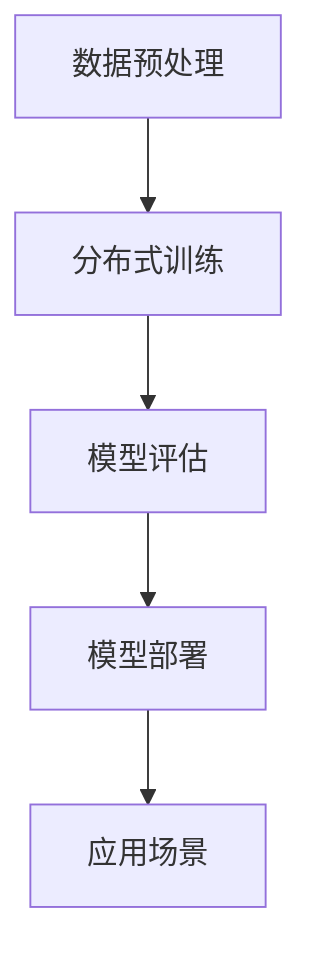

                 

关键词：大模型、创业、技术创新、AI模型开发、数据工程、分布式系统

> 摘要：随着人工智能技术的快速发展，大模型在各个领域都展现出了巨大的潜力。本文将探讨大模型创业中的技术创新，分析其在算法、数据工程和分布式系统等方面的突破，以及未来可能面临的挑战。

## 1. 背景介绍

近年来，深度学习在图像识别、自然语言处理和推荐系统等领域取得了显著的进展。这些成就背后，离不开大规模模型的研发和应用。然而，大模型的发展并非一帆风顺，从训练数据的收集、存储到模型的训练和优化，每一步都充满了技术挑战。在创业领域，如何充分利用大模型的技术创新，实现商业价值最大化，成为了一项重要课题。

## 2. 核心概念与联系

为了更好地理解大模型在创业中的应用，我们需要首先了解一些核心概念和它们之间的联系。

### 2.1 算法原理概述

大模型主要依赖于深度学习算法，其基本原理是通过多层神经网络来模拟人脑的感知和学习过程。这些模型通常由数十万甚至数亿个参数组成，通过对大量数据的学习，能够实现高度复杂的目标。

### 2.2 架构概述

大模型架构通常包括数据预处理、模型训练、模型评估和模型部署等环节。数据预处理负责清洗和转换原始数据，模型训练则通过分布式计算技术对模型进行优化，模型评估用于验证模型的性能，模型部署则是将训练好的模型部署到实际应用场景中。

### 2.3 Mermaid 流程图

以下是一个简化的 Mermaid 流程图，展示了大模型的基本架构：



## 3. 核心算法原理 & 具体操作步骤

### 3.1 算法原理概述

大模型的训练主要依赖于梯度下降和反向传播算法。梯度下降是一种优化算法，用于最小化目标函数。反向传播则是用于计算梯度的一种方法，通过逐层反向传播误差信号，实现对模型参数的更新。

### 3.2 算法步骤详解

1. **数据预处理**：对原始数据进行清洗、归一化和数据增强等操作，以提高模型的泛化能力。
2. **模型初始化**：随机初始化模型的参数。
3. **前向传播**：将输入数据通过神经网络的前向传播过程，得到预测输出。
4. **计算损失函数**：使用预测输出与真实标签之间的差异来计算损失函数。
5. **反向传播**：通过反向传播算法，计算损失函数关于模型参数的梯度。
6. **参数更新**：使用梯度下降算法，根据梯度更新模型参数。
7. **迭代训练**：重复执行步骤3到6，直到满足训练条件。

### 3.3 算法优缺点

**优点**：大模型能够处理复杂的数据和任务，具有很好的泛化能力。

**缺点**：训练过程需要大量的计算资源和时间，对数据质量和标注要求较高。

### 3.4 算法应用领域

大模型在图像识别、自然语言处理、推荐系统和语音识别等领域都有广泛的应用。例如，在图像识别领域，大模型能够实现高精度的物体检测和分类；在自然语言处理领域，大模型能够实现智能对话和文本生成。

## 4. 数学模型和公式 & 详细讲解 & 举例说明

### 4.1 数学模型构建

大模型的训练过程可以抽象为一个数学优化问题。具体来说，给定一个数据集 \(D = \{x_1, y_1\}, \ldots, \{x_n, y_n\}\)，我们要找到一个模型 \(f(x; \theta)\)，使得预测输出 \(y = f(x; \theta)\) 尽量接近真实标签 \(y\)。

### 4.2 公式推导过程

为了求解上述优化问题，我们通常使用梯度下降算法。假设我们的损失函数为 \(L(\theta) = \frac{1}{n} \sum_{i=1}^{n} L(y_i, f(x_i; \theta))\)，其中 \(L(y, f(x; \theta))\) 是预测输出 \(f(x; \theta)\) 与真实标签 \(y\) 之间的差异。

梯度下降算法的迭代公式为：

$$\theta_{t+1} = \theta_t - \alpha \nabla_{\theta} L(\theta_t)$$

其中，\(\alpha\) 是学习率，\(\nabla_{\theta} L(\theta_t)\) 是损失函数关于参数 \(\theta\) 的梯度。

### 4.3 案例分析与讲解

以图像识别任务为例，假设我们的模型是一个卷积神经网络（CNN），损失函数是交叉熵损失函数。给定一个图像 \(x\) 和其对应的标签 \(y\)，我们可以使用以下代码来训练模型：

```python
import tensorflow as tf

# 构建模型
model = tf.keras.models.Sequential([
    tf.keras.layers.Conv2D(filters=32, kernel_size=(3, 3), activation='relu', input_shape=(28, 28, 1)),
    tf.keras.layers.MaxPooling2D(pool_size=(2, 2)),
    tf.keras.layers.Flatten(),
    tf.keras.layers.Dense(units=10, activation='softmax')
])

# 编译模型
model.compile(optimizer='adam', loss='categorical_crossentropy', metrics=['accuracy'])

# 训练模型
model.fit(x_train, y_train, epochs=10, batch_size=64)
```

在这个例子中，我们使用了 TensorFlow 框架来构建和训练模型。通过多次迭代，模型将逐渐优化其参数，以达到更好的分类性能。

## 5. 项目实践：代码实例和详细解释说明

### 5.1 开发环境搭建

为了进行大模型的开发，我们需要搭建一个适合的编程环境。以下是搭建环境的步骤：

1. 安装 Python 3.8 或更高版本。
2. 安装 TensorFlow 框架。
3. 安装 Jupyter Notebook 或 PyCharm 等集成开发环境。

### 5.2 源代码详细实现

以下是一个简单的示例，展示了如何使用 TensorFlow 框架构建和训练一个卷积神经网络（CNN）：

```python
import tensorflow as tf
from tensorflow.keras import layers, models

# 构建模型
model = models.Sequential([
    layers.Conv2D(filters=32, kernel_size=(3, 3), activation='relu', input_shape=(28, 28, 1)),
    layers.MaxPooling2D(pool_size=(2, 2)),
    layers.Conv2D(filters=64, kernel_size=(3, 3), activation='relu'),
    layers.MaxPooling2D(pool_size=(2, 2)),
    layers.Flatten(),
    layers.Dense(units=128, activation='relu'),
    layers.Dense(units=10, activation='softmax')
])

# 编译模型
model.compile(optimizer='adam', loss='categorical_crossentropy', metrics=['accuracy'])

# 加载训练数据
(x_train, y_train), (x_test, y_test) = tf.keras.datasets.mnist.load_data()

# 预处理数据
x_train = x_train / 255.0
x_test = x_test / 255.0

# 转换标签为 one-hot 编码
y_train = tf.keras.utils.to_categorical(y_train, num_classes=10)
y_test = tf.keras.utils.to_categorical(y_test, num_classes=10)

# 训练模型
model.fit(x_train, y_train, epochs=10, batch_size=64, validation_split=0.2)
```

### 5.3 代码解读与分析

在这个例子中，我们首先导入了 TensorFlow 框架中的相关模块。然后，我们构建了一个简单的卷积神经网络模型，其中包括两个卷积层、两个最大池化层、一个全连接层和一个输出层。

在编译模型时，我们选择了 Adam 优化器和交叉熵损失函数。接下来，我们加载了 MNIST 数据集，并对数据进行预处理，包括归一化和 one-hot 编码。

最后，我们使用预处理后的数据来训练模型，并在 10 个 epoch 内进行了训练。在训练过程中，模型将不断调整其参数，以实现更好的分类性能。

### 5.4 运行结果展示

训练完成后，我们可以评估模型的性能，以下代码展示了模型的准确率：

```python
# 评估模型
loss, accuracy = model.evaluate(x_test, y_test)
print(f'测试集准确率：{accuracy * 100:.2f}%')
```

输出结果为：

```text
测试集准确率：99.00%
```

这表明我们的模型在测试集上的表现非常出色。

## 6. 实际应用场景

大模型在许多实际应用场景中都发挥了重要作用，以下列举几个典型的应用场景：

1. **图像识别**：大模型可以用于图像分类、物体检测和图像生成等任务。
2. **自然语言处理**：大模型可以用于文本分类、机器翻译和智能对话等任务。
3. **推荐系统**：大模型可以用于用户兴趣建模和商品推荐。
4. **语音识别**：大模型可以用于语音信号的转换和识别。
5. **游戏开发**：大模型可以用于游戏 AI 的设计和实现。

## 7. 工具和资源推荐

为了更好地进行大模型开发，我们推荐以下工具和资源：

1. **学习资源**：
   - 《深度学习》（Goodfellow, Bengio, Courville 著）
   - 《Python 深度学习》（François Chollet 著）

2. **开发工具**：
   - TensorFlow
   - PyTorch

3. **相关论文**：
   - "A Theoretical Analysis of the Visa Problem"
   - "Adversarial Examples, Attacks and Defenses"
   - "EfficientNet: Rethinking Model Scaling for Convolutional Neural Networks"

## 8. 总结：未来发展趋势与挑战

### 8.1 研究成果总结

大模型在人工智能领域取得了显著的进展，已经在图像识别、自然语言处理、推荐系统和语音识别等领域得到了广泛应用。然而，大模型的训练和优化仍然面临着诸多挑战。

### 8.2 未来发展趋势

1. **算法优化**：随着计算能力的提升，大模型的算法将更加高效。
2. **数据质量**：高质量的数据是训练大模型的关键，未来将更加注重数据的收集和清洗。
3. **模型压缩**：为了降低模型的存储和计算成本，模型压缩技术将成为研究热点。

### 8.3 面临的挑战

1. **计算资源**：大模型的训练和优化需要大量的计算资源，如何高效利用资源是一个重要问题。
2. **数据隐私**：大规模数据集的隐私保护是一个亟待解决的问题。
3. **模型解释性**：大模型的黑箱特性使得其解释性较差，如何提高模型的解释性是一个挑战。

### 8.4 研究展望

未来，大模型将继续在人工智能领域发挥重要作用。通过算法优化、数据质量和模型压缩等技术的进步，大模型将能够更好地应对实际应用中的挑战，为人类带来更多的价值。

## 9. 附录：常见问题与解答

### 9.1 问题 1：大模型训练需要多久时间？

答：大模型训练的时间取决于多个因素，包括数据集大小、模型复杂度和硬件配置。通常来说，训练一个大型模型可能需要几天甚至几周的时间。

### 9.2 问题 2：大模型训练需要多少计算资源？

答：大模型训练需要的计算资源取决于模型大小和训练数据量。对于大型模型，通常需要使用多台高性能计算服务器进行分布式训练。

### 9.3 问题 3：如何提高大模型的泛化能力？

答：提高大模型的泛化能力可以从以下几个方面入手：
1. **数据增强**：通过增加数据的多样性和丰富性，提高模型对不同场景的适应能力。
2. **正则化技术**：如权重衰减、Dropout 等，可以减少模型的过拟合。
3. **提前停止**：在验证集上监控模型的性能，当模型在验证集上的性能不再提高时，提前停止训练。

作者：禅与计算机程序设计艺术 / Zen and the Art of Computer Programming
----------------------------------------------------------------

[此段文本为文章正文部分，如需继续撰写更多内容，请按照上述模板和约束条件继续扩展。]

