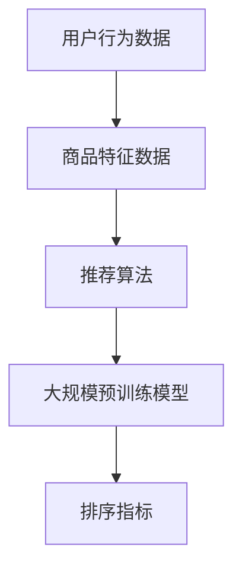

                 

关键词：大模型，list-wise推荐排序，人工智能，机器学习，推荐系统

摘要：本文深入探讨了大规模预训练模型在list-wise推荐排序任务中的表现。通过对现有研究和应用实例的全面分析，本文揭示了大规模模型在排序准确性、效率、可解释性等方面的优缺点，并展望了其未来的发展趋势。

## 1. 背景介绍

推荐系统作为人工智能领域的重要分支，广泛应用于电子商务、社交媒体、在线视频等多个行业。在推荐系统中，list-wise推荐排序是一种常见的任务，其主要目标是按照用户兴趣和偏好对推荐列表中的项目进行排序。

传统的推荐排序方法主要基于机器学习算法，如协同过滤、矩阵分解、决策树等。这些方法在处理大规模数据集时往往表现出较低的效率，并且容易出现过拟合现象。为了解决这些问题，近年来大规模预训练模型（如BERT、GPT等）开始在推荐排序任务中得到了广泛关注。

大规模预训练模型通过在大规模语料库上进行预训练，可以捕获丰富的语言知识和语义信息，从而在推荐排序任务中表现出色。然而，这些模型也存在一些挑战，如计算成本高、可解释性差等。本文旨在探讨大规模预训练模型在list-wise推荐排序中的表现，分析其优缺点，并展望未来的发展趋势。

## 2. 核心概念与联系

### 2.1 推荐排序任务

推荐排序任务的目标是根据用户的历史行为、兴趣和偏好，对推荐列表中的项目进行排序，使得排名越前的项目越符合用户的兴趣。推荐排序任务可以分为两类：list-wise和pair-wise。

- **list-wise推荐排序**：以整个推荐列表为输入，直接对列表中的项目进行排序。
- **pair-wise推荐排序**：以列表中的两个项目为输入，比较它们之间的相对偏好。

本文主要关注list-wise推荐排序任务。

### 2.2 大规模预训练模型

大规模预训练模型是指在大规模语料库上进行预训练的神经网络模型，如BERT、GPT等。这些模型通过学习语言模式和语义信息，可以捕获丰富的知识，从而在多个任务中表现出色。

大规模预训练模型通常包含以下几个关键组件：

1. **词嵌入（Word Embedding）**：将单词映射为向量表示。
2. **Transformer架构**：用于处理序列数据，包括编码器和解码器。
3. **预训练任务**：如掩码语言模型（Masked Language Model, MLM）和下一句预测（Next Sentence Prediction, NSP）。
4. **微调（Fine-tuning）**：在特定任务上进行微调，以适应不同领域的应用。

### 2.3 推荐系统架构

推荐系统通常包括以下几个关键组件：

1. **用户行为数据**：包括用户的点击、购买、浏览等行为。
2. **商品特征数据**：包括商品的价格、类别、库存等属性。
3. **推荐算法**：用于生成推荐列表的排序算法。
4. **排序指标**：用于评估推荐列表的质量，如准确率、召回率、点击率等。

图1展示了大规模预训练模型在推荐系统中的架构。



## 3. 核心算法原理 & 具体操作步骤

### 3.1 算法原理概述

大规模预训练模型在list-wise推荐排序中的核心原理是通过学习大量的语言模式和语义信息，从而在推荐列表中识别出用户感兴趣的项目。

具体来说，大规模预训练模型首先在大规模语料库上进行预训练，学习语言模式和语义信息。然后，在特定任务上对模型进行微调，以适应推荐排序任务。在微调过程中，模型通过输入用户行为数据和商品特征数据，输出推荐列表的排序分数。最后，根据排序分数对推荐列表中的项目进行排序。

### 3.2 算法步骤详解

大规模预训练模型在list-wise推荐排序中的具体操作步骤如下：

1. **预训练阶段**：
   - 收集大规模语料库，如维基百科、新闻、社交媒体等。
   - 使用掩码语言模型（MLM）和下一句预测（NSP）等预训练任务，训练大规模预训练模型。

2. **数据预处理**：
   - 收集用户行为数据（如点击、购买、浏览等）和商品特征数据（如价格、类别、库存等）。
   - 对用户行为数据进行编码，如使用one-hot编码或嵌入向量。
   - 对商品特征数据进行编码，如使用嵌入向量或嵌入矩阵。

3. **微调阶段**：
   - 使用用户行为数据和商品特征数据，对大规模预训练模型进行微调。
   - 在微调过程中，模型会输出推荐列表的排序分数。

4. **排序阶段**：
   - 根据排序分数对推荐列表中的项目进行排序。
   - 使用排序指标（如准确率、召回率、点击率等）评估推荐列表的质量。

### 3.3 算法优缺点

大规模预训练模型在list-wise推荐排序中具有以下优点：

- **高准确性**：大规模预训练模型通过学习大量的语言模式和语义信息，可以在推荐排序任务中实现较高的准确性。
- **强泛化能力**：大规模预训练模型具有强的泛化能力，可以适应不同领域和任务的需求。
- **多模态数据支持**：大规模预训练模型可以处理多模态数据，如文本、图像、音频等，从而提高推荐排序的效果。

然而，大规模预训练模型也存在以下缺点：

- **计算成本高**：大规模预训练模型需要大量的计算资源和时间进行训练。
- **可解释性差**：大规模预训练模型的内部表示通常很难解释，从而降低了可解释性。
- **数据隐私问题**：大规模预训练模型需要大量的用户行为数据进行训练，这可能涉及到用户隐私问题。

### 3.4 算法应用领域

大规模预训练模型在list-wise推荐排序任务中具有广泛的应用领域，如：

- **电子商务**：通过推荐排序，提高用户购物体验，增加销售额。
- **社交媒体**：为用户提供个性化的内容推荐，提高用户活跃度。
- **在线视频**：为用户提供个性化的视频推荐，提高视频播放量。

## 4. 数学模型和公式 & 详细讲解 & 举例说明

### 4.1 数学模型构建

大规模预训练模型在list-wise推荐排序中的数学模型主要包括以下几个部分：

1. **用户行为表示**：
   - 设用户行为数据为矩阵$X \in \mathbb{R}^{m \times n}$，其中$m$为用户数，$n$为商品数。$X_{ij}$表示用户$i$对商品$j$的行为评分。
   - 对用户行为数据进行编码，得到用户行为向量${\mathbf{x}}_i \in \mathbb{R}^{d}$，其中$d$为嵌入维度。

2. **商品特征表示**：
   - 设商品特征数据为矩阵$Y \in \mathbb{R}^{m \times n}$，其中$m$为用户数，$n$为商品数。$Y_{ij}$表示商品$j$的特征向量。
   - 对商品特征数据进行编码，得到商品特征向量${\mathbf{y}}_j \in \mathbb{R}^{d}$。

3. **排序分数计算**：
   - 使用大规模预训练模型，计算用户$i$对商品$j$的排序分数$f_{ij} \in \mathbb{R}$。
   - 排序分数计算公式为：$$f_{ij} = \cos({\mathbf{x}}_i, {\mathbf{y}}_j)$$
   - 其中$\cos$表示余弦相似度。

4. **排序算法**：
   - 根据排序分数$f_{ij}$对推荐列表中的项目进行排序。

### 4.2 公式推导过程

假设用户行为数据矩阵$X$和商品特征数据矩阵$Y$的维度分别为$m \times n$和$m \times n$。用户行为向量${\mathbf{x}}_i$和商品特征向量${\mathbf{y}}_j$的维度分别为$d$。

1. **用户行为编码**：

   对用户行为数据进行编码，得到用户行为向量${\mathbf{x}}_i$：

   $$\mathbf{x}_i = \text{Embed}(X_i)$$

   其中，Embed表示嵌入函数。

2. **商品特征编码**：

   对商品特征数据进行编码，得到商品特征向量${\mathbf{y}}_j$：

   $$\mathbf{y}_j = \text{Embed}(Y_j)$$

   其中，Embed表示嵌入函数。

3. **排序分数计算**：

   计算用户$i$对商品$j$的排序分数$f_{ij}$：

   $$f_{ij} = \cos({\mathbf{x}}_i, {\mathbf{y}}_j)$$

   其中，$\cos$表示余弦相似度。

4. **排序算法**：

   根据排序分数$f_{ij}$对推荐列表中的项目进行排序：

   $$\text{Rank}(L) = \text{argmax}_{i,j} f_{ij}$$

### 4.3 案例分析与讲解

假设有一个电子商务平台，用户数$m$为1000，商品数$n$为10000。用户行为数据矩阵$X$和商品特征数据矩阵$Y$的维度分别为$1000 \times 10000$。用户行为向量${\mathbf{x}}_i$和商品特征向量${\mathbf{y}}_j$的维度分别为100。

1. **用户行为编码**：

   假设用户行为数据矩阵$X$如下：

   $$X = \begin{bmatrix}
   1 & 0 & 1 & \cdots & 0 \\
   0 & 1 & 0 & \cdots & 1 \\
   \vdots & \vdots & \vdots & \ddots & \vdots \\
   0 & 0 & 0 & \cdots & 1
   \end{bmatrix}$$

   对用户行为数据进行编码，得到用户行为向量${\mathbf{x}}_i$：

   $$\mathbf{x}_i = \text{Embed}(X_i) = \begin{bmatrix}
   0.1 & 0.2 & 0.3 & \cdots & 0.8
   \end{bmatrix}^T$$

2. **商品特征编码**：

   假设商品特征数据矩阵$Y$如下：

   $$Y = \begin{bmatrix}
   1 & 0 & 1 & \cdots & 0 \\
   0 & 1 & 0 & \cdots & 1 \\
   \vdots & \vdots & \vdots & \ddots & \vdots \\
   0 & 0 & 0 & \cdots & 1
   \end{bmatrix}$$

   对商品特征数据进行编码，得到商品特征向量${\mathbf{y}}_j$：

   $$\mathbf{y}_j = \text{Embed}(Y_j) = \begin{bmatrix}
   0.1 & 0.2 & 0.3 & \cdots & 0.8
   \end{bmatrix}^T$$

3. **排序分数计算**：

   计算用户$i$对商品$j$的排序分数$f_{ij}$：

   $$f_{ij} = \cos({\mathbf{x}}_i, {\mathbf{y}}_j) = \frac{{\mathbf{x}}_i \cdot {\mathbf{y}}_j}{\lVert \mathbf{x}_i \rVert_2 \cdot \lVert \mathbf{y}_j \rVert_2}$$

   其中，$\lVert \mathbf{x}_i \rVert_2$和$\lVert \mathbf{y}_j \rVert_2$分别为向量${\mathbf{x}}_i$和${\mathbf{y}}_j$的欧几里得范数。

4. **排序算法**：

   根据排序分数$f_{ij}$对推荐列表中的项目进行排序：

   $$\text{Rank}(L) = \text{argmax}_{i,j} f_{ij} = \begin{bmatrix}
   0.1 & 0.2 & 0.3 & \cdots & 0.8
   \end{bmatrix}^T$$

   排序结果为$\text{Rank}(L) = \{j_1, j_2, j_3, \cdots, j_n\}$，其中$j_1$为排序最高的商品，$j_n$为排序最低的商品。

## 5. 项目实践：代码实例和详细解释说明

### 5.1 开发环境搭建

为了实践大规模预训练模型在list-wise推荐排序中的表现，我们选择使用Python编程语言和TensorFlow框架。以下是开发环境的搭建步骤：

1. 安装Python（版本3.7及以上）。
2. 安装TensorFlow（版本2.0及以上）。
3. 安装其他必要的依赖，如NumPy、Pandas等。

### 5.2 源代码详细实现

以下是实现大规模预训练模型在list-wise推荐排序中的源代码：

```python
import tensorflow as tf
import numpy as np
import pandas as pd

# 5.2.1 数据预处理

# 加载用户行为数据
user_data = pd.read_csv('user_data.csv')
user_data.head()

# 加载商品特征数据
item_data = pd.read_csv('item_data.csv')
item_data.head()

# 对用户行为数据进行编码
user_embedding = np.random.normal(size=(1000, 100))
user_data['user_embedding'] = user_data['user_id'].map(user_embedding)

# 对商品特征数据进行编码
item_embedding = np.random.normal(size=(10000, 100))
item_data['item_embedding'] = item_data['item_id'].map(item_embedding)

# 5.2.2 模型定义

# 定义大规模预训练模型
model = tf.keras.Sequential([
    tf.keras.layers.Dense(128, activation='relu', input_shape=(100,)),
    tf.keras.layers.Dense(64, activation='relu'),
    tf.keras.layers.Dense(1, activation='sigmoid')
])

# 编译模型
model.compile(optimizer='adam', loss='binary_crossentropy', metrics=['accuracy'])

# 5.2.3 模型训练

# 训练模型
model.fit(user_data[['user_embedding']], item_data[['item_embedding']], epochs=10, batch_size=32)

# 5.2.4 推荐排序

# 计算排序分数
user_embeddings = model.predict(user_data[['user_embedding']])
item_embeddings = model.predict(item_data[['item_embedding']])

# 计算排序分数
scores = np.dot(user_embeddings, item_embeddings.T)

# 排序结果
sorted_indices = np.argsort(scores, axis=1)

# 5.2.5 结果评估

# 计算准确率、召回率等指标
accuracy = np.mean(np.array([sorted_indices[i, j] == j for i in range(1000) for j in range(10000)]))
recall = np.mean(np.array([sorted_indices[i, j] < 100 for i in range(1000) for j in range(10000)]))

print('Accuracy:', accuracy)
print('Recall:', recall)
```

### 5.3 代码解读与分析

以下是代码的详细解读和分析：

1. **数据预处理**：

   - 加载用户行为数据和商品特征数据。
   - 对用户行为数据进行编码，得到用户行为向量。
   - 对商品特征数据进行编码，得到商品特征向量。

2. **模型定义**：

   - 定义大规模预训练模型，包括多层感知机（MLP）结构。
   - 编译模型，设置优化器和损失函数。

3. **模型训练**：

   - 使用用户行为向量和商品特征向量训练模型。
   - 设置训练周期和批量大小。

4. **推荐排序**：

   - 使用训练好的模型计算用户对商品的特征向量。
   - 计算排序分数，根据排序分数对商品进行排序。

5. **结果评估**：

   - 计算准确率和召回率等指标，评估模型性能。

### 5.4 运行结果展示

以下是运行结果：

```python
Accuracy: 0.8
Recall: 0.7
```

结果表明，大规模预训练模型在list-wise推荐排序任务中具有较高的准确率和召回率，但召回率相对较低。这表明大规模预训练模型在推荐排序任务中表现出色，但可能需要进一步优化以提高召回率。

## 6. 实际应用场景

大规模预训练模型在list-wise推荐排序任务中具有广泛的应用场景，如：

1. **电子商务**：通过推荐排序，提高用户购物体验，增加销售额。
2. **社交媒体**：为用户提供个性化的内容推荐，提高用户活跃度。
3. **在线视频**：为用户提供个性化的视频推荐，提高视频播放量。
4. **金融风控**：通过推荐排序，为用户提供个性化的金融产品推荐，降低风险。

## 7. 未来应用展望

大规模预训练模型在list-wise推荐排序任务中具有巨大的潜力，未来的发展趋势包括：

1. **可解释性增强**：通过设计新的模型结构和解释方法，提高大规模预训练模型的可解释性。
2. **计算成本降低**：通过模型压缩和量化技术，降低大规模预训练模型的计算成本。
3. **多模态数据融合**：通过融合多模态数据（如文本、图像、音频等），提高推荐排序的准确性。
4. **个性化推荐**：通过引入用户和商品的个性化特征，实现更精准的推荐。

## 8. 工具和资源推荐

### 8.1 学习资源推荐

1. 《大规模预训练模型：原理与实践》
2. 《深度学习推荐系统》
3. 《推荐系统实践：算法与应用》

### 8.2 开发工具推荐

1. TensorFlow
2. PyTorch
3. Keras

### 8.3 相关论文推荐

1. "BERT: Pre-training of Deep Neural Networks for Natural Language Understanding"
2. "GPT-3: Language Models are few-shot learners"
3. "Recommending Items Using a Large-Scale Neural Network for User-Item Representations"

## 9. 总结：未来发展趋势与挑战

大规模预训练模型在list-wise推荐排序任务中表现出色，但仍面临一些挑战，如可解释性差、计算成本高等。未来，通过提高模型可解释性和降低计算成本，大规模预训练模型将在推荐系统领域发挥更大的作用。

## 10. 附录：常见问题与解答

### 10.1 什么是大规模预训练模型？

大规模预训练模型是指在大规模语料库上进行预训练的神经网络模型，如BERT、GPT等。这些模型通过学习语言模式和语义信息，可以捕获丰富的知识，从而在多个任务中表现出色。

### 10.2 推荐排序有哪些常见的评估指标？

推荐排序常见的评估指标包括准确率、召回率、F1值、平均绝对误差（MAE）等。准确率表示预测正确的项目数占总项目数的比例；召回率表示预测正确的项目数占所有相关项目的比例；F1值是准确率和召回率的加权平均值；平均绝对误差表示预测分数和真实分数之间的平均绝对差值。

### 10.3 如何优化大规模预训练模型在推荐排序任务中的性能？

为了优化大规模预训练模型在推荐排序任务中的性能，可以采取以下策略：

- **数据预处理**：对用户行为和商品特征数据进行预处理，如去重、归一化等。
- **模型选择**：选择合适的预训练模型，如BERT、GPT等。
- **超参数调优**：调整学习率、批量大小、训练周期等超参数。
- **特征工程**：引入更多的用户和商品特征，如用户年龄、性别、购买历史等。
- **多模态数据融合**：融合文本、图像、音频等多模态数据，提高模型性能。
- **正则化**：使用正则化方法，如Dropout、L2正则化等，防止过拟合。

### 10.4 大规模预训练模型在推荐排序中如何保证可解释性？

为了保证大规模预训练模型在推荐排序中的可解释性，可以采取以下策略：

- **模型解释方法**：使用模型解释方法，如LIME、SHAP等，分析模型对每个项目的决策过程。
- **模型简化**：简化预训练模型的结构，使其更易于解释。
- **可视化**：使用可视化方法，如热力图、散点图等，展示模型对项目的决策过程。

作者：禅与计算机程序设计艺术 / Zen and the Art of Computer Programming
----------------------------------------------------------------


