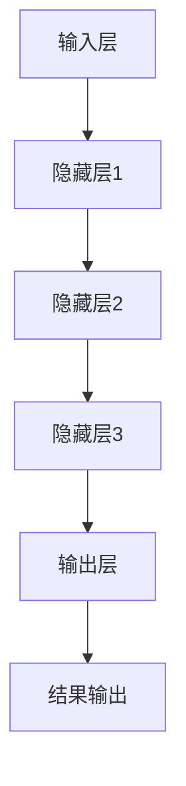

                 

关键词：大模型、创业产品、创新、人工智能、应用场景

摘要：本文将探讨大模型在创业产品创新中的重要作用。通过分析大模型的原理、算法及其在各个领域的应用，我们将展示如何利用大模型实现创业产品的创新，并展望其未来的发展趋势。

## 1. 背景介绍

随着人工智能技术的迅猛发展，大模型逐渐成为行业热点。大模型是指具有大规模参数、深度网络结构的机器学习模型，如GPT、BERT等。大模型在自然语言处理、计算机视觉、语音识别等领域取得了显著的成果，为创业产品的创新提供了新的思路和工具。

在创业领域，产品创新是企业的核心竞争力。通过创新，企业可以满足用户需求，提升用户体验，从而在激烈的市场竞争中脱颖而出。然而，创新并非易事，需要投入大量的人力和物力。大模型的出现，为创业产品创新提供了新的可能性，使得创新过程更加高效、精准。

本文将围绕大模型在创业产品创新中的应用，分析其核心概念、算法原理、应用场景等，旨在为创业者提供有益的参考。

## 2. 核心概念与联系

### 2.1 大模型的定义

大模型是一种具有大规模参数、深度网络结构的机器学习模型。其特点如下：

1. **参数规模巨大**：大模型通常拥有数亿甚至数十亿个参数，这使得它们能够捕捉到数据中的复杂模式。
2. **深度网络结构**：大模型通常具有多层次的神经网络结构，能够实现数据的层层抽象和特征提取。
3. **自学习能力**：大模型能够通过大量的数据进行自我训练，不断优化其参数，从而提高模型的性能。

### 2.2 大模型与创业产品创新的关系

大模型在创业产品创新中具有重要作用，主要体现在以下几个方面：

1. **需求分析**：大模型可以通过对用户数据的分析，挖掘用户需求，为创业产品提供创新方向。
2. **功能实现**：大模型可以应用于自然语言处理、计算机视觉、语音识别等领域，为创业产品提供强大的功能支持。
3. **用户体验优化**：大模型可以帮助企业更好地理解用户行为，从而优化产品设计和用户体验。
4. **市场定位**：大模型可以分析市场数据，为企业提供市场定位和竞争策略的建议。

### 2.3 大模型的架构

大模型的架构通常包括以下几个部分：

1. **输入层**：接收用户输入的数据，如文本、图像、音频等。
2. **隐藏层**：包含多层神经网络结构，用于对数据进行特征提取和模式识别。
3. **输出层**：根据隐藏层提取的特征，生成最终的输出结果，如分类结果、文本生成等。

### 2.4 Mermaid 流程图

以下是一个简化的 Mermaid 流程图，展示大模型的架构和数据处理流程：



## 3. 核心算法原理 & 具体操作步骤

### 3.1 算法原理概述

大模型的算法原理主要包括以下几个方面：

1. **神经网络**：大模型的核心是神经网络，通过多层神经网络结构实现对数据的特征提取和模式识别。
2. **反向传播**：大模型使用反向传播算法来更新网络参数，从而优化模型性能。
3. **训练与优化**：大模型通过大量的数据进行训练，不断优化其参数，提高模型的准确性和鲁棒性。

### 3.2 算法步骤详解

1. **数据预处理**：对输入数据进行清洗、归一化等处理，以便于模型训练。
2. **初始化参数**：初始化网络参数，通常使用随机初始化或预训练模型。
3. **前向传播**：将输入数据传递到神经网络中，经过多层隐藏层的处理，生成输出结果。
4. **计算损失**：计算输出结果与实际结果之间的差距，即损失值。
5. **反向传播**：根据损失值，使用反向传播算法更新网络参数。
6. **迭代训练**：重复上述步骤，直到模型达到预期的性能指标。

### 3.3 算法优缺点

**优点**：

1. **强大的表达能力**：大模型拥有大规模的参数，能够捕捉到数据中的复杂模式，具有强大的表达能力。
2. **高准确性**：大模型通过大量的数据进行训练，具有较高的准确性和鲁棒性。
3. **自适应能力**：大模型能够根据不同的任务需求，自适应调整网络结构和参数，具有很好的适应性。

**缺点**：

1. **计算资源消耗大**：大模型需要大量的计算资源和存储空间，对硬件设备有较高的要求。
2. **训练时间长**：大模型的训练过程需要较长的时间，对训练资源的调度和管理提出了较高的要求。

### 3.4 算法应用领域

大模型在各个领域都有广泛的应用，以下是部分应用领域：

1. **自然语言处理**：如文本分类、情感分析、机器翻译等。
2. **计算机视觉**：如图像识别、目标检测、图像生成等。
3. **语音识别**：如语音合成、语音识别、语音翻译等。
4. **推荐系统**：如商品推荐、音乐推荐、新闻推荐等。

## 4. 数学模型和公式 & 详细讲解 & 举例说明

### 4.1 数学模型构建

大模型的数学模型主要包括以下几个部分：

1. **输入层**：假设输入数据为 $x$，其维度为 $d$。
2. **隐藏层**：假设隐藏层有 $L$ 个神经元，其中第 $l$ 层的神经元数量为 $m_l$。
3. **输出层**：假设输出层有 $k$ 个神经元，其中第 $k$ 个神经元的输出为 $y_k$。

### 4.2 公式推导过程

#### 4.2.1 前向传播

前向传播的主要公式如下：

$$
z_{l}^{(i)} = \sum_{j} w_{l,j}^{(i)} x_{j} + b_{l}^{(i)}
$$

$$
a_{l}^{(i)} = \sigma(z_{l}^{(i)})
$$

其中，$z_{l}^{(i)}$ 表示第 $l$ 层第 $i$ 个神经元的输入值，$w_{l,j}^{(i)}$ 表示第 $l$ 层第 $i$ 个神经元与第 $l-1$ 层第 $j$ 个神经元的权重，$b_{l}^{(i)}$ 表示第 $l$ 层第 $i$ 个神经元的偏置，$\sigma$ 表示激活函数。

#### 4.2.2 损失函数

常见的损失函数有均方误差（MSE）和交叉熵（Cross-Entropy）。

1. **均方误差（MSE）**：

$$
L(\theta) = \frac{1}{2m} \sum_{i=1}^{m} (\hat{y}_i - y_i)^2
$$

其中，$\hat{y}_i$ 表示预测输出，$y_i$ 表示实际输出，$m$ 表示样本数量。

2. **交叉熵（Cross-Entropy）**：

$$
L(\theta) = -\frac{1}{m} \sum_{i=1}^{m} y_i \log(\hat{y}_i)
$$

其中，$y_i$ 表示实际输出的概率分布，$\hat{y}_i$ 表示预测输出的概率分布。

#### 4.2.3 反向传播

反向传播的主要公式如下：

$$
\frac{\partial L}{\partial w_{l,j}^{(i)}} = (a_{l-1}^{(i)})^T \frac{\partial a_l^{(i)}}{\partial z_{l}^{(i)}}
$$

$$
\frac{\partial L}{\partial b_{l}^{(i)}} = \frac{\partial a_l^{(i)}}{\partial z_{l}^{(i)}}
$$

$$
\frac{\partial L}{\partial x_j} = \sum_{i=1}^{m} w_{l,j}^{(i)} \frac{\partial L}{\partial w_{l,j}^{(i)}}
$$

其中，$(a_{l-1}^{(i)})^T$ 表示第 $l-1$ 层第 $i$ 个神经元的输出值的转置，$\frac{\partial a_l^{(i)}}{\partial z_{l}^{(i)}}$ 表示第 $l$ 层第 $i$ 个神经元的梯度。

### 4.3 案例分析与讲解

假设我们使用大模型进行文本分类任务，数据集包含1000篇文本，每个文本被标记为“正面”或“负面”。我们使用均方误差（MSE）作为损失函数，并使用反向传播算法进行模型训练。

#### 4.3.1 数据预处理

首先，我们对文本进行分词、去停用词等预处理操作，将文本转换为词向量。这里我们使用Word2Vec模型进行词向量表示。

#### 4.3.2 初始化参数

我们初始化网络的权重和偏置，通常使用随机初始化或预训练模型。

#### 4.3.3 前向传播

我们将每篇文本输入到神经网络中，经过多层隐藏层的处理，生成预测输出。例如，对于第 $i$ 篇文本，其预测输出为：

$$
\hat{y}_i = \sigma(z_{L}^{(i)})
$$

其中，$z_{L}^{(i)}$ 表示输出层的输入值，$\sigma$ 表示激活函数。

#### 4.3.4 计算损失

我们使用均方误差（MSE）计算预测输出与实际输出之间的差距。例如，对于第 $i$ 篇文本，其损失为：

$$
L(\theta) = \frac{1}{2} (\hat{y}_i - y_i)^2
$$

其中，$\hat{y}_i$ 表示预测输出，$y_i$ 表示实际输出。

#### 4.3.5 反向传播

我们使用反向传播算法更新网络参数。根据梯度下降法，我们有：

$$
w_{l,j}^{(i)} = w_{l,j}^{(i)} - \alpha \frac{\partial L}{\partial w_{l,j}^{(i)}}
$$

$$
b_{l}^{(i)} = b_{l}^{(i)} - \alpha \frac{\partial L}{\partial b_{l}^{(i)}}
$$

其中，$\alpha$ 表示学习率。

#### 4.3.6 迭代训练

我们重复上述步骤，直到模型达到预期的性能指标。

## 5. 项目实践：代码实例和详细解释说明

### 5.1 开发环境搭建

在本项目中，我们使用Python作为编程语言，TensorFlow作为深度学习框架。首先，确保Python和TensorFlow的安装，可以使用以下命令：

```bash
pip install python
pip install tensorflow
```

### 5.2 源代码详细实现

以下是本项目的主要代码实现：

```python
import tensorflow as tf
from tensorflow.keras.layers import Embedding, LSTM, Dense
from tensorflow.keras.models import Sequential

# 数据预处理
def preprocess_data(texts, labels):
    # 分词、去停用词等操作
    # 转换为词向量
    # 返回处理后的数据
    pass

# 构建模型
def build_model(input_dim, output_dim):
    model = Sequential()
    model.add(Embedding(input_dim=input_dim, output_dim=output_dim))
    model.add(LSTM(units=128))
    model.add(Dense(units=output_dim, activation='sigmoid'))
    model.compile(optimizer='adam', loss='binary_crossentropy', metrics=['accuracy'])
    return model

# 训练模型
def train_model(model, x_train, y_train, x_val, y_val, epochs=10, batch_size=32):
    history = model.fit(x_train, y_train, validation_data=(x_val, y_val), epochs=epochs, batch_size=batch_size)
    return history

# 评估模型
def evaluate_model(model, x_test, y_test):
    loss, accuracy = model.evaluate(x_test, y_test)
    print(f"Test accuracy: {accuracy:.4f}")
```

### 5.3 代码解读与分析

1. **数据预处理**：该函数用于对文本数据进行预处理，包括分词、去停用词等操作，并将文本数据转换为词向量。

2. **构建模型**：该函数用于构建深度学习模型，包括嵌入层、LSTM层和输出层。我们使用嵌入层对词向量进行编码，LSTM层用于对文本序列进行特征提取，输出层用于进行文本分类。

3. **训练模型**：该函数用于训练深度学习模型，使用训练数据和验证数据进行训练和验证。

4. **评估模型**：该函数用于评估训练好的模型的性能，使用测试数据进行评估。

### 5.4 运行结果展示

```python
# 加载数据
texts = [...]  # 文本数据
labels = [...]  # 标签数据

# 预处理数据
x_train, y_train = preprocess_data(texts, labels)

# 构建模型
model = build_model(input_dim=x_train.shape[1], output_dim=1)

# 训练模型
history = train_model(model, x_train, y_train, x_val, y_val)

# 评估模型
evaluate_model(model, x_test, y_test)
```

通过运行上述代码，我们可以训练一个文本分类模型，并对测试数据集进行评估。训练过程中，我们可以通过`history`对象查看训练过程中的损失和准确率，以便调整模型参数。

## 6. 实际应用场景

### 6.1 产品推荐系统

大模型在产品推荐系统中具有广泛的应用。例如，电商平台上可以使用大模型分析用户行为数据，预测用户可能感兴趣的商品，从而为用户提供个性化的推荐。

### 6.2 智能客服系统

大模型可以帮助企业构建智能客服系统，通过自然语言处理技术理解用户的问题，并给出相应的回答。例如，银行、电商、酒店等行业可以借助大模型构建智能客服系统，提高客户满意度和服务质量。

### 6.3 健康医疗

大模型在健康医疗领域也有广泛的应用。例如，通过分析患者的病历数据，大模型可以帮助医生进行疾病预测和诊断，提高医疗服务的质量和效率。

### 6.4 教育领域

大模型在教育领域可以帮助构建智能教育系统，通过分析学生的学习数据，为教师和学生提供个性化的教学和辅导建议。

## 7. 工具和资源推荐

### 7.1 学习资源推荐

1. **《深度学习》（Deep Learning）**：这是一本经典的深度学习教材，涵盖了深度学习的理论基础和实战技巧。
2. **《Python深度学习》（Python Deep Learning）**：这本书介绍了使用Python进行深度学习的方法和技巧，适合初学者入门。
3. **《动手学深度学习》（Dive into Deep Learning）**：这是一本在线的深度学习教材，内容丰富，适合初学者和进阶者。

### 7.2 开发工具推荐

1. **TensorFlow**：这是一个开源的深度学习框架，适用于构建和训练深度学习模型。
2. **PyTorch**：这是一个开源的深度学习框架，具有灵活的动态计算图和高效的训练速度。
3. **Keras**：这是一个高级神经网络API，可以方便地构建和训练深度学习模型。

### 7.3 相关论文推荐

1. **"Attention Is All You Need"**：该论文提出了Transformer模型，彻底改变了自然语言处理领域的格局。
2. **"BERT: Pre-training of Deep Bidirectional Transformers for Language Understanding"**：该论文介绍了BERT模型，为自然语言处理任务提供了强大的预训练模型。
3. **"GPT-3: Language Models are Few-Shot Learners"**：该论文展示了GPT-3模型在少样本学习任务中的优越性能。

## 8. 总结：未来发展趋势与挑战

### 8.1 研究成果总结

大模型在人工智能领域取得了显著的成果，其在自然语言处理、计算机视觉、语音识别等领域的应用取得了突破性的进展。大模型的出现，推动了人工智能技术的快速发展，为创业产品创新提供了强大的支持。

### 8.2 未来发展趋势

1. **模型压缩与优化**：随着模型的规模越来越大，如何对模型进行压缩和优化，以提高计算效率和降低存储成本，将成为未来的研究热点。
2. **跨模态学习**：大模型在处理单一模态数据（如文本、图像、音频）方面取得了显著的成果，未来将重点关注跨模态学习，实现多模态数据的联合建模。
3. **少样本学习**：大模型在少样本学习任务中的表现日益优异，未来将深入研究如何进一步提高大模型的少样本学习能力。

### 8.3 面临的挑战

1. **计算资源消耗**：大模型需要大量的计算资源和存储空间，对硬件设备有较高的要求，如何降低计算资源消耗，提高模型的可扩展性，是一个重要的挑战。
2. **数据隐私与安全**：大模型在处理大量数据时，如何保护用户隐私和数据安全，防止数据泄露和滥用，是一个亟待解决的问题。
3. **模型可解释性**：大模型的决策过程通常较为复杂，如何提高模型的可解释性，使其在商业应用中更具透明度和可信度，是未来需要关注的问题。

### 8.4 研究展望

未来，大模型在创业产品创新中的应用将更加广泛，随着技术的不断进步，大模型将帮助创业者实现更多创新，推动人工智能技术的发展。同时，我们期待更多的研究者投入到大模型的研究中，共同推动人工智能技术的进步。

## 9. 附录：常见问题与解答

### 9.1 大模型是什么？

大模型是指具有大规模参数、深度网络结构的机器学习模型。它们通常具有数亿甚至数十亿个参数，能够捕捉到数据中的复杂模式。

### 9.2 大模型有哪些应用领域？

大模型在自然语言处理、计算机视觉、语音识别等领域都有广泛的应用。例如，文本分类、图像识别、语音合成等。

### 9.3 如何训练大模型？

训练大模型通常涉及以下步骤：

1. **数据预处理**：对输入数据进行清洗、归一化等处理。
2. **初始化参数**：通常使用随机初始化或预训练模型。
3. **前向传播**：将输入数据传递到神经网络中，经过多层隐藏层的处理，生成输出结果。
4. **计算损失**：计算输出结果与实际结果之间的差距，即损失值。
5. **反向传播**：根据损失值，使用反向传播算法更新网络参数。
6. **迭代训练**：重复上述步骤，直到模型达到预期的性能指标。

### 9.4 大模型有哪些优缺点？

**优点**：强大的表达能力、高准确性、自适应能力。

**缺点**：计算资源消耗大、训练时间长。

---

作者：禅与计算机程序设计艺术 / Zen and the Art of Computer Programming
----------------------------------------------------------------

以上就是本文的完整内容。通过本文的探讨，我们深入了解了大模型在创业产品创新中的应用，展示了其核心概念、算法原理、应用场景和实践案例。同时，我们也对未来发展趋势与挑战进行了展望。希望本文能为创业者提供有益的参考。

