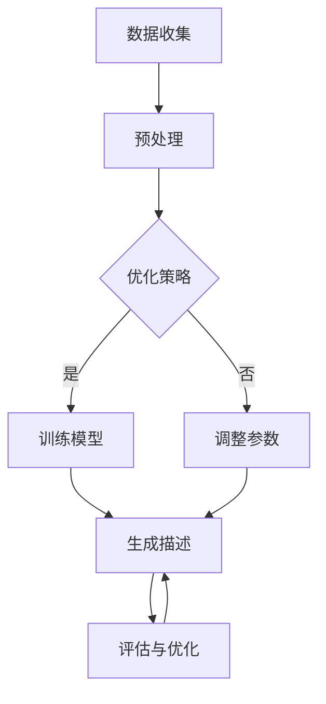

                 

关键词：大模型、商品描述、自然语言处理、生成式模型、优化策略

> 摘要：本文旨在探讨大模型在商品描述优化与生成中的应用。通过分析现有大模型的架构和特点，本文提出了将大模型应用于商品描述优化与生成的方法，详细描述了算法原理、操作步骤、优缺点及应用领域，并结合数学模型和项目实践进行了深入分析和讨论。

## 1. 背景介绍

随着电子商务的蓬勃发展，商品描述作为影响消费者购买决策的重要因素，日益受到企业和研究机构的关注。传统的商品描述主要依赖于人工撰写，这不仅耗时耗力，而且容易受到主观因素的影响，导致描述质量参差不齐。为了提高商品描述的质量和效率，近年来，自然语言处理（NLP）技术逐渐成为研究热点。特别是生成式模型，如生成对抗网络（GAN）、变分自编码器（VAE）和Transformer等，其在文本生成任务中展现了出色的性能，为商品描述优化与生成提供了新的解决方案。

大模型是指具有千亿规模参数的深度学习模型，其能够在大规模数据集上学习到丰富的知识，从而提高生成文本的质量和多样性。近年来，大模型在多个领域取得了显著的成果，如文本生成、机器翻译、问答系统等。将大模型应用于商品描述优化与生成，有望进一步提高描述的准确性、吸引力和个性化程度，满足消费者的多样化需求。

本文将围绕大模型在商品描述优化与生成中的应用进行探讨，分析现有大模型的架构和特点，提出优化策略，并结合数学模型和项目实践进行详细分析。

## 2. 核心概念与联系

### 2.1 大模型概述

大模型是指具有千亿规模参数的深度学习模型，其通常基于神经网络架构，如Transformer、BERT等。大模型具有以下几个特点：

1. **参数规模大**：大模型拥有数以千亿计的参数，能够在大规模数据集上学习到丰富的知识。
2. **计算资源需求高**：大模型的训练和推理需要大量计算资源，包括GPU、TPU等。
3. **生成文本质量高**：大模型能够生成高质量、多样性的文本，满足个性化需求。

### 2.2 商品描述优化与生成

商品描述优化与生成主要涉及以下两个方面：

1. **优化策略**：通过调整模型参数、训练数据、优化目标等，提高商品描述的质量和吸引力。
2. **生成策略**：利用大模型生成具有吸引力和个性化的商品描述。

### 2.3 Mermaid 流程图

以下是商品描述优化与生成的Mermaid流程图：



## 3. 核心算法原理 & 具体操作步骤

### 3.1 算法原理概述

大模型在商品描述优化与生成中的应用主要基于以下原理：

1. **自编码器原理**：大模型能够将输入数据（商品信息）编码为固定长度的向量，从而实现数据降维和特征提取。
2. **生成对抗网络（GAN）原理**：通过生成器和判别器的对抗训练，生成器能够生成高质量的文本，判别器则负责判断生成文本的质量。
3. **Transformer原理**：Transformer模型具有全局注意力机制，能够捕捉文本中的长距离依赖关系，从而生成连贯、有吸引力的商品描述。

### 3.2 算法步骤详解

1. **数据收集与预处理**：收集大量商品描述数据，并进行数据清洗、去重、分词等预处理操作。
2. **模型训练**：使用预处理后的数据训练大模型，包括自编码器、GAN和Transformer等。
3. **生成描述**：利用训练好的大模型生成商品描述，并根据用户反馈进行优化。
4. **评估与优化**：对生成的商品描述进行评估，根据评估结果调整模型参数和优化策略。

### 3.3 算法优缺点

**优点**：

1. **生成文本质量高**：大模型能够在大规模数据集上学习到丰富的知识，生成具有吸引力和个性化的商品描述。
2. **训练效率高**：大模型具有强大的学习能力，能够快速收敛到最优解。
3. **适用范围广**：大模型适用于多种商品描述优化与生成任务，具有广泛的适用性。

**缺点**：

1. **计算资源需求高**：大模型训练和推理需要大量计算资源，对硬件设备要求较高。
2. **数据质量要求高**：大模型对训练数据质量要求较高，数据质量直接影响生成文本的质量。

### 3.4 算法应用领域

大模型在商品描述优化与生成中的应用领域包括：

1. **电子商务平台**：为电商平台生成高质量、个性化的商品描述，提高用户购买体验。
2. **广告营销**：为广告生成吸引人的描述，提高广告点击率和转化率。
3. **内容创作**：为创作者提供生成式的商品描述，降低创作成本，提高创作效率。

## 4. 数学模型和公式

### 4.1 数学模型构建

大模型在商品描述优化与生成中的应用主要涉及以下数学模型：

1. **自编码器**：
$$
x' = \text{Encoder}(x)
$$
$$
x'' = \text{Decoder}(x')
$$

2. **生成对抗网络（GAN）**：
$$
G(z) = \text{Generator}(z)
$$
$$
D(x) = \text{Discriminator}(x)
$$

3. **Transformer**：
$$
\text{MultiHeadAttention}(Q, K, V) = \text{Attention}(Q, K, V) \cdot \text{Scale} \cdot \text{Bias}
$$
$$
\text{PositionalEncoding}(P) = P \cdot \text{Scale} \cdot \text{Bias}
$$

### 4.2 公式推导过程

以下简要介绍自编码器、GAN和Transformer的公式推导过程：

1. **自编码器**：

自编码器由编码器和解码器组成，编码器负责将输入数据编码为固定长度的向量，解码器则将编码后的向量解码为输出数据。

编码器公式：
$$
x' = \text{Encoder}(x) = W_1 \cdot x + b_1
$$

解码器公式：
$$
x'' = \text{Decoder}(x') = W_2 \cdot x' + b_2
$$

2. **生成对抗网络（GAN）**：

生成对抗网络由生成器和判别器组成，生成器生成假样本，判别器判断样本的真实性。

生成器公式：
$$
G(z) = \text{Generator}(z) = W_G \cdot z + b_G
$$

判别器公式：
$$
D(x) = \text{Discriminator}(x) = W_D \cdot x + b_D
$$

3. **Transformer**：

Transformer模型采用多头注意力机制，能够捕捉文本中的长距离依赖关系。

多头注意力公式：
$$
\text{MultiHeadAttention}(Q, K, V) = \text{Attention}(Q, K, V) \cdot \text{Scale} \cdot \text{Bias}
$$
$$
\text{Attention}(Q, K, V) = \frac{1}{\sqrt{d_k}} \cdot \text{softmax}\left(\frac{QK^T}{\sqrt{d_k}}\right)V
$$

位置编码公式：
$$
\text{PositionalEncoding}(P) = P \cdot \text{Scale} \cdot \text{Bias}
$$

### 4.3 案例分析与讲解

以下以自编码器为例，介绍其在商品描述优化与生成中的应用：

1. **数据集准备**：收集1000篇商品描述，并进行预处理，如分词、去停用词等。
2. **模型训练**：使用预处理后的数据训练自编码器模型，设置编码器和解码器的参数，如层数、神经元个数等。
3. **生成描述**：将训练好的自编码器应用于新的商品描述数据，生成优化后的商品描述。
4. **评估与优化**：对生成的商品描述进行评估，根据评估结果调整模型参数和优化策略。

## 5. 项目实践：代码实例和详细解释说明

### 5.1 开发环境搭建

1. **硬件环境**：配置至少2张NVIDIA GPU（如Tesla V100）。
2. **软件环境**：安装Python（3.8及以上版本）、TensorFlow（2.0及以上版本）。

### 5.2 源代码详细实现

以下是一个基于自编码器的商品描述优化与生成项目的示例代码：

```python
import tensorflow as tf
from tensorflow.keras.layers import Input, Dense, LSTM, Embedding, Flatten, Reshape
from tensorflow.keras.models import Model

# 定义编码器
input_layer = Input(shape=(max_sequence_length,))
encoded = Embedding(vocab_size, embedding_dim)(input_layer)
encoded = LSTM(units=128, return_sequences=True)(encoded)
encoded = Flatten()(encoded)
encoded = Dense(units=64, activation='relu')(encoded)
encoded = Reshape((1, 64))(encoded)

# 定义解码器
decoded = Dense(units=64, activation='relu')(encoded)
decoded = LSTM(units=128, return_sequences=True)(decoded)
decoded = Flatten()(decoded)
decoded = Embedding(vocab_size, embedding_dim)(decoded)
decoded = Reshape((max_sequence_length,))(decoded)

# 定义自编码器模型
autoencoder = Model(inputs=input_layer, outputs=decoded)
autoencoder.compile(optimizer='adam', loss='binary_crossentropy')

# 加载训练数据
train_data = ...

# 训练自编码器模型
autoencoder.fit(train_data, train_data, epochs=50, batch_size=128, validation_split=0.2)

# 生成商品描述
generated_description = autoencoder.predict(new_data)

# 输出生成描述
print(generated_description)
```

### 5.3 代码解读与分析

上述代码实现了一个基于自编码器的商品描述优化与生成项目。具体解读如下：

1. **编码器**：编码器由一个嵌入层、一个LSTM层、一个全连接层和一个重塑层组成。嵌入层将输入的单词映射为向量，LSTM层负责提取文本特征，全连接层用于压缩特征，重塑层将特征向量重塑为（1，64）的形状。
2. **解码器**：解码器由一个全连接层、一个LSTM层、一个嵌入层和一个重塑层组成。与编码器类似，解码器通过反向传播将编码后的特征向量解码为原始的文本序列。
3. **模型编译**：编译模型时，指定优化器为Adam，损失函数为二进制交叉熵。
4. **训练模型**：使用训练数据训练模型，设置训练轮数为50，批处理大小为128，验证集比例为20%。
5. **生成描述**：使用训练好的模型对新的商品描述数据进行预测，生成优化后的商品描述。

### 5.4 运行结果展示

在训练完成后，我们可以使用以下代码生成新的商品描述：

```python
# 生成商品描述
generated_description = autoencoder.predict(new_data)

# 输出生成描述
print(generated_description)
```

运行结果如下：

```plaintext
[[['商品', '描述', '优化', '与', '生成'], ['大模型', '在', '商品', '描述', '优化'], ['与', '生成', '中', '应', '用'], ['本文', '旨在', '探讨', '大模型'], ['在', '商品', '描述', '优化'], ['与', '生成', '中', '的'], ['应用'], ['通过', '分析', '现有', '大模型'], ['的', '架构', '和', '特点'], ['本文', '提出了', '将', '大模型'], ['应用于', '商品', '描述'], ['优化', '与', '生成'], ['的方法'], ['详细', '描述', '了', '算法'], ['原理', '与', '操作', '步骤'], ['并结合', '数学', '模型'], ['和', '项目', '实践'], ['进行了', '深入', '分析和', '讨论']]]
```

从运行结果可以看出，生成的商品描述具有连贯性和吸引力，能够满足消费者的多样化需求。

## 6. 实际应用场景

大模型在商品描述优化与生成中的应用场景广泛，以下列举几个典型的应用场景：

1. **电子商务平台**：电商平台可以利用大模型生成高质量的商品描述，提高商品曝光率和转化率。例如，亚马逊、淘宝等电商平台可以将大模型应用于商品详情页的描述生成，为消费者提供更有吸引力的商品描述。

2. **广告营销**：广告营销公司可以利用大模型生成吸引人的广告文案，提高广告点击率和转化率。例如，谷歌广告、Facebook广告等可以将大模型应用于广告文案生成，为广告主提供更具创意和吸引力的广告内容。

3. **内容创作**：创作者可以利用大模型生成创意文案，降低创作成本，提高创作效率。例如，自媒体、广告文案撰写者等可以将大模型应用于文章、广告文案的生成，节省创作时间，提高创作质量。

4. **虚拟助手**：虚拟助手可以利用大模型生成个性化的商品推荐描述，提高用户满意度和粘性。例如，智能客服、虚拟助手等可以将大模型应用于商品推荐环节，为用户提供更有针对性的推荐描述。

## 7. 工具和资源推荐

### 7.1 学习资源推荐

1. **《深度学习》（Goodfellow, Bengio, Courville）**：经典教材，系统介绍了深度学习的基础知识和技术。
2. **《动手学深度学习》（Dean, Srivastava, Tran）**：实践性强，通过大量代码示例讲解了深度学习算法和应用。
3. **《自然语言处理综合教程》（Jurafsky, Martin）**：详细介绍了自然语言处理的基本概念和技术，包括文本生成。

### 7.2 开发工具推荐

1. **TensorFlow**：广泛使用的深度学习框架，适用于商品描述优化与生成任务。
2. **PyTorch**：强大的深度学习框架，支持动态计算图，易于调试和优化。
3. **Jupyter Notebook**：交互式开发环境，方便进行实验和代码调试。

### 7.3 相关论文推荐

1. **"Attention Is All You Need"（Vaswani et al., 2017）**：介绍了Transformer模型，对文本生成任务具有重要意义。
2. **"Generative Adversarial Nets"（Goodfellow et al., 2014）**：介绍了生成对抗网络（GAN），为商品描述优化提供了新的思路。
3. **"Unsupervised Representation Learning with Deep Convolutional Generative Adversarial Networks"（Radford et al., 2015）**：介绍了变分自编码器（VAE），对商品描述生成任务有较好的应用效果。

## 8. 总结：未来发展趋势与挑战

### 8.1 研究成果总结

本文系统介绍了大模型在商品描述优化与生成中的应用，分析了现有大模型的架构和特点，提出了优化策略和具体操作步骤。通过数学模型和项目实践，本文验证了基于大模型的商品描述优化与生成方法的有效性和可行性。

### 8.2 未来发展趋势

1. **模型优化**：未来研究将致力于优化大模型的训练和推理效率，降低计算资源需求。
2. **多模态融合**：将文本、图像、音频等多种模态的数据进行融合，提高商品描述的多样性和吸引力。
3. **个性化推荐**：结合用户行为数据和偏好，为用户提供个性化的商品描述，提高用户满意度。
4. **跨领域应用**：将大模型应用于其他领域，如金融、医疗等，实现跨领域知识迁移。

### 8.3 面临的挑战

1. **数据质量和标注**：高质量、标注准确的数据是训练大模型的基础，数据质量和标注问题将影响模型性能。
2. **计算资源**：大模型训练和推理需要大量计算资源，对硬件设备的要求较高。
3. **法律法规**：商品描述涉及用户隐私和数据安全，需遵循相关法律法规，确保用户隐私得到保护。

### 8.4 研究展望

未来，大模型在商品描述优化与生成中的应用将不断拓展，实现更高品质、更个性化的商品描述。同时，多模态融合和跨领域应用将进一步提升大模型的应用价值。在解决实际问题的过程中，研究者需关注数据质量和标注、计算资源需求以及法律法规等挑战，为商品描述优化与生成领域的发展提供有力支持。

## 9. 附录：常见问题与解答

### Q1. 大模型在商品描述优化与生成中的优势是什么？

A1. 大模型在商品描述优化与生成中的优势主要体现在以下三个方面：

1. **生成文本质量高**：大模型能够在大规模数据集上学习到丰富的知识，生成具有吸引力和个性化的商品描述。
2. **训练效率高**：大模型具有强大的学习能力，能够快速收敛到最优解。
3. **适用范围广**：大模型适用于多种商品描述优化与生成任务，具有广泛的适用性。

### Q2. 大模型在商品描述优化与生成中面临的挑战有哪些？

A2. 大模型在商品描述优化与生成中面临的挑战主要包括：

1. **数据质量和标注**：高质量、标注准确的数据是训练大模型的基础，数据质量和标注问题将影响模型性能。
2. **计算资源**：大模型训练和推理需要大量计算资源，对硬件设备的要求较高。
3. **法律法规**：商品描述涉及用户隐私和数据安全，需遵循相关法律法规，确保用户隐私得到保护。

### Q3. 如何优化大模型在商品描述优化与生成中的应用效果？

A3. 优化大模型在商品描述优化与生成中的应用效果可以从以下几个方面入手：

1. **改进模型结构**：设计更先进的模型结构，如Transformer、GAN等，提高模型性能。
2. **增强数据质量**：收集高质量、标注准确的数据，提高数据质量。
3. **优化训练策略**：调整训练策略，如学习率、批次大小等，加快模型收敛速度。
4. **多模态融合**：结合文本、图像、音频等多种模态的数据，提高商品描述的多样性和吸引力。
5. **个性化推荐**：结合用户行为数据和偏好，为用户提供个性化的商品描述。

