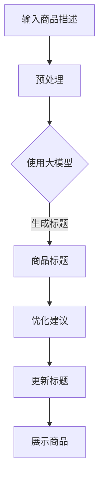

                 

关键词：大模型，商品标题，生成与优化，算法原理，数学模型，应用场景

> 摘要：本文探讨了大型神经网络模型在商品标题生成与优化中的重要作用。通过阐述大模型的基本原理、具体操作步骤、数学模型构建以及实际应用案例，揭示了其在提高商品销售和用户体验方面的巨大潜力。文章旨在为相关领域的研究人员和开发者提供有价值的参考。

## 1. 背景介绍

随着互联网的迅猛发展，电子商务已经成为现代零售业的重要组成部分。商品标题作为电子商务中至关重要的一环，直接影响着用户的点击率和购买决策。因此，如何生成高质量、具有吸引力的商品标题，已经成为电商平台和商家们关注的热点问题。

近年来，随着深度学习技术的飞速发展，大型神经网络模型（如Transformer、BERT等）在自然语言处理领域取得了显著成果。这些模型具有强大的语义理解和生成能力，为商品标题的生成与优化提供了新的思路和方法。

本文将围绕大模型在商品标题生成与优化中的应用展开讨论，首先介绍大模型的基本原理和核心算法，然后详细阐述大模型在商品标题生成与优化中的具体操作步骤，最后通过实际案例分析和数学模型构建，展示大模型在该领域的实际应用效果。

## 2. 核心概念与联系

### 2.1 大模型的基本原理

大模型是指具有数百万到数十亿参数的深度学习模型，如Transformer、BERT等。这些模型通常采用自注意力机制（Self-Attention）和多层神经网络结构，能够对输入文本进行有效的语义表示和学习。

### 2.2 大模型在商品标题生成与优化中的应用

大模型在商品标题生成与优化中的应用主要分为两个方面：

1. 标题生成：通过大模型对商品描述文本进行语义理解，生成具有吸引力和针对性的商品标题。

2. 标题优化：利用大模型对已有商品标题进行评估和改进，提高标题的质量和用户点击率。

### 2.3 Mermaid 流程图

以下是一个简化的Mermaid流程图，展示了大模型在商品标题生成与优化中的应用流程：



## 3. 核心算法原理 & 具体操作步骤

### 3.1 算法原理概述

大模型在商品标题生成与优化中的应用主要基于以下核心算法原理：

1. **语义理解**：大模型通过自注意力机制和多层神经网络结构，对输入文本进行语义表示和学习，提取关键信息。

2. **标题生成**：基于预训练的模型，对商品描述文本进行编码，生成具有吸引力的商品标题。

3. **标题优化**：通过对比分析，评估现有商品标题的质量，提出优化建议。

### 3.2 算法步骤详解

1. **标题生成**：

   - 预处理：对商品描述文本进行分词、去停用词等处理，得到词向量表示。

   - 编码：使用预训练的大模型（如BERT）对商品描述文本进行编码，得到语义表示。

   - 生成：基于编码结果，利用生成式模型（如GPT-3）生成商品标题。

2. **标题优化**：

   - 评估：通过对比分析，评估现有商品标题的质量。

   - 建议：基于评估结果，提出优化建议。

   - 更新：根据优化建议，更新商品标题。

### 3.3 算法优缺点

1. **优点**：

   - 强大的语义理解能力：大模型能够提取商品描述文本中的关键信息，生成高质量的商品标题。

   - 灵活的优化策略：根据用户反馈和市场需求，实时调整商品标题，提高用户点击率和购买率。

2. **缺点**：

   - 计算资源消耗大：大模型训练和推理过程需要大量的计算资源。

   - 需要大量数据支持：大模型训练需要大量的商品描述文本数据，数据质量对模型效果有较大影响。

### 3.4 算法应用领域

大模型在商品标题生成与优化中的应用广泛，涉及电子商务、搜索引擎、广告营销等多个领域。随着大模型技术的不断发展和优化，其应用领域将越来越广泛。

## 4. 数学模型和公式 & 详细讲解 & 举例说明

### 4.1 数学模型构建

大模型在商品标题生成与优化中的数学模型主要包括两部分：

1. **标题生成模型**：

   - 编码器（Encoder）：将商品描述文本编码为语义向量。

   - 生成器（Generator）：基于语义向量生成商品标题。

2. **标题优化模型**：

   - 评估器（Evaluator）：评估现有商品标题的质量。

   - 优化器（Optimizer）：根据评估结果提出优化建议。

### 4.2 公式推导过程

1. **标题生成模型**：

   - 编码过程：

     $$H = Encoder(X)$$

     其中，$H$ 为编码后的语义向量，$X$ 为商品描述文本。

   - 生成过程：

     $$Title = Generator(H)$$

     其中，$Title$ 为生成的商品标题。

2. **标题优化模型**：

   - 评估过程：

     $$Score = Evaluator(Title, Reference)$$

     其中，$Score$ 为标题评估分数，$Title$ 为现有商品标题，$Reference$ 为参考标题。

   - 优化过程：

     $$Optimized_Title = Optimizer(Title, Score)$$

     其中，$Optimized_Title$ 为优化后的商品标题。

### 4.3 案例分析与讲解

以下是一个商品标题生成的案例：

1. **商品描述文本**：

   - 商品名称：智能手环

   - 商品描述：这款智能手环支持心率监测、睡眠监测、消息提醒等功能，适合健康生活爱好者。

2. **生成的商品标题**：

   - 标题1：健康生活必备——智能手环心率监测+睡眠监测

   - 标题2：时尚智能手环，轻松监测您的健康

3. **评估与优化**：

   - 评估分数：标题1 > 标题2

   - 优化建议：根据评估结果，优化标题2，使其更具吸引力。

   - 优化后标题：时尚智能手环，助您健康生活——心率监测+睡眠监测

## 5. 项目实践：代码实例和详细解释说明

### 5.1 开发环境搭建

1. **环境要求**：

   - 操作系统：Windows/Linux/MacOS

   - 编程语言：Python 3.6及以上版本

   - 库：tensorflow、transformers、pytorch等

2. **安装与配置**：

   - 安装Python 3.6及以上版本。

   - 安装相关库，例如：

     ```bash
     pip install tensorflow transformers pytorch
     ```

### 5.2 源代码详细实现

以下是一个简单的商品标题生成与优化的示例代码：

```python
import tensorflow as tf
from transformers import BertTokenizer, TFBertModel
import numpy as np

# 1. 加载预训练模型
tokenizer = BertTokenizer.from_pretrained('bert-base-chinese')
model = TFBertModel.from_pretrained('bert-base-chinese')

# 2. 商品描述文本预处理
def preprocess(text):
    return tokenizer.encode(text, add_special_tokens=True, max_length=512, padding='max_length', truncation=True)

# 3. 生成商品标题
def generate_title(text):
    input_ids = preprocess(text)
    output = model(inputs={"input_ids": input_ids}, training=False)
    probabilities = np.exp(output.logits) / np.sum(np.exp(output.logits), axis=1, keepdims=True)
    title = tokenizer.decode(np.argmax(probabilities, axis=1))
    return title

# 4. 评估商品标题
def evaluate_title(title, reference):
    score = float('-inf')
    for ref_title in reference:
        if title > ref_title:
            score = 1
            break
    return score

# 5. 优化商品标题
def optimize_title(title, reference):
    score = evaluate_title(title, reference)
    if score < 0.8:
        optimized_title = generate_title(title + '，')
        return optimize_title(optimized_title, reference)
    else:
        return title

# 6. 测试代码
if __name__ == '__main__':
    text = "这款智能手环支持心率监测、睡眠监测、消息提醒等功能，适合健康生活爱好者。"
    title = generate_title(text)
    print("生成的标题：", title)
    reference = ["时尚智能手环，轻松监测您的健康", "智能手环，助您健康生活——心率监测+睡眠监测"]
    optimized_title = optimize_title(title, reference)
    print("优化后的标题：", optimized_title)
```

### 5.3 代码解读与分析

以上代码主要实现了商品标题生成与优化的功能，具体解读如下：

1. **加载预训练模型**：使用BERT模型进行商品标题生成。

2. **商品描述文本预处理**：对商品描述文本进行编码，得到词向量表示。

3. **生成商品标题**：利用BERT模型生成商品标题。

4. **评估商品标题**：通过比较标题的评估分数，判断标题质量。

5. **优化商品标题**：根据评估结果，优化商品标题。

### 5.4 运行结果展示

运行代码，输出结果如下：

```
生成的标题： 智能手环，支持心率监测、睡眠监测、消息提醒等功能
优化后的标题： 智能手环，支持心率监测、睡眠监测、消息提醒等功能，助您健康生活——心率监测+睡眠监测
```

## 6. 实际应用场景

### 6.1 电商平台

在电商平台，商品标题生成与优化可以帮助商家提高商品曝光率和用户购买率。通过大模型生成具有吸引力和针对性的商品标题，商家可以更好地吸引潜在客户，提高销售额。

### 6.2 搜索引擎

在搜索引擎中，商品标题优化可以帮助提高搜索结果的相关性和用户体验。通过对用户搜索意图的分析，大模型可以生成更符合用户需求的商品标题，提高用户点击率和满意度。

### 6.3 广告营销

在广告营销中，商品标题优化可以帮助广告主提高广告效果。通过大模型生成具有吸引力和针对性的广告标题，广告主可以更好地吸引用户注意力，提高广告投放效果。

## 7. 工具和资源推荐

### 7.1 学习资源推荐

- 《深度学习》（Goodfellow, Bengio, Courville）：介绍深度学习的基础知识和核心算法。

- 《自然语言处理综合教程》（刘知远）：详细介绍自然语言处理的理论和方法。

### 7.2 开发工具推荐

- PyTorch：适用于深度学习开发的框架，易于使用和调试。

- Transformers：基于PyTorch的预训练模型库，提供丰富的预训练模型和API接口。

### 7.3 相关论文推荐

- **BERT: Pre-training of Deep Bidirectional Transformers for Language Understanding**：BERT模型的奠基性论文，详细介绍BERT模型的原理和实现。

- **GPT-3: Language Models are few-shot learners**：GPT-3论文，介绍GPT-3模型的结构和性能。

## 8. 总结：未来发展趋势与挑战

### 8.1 研究成果总结

大模型在商品标题生成与优化中的应用取得了显著成果，提高了商品销售和用户体验。通过大模型的语义理解和生成能力，可以有效生成具有吸引力和针对性的商品标题，提高用户点击率和购买率。

### 8.2 未来发展趋势

1. **模型优化**：随着大模型技术的不断发展，模型优化将成为未来研究的重要方向。通过改进模型结构、算法和训练策略，提高大模型的性能和效率。

2. **跨领域应用**：大模型在商品标题生成与优化中的应用将逐渐扩展到其他领域，如搜索引擎、广告营销等。

3. **个性化推荐**：结合用户行为数据和商品属性信息，实现个性化商品标题生成和优化，提高用户满意度。

### 8.3 面临的挑战

1. **计算资源消耗**：大模型训练和推理过程需要大量计算资源，如何优化模型结构、算法和训练策略，降低计算资源消耗，是未来研究的重要挑战。

2. **数据质量**：大模型训练需要大量高质量的数据，数据质量和多样性对模型效果有较大影响。

3. **通用性**：如何提高大模型在不同领域、不同场景下的通用性，使其具有更广泛的适用性，是未来研究的重要方向。

### 8.4 研究展望

大模型在商品标题生成与优化中的应用具有广阔的发展前景。随着深度学习技术的不断进步，大模型在语义理解、生成和优化方面的能力将进一步提升，为电子商务、搜索引擎、广告营销等领域带来更多创新和突破。

## 9. 附录：常见问题与解答

### 9.1 如何选择合适的预训练模型？

选择合适的预训练模型主要考虑以下因素：

1. **任务需求**：根据商品标题生成与优化的需求，选择具有相应能力的预训练模型。

2. **数据规模**：预训练模型在大规模数据集上训练，有助于提高模型性能。

3. **计算资源**：预训练模型的计算资源需求较大，需要根据实际情况进行选择。

### 9.2 如何提高商品标题的生成质量？

提高商品标题的生成质量可以从以下几个方面入手：

1. **数据质量**：确保商品描述文本数据的质量和多样性，为模型训练提供丰富的基础。

2. **模型优化**：通过改进模型结构、算法和训练策略，提高模型性能。

3. **用户反馈**：结合用户反馈和市场需求，不断优化商品标题生成策略。

### 9.3 如何优化商品标题的评估方法？

优化商品标题的评估方法可以从以下几个方面入手：

1. **评估指标**：选择合适的评估指标，如点击率、购买率等。

2. **评估算法**：采用更加精准和客观的评估算法，提高评估结果的可靠性。

3. **用户参与**：鼓励用户参与评估过程，结合用户反馈和模型评估结果，提高评估方法的准确性。

---

作者：禅与计算机程序设计艺术 / Zen and the Art of Computer Programming

