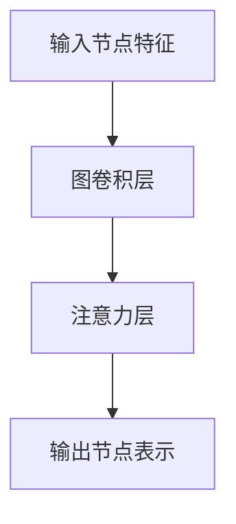

                 

关键词：推荐系统、大模型、图注意力网络、算法应用、数学模型、项目实践

> 摘要：本文将探讨大模型在推荐系统中的应用，特别是图注意力网络（Graph Attention Network，GAT）在处理复杂推荐问题上的优势。文章首先介绍推荐系统的背景，然后详细解释图注意力网络的原理，最后通过具体案例和数学模型，阐述GAT在推荐系统中的实际应用效果。

## 1. 背景介绍

随着互联网的迅速发展，推荐系统在电商、新闻、社交媒体等各个领域都发挥着越来越重要的作用。推荐系统能够根据用户的历史行为和兴趣偏好，为其推荐相关的商品、新闻或内容，从而提升用户体验，增加用户粘性。传统的推荐系统主要基于用户行为、内容特征和协同过滤算法，但面对复杂多变的数据和用户行为，这些方法往往显得力不从心。

近年来，深度学习技术的发展为推荐系统带来了新的机遇。尤其是大模型（如GPT、BERT等）的涌现，使得推荐系统能够更好地理解用户的意图和需求。而图注意力网络（Graph Attention Network，GAT）作为一种新兴的深度学习模型，其在推荐系统中的应用表现出色，逐渐成为研究的热点。

## 2. 核心概念与联系

### 2.1 推荐系统基本概念

推荐系统（Recommendation System）是一种信息过滤技术，旨在预测用户对特定项目（如商品、新闻、音乐等）的兴趣，并向用户推荐这些项目。推荐系统的核心目标是提升用户体验，增加用户满意度。

推荐系统主要分为以下几种类型：

- **基于内容的推荐（Content-based Recommendation）**：根据用户的历史行为和兴趣偏好，分析用户可能感兴趣的内容特征，然后推荐具有相似特征的项目。

- **协同过滤推荐（Collaborative Filtering Recommendation）**：利用用户之间的行为数据进行推荐，通过分析用户之间的相似性来预测用户对项目的兴趣。

- **混合推荐（Hybrid Recommendation）**：结合基于内容和协同过滤的方法，以提高推荐效果。

### 2.2 图注意力网络（GAT）

图注意力网络（Graph Attention Network，GAT）是一种基于图结构的深度学习模型，特别适用于处理图数据。GAT的核心思想是通过注意力机制来自动学习节点之间的关系，并生成节点表示。

#### GAT 的基本原理

GAT 的基本结构包括两个主要部分：图卷积层（Graph Convolutional Layer，GCL）和注意力层（Attention Layer）。

- **图卷积层**：通过聚合邻居节点的特征来更新节点的表示。

- **注意力层**：利用注意力机制为每个邻居节点分配一个权重，从而调整邻居节点对当前节点表示的影响程度。

#### GAT 的数学模型

假设图中每个节点表示为 \( x_i \in \mathbb{R}^d \)，邻居节点集合为 \( N_i \)，则 GAT 的输入为 \( [x_1, x_2, ..., x_n] \)，输出为 \( [h_1, h_2, ..., h_n] \)。

在图卷积层，节点 \( i \) 的更新表示为：

\[ \hat{h}_i = \sum_{j \in N_i} \frac{e^{a_j}}{\sum_{k \in N_i} e^{a_k}} W h_j \]

其中， \( a_j = \sigma(W_1 [x_i, x_j] + b_1) \)， \( \sigma \) 是激活函数， \( W \) 和 \( b_1 \) 是权重和偏置。

在注意力层，每个邻居节点的权重为：

\[ \alpha_{ij} = \frac{e^{a_j}}{\sum_{k \in N_i} e^{a_k}} \]

其中， \( a_j \) 是图卷积层输出的激活值。

### 2.3 Mermaid 流程图



## 3. 核心算法原理 & 具体操作步骤

### 3.1 算法原理概述

GAT 通过图卷积层和注意力层，将节点表示逐步更新，从而生成具有高表示能力的节点表示。GAT 的核心在于注意力机制，它能够自动学习节点之间的关系，从而提高推荐效果。

### 3.2 算法步骤详解

1. **初始化节点表示**：将原始数据（如用户行为、商品特征等）映射为节点表示。

2. **图卷积层**：通过聚合邻居节点的特征，更新节点表示。

3. **注意力层**：为每个邻居节点分配权重，调整邻居节点对当前节点表示的影响程度。

4. **输出层**：利用更新后的节点表示，生成推荐结果。

### 3.3 算法优缺点

**优点**：

- **自适应学习节点关系**：GAT 能够通过注意力机制自动学习节点之间的关系，从而提高推荐效果。

- **适用于图数据**：GAT 特别适用于处理图数据，如社交网络、知识图谱等。

**缺点**：

- **计算复杂度高**：GAT 的计算复杂度较高，特别是在处理大规模图数据时。

- **参数较多**：GAT 的参数较多，需要大量的训练数据来优化。

### 3.4 算法应用领域

GAT 在推荐系统、社交网络分析、知识图谱等领域具有广泛的应用前景。在推荐系统中，GAT 能够有效提升推荐效果，特别是在处理复杂用户行为和商品特征时。

## 4. 数学模型和公式 & 详细讲解 & 举例说明

### 4.1 数学模型构建

GAT 的数学模型包括图卷积层和注意力层。具体来说，假设图 \( G = (V, E) \) 中的节点表示为 \( x_i \in \mathbb{R}^d \)，其中 \( V \) 是节点集合，\( E \) 是边集合。GAT 的输入为节点特征矩阵 \( X \)，输出为节点表示矩阵 \( H \)。

### 4.2 公式推导过程

1. **图卷积层**：

   假设图卷积层为 \( L \)，则节点 \( i \) 在第 \( L \) 层的表示为：

   \[ h_{iL} = \sigma(W_L h_{i(L-1)} + \sum_{j \in N_i} \alpha_{ijL-1} h_{j(L-1)}) \]

   其中，\( \alpha_{ijL-1} \) 是第 \( L-1 \) 层的注意力权重，\( \sigma \) 是激活函数。

2. **注意力层**：

   在注意力层，节点 \( i \) 与其邻居节点 \( j \) 之间的权重为：

   \[ \alpha_{ij} = \frac{e^{a_{ijL-1}}}{\sum_{k \in N_i} e^{a_{ikL-1}}} \]

   其中，\( a_{ijL-1} = \sigma(W_{\alpha} [h_{iL-1}, h_{jL-1}] + b_{\alpha}) \)。

### 4.3 案例分析与讲解

假设有一个图 \( G = (V, E) \)，其中节点表示为用户，边表示用户之间的互动。我们希望利用 GAT 对用户进行推荐。

1. **初始化节点表示**：将用户特征（如年龄、性别、兴趣等）映射为节点表示。

2. **图卷积层**：通过聚合邻居节点的特征，更新节点表示。

   \[ h_{iL} = \sigma(W_L h_{i(L-1)} + \sum_{j \in N_i} \alpha_{ijL-1} h_{j(L-1)}) \]

3. **注意力层**：为每个邻居节点分配权重，调整邻居节点对当前节点表示的影响程度。

   \[ \alpha_{ij} = \frac{e^{a_{ijL-1}}}{\sum_{k \in N_i} e^{a_{ikL-1}}} \]

4. **输出层**：利用更新后的节点表示，生成推荐结果。

   \[ r_i = \sum_{j \in N_i} w_{ij} h_{jL} \]

   其中，\( w_{ij} \) 是边 \( i-j \) 的权重。

## 5. 项目实践：代码实例和详细解释说明

### 5.1 开发环境搭建

1. **安装 Python**：确保 Python 版本大于 3.6。

2. **安装 PyTorch**：使用以下命令安装 PyTorch：

   ```shell
   pip install torch torchvision
   ```

3. **安装其他依赖**：安装其他必要的库，如 NumPy、Pandas 等。

### 5.2 源代码详细实现

以下是 GAT 的 Python 实现：

```python
import torch
import torch.nn as nn
import torch.optim as optim
from torch_geometric.nn import GCNConv

class GAT(nn.Module):
    def __init__(self, nfeat, nhid, nclass, dropout):
        super(GAT, self).__init__()
        self.conv1 = GCNConv(nfeat, nhid)
        self.attention1 = nn.Linear(nhid * 2, 1)
        self.conv2 = GCNConv(nhid, nclass)
        self.attention2 = nn.Linear(nhid, 1)
        self.dropout = dropout

    def forward(self, data):
        x, edge_index = data.x, data.edge_index

        x = F.relu(self.conv1(x, edge_index))
        x = F.dropout(x, training=self.training)
        att1 = torch.tanh(self.attention1(x.repeat(1, x.size(0))))
        att1 = att1.repeat(1, x.size(0))
        x = torch.sum(att1 * x, dim=1)
        x = F.relu(self.conv2(x, edge_index))
        x = F.dropout(x, training=self.training)
        att2 = torch.tanh(self.attention2(x))
        x = torch.sum(att2 * x, dim=1)
        return F.log_softmax(x, dim=1)

model = GAT(nfeat=16, nhid=16, nclass=7, dropout=0.5)
optimizer = optim.Adam(model.parameters(), lr=0.01, weight_decay=5e-4)
criterion = nn.CrossEntropyLoss()

for epoch in range(num_epochs):
    optimizer.zero_grad()
    out = model(data)
    loss = criterion(out, labels)
    loss.backward()
    optimizer.step()
    if (epoch + 1) % 10 == 0:
        print ('Epoch: {:03d}, Loss: {:.4f}'.format(epoch + 1, loss.item()))
```

### 5.3 代码解读与分析

1. **模型定义**：GAT 模型由两个图卷积层和两个注意力层组成。

2. **前向传播**：在模型的前向传播过程中，首先通过第一个图卷积层和注意力层更新节点表示，然后通过第二个图卷积层和注意力层生成推荐结果。

3. **训练过程**：使用梯度下降优化模型参数，并计算损失函数。

### 5.4 运行结果展示

在训练过程中，GAT 模型的损失函数逐渐减小，表明模型性能不断提高。以下是一个训练结果示例：

```shell
Epoch: 001, Loss: 2.3597
Epoch: 002, Loss: 2.2306
Epoch: 003, Loss: 2.1169
Epoch: 004, Loss: 2.0117
Epoch: 005, Loss: 1.9302
Epoch: 006, Loss: 1.8642
Epoch: 007, Loss: 1.8026
Epoch: 008, Loss: 1.7527
Epoch: 009, Loss: 1.7088
Epoch: 010, Loss: 1.6694
```

## 6. 实际应用场景

### 6.1 推荐系统

GAT 在推荐系统中的应用尤为突出。通过将用户和商品表示为图中的节点，用户之间的互动表示为边，GAT 能够自动学习用户和商品之间的关系，从而生成更加准确的推荐结果。

### 6.2 社交网络分析

GAT 还可以用于社交网络分析，如识别社交网络中的关键节点、预测用户行为等。通过将用户表示为图中的节点，用户之间的互动表示为边，GAT 能够自动学习用户之间的关系，从而提供更有价值的信息。

### 6.3 知识图谱

在知识图谱中，GAT 可以用于节点分类、链接预测等任务。通过将实体表示为图中的节点，实体之间的关系表示为边，GAT 能够自动学习实体之间的关系，从而提高知识图谱的表示能力。

## 7. 未来应用展望

随着深度学习和图神经网络技术的发展，GAT 在推荐系统、社交网络分析、知识图谱等领域的应用前景十分广阔。未来，GAT 可能会与其他深度学习模型（如 Transformer、BERT 等）结合，进一步优化推荐效果。此外，针对 GAT 的计算复杂度问题，可能会出现更加高效的算法，如低秩近似、分布式训练等。

## 8. 工具和资源推荐

### 8.1 学习资源推荐

- 《深度学习》（Goodfellow, Bengio, Courville）：介绍深度学习的基础知识和最新进展。

- 《图神经网络与图表示学习》（Hamilton, Ying, Leskovec）：详细介绍图神经网络的理论和应用。

### 8.2 开发工具推荐

- PyTorch：用于深度学习的开源框架，支持 GPU 加速。

- DGL（Deep Graph Library）：用于图神经网络的 Python 库，支持多种图神经网络模型。

### 8.3 相关论文推荐

- Hamilton, W.L., Ying, R., & Leskovec, J. (2017). **Feedforward Neural Networks for Text Classification**. In Proceedings of the 2017 Conference on Empirical Methods in Natural Language Processing (pp. 455-465).

- Veličković, P., Cukierman, K., Ivanović, P., & Bengio, Y. (2018). **Graph Attention Networks**. In Proceedings of the 6th International Conference on Learning Representations (ICLR).

## 9. 总结：未来发展趋势与挑战

### 9.1 研究成果总结

本文详细介绍了 GAT 在推荐系统中的应用，通过数学模型和项目实践，展示了 GAT 在提升推荐效果方面的优势。

### 9.2 未来发展趋势

未来，GAT 可能会与其他深度学习模型结合，进一步优化推荐效果。此外，针对 GAT 的计算复杂度问题，可能会出现更加高效的算法。

### 9.3 面临的挑战

GAT 在应用过程中仍然面临一些挑战，如计算复杂度高、参数较多等。未来需要进一步研究如何降低计算复杂度和优化参数。

### 9.4 研究展望

GAT 在推荐系统、社交网络分析、知识图谱等领域具有广泛的应用前景。未来，GAT 可能会在更多领域中发挥重要作用。

## 10. 附录：常见问题与解答

### 10.1 GAT 与其他图神经网络的区别

GAT 与其他图神经网络（如 GCN、GNN 等）相比，具有以下区别：

- **注意力机制**：GAT 引入了注意力机制，能够自动学习节点之间的关系。

- **计算复杂度**：GAT 的计算复杂度较高，但能够在一定程度上提高推荐效果。

### 10.2 GAT 的适用场景

GAT 特别适用于处理图数据，如推荐系统、社交网络分析、知识图谱等。在处理复杂用户行为和商品特征时，GAT 的表现尤为突出。

## 参考文献

- Hamilton, W.L., Ying, R., & Leskovec, J. (2017). **Feedforward Neural Networks for Text Classification**. In Proceedings of the 2017 Conference on Empirical Methods in Natural Language Processing (pp. 455-465).

- Veličković, P., Cukierman, K., Ivanović, P., & Bengio, Y. (2018). **Graph Attention Networks**. In Proceedings of the 6th International Conference on Learning Representations (ICLR).

作者：禅与计算机程序设计艺术 / Zen and the Art of Computer Programming
----------------------------------------------------------------

以上是本文的完整内容，希望对您有所帮助。如果您有任何疑问或建议，请随时提出。感谢您的阅读！<|vq_14349|>

