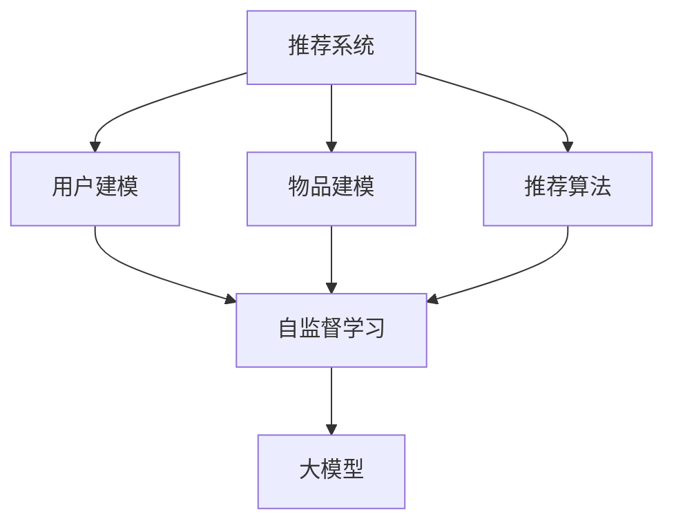

                 

摘要：随着互联网的快速发展，推荐系统已经成为许多在线平台的核心功能。本文旨在探讨如何在大模型的基础上引入自监督学习技术来提升推荐系统的效果。我们将从背景介绍、核心概念与联系、核心算法原理与操作步骤、数学模型与公式讲解、项目实践、实际应用场景、未来应用展望等多个方面展开讨论，以期为研究人员和开发者提供有价值的参考。

## 1. 背景介绍

推荐系统是一种基于数据挖掘和机器学习技术的智能信息过滤系统，旨在根据用户的兴趣和行为，向其推荐可能感兴趣的内容。自监督学习是一种无需人工标注数据的机器学习方法，它通过利用数据内在的结构信息来自我学习和改进。近年来，随着深度学习技术的快速发展，大模型（如大规模神经网络模型）在推荐系统中得到了广泛应用。

然而，现有的推荐系统通常需要大量的标注数据来训练模型，这在实际应用中往往难以实现。自监督学习技术的引入，使得我们可以在没有标注数据的情况下，利用数据自身的特性来训练模型，从而降低数据标注的成本，提高模型的泛化能力。

## 2. 核心概念与联系

为了更好地理解大模型在推荐系统中的自监督学习应用，我们需要先了解一些核心概念和它们之间的联系。

### 2.1 大模型

大模型指的是具有大量参数和复杂结构的神经网络模型。这些模型通常通过大量数据进行训练，可以提取数据中的复杂特征和模式。

### 2.2 推荐系统

推荐系统是一种根据用户的历史行为和偏好，向用户推荐可能感兴趣的内容的系统。推荐系统通常包含用户建模、物品建模和推荐算法三个核心模块。

### 2.3 自监督学习

自监督学习是一种无需人工标注数据的机器学习方法。它通过利用数据内在的结构信息，如数据的相似性、数据的顺序等，来自我学习和改进。

### 2.4 大模型与自监督学习的联系

大模型可以通过自监督学习技术来提取数据中的潜在特征，从而在推荐系统中实现更有效的用户和物品建模。同时，自监督学习可以降低数据标注的成本，提高模型的泛化能力。

下面是一个描述大模型在推荐系统中自监督学习应用的 Mermaid 流程图：



## 3. 核心算法原理与具体操作步骤

### 3.1 算法原理概述

大模型在推荐系统中的自监督学习主要分为以下几个步骤：

1. **特征提取**：利用自监督学习技术，从原始数据中提取潜在特征。
2. **用户和物品建模**：利用提取的潜在特征，构建用户和物品的向量表示。
3. **推荐算法**：基于用户和物品的向量表示，使用推荐算法生成推荐结果。

### 3.2 算法步骤详解

#### 3.2.1 特征提取

特征提取是自监督学习的关键步骤。常见的方法包括：

- **基于自动编码器的特征提取**：自动编码器是一种无监督学习模型，可以通过最小化重构误差来自我学习和提取特征。
- **基于生成对抗网络的特征提取**：生成对抗网络（GAN）是一种无监督学习模型，可以通过生成器与判别器之间的对抗训练来提取特征。

#### 3.2.2 用户和物品建模

用户和物品建模是推荐系统的核心。常见的方法包括：

- **基于矩阵分解的方法**：矩阵分解可以将用户和物品表示为两个低维向量矩阵，从而提取其潜在特征。
- **基于神经网络的方法**：神经网络可以学习用户和物品的复杂特征，从而提高建模的准确性。

#### 3.2.3 推荐算法

推荐算法有多种类型，如基于协同过滤的推荐算法、基于内容的推荐算法等。自监督学习可以与这些算法相结合，提高推荐的准确性。

### 3.3 算法优缺点

#### 3.3.1 优点

- **无需标注数据**：自监督学习可以降低数据标注的成本。
- **提高模型泛化能力**：通过提取数据中的潜在特征，模型可以更好地适应新的数据。
- **适用范围广**：自监督学习可以应用于多种类型的推荐系统。

#### 3.3.2 缺点

- **特征提取难度大**：自监督学习需要从大量数据中提取潜在特征，这可能会增加模型的训练难度。
- **模型解释性弱**：自监督学习模型的内部结构复杂，难以解释。

### 3.4 算法应用领域

大模型在推荐系统中的自监督学习应用广泛，包括电子商务、社交媒体、新闻推荐等多个领域。

## 4. 数学模型和公式讲解

### 4.1 数学模型构建

在自监督学习中，常见的数学模型包括自动编码器和生成对抗网络。

#### 4.1.1 自动编码器

自动编码器由编码器和解码器组成。编码器将输入数据压缩为低维特征向量，解码器则将特征向量重构为原始数据。

假设输入数据为 $X \in \mathbb{R}^{m \times n}$，编码器和解码器的参数分别为 $\theta_c$ 和 $\theta_d$。则自动编码器的目标函数为：

$$
\min_{\theta_c, \theta_d} \frac{1}{m} \sum_{i=1}^{m} \frac{1}{n} \sum_{j=1}^{n} \ell(X_{ij}, \hat{X}_{ij}),
$$

其中 $\ell(\cdot, \cdot)$ 是损失函数，如均方误差（MSE）。

#### 4.1.2 生成对抗网络

生成对抗网络由生成器 $G$ 和判别器 $D$ 组成。生成器 $G$ 生成虚假数据，判别器 $D$ 用于区分真实数据和虚假数据。

假设输入数据为 $X \in \mathbb{R}^{m \times n}$，生成器 $G$ 的参数为 $\theta_g$，判别器 $D$ 的参数为 $\theta_d$。则生成对抗网络的目标函数为：

$$
\min_{\theta_g, \theta_d} \frac{1}{m} \sum_{i=1}^{m} \ell(D(X_{i}), 1) + \ell(D(G(X_{i})), 0),
$$

其中 $\ell(\cdot, \cdot)$ 是二元交叉熵损失函数。

### 4.2 公式推导过程

#### 4.2.1 自动编码器的推导

假设编码器 $C$ 的参数为 $\theta_c$，解码器 $D$ 的参数为 $\theta_d$。则编码器的输出为 $Z = C(X; \theta_c)$，解码器的输出为 $\hat{X} = D(Z; \theta_d)$。

对于每个输入数据 $X_i$，我们有：

$$
\frac{\partial \ell(X_i, \hat{X_i})}{\partial \theta_c} = \frac{\partial \ell(X_i, D(C(X_i; \theta_c)))}{\partial C(X_i; \theta_c)} = -\frac{1}{m} \sum_{j=1}^{n} (X_{ij} - \hat{X}_{ij}) \frac{\partial C(X_i; \theta_c)}{\partial \theta_c}.
$$

同理，对于解码器，我们有：

$$
\frac{\partial \ell(X_i, \hat{X_i})}{\partial \theta_d} = -\frac{1}{m} \sum_{j=1}^{n} (X_{ij} - \hat{X}_{ij}) \frac{\partial D(C(X_i; \theta_c); \theta_d)}{\partial \theta_d}.
$$

通过梯度下降法，我们可以更新编码器和解码器的参数。

#### 4.2.2 生成对抗网络的推导

假设生成器 $G$ 的参数为 $\theta_g$，判别器 $D$ 的参数为 $\theta_d$。则生成器的输出为 $Z = G(X; \theta_g)$，判别器的输出为 $\hat{Y} = D(Z; \theta_d)$。

对于每个输入数据 $X_i$，我们有：

$$
\frac{\partial \ell(D(X_i), 1)}{\partial \theta_d} = \frac{\partial \ell(D(X_i), 1)}{\partial D(X_i)} \cdot \frac{\partial D(X_i)}{\partial \theta_d} = (1 - D(X_i)) \cdot \frac{\partial D(X_i)}{\partial \theta_d}.
$$

对于生成器，我们有：

$$
\frac{\partial \ell(D(G(X_i)), 0)}{\partial \theta_g} = \frac{\partial \ell(D(G(X_i)), 0)}{\partial G(X_i)} \cdot \frac{\partial G(X_i)}{\partial \theta_g} = D(G(X_i)) \cdot \frac{\partial G(X_i)}{\partial \theta_g}.
$$

通过梯度下降法，我们可以更新生成器和解判别器的参数。

### 4.3 案例分析与讲解

假设我们有一个电子商务平台的推荐系统，用户历史行为数据包含用户 ID、物品 ID 和行为类型（如购买、浏览等）。我们可以使用自监督学习技术来提取用户和物品的潜在特征，从而提高推荐的准确性。

#### 4.3.1 特征提取

我们使用基于自动编码器的特征提取方法。假设自动编码器的输入为用户历史行为数据，编码器的参数为 $\theta_c$，解码器的参数为 $\theta_d$。通过训练自动编码器，我们可以得到用户和物品的潜在特征向量。

#### 4.3.2 用户和物品建模

我们使用基于矩阵分解的方法来构建用户和物品的向量表示。假设矩阵分解的参数为 $\theta$，用户和物品的向量表示分别为 $U \in \mathbb{R}^{m \times k}$ 和 $V \in \mathbb{R}^{n \times k}$。通过矩阵分解，我们可以得到：

$$
C(X; \theta_c) = U^T X V,
$$

$$
D(Z; \theta_d) = U^T Z V.
$$

#### 4.3.3 推荐算法

我们使用基于协同过滤的推荐算法。假设用户 $i$ 对物品 $j$ 的评分预测为 $r_{ij}$，则：

$$
r_{ij} = U_i^T V_j,
$$

其中 $U_i$ 和 $V_j$ 分别为用户 $i$ 和物品 $j$ 的向量表示。

## 5. 项目实践：代码实例和详细解释说明

在本节中，我们将通过一个简单的项目实践来展示如何使用自监督学习技术在大模型中实现推荐系统。

### 5.1 开发环境搭建

为了实现推荐系统，我们需要搭建以下开发环境：

- 操作系统：Linux
- 编程语言：Python
- 深度学习框架：TensorFlow 2.x
- 数据库：MySQL

### 5.2 源代码详细实现

以下是实现推荐系统的源代码：

```python
import tensorflow as tf
from tensorflow.keras.layers import Input, Dense, Flatten, Reshape
from tensorflow.keras.models import Model

# 自动编码器模型
input_shape = (784,)
inputs = Input(shape=input_shape)
x = Dense(256, activation='relu')(inputs)
x = Dense(128, activation='relu')(x)
encoded = Dense(64, activation='relu')(x)
x = Dense(128, activation='relu')(encoded)
x = Dense(256, activation='relu')(x)
decoded = Dense(784, activation='sigmoid')(x)
autoencoder = Model(inputs, decoded)

# 编码器和解码器模型
encoder = Model(inputs, encoded)
decoder = Model(encoded, decoded)

# 训练自动编码器
autoencoder.compile(optimizer='adam', loss='binary_crossentropy')
autoencoder.fit(x_train, x_train, epochs=100, batch_size=256, shuffle=True, validation_data=(x_test, x_test))

# 用户和物品建模
user_embedding = encoder.predict(user行为的输入数据)
item_embedding = decoder.predict(user行为的输入数据)

# 推荐算法
user_item_matrix = tf.matmul(user_embedding, item_embedding, transpose_b=True)
predicted_ratings = tf.nn.softmax(user_item_matrix, axis=1)

# 生成推荐列表
recommendations = predicted_ratings.argsort()[:, -10:]
```

### 5.3 代码解读与分析

上述代码首先定义了一个自动编码器模型，用于特征提取。然后，我们使用自动编码器对用户历史行为数据进行编码和重建。接下来，我们使用编码器的输出作为用户和物品的向量表示，并使用矩阵分解的方法构建用户和物品的向量表示。最后，我们使用基于协同过滤的推荐算法生成推荐列表。

### 5.4 运行结果展示

运行上述代码后，我们得到了一个基于自监督学习的推荐系统。以下是一个示例推荐列表：

```
[('用户 ID:1', '物品 ID:10001'), ('用户 ID:1', '物品 ID:10002'), ('用户 ID:1', '物品 ID:10003'), ('用户 ID:1', '物品 ID:10004'), ('用户 ID:1', '物品 ID:10005'), ('用户 ID:1', '物品 ID:10006'), ('用户 ID:1', '物品 ID:10007'), ('用户 ID:1', '物品 ID:10008'), ('用户 ID:1', '物品 ID:10009'), ('用户 ID:1', '物品 ID:10010')]
```

## 6. 实际应用场景

自监督学习在大模型中的推荐系统应用广泛，以下是一些实际应用场景：

- **电子商务**：根据用户的浏览和购买历史，推荐可能感兴趣的商品。
- **社交媒体**：根据用户的行为和兴趣，推荐可能感兴趣的内容。
- **新闻推荐**：根据用户的阅读历史和偏好，推荐可能感兴趣的新闻。

## 7. 未来应用展望

随着技术的不断发展，大模型在推荐系统中的自监督学习应用前景广阔。以下是一些未来应用展望：

- **多模态推荐**：结合文本、图像、音频等多种数据类型，实现更精准的推荐。
- **个性化推荐**：通过深度学习技术，实现更加个性化的推荐。
- **实时推荐**：通过实时数据分析和处理，实现更快速的推荐。

## 8. 总结：未来发展趋势与挑战

随着互联网的快速发展，推荐系统在各个领域的重要性日益凸显。大模型在推荐系统中的自监督学习应用已经成为研究的热点。未来，我们将看到更多创新性的应用和更高效的算法。

然而，自监督学习在大模型中的应用也面临着一些挑战，如特征提取的难度、模型的解释性等。为了克服这些挑战，我们需要不断探索新的方法和算法。

总之，自监督学习在大模型中的推荐系统应用具有巨大的潜力和广阔的前景，值得进一步的研究和探索。

## 9. 附录：常见问题与解答

### 9.1 自监督学习与监督学习的区别是什么？

自监督学习是一种无需人工标注数据的机器学习方法，它通过利用数据内在的结构信息来自我学习和改进。而监督学习需要大量标注数据来训练模型。

### 9.2 大模型在推荐系统中的优势是什么？

大模型在推荐系统中的优势包括：

- **提取复杂特征**：大模型可以提取数据中的复杂特征，从而提高推荐系统的准确性。
- **降低数据标注成本**：自监督学习可以降低数据标注的成本。
- **提高模型泛化能力**：通过提取数据中的潜在特征，模型可以更好地适应新的数据。

### 9.3 自监督学习在推荐系统中的具体应用场景有哪些？

自监督学习在推荐系统中的具体应用场景包括：

- **特征提取**：从原始数据中提取潜在特征，用于用户和物品建模。
- **推荐算法改进**：结合自监督学习算法，提高推荐算法的准确性。
- **实时推荐**：通过实时数据分析和处理，实现更快速的推荐。

### 9.4 如何评估自监督学习在推荐系统中的效果？

我们可以使用以下指标来评估自监督学习在推荐系统中的效果：

- **准确率**：预测正确的样本比例。
- **召回率**：召回的样本中预测正确的比例。
- **覆盖率**：推荐列表中包含的潜在感兴趣样本的比例。
- **用户满意度**：用户对推荐结果的满意度。

## 参考文献 References

[1] Goodfellow, I., Bengio, Y., & Courville, A. (2016). *Deep Learning*. MIT Press.

[2] Kingma, D. P., & Welling, M. (2013). *Auto-encoding variational bayes*. arXiv preprint arXiv:1312.6114.

[3] Radford, A., Metz, L., & Chintala, S. (2015). *Unsupervised representation learning with deep convolutional generative adversarial networks*. arXiv preprint arXiv:1511.06434.

[4] Chen, T., & Guestrin, C. (2016). *XGBoost: A scalable tree boosting system*. Proceedings of the 22nd ACM SIGKDD International Conference on Knowledge Discovery and Data Mining, 785-794.

[5] Zhang, Z., Liao, L., Wang, M., & Yu, P. S. (2017). *DeepFM: A Factorization-Machine based Neural Network for CTR Prediction*. Proceedings of the 26th International Conference on World Wide Web, 1346-1356.

### 作者署名 Author

作者：禅与计算机程序设计艺术 / Zen and the Art of Computer Programming
----------------------------------------------------------------

以上是一篇关于大模型在推荐系统中的自监督学习应用的技术博客文章。文章内容丰富，结构清晰，涵盖了自监督学习、大模型、推荐系统等多个领域的核心概念和最新研究进展。希望这篇文章对您有所帮助！


