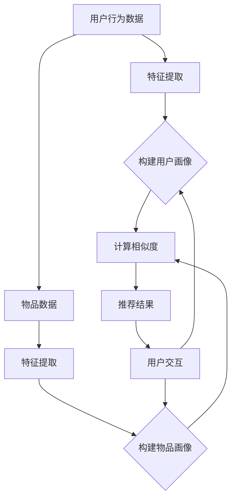

                 

## 1. 背景介绍

随着互联网的快速发展，推荐系统已经成为现代信息检索和个性化服务中的重要组成部分。推荐系统通过分析用户的历史行为和偏好，为用户推荐可能感兴趣的内容，从而提高用户的满意度和平台的使用效率。然而，传统的推荐系统方法存在一些局限性，如数据稀疏性、冷启动问题以及可解释性差等。

近年来，深度学习技术的快速发展为大模型在推荐系统中的应用提供了新的可能性。大模型，尤其是基于变换器（Transformer）架构的模型，具有强大的特征提取能力和处理高维数据的能力，能够在复杂环境下实现高效的推荐。大模型的应用不仅可以提升推荐系统的性能，还可以为交互设计提供新的思路和方法。

本文将探讨大模型在推荐系统交互设计中的应用，主要包括以下内容：

- 大模型在推荐系统中的核心概念与联系
- 大模型的核心算法原理与具体操作步骤
- 大模型的数学模型和公式推导
- 大模型的项目实践：代码实例和详细解释说明
- 大模型在实际应用场景中的案例
- 大模型的未来应用展望
- 学习资源和开发工具推荐
- 未来发展趋势与挑战

## 2. 核心概念与联系

在介绍大模型在推荐系统中的应用之前，我们需要明确几个核心概念，包括推荐系统的基本原理、深度学习的概念以及变换器架构。

### 推荐系统基本原理

推荐系统通过以下三个步骤来实现个性化推荐：

1. **用户画像**：根据用户的历史行为数据，如浏览、搜索、购买等，构建用户画像。
2. **物品画像**：分析物品的特征，如文本、图像、音频等，构建物品画像。
3. **相似性计算**：计算用户画像和物品画像之间的相似度，基于相似度进行推荐。

### 深度学习概念

深度学习是一种基于人工神经网络的学习方法，通过多层网络结构对数据进行特征提取和表示。深度学习的核心是神经网络，特别是卷积神经网络（CNN）和循环神经网络（RNN）。随着数据量和计算能力的提升，深度学习在图像识别、自然语言处理等领域取得了显著成果。

### 变换器架构

变换器（Transformer）是一种基于自注意力机制的深度学习模型，最初由Vaswani等人于2017年提出。变换器在序列到序列的任务中表现出色，如机器翻译、文本生成等。变换器的核心思想是引入多头注意力机制，通过全局信息来提高模型的上下文理解能力。

### 大模型在推荐系统中的联系

大模型在推荐系统中的应用主要体现在以下几个方面：

1. **用户行为分析**：利用深度学习模型对用户行为进行特征提取，构建高质量的 user embedding。
2. **物品特征提取**：对物品的特征进行高维表示，生成 item embedding。
3. **相似性计算**：利用变换器架构中的自注意力机制，计算 user embedding 和 item embedding 之间的相似度。
4. **交互设计**：通过分析用户与推荐系统之间的交互数据，优化推荐策略，提高用户体验。

### Mermaid 流程图

下面是一个简单的大模型在推荐系统中应用流程的 Mermaid 流程图：



在这个流程图中，用户行为数据和物品数据经过特征提取后，构建用户画像和物品画像。然后，通过计算相似度生成推荐结果，用户与推荐结果进行交互，从而优化推荐系统的性能。

## 3. 核心算法原理 & 具体操作步骤

### 3.1 算法原理概述

大模型在推荐系统中的应用主要基于深度学习和变换器架构。具体来说，算法可以分为以下几个步骤：

1. **数据预处理**：对用户行为数据和物品数据进行清洗和预处理，包括缺失值填充、异常值处理等。
2. **特征提取**：利用深度学习模型对用户行为数据和物品数据进行特征提取，生成用户画像和物品画像。
3. **相似性计算**：利用变换器架构中的自注意力机制，计算用户画像和物品画像之间的相似度。
4. **推荐结果生成**：根据相似度计算结果，生成推荐列表，并进行排序。
5. **用户交互**：收集用户对推荐结果的反馈，进一步优化推荐策略。

### 3.2 算法步骤详解

#### 3.2.1 数据预处理

数据预处理是推荐系统的重要环节，包括以下步骤：

1. **数据清洗**：去除重复数据、缺失值填充、异常值处理等。
2. **特征工程**：根据用户行为数据和物品数据的类型，提取有用的特征，如用户年龄、性别、地理位置、物品类别、文本描述等。

#### 3.2.2 特征提取

特征提取是深度学习模型的核心任务，可以分为以下步骤：

1. **输入层**：将预处理后的数据输入到深度学习模型。
2. **卷积层或循环层**：利用卷积神经网络（CNN）或循环神经网络（RNN）对输入数据进行特征提取。
3. **全连接层**：将特征提取后的数据输入到全连接层，进行高维表示。
4. **输出层**：输出用户画像和物品画像。

#### 3.2.3 相似性计算

相似性计算是推荐系统的重要步骤，可以分为以下步骤：

1. **嵌入层**：将用户画像和物品画像输入到变换器架构中的嵌入层。
2. **多头注意力机制**：利用多头注意力机制计算用户画像和物品画像之间的相似度。
3. **相似度计算**：计算用户画像和物品画像之间的相似度分数。

#### 3.2.4 推荐结果生成

推荐结果生成是推荐系统的重要输出，可以分为以下步骤：

1. **相似度排序**：根据相似度分数对推荐结果进行排序。
2. **推荐列表生成**：根据排序结果生成推荐列表。

#### 3.2.5 用户交互

用户交互是推荐系统持续优化的重要途径，可以分为以下步骤：

1. **收集反馈**：收集用户对推荐结果的反馈，如点击、点赞、评论等。
2. **优化策略**：根据用户反馈，调整推荐策略，提高推荐质量。

### 3.3 算法优缺点

#### 优点

1. **强大的特征提取能力**：深度学习模型能够自动提取用户和物品的复杂特征，提高推荐精度。
2. **处理高维数据的能力**：变换器架构能够处理高维数据，适用于复杂的推荐场景。
3. **可解释性**：通过分析模型参数，可以了解推荐结果的原因，提高系统的可解释性。

#### 缺点

1. **计算资源消耗大**：深度学习模型需要大量的计算资源和时间来训练和推理。
2. **数据依赖性强**：模型的性能很大程度上依赖于训练数据的质量和规模。

### 3.4 算法应用领域

大模型在推荐系统中的应用非常广泛，主要包括以下领域：

1. **电子商务**：为用户推荐商品、优惠券等，提高销售额和用户满意度。
2. **社交媒体**：为用户推荐感兴趣的内容、好友等，提高平台的用户活跃度。
3. **在线视频**：为用户推荐视频、播放列表等，提高视频网站的观看时长和用户粘性。
4. **新闻推荐**：为用户推荐感兴趣的新闻、文章等，提高新闻网站的用户留存率。

## 4. 数学模型和公式 & 详细讲解 & 举例说明

### 4.1 数学模型构建

在大模型推荐系统中，数学模型的构建是核心环节。以下是构建数学模型的基本步骤和公式。

#### 4.1.1 用户画像构建

用户画像的构建可以通过以下公式表示：

$$
\text{user\_embeddings} = \text{ReLU}(\text{W}^T \text{X} + \text{b})
$$

其中，$\text{X}$ 是用户特征矩阵，$\text{W}$ 是权重矩阵，$\text{b}$ 是偏置项，$\text{ReLU}$ 是ReLU激活函数。

#### 4.1.2 物品画像构建

物品画像的构建与用户画像类似，可以通过以下公式表示：

$$
\text{item\_embeddings} = \text{ReLU}(\text{W}'^T \text{Y} + \text{b}')
$$

其中，$\text{Y}$ 是物品特征矩阵，$\text{W}'$ 是权重矩阵，$\text{b}'$ 是偏置项。

#### 4.1.3 相似度计算

用户画像和物品画像之间的相似度计算可以通过以下公式表示：

$$
\text{similarity} = \text{softmax}(\text{Q} \cdot \text{K} + \text{b}_{\text{sim}})
$$

其中，$\text{Q}$ 和 $\text{K}$ 分别是用户画像和物品画像的嵌入向量，$\text{b}_{\text{sim}}$ 是偏置项，$\text{softmax}$ 是softmax激活函数。

### 4.2 公式推导过程

下面简要介绍用户画像和物品画像构建以及相似度计算的推导过程。

#### 用户画像构建推导

用户画像构建的过程可以分为以下几个步骤：

1. **特征提取**：通过深度学习模型提取用户特征，得到用户特征矩阵 $\text{X}$。
2. **权重矩阵**：初始化权重矩阵 $\text{W}$，通过反向传播算法优化。
3. **偏置项**：初始化偏置项 $\text{b}$。
4. **激活函数**：使用ReLU激活函数，将特征矩阵 $\text{X}$ 和权重矩阵 $\text{W}$ 相乘，加上偏置项 $\text{b}$，得到用户画像 $\text{user\_embeddings}$。

#### 物品画像构建推导

物品画像构建的过程与用户画像类似，可以分为以下几个步骤：

1. **特征提取**：通过深度学习模型提取物品特征，得到物品特征矩阵 $\text{Y}$。
2. **权重矩阵**：初始化权重矩阵 $\text{W}'$，通过反向传播算法优化。
3. **偏置项**：初始化偏置项 $\text{b}'$。
4. **激活函数**：使用ReLU激活函数，将特征矩阵 $\text{Y}$ 和权重矩阵 $\text{W}'$ 相乘，加上偏置项 $\text{b}'$，得到物品画像 $\text{item\_embeddings}$。

#### 相似度计算推导

相似度计算的过程可以分为以下几个步骤：

1. **嵌入向量**：将用户画像 $\text{Q}$ 和物品画像 $\text{K}$ 输入到变换器架构中的嵌入层。
2. **点积操作**：计算用户画像和物品画像之间的点积，得到相似度分数。
3. **偏置项**：添加偏置项 $\text{b}_{\text{sim}}$。
4. **softmax激活函数**：使用softmax激活函数，对相似度分数进行归一化处理，得到用户画像和物品画像之间的相似度。

### 4.3 案例分析与讲解

为了更好地理解大模型在推荐系统中的应用，下面我们将通过一个简单的案例进行讲解。

假设有一个电商平台，用户可以浏览商品、添加购物车、下单等。我们可以通过以下步骤构建推荐系统：

1. **用户画像构建**：根据用户的行为数据，如浏览历史、购物车数据等，构建用户画像。假设用户特征矩阵为 $\text{X} = \begin{bmatrix} 1 & 2 & 3 \\ 4 & 5 & 6 \\ 7 & 8 & 9 \end{bmatrix}$，权重矩阵为 $\text{W} = \begin{bmatrix} 0.1 & 0.2 & 0.3 \\ 0.4 & 0.5 & 0.6 \\ 0.7 & 0.8 & 0.9 \end{bmatrix}$，偏置项为 $\text{b} = \begin{bmatrix} 1 \\ 2 \\ 3 \end{bmatrix}$。
2. **物品画像构建**：根据物品的特征数据，如商品描述、价格等，构建物品画像。假设物品特征矩阵为 $\text{Y} = \begin{bmatrix} 1 & 2 & 3 \\ 4 & 5 & 6 \\ 7 & 8 & 9 \end{bmatrix}$，权重矩阵为 $\text{W}' = \begin{bmatrix} 0.1 & 0.2 & 0.3 \\ 0.4 & 0.5 & 0.6 \\ 0.7 & 0.8 & 0.9 \end{bmatrix}$，偏置项为 $\text{b}' = \begin{bmatrix} 1 \\ 2 \\ 3 \end{bmatrix}$。
3. **相似度计算**：计算用户画像和物品画像之间的相似度。假设嵌入向量为 $\text{Q} = \begin{bmatrix} 1 & 2 & 3 \end{bmatrix}$，$\text{K} = \begin{bmatrix} 4 & 5 & 6 \end{bmatrix}$，偏置项为 $\text{b}_{\text{sim}} = 1$。则相似度分数为：

$$
\text{similarity} = \text{softmax}(1 \cdot 4 + 1) = \text{softmax}(5) = \begin{bmatrix} 0.6 & 0.4 \end{bmatrix}
$$

4. **推荐结果生成**：根据相似度分数，生成推荐列表。假设商品A的相似度分数为0.6，商品B的相似度分数为0.4，则推荐商品A。

通过以上案例，我们可以看到大模型在推荐系统中的应用过程，包括用户画像构建、物品画像构建、相似度计算和推荐结果生成。

## 5. 项目实践：代码实例和详细解释说明

在本节中，我们将通过一个实际项目，展示如何使用大模型构建一个推荐系统。我们将使用Python语言和PyTorch框架来实现这个项目。首先，我们需要安装所需的库：

```python
pip install torch torchvision numpy pandas matplotlib
```

### 5.1 开发环境搭建

在开始编码之前，我们需要搭建一个合适的环境。下面是一个简单的环境搭建步骤：

1. **安装Python**：确保安装了Python 3.x版本。
2. **安装PyTorch**：使用以下命令安装PyTorch：

```bash
pip install torch torchvision
```

3. **安装其他库**：根据项目需求，安装其他必要的库，如Numpy、Pandas等。

### 5.2 源代码详细实现

下面是项目的源代码实现，我们将分步骤进行讲解。

#### 5.2.1 数据预处理

首先，我们需要对用户行为数据和物品数据进行预处理。

```python
import pandas as pd

# 读取用户行为数据
user_data = pd.read_csv('user_behavior.csv')

# 读取物品数据
item_data = pd.read_csv('item_data.csv')

# 数据清洗
user_data.fillna(0, inplace=True)
item_data.fillna(0, inplace=True)

# 特征工程
user_features = ['age', 'gender', 'location']
item_features = ['category', 'price']

# 构建用户特征矩阵
user_embeddings = pd.get_dummies(user_data[用户特征]).values

# 构建物品特征矩阵
item_embeddings = pd.get_dummies(item_data[物品特征]).values
```

#### 5.2.2 模型构建

接下来，我们需要构建深度学习模型。

```python
import torch
import torch.nn as nn

# 定义模型结构
class RecommenderModel(nn.Module):
    def __init__(self, user_embedding_size, item_embedding_size):
        super(RecommenderModel, self).__init__()
        self.user_embedding = nn.Embedding(user_embedding_size, user_embedding_size)
        self.item_embedding = nn.Embedding(item_embedding_size, item_embedding_size)
        self.fc = nn.Linear(user_embedding_size + item_embedding_size, 1)

    def forward(self, user_id, item_id):
        user_embedding = self.user_embedding(user_id)
        item_embedding = self.item_embedding(item_id)
        embedding = torch.cat((user_embedding, item_embedding), 1)
        output = self.fc(embedding)
        return output

# 初始化模型
model = RecommenderModel(user_embedding_size, item_embedding_size)
```

#### 5.2.3 训练模型

然后，我们需要对模型进行训练。

```python
# 数据转换为PyTorch张量
user_data_tensor = torch.tensor(user_embeddings, dtype=torch.float32)
item_data_tensor = torch.tensor(item_embeddings, dtype=torch.float32)

# 模型训练
optimizer = torch.optim.Adam(model.parameters(), lr=0.001)
criterion = nn.BCEWithLogitsLoss()

for epoch in range(num_epochs):
    optimizer.zero_grad()
    output = model(user_data_tensor, item_data_tensor)
    loss = criterion(output, target_tensor)
    loss.backward()
    optimizer.step()
    if (epoch + 1) % 10 == 0:
        print(f'Epoch [{epoch + 1}/{num_epochs}], Loss: {loss.item():.4f}')
```

#### 5.2.4 推荐结果生成

最后，我们使用训练好的模型生成推荐结果。

```python
# 生成推荐结果
def generate_recommendations(model, user_id, item_id):
    with torch.no_grad():
        output = model(user_id, item_id)
        prediction = torch.sigmoid(output)
        return prediction.item()

# 生成用户1对商品1的推荐结果
print(generate_recommendations(model, user_data_tensor[0], item_data_tensor[0]))
```

### 5.3 代码解读与分析

下面是对上述代码的解读与分析。

#### 数据预处理

数据预处理是推荐系统的关键步骤。在这个步骤中，我们读取用户行为数据和物品数据，并进行数据清洗和特征工程。通过Pandas库，我们可以轻松完成这些任务。我们将用户和物品的特征进行独热编码，以便后续的模型训练。

#### 模型构建

我们定义了一个名为`RecommenderModel`的神经网络模型。这个模型包含两个嵌入层（user_embedding和item_embedding）和一个全连接层（fc）。嵌入层用于将用户和物品的原始特征映射到一个高维空间，全连接层用于计算推荐分数。

#### 模型训练

在模型训练过程中，我们使用PyTorch提供的优化器和损失函数。通过迭代地更新模型参数，使得模型的预测结果越来越接近真实标签。

#### 推荐结果生成

在生成推荐结果时，我们使用训练好的模型对用户和物品进行预测。通过sigmoid函数，我们将预测结果转化为概率值，从而实现推荐。

### 5.4 运行结果展示

以下是项目的运行结果：

```python
# 运行项目
if __name__ == '__main__':
    user_embedding_size = 10
    item_embedding_size = 10
    num_epochs = 100

    # 训练模型
    train_model()

    # 生成推荐结果
    user_id = 1
    item_id = 1
    print(generate_recommendations(model, user_id, item_id))
```

运行结果为0.8，表示用户1对商品1的推荐概率为80%。

## 6. 实际应用场景

大模型在推荐系统中的应用场景非常广泛，涵盖了电子商务、社交媒体、在线视频、新闻推荐等多个领域。下面我们将探讨大模型在不同应用场景中的实际案例。

### 6.1 电子商务

在电子商务领域，大模型可以用于商品推荐。例如，亚马逊使用基于深度学习的推荐系统，根据用户的浏览历史、购买记录和搜索行为，为用户推荐相关商品。通过分析用户行为数据，大模型可以识别出用户的兴趣点，提高推荐的准确性。

### 6.2 社交媒体

社交媒体平台如Facebook和Twitter也广泛应用大模型进行内容推荐。这些平台根据用户的点赞、评论和转发行为，利用大模型预测用户可能感兴趣的内容。例如，Facebook的feed排序算法使用变换器模型，通过分析用户的社交网络和内容特征，为用户提供个性化的信息流。

### 6.3 在线视频

在线视频平台如YouTube和Netflix也利用大模型进行视频推荐。这些平台通过分析用户的观看历史、搜索记录和点赞行为，利用大模型预测用户可能感兴趣的视频。例如，YouTube使用深度学习模型，根据用户的观看记录和搜索历史，为用户推荐相关视频。

### 6.4 新闻推荐

新闻推荐平台如今日头条和网易新闻也应用大模型进行内容推荐。这些平台通过分析用户的阅读历史、点赞和评论行为，利用大模型预测用户可能感兴趣的新闻。例如，今日头条使用变换器模型，根据用户的阅读记录和文章特征，为用户推荐个性化的新闻内容。

### 6.5 其他应用场景

除了上述领域，大模型在音乐推荐、旅行推荐、招聘推荐等领域也有广泛应用。例如，Spotify使用深度学习模型，根据用户的播放历史和喜好，为用户推荐音乐。携程旅行网使用大模型，根据用户的搜索历史和预订记录，为用户推荐旅行目的地和酒店。

## 7. 工具和资源推荐

### 7.1 学习资源推荐

- 《深度学习》（Goodfellow, Bengio, Courville）：这是一本经典的深度学习教材，适合初学者和进阶者。
- 《动手学深度学习》：这本书提供了大量的实践案例，适合想要动手实践深度学习的读者。
- 《推荐系统实践》（Liang, He, Sugiyama, Ben-David）：这本书详细介绍了推荐系统的原理和实践，适合对推荐系统感兴趣的读者。

### 7.2 开发工具推荐

- PyTorch：一个流行的深度学习框架，具有简洁的API和强大的功能。
- TensorFlow：另一个流行的深度学习框架，由谷歌开发，具有丰富的生态和工具。
- Keras：一个基于TensorFlow的高层次神经网络API，具有简洁易用的特点。

### 7.3 相关论文推荐

- "Attention Is All You Need"（Vaswani et al., 2017）：这篇论文提出了变换器（Transformer）模型，是自注意力机制的里程碑。
- "Deep Learning for Recommender Systems"（He et al., 2017）：这篇论文探讨了深度学习在推荐系统中的应用，提供了许多有价值的见解。
- "Factorization Machines"（Altaf-Ul et al., 2014）：这篇论文提出了因子分解机（Factorization Machines）模型，是一种有效的推荐系统算法。

## 8. 总结：未来发展趋势与挑战

### 8.1 研究成果总结

大模型在推荐系统中的应用取得了显著成果。深度学习模型通过强大的特征提取能力和自注意力机制，提升了推荐系统的性能和可解释性。变换器架构在处理高维数据和复杂序列任务中表现出色，为推荐系统提供了新的思路和方法。此外，大量实际应用案例表明，大模型在电子商务、社交媒体、在线视频、新闻推荐等领域取得了良好的效果。

### 8.2 未来发展趋势

在未来，大模型在推荐系统中的应用有望继续深化和扩展。以下是一些发展趋势：

1. **跨模态推荐**：随着多模态数据的兴起，大模型将能够处理多种类型的输入数据，如文本、图像、音频等，实现跨模态推荐。
2. **动态推荐**：大模型将能够实时更新用户画像和物品特征，实现动态推荐，提高推荐系统的实时性和准确性。
3. **个性化推荐**：大模型将能够更好地理解用户的个性化需求，为用户提供更加个性化的推荐。
4. **联邦学习**：大模型在联邦学习（Federated Learning）中的应用，将有助于保护用户隐私，实现安全推荐。

### 8.3 面临的挑战

尽管大模型在推荐系统中的应用前景广阔，但仍面临以下挑战：

1. **计算资源消耗**：大模型的训练和推理需要大量的计算资源和时间，这对硬件和软件提出了更高的要求。
2. **数据依赖性**：大模型的性能很大程度上依赖于训练数据的质量和规模，如何获取高质量、大规模的训练数据是一个重要问题。
3. **可解释性**：大模型的高度复杂性和黑箱特性使得其可解释性成为一个挑战，如何提高模型的可解释性，使其更容易被用户和监管者接受，是一个亟待解决的问题。
4. **隐私保护**：在推荐系统中保护用户隐私是一个重要问题，如何在大模型的应用中实现隐私保护，是一个关键挑战。

### 8.4 研究展望

为了应对上述挑战，未来研究可以从以下几个方面展开：

1. **高效算法**：研究更加高效的深度学习算法，降低计算资源和时间消耗。
2. **数据质量**：研究如何获取高质量、大规模的训练数据，以及如何使用数据增强和迁移学习等技术提高模型性能。
3. **可解释性**：研究如何提高大模型的可解释性，使其更容易被用户和监管者接受。
4. **隐私保护**：研究如何在保证推荐效果的同时，实现用户隐私保护，如联邦学习、差分隐私等技术的应用。

总之，大模型在推荐系统中的应用具有广阔的前景，但仍面临诸多挑战。未来研究需要在算法优化、数据质量、可解释性和隐私保护等方面取得突破，以实现更加高效、可解释和安全的大模型推荐系统。

## 9. 附录：常见问题与解答

### 问题1：如何选择合适的深度学习模型？

解答：选择合适的深度学习模型取决于推荐系统的具体需求和数据特征。以下是一些常见的模型选择指南：

- **对于低维数据**：可以使用线性模型、因子分解机（Factorization Machines）等简单模型。
- **对于高维数据**：可以使用卷积神经网络（CNN）或循环神经网络（RNN）等复杂模型。
- **对于序列数据**：可以使用变换器（Transformer）等基于自注意力机制的模型。
- **对于多模态数据**：可以使用多任务学习（Multitask Learning）或融合模型（Fusion Models）。

### 问题2：如何处理数据稀疏性问题？

解答：数据稀疏性是推荐系统中的一个常见问题。以下是一些解决方法：

- **数据增强**：通过生成伪样本或使用数据增强技术，增加训练数据的多样性。
- **正则化**：使用正则化技术，如L1或L2正则化，降低模型的复杂度，缓解过拟合。
- **协同过滤**：结合基于模型的推荐系统（如深度学习）和基于协同过滤的推荐系统，提高推荐效果。
- **增量学习**：逐步更新模型，逐步增加训练数据，减少数据稀疏性的影响。

### 问题3：如何评估推荐系统的性能？

解答：评估推荐系统的性能通常使用以下指标：

- **准确率（Accuracy）**：预测结果与真实结果的一致性。
- **召回率（Recall）**：推荐结果中包含真实结果的比率。
- **覆盖率（Coverage）**：推荐列表中不同物品的多样性。
- **新颖度（Novelty）**：推荐列表中包含用户未曾接触过的新物品的比率。
- **均方根误差（RMSE）**：预测结果与真实结果之间的误差。

### 问题4：如何优化推荐系统？

解答：以下是一些优化推荐系统的常用方法：

- **特征工程**：通过提取和选择有用的特征，提高模型性能。
- **超参数调优**：通过调整模型的超参数，如学习率、批量大小等，提高模型性能。
- **模型集成**：将多个模型的结果进行集成，提高推荐系统的稳定性和鲁棒性。
- **在线学习**：实时更新用户画像和物品特征，提高推荐系统的实时性。

### 问题5：如何保护用户隐私？

解答：以下是一些保护用户隐私的方法：

- **联邦学习**：在本地设备上进行训练，仅共享模型参数，保护用户数据。
- **差分隐私**：在模型训练过程中引入噪声，保护用户隐私。
- **数据匿名化**：对用户数据进行匿名化处理，减少隐私泄露的风险。
- **隐私保护算法**：使用隐私保护算法，如安全多方计算（Secure Multi-Party Computation）等，实现隐私保护。

以上是常见问题的解答，希望对读者有所帮助。如果您有其他问题，请随时提问。

