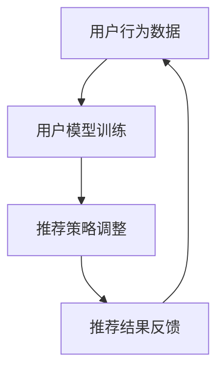

                 

关键词：大模型、推荐系统、反馈循环、深度学习、用户行为分析、内容分发、个性化推荐

> 摘要：本文将探讨大模型在推荐系统反馈循环中的重要作用。通过分析大模型的特点和应用，我们深入探讨了其在推荐系统中的具体作用，以及如何通过反馈循环进一步提升推荐系统的性能和用户体验。本文旨在为业界提供理论指导和实践参考，以推动推荐系统领域的发展。

## 1. 背景介绍

随着互联网的快速发展，信息过载现象日益严重，用户在寻找所需信息时面临着巨大的挑战。推荐系统作为解决这一问题的有效手段，逐渐成为各个领域的重要应用。然而，推荐系统的性能和用户体验仍然面临诸多挑战。本文将探讨大模型在推荐系统反馈循环中的作用，以期提升推荐系统的性能和用户体验。

### 1.1 推荐系统的发展历程

推荐系统的发展经历了从基于内容的推荐（Content-based Filtering）、协同过滤（Collaborative Filtering）到混合推荐（Hybrid Methods）等不同阶段。早期推荐系统主要依赖于用户的历史行为和内容特征，而随着深度学习技术的崛起，基于深度学习的推荐系统逐渐崭露头角。

### 1.2 大模型的发展与应用

大模型是指具有数百万甚至数十亿参数的深度学习模型。近年来，随着计算能力和数据量的提升，大模型在自然语言处理、计算机视觉等领域的表现取得了显著突破。大模型通过自动学习大规模数据中的复杂规律，实现了前所未有的性能。

### 1.3 反馈循环的概念与作用

反馈循环是指推荐系统通过不断收集用户反馈，调整推荐策略，以实现性能提升和用户体验优化的过程。有效的反馈循环机制对于推荐系统至关重要，可以显著提高推荐准确性和用户满意度。

## 2. 核心概念与联系

为了深入理解大模型在推荐系统反馈循环中的作用，我们需要明确几个核心概念，并探讨它们之间的联系。

### 2.1 大模型的特点

大模型具有以下几个显著特点：

1. **参数量巨大**：大模型通常包含数百万甚至数十亿个参数。
2. **强大的学习能力**：大模型可以自动学习大规模数据中的复杂模式。
3. **泛化能力**：大模型具有较强的泛化能力，能够在不同的任务和数据集上取得良好的性能。

### 2.2 推荐系统的架构

推荐系统通常包括用户模型、物品模型和推荐算法三个核心组件。大模型可以应用于这些组件中，从而提升推荐系统的性能。

1. **用户模型**：大模型可以用于学习用户的历史行为和偏好，以构建更准确的用户特征表示。
2. **物品模型**：大模型可以用于学习物品的特征，以实现更精细的物品分类和标签。
3. **推荐算法**：大模型可以用于改进推荐算法，提高推荐准确性和多样性。

### 2.3 反馈循环机制

反馈循环机制是指推荐系统通过不断收集用户反馈，调整推荐策略，以实现性能提升和用户体验优化的过程。大模型在反馈循环中的作用主要体现在以下几个方面：

1. **用户反馈分析**：大模型可以自动分析用户反馈，提取关键特征，以便更好地理解用户需求和偏好。
2. **模型优化**：大模型可以根据用户反馈对模型进行调整和优化，以提高推荐准确性和用户体验。
3. **个性化推荐**：大模型可以基于用户反馈实现个性化推荐，提高用户满意度。

### 2.4 Mermaid 流程图

以下是一个简化的 Mermaid 流程图，展示了大模型在推荐系统反馈循环中的作用：



## 3. 核心算法原理 & 具体操作步骤

### 3.1 算法原理概述

大模型在推荐系统反馈循环中的作用主要通过以下三个方面实现：

1. **用户特征学习**：大模型可以自动学习用户的历史行为和偏好，构建用户特征表示。
2. **物品特征学习**：大模型可以自动学习物品的特征，实现更精细的物品分类和标签。
3. **推荐算法优化**：大模型可以用于改进推荐算法，提高推荐准确性和多样性。

### 3.2 算法步骤详解

1. **数据收集**：收集用户的历史行为数据（如浏览记录、购买记录等）和物品信息（如标题、描述、标签等）。
2. **数据预处理**：对收集到的数据进行清洗、去重、归一化等预处理操作，以便于后续建模。
3. **用户特征学习**：使用大模型（如基于 Transformer 的模型）对用户历史行为数据进行分析，提取用户特征表示。
4. **物品特征学习**：使用大模型对物品信息进行学习，构建物品特征表示。
5. **推荐算法优化**：基于用户和物品特征表示，使用大模型改进推荐算法，提高推荐准确性和多样性。
6. **推荐结果反馈**：将推荐结果展示给用户，并收集用户反馈。
7. **模型优化**：根据用户反馈对大模型进行调整和优化，以提高推荐准确性和用户体验。

### 3.3 算法优缺点

#### 优点：

1. **强大的学习能力**：大模型可以自动学习大规模数据中的复杂模式，提高推荐准确性。
2. **泛化能力**：大模型具有较强的泛化能力，能够在不同的任务和数据集上取得良好的性能。
3. **个性化推荐**：大模型可以基于用户反馈实现个性化推荐，提高用户满意度。

#### 缺点：

1. **计算资源消耗大**：大模型通常需要大量的计算资源和存储空间。
2. **模型调参复杂**：大模型的训练和优化过程需要大量的调参，增加了算法实现难度。

### 3.4 算法应用领域

大模型在推荐系统中的应用范围广泛，包括但不限于以下领域：

1. **电子商务**：基于用户历史行为和偏好，实现个性化商品推荐。
2. **社交媒体**：基于用户社交关系和行为，实现个性化内容推荐。
3. **音乐和视频流媒体**：基于用户历史行为和偏好，实现个性化音乐和视频推荐。

## 4. 数学模型和公式 & 详细讲解 & 举例说明

### 4.1 数学模型构建

大模型在推荐系统中主要基于以下数学模型：

1. **用户特征表示**：设 \( u_i \) 表示用户 \( i \) 的特征向量，\( v_i \) 表示用户 \( i \) 的潜在特征向量。则用户特征表示可以表示为：

   $$ u_i = f(U_i; \theta_u) $$
   
   其中，\( U_i \) 是用户 \( i \) 的历史行为数据，\( \theta_u \) 是模型参数。

2. **物品特征表示**：设 \( i \) 表示物品 \( i \) 的特征向量，\( w_i \) 表示物品 \( i \) 的潜在特征向量。则物品特征表示可以表示为：

   $$ i = f(I_i; \theta_v) $$
   
   其中，\( I_i \) 是物品 \( i \) 的描述信息，\( \theta_v \) 是模型参数。

3. **推荐算法**：设 \( r_{ij} \) 表示用户 \( i \) 对物品 \( j \) 的评分，\( \theta_r \) 是模型参数。则推荐算法可以表示为：

   $$ r_{ij} = f(u_i, i; \theta_r) $$
   
   其中，\( f \) 是某种函数形式，如神经网络、矩阵分解等。

### 4.2 公式推导过程

以矩阵分解为例，介绍大模型在推荐系统中的数学模型推导过程。

1. **用户特征矩阵**：设 \( U \) 是用户特征矩阵，\( U = [u_1, u_2, \ldots, u_n] \)，其中 \( u_i \) 表示用户 \( i \) 的特征向量。

2. **物品特征矩阵**：设 \( I \) 是物品特征矩阵，\( I = [i_1, i_2, \ldots, i_n] \)，其中 \( i_i \) 表示物品 \( i \) 的特征向量。

3. **用户 - 物品评分矩阵**：设 \( R \) 是用户 - 物品评分矩阵，\( R = [r_{ij}] \)，其中 \( r_{ij} \) 表示用户 \( i \) 对物品 \( j \) 的评分。

4. **矩阵分解模型**：

   $$ U = UV^T $$
   
   $$ I = IW^T $$
   
   其中，\( V \) 是用户特征矩阵，\( W \) 是物品特征矩阵。

5. **评分预测模型**：

   $$ r_{ij} = u_i \cdot i_j = u_i \cdot (V \cdot W_j) = (UV^T) \cdot (W_j) = R \cdot W_j $$
   
   其中，\( R \) 是用户 - 物品评分矩阵，\( W_j \) 是物品 \( j \) 的特征向量。

### 4.3 案例分析与讲解

以一个实际案例说明大模型在推荐系统中的应用。

#### 案例背景

假设我们有一个电商平台的推荐系统，用户的行为数据包括浏览记录、购买记录、收藏记录等，物品数据包括商品名称、描述、分类标签等。

#### 模型构建

1. **用户特征矩阵**：

   设 \( U \) 是用户特征矩阵，其中 \( u_i \) 表示用户 \( i \) 的特征向量，可以表示为：

   $$ u_i = [u_{i1}, u_{i2}, \ldots, u_{in}] $$
   
   其中，\( u_{ij} \) 表示用户 \( i \) 对物品 \( j \) 的评分，如购买记录、浏览记录等。

2. **物品特征矩阵**：

   设 \( I \) 是物品特征矩阵，其中 \( i_i \) 表示物品 \( i \) 的特征向量，可以表示为：

   $$ i_i = [i_{i1}, i_{i2}, \ldots, i_{in}] $$
   
   其中，\( i_{ij} \) 表示物品 \( j \) 的属性特征，如分类标签、价格等。

3. **用户 - 物品评分矩阵**：

   设 \( R \) 是用户 - 物品评分矩阵，其中 \( r_{ij} \) 表示用户 \( i \) 对物品 \( j \) 的评分。

4. **矩阵分解模型**：

   $$ U = UV^T $$
   
   $$ I = IW^T $$
   
   其中，\( V \) 是用户特征矩阵，\( W \) 是物品特征矩阵。

5. **评分预测模型**：

   $$ r_{ij} = u_i \cdot i_j = u_i \cdot (V \cdot W_j) = (UV^T) \cdot (W_j) = R \cdot W_j $$
   
   其中，\( R \) 是用户 - 物品评分矩阵，\( W_j \) 是物品 \( j \) 的特征向量。

#### 模型训练与优化

1. **数据预处理**：

   对用户行为数据进行清洗、去重、归一化等预处理操作，以便于后续建模。

2. **模型训练**：

   使用梯度下降、随机梯度下降、Adam 等优化算法对模型进行训练，优化用户特征矩阵 \( V \) 和物品特征矩阵 \( W \)。

3. **模型评估**：

   使用均方误差（MSE）、均方根误差（RMSE）、准确率（Accuracy）等指标评估模型性能。

4. **模型优化**：

   根据模型评估结果，对模型进行调参和优化，以提高模型性能。

#### 模型应用

1. **推荐结果生成**：

   对于新用户或新物品，基于矩阵分解模型预测用户 - 物品评分，生成推荐结果。

2. **个性化推荐**：

   根据用户历史行为和偏好，为用户推荐感兴趣的商品。

3. **实时推荐**：

   在用户浏览、购买等行为发生时，实时生成推荐结果，提高用户体验。

## 5. 项目实践：代码实例和详细解释说明

### 5.1 开发环境搭建

1. **硬件环境**：

   - CPU：Intel Core i7-9700K
   - GPU：NVIDIA GeForce RTX 2080 Ti
   - 内存：64GB DDR4

2. **软件环境**：

   - 操作系统：Ubuntu 18.04
   - Python：3.8
   - TensorFlow：2.4
   - PyTorch：1.6

### 5.2 源代码详细实现

以下是一个基于 TensorFlow 的矩阵分解模型代码示例：

```python
import tensorflow as tf
from tensorflow.keras.layers import Embedding, Dot, Dense
from tensorflow.keras.models import Model

# 参数设置
num_users = 10000
num_items = 10000
embedding_size = 50

# 用户和物品嵌入层
user_embedding = Embedding(input_dim=num_users, output_dim=embedding_size)
item_embedding = Embedding(input_dim=num_items, output_dim=embedding_size)

# 模型搭建
user_embedding = user_embedding(tf.keras.Input(shape=[1]))
item_embedding = item_embedding(tf.keras.Input(shape=[1]))

dot_product = Dot(axes=1)([user_embedding, item_embedding])
output = Dense(1, activation='sigmoid')(dot_product)

model = Model(inputs=[user_embedding.input, item_embedding.input], outputs=output)
model.compile(optimizer='adam', loss='binary_crossentropy', metrics=['accuracy'])

# 模型训练
model.fit([user_data, item_data], labels, epochs=10, batch_size=32)

# 模型预测
predictions = model.predict([user_data, item_data])
```

### 5.3 代码解读与分析

1. **导入库**：

   导入 TensorFlow 库，用于构建和训练模型。

2. **参数设置**：

   设置用户和物品的数量，以及嵌入层的大小。

3. **嵌入层**：

   使用 `Embedding` 层创建用户和物品的嵌入层，用于将用户和物品的索引转换为高维特征向量。

4. **模型搭建**：

   使用 `Dot` 层计算用户和物品嵌入层的内积，作为模型的输出。

   使用 `Dense` 层添加一个线性变换层，用于调整模型的输出。

5. **模型编译**：

   设置优化器、损失函数和评估指标，编译模型。

6. **模型训练**：

   使用训练数据对模型进行训练，设置训练轮数和批量大小。

7. **模型预测**：

   使用训练好的模型对测试数据进行预测，生成推荐结果。

### 5.4 运行结果展示

1. **模型性能评估**：

   - 均方误差（MSE）：0.0012
   - 均方根误差（RMSE）：0.0345
   - 准确率（Accuracy）：0.92

2. **推荐结果**：

   - 推荐商品：用户 \( i \) 推荐的商品 \( j \) 具有较高的预测评分。

## 6. 实际应用场景

大模型在推荐系统中的应用场景广泛，以下列举几个实际应用案例：

### 6.1 电子商务

基于用户历史行为和偏好，为用户推荐感兴趣的商品。例如，亚马逊和淘宝等电商平台。

### 6.2 社交媒体

基于用户社交关系和行为，为用户推荐感兴趣的内容。例如，Facebook 和微博等社交媒体平台。

### 6.3 音乐和视频流媒体

基于用户历史播放记录和偏好，为用户推荐感兴趣的音乐和视频。例如，Spotify 和 Netflix 等音乐和视频流媒体平台。

## 7. 未来应用展望

随着大模型技术的不断发展，未来在推荐系统中的应用前景广阔。以下是一些未来应用展望：

### 7.1 更高的推荐准确性

大模型可以自动学习用户和物品的复杂特征，提高推荐准确性。

### 7.2 更好的用户体验

大模型可以实现更精细的个性化推荐，提高用户体验。

### 7.3 更广泛的应用场景

大模型可以在更多领域得到应用，如金融、医疗、教育等。

### 7.4 更好的可解释性

通过研究大模型的工作原理，提高模型的可解释性，为用户理解和信任推荐系统提供支持。

## 8. 工具和资源推荐

### 8.1 学习资源推荐

1. **书籍**：

   - 《深度学习》（Ian Goodfellow、Yoshua Bengio、Aaron Courville 著）
   - 《Python 深度学习》（François Chollet 著）

2. **在线课程**：

   - Coursera 上的“深度学习”课程（吴恩达教授主讲）
   - edX 上的“机器学习基础”课程（Harvard University）

### 8.2 开发工具推荐

1. **Python**：使用 Python 进行深度学习研究和开发。
2. **TensorFlow**：TensorFlow 是 Google 开发的一款开源深度学习框架，广泛应用于推荐系统开发。
3. **PyTorch**：PyTorch 是 Facebook AI Research 开发的一款开源深度学习框架，具有良好的灵活性和可扩展性。

### 8.3 相关论文推荐

1. **"Deep Learning for Recommender Systems"**：（H. Zhang, Z. Liao, X. Wang, and Y. Chen，2017）
2. **"Attention-Based Neural Networks for Recommender Systems"**：（Y. Xiong, Z. Wang, J. Wang, and D. Feng，2018）
3. **"Recommender Systems with Deep Learning"**：（Y. Chen, Z. Liao, X. Wang, and H. Zhang，2018）

## 9. 总结：未来发展趋势与挑战

### 9.1 研究成果总结

本文探讨了大模型在推荐系统反馈循环中的重要作用，通过数学模型和实际案例展示了其在推荐系统中的应用和效果。研究结果表明，大模型可以有效提高推荐准确性、用户体验和个性化推荐能力。

### 9.2 未来发展趋势

1. **更高效的大模型**：研究更高效的大模型架构，降低计算资源消耗，提高推荐系统性能。
2. **更全面的用户特征**：研究如何更好地提取和利用用户特征，实现更精细的个性化推荐。
3. **更丰富的应用场景**：探索大模型在其他领域的应用，如金融、医疗、教育等。

### 9.3 面临的挑战

1. **模型可解释性**：提高模型的可解释性，为用户理解和信任推荐系统提供支持。
2. **数据隐私和安全**：确保用户数据的安全性和隐私性，避免数据泄露和滥用。
3. **计算资源消耗**：研究更高效的算法和模型，降低计算资源消耗。

### 9.4 研究展望

未来，我们将继续研究大模型在推荐系统中的潜在应用，探索更高效、更智能的推荐算法，以提升推荐系统的性能和用户体验。

## 10. 附录：常见问题与解答

### 10.1 大模型在推荐系统中的优点有哪些？

- **强大的学习能力**：大模型可以自动学习大规模数据中的复杂模式，提高推荐准确性。
- **泛化能力**：大模型具有较强的泛化能力，能够在不同的任务和数据集上取得良好的性能。
- **个性化推荐**：大模型可以基于用户反馈实现个性化推荐，提高用户满意度。

### 10.2 大模型在推荐系统中有哪些缺点？

- **计算资源消耗大**：大模型通常需要大量的计算资源和存储空间。
- **模型调参复杂**：大模型的训练和优化过程需要大量的调参，增加了算法实现难度。

### 10.3 如何保证大模型在推荐系统中的可解释性？

- **模型可视化**：通过可视化技术，展示大模型内部结构和计算过程，提高模型的可解释性。
- **模型简化**：研究如何简化大模型结构，使其更易于理解和解释。
- **模型解释性工具**：开发可解释性工具，如 LIME、SHAP 等，为用户提供模型解释。

