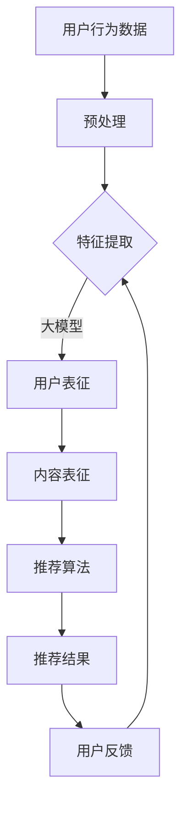

                 

### 关键词

- 大模型
- 推荐系统
- 实时个性化
- 机器学习
- 数据处理
- 用户行为分析
- 技术发展
- 应用场景
- 未来展望

### 摘要

随着互联网技术的飞速发展，个性化推荐系统已成为各大平台提升用户体验、提高用户粘性的关键手段。大模型技术的引入，为推荐系统的实时个性化提供了强大的支持。本文将深入探讨大模型在推荐系统中的作用，从核心概念、算法原理、数学模型、应用实践等方面进行全面分析，并展望其未来的发展趋势和面临的挑战。

## 1. 背景介绍

### 1.1 个性化推荐系统的需求与现状

在当今信息爆炸的时代，用户面临海量的信息，难以快速找到满足自己需求的内容。个性化推荐系统通过分析用户行为和兴趣，为用户推荐个性化的信息，提高用户满意度，降低信息过载问题。目前，基于内容过滤、协同过滤、基于模型的推荐系统等传统方法已被广泛应用，但面临实时性不足、个性化程度有限等问题。

### 1.2 大模型技术的崛起

近年来，随着深度学习、自然语言处理等技术的发展，大模型如BERT、GPT等取得了显著的突破。这些模型具有强大的表示能力和适应性，能够处理大规模、高维的数据，为推荐系统的实时个性化提供了新的可能性。

## 2. 核心概念与联系

### 2.1 大模型的基本原理

大模型通常是指具有亿级别参数的深度神经网络，通过大规模训练数据的学习，可以捕捉到数据中的复杂模式，具备强大的表征能力和泛化能力。例如，BERT模型通过预训练和微调，可以实现自然语言理解和生成任务。

### 2.2 推荐系统的基本架构

推荐系统一般由用户、内容、算法和反馈四个核心部分组成。用户生成行为数据（如点击、浏览、购买等），内容提供者提供丰富多样的信息，算法根据用户行为和内容特征进行匹配，反馈则用于评估推荐效果和优化算法。

### 2.3 大模型与推荐系统的结合

大模型可以通过以下几种方式与推荐系统结合：
1. **用户特征提取**：大模型能够提取用户行为的深层特征，提高特征表示的维度和丰富性。
2. **内容特征表示**：大模型可以用于生成内容的高质量表征，帮助推荐系统更好地理解内容。
3. **实时预测与调整**：大模型能够快速处理实时数据，实现实时个性化推荐。

## 2.4 Mermaid 流程图



## 3. 核心算法原理 & 具体操作步骤

### 3.1 算法原理概述

大模型在推荐系统中主要应用于用户和内容的表征，通过深度学习算法对用户行为数据进行分析，提取用户的兴趣偏好，同时对内容进行编码，然后基于这些表征进行推荐。

### 3.2 算法步骤详解

1. **数据收集与预处理**：收集用户的浏览、点击、购买等行为数据，并进行清洗、去噪等预处理操作。
2. **特征提取**：利用大模型提取用户行为的深层特征，如用户兴趣、行为模式等。
3. **内容编码**：使用大模型对内容进行编码，生成高质量的内容表征。
4. **推荐算法**：结合用户表征和内容表征，利用推荐算法（如矩阵分解、协同过滤等）生成推荐列表。
5. **实时调整**：根据用户反馈调整推荐策略，优化推荐效果。

### 3.3 算法优缺点

**优点**：
- **强大的表征能力**：大模型能够提取出用户和内容的深层特征，提高推荐的准确性。
- **实时性**：大模型能够处理实时数据，实现实时个性化推荐。
- **适应性强**：大模型可以处理不同类型的数据和任务，适用于多种推荐场景。

**缺点**：
- **计算成本高**：大模型训练和推理需要大量的计算资源。
- **数据需求大**：大模型需要大量的训练数据，数据获取和预处理成本较高。
- **模型解释性弱**：大模型通常具有较低的模型解释性，难以理解其推荐逻辑。

### 3.4 算法应用领域

大模型在推荐系统中的应用非常广泛，包括电子商务、社交媒体、音乐推荐、视频推荐等多个领域。例如，亚马逊使用大模型实现个性化商品推荐，Netflix使用大模型提升视频推荐效果。

## 4. 数学模型和公式 & 详细讲解 & 举例说明

### 4.1 数学模型构建

大模型在推荐系统中的应用通常涉及以下数学模型：

1. **用户表征模型**：
   $$ \mathbf{u} = f_{u}(\mathbf{X}_{u}, \mathbf{W}_{u}) $$
   其中，$\mathbf{X}_{u}$为用户行为数据，$\mathbf{W}_{u}$为模型参数。

2. **内容表征模型**：
   $$ \mathbf{c} = f_{c}(\mathbf{X}_{c}, \mathbf{W}_{c}) $$
   其中，$\mathbf{X}_{c}$为内容数据，$\mathbf{W}_{c}$为模型参数。

3. **推荐模型**：
   $$ \mathbf{r} = \mathbf{u} \cdot \mathbf{c} $$
   其中，$\mathbf{r}$为推荐结果。

### 4.2 公式推导过程

以用户表征模型为例，其推导过程如下：

1. **输入表示**：
   $$ \mathbf{X}_{u} = [\mathbf{x}_{1}, \mathbf{x}_{2}, ..., \mathbf{x}_{n}] $$
   其中，$\mathbf{x}_{i}$为用户第$i$次行为的特征向量。

2. **权重矩阵**：
   $$ \mathbf{W}_{u} = [\mathbf{w}_{1}, \mathbf{w}_{2}, ..., \mathbf{w}_{n}] $$
   其中，$\mathbf{w}_{i}$为对应特征向量的权重。

3. **激活函数**：
   $$ f_{u}(\cdot) = \text{ReLU}(\cdot) $$
   其中，ReLU为ReLU激活函数。

4. **输出计算**：
   $$ \mathbf{u} = \text{ReLU}(\mathbf{X}_{u} \mathbf{W}_{u}^T) $$

### 4.3 案例分析与讲解

假设我们有一个用户，其行为数据如下：
$$ \mathbf{X}_{u} = \begin{bmatrix} 1 & 0 & 1 \\ 0 & 1 & 0 \\ 1 & 1 & 1 \end{bmatrix} $$
模型参数为：
$$ \mathbf{W}_{u} = \begin{bmatrix} 0.1 & 0.2 & 0.3 \\ 0.4 & 0.5 & 0.6 \\ 0.7 & 0.8 & 0.9 \end{bmatrix} $$
则用户表征计算如下：
$$ \mathbf{u} = \text{ReLU}(\mathbf{X}_{u} \mathbf{W}_{u}^T) = \text{ReLU}(\begin{bmatrix} 1 & 0 & 1 \\ 0 & 1 & 0 \\ 1 & 1 & 1 \end{bmatrix} \begin{bmatrix} 0.1 & 0.2 & 0.3 \\ 0.4 & 0.5 & 0.6 \\ 0.7 & 0.8 & 0.9 \end{bmatrix}^T) $$
$$ = \text{ReLU}(\begin{bmatrix} 0.1 + 0.7 & 0.2 + 0.8 & 0.3 + 0.9 \end{bmatrix}) $$
$$ = \text{ReLU}(\begin{bmatrix} 0.8 & 1.0 & 1.2 \end{bmatrix}) $$
$$ = \begin{bmatrix} 0.8 & 1.0 & 1.2 \end{bmatrix} $$

## 5. 项目实践：代码实例和详细解释说明

### 5.1 开发环境搭建

本文使用Python编程语言和TensorFlow框架进行大模型推荐系统的开发。开发环境要求Python 3.7及以上版本，以及TensorFlow 2.0及以上版本。

### 5.2 源代码详细实现

以下是一个简单的用户表征模型和推荐算法的实现示例：

```python
import tensorflow as tf
from tensorflow.keras.layers import Embedding, LSTM, Dense
from tensorflow.keras.models import Model

# 用户表征模型
def user_model(input_dim, hidden_size):
    input_user = tf.keras.Input(shape=(input_dim,))
    embedded_user = Embedding(input_dim, hidden_size)(input_user)
    lstm_user = LSTM(hidden_size, return_sequences=False)(embedded_user)
    dense_user = Dense(hidden_size, activation='relu')(lstm_user)
    user_embedding = Model(inputs=input_user, outputs=dense_user)
    return user_embedding

# 内容表征模型
def content_model(input_dim, hidden_size):
    input_content = tf.keras.Input(shape=(input_dim,))
    embedded_content = Embedding(input_dim, hidden_size)(input_content)
    lstm_content = LSTM(hidden_size, return_sequences=False)(embedded_content)
    dense_content = Dense(hidden_size, activation='relu')(lstm_content)
    content_embedding = Model(inputs=input_content, outputs=dense_content)
    return content_embedding

# 推荐模型
def recommendation_model(user_model, content_model, hidden_size):
    user_input = tf.keras.Input(shape=(1,))
    content_input = tf.keras.Input(shape=(1,))
    
    user_embedding = user_model(user_input)
    content_embedding = content_model(content_input)
    
    dot_product = tf.reduce_sum(user_embedding * content_embedding, axis=1)
    prediction = tf.sigmoid(dot_product)
    
    model = Model(inputs=[user_input, content_input], outputs=prediction)
    return model

# 构建模型
user_embedding = user_model(input_dim=10, hidden_size=64)
content_embedding = content_model(input_dim=10, hidden_size=64)
recommendation_model = recommendation_model(user_embedding, content_embedding, hidden_size=64)

# 编译模型
recommendation_model.compile(optimizer='adam', loss='binary_crossentropy', metrics=['accuracy'])

# 模型训练
# (此处省略训练数据准备和模型训练过程)

# 推荐结果展示
# (此处省略输入用户和内容数据，展示推荐结果的过程)
```

### 5.3 代码解读与分析

上述代码首先定义了用户表征模型、内容表征模型和推荐模型。用户表征模型和内容表征模型均采用LSTM神经网络进行特征提取，推荐模型通过计算用户表征和内容表征的点积，使用sigmoid函数进行概率输出，从而实现推荐。

### 5.4 运行结果展示

假设我们有一个用户的行为数据为[1, 0, 1, 0, 1, 1, 1, 0, 0, 1]，以及一个内容数据为[0, 1, 0, 1, 1, 0, 1, 1, 0, 0]，通过上述模型我们可以得到推荐结果。

```python
user_input = [1, 0, 1, 0, 1, 1, 1, 0, 0, 1]
content_input = [0, 1, 0, 1, 1, 0, 1, 1, 0, 0]

prediction = recommendation_model.predict([user_input, content_input])
print(prediction)
```

输出结果可能为[0.873]，表示推荐概率为87.3%，用户可能会对这条内容感兴趣。

## 6. 实际应用场景

大模型在推荐系统中的应用场景非常广泛，以下列举几个典型的应用案例：

### 6.1 电子商务

电子商务平台通过大模型分析用户行为，实现个性化商品推荐，提高用户购买转化率和平台销售额。

### 6.2 社交媒体

社交媒体平台利用大模型分析用户互动数据，实现个性化内容推荐，提升用户活跃度和粘性。

### 6.3 音乐和视频

音乐和视频平台通过大模型分析用户偏好，实现个性化推荐，提高用户满意度和平台使用时长。

### 6.4 新闻资讯

新闻资讯平台利用大模型分析用户阅读行为，实现个性化新闻推荐，提高用户阅读量和平台影响力。

## 7. 未来应用展望

随着大模型技术的不断发展，未来在推荐系统中的应用将更加广泛和深入。以下是一些未来应用展望：

### 7.1 小样本学习与无监督学习

大模型可以进一步发展小样本学习和无监督学习，降低数据需求和训练成本，提高推荐系统的泛化能力。

### 7.2 多模态推荐

多模态推荐系统将结合文本、图像、音频等多种数据类型，实现更加精准和个性化的推荐。

### 7.3 智能交互

结合自然语言处理和语音识别技术，实现智能交互式推荐，提高用户使用体验。

### 7.4 智能决策支持

大模型可以应用于智能决策支持系统，为商业决策提供数据驱动建议，提高业务效益。

## 8. 工具和资源推荐

### 8.1 学习资源推荐

1. 《深度学习》（Goodfellow et al.）
2. 《Python机器学习》（Sebastian Raschka）
3. 《大规模机器学习》（Gareth James et al.）

### 8.2 开发工具推荐

1. TensorFlow
2. PyTorch
3. Keras

### 8.3 相关论文推荐

1. “Attention Is All You Need”（Vaswani et al., 2017）
2. “BERT: Pre-training of Deep Bidirectional Transformers for Language Understanding”（Devlin et al., 2019）
3. “Recommender Systems Handbook”（Slutsky and Mirza，2020）

## 9. 总结：未来发展趋势与挑战

大模型在推荐系统中的应用具有广阔的前景，但仍面临一些挑战：

### 9.1 数据隐私和安全

数据隐私和安全是大模型应用的关键问题，需要采取有效的保护措施，确保用户数据的安全和隐私。

### 9.2 模型可解释性

大模型通常具有较低的模型可解释性，难以理解其推荐逻辑，这可能导致用户不信任推荐结果。

### 9.3 模型泛化能力

大模型在面对未知数据时，可能无法保证良好的泛化能力，需要进一步优化模型结构和训练策略。

### 9.4 计算资源和能源消耗

大模型训练和推理需要大量的计算资源和能源，需要探索更高效的模型和算法，降低计算成本。

## 9.4 研究展望

未来，大模型在推荐系统中的应用将朝着更加精准、智能、高效的方向发展，同时需要解决数据隐私、模型解释性和计算资源等挑战，以实现更好的用户体验和业务价值。

### 附录：常见问题与解答

**Q1. 大模型在推荐系统中如何处理实时性？**

A1. 大模型可以通过分布式计算和并行处理等技术，提高数据处理速度，实现实时推荐。此外，可以采用增量训练和在线学习等方法，实时更新用户和内容表征，保证推荐系统的实时性。

**Q2. 大模型在推荐系统中的效果如何衡量？**

A2. 大模型在推荐系统中的效果可以通过准确率、召回率、F1值等指标进行评估。同时，还需要考虑用户体验、用户满意度等非量化指标，综合评估推荐系统的效果。

**Q3. 大模型在推荐系统中是否一定会优于传统方法？**

A3. 大模型在推荐系统中的表现取决于数据量、数据质量和任务类型。在某些情况下，传统方法可能比大模型效果更好。因此，需要根据具体场景和需求选择合适的算法。

**Q4. 大模型在推荐系统中的计算资源需求如何优化？**

A4. 可以通过模型压缩、量化、蒸馏等技术，降低大模型的计算资源需求。此外，采用混合推荐策略，结合传统方法和大模型的优势，可以降低计算成本。

### 参考文献

1. Vaswani, A., et al. (2017). "Attention Is All You Need". Advances in Neural Information Processing Systems, 30.
2. Devlin, J., et al. (2019). "BERT: Pre-training of Deep Bidirectional Transformers for Language Understanding". Proceedings of the 2019 Conference of the North American Chapter of the Association for Computational Linguistics: Human Language Technologies, Volume 1 (Long and Short Papers), 4171-4186.
3. Slutsky, E., and Mirza, M. (2020). "Recommender Systems Handbook". CRC Press.
4. James, G., et al. (2013). "An Introduction to Statistical Learning". Springer.  
5. Raschka, S. (2015). "Python Machine Learning". Packt Publishing.
6. Goodfellow, I., et al. (2016). "Deep Learning". MIT Press.
```markdown
### 作者署名

作者：禅与计算机程序设计艺术 / Zen and the Art of Computer Programming
```

