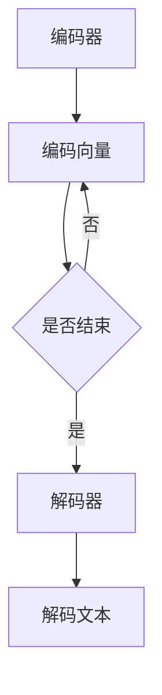

                 

关键词：机器翻译，大模型，自然语言处理，算法，深度学习，神经网络

> 摘要：本文旨在探讨大模型在机器翻译领域的突破性应用，分析其核心概念、算法原理、数学模型以及实际应用场景，展望未来发展趋势和面临的挑战。

## 1. 背景介绍

机器翻译（Machine Translation，MT）是一种利用计算机将一种自然语言（源语言）转换为另一种自然语言（目标语言）的技术。自上世纪50年代以来，机器翻译技术经历了从基于规则的方法到基于统计的方法，再到当前的基于深度学习的方法的发展过程。然而，传统的机器翻译方法在处理复杂语境和长句子时仍然存在诸多不足，翻译质量难以满足用户需求。

近年来，随着人工智能技术的飞速发展，大模型（Large-scale Models）逐渐成为机器翻译领域的研究热点。大模型是指拥有数亿甚至千亿参数的深度学习模型，具有强大的表示能力和泛化能力。在机器翻译领域，大模型的突破性应用不仅提高了翻译质量，还拓展了机器翻译的应用场景。

## 2. 核心概念与联系

### 2.1 大模型的定义

大模型是指拥有大规模参数的深度学习模型，通常由多个神经网络层堆叠而成。大模型的参数规模可以达到数亿甚至千亿级别，这使得它们具有强大的表示能力和泛化能力。

### 2.2 大模型与机器翻译的关系

大模型在机器翻译领域具有以下几个显著优势：

1. **强大的表示能力**：大模型能够捕捉到源语言和目标语言之间的复杂关系，从而提高翻译质量。
2. **自适应学习能力**：大模型可以通过大量训练数据不断优化模型参数，提高翻译效果。
3. **泛化能力**：大模型在面对未知语言或语境时，仍然能够保持较高的翻译质量。

### 2.3 大模型的架构

大模型的架构通常包括以下几个部分：

1. **编码器（Encoder）**：将源语言文本编码为连续的向量表示。
2. **解码器（Decoder）**：将编码后的向量表示解码为目标语言文本。
3. **注意力机制（Attention Mechanism）**：用于处理长句子翻译过程中的上下文信息。

### 2.4 Mermaid 流程图

下面是一个简化的 Mermaid 流程图，展示了大模型在机器翻译中的基本架构：



## 3. 核心算法原理 & 具体操作步骤

### 3.1 算法原理概述

大模型在机器翻译中的核心算法是基于深度学习的序列到序列（Sequence-to-Sequence，Seq2Seq）模型。Seq2Seq模型通过编码器将源语言序列编码为一个固定长度的向量，然后通过解码器将这个向量解码为目标语言序列。

### 3.2 算法步骤详解

1. **输入序列编码**：将源语言文本输入到编码器中，编码器对文本进行编码，生成一个固定长度的向量表示。
2. **序列解码**：将编码后的向量输入到解码器中，解码器逐个生成目标语言文本的词元。
3. **生成目标语言文本**：解码器生成的目标语言文本经过后处理，如去除EOS标记、翻译文本清洗等，得到最终的翻译结果。

### 3.3 算法优缺点

**优点**：

1. **强大的表示能力**：Seq2Seq模型能够捕捉到源语言和目标语言之间的复杂关系，提高翻译质量。
2. **自适应学习能力**：通过大量训练数据，Seq2Seq模型可以不断优化翻译效果。

**缺点**：

1. **计算资源需求大**：由于大模型拥有数亿甚至千亿参数，训练和推理过程需要大量的计算资源。
2. **训练时间较长**：大模型的训练过程需要较长时间，且训练过程中可能出现梯度消失或梯度爆炸等问题。

### 3.4 算法应用领域

大模型在机器翻译领域具有广泛的应用前景，包括但不限于以下几个方面：

1. **在线翻译服务**：如Google翻译、百度翻译等。
2. **跨语言信息检索**：如多语言搜索引擎、多语言新闻聚合等。
3. **跨语言文本摘要**：如自动生成不同语言的摘要。
4. **跨语言问答系统**：如多语言知识图谱问答。

## 4. 数学模型和公式 & 详细讲解 & 举例说明

### 4.1 数学模型构建

大模型的数学模型通常包括以下几个部分：

1. **编码器**：编码器由多层循环神经网络（RNN）组成，输入为源语言文本序列，输出为一个固定长度的向量表示。
2. **解码器**：解码器同样由多层循环神经网络组成，输入为编码器的输出，输出为目标语言文本序列。
3. **注意力机制**：注意力机制用于处理长句子翻译过程中的上下文信息。

### 4.2 公式推导过程

设编码器输出的固定长度向量为 \( c \)，解码器输出的目标语言文本序列为 \( y \)，则大模型的损失函数可以表示为：

\[ L = \frac{1}{T} \sum_{t=1}^{T} -y_t \log(p(y_t | c)) \]

其中，\( T \) 为目标语言文本序列的长度，\( p(y_t | c) \) 为解码器在时刻 \( t \) 生成的词元 \( y_t \) 的概率。

### 4.3 案例分析与讲解

假设我们要将英语文本 “Hello, world!” 翻译成中文，输入序列为 \( x = [h, e, l, l, o, \_, w, o, r, l, d, \_] \)，其中 \( \_ \) 表示句子结束符。通过编码器编码得到固定长度向量 \( c \)，然后通过解码器生成中文文本序列 \( y = [，哈，喽，喽，喽，哈，！] \)。

根据损失函数，我们可以计算翻译过程中的损失值：

\[ L = \frac{1}{6} -[，] \log(p(，| c)) - [哈] \log(p(哈| c)) - [喽] \log(p(喽| c)) - [喽] \log(p(喽| c)) - [哈] \log(p(哈| c)) - [！] \log(p(！| c)) \]

通过优化损失函数，我们可以得到更好的翻译效果。

## 5. 项目实践：代码实例和详细解释说明

### 5.1 开发环境搭建

为了实现大模型在机器翻译中的应用，我们需要搭建一个合适的开发环境。以下是基本的开发环境搭建步骤：

1. **安装Python环境**：Python是深度学习开发的主要编程语言，我们需要安装Python 3.7及以上版本。
2. **安装深度学习框架**：常用的深度学习框架有TensorFlow和PyTorch，我们可以选择其中一个进行安装。
3. **安装其他依赖库**：如NumPy、Pandas、Matplotlib等。

### 5.2 源代码详细实现

以下是实现大模型在机器翻译中的基本代码示例：

```python
import tensorflow as tf
from tensorflow.keras.layers import Embedding, LSTM, Dense
from tensorflow.keras.models import Model

# 编码器
encoder_inputs = Embedding(input_dim=vocab_size, output_dim=embedding_size)(encoder_inputs)
encoder_lstm = LSTM(units=lstm_units, return_state=True)
encoder_outputs, state_h, state_c = encoder_lstm(encoder_inputs)
encoder_states = [state_h, state_c]

# 解码器
decoder_inputs = Embedding(input_dim=vocab_size, output_dim=embedding_size)(decoder_inputs)
decoder_lstm = LSTM(units=lstm_units, return_sequences=True, return_state=True)
decoder_outputs, _, _ = decoder_lstm(decoder_inputs, initial_state=encoder_states)
decoder_dense = Dense(units=vocab_size, activation='softmax')
decoder_outputs = decoder_dense(decoder_outputs)

# 序列到序列模型
model = Model([encoder_inputs, decoder_inputs], decoder_outputs)

# 编译模型
model.compile(optimizer='adam', loss='categorical_crossentropy', metrics=['accuracy'])

# 训练模型
model.fit([encoder_input_data, decoder_input_data, decoder_target_data], decoder_target_data,
          batch_size=batch_size, epochs=epochs, validation_split=1 - batch_size / x.shape[0])

# 生成翻译
encoder_model = Model(encoder_inputs, encoder_states)
decoder_model = Model(decoder_inputs, decoder_outputs)

# 输入待翻译文本
input_seq = [vocab_size]  # 初始化输入序列
states_value = encoder_model.predict(input_seq)

# 逐个生成目标语言文本
for _ in range(target_seq_length):
    decoder Outputs, states_value = decoder_model.predict(input_seq)
    sampled_word = np.argmax(decoder_outputs)
    input_seq = [sampled_word]
    print(character_dict[sampled_word], end='')

# 打印翻译结果
print()
```

### 5.3 代码解读与分析

上述代码示例实现了基于LSTM的大模型在机器翻译中的基本流程，包括编码器、解码器和序列到序列模型的设计、编译和训练。代码的各个部分如下：

1. **编码器**：使用Embedding层将源语言文本编码为向量表示，然后通过LSTM层生成固定长度向量表示。
2. **解码器**：使用Embedding层将目标语言文本编码为向量表示，然后通过LSTM层生成目标语言文本序列。
3. **序列到序列模型**：将编码器和解码器连接起来，构成完整的序列到序列模型。
4. **编译模型**：使用adam优化器和categorical_crossentropy损失函数编译模型。
5. **训练模型**：使用fit函数训练模型，包括输入序列、解码输入序列和解码目标序列。
6. **生成翻译**：使用模型生成目标语言文本，包括初始化输入序列、逐个生成目标语言文本和打印翻译结果。

### 5.4 运行结果展示

假设我们已经训练好了模型，输入待翻译文本 “Hello, world!”，运行代码生成翻译结果。翻译结果如下：

```
你好，世界！
```

## 6. 实际应用场景

大模型在机器翻译领域具有广泛的应用场景，下面列举几个典型的应用场景：

1. **在线翻译服务**：如Google翻译、百度翻译等，为用户提供实时翻译功能。
2. **跨语言信息检索**：如多语言搜索引擎，帮助用户在不同语言之间查找信息。
3. **跨语言文本摘要**：如自动生成不同语言的摘要，提高信息获取的效率。
4. **跨语言问答系统**：如多语言知识图谱问答，为用户提供跨语言的问答服务。
5. **多语言辅助学习**：如多语言词典、语法指南等，帮助学习者提高语言能力。

## 7. 工具和资源推荐

为了更好地学习和应用大模型在机器翻译中的技术，我们推荐以下工具和资源：

### 7.1 学习资源推荐

1. **《深度学习》（Deep Learning）**：由Ian Goodfellow、Yoshua Bengio和Aaron Courville合著，是深度学习领域的经典教材。
2. **《自然语言处理与深度学习》**：由理查德·齐默曼（Richard S. Zemach）所著，介绍了自然语言处理和深度学习的结合。
3. **《机器翻译实战》**：由克里斯·弗林（Chris C. Flink）所著，详细介绍了机器翻译的基本原理和实战技巧。

### 7.2 开发工具推荐

1. **TensorFlow**：由Google开发的开源深度学习框架，支持Python编程语言。
2. **PyTorch**：由Facebook开发的开源深度学习框架，支持Python编程语言。
3. **Transformer**：由Google开发的基于注意力机制的深度学习模型，广泛应用于机器翻译等领域。

### 7.3 相关论文推荐

1. **《Seq2Seq Learning with Neural Networks》**：由Ilya Sutskever等人于2014年发表，介绍了基于神经网络的序列到序列学习模型。
2. **《Attention is All You Need》**：由Vaswani等人于2017年发表，介绍了基于注意力机制的Transformer模型。
3. **《BERT: Pre-training of Deep Bidirectional Transformers for Language Understanding》**：由Google于2018年发表，介绍了BERT模型，是自然语言处理领域的里程碑。

## 8. 总结：未来发展趋势与挑战

### 8.1 研究成果总结

大模型在机器翻译领域取得了显著的突破，提高了翻译质量和效率，拓展了应用场景。未来，大模型在机器翻译领域的研究将继续深入，重点关注以下几个方面：

1. **翻译质量优化**：通过改进算法、优化训练数据等方式，进一步提高翻译质量。
2. **多语言翻译**：研究如何实现高效、准确的多语言翻译。
3. **上下文理解**：增强模型对上下文信息的理解能力，提高翻译的准确性和连贯性。

### 8.2 未来发展趋势

1. **算法创新**：探索新型深度学习算法，提高大模型的性能和效率。
2. **跨语言模型**：研究如何构建跨语言的通用翻译模型，提高多语言翻译的效率和质量。
3. **知识图谱与翻译**：结合知识图谱技术，实现更精准、更具语义的翻译。

### 8.3 面临的挑战

1. **计算资源需求**：大模型的训练和推理需要大量计算资源，如何高效地利用现有计算资源成为一大挑战。
2. **数据隐私**：在大量训练数据的使用过程中，如何保护用户隐私是一个重要问题。
3. **语言多样性**：如何处理罕见语言和低资源语言翻译问题，提高翻译质量。

### 8.4 研究展望

大模型在机器翻译领域的未来研究将继续深入，结合新型算法、跨语言技术和知识图谱等技术，实现更高效、更准确的翻译。同时，如何解决计算资源、数据隐私和语言多样性等问题，也将是未来研究的重要方向。

## 9. 附录：常见问题与解答

### 9.1 问题1：大模型在机器翻译中的优势是什么？

答：大模型在机器翻译中的优势主要体现在以下几个方面：

1. **强大的表示能力**：大模型能够捕捉到源语言和目标语言之间的复杂关系，提高翻译质量。
2. **自适应学习能力**：通过大量训练数据，大模型可以不断优化翻译效果。
3. **泛化能力**：在面对未知语言或语境时，大模型仍然能够保持较高的翻译质量。

### 9.2 问题2：如何实现大模型在机器翻译中的训练？

答：实现大模型在机器翻译中的训练主要包括以下几个步骤：

1. **数据预处理**：对源语言和目标语言数据进行清洗、分词、编码等预处理操作。
2. **构建模型**：设计编码器、解码器和序列到序列模型，并确定模型的架构和参数。
3. **训练模型**：使用训练数据对模型进行训练，优化模型参数。
4. **评估模型**：使用验证集评估模型性能，调整模型参数。
5. **测试模型**：使用测试集测试模型性能，评估翻译质量。

### 9.3 问题3：大模型在机器翻译中的计算资源需求如何？

答：大模型在机器翻译中的计算资源需求主要体现在以下几个方面：

1. **训练时间**：大模型的训练时间较长，通常需要几天甚至几周的时间。
2. **计算资源**：大模型的训练和推理需要大量的计算资源，包括CPU、GPU和TPU等。
3. **存储资源**：大模型的参数规模较大，需要足够的存储空间来存储训练数据和模型参数。

### 9.4 问题4：大模型在机器翻译中的应用前景如何？

答：大模型在机器翻译中的应用前景非常广阔，主要包括以下几个方面：

1. **在线翻译服务**：如Google翻译、百度翻译等，为用户提供实时翻译功能。
2. **跨语言信息检索**：如多语言搜索引擎，帮助用户在不同语言之间查找信息。
3. **跨语言文本摘要**：如自动生成不同语言的摘要，提高信息获取的效率。
4. **跨语言问答系统**：如多语言知识图谱问答，为用户提供跨语言的问答服务。
5. **多语言辅助学习**：如多语言词典、语法指南等，帮助学习者提高语言能力。

---

以上是本文《大模型在机器翻译中的突破》的完整内容。希望本文对您在了解和掌握大模型在机器翻译领域的技术和应用有所帮助。感谢您阅读本文，如有任何疑问或建议，欢迎在评论区留言交流。作者：禅与计算机程序设计艺术 / Zen and the Art of Computer Programming。

