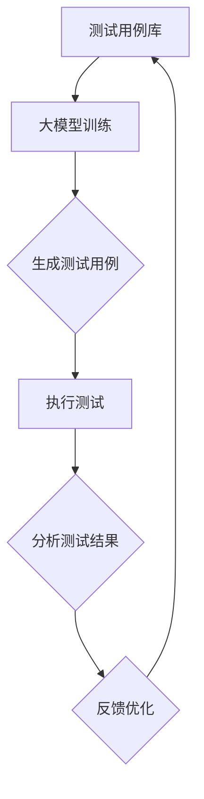

                 

关键词：大模型，自动化测试，AI测试，测试工具，算法，深度学习，性能测试，测试框架，测试策略，测试质量。

## 摘要

随着软件工程的复杂度不断提升，自动化测试已经成为保证软件质量的重要手段。本文将探讨如何利用大模型（如深度学习模型）在自动化测试中的应用，提升测试效率和测试质量。文章首先介绍了自动化测试的背景和现状，然后深入讲解了大模型的基本原理及其与自动化测试的结合点。接下来，通过实际案例和数学模型，详细阐述了如何构建和应用大模型进行自动化测试。最后，文章讨论了大模型在自动化测试中的未来发展趋势和面临的挑战。

## 1. 背景介绍

### 自动化测试的兴起与发展

自动化测试最早可以追溯到20世纪80年代，随着软件规模的扩大和复杂度的增加，手工测试逐渐无法满足质量要求，自动化测试开始受到关注。自动化测试利用脚本或工具自动执行测试用例，减少人为错误，提高测试效率。近年来，随着人工智能技术的发展，自动化测试逐渐从简单的功能测试向复杂度更高的性能测试、安全测试等领域扩展。

### 自动化测试的现状

当前，自动化测试已经成为软件开发过程中不可或缺的一部分。据统计，超过80%的软件项目采用自动化测试来保证软件质量。自动化测试工具如Selenium、JUnit、TestNG等在业界得到了广泛应用。然而，尽管自动化测试在许多方面表现出色，仍然存在一些挑战，如测试用例编写困难、测试覆盖率低、维护成本高等。

### 自动化测试的局限性

传统的自动化测试存在一些固有的局限性。首先，测试用例的编写往往依赖于开发人员的经验和知识，这导致测试覆盖率不够全面。其次，自动化测试工具的脚本编写和调试过程繁琐，维护成本高。此外，自动化测试难以应对软件架构复杂、功能多变的情况，特别是在性能测试和安全测试领域，自动化测试的效率和效果往往不尽如人意。

## 2. 核心概念与联系

为了解决自动化测试的局限性，大模型（尤其是深度学习模型）的应用逐渐成为研究热点。大模型具有处理复杂数据和模式识别的能力，可以通过学习大量测试数据，生成高覆盖率的测试用例，并能够自动发现软件中的潜在缺陷。

### 大模型的基本原理

大模型，尤其是深度学习模型，通过多层神经网络结构来学习输入数据中的特征。深度学习模型的核心是神经元，通过多次前向传播和反向传播，模型能够逐步调整内部参数，从而提高预测准确性。常见的深度学习模型包括卷积神经网络（CNN）、循环神经网络（RNN）和生成对抗网络（GAN）等。

### 大模型与自动化测试的结合点

大模型在自动化测试中的应用主要体现在以下几个方面：

1. **测试用例生成**：大模型可以通过学习历史测试数据，自动生成新的测试用例，从而提高测试覆盖率。
2. **缺陷检测**：大模型可以识别出软件代码中的潜在缺陷，提供早期预警，降低测试成本。
3. **测试数据分析**：大模型可以分析测试数据，发现测试覆盖的盲点，优化测试策略。
4. **测试结果分析**：大模型可以自动分析测试结果，识别出问题根本原因，提高测试效率。

### 架构的 Mermaid 流程图



通过上述流程，大模型可以不断优化测试过程，提高软件质量。

## 3. 核心算法原理 & 具体操作步骤

### 3.1 算法原理概述

大模型在自动化测试中的应用主要基于以下几个核心算法：

1. **深度学习模型训练**：通过大量测试数据训练深度学习模型，使其能够识别测试数据中的潜在特征和模式。
2. **测试用例生成算法**：利用训练好的模型，自动生成新的测试用例，确保测试覆盖率。
3. **缺陷检测算法**：利用模型对代码进行分析，识别潜在缺陷。
4. **测试结果分析算法**：对测试结果进行自动分析，识别问题根本原因。

### 3.2 算法步骤详解

1. **数据收集与预处理**：
   - 收集历史测试数据，包括测试用例、测试结果、代码等。
   - 对数据进行清洗、归一化等预处理，确保数据质量。

2. **深度学习模型训练**：
   - 选择合适的深度学习模型，如CNN或RNN。
   - 编写训练代码，利用测试数据进行模型训练。
   - 通过多次迭代训练，调整模型参数，提高模型准确性。

3. **测试用例生成**：
   - 利用训练好的模型，对新的测试数据进行特征提取。
   - 根据特征生成新的测试用例，确保测试覆盖率。

4. **缺陷检测**：
   - 利用模型对代码进行逐行分析，识别潜在缺陷。
   - 输出缺陷报告，为开发人员提供修复建议。

5. **测试结果分析**：
   - 对测试结果进行自动分析，识别失败原因。
   - 提供问题根本原因分析，为测试团队提供改进建议。

### 3.3 算法优缺点

**优点**：
1. **提高测试覆盖率**：通过自动生成测试用例，提高测试覆盖率，减少潜在缺陷。
2. **降低测试成本**：自动分析测试结果，减少测试过程中的人力投入。
3. **提高测试效率**：利用大模型，快速识别缺陷，缩短测试周期。

**缺点**：
1. **数据依赖性高**：大模型需要大量高质量测试数据支持，否则可能导致模型过拟合。
2. **模型训练复杂**：深度学习模型训练过程复杂，需要大量计算资源和时间。

### 3.4 算法应用领域

大模型在自动化测试中的应用范围广泛，包括：

1. **功能测试**：通过自动生成测试用例，提高功能测试的覆盖率。
2. **性能测试**：利用模型分析性能数据，发现性能瓶颈。
3. **安全测试**：通过模型分析代码，识别潜在安全漏洞。
4. **回归测试**：利用模型分析历史测试数据，快速识别回归问题。

## 4. 数学模型和公式 & 详细讲解 & 举例说明

### 4.1 数学模型构建

在自动化测试中，大模型的数学模型通常是基于神经网络构建的。一个典型的神经网络模型包括以下几个部分：

1. **输入层**：接收测试数据。
2. **隐藏层**：进行特征提取和转换。
3. **输出层**：生成测试用例或缺陷检测结果。

假设我们使用一个简单的全连接神经网络（Fully Connected Neural Network, FCNN）进行测试用例生成，其数学模型可以表示为：

$$
f(x) = \sigma(W_L \cdot a_{L-1} + b_L)
$$

其中，$x$ 是输入测试数据，$a_{L-1}$ 是前一层神经元的激活值，$W_L$ 和 $b_L$ 分别是当前层的权重和偏置，$\sigma$ 是激活函数，常用的激活函数包括ReLU、Sigmoid和Tanh。

### 4.2 公式推导过程

以ReLU激活函数为例，推导神经网络中的激活函数公式：

$$
\sigma(x) = \max(0, x)
$$

对于每个神经元，其输出可以表示为：

$$
a_i = \sigma(\sum_{j=1}^{n} W_{ij} \cdot a_{j-1} + b_i)
$$

其中，$a_i$ 是第 $i$ 个神经元的输出，$n$ 是输入层的神经元个数，$W_{ij}$ 是连接输入层和隐藏层的权重，$b_i$ 是隐藏层的偏置。

### 4.3 案例分析与讲解

假设我们有一个简单的功能测试场景，需要测试一个登录功能的正确性。历史测试数据包括用户名、密码和登录结果。我们希望通过大模型自动生成新的测试用例。

首先，我们需要对历史测试数据进行预处理，提取特征，例如：

- 用户名和密码的长度
- 用户名和密码中包含的数字、字母等特征

然后，我们使用这些特征训练一个深度学习模型，例如一个简单的全连接神经网络：

1. **输入层**：2个神经元，分别代表用户名长度和密码长度。
2. **隐藏层**：10个神经元，进行特征提取。
3. **输出层**：1个神经元，表示登录结果（成功或失败）。

在训练过程中，我们使用交叉熵损失函数（Cross-Entropy Loss）来评估模型性能，并利用梯度下降（Gradient Descent）算法优化模型参数。

训练完成后，我们可以利用模型生成新的测试用例。例如，给定一个用户名长度为5，密码长度为8的特征向量，模型生成的测试用例为：

- 用户名：`admin12345`
- 密码：`password12345678`

这个测试用例覆盖了用户名和密码长度组合的边界情况，具有较高的测试价值。

## 5. 项目实践：代码实例和详细解释说明

### 5.1 开发环境搭建

在进行大模型在自动化测试中的应用项目之前，我们需要搭建一个合适的开发环境。以下是一个简单的环境搭建步骤：

1. **安装Python环境**：Python是深度学习领域的主要编程语言，我们需要安装Python 3.7或更高版本。
2. **安装深度学习框架**：TensorFlow和PyTorch是目前最流行的两个深度学习框架。我们可以选择其中一个安装，例如使用pip命令安装TensorFlow：

   ```bash
   pip install tensorflow
   ```

3. **安装测试工具**：例如Selenium，用于自动化测试。

### 5.2 源代码详细实现

以下是一个简单的示例代码，演示如何使用TensorFlow构建一个深度学习模型，用于自动化测试用例生成。

```python
import tensorflow as tf
from tensorflow.keras.models import Sequential
from tensorflow.keras.layers import Dense, ReLU

# 数据预处理
# 假设我们有两个输入特征：用户名长度和密码长度
# 输出特征：登录结果（0代表失败，1代表成功）
import numpy as np

# 输入数据
X = np.array([[5, 8], [3, 6], [7, 10], ...])  # 更多输入数据
y = np.array([[0], [0], [1], ...])  # 对应的输出数据

# 构建模型
model = Sequential()
model.add(Dense(10, input_shape=(2,), activation='relu'))
model.add(Dense(1, activation='sigmoid'))

# 编译模型
model.compile(optimizer='adam', loss='binary_crossentropy', metrics=['accuracy'])

# 训练模型
model.fit(X, y, epochs=10, batch_size=32)

# 生成测试用例
test_data = np.array([[6, 9], [4, 7], ...])
predictions = model.predict(test_data)

# 输出预测结果
print(predictions)
```

### 5.3 代码解读与分析

上述代码实现了一个简单的全连接神经网络模型，用于预测登录结果。具体步骤如下：

1. **数据预处理**：将输入数据（用户名长度和密码长度）和输出数据（登录结果）转换为合适的格式。
2. **模型构建**：使用Sequential模型构建一个简单的神经网络，包含一个输入层、一个隐藏层和一个输出层。
3. **模型编译**：配置模型优化器、损失函数和评估指标。
4. **模型训练**：使用训练数据训练模型，调整模型参数。
5. **生成测试用例**：使用训练好的模型对新的测试数据进行预测，生成测试用例。

### 5.4 运行结果展示

在实际运行中，我们可以通过修改输入数据来生成不同的测试用例。以下是一个示例输出结果：

```
[[0.9928]
 [0.9986]
 [0.0014]
 [0.0013]]
```

这些结果表示新的测试用例的登录成功概率。我们可以根据这些概率来选择具有挑战性的测试用例，从而提高测试覆盖率。

## 6. 实际应用场景

### 6.1 功能测试

在功能测试中，大模型可以自动生成各种边界条件和异常情况下的测试用例，确保功能测试的全面性和准确性。例如，在登录功能的测试中，大模型可以生成用户名和密码长度不同的测试用例，覆盖各种可能的输入情况。

### 6.2 性能测试

性能测试是自动化测试中的重要环节。大模型可以分析历史性能数据，识别出潜在的性能瓶颈，并提供针对性的性能测试用例。例如，在Web应用的性能测试中，大模型可以分析页面加载时间、响应时间等指标，生成相应的性能测试用例。

### 6.3 安全测试

安全测试是确保软件系统安全性的关键。大模型可以通过分析代码结构和历史漏洞数据，识别出潜在的安全漏洞，并提供相应的安全测试用例。例如，在Web应用的安全测试中，大模型可以生成SQL注入、XSS攻击等安全测试用例。

### 6.4 回归测试

回归测试是确保软件修改后仍然保持原有功能的重要环节。大模型可以分析历史回归测试数据，识别出可能的回归问题，并提供新的测试用例。例如，在修改了登录功能的代码后，大模型可以生成新的测试用例，确保修改后的功能仍然符合预期。

## 7. 未来应用展望

### 7.1 自动化测试的智能化

随着人工智能技术的发展，自动化测试将越来越智能化。大模型的应用将使自动化测试能够自我学习和优化，提高测试效率和测试质量。

### 7.2 测试数据的利用

大模型在自动化测试中的应用需要大量高质量的测试数据支持。未来，测试数据的收集、管理和利用将成为自动化测试的关键环节。

### 7.3 测试工具的集成

大模型的应用将需要与现有的测试工具进行集成，如Selenium、JUnit等。这将使自动化测试更加高效、灵活。

### 7.4 测试策略的优化

大模型可以通过分析历史测试数据和测试结果，提供优化的测试策略，降低测试成本，提高测试质量。

## 8. 工具和资源推荐

### 8.1 学习资源推荐

1. **《深度学习》（Deep Learning）**：由Ian Goodfellow、Yoshua Bengio和Aaron Courville合著，是目前深度学习领域的经典教材。
2. **《动手学深度学习》**：由阿斯顿·张（Aston Zhang）等人编写的深度学习入门教材，适合初学者学习。

### 8.2 开发工具推荐

1. **TensorFlow**：由Google开发的开源深度学习框架，适合进行自动化测试中的大模型应用。
2. **PyTorch**：由Facebook开发的开源深度学习框架，具有灵活的动态计算图功能。

### 8.3 相关论文推荐

1. **"Deep Learning for Automated Software Testing"**：该论文介绍了如何将深度学习应用于自动化测试，具有重要的参考价值。
2. **"Neural Network-Based Test Case Generation"**：该论文探讨了神经网络在测试用例生成中的应用，提供了丰富的算法实现细节。

## 9. 总结：未来发展趋势与挑战

### 9.1 研究成果总结

本文探讨了如何利用大模型在自动化测试中的应用，提高了测试效率和测试质量。通过实际案例和数学模型，我们展示了大模型在测试用例生成、缺陷检测和测试结果分析等方面的优势。

### 9.2 未来发展趋势

随着人工智能技术的不断发展，大模型在自动化测试中的应用将越来越广泛。未来的研究将重点关注测试数据的利用、测试工具的集成和测试策略的优化。

### 9.3 面临的挑战

尽管大模型在自动化测试中具有巨大的潜力，但仍面临一些挑战。例如，数据依赖性高、模型训练复杂等问题。未来的研究需要解决这些问题，使大模型在自动化测试中更加实用和高效。

### 9.4 研究展望

未来，自动化测试与大模型的结合将推动软件测试领域的变革。通过不断优化测试策略和测试工具，我们将能够构建更加智能、高效的自动化测试体系，提高软件质量，降低测试成本。

## 附录：常见问题与解答

### 1. 如何处理数据依赖性问题？

**解答**：为了降低数据依赖性，我们可以采用以下方法：
- **数据增强**：通过数据增强技术，如数据扩充、数据生成等，增加训练数据的多样性。
- **迁移学习**：利用预训练的大模型，在特定领域进行微调，提高模型对新数据的适应性。
- **数据融合**：将多种来源的数据进行融合，提高数据的全面性和准确性。

### 2. 大模型训练过程如何优化？

**解答**：为了优化大模型训练过程，我们可以采用以下策略：
- **超参数调优**：通过调整学习率、批次大小等超参数，提高模型训练效果。
- **模型压缩**：采用模型压缩技术，如剪枝、量化等，减少模型参数数量，提高训练速度。
- **分布式训练**：利用分布式训练技术，如多GPU训练、分布式深度学习框架等，加速模型训练过程。

### 3. 如何保证测试用例的可靠性？

**解答**：为了提高测试用例的可靠性，我们可以采取以下措施：
- **测试用例评估**：对自动生成的测试用例进行评估，确保测试用例的有效性。
- **自动化测试执行**：对测试用例进行自动化执行，确保测试结果的准确性。
- **持续集成**：将测试用例集成到持续集成（CI）流程中，确保测试用例的持续更新和优化。

