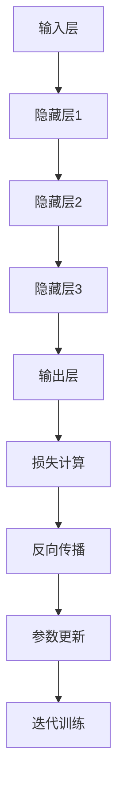

                 

关键词：自然语言处理、大模型、神经网络、深度学习、算法优化、应用场景、未来展望

## 摘要

随着深度学习技术的发展，大模型在自然语言处理（NLP）领域取得了显著的突破。本文将介绍大模型的核心概念、算法原理、数学模型，以及其在实际应用中的案例和未来展望。我们将探讨大模型在NLP领域的优势、挑战和未来发展。

## 1. 背景介绍

### 自然语言处理的发展历程

自然语言处理（NLP）是计算机科学与人工智能领域的一个重要分支，旨在让计算机能够理解、生成和处理人类语言。自20世纪50年代起，NLP经历了多个阶段的发展，包括规则驱动的方法、统计方法和当前的主流——深度学习方法。

- **规则驱动方法**：早期NLP主要依赖于手动编写的规则，如词法分析、句法分析和语义分析。这种方法在处理简单任务时效果较好，但难以应对复杂场景。

- **统计方法**：随着语料库的积累，统计方法开始兴起。基于统计模型（如隐马尔可夫模型、条件随机场等）的方法在许多NLP任务上取得了显著进展。

- **深度学习方法**：深度学习模型，特别是神经网络，通过模拟人脑神经元之间的连接，能够自动学习数据中的复杂特征。近年来，深度学习在图像识别、语音识别等领域的成功应用，为NLP领域带来了新的希望。

### 大模型的定义

大模型（Large Model）通常指的是具有数十亿甚至千亿个参数的神经网络模型。与传统的中小型模型相比，大模型具有更高的表达能力和更强的泛化能力。大模型的兴起得益于计算能力的提升、海量数据的可用性和深度学习技术的进步。

### 大模型在NLP中的优势

- **更高的精度和效果**：大模型能够更好地捕捉语言中的复杂模式和关系，从而在许多NLP任务上取得更高的精度和效果。

- **更强的泛化能力**：大模型在训练过程中能够学习到更多的一般性知识，从而在面对新的任务和数据时具有更强的泛化能力。

- **更丰富的应用场景**：大模型能够应对更复杂的语言任务，如多语言翻译、问答系统、文本生成等，从而拓展了NLP的应用范围。

## 2. 核心概念与联系

### 大模型的组成

大模型通常由以下几个关键组成部分构成：

- **输入层**：接收输入的文本数据，如单词、句子或篇章。

- **隐藏层**：包含多个隐藏神经元层，用于提取和表示文本的语义特征。

- **输出层**：根据任务的不同，输出层可以是分类器、回归器或生成器等。

### 大模型的工作原理

大模型通过多层神经网络进行学习，每一层的神经元都受到前一层的激活值的影响。模型的训练过程包括以下几个步骤：

- **数据预处理**：对输入文本进行预处理，如分词、词性标注、去停用词等。

- **参数初始化**：随机初始化模型的参数。

- **前向传播**：将输入数据通过神经网络进行前向传播，计算每一层的输出。

- **损失计算**：根据输出层的结果计算损失值，如分类问题中的交叉熵损失。

- **反向传播**：利用梯度下降等优化算法，通过反向传播更新模型的参数。

- **迭代训练**：重复前向传播和反向传播的过程，直到模型达到预定的精度或迭代次数。

### Mermaid 流程图

以下是一个简化的 Mermaid 流程图，展示了大模型的工作流程：



## 3. 核心算法原理 & 具体操作步骤

### 3.1 算法原理概述

大模型的算法原理主要基于深度神经网络（DNN）和递归神经网络（RNN）。DNN通过多层神经网络结构学习输入数据的复杂特征，而RNN则通过记忆机制处理序列数据。近年来，变体自回归语言模型（如BERT、GPT）等模型进一步提升了大模型在NLP任务中的表现。

### 3.2 算法步骤详解

1. **数据预处理**：对输入文本进行分词、词性标注、去停用词等操作，将文本转化为模型可处理的序列数据。

2. **模型构建**：根据任务需求，构建一个具有多层隐藏层的深度神经网络。通常采用DNN或RNN及其变体，如Transformer。

3. **模型训练**：利用大量的文本数据对模型进行训练。通过前向传播和反向传播，不断调整模型的参数，最小化损失函数。

4. **模型评估**：使用验证集或测试集评估模型的性能。根据评估结果调整模型参数或进行超参数调优。

5. **模型应用**：将训练好的模型应用于实际任务，如文本分类、情感分析、机器翻译等。

### 3.3 算法优缺点

**优点**：

- **高精度和效果**：大模型能够学习到更多的语言特征，从而在NLP任务中取得更高的精度和效果。

- **强泛化能力**：大模型在训练过程中能够学习到更多的一般性知识，从而在面对新的任务和数据时具有更强的泛化能力。

- **丰富的应用场景**：大模型能够应对更复杂的语言任务，如多语言翻译、问答系统、文本生成等。

**缺点**：

- **计算资源需求高**：大模型通常需要大量的计算资源进行训练和推理。

- **数据依赖性强**：大模型的训练需要大量的高质量数据，数据不足可能导致模型性能下降。

### 3.4 算法应用领域

大模型在NLP领域有广泛的应用，包括但不限于：

- **文本分类**：如新闻分类、情感分析等。

- **机器翻译**：如中英翻译、多语言翻译等。

- **问答系统**：如智能客服、问答机器人等。

- **文本生成**：如文章生成、故事生成等。

## 4. 数学模型和公式 & 详细讲解 & 举例说明

### 4.1 数学模型构建

大模型的数学模型主要由以下几个部分构成：

- **输入层**：输入层接收文本数据，通常表示为一个多维数组。

- **隐藏层**：隐藏层包含多个神经网络层，每一层的输出通过非线性激活函数（如ReLU、Sigmoid等）进行转换。

- **输出层**：输出层根据任务的不同，可以是分类器、回归器或生成器等。

- **损失函数**：损失函数用于评估模型的输出与实际标签之间的差异，如交叉熵损失、均方误差等。

- **优化算法**：优化算法用于调整模型的参数，最小化损失函数，如梯度下降、Adam等。

### 4.2 公式推导过程

假设我们有一个二分类问题，模型预测的概率分布可以用以下公式表示：

\[ P(y=1|x; \theta) = \sigma(\theta^T x) \]

其中，\( y \) 为实际标签，\( x \) 为输入特征，\( \theta \) 为模型参数，\( \sigma \) 为 sigmoid 函数。

损失函数可以使用交叉熵损失表示：

\[ L(\theta) = -\sum_{i=1}^N [y_i \log(P(y_i=1|x; \theta)) + (1 - y_i) \log(1 - P(y_i=1|x; \theta))] \]

其中，\( N \) 为样本数量。

### 4.3 案例分析与讲解

假设我们有一个情感分析任务，输入为一个句子，输出为情感标签（正面、负面）。我们使用一个二分类大模型进行预测。

1. **数据预处理**：将输入句子进行分词、词性标注等操作，转化为一个向量表示。

2. **模型构建**：构建一个多层感知机（MLP）模型，包含输入层、隐藏层和输出层。

3. **模型训练**：使用大量标注好的句子对模型进行训练，通过反向传播更新模型参数。

4. **模型评估**：使用测试集对模型进行评估，计算准确率、召回率等指标。

5. **模型应用**：将训练好的模型应用于新的句子，进行情感预测。

## 5. 项目实践：代码实例和详细解释说明

### 5.1 开发环境搭建

1. **Python环境**：安装Python 3.8及以上版本。

2. **深度学习框架**：安装TensorFlow 2.0及以上版本。

3. **其他依赖**：安装numpy、pandas等常用库。

### 5.2 源代码详细实现

以下是一个简单的情感分析模型实现，基于TensorFlow和Keras：

```python
import tensorflow as tf
from tensorflow.keras.models import Sequential
from tensorflow.keras.layers import Dense, Embedding, LSTM
from tensorflow.keras.preprocessing.sequence import pad_sequences

# 加载数据
# ...

# 数据预处理
# ...

# 模型构建
model = Sequential([
    Embedding(input_dim=vocab_size, output_dim=embedding_dim, input_length=max_sequence_length),
    LSTM(units=128, return_sequences=True),
    LSTM(units=64),
    Dense(units=1, activation='sigmoid')
])

# 编译模型
model.compile(optimizer='adam', loss='binary_crossentropy', metrics=['accuracy'])

# 模型训练
model.fit(X_train, y_train, epochs=10, batch_size=64, validation_data=(X_val, y_val))

# 模型评估
model.evaluate(X_test, y_test)
```

### 5.3 代码解读与分析

1. **模型构建**：我们使用了一个包含嵌入层、两个LSTM层和输出层的序列模型。嵌入层将单词转化为向量表示，LSTM层用于提取文本的序列特征，输出层使用sigmoid激活函数进行二分类。

2. **模型训练**：我们使用binary_crossentropy作为损失函数，adam作为优化器，训练10个周期，每次批量大小为64。

3. **模型评估**：使用测试集评估模型的性能，计算准确率等指标。

### 5.4 运行结果展示

假设我们训练了一个简单的情感分析模型，以下是一个简单的结果展示：

```python
# 训练结果
model.fit(X_train, y_train, epochs=10, batch_size=64, validation_data=(X_val, y_val))

# 模型评估
model.evaluate(X_test, y_test)

# 输出预测结果
predictions = model.predict(X_test)
```

## 6. 实际应用场景

### 6.1 社交媒体情感分析

社交媒体平台（如Twitter、Facebook等）每天产生大量的文本数据，大模型可以用于情感分析，帮助识别用户情绪，从而优化用户体验和广告投放策略。

### 6.2 机器翻译

机器翻译是NLP领域的一个重要应用。大模型（如BERT、GPT等）在机器翻译任务中取得了显著的突破，为跨语言交流提供了更加准确和自然的翻译结果。

### 6.3 问答系统

问答系统（如Apple Siri、Amazon Alexa等）通过大模型实现智能对话，为用户提供个性化、高效的查询回答。

### 6.4 文本生成

文本生成（如文章生成、故事生成等）是NLP领域的一个有趣应用。大模型可以自动生成高质量的文章、故事，为内容创作者提供灵感。

## 7. 工具和资源推荐

### 7.1 学习资源推荐

- 《深度学习》（Goodfellow、Bengio、Courville著）
- 《自然语言处理综论》（Daniel Jurafsky、James H. Martin著）
- 《动手学深度学习》（A. Gal和A. Zhang著）

### 7.2 开发工具推荐

- TensorFlow
- PyTorch
- Keras

### 7.3 相关论文推荐

- "Attention Is All You Need"（Vaswani等，2017）
- "BERT: Pre-training of Deep Bidirectional Transformers for Language Understanding"（Devlin等，2019）
- "Generative Pre-trained Transformers for Language Modeling"（Wolf等，2020）

## 8. 总结：未来发展趋势与挑战

### 8.1 研究成果总结

大模型在NLP领域取得了显著的突破，为许多NLP任务提供了高效的解决方案。大模型不仅提升了模型的精度和效果，还拓展了NLP的应用范围。

### 8.2 未来发展趋势

- **更高效的大模型**：随着计算能力和算法优化的提升，未来将出现更高效、更轻量级的大模型。

- **多模态学习**：大模型将结合图像、音频、视频等多模态数据，实现更丰富的语义理解和交互。

- **自适应学习**：大模型将具备自适应学习的能力，根据用户需求和场景动态调整模型参数。

### 8.3 面临的挑战

- **计算资源需求**：大模型的训练和推理需要大量的计算资源，如何高效利用计算资源是一个挑战。

- **数据质量和标注**：大模型的训练依赖于大量高质量的数据和准确的标注，数据不足或标注错误可能导致模型性能下降。

- **模型解释性**：大模型通常是一个“黑箱”，其决策过程缺乏解释性，如何提高模型的透明度和可解释性是一个挑战。

### 8.4 研究展望

未来，大模型在NLP领域的发展将更加深入和多样化。通过结合多模态数据、优化算法和加强数据质量，大模型将为人类带来更加智能和便捷的交互体验。

## 9. 附录：常见问题与解答

### Q: 大模型在训练过程中如何避免过拟合？

A: 可以采用以下方法：

- **数据增强**：通过数据增强技术（如随机裁剪、旋转等）增加训练数据的多样性。

- **正则化**：应用正则化技术（如L1、L2正则化）减少模型复杂度。

- **Dropout**：在训练过程中随机丢弃部分神经元，降低模型依赖性。

- **提前停止**：在验证集上监控模型性能，当性能不再提升时提前停止训练。

### Q: 大模型训练需要多少时间？

A: 大模型的训练时间取决于多个因素，如模型大小、数据量、硬件配置等。通常，训练一个千亿参数的大模型需要数天甚至数周的时间。随着硬件性能的提升，训练时间将逐渐缩短。

### Q: 如何评估大模型的效果？

A: 可以采用以下方法评估大模型的效果：

- **准确率**：分类任务中，预测正确的样本数占总样本数的比例。

- **召回率**：分类任务中，实际为正类的样本中被预测为正类的比例。

- **F1值**：准确率和召回率的调和平均值。

- **BLEU分数**：用于评估机器翻译模型效果的指标。

## 作者署名

作者：禅与计算机程序设计艺术 / Zen and the Art of Computer Programming

----------------------------------------------------------------

以上就是本文的完整内容，感谢您的阅读。希望本文能为您在NLP领域的探索提供一些有益的启示。如有任何疑问，欢迎随时提问。祝您在技术道路上不断进步，取得更多成就！

