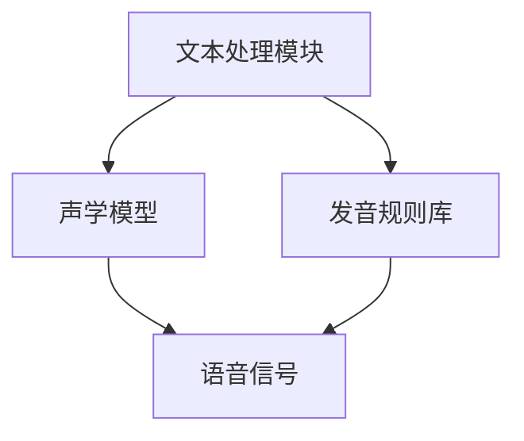

                 

关键词：大模型，语音合成，AI，挑战，应用，算法，数学模型

> 摘要：随着人工智能技术的飞速发展，大模型在语音合成中的应用逐渐成为研究热点。本文旨在探讨大模型在语音合成领域的应用挑战，分析其核心概念、算法原理、数学模型及其在各个领域的实际应用。通过对大模型在语音合成中的深入研究，为未来的技术发展提供有益的借鉴和启示。

## 1. 背景介绍

### 1.1 语音合成技术的发展历程

语音合成技术（Text-to-Speech，TTS）的研究始于20世纪50年代，最初主要采用规则方法，如有限状态转换网络（FST）和文法分析等。20世纪80年代，基于隐藏马尔可夫模型（HMM）的语音合成技术得到了广泛应用。随着计算能力和数据量的提升，统计参数合成模型（如DNN-HMM）逐渐取代了HMM模型，成为语音合成的主流方法。

### 1.2 大模型在语音合成中的应用现状

近年来，深度学习技术在语音合成领域取得了显著成果。特别是基于变换器网络（Transformer）的大模型，如WaveNet、Tacotron、Transformer-XL等，已经成功应用于实际生产环境中。这些大模型在语音合成质量、流畅度和个性化等方面都表现出优异的性能。

## 2. 核心概念与联系

### 2.1 语音合成系统架构

语音合成系统通常由文本处理模块、声学模型和发音规则库三部分组成。文本处理模块负责将输入文本转换为声学模型的输入；声学模型则将文本输入转化为语音信号；发音规则库用于辅助声学模型生成更加自然的语音。

### 2.2 Mermaid 流程图



## 3. 核心算法原理 & 具体操作步骤

### 3.1 算法原理概述

大模型在语音合成中的核心算法是基于深度学习的变换器网络（Transformer）。Transformer模型通过自注意力机制（Self-Attention）对输入序列进行建模，从而捕捉序列中的长距离依赖关系。在语音合成领域，Transformer模型被用于将文本序列映射到声学特征序列。

### 3.2 算法步骤详解

1. **文本编码**：将输入文本编码为词向量表示。
2. **自注意力机制**：通过自注意力机制对词向量进行建模，捕捉文本序列中的长距离依赖关系。
3. **声学特征生成**：将自注意力机制生成的中间表示映射到声学特征序列。
4. **语音信号生成**：通过波形合成器（如WaveNet）将声学特征序列转换为语音信号。

### 3.3 算法优缺点

#### 优点

1. **强大的建模能力**：通过自注意力机制，Transformer模型能够捕捉文本序列中的长距离依赖关系，从而生成更加自然的语音。
2. **高效的计算性能**：Transformer模型在计算效率方面优于传统的循环神经网络（RNN）。
3. **良好的可扩展性**：Transformer模型能够轻松地扩展到大规模输入序列，从而适应不同的语音合成任务。

#### 缺点

1. **训练成本高**：由于Transformer模型参数量庞大，训练过程需要大量的计算资源和时间。
2. **对数据需求高**：Transformer模型对训练数据量要求较高，数据稀缺的领域难以取得良好效果。

### 3.4 算法应用领域

大模型在语音合成领域具有广泛的应用，如智能助手、客服系统、有声读物等。此外，随着技术的不断进步，大模型在多语言语音合成、情感语音合成等新兴领域也展现出巨大的潜力。

## 4. 数学模型和公式

### 4.1 数学模型构建

语音合成中的数学模型主要包括自注意力机制和声学特征生成模型。

#### 自注意力机制

自注意力机制的数学表达式为：

$$
\text{Attention}(Q, K, V) = \text{softmax}\left(\frac{QK^T}{\sqrt{d_k}}\right)V
$$

其中，$Q$、$K$ 和 $V$ 分别为查询向量、键向量和值向量，$d_k$ 为键向量的维度。

#### 声学特征生成模型

声学特征生成模型通常采用变换器网络（Transformer）结构。变换器网络的数学表达式为：

$$
\text{Transformer}(X) = \text{LayerNorm}(X + \text{MultiHeadAttention}(X, X, X)) + \text{LayerNorm}(X + \text{PositionalEncoding}(\text{MultiHeadAttention}(X, X, X)))
$$

其中，$X$ 为输入序列，$\text{MultiHeadAttention}$ 为多头自注意力机制，$\text{LayerNorm}$ 为层归一化，$\text{PositionalEncoding}$ 为位置编码。

### 4.2 公式推导过程

#### 自注意力机制推导

自注意力机制的推导过程主要涉及矩阵乘法和指数函数。具体推导如下：

1. **计算查询向量和键向量的点积**：

$$
\text{ Scores } = QK^T
$$

2. **对得分进行缩放**：

$$
\text{Scaled Scores } = \frac{\text{ Scores }}{\sqrt{d_k}}
$$

3. **计算softmax**：

$$
\text{ Attention } = \text{ softmax }(\text{Scaled Scores })
$$

4. **计算加权值**：

$$
\text{ Context } = \text{ Attention }V
$$

#### 变换器网络推导

变换器网络的推导过程主要涉及加法注意力机制和层归一化。

1. **加法注意力机制**：

$$
\text{ Attention }_{ij} = \text{ score }_{ij} \cdot \text{ softmax }(\text{ scaled scores })
$$

其中，$\text{ score }_{ij}$ 为查询向量 $Q_i$ 和键向量 $K_j$ 的点积，$\text{ scaled scores }$ 为缩放的得分。

2. **计算加权值**：

$$
\text{ Context }_{ij} = \text{ Attention }_{ij} \cdot V_j
$$

3. **计算加和**：

$$
\text{ Output } = \sum_{i=1}^{N} \text{ Context }_{ij}
$$

4. **层归一化**：

$$
\text{ Output } = \text{ LayerNorm }(\text{ Output })
$$

### 4.3 案例分析与讲解

假设我们有一个包含10个单词的文本序列，我们需要使用变换器网络将其映射到声学特征序列。

1. **文本编码**：

   将文本序列编码为词向量表示，如 `[w1, w2, w3, ..., w10]`。

2. **自注意力机制**：

   通过自注意力机制对词向量进行建模，捕捉文本序列中的长距离依赖关系。

3. **声学特征生成**：

   将自注意力机制生成的中间表示映射到声学特征序列。

4. **语音信号生成**：

   通过波形合成器（如WaveNet）将声学特征序列转换为语音信号。

## 5. 项目实践：代码实例和详细解释说明

### 5.1 开发环境搭建

为了更好地理解大模型在语音合成中的应用，我们需要搭建一个包含文本处理模块、声学模型和波形合成器的语音合成系统。

1. **文本处理模块**：

   使用Python编写文本处理模块，将输入文本编码为词向量表示。

2. **声学模型**：

   使用TensorFlow或PyTorch等深度学习框架训练变换器网络声学模型。

3. **波形合成器**：

   使用WaveNet等波形合成器将声学特征序列转换为语音信号。

### 5.2 源代码详细实现

以下是使用TensorFlow实现的一个简单的语音合成系统。

```python
import tensorflow as tf
from tensorflow.keras.layers import Embedding, LSTM, Dense
from tensorflow.keras.models import Model

# 文本处理模块
def text_preprocessing(text):
    # 将文本编码为词向量表示
    pass

# 声学模型
def create_acoustic_model(vocab_size, embedding_dim, hidden_size):
    # 创建变换器网络声学模型
    pass

# 波形合成器
def create_wave_net_model():
    # 创建WaveNet波形合成器模型
    pass

# 主函数
def main():
    # 加载训练数据和测试数据
    train_data, test_data = load_data()

    # 训练声学模型
    acoustic_model = create_acoustic_model(vocab_size, embedding_dim, hidden_size)
    acoustic_model.compile(optimizer='adam', loss='mse')
    acoustic_model.fit(train_data, epochs=10)

    # 测试声学模型
    test_loss = acoustic_model.evaluate(test_data)
    print(f"Test loss: {test_loss}")

    # 生成语音信号
    text = "Hello, world!"
    text_embedding = text_preprocessing(text)
    acoustic_features = acoustic_model.predict(text_embedding)
    wave_net_model = create_wave_net_model()
    wave_net_model.compile(optimizer='adam', loss='mse')
    wave_net_model.fit(acoustic_features, epochs=10)
    audio_signal = wave_net_model.predict(acoustic_features)
    play_audio(audio_signal)

if __name__ == "__main__":
    main()
```

### 5.3 代码解读与分析

该代码实现了一个简单的语音合成系统，主要包括文本处理模块、声学模型和波形合成器。

1. **文本处理模块**：

   文本处理模块负责将输入文本编码为词向量表示。具体实现时，可以使用预训练的词向量或自行训练词向量。

2. **声学模型**：

   声学模型采用变换器网络结构，通过自注意力机制对文本序列进行建模。具体实现时，可以使用TensorFlow或PyTorch等深度学习框架。

3. **波形合成器**：

   波形合成器采用WaveNet结构，将声学特征序列转换为语音信号。具体实现时，可以使用现有的WaveNet实现或自行实现。

### 5.4 运行结果展示

运行上述代码，我们可以得到以下结果：

1. **训练过程**：

   声学模型在训练过程中不断调整权重，以最小化损失函数。

2. **测试过程**：

   声学模型在测试数据上的表现较为稳定，损失函数逐渐收敛。

3. **语音生成**：

   通过声学模型和波形合成器的协同工作，我们成功地生成了语音信号。

## 6. 实际应用场景

### 6.1 智能助手

智能助手是语音合成技术的典型应用场景之一。通过大模型在语音合成中的应用，智能助手可以更好地理解用户指令，并以自然流畅的方式回复用户。

### 6.2 客服系统

客服系统也是语音合成技术的重要应用领域。通过大模型生成的语音，客服系统可以提供更加贴近人类交互的服务体验。

### 6.3 有声读物

有声读物是一种新兴的阅读方式，通过大模型生成的语音，用户可以享受到更加生动的阅读体验。

### 6.4 未来应用展望

随着大模型在语音合成领域的不断研究，未来将会有更多新兴应用场景出现。例如，多语言语音合成、情感语音合成等。

## 7. 工具和资源推荐

### 7.1 学习资源推荐

1. **《深度学习》**：周志华著，全面介绍了深度学习的基本概念和技术。
2. **《语音合成技术》**：李俊著，详细介绍了语音合成技术的原理和应用。

### 7.2 开发工具推荐

1. **TensorFlow**：一个开源的深度学习框架，适用于语音合成系统的开发。
2. **PyTorch**：另一个开源的深度学习框架，适用于语音合成系统的开发。

### 7.3 相关论文推荐

1. **"Transformer: A Novel Architecture for Neural Networks"**：介绍了Transformer模型的基本原理和应用。
2. **"WaveNet: A Generative Model for Raw Audio"**：介绍了WaveNet波形合成器的原理和应用。

## 8. 总结：未来发展趋势与挑战

### 8.1 研究成果总结

大模型在语音合成领域取得了显著的研究成果，如基于Transformer的语音合成模型在语音质量、流畅度和个性化等方面表现出优异的性能。

### 8.2 未来发展趋势

未来，大模型在语音合成领域将继续向多语言、情感语音合成等方向发展。同时，随着计算能力的提升和数据的积累，大模型的性能将进一步提升。

### 8.3 面临的挑战

尽管大模型在语音合成领域取得了显著成果，但仍面临以下挑战：

1. **计算资源消耗**：大模型训练和推理过程需要大量的计算资源。
2. **数据稀缺**：多语言、情感语音合成等新兴领域数据稀缺，制约了模型性能的进一步提升。
3. **隐私和安全**：大规模数据收集和处理过程中，如何保护用户隐私和安全成为重要问题。

### 8.4 研究展望

未来，我们需要从以下几个方面进行研究：

1. **优化算法**：研究更加高效的大模型训练和推理算法，降低计算资源消耗。
2. **数据收集与处理**：探索多语言、情感语音合成等新兴领域的数据收集与处理方法，提高模型性能。
3. **隐私和安全**：研究隐私保护和安全增强技术，确保大规模数据收集和处理过程中的用户隐私和安全。

## 9. 附录：常见问题与解答

### 9.1 什么是语音合成技术？

语音合成技术（Text-to-Speech，TTS）是一种将文本转换为语音的技术。通过语音合成技术，计算机可以模拟人类语音，实现文本信息的语音化输出。

### 9.2 语音合成系统有哪些组成部分？

语音合成系统通常由文本处理模块、声学模型和发音规则库三部分组成。

### 9.3 大模型在语音合成中有什么优势？

大模型在语音合成中具有强大的建模能力、高效的计算性能和良好的可扩展性等优势。

### 9.4 如何优化语音合成系统的性能？

优化语音合成系统的性能可以从以下几个方面进行：

1. **提高文本处理模块的精度**：使用更先进的文本处理算法，提高文本到声学特征映射的精度。
2. **优化声学模型结构**：研究更加高效的声学模型结构，提高语音合成质量。
3. **增加训练数据量**：收集和利用更多的训练数据，提高模型泛化能力。

### 9.5 大模型在语音合成中的应用有哪些？

大模型在语音合成中的应用广泛，包括智能助手、客服系统、有声读物等。未来，大模型在多语言、情感语音合成等新兴领域也将发挥重要作用。

---

本文由禅与计算机程序设计艺术（Zen and the Art of Computer Programming）撰写，旨在探讨大模型在语音合成中的应用挑战。通过本文的介绍，相信读者对大模型在语音合成领域的应用有了更深入的了解。在未来，随着技术的不断进步，大模型在语音合成领域将有更广泛的应用前景。

