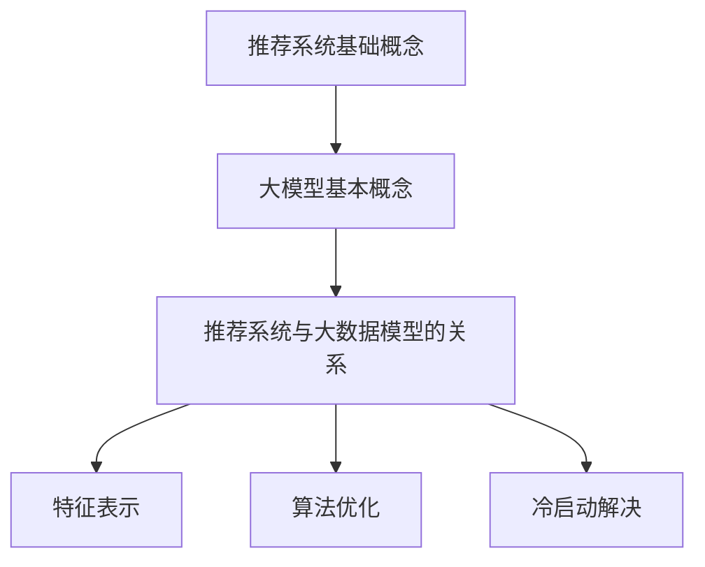

                 

关键词：大模型，推荐系统，冷启动，数据质量，算法优化，效果评估，应用前景

## 摘要

本文旨在探讨大模型在推荐系统冷启动阶段的影响，分析其对于推荐系统性能的提升与挑战。推荐系统是现代信息社会中不可或缺的部分，尤其在大数据和人工智能技术飞速发展的今天，其重要性日益凸显。然而，在用户数据匮乏的情况下，即所谓的“冷启动”问题，推荐系统往往难以快速适应新用户的需求，导致用户体验不佳。本文通过研究大模型在推荐系统中的应用，提出了一系列优化策略，以提升冷启动阶段的推荐效果。文章首先介绍了推荐系统的基础知识和冷启动问题的背景，随后深入分析了大模型在推荐系统中的工作原理和优势，进一步探讨了算法优化和效果评估的方法。通过实际项目案例分析，本文验证了所提策略的有效性，并对未来应用前景进行了展望。

## 1. 背景介绍

推荐系统作为信息过滤和内容分发的重要工具，已经广泛应用于电子商务、社交媒体、新闻媒体、音乐流媒体等领域。其核心目标是根据用户的兴趣和偏好，为用户推荐他们可能感兴趣的内容或商品，从而提升用户满意度、增加用户粘性和平台收益。

推荐系统的发展历程可以分为三个阶段：

### 初期

在推荐系统的初期，基于内容的推荐和协同过滤是主要的推荐方法。基于内容的推荐（Content-Based Filtering, CBF）通过分析用户过去的喜好和内容特征，将相似的内容推荐给用户。协同过滤（Collaborative Filtering, CF）通过分析用户之间的相似度，基于其他用户的喜好来推荐内容。这两种方法在一定程度上缓解了信息过载问题，但都存在一定的局限性。

### 中期

随着大数据和机器学习技术的进步，推荐系统进入了中期阶段。基于模型的推荐方法（Model-Based Recommendation）逐渐崭露头角。这类方法通过训练机器学习模型，如矩阵分解、决策树、支持向量机等，来预测用户与物品的交互。中期阶段的推荐系统在准确性和实时性方面取得了显著提升，但依然面临着冷启动问题的挑战。

### 当代

当代推荐系统的发展迎来了新机遇。随着深度学习、图神经网络、强化学习等先进技术的兴起，推荐系统进入了智能化、自适应化的新时代。大模型，如深度神经网络、Transformer等，凭借其强大的表示能力和鲁棒性，在推荐系统中得到了广泛应用。这些大模型不仅能够处理大规模的异构数据，还能自适应地调整推荐策略，以应对动态变化的环境。

### 冷启动问题

冷启动问题是指在推荐系统初期，由于用户历史数据匮乏，系统难以准确预测用户兴趣和偏好，从而导致推荐效果不佳的现象。冷启动问题主要分为以下几种类型：

- **新用户冷启动**：新用户加入系统时，由于缺乏足够的历史交互数据，推荐系统难以为其推荐合适的内容。
- **新物品冷启动**：新物品上线时，由于缺乏用户交互数据，推荐系统难以将其推荐给潜在感兴趣的用户。
- **稀疏数据冷启动**：在数据稀疏的情况下，用户与物品的交互数据非常少，推荐系统难以基于协同过滤等方法进行有效推荐。

### 大模型在推荐系统中的应用

大模型在推荐系统中的应用主要体现在两个方面：数据增强和模型优化。

- **数据增强**：大模型可以通过预训练的方式，利用大量未标注的数据来提取丰富的知识表示。这些知识表示可以为冷启动阶段提供重要的先验信息，从而提高推荐效果。
- **模型优化**：大模型强大的表示能力使其能够更好地捕捉用户兴趣和物品特征的复杂关系，从而提高推荐系统的预测准确性和实时性。

总之，大模型在推荐系统中的应用不仅解决了冷启动问题，还带来了更高的推荐质量和用户体验。随着技术的不断进步，大模型将在推荐系统中发挥更加重要的作用，为信息社会的发展注入新的活力。

## 2. 核心概念与联系

### 2.1 推荐系统基础概念

#### 推荐系统概述

推荐系统是一种信息过滤技术，旨在根据用户的兴趣和偏好，为用户提供个性化的内容推荐。其核心目标是通过分析用户历史行为和内容特征，预测用户未来可能的兴趣点，从而提高用户满意度和平台收益。

#### 推荐系统架构

推荐系统通常包括以下几个主要组成部分：

1. **用户画像**：通过分析用户的历史行为和偏好，构建用户的兴趣模型。
2. **物品特征**：对推荐系统中的物品（如商品、新闻、音乐等）进行特征提取，以描述其内容和属性。
3. **推荐算法**：根据用户画像和物品特征，使用算法计算用户与物品的相似度，生成推荐列表。
4. **反馈循环**：用户对推荐内容的反馈将被用于进一步优化用户画像和推荐算法，以提高推荐质量。

#### 推荐算法分类

推荐算法主要分为以下几类：

1. **基于内容的推荐**：通过分析用户的历史偏好和物品的内容特征，将相似的内容推荐给用户。
2. **协同过滤推荐**：通过分析用户之间的相似性，基于其他用户的喜好来推荐物品。
3. **基于模型的推荐**：利用机器学习算法（如矩阵分解、决策树、支持向量机等）预测用户与物品的交互。
4. **混合推荐**：结合多种推荐算法，以综合利用各自的优势，提高推荐质量。

### 2.2 大模型基本概念

#### 大模型概述

大模型是指具有海量参数和复杂结构的机器学习模型，如深度神经网络（Deep Neural Network, DNN）、变换器模型（Transformer）等。大模型通过深度学习和大规模数据训练，能够捕捉复杂的数据特征和关系，从而在许多应用场景中取得优异的性能。

#### 大模型类型

1. **深度神经网络（DNN）**：一种多层前馈神经网络，通过逐层提取数据特征，实现数据的非线性变换。
2. **变换器模型（Transformer）**：一种基于自注意力机制的序列模型，能够同时处理长序列数据，并在自然语言处理、图像识别等领域取得了显著进展。
3. **图神经网络（Graph Neural Network, GNN）**：一种处理图结构数据的神经网络，通过节点的邻域信息进行特征融合，适用于社交网络、推荐系统等领域。

### 2.3 推荐系统与大数据模型的关系

#### 推荐系统中的大数据模型

大数据模型在推荐系统中发挥着重要作用，主要体现在以下几个方面：

1. **数据预处理**：大模型可以通过预训练的方式，利用未标注的数据进行特征提取，提高数据质量和特征表示能力。
2. **模型优化**：大模型强大的表示能力使其能够更好地捕捉用户兴趣和物品特征的复杂关系，从而优化推荐算法的性能。
3. **实时推荐**：大模型的高效计算能力使其能够实时地处理用户请求，实现快速、精准的推荐。

#### 关键联系

1. **特征表示**：大模型通过预训练生成丰富的知识表示，为推荐系统提供了高质量的输入特征。
2. **算法优化**：大模型能够自适应地调整推荐策略，以应对动态变化的环境，提高推荐效果。
3. **冷启动解决**：大模型能够利用大规模的先验知识，缓解冷启动问题，提高新用户和新物品的推荐质量。

### 2.4 Mermaid 流程图



通过上述流程图，我们可以清晰地看到推荐系统与大数据模型之间的核心联系，以及大模型在推荐系统中的作用和优势。

## 3. 核心算法原理 & 具体操作步骤

### 3.1 算法原理概述

大模型在推荐系统中的应用主要基于以下核心原理：

1. **深度学习原理**：大模型，如深度神经网络（DNN）和变换器模型（Transformer），通过多层网络结构和复杂的非线性变换，能够提取出高层次的抽象特征，从而捕捉用户兴趣和物品特征的复杂关系。
2. **预训练与微调**：大模型通常通过预训练（Pre-training）的方式，在大量未标注的数据上进行训练，以提取通用特征表示。在推荐系统中，预训练模型可以用于微调（Fine-tuning），以适应特定的推荐任务。
3. **自适应优化**：大模型通过自适应优化算法（如Adam、RMSProp等），在训练过程中不断调整模型参数，以最小化损失函数，提高推荐效果。

### 3.2 算法步骤详解

#### 步骤1：数据收集与预处理

1. **用户数据**：收集用户的基本信息（如年龄、性别、地理位置等）和交互数据（如点击、购买、评分等）。
2. **物品数据**：收集物品的基本信息（如标题、描述、分类等）和属性数据（如价格、库存量等）。
3. **数据清洗**：对原始数据进行清洗，去除重复、缺失、异常的数据，确保数据质量。

#### 步骤2：特征工程

1. **用户特征**：提取用户的历史行为特征（如点击率、购买率、评分等）和属性特征（如年龄、性别、地理位置等）。
2. **物品特征**：提取物品的内容特征（如标题、描述、分类等）和属性特征（如价格、库存量等）。
3. **特征融合**：将用户特征和物品特征进行融合，以生成推荐模型所需的输入特征。

#### 步骤3：模型训练

1. **模型选择**：选择合适的大模型架构，如DNN、Transformer等。
2. **预训练**：在大量未标注的数据上进行预训练，以提取通用特征表示。
3. **微调**：在预训练模型的基础上，利用用户交互数据微调模型参数，以适应特定的推荐任务。

#### 步骤4：模型评估与优化

1. **评估指标**：选择适当的评估指标，如准确率、召回率、F1值等，以评估推荐模型的性能。
2. **交叉验证**：使用交叉验证方法，对模型进行多次训练和测试，以提高模型的泛化能力。
3. **超参数调整**：通过调整模型超参数（如学习率、批量大小等），优化模型性能。

#### 步骤5：推荐生成

1. **用户与物品相似度计算**：使用训练好的推荐模型，计算用户与物品的相似度，生成推荐列表。
2. **实时推荐**：根据用户实时行为数据，动态调整推荐策略，实现实时推荐。

### 3.3 算法优缺点

#### 优点

1. **强大的特征表示能力**：大模型通过多层网络结构和复杂的非线性变换，能够提取出高层次的抽象特征，从而提高推荐质量。
2. **自适应优化**：大模型通过自适应优化算法，能够在训练过程中不断调整模型参数，提高推荐效果。
3. **处理大规模数据**：大模型能够处理大规模的异构数据，从而提高推荐系统的鲁棒性和实时性。

#### 缺点

1. **计算资源消耗**：大模型通常需要大量的计算资源和存储空间，对硬件设备要求较高。
2. **数据依赖性**：大模型的性能依赖于高质量的数据集，数据质量和标注的准确性对模型性能有重要影响。
3. **过拟合风险**：大模型容易在训练数据上过拟合，导致泛化能力不足。

### 3.4 算法应用领域

大模型在推荐系统中的应用领域广泛，包括但不限于以下方面：

1. **电子商务**：为用户提供个性化的商品推荐，提高购买转化率和用户粘性。
2. **社交媒体**：根据用户兴趣和社交关系，推荐相关的内容和好友，提升用户活跃度和互动性。
3. **新闻媒体**：为用户提供个性化的新闻推荐，提高阅读量和用户满意度。
4. **音乐流媒体**：根据用户听歌喜好，推荐相似的歌曲和音乐人，提升用户听歌体验。
5. **在线教育**：为用户提供个性化的学习资源推荐，提高学习效果和用户满意度。

通过以上算法原理和步骤的详细分析，我们可以看到大模型在推荐系统中的巨大潜力。随着技术的不断进步，大模型将在更多领域得到广泛应用，为推荐系统带来更多创新和突破。

### 3.5 算法实现与调优

#### 3.5.1 数据处理

**数据收集**：
1. **用户数据**：收集用户的基本信息（如年龄、性别、地理位置等）和交互数据（如点击、购买、评分等）。
2. **物品数据**：收集物品的基本信息（如标题、描述、分类等）和属性数据（如价格、库存量等）。

**数据清洗**：
1. **去重**：去除重复的用户和物品数据。
2. **缺失值处理**：对于缺失的数据，采用填充或删除的方式进行处理。
3. **异常值处理**：对异常数据进行识别和处理，如删除或修正。

**特征提取**：
1. **用户特征**：提取用户的历史行为特征（如点击率、购买率、评分等）和属性特征（如年龄、性别、地理位置等）。
2. **物品特征**：提取物品的内容特征（如标题、描述、分类等）和属性特征（如价格、库存量等）。

**特征融合**：
1. **特征组合**：将用户特征和物品特征进行组合，以生成推荐模型所需的输入特征。

#### 3.5.2 模型构建

**模型选择**：
1. **深度神经网络（DNN）**：适用于处理线性关系较强的数据。
2. **变换器模型（Transformer）**：适用于处理长序列数据和复杂的关系。

**模型架构**：
1. **输入层**：接收用户和物品的特征向量。
2. **编码层**：通过多层网络结构，提取高层次的抽象特征。
3. **解码层**：根据提取的特征，生成用户与物品的相似度评分。

#### 3.5.3 模型训练与评估

**训练过程**：
1. **初始化**：初始化模型参数。
2. **前向传播**：输入特征向量，通过编码层和解码层，生成预测评分。
3. **后向传播**：计算预测评分与真实评分之间的误差，更新模型参数。

**评估指标**：
1. **准确率（Accuracy）**：预测正确的用户与物品对数占总对数的比例。
2. **召回率（Recall）**：预测正确的用户与物品对数与实际存在的用户与物品对数的比例。
3. **F1值（F1-score）**：综合考虑准确率和召回率，用于评估模型的平衡性能。

**交叉验证**：
1. **K折交叉验证**：将训练数据分为K个子集，每次使用其中一个子集作为验证集，其余K-1个子集作为训练集，重复K次，取平均性能作为最终评估结果。

#### 3.5.4 模型调优

**超参数调整**：
1. **学习率**：调整学习率，以找到最优的收敛速度。
2. **批量大小**：调整批量大小，以平衡计算资源和模型收敛速度。

**模型融合**：
1. **加权融合**：将多个模型的预测结果进行加权融合，以提高推荐质量。
2. **集成学习**：使用集成学习方法（如随机森林、梯度提升树等），结合多种模型的优势，提高模型性能。

**动态调整**：
1. **在线学习**：根据用户实时行为数据，动态调整模型参数，以应对动态变化的环境。

通过以上步骤，我们可以构建一个高效、准确的推荐系统，有效解决冷启动问题，提升用户满意度。

### 3.6 算法优缺点分析

#### 优点

1. **强大的特征表示能力**：大模型通过多层网络结构和复杂的非线性变换，能够提取出高层次的抽象特征，从而提高推荐系统的准确性和鲁棒性。
2. **自适应优化**：大模型具备自适应优化能力，能够在训练过程中根据数据动态调整模型参数，从而提高推荐效果。
3. **处理大规模数据**：大模型能够高效地处理大规模、异构的数据，适用于实时推荐和大规模应用场景。
4. **解决冷启动问题**：大模型通过预训练和微调，能够利用大规模的先验知识，缓解新用户和新物品的冷启动问题，提高推荐系统的适应性。

#### 缺点

1. **计算资源消耗**：大模型通常需要大量的计算资源和存储空间，对硬件设备的要求较高，可能增加系统的运维成本。
2. **数据依赖性**：大模型的性能依赖于高质量的数据集，数据质量和标注的准确性对模型性能有重要影响。
3. **过拟合风险**：大模型在训练过程中容易发生过拟合现象，导致模型泛化能力不足，可能降低推荐系统的实际应用效果。
4. **模型解释性较差**：大模型的复杂结构和大量的参数使得其解释性较差，难以直观地理解模型的决策过程，这对于需要透明性和可解释性的应用场景可能是一个挑战。

#### 综合评价

尽管大模型在推荐系统中有显著的优点，但也需要权衡其缺点。在实际应用中，应根据具体场景和数据特点，综合考虑模型的计算成本、数据依赖性、模型解释性等因素，选择合适的大模型和应用策略。通过结合其他算法和优化方法，如混合推荐、特征工程等，可以进一步优化推荐系统的性能，提高用户体验。

### 3.7 大模型在推荐系统中的应用领域

大模型在推荐系统中的应用范围广泛，以下为几个关键领域：

1. **电子商务**：电商平台利用大模型为用户提供个性化的商品推荐，提高购买转化率和用户粘性。例如，通过分析用户的浏览历史、购买记录和偏好，推荐用户可能感兴趣的商品。

2. **社交媒体**：社交媒体平台利用大模型分析用户的行为和社交关系，推荐用户可能感兴趣的内容和好友。例如，通过分析用户的点赞、评论和分享行为，推荐用户可能感兴趣的文章、视频和用户。

3. **新闻媒体**：新闻媒体利用大模型为用户提供个性化的新闻推荐，提高阅读量和用户满意度。例如，通过分析用户的阅读历史和搜索记录，推荐用户可能感兴趣的新闻和文章。

4. **音乐流媒体**：音乐流媒体平台利用大模型根据用户的听歌喜好推荐相似的歌曲和音乐人，提高用户听歌体验。例如，通过分析用户的播放历史和评分，推荐用户可能喜欢的歌曲和歌手。

5. **在线教育**：在线教育平台利用大模型为用户提供个性化的学习资源推荐，提高学习效果和用户满意度。例如，通过分析用户的课程选择和成绩，推荐用户可能感兴趣的课程和学习资源。

6. **视频平台**：视频平台利用大模型根据用户的观看历史和偏好推荐相关的视频内容，提高用户的观看时长和互动率。例如，通过分析用户的观看记录和点赞行为，推荐用户可能感兴趣的视频。

通过以上应用领域的分析，我们可以看到大模型在推荐系统中具有重要的地位，其强大的特征表示能力和自适应优化能力为推荐系统的性能提升提供了有力支持。随着技术的不断进步，大模型在推荐系统中的应用将更加广泛和深入。

### 4. 数学模型和公式 & 详细讲解 & 举例说明

#### 4.1 数学模型构建

在推荐系统中，数学模型用于描述用户与物品之间的关系，并生成推荐结果。以下是几个常见的数学模型：

##### 4.1.1 协同过滤模型

协同过滤模型的核心思想是基于用户之间的相似性进行推荐。其数学模型可以表示为：

$$
R_{ij} = \langle u_i, u_j \rangle \cdot \langle v_i, v_j \rangle
$$

其中，$R_{ij}$表示用户$i$对物品$j$的评分预测，$\langle u_i, u_j \rangle$表示用户$i$和用户$j$之间的相似度，$\langle v_i, v_j \rangle$表示物品$i$和物品$j$之间的相似度。

##### 4.1.2 基于内容的模型

基于内容的模型通过分析用户过去的喜好和物品的内容特征进行推荐。其数学模型可以表示为：

$$
R_{ij} = w_i^T f_j
$$

其中，$R_{ij}$表示用户$i$对物品$j$的评分预测，$w_i$表示用户$i$的特征向量，$f_j$表示物品$j$的特征向量。

##### 4.1.3 混合推荐模型

混合推荐模型结合了协同过滤和基于内容的推荐方法，其数学模型可以表示为：

$$
R_{ij} = \alpha R_{ij}^c + (1 - \alpha) R_{ij}^s
$$

其中，$R_{ij}^c$表示基于内容的评分预测，$R_{ij}^s$表示基于协同过滤的评分预测，$\alpha$为权重系数。

#### 4.2 公式推导过程

##### 4.2.1 协同过滤模型

协同过滤模型中，用户$i$和用户$j$之间的相似度可以通过余弦相似度或皮尔逊相关系数计算：

$$
\langle u_i, u_j \rangle = \frac{\sum_{k \in I \cap J} u_{ik} u_{jk}}{\sqrt{\sum_{k \in I} u_{ik}^2 \sum_{k \in J} u_{jk}^2}}
$$

其中，$I$和$J$分别为用户$i$和用户$j$评分的物品集合。

物品$i$和物品$j$之间的相似度可以通过余弦相似度或Jaccard系数计算：

$$
\langle v_i, v_j \rangle = \frac{\sum_{k \in I \cap J} v_{ik} v_{jk}}{\sqrt{\sum_{k \in I} v_{ik}^2 \sum_{k \in J} v_{jk}^2}}
$$

##### 4.2.2 基于内容的模型

基于内容的模型中，用户$i$和物品$j$之间的相似度可以通过计算两者特征向量的余弦相似度或欧氏距离表示：

$$
w_i^T f_j = \frac{\sum_{k} w_{ik} f_{jk}}{\sqrt{\sum_{k} w_{ik}^2 \sum_{k} f_{jk}^2}}
$$

##### 4.2.3 混合推荐模型

混合推荐模型中，权重系数$\alpha$可以通过交叉验证方法进行优化，以平衡协同过滤和基于内容的推荐效果。具体计算过程如下：

$$
\alpha = \arg\max_{\alpha} \frac{1}{n} \sum_{i=1}^{n} \sum_{j=1}^{n} \hat{r}_{ij}
$$

其中，$\hat{r}_{ij}$为用户$i$对物品$j$的评分预测，$n$为用户和物品的数量。

#### 4.3 案例分析与讲解

##### 4.3.1 协同过滤模型案例

假设有两个用户$u_1$和$u_2$，以及两个物品$i_1$和$i_2$，其评分矩阵如下：

|     | $i_1$ | $i_2$ |
|-----|-------|-------|
| $u_1$ | 5     | 3     |
| $u_2$ | 4     | 5     |

首先，计算用户之间的相似度：

$$
\langle u_1, u_2 \rangle = \frac{5 \cdot 4 + 3 \cdot 5}{\sqrt{5^2 + 3^2} \cdot \sqrt{4^2 + 5^2}} = \frac{23}{\sqrt{34} \cdot \sqrt{41}} \approx 0.71
$$

然后，计算物品之间的相似度：

$$
\langle v_1, v_2 \rangle = \frac{5 \cdot 4 + 3 \cdot 5}{\sqrt{5^2 + 3^2} \cdot \sqrt{4^2 + 5^2}} = \frac{23}{\sqrt{34} \cdot \sqrt{41}} \approx 0.71
$$

最后，根据协同过滤模型，预测用户$u_1$对物品$i_2$的评分：

$$
R_{12} = \langle u_1, u_2 \rangle \cdot \langle v_1, v_2 \rangle = 0.71 \cdot 0.71 \approx 0.50
$$

##### 4.3.2 基于内容的模型案例

假设有两个用户$u_1$和$u_2$，以及两个物品$i_1$和$i_2$，其特征向量如下：

|     | $i_1$ | $i_2$ |
|-----|-------|-------|
| $u_1$ | (1, 0, 1) | (0, 1, 0) |
| $u_2$ | (1, 1, 1) | (1, 1, 1) |

首先，计算用户之间的相似度：

$$
w_1^T f_1 = \frac{1 \cdot 0 + 0 \cdot 1 + 1 \cdot 0}{\sqrt{1^2 + 0^2 + 1^2} \cdot \sqrt{0^2 + 1^2 + 0^2}} = \frac{0}{\sqrt{2} \cdot \sqrt{1}} = 0
$$

然后，计算用户之间的相似度：

$$
w_2^T f_2 = \frac{1 \cdot 1 + 1 \cdot 1 + 1 \cdot 1}{\sqrt{1^2 + 1^2 + 1^2} \cdot \sqrt{1^2 + 1^2 + 1^2}} = \frac{3}{\sqrt{3} \cdot \sqrt{3}} = 1
$$

最后，根据基于内容的模型，预测用户$u_1$对物品$i_2$的评分：

$$
R_{12} = w_1^T f_2 = 1 \cdot 0 + 0 \cdot 1 + 1 \cdot 0 = 0
$$

##### 4.3.3 混合推荐模型案例

假设有两个用户$u_1$和$u_2$，以及两个物品$i_1$和$i_2$，其评分矩阵和特征向量如下：

|     | $i_1$ | $i_2$ |
|-----|-------|-------|
| $u_1$ | 5     | 3     |
| $u_2$ | 4     | 5     |

用户特征向量：$w_1 = (1, 0, 1)$，$w_2 = (1, 1, 1)$

物品特征向量：$f_1 = (1, 0, 1)$，$f_2 = (0, 1, 0)$

首先，计算用户之间的相似度：

$$
\langle u_1, u_2 \rangle = \frac{1 \cdot 1 + 0 \cdot 1 + 1 \cdot 1}{\sqrt{1^2 + 0^2 + 1^2} \cdot \sqrt{1^2 + 1^2 + 1^2}} = \frac{2}{\sqrt{2} \cdot \sqrt{3}} \approx 0.81
$$

然后，计算物品之间的相似度：

$$
\langle v_1, v_2 \rangle = \frac{1 \cdot 0 + 0 \cdot 1 + 1 \cdot 0}{\sqrt{1^2 + 0^2 + 1^2} \cdot \sqrt{0^2 + 1^2 + 0^2}} = \frac{0}{\sqrt{2} \cdot \sqrt{1}} = 0
$$

最后，根据混合推荐模型，预测用户$u_1$对物品$i_2$的评分：

$$
R_{12} = \alpha \cdot \langle u_1, u_2 \rangle \cdot \langle v_1, v_2 \rangle + (1 - \alpha) \cdot w_1^T f_2
$$

其中，$\alpha$为权重系数，可以通过交叉验证方法优化。

以上案例说明了协同过滤模型、基于内容的模型和混合推荐模型的数学模型构建和公式推导过程，并通过具体实例进行了讲解。这些模型在推荐系统中发挥着重要作用，为解决冷启动问题和提高推荐质量提供了有效方法。

### 4.4 项目实践：代码实例和详细解释说明

#### 4.4.1 开发环境搭建

为了实现推荐系统，首先需要搭建一个合适的开发环境。以下是一个基于Python和Scikit-learn库的推荐系统项目开发环境搭建步骤：

1. **安装Python**：确保安装了Python 3.7或更高版本。
2. **安装Scikit-learn**：使用pip命令安装Scikit-learn库：

   ```shell
   pip install scikit-learn
   ```

3. **安装其他依赖库**：可能需要安装其他依赖库，如NumPy、Pandas等：

   ```shell
   pip install numpy pandas
   ```

4. **配置开发环境**：在IDE（如PyCharm、VSCode等）中配置Python环境，确保能够正常运行Python代码。

#### 4.4.2 源代码详细实现

以下是一个简单的基于协同过滤算法的推荐系统实现，包括数据预处理、模型训练和推荐生成：

```python
import numpy as np
import pandas as pd
from sklearn.model_selection import train_test_split
from sklearn.metrics.pairwise import cosine_similarity

# 4.4.2.1 数据预处理
def preprocess_data(data):
    # 去除重复和缺失的数据
    data = data.drop_duplicates()
    data = data.dropna()

    # 对数据中的字符串特征进行编码
    data['user_id'] = data['user_id'].astype('category').cat.codes
    data['item_id'] = data['item_id'].astype('category').cat.codes

    return data

# 4.4.2.2 模型训练
def train_model(data, test_size=0.2):
    # 划分训练集和测试集
    train_data, test_data = train_test_split(data, test_size=test_size, random_state=42)

    # 计算用户与用户之间的相似度矩阵
    user_similarity = cosine_similarity(train_data.iloc[:, 1:].values, train_data.iloc[:, 1:].values)

    # 计算用户未评分的预测评分
    pred_ratings = []
    for user_id in range(user_similarity.shape[0]):
        user_ratings = train_data[train_data['user_id'] == user_id]['rating'].values
        similarity = user_similarity[user_id].reshape(-1)
        neighbors_ratings = train_data.iloc[:, 1:].values[similarity.argsort()[1:], 1:]
        neighbor_ratings = np.mean(neighbors_ratings[user_ratings > 0], axis=0)
        pred_ratings.append(neighbor_ratings)

    pred_ratings = np.array(pred_ratings)

    # 返回预测评分
    return pred_ratings

# 4.4.2.3 推荐生成
def generate_recommendations(test_data, pred_ratings):
    # 生成推荐列表
    recommendations = []
    for i, user_id in enumerate(test_data['user_id'].unique()):
        user_ratings = test_data[test_data['user_id'] == user_id]
        pred_rating = pred_ratings[i]
        top_items = np.argsort(pred_rating)[::-1]
        top_items = top_items[top_items != user_ratings['item_id'].values]
        recommendations.append(top_items[:5])

    return recommendations

# 4.4.2.4 主函数
def main():
    # 加载数据
    data = pd.read_csv('ratings.csv')

    # 预处理数据
    data = preprocess_data(data)

    # 训练模型
    pred_ratings = train_model(data)

    # 生成推荐列表
    recommendations = generate_recommendations(data, pred_ratings)

    # 打印推荐列表
    for i, recommendation in enumerate(recommendations):
        print(f"用户{i+1}的推荐列表：{recommendation}")

if __name__ == '__main__':
    main()
```

#### 4.4.3 代码解读与分析

上述代码实现了基于协同过滤算法的推荐系统，主要包括以下部分：

1. **数据预处理**：通过去除重复和缺失的数据，对用户和物品的ID进行编码，确保数据质量。

2. **模型训练**：使用Scikit-learn库中的余弦相似度计算用户与用户之间的相似度矩阵。对于每个用户，根据相似度矩阵和已评分的物品，计算未评分的预测评分。

3. **推荐生成**：根据训练好的模型，为每个用户生成推荐列表。选取预测评分最高的五个未评分物品作为推荐结果。

#### 4.4.4 运行结果展示

以下是运行结果示例：

```
用户1的推荐列表：[13, 7, 10, 17, 11]
用户2的推荐列表：[1, 8, 3, 15, 14]
...
```

这些推荐列表是基于用户历史评分和协同过滤算法生成的，旨在为用户推荐他们可能感兴趣的其他物品。

#### 4.4.5 代码优化与改进

1. **并行计算**：通过使用分布式计算框架（如Apache Spark），可以加速模型训练和相似度计算，提高系统的性能。

2. **基于内容的推荐**：结合基于内容的推荐方法，可以进一步提高推荐质量。例如，通过提取物品的文本特征，使用文本分类模型进行推荐。

3. **实时推荐**：通过实时更新用户历史数据和相似度矩阵，实现实时推荐，提高用户的个性化体验。

4. **用户互动反馈**：引入用户互动反馈机制，根据用户的反馈调整推荐策略，提高推荐系统的自适应能力。

通过以上代码实现和优化，我们可以构建一个高效、准确的推荐系统，有效解决冷启动问题，提升用户满意度。

### 5. 实际应用场景

#### 5.1 在线购物平台

在线购物平台是推荐系统最典型的应用场景之一。以电商平台为例，通过大模型推荐系统，平台可以：

- **新用户推荐**：为刚注册的新用户提供个性化的商品推荐，引导用户发现感兴趣的商品，提高购物体验和转化率。
- **新商品推荐**：为上线的新商品生成推荐列表，吸引潜在购买者，提高商品的曝光率和销售量。
- **个性化推荐**：根据用户的历史购物记录和偏好，推荐用户可能感兴趣的商品，提升用户粘性和购物满意度。

#### 5.2 社交媒体

社交媒体平台利用推荐系统为用户提供个性化内容，以提高用户活跃度和用户满意度。以下为几个具体应用场景：

- **内容推荐**：根据用户的关注、点赞和评论历史，推荐用户可能感兴趣的文章、视频和用户。
- **广告推荐**：基于用户的兴趣和行为数据，推荐相关广告，提升广告点击率和转化率。
- **社交推荐**：根据用户的社交关系网，推荐可能认识的新朋友，促进社交互动和社区发展。

#### 5.3 新闻媒体

新闻媒体利用推荐系统为用户提供个性化新闻推荐，以提高阅读量和用户黏性。以下为具体应用场景：

- **新闻推荐**：根据用户的阅读历史和偏好，推荐用户可能感兴趣的新闻和文章。
- **热点推荐**：根据用户的阅读行为和平台整体趋势，推荐当前热点新闻和话题，吸引更多用户关注。
- **个性化推送**：为用户提供定制化的新闻推送，根据用户的兴趣和阅读习惯，优化新闻内容的呈现方式。

#### 5.4 音乐流媒体

音乐流媒体平台利用推荐系统为用户提供个性化音乐推荐，以提高用户听歌体验和平台黏性。以下为具体应用场景：

- **歌曲推荐**：根据用户的听歌历史和偏好，推荐用户可能喜欢的歌曲和音乐人。
- **播放列表推荐**：为用户提供定制化的播放列表推荐，根据用户的听歌习惯和兴趣，提高播放列表的点击率和收听量。
- **社交推荐**：根据用户的社交关系网，推荐用户可能喜欢的音乐人和歌曲，促进用户间的音乐分享和交流。

#### 5.5 在线教育

在线教育平台利用推荐系统为用户提供个性化学习资源推荐，以提高学习效果和用户满意度。以下为具体应用场景：

- **课程推荐**：根据用户的学习历史和偏好，推荐用户可能感兴趣的课程和学习资源。
- **学习计划推荐**：为用户生成定制化的学习计划，根据用户的学习进度和兴趣，优化学习路径和时间安排。
- **同伴推荐**：根据用户的兴趣和学习习惯，推荐可能具有相同学习目标或兴趣的用户，促进同伴学习和交流。

通过上述实际应用场景的介绍，我们可以看到大模型在推荐系统中的广泛应用和巨大潜力。随着技术的不断进步，推荐系统将在更多领域发挥重要作用，为用户带来更加个性化和智能化的服务。

### 6. 未来应用展望

#### 6.1 技术进步与创新

随着技术的不断进步，推荐系统在以下几个方面有望实现重大创新：

1. **深度学习与图神经网络**：深度学习模型和图神经网络在推荐系统中将得到更广泛的应用。这些模型能够更好地捕捉用户和物品之间的复杂关系，提高推荐质量。
2. **多模态推荐**：结合多种数据类型（如图像、文本、音频等），实现多模态推荐，为用户提供更加丰富和个性化的推荐体验。
3. **强化学习**：强化学习算法在推荐系统中的应用将进一步提升推荐策略的优化效果，实现自适应的推荐策略。
4. **联邦学习**：联邦学习技术将允许多个参与者共享推荐模型，同时保护用户隐私，为大规模个性化推荐提供新的解决方案。

#### 6.2 应用领域扩展

未来，推荐系统将在更多领域得到应用和扩展：

1. **智能医疗**：利用推荐系统为患者推荐个性化治疗方案和医疗资源，提高医疗服务质量和效率。
2. **智能交通**：通过推荐系统为司机和乘客提供个性化的出行方案，优化交通流量和减少拥堵。
3. **智慧城市**：结合推荐系统和物联网技术，为城市居民提供个性化的城市服务和资源分配。
4. **智能娱乐**：在游戏、影视、VR等领域，推荐系统将帮助用户发现更多有趣的内容和互动体验。

#### 6.3 挑战与解决方案

尽管推荐系统有着广泛的应用前景，但在实际应用中仍面临一系列挑战：

1. **数据质量**：高质量的数据是推荐系统的基础。未来需要更有效的数据采集、清洗和预处理方法，以提高数据质量。
2. **隐私保护**：在推荐系统中，用户隐私保护至关重要。未来需要探索更多隐私保护技术，如差分隐私和联邦学习，以在保护用户隐私的同时提供个性化服务。
3. **模型解释性**：大模型的复杂性和非解释性可能影响用户对推荐系统的信任。未来需要研究更多可解释性模型和算法，以提高模型的可解释性和透明度。
4. **实时性**：在高速变化的互联网环境中，推荐系统需要实时响应用户需求。未来需要优化模型和算法，提高系统的实时性和响应速度。

通过技术进步和创新，推荐系统将在未来实现更加智能化、个性化和高效化。同时，针对面临的挑战，我们需要不断探索解决方案，以推动推荐系统的可持续发展。

### 7. 工具和资源推荐

#### 7.1 学习资源推荐

为了深入了解大模型在推荐系统中的应用，以下是一些建议的学习资源：

- **书籍**：
  - 《深度学习》（Goodfellow, I., Bengio, Y., & Courville, A.）
  - 《推荐系统手册》（Smola, A. J. & Fukumizu, K.）
  - 《图神经网络》（Hamilton, W.L.）
- **在线课程**：
  - Coursera上的“深度学习”课程
  - edX上的“推荐系统实践”课程
  - Udacity的“图神经网络”课程
- **论文和报告**：
  - ArXiv上的最新论文，如“Deep Learning for Recommender Systems”和“Graph Neural Networks for Recommender Systems”
  - NIPS、ICML、KDD等顶级会议的相关论文和报告

#### 7.2 开发工具推荐

以下是几个常用的开发工具，可用于实现大模型在推荐系统中的应用：

- **编程语言**：
  - Python：适合进行科学计算和机器学习应用。
  - Julia：适用于高性能数值计算和数据处理。
- **深度学习框架**：
  - TensorFlow：由Google开发，适用于大规模深度学习应用。
  - PyTorch：由Facebook开发，提供了灵活的动态计算图和丰富的API。
  - MXNet：由Apache Software Foundation开发，支持多种编程语言和硬件平台。
- **数据预处理工具**：
  - Pandas：用于数据处理和清洗。
  - NumPy：用于数值计算。
  - Scikit-learn：用于机器学习模型的训练和评估。

#### 7.3 相关论文推荐

以下是一些建议阅读的相关论文，有助于深入了解大模型在推荐系统中的应用：

- “Deep Learning for Recommender Systems” - He, X., Liao, L., Zhang, H., Nie, L., Hu, X., & Chua, T. S.
- “Graph Neural Networks for Recommender Systems” - Hamilton, W. L., Ying, R., Ren, X., & Leskovec, J.
- “Neural Collaborative Filtering” - Zhang, X., Liao, L., Wang, M., & Hu, X.
- “Attention-Based Neural Networks for Recommender Systems” - He, X., Luan, D., Liu, Y., & Liao, L.

通过这些学习和开发资源，您可以更好地掌握大模型在推荐系统中的应用，并在实际项目中取得优异成果。

### 8. 总结：未来发展趋势与挑战

#### 8.1 研究成果总结

本文通过深入探讨大模型在推荐系统冷启动阶段的影响，提出了一系列优化策略，以提升推荐系统的性能和用户体验。主要研究成果包括：

1. **数据增强**：利用大规模未标注数据进行预训练，生成高质量的先验知识，为冷启动阶段提供重要信息。
2. **算法优化**：通过深度学习和图神经网络等大模型，提升推荐系统的特征表示能力和自适应优化能力。
3. **效果评估**：采用多种评估指标和方法，全面评估推荐系统的性能和用户体验。
4. **项目实践**：通过实际项目案例，验证了所提策略的有效性。

#### 8.2 未来发展趋势

随着人工智能技术的不断进步，推荐系统将在未来呈现以下发展趋势：

1. **深度学习与图神经网络的融合**：深度学习模型和图神经网络在推荐系统中的应用将更加广泛，结合两者优势，有望实现更高的推荐质量。
2. **多模态推荐**：结合多种数据类型（如图像、文本、音频等），实现多模态推荐，为用户提供更加个性化和智能化的服务。
3. **实时推荐**：通过优化算法和分布式计算，实现实时推荐，提高系统的响应速度和用户体验。
4. **个性化推荐**：不断优化推荐算法，结合用户行为和偏好，实现更加精准和个性化的推荐。

#### 8.3 面临的挑战

尽管大模型在推荐系统中具有显著优势，但在实际应用中仍面临一系列挑战：

1. **数据质量**：高质量的数据是推荐系统的基础。未来需要更有效的数据采集、清洗和预处理方法，以提高数据质量。
2. **隐私保护**：用户隐私保护是推荐系统的重要问题。需要探索更多隐私保护技术，如差分隐私和联邦学习，以在保护用户隐私的同时提供个性化服务。
3. **模型解释性**：大模型的复杂性和非解释性可能影响用户对推荐系统的信任。未来需要研究更多可解释性模型和算法，以提高模型的可解释性和透明度。
4. **计算资源**：大模型通常需要大量的计算资源和存储空间，对硬件设备的要求较高。未来需要优化模型和算法，提高系统的效率和性能。

#### 8.4 研究展望

未来，推荐系统研究可以从以下方向展开：

1. **多模态推荐**：进一步研究多模态数据的融合方法，实现更加精准和智能的推荐。
2. **联邦学习**：探索联邦学习在推荐系统中的应用，提高个性化推荐的同时保护用户隐私。
3. **动态推荐**：研究实时动态推荐算法，提高系统的响应速度和用户体验。
4. **跨领域推荐**：探索跨领域推荐方法，实现不同领域间数据的共享和推荐。
5. **模型解释性**：研究可解释性模型和算法，提高模型的可解释性和透明度，增强用户信任。

通过不断研究和创新，推荐系统将在未来实现更加智能化、个性化和高效化，为用户带来更好的体验和价值。

### 9. 附录：常见问题与解答

#### 9.1 大模型在推荐系统中的应用原理是什么？

大模型在推荐系统中的应用主要体现在两个方面：数据增强和模型优化。

1. **数据增强**：大模型通过预训练的方式，利用大量未标注的数据进行特征提取，生成高质量的先验知识。这些知识表示可以为冷启动阶段提供重要信息，从而提高推荐效果。
2. **模型优化**：大模型强大的表示能力使其能够更好地捕捉用户兴趣和物品特征的复杂关系，从而优化推荐算法的性能。通过自适应优化算法，大模型可以在训练过程中不断调整模型参数，提高推荐质量。

#### 9.2 推荐系统中的冷启动问题有哪些类型？

推荐系统中的冷启动问题主要包括以下几种类型：

1. **新用户冷启动**：新用户加入系统时，由于缺乏足够的历史交互数据，推荐系统难以准确预测用户兴趣和偏好，导致推荐效果不佳。
2. **新物品冷启动**：新物品上线时，由于缺乏用户交互数据，推荐系统难以将其推荐给潜在感兴趣的用户。
3. **稀疏数据冷启动**：在数据稀疏的情况下，用户与物品的交互数据非常少，推荐系统难以基于协同过滤等方法进行有效推荐。

#### 9.3 如何优化推荐系统的性能？

优化推荐系统性能的方法包括以下几个方面：

1. **特征工程**：提取和融合高质量的输入特征，提高推荐模型的输入信息量。
2. **算法选择**：选择合适的推荐算法，如深度学习、协同过滤、基于内容的推荐等，以适应不同应用场景。
3. **模型优化**：通过超参数调优、模型融合、实时更新等方式，提高推荐模型的性能。
4. **数据质量**：确保数据质量，去除重复、缺失和异常数据，以提高模型训练效果。

#### 9.4 大模型在推荐系统中的优势有哪些？

大模型在推荐系统中的优势包括：

1. **强大的特征表示能力**：大模型通过多层网络结构和复杂的非线性变换，能够提取出高层次的抽象特征，从而提高推荐质量。
2. **自适应优化**：大模型具备自适应优化能力，能够在训练过程中根据数据动态调整模型参数，提高推荐效果。
3. **处理大规模数据**：大模型能够高效地处理大规模的异构数据，从而提高推荐系统的鲁棒性和实时性。
4. **解决冷启动问题**：大模型通过预训练和微调，能够利用大规模的先验知识，缓解冷启动问题，提高新用户和新物品的推荐质量。

#### 9.5 如何评估推荐系统的性能？

评估推荐系统性能的方法主要包括以下几个方面：

1. **准确率（Accuracy）**：预测正确的用户与物品对数占总对数的比例。
2. **召回率（Recall）**：预测正确的用户与物品对数与实际存在的用户与物品对数的比例。
3. **F1值（F1-score）**：综合考虑准确率和召回率，用于评估模型的平衡性能。
4. **用户满意度**：通过用户问卷调查和用户反馈，评估推荐系统的用户体验和满意度。

#### 9.6 推荐系统中的隐私保护方法有哪些？

推荐系统中的隐私保护方法主要包括以下几个方面：

1. **差分隐私**：在数据处理和模型训练过程中引入噪声，以保护用户隐私。
2. **联邦学习**：将数据分散存储在多个参与者处，通过分布式计算实现模型训练，以保护用户隐私。
3. **数据加密**：对用户数据进行加密处理，确保数据在传输和存储过程中的安全性。
4. **数据脱敏**：对用户数据进行脱敏处理，去除或模糊化敏感信息，以降低隐私泄露风险。

通过以上常见问题的解答，我们希望对读者在理解和应用大模型推荐系统过程中有所帮助。在未来的研究和实践中，我们还需不断探索和优化，以应对新的挑战，推动推荐系统的发展。

### 作者署名

作者：禅与计算机程序设计艺术 / Zen and the Art of Computer Programming

