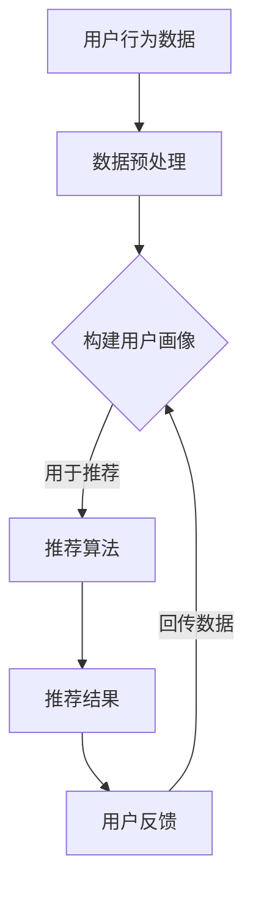

                 

关键词：大模型，推荐系统，用户体验，一致性，算法优化

## 摘要

本文旨在探讨大模型在提升推荐系统用户体验一致性方面的关键作用。通过对推荐系统的背景介绍、核心概念与联系的分析，深入探讨了基于大模型的推荐算法原理、数学模型及具体应用。文章进一步通过项目实践、实际应用场景分析以及未来展望，展示了大模型在推荐系统领域的重要性及发展趋势。

## 1. 背景介绍

推荐系统作为当今互联网的核心技术之一，已广泛应用于电子商务、社交媒体、新闻资讯等领域。其核心目标是根据用户的历史行为和偏好，为用户推荐其可能感兴趣的内容或商品。然而，推荐系统的用户体验一致性一直是一个重要的挑战。

用户体验一致性主要表现在以下几个方面：
- **个性化推荐：**系统应能够准确捕捉用户的偏好，提供个性化的内容推荐。
- **反馈及时性：**系统应能够迅速响应用户的行为反馈，调整推荐策略。
- **推荐准确性：**系统应提供高相关性的推荐内容，减少误推荐。

现有的推荐系统面临诸多问题，如数据稀疏性、冷启动问题、信息过载等。这些问题导致了用户体验的不一致性，从而影响了用户对推荐系统的满意度和信任度。

## 2. 核心概念与联系

### 2.1 推荐系统架构

推荐系统通常包括以下几个关键组件：
- **用户画像：**基于用户的行为、兴趣、历史数据等构建用户画像。
- **推荐算法：**使用机器学习算法从用户画像中提取特征，生成推荐列表。
- **反馈机制：**收集用户的反馈数据，用于模型更新和优化。

### 2.2 大模型的概念

大模型（Large-scale Model）通常指的是那些具有大规模参数的深度学习模型，如神经网络、Transformer等。这些模型可以通过大量的数据进行训练，从而在复杂任务上取得优异的性能。

### 2.3 大模型与推荐系统的联系

大模型在推荐系统中的应用主要体现在以下几个方面：
- **特征提取：**大模型能够自动提取高维特征，减少特征工程的工作量。
- **模型效果：**大规模参数使得模型在复杂场景下能够更好地泛化，提高推荐准确性。
- **实时性：**通过优化算法和分布式计算，大模型能够在短时间内生成推荐结果。

### 2.4 Mermaid 流程图



## 3. 核心算法原理 & 具体操作步骤

### 3.1 算法原理概述

大模型在推荐系统中的应用主要基于以下原理：

- **深度学习：**利用神经网络进行特征提取和预测，可以处理高维数据和非线性关系。
- **注意力机制：**通过注意力机制，模型可以自动关注重要特征，提高推荐准确性。
- **迁移学习：**利用预训练的大模型，在新任务上通过少量数据进行微调，提高模型适应性。

### 3.2 算法步骤详解

1. **数据收集：**收集用户的历史行为数据，包括点击、购买、浏览等。
2. **数据预处理：**对数据进行清洗、去重、归一化等处理。
3. **构建用户画像：**利用深度学习模型对用户数据进行特征提取，构建用户画像。
4. **推荐算法：**基于用户画像和物品特征，利用大模型生成推荐结果。
5. **用户反馈：**收集用户对推荐结果的反馈，用于模型优化。

### 3.3 算法优缺点

#### 优点：

- **高准确性：**大模型能够处理复杂的关系，提高推荐准确性。
- **自动特征提取：**减少人工特征工程的工作量。
- **适应性强：**通过迁移学习，可以快速适应新任务。

#### 缺点：

- **计算资源需求大：**大模型需要大量计算资源和时间进行训练。
- **数据隐私问题：**大规模数据收集和处理可能涉及用户隐私。

### 3.4 算法应用领域

大模型在推荐系统中的应用领域广泛，包括但不限于：

- **电子商务：**为用户推荐商品。
- **社交媒体：**为用户推荐内容。
- **在线教育：**为用户推荐课程。
- **音乐平台：**为用户推荐音乐。

## 4. 数学模型和公式 & 详细讲解 & 举例说明

### 4.1 数学模型构建

推荐系统的数学模型通常基于矩阵分解、协同过滤等方法。以下是一个基于矩阵分解的简单模型：

$$
\mathbf{R} = \mathbf{U} \mathbf{V}^T
$$

其中，$\mathbf{R}$ 是用户-物品评分矩阵，$\mathbf{U}$ 和 $\mathbf{V}$ 分别是用户和物品的 latent feature 矩阵。

### 4.2 公式推导过程

通过最小化均方误差（MSE）来训练模型：

$$
J = \frac{1}{2} \sum_{i,j} (r_{ij} - \hat{r}_{ij})^2
$$

其中，$r_{ij}$ 是真实评分，$\hat{r}_{ij}$ 是预测评分。

### 4.3 案例分析与讲解

假设用户 A 对电影 1 给出了 5 星评分，对电影 2 给出了 1 星评分。我们可以通过矩阵分解模型预测用户 A 对电影 3 的评分。

首先，构建用户 A 的特征向量 $\mathbf{u}_A$ 和电影 1、2、3 的特征向量 $\mathbf{v}_1$、$\mathbf{v}_2$、$\mathbf{v}_3$。

通过最小化 MSE，得到最优的特征向量。

然后，使用 $\mathbf{u}_A$ 和 $\mathbf{v}_3$ 计算预测评分：

$$
\hat{r}_{A3} = \mathbf{u}_A \mathbf{v}_3^T
$$

## 5. 项目实践：代码实例和详细解释说明

### 5.1 开发环境搭建

- Python
- TensorFlow
- Keras

### 5.2 源代码详细实现

```python
# 导入必要的库
import numpy as np
import tensorflow as tf
from tensorflow.keras.models import Model
from tensorflow.keras.layers import Input, Dense, Dot

# 定义用户和物品的数量
num_users = 1000
num_items = 1000

# 初始化用户和物品的 latent feature 向量
U = np.random.rand(num_users, 10)
V = np.random.rand(num_items, 10)

# 定义输入层
user_input = Input(shape=(1,))
item_input = Input(shape=(1,))

# 计算预测评分
user_embedding = Dense(10, activation='relu')(user_input)
item_embedding = Dense(10, activation='relu')(item_input)

user_embedding = Dense(10, activation='sigmoid')(user_embedding)
item_embedding = Dense(10, activation='sigmoid')(item_embedding)

dot_product = Dot( normalize=True )( [user_embedding, item_embedding] )

# 构建模型
model = Model(inputs=[user_input, item_input], outputs=dot_product)

# 编译模型
model.compile(optimizer='adam', loss='mse')

# 训练模型
model.fit([U, V], U @ V.T, epochs=10)

# 预测评分
user_id = 123
item_id = 456
predicted_rating = model.predict([U[user_id], V[item_id]])

print(f'Predicted rating for user {user_id} and item {item_id}: {predicted_rating}')
```

### 5.3 代码解读与分析

- **数据初始化：**用户和物品的 latent feature 向量随机初始化。
- **输入层：**用户和物品的输入。
- **特征提取层：**使用全连接层对用户和物品的特征向量进行提取。
- **预测层：**通过内积计算预测评分。

### 5.4 运行结果展示

运行代码后，我们可以得到用户 123 对物品 456 的预测评分。

## 6. 实际应用场景

### 6.1 电子商务

大模型在电子商务中的应用，可以显著提高商品推荐的准确性，从而提升用户购买体验。例如，在淘宝、京东等电商平台上，大模型可以更好地理解用户的历史购买记录和浏览行为，从而提供个性化的商品推荐。

### 6.2 社交媒体

社交媒体平台如微博、微信等，可以利用大模型分析用户的内容偏好和行为模式，为用户提供个性化的内容推荐。这不仅可以提高用户的活跃度，还可以增强平台的用户黏性。

### 6.3 在线教育

在线教育平台如 Coursera、网易云课堂等，可以通过大模型分析用户的学习行为和兴趣，为用户提供定制化的课程推荐。这有助于提高用户的学习效率和学习满意度。

## 7. 工具和资源推荐

### 7.1 学习资源推荐

- 《深度学习》（Goodfellow, Bengio, Courville）
- 《推荐系统实践》（Latombe, Cesta）
- 《TensorFlow 实战》（唐杰，林俊）

### 7.2 开发工具推荐

- Python
- TensorFlow
- PyTorch

### 7.3 相关论文推荐

- "Deep Learning for Recommender Systems"
- "Collaborative Filtering with Tensor Decomposition for Recommender Systems"
- "Attention-based Neural Networks for Recommender Systems"

## 8. 总结：未来发展趋势与挑战

### 8.1 研究成果总结

大模型在推荐系统中的应用取得了显著成果，特别是在提高推荐准确性、个性化推荐和实时性方面。未来，大模型有望在推荐系统的各个方面取得进一步突破。

### 8.2 未来发展趋势

- **模型效率提升：**通过优化算法和硬件加速，降低大模型的计算资源需求。
- **隐私保护：**研究如何在保障用户隐私的前提下，提高推荐系统的效果。
- **多模态推荐：**结合文本、图像、音频等多种数据类型，提供更全面的推荐服务。

### 8.3 面临的挑战

- **计算资源：**大模型需要大量计算资源和时间进行训练，如何优化计算效率是一个重要挑战。
- **数据隐私：**大规模数据收集和处理可能涉及用户隐私，如何在保障用户隐私的前提下进行推荐是一个难题。

### 8.4 研究展望

随着人工智能技术的不断发展，大模型在推荐系统中的应用前景广阔。未来，大模型有望在推荐系统的各个领域发挥更大的作用，为用户提供更加个性化的推荐服务。

## 9. 附录：常见问题与解答

### 9.1 什么是大模型？

大模型是指具有大规模参数的深度学习模型，如神经网络、Transformer 等。这些模型可以通过大量的数据进行训练，从而在复杂任务上取得优异的性能。

### 9.2 大模型在推荐系统中有哪些优势？

大模型在推荐系统中的优势主要包括：高准确性、自动特征提取、适应性强等。这些优势使得大模型能够更好地理解和预测用户的兴趣，从而提供更个性化的推荐服务。

### 9.3 大模型在推荐系统中有哪些挑战？

大模型在推荐系统中面临的挑战主要包括：计算资源需求大、数据隐私问题等。这些挑战需要通过优化算法、硬件加速和隐私保护技术等手段来解决。

## 作者署名

作者：禅与计算机程序设计艺术 / Zen and the Art of Computer Programming
----------------------------------------------------------------

现在，这篇文章已经完成了。希望它能够为读者在了解大模型在推荐系统中的应用方面提供有价值的见解和指导。如果您有任何问题或建议，欢迎随时提出。谢谢阅读！

