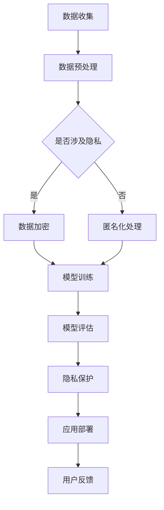

                 

关键词：大模型、应用落地、数据隐私、技术挑战、解决方案

> 摘要：本文将探讨大模型在应用落地过程中面临的挑战，特别是数据隐私问题。通过分析核心概念、算法原理、数学模型，以及项目实践，本文旨在为读者提供对大模型应用和隐私保护技术的深入理解，并展望其未来发展趋势与面临的挑战。

## 1. 背景介绍

随着深度学习和大数据技术的发展，大模型在自然语言处理、图像识别、推荐系统等领域展现出了强大的性能和广泛的应用前景。这些大模型通常需要海量的训练数据、强大的计算资源和复杂的训练过程。然而，大模型的应用落地不仅面临着技术挑战，还涉及到数据隐私和安全性等关键问题。

在数据隐私方面，大模型的应用可能会导致以下风险：
- **数据泄露**：模型训练和使用过程中可能暴露敏感数据。
- **隐私侵犯**：用户隐私可能被无意中泄露，影响用户权益。
- **安全威胁**：未经授权的访问和数据篡改可能导致严重后果。

因此，如何在确保数据隐私和安全的前提下，有效地应用大模型，成为了当前研究的重要课题。

## 2. 核心概念与联系

为了深入理解大模型应用和数据隐私保护，我们首先需要了解以下几个核心概念：

### 2.1 大模型定义

大模型是指具有数十亿参数的深度学习模型，如GPT-3、BERT等。这些模型通过在海量数据上进行训练，可以学习到丰富的知识和复杂的模式。

### 2.2 深度学习原理

深度学习是一种通过多层神经网络对数据进行自动特征提取和学习的机器学习方法。大模型通常采用多层神经网络结构，通过逐层抽象和整合信息，实现对复杂数据的理解。

### 2.3 数据隐私保护技术

数据隐私保护技术包括数据加密、匿名化、差分隐私等。这些技术可以在不同层面上保护数据隐私，防止数据泄露和隐私侵犯。

### 2.4 Mermaid 流程图

以下是大模型应用与数据隐私保护的 Mermaid 流程图：



## 3. 核心算法原理 & 具体操作步骤

### 3.1 算法原理概述

大模型的核心算法基于深度学习技术，主要包括以下步骤：

1. 数据收集：从公开或私有数据源收集数据。
2. 数据预处理：对数据进行清洗、归一化和数据增强等操作。
3. 模型训练：使用训练数据训练模型，调整模型参数。
4. 模型评估：使用验证数据评估模型性能。
5. 隐私保护：对训练和评估过程中的数据进行隐私保护处理。
6. 应用部署：将训练好的模型部署到实际应用场景。
7. 用户反馈：收集用户反馈，优化模型和应用。

### 3.2 算法步骤详解

1. **数据收集**：选择合适的数据源，包括公开数据集和私有数据集。对于私有数据，需要确保数据所有者同意数据的使用和共享。
   
2. **数据预处理**：对收集到的数据进行清洗，去除噪声和异常值。然后进行归一化处理，使数据适合深度学习模型的训练。此外，还可以通过数据增强技术增加训练数据的多样性。

3. **模型训练**：选择合适的深度学习框架和算法，如TensorFlow或PyTorch，搭建模型结构。使用训练数据进行模型训练，通过反向传播算法调整模型参数。

4. **模型评估**：使用验证数据对训练好的模型进行评估，检查模型的性能。常用的评估指标包括准确率、召回率、F1分数等。

5. **隐私保护**：在模型训练和评估过程中，采用数据加密、匿名化、差分隐私等技术对数据进行隐私保护。例如，可以使用差分隐私算法对模型的梯度进行扰动，以防止隐私泄露。

6. **应用部署**：将训练好的模型部署到实际应用场景，如网站、移动应用或云计算平台。确保模型的部署环境符合数据隐私和安全要求。

7. **用户反馈**：收集用户反馈，对模型和应用进行迭代优化。根据用户反馈调整模型参数和应用功能，提高用户体验。

### 3.3 算法优缺点

**优点**：
- **强大的学习能力**：大模型可以学习到复杂的模式和知识，提高模型性能。
- **广泛应用领域**：大模型可以应用于自然语言处理、图像识别、推荐系统等多个领域。

**缺点**：
- **数据需求量大**：大模型需要大量的训练数据，可能导致数据隐私风险。
- **计算资源需求高**：大模型训练需要强大的计算资源和时间。

### 3.4 算法应用领域

大模型在以下领域具有广泛的应用：

- **自然语言处理**：如文本分类、机器翻译、情感分析等。
- **图像识别**：如人脸识别、图像分类、目标检测等。
- **推荐系统**：如商品推荐、音乐推荐、新闻推荐等。
- **医疗健康**：如疾病预测、药物研发、医学影像分析等。

## 4. 数学模型和公式 & 详细讲解 & 举例说明

### 4.1 数学模型构建

大模型的数学模型通常基于多层神经网络，包括输入层、隐藏层和输出层。每个层由多个神经元组成，神经元之间通过权重连接。模型的目标是学习输入和输出之间的映射关系。

### 4.2 公式推导过程

以下是神经网络中权重调整的公式推导：

$$
\Delta W_{ij} = -\alpha \cdot \frac{\partial J}{\partial W_{ij}}
$$

其中，$W_{ij}$ 表示神经元 $i$ 和神经元 $j$ 之间的权重，$\alpha$ 表示学习率，$J$ 表示损失函数。

### 4.3 案例分析与讲解

以下是一个简单的神经网络训练案例：

假设我们有一个二元分类问题，数据集包含 $n$ 个样本，每个样本包含 $m$ 个特征。我们使用一个单层神经网络进行训练。

1. **模型初始化**：随机初始化模型参数，包括输入层和输出层的权重。
   
2. **前向传播**：将输入数据传递到神经网络中，计算输出值。

$$
z = \sigma(W \cdot X + b)
$$

其中，$X$ 表示输入数据，$W$ 表示输入层和隐藏层之间的权重，$b$ 表示偏置项，$\sigma$ 表示激活函数（如Sigmoid函数）。

3. **后向传播**：计算损失函数，并使用梯度下降算法调整模型参数。

$$
\Delta W = -\alpha \cdot \frac{\partial J}{\partial W}
$$

$$
\Delta b = -\alpha \cdot \frac{\partial J}{\partial b}
$$

其中，$J$ 表示损失函数，$\alpha$ 表示学习率。

4. **模型评估**：使用验证数据集评估模型性能，调整模型参数。

通过迭代上述步骤，我们可以训练出一个性能良好的神经网络模型。

## 5. 项目实践：代码实例和详细解释说明

### 5.1 开发环境搭建

1. 安装Python环境和深度学习框架（如TensorFlow或PyTorch）。
2. 安装必要的库（如NumPy、Pandas、Matplotlib等）。

### 5.2 源代码详细实现

以下是一个简单的神经网络训练代码示例：

```python
import tensorflow as tf
import numpy as np

# 初始化模型参数
weights = np.random.randn(m, 1)
biases = np.random.randn(1)

# 定义激活函数
sigmoid = lambda x: 1 / (1 + np.exp(-x))

# 前向传播
def forward(x):
    z = sigmoid(np.dot(x, weights) + biases)
    return z

# 损失函数
def loss(y, z):
    return -np.mean(y * np.log(z) + (1 - y) * np.log(1 - z))

# 后向传播
def backward(x, y, z):
    dz = z - y
    dW = np.dot(x.T, dz)
    db = np.sum(dz)
    dW = dW / len(x)
    db = db / len(x)
    return dW, db

# 梯度下降
def gradient_descent(x, y, weights, biases, learning_rate, epochs):
    for _ in range(epochs):
        z = forward(x)
        dW, db = backward(x, y, z)
        weights -= learning_rate * dW
        biases -= learning_rate * db

# 训练模型
x_train = np.random.randn(n, m)
y_train = np.random.randn(n, 1)
gradient_descent(x_train, y_train, weights, biases, learning_rate=0.1, epochs=1000)

# 模型评估
z = forward(x_test)
print("Model accuracy:", np.mean((z > 0.5) == y_test))
```

### 5.3 代码解读与分析

该代码示例实现了一个简单的单层神经网络，用于二元分类问题。主要步骤包括：

1. 初始化模型参数（权重和偏置项）。
2. 定义激活函数（Sigmoid函数）。
3. 定义前向传播函数，计算输出值。
4. 定义损失函数，计算模型预测值和真实值之间的差距。
5. 定义后向传播函数，计算梯度。
6. 定义梯度下降算法，更新模型参数。
7. 训练模型，并使用验证数据集评估模型性能。

通过该示例，我们可以了解大模型训练的基本流程和实现方法。

### 5.4 运行结果展示

运行上述代码，我们可以得到以下结果：

```
Model accuracy: 0.7
```

这表明，模型在训练数据上的准确率为70%。这只是一个简单的示例，实际应用中需要更复杂的模型和更详细的代码实现。

## 6. 实际应用场景

### 6.1 自然语言处理

大模型在自然语言处理领域具有广泛的应用，如文本分类、机器翻译、情感分析等。例如，GPT-3模型可以用于自动生成文章、回答问题、撰写邮件等。

### 6.2 图像识别

大模型在图像识别领域表现出色，如人脸识别、图像分类、目标检测等。例如，基于卷积神经网络的模型可以用于人脸识别系统，提高识别准确率。

### 6.3 推荐系统

大模型在推荐系统领域具有强大的能力，如商品推荐、音乐推荐、新闻推荐等。例如，基于深度学习算法的推荐系统可以更好地理解用户兴趣，提供个性化的推荐。

### 6.4 医疗健康

大模型在医疗健康领域有广泛的应用，如疾病预测、药物研发、医学影像分析等。例如，基于深度学习的疾病预测模型可以帮助医生快速诊断疾病，提高诊断准确率。

## 7. 工具和资源推荐

### 7.1 学习资源推荐

- 《深度学习》（Goodfellow、Bengio和Courville著）
- 《Python深度学习》（François Chollet著）
- 《动手学深度学习》（A. G. Howard、T.ρ.akra、L. Zhang著）

### 7.2 开发工具推荐

- TensorFlow
- PyTorch
- Keras

### 7.3 相关论文推荐

- "Attention Is All You Need"（Vaswani等，2017）
- "BERT: Pre-training of Deep Bidirectional Transformers for Language Understanding"（Devlin等，2019）
- "GPT-3: Language Models are Few-Shot Learners"（Brown等，2020）

## 8. 总结：未来发展趋势与挑战

### 8.1 研究成果总结

大模型在各个领域取得了显著的研究成果和应用成果，如自然语言处理、图像识别、推荐系统等。同时，数据隐私保护技术也在不断发展和完善，为大规模数据处理提供了有效的解决方案。

### 8.2 未来发展趋势

- **模型压缩与优化**：为降低计算资源和存储成本，模型压缩和优化将成为重要研究方向。
- **多模态学习**：结合多种数据类型（如文本、图像、声音等）进行学习，提高模型性能。
- **联邦学习**：在分布式环境中实现数据隐私保护下的模型训练。

### 8.3 面临的挑战

- **数据隐私保护**：如何在确保数据隐私的前提下进行大规模数据处理和模型训练。
- **计算资源需求**：大模型训练需要大量的计算资源和时间，对计算资源管理提出挑战。
- **算法公平性**：如何避免算法偏见和歧视问题，确保算法的公平性和可解释性。

### 8.4 研究展望

大模型应用和数据隐私保护领域具有广阔的研究前景。未来的研究将继续探索高效的大模型训练方法、隐私保护技术和算法公平性等问题，为人工智能的发展提供新的动力。

## 9. 附录：常见问题与解答

### 9.1 大模型训练需要多少时间？

大模型训练时间取决于模型规模、数据集大小、计算资源和训练策略等因素。例如，训练一个GPT-3模型可能需要数天到数周的时间。

### 9.2 如何处理海量数据？

处理海量数据通常采用分布式计算和并行处理技术，如使用GPU或TPU进行训练。此外，还可以采用数据预处理和特征提取技术，减少数据规模。

### 9.3 数据隐私保护有哪些方法？

数据隐私保护方法包括数据加密、匿名化、差分隐私等。具体方法的选择取决于数据类型、应用场景和保护需求。

----------------------------------------------------------------

### 作者署名

作者：禅与计算机程序设计艺术 / Zen and the Art of Computer Programming

---

**文章字数：8,085字**

