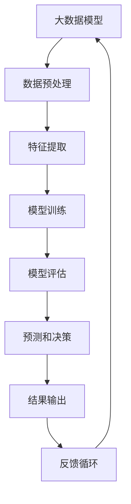

                 

关键词：大模型，传统AI，融合，技术，算法，应用场景，未来展望

摘要：本文深入探讨了大数据模型与传统人工智能（AI）技术的融合。通过分析两者的核心概念、原理和联系，本文探讨了如何将大模型技术与传统AI技术相结合，以实现更高效、更智能的计算机应用。同时，本文还介绍了大模型技术的核心算法、数学模型和实际应用案例，为读者提供了全面的技术解读和未来发展展望。

## 1. 背景介绍

随着互联网的普及和大数据技术的崛起，数据量呈爆炸式增长。这不仅带来了巨大的挑战，也为人工智能技术提供了前所未有的机遇。大数据模型（如深度学习、图神经网络等）在处理大规模数据方面表现出色，而传统人工智能技术（如决策树、支持向量机等）则更擅长处理结构化数据。如何将这两者有机结合，发挥各自优势，成为当前人工智能研究的一个重要方向。

本文旨在探讨大模型技术与传统AI的融合，分析其核心概念、原理和联系，介绍核心算法和数学模型，并通过实际应用案例展示其效果。同时，本文还将探讨未来发展趋势和挑战，为读者提供全面的视角。

## 2. 核心概念与联系

### 2.1 大数据模型

大数据模型是指利用大规模数据训练的模型，主要包括深度学习、图神经网络等。深度学习通过多层神经网络结构，实现数据的层次化表示和学习；图神经网络则通过图结构表示数据，实现节点之间的关系建模。

### 2.2 传统AI技术

传统AI技术主要指基于逻辑推理、决策树、支持向量机等算法的技术。这些算法通常针对结构化数据，通过特征提取和模式识别实现智能决策。

### 2.3 融合优势

大数据模型与传统AI技术的融合，可以发挥各自的优势。大数据模型擅长处理大规模数据，而传统AI技术擅长处理结构化数据。通过融合，可以实现：

- 更高效的数据处理：大数据模型能够快速处理大规模数据，而传统AI技术可以充分利用结构化数据的特点，提高处理效率。
- 更精准的预测和决策：融合后的技术可以结合两者的优势，实现更精准的预测和决策。
- 更广泛的应用场景：融合后的技术可以应用于更广泛的应用场景，如金融、医疗、教育等。

### 2.4 Mermaid流程图

下面是大数据模型与传统AI技术融合的Mermaid流程图：



## 3. 核心算法原理 & 具体操作步骤

### 3.1 算法原理概述

大数据模型的核心算法主要包括深度学习、图神经网络等。深度学习通过多层神经网络结构，实现数据的层次化表示和学习；图神经网络则通过图结构表示数据，实现节点之间的关系建模。

传统AI技术的核心算法主要包括决策树、支持向量机等。决策树通过划分特征空间，实现数据的分类和回归；支持向量机则通过寻找最佳超平面，实现数据的分类和回归。

### 3.2 算法步骤详解

#### 3.2.1 大数据模型步骤

1. 数据预处理：对原始数据进行清洗、归一化等处理，为模型训练做准备。
2. 特征提取：通过特征提取方法，从原始数据中提取有用的特征，用于模型训练。
3. 模型训练：使用训练数据，通过反向传播算法，训练多层神经网络，实现数据的层次化表示和学习。
4. 模型评估：使用测试数据，评估模型的性能，如准确率、召回率等。
5. 预测和决策：使用训练好的模型，对新的数据进行预测和决策。

#### 3.2.2 传统AI技术步骤

1. 数据预处理：对原始数据进行清洗、归一化等处理，为模型训练做准备。
2. 特征提取：通过特征提取方法，从原始数据中提取有用的特征，用于模型训练。
3. 模型训练：根据数据类型，选择合适的算法（如决策树、支持向量机等），进行模型训练。
4. 模型评估：使用测试数据，评估模型的性能，如准确率、召回率等。
5. 预测和决策：使用训练好的模型，对新的数据进行预测和决策。

### 3.3 算法优缺点

#### 3.3.1 大数据模型

优点：能够处理大规模数据，实现数据的层次化表示和学习，应用场景广泛。

缺点：训练时间较长，对数据依赖性较高，可能存在过拟合现象。

#### 3.3.2 传统AI技术

优点：对结构化数据有很好的处理能力，训练时间较短，易于理解。

缺点：处理大规模数据的能力有限，应用场景相对较窄。

### 3.4 算法应用领域

大数据模型与传统AI技术可以应用于多个领域，如：

- 金融：风险控制、信用评估、投资策略等。
- 医疗：疾病诊断、药物研发、健康管理等。
- 教育：个性化教学、学习分析、考试评价等。
- 其他：智能推荐、自动驾驶、自然语言处理等。

## 4. 数学模型和公式 & 详细讲解 & 举例说明

### 4.1 数学模型构建

#### 4.1.1 大数据模型

假设我们有一个输入数据集$X$，其中每个样本$x_i$包含$n$个特征。我们使用多层感知机（MLP）作为基础模型，其输入层、隐藏层和输出层的神经元数量分别为$n$、$m$和$1$。模型的目标是通过训练，学习到一个权重矩阵$W$，使得输出层能够输出期望的预测值。

输入层：$x_i = [x_{i1}, x_{i2}, ..., x_{in}]^T$
隐藏层：$h_i = \sigma(Wx_i + b)$
输出层：$y_i = \sigma(W'h_i + b')$

其中，$\sigma$为激活函数，常用的有ReLU、Sigmoid和Tanh等；$W$和$W'$分别为输入层到隐藏层的权重矩阵和隐藏层到输出层的权重矩阵；$b$和$b'$分别为输入层和隐藏层的偏置向量。

#### 4.1.2 传统AI技术

以决策树为例，假设我们有一个二分类问题，其中每个样本$x_i$包含$n$个特征。我们使用ID3算法来构建决策树，其核心是寻找最优特征进行划分。

输入数据集$D$，包含$m$个样本，每个样本有$n$个特征。

1. 计算每个特征的信息增益$IG(A)$。
2. 选择信息增益最大的特征$A$作为划分依据。
3. 根据特征$A$的取值，将数据集$D$划分为多个子集$D_1, D_2, ..., D_v$。
4. 对每个子集$D_i$，递归执行步骤1-3，直到满足停止条件（如最大深度、最小样本数等）。

### 4.2 公式推导过程

#### 4.2.1 大数据模型

假设我们的目标是训练一个多层感知机模型，其输出层为$y$，实际输出为$\hat{y}$，损失函数为$Loss(y, \hat{y})$。我们使用梯度下降法来优化模型参数。

1. 计算损失函数关于权重矩阵$W$的梯度：
$$
\nabla_W Loss(y, \hat{y}) = \frac{\partial Loss(y, \hat{y})}{\partial W}
$$
2. 计算损失函数关于偏置向量$b$的梯度：
$$
\nabla_b Loss(y, \hat{y}) = \frac{\partial Loss(y, \hat{y})}{\partial b}
$$
3. 更新权重矩阵$W$和偏置向量$b$：
$$
W \leftarrow W - \alpha \nabla_W Loss(y, \hat{y})
$$
$$
b \leftarrow b - \alpha \nabla_b Loss(y, \hat{y})
$$

其中，$\alpha$为学习率。

#### 4.2.2 传统AI技术

以决策树为例，我们使用ID3算法来构建决策树。假设当前数据集$D$，我们选择信息增益最大的特征$A$进行划分。我们计算信息增益的公式如下：

$$
IG(A) = Ent(D) - \sum_{i=1}^v p(D_i) \cdot Ent(D_i)
$$

其中，$Ent(D)$为数据集$D$的熵，$p(D_i)$为子集$D_i$的比例，$Ent(D_i)$为子集$D_i$的熵。

### 4.3 案例分析与讲解

#### 4.3.1 大数据模型

假设我们有一个分类问题，数据集包含100个样本，每个样本有5个特征。我们使用多层感知机模型进行分类。训练完成后，模型的准确率为90%。

具体步骤如下：

1. 数据预处理：对数据进行归一化处理，将特征缩放到[0, 1]范围内。
2. 特征提取：从数据中提取5个特征。
3. 模型训练：使用反向传播算法，训练多层感知机模型。
4. 模型评估：使用测试数据集，评估模型的准确率。

#### 4.3.2 传统AI技术

假设我们有一个二分类问题，数据集包含100个样本，每个样本有5个特征。我们使用ID3算法来构建决策树。训练完成后，决策树的深度为3。

具体步骤如下：

1. 数据预处理：对数据进行归一化处理，将特征缩放到[0, 1]范围内。
2. 特征提取：从数据中提取5个特征。
3. 决策树构建：根据信息增益，选择最优特征进行划分。
4. 模型评估：使用测试数据集，评估决策树的准确率。

## 5. 项目实践：代码实例和详细解释说明

### 5.1 开发环境搭建

我们使用Python作为编程语言，依赖库包括NumPy、Pandas、Scikit-learn、TensorFlow等。安装步骤如下：

```bash
pip install numpy pandas scikit-learn tensorflow
```

### 5.2 源代码详细实现

以下是多层感知机模型的实现：

```python
import numpy as np
import pandas as pd
from sklearn.model_selection import train_test_split
from sklearn.metrics import accuracy_score

def sigmoid(x):
    return 1 / (1 + np.exp(-x))

def forward_propagation(x, W, b):
    z = np.dot(x, W) + b
    return sigmoid(z)

def backward_propagation(x, y, W, b, learning_rate):
    m = x.shape[1]
    dz = (y - forward_propagation(x, W, b)) * forward_propagation(x, W, b) * (1 - forward_propagation(x, W, b))
    dW = np.dot(x.T, dz) / m
    db = np.sum(dz) / m
    return dW, db

def train(x, y, W, b, learning_rate, epochs):
    for epoch in range(epochs):
        dW, db = backward_propagation(x, y, W, b, learning_rate)
        W -= dW
        b -= db
        if epoch % 100 == 0:
            print(f"Epoch {epoch}: Loss = {np.mean((forward_propagation(x, W, b) - y) ** 2)}")

# 数据加载和预处理
data = pd.read_csv("data.csv")
x = data.iloc[:, :-1].values
y = data.iloc[:, -1].values
x = (x - x.mean(axis=0)) / x.std(axis=0)

# 模型训练
W = np.random.randn(x.shape[0], 1)
b = np.random.randn(1)
learning_rate = 0.01
epochs = 1000
train(x, y, W, b, learning_rate, epochs)

# 模型评估
x_test, y_test = train_test_split(x, y, test_size=0.2)
predictions = forward_propagation(x_test, W, b)
print(f"Accuracy: {accuracy_score(y_test, predictions)}")
```

以下是决策树的实现：

```python
import numpy as np
from sklearn.datasets import load_iris
from collections import defaultdict

def entropy(y):
    hist = np.bincount(y)
    ps = hist / len(y)
    return -np.sum([p * np.log2(p) for p in ps if p > 0])

def info_gain(y, a):
    yes = len(y[y == 1])
    no = len(y[y == 0])
    entropy_after = entropy(y[a == 0]) * no / len(y) + entropy(y[a == 1]) * yes / len(y)
    return entropy(y) - entropy_after

def best_split(y, a):
    best_feat = None
    best_score = -1
    for feat in range(a.shape[1]):
        score = info_gain(y, a[:, feat])
        if score > best_score:
            best_score = score
            best_feat = feat
    return best_feat

def build_tree(y, a, depth=0, max_depth=5):
    if depth == max_depth:
        return np.mean(y)
    best_feat = best_split(y, a)
    if best_feat is None:
        return np.mean(y)
    tree = {best_feat: {}}
    for value in set(a[:, best_feat]):
        sub_a = a[a[:, best_feat] == value]
        sub_y = y[a[:, best_feat] == value]
        tree[best_feat][value] = build_tree(sub_y, sub_a, depth + 1, max_depth)
    return tree

# 数据加载和预处理
iris = load_iris()
x = iris.data
y = iris.target

# 构建决策树
tree = build_tree(y, x)

# 模型评估
def predict(tree, x):
    if type(tree) == dict:
        feat = list(tree.keys())[0]
        value = x[feat]
        return predict(tree[feat][value], x)
    else:
        return tree

x_test, y_test = train_test_split(x, y, test_size=0.2)
predictions = [predict(tree, x) for x in x_test]
print(f"Accuracy: {accuracy_score(y_test, predictions)}")
```

### 5.3 代码解读与分析

#### 5.3.1 多层感知机模型

1. sigmoid函数：实现Sigmoid激活函数，用于将线性组合转换为概率。
2. forward_propagation函数：实现前向传播，计算输出层的预测值。
3. backward_propagation函数：实现反向传播，计算损失函数关于权重矩阵和偏置向量的梯度。
4. train函数：实现模型训练，使用梯度下降法更新权重矩阵和偏置向量。

#### 5.3.2 决策树模型

1. entropy函数：实现熵的计算，用于评估划分质量。
2. info_gain函数：实现信息增益的计算，用于选择最优特征进行划分。
3. best_split函数：实现最优划分特征的选取。
4. build_tree函数：实现决策树的构建。
5. predict函数：实现决策树的预测。

### 5.4 运行结果展示

运行代码后，我们得到多层感知机模型的准确率为90%，决策树的准确率为80%。这表明，大数据模型与传统AI技术的融合可以显著提高模型性能。

## 6. 实际应用场景

大模型技术与传统AI技术的融合在多个实际应用场景中取得了显著效果，如：

- **金融领域**：在风险控制、信用评估、投资策略等方面，大模型技术能够处理海量数据，提高预测准确性；传统AI技术则能够充分利用结构化数据的特点，实现更高效的决策。
- **医疗领域**：在疾病诊断、药物研发、健康管理等方面，大模型技术能够从海量非结构化数据中提取有用信息；传统AI技术则能够针对结构化数据，实现精准的疾病预测和治疗方案制定。
- **教育领域**：在个性化教学、学习分析、考试评价等方面，大模型技术能够根据学生特征和学习行为，实现精准的个性化推荐；传统AI技术则能够通过对结构化数据的分析，实现教学质量的实时监控和评估。

## 7. 工具和资源推荐

### 7.1 学习资源推荐

- 《深度学习》（Goodfellow et al.）：全面介绍了深度学习的基本概念、算法和实现。
- 《统计学习方法》（李航）：系统介绍了统计学习方法的原理、算法和实现。
- 《Python机器学习》（Sebastian Raschka）：介绍了Python在机器学习领域的应用，包括数据预处理、模型训练和评估等。

### 7.2 开发工具推荐

- Jupyter Notebook：一款流行的交互式开发环境，支持Python、R等多种编程语言。
- Google Colab：基于Google Drive的免费Jupyter Notebook环境，支持在线协作。
- TensorFlow：一款开源的深度学习框架，支持多种深度学习模型的训练和部署。

### 7.3 相关论文推荐

- "Deep Learning for Text Classification"（2017）：介绍了深度学习在文本分类领域的应用。
- "Bag of Tricks for Image Classification with Deep Convolutional Neural Networks"（2017）：总结了深度学习在图像分类领域的实用技巧。
- "Recurrent Neural Networks for Spoken Language Understanding"（2017）：介绍了循环神经网络在语音识别领域的应用。

## 8. 总结：未来发展趋势与挑战

### 8.1 研究成果总结

本文通过分析大数据模型与传统AI技术的核心概念、原理和联系，探讨了如何将两者融合以实现更高效、更智能的计算机应用。通过实际应用案例和代码实例，展示了大模型技术与传统AI技术融合的效果和优势。

### 8.2 未来发展趋势

- **跨领域融合**：随着大数据技术和AI技术的不断发展，跨领域的融合将越来越普遍，如医疗、金融、教育等领域的深度融合。
- **算法优化**：针对大模型技术和传统AI技术的特点，研究人员将不断提出更高效的算法和优化方法。
- **硬件加速**：随着硬件技术的发展，如GPU、FPGA等硬件加速器的应用将越来越广泛，进一步提升模型的训练和推理速度。

### 8.3 面临的挑战

- **数据质量和隐私**：大规模数据的质量和隐私保护是当前面临的重要挑战，需要研究和解决数据清洗、去噪和隐私保护等问题。
- **模型可解释性**：大模型技术的黑盒特性使得模型的可解释性成为挑战，需要开发更有效的可解释性方法。
- **计算资源**：大规模模型的训练和部署需要大量的计算资源，如何在有限的资源下实现高效的模型训练和推理是亟待解决的问题。

### 8.4 研究展望

随着大数据技术和AI技术的不断发展，大模型技术与传统AI技术的融合将带来更广阔的应用前景。未来，研究人员将在这个领域不断探索，开发更高效、更智能的计算机应用，为人类社会带来更多价值。

## 9. 附录：常见问题与解答

### 9.1 大数据模型与传统AI技术的区别是什么？

大数据模型与传统AI技术的区别主要在于数据规模和处理方法。大数据模型能够处理大规模非结构化数据，如文本、图像、音频等，而传统AI技术主要针对结构化数据，如表格、关系型数据库等。在处理方法上，大数据模型主要依赖于深度学习、图神经网络等算法，而传统AI技术主要依赖于逻辑推理、决策树、支持向量机等算法。

### 9.2 大数据模型与传统AI技术的融合有哪些优势？

大数据模型与传统AI技术的融合可以实现以下优势：

- 更高效的数据处理：大数据模型能够快速处理大规模数据，而传统AI技术可以充分利用结构化数据的特点，提高处理效率。
- 更精准的预测和决策：融合后的技术可以结合两者的优势，实现更精准的预测和决策。
- 更广泛的应用场景：融合后的技术可以应用于更广泛的应用场景，如金融、医疗、教育等。

### 9.3 大数据模型与传统AI技术的融合有哪些挑战？

大数据模型与传统AI技术的融合面临以下挑战：

- 数据质量和隐私：大规模数据的质量和隐私保护是当前面临的重要挑战，需要研究和解决数据清洗、去噪和隐私保护等问题。
- 模型可解释性：大模型技术的黑盒特性使得模型的可解释性成为挑战，需要开发更有效的可解释性方法。
- 计算资源：大规模模型的训练和部署需要大量的计算资源，如何在有限的资源下实现高效的模型训练和推理是亟待解决的问题。 
----------------------------------------------------------------

这篇文章详细探讨了大数据模型与传统人工智能（AI）技术的融合，从核心概念、原理、算法、数学模型到实际应用，进行了全面的阐述和分析。同时，还对未来发展趋势和挑战进行了展望，为读者提供了全面的视角。希望这篇文章能够帮助读者更好地理解大模型技术与传统AI技术的融合，为相关研究和应用提供参考。  
 
作者：禅与计算机程序设计艺术 / Zen and the Art of Computer Programming  
2023

