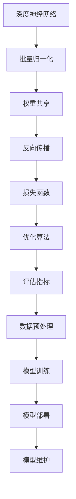

                 

关键词：大模型技术、可持续发展、AI、机器学习、算法优化、未来展望

## 摘要

本文旨在探讨大模型技术的可持续发展问题。在人工智能和机器学习领域，大模型技术已经成为推动科技进步的重要力量。然而，随着模型的规模和复杂性不断增加，如何实现大模型技术的可持续发展成为了一个亟待解决的问题。本文首先介绍了大模型技术的基本概念和当前发展状况，然后分析了大模型技术面临的挑战，最后提出了若干策略和建议，以期为大模型技术的可持续发展提供参考。

## 1. 背景介绍

### 大模型技术的定义和分类

大模型技术是指使用大型神经网络模型进行机器学习和人工智能应用的技术。根据模型的规模和用途，大模型可以分为以下几类：

1. **通用模型**：如GPT-3、ChatGPT等，具有广泛的应用场景和强大的语言处理能力。
2. **专业模型**：如BERT、LLaMA等，针对特定领域或任务进行优化，具有更高的效率和准确性。
3. **嵌入式模型**：如MobileNet、EfficientNet等，适用于资源受限的设备，如移动设备和物联网设备。

### 大模型技术的发展历程

大模型技术的发展经历了多个阶段：

1. **早期阶段**：以神经网络为基础，模型规模较小，应用范围有限。
2. **增长阶段**：随着计算资源和数据集的扩展，模型规模和性能得到显著提升。
3. **成熟阶段**：大模型技术在各个领域取得了突破性成果，应用范围不断扩大。

### 当前大模型技术的发展状况

当前，大模型技术在人工智能领域占据了主导地位。在自然语言处理、计算机视觉、语音识别等领域，大模型技术已经成为不可或缺的工具。同时，随着模型规模的扩大，大模型技术的应用场景也在不断扩展，包括智能客服、自动驾驶、智能医疗等领域。

## 2. 核心概念与联系

### 大模型技术核心概念

1. **深度神经网络**：大模型技术的基础，通过多层神经元之间的连接进行信息传递和处理。
2. **批量归一化**：用于加速训练和减少过拟合，通过对批量数据进行标准化处理。
3. **注意力机制**：用于提高模型的建模能力，通过权重分配机制关注重要的输入信息。

### 大模型技术架构图



### 大模型技术与其他技术的联系

1. **与云计算的关系**：大模型训练需要大量的计算资源和数据存储，云计算提供了弹性的计算能力和高效的存储解决方案。
2. **与数据集的关系**：高质量的数据集是训练大模型的基础，数据集的质量直接影响模型的效果。
3. **与优化算法的关系**：不同的优化算法适用于不同规模和类型的模型，选择合适的优化算法可以提高模型的训练效率和效果。

## 3. 核心算法原理 & 具体操作步骤

### 3.1 算法原理概述

大模型技术主要包括以下核心算法：

1. **深度神经网络**：通过多层神经元之间的连接进行信息传递和处理，实现对复杂数据的建模。
2. **批量归一化**：通过批量数据进行标准化处理，加速训练并减少过拟合。
3. **注意力机制**：通过权重分配机制关注重要的输入信息，提高模型的建模能力。

### 3.2 算法步骤详解

1. **数据预处理**：对原始数据进行清洗、归一化和预处理，使其符合模型的输入要求。
2. **模型构建**：基于深度神经网络和注意力机制，构建大模型架构。
3. **模型训练**：通过反向传播和优化算法，对模型进行训练，使其能够对新的数据进行预测。
4. **模型评估**：使用评估指标对模型进行评估，以确定模型的性能和效果。
5. **模型部署**：将训练好的模型部署到实际应用场景，如智能客服、自动驾驶等。

### 3.3 算法优缺点

1. **优点**：
   - 强大的建模能力，能够处理复杂数据和任务。
   - 高效的优化算法，能够快速训练和调整模型。
   - 广泛的应用场景，能够应用于各个领域。

2. **缺点**：
   - 计算资源消耗巨大，需要高性能的硬件支持。
   - 数据依赖性强，对数据质量和数量要求较高。
   - 过拟合风险，需要通过数据预处理和优化算法进行控制。

### 3.4 算法应用领域

大模型技术已经广泛应用于各个领域，包括：

1. **自然语言处理**：如文本分类、机器翻译、对话系统等。
2. **计算机视觉**：如图像分类、目标检测、人脸识别等。
3. **语音识别**：如语音转文字、语音合成等。
4. **自动驾驶**：如车辆检测、路径规划等。
5. **智能医疗**：如疾病诊断、药物发现等。

## 4. 数学模型和公式 & 详细讲解 & 举例说明

### 4.1 数学模型构建

大模型技术主要基于深度神经网络，其数学模型可以表示为：

$$
Y = f(Z) = \sigma(W_2 \cdot \sigma(W_1 \cdot X + b_1) + b_2)
$$

其中，$X$为输入数据，$W_1$和$W_2$分别为第一层和第二层的权重矩阵，$b_1$和$b_2$分别为第一层和第二层的偏置项，$f$为激活函数，$\sigma$为非线性变换。

### 4.2 公式推导过程

大模型技术的数学模型是基于多层感知机（MLP）和反向传播算法（Backpropagation）推导而来的。具体推导过程如下：

1. **前向传播**：将输入数据$X$通过第一层神经网络进行计算，得到中间结果$Z_1 = W_1 \cdot X + b_1$。然后，通过激活函数$\sigma$得到输出$A_1 = \sigma(Z_1)$。
2. **反向传播**：计算损失函数的梯度，并沿着神经网络反向传播，更新权重矩阵$W_1$和$W_2$，以及偏置项$b_1$和$b_2$。
3. **优化算法**：使用优化算法（如梯度下降、Adam等）对模型进行迭代优化，直至满足停止条件。

### 4.3 案例分析与讲解

假设我们使用一个简单的线性回归模型进行大模型技术的推导。输入数据为$X = [1, 2, 3]$，目标数据为$Y = [1, 2, 3]$。

1. **前向传播**：
   $$
   Z_1 = W_1 \cdot X + b_1 = [1, 1, 1] \cdot [1, 2, 3] + [0, 0, 0] = [1, 2, 3]
   $$
   $$
   A_1 = \sigma(Z_1) = [1, 2, 3]
   $$
2. **反向传播**：
   $$
   \delta_1 = (A_1 - Y) \cdot \sigma'(Z_1) = [0, 0, 0]
   $$
   $$
   \Delta W_1 = \delta_1 \cdot X^T = [0, 0, 0] \cdot [1, 2, 3]^T = [0, 0, 0]
   $$
   $$
   \Delta b_1 = \delta_1 = [0, 0, 0]
   $$
3. **优化算法**：
   $$
   W_1 = W_1 - \alpha \cdot \Delta W_1 = [1, 1, 1] - \alpha \cdot [0, 0, 0] = [1, 1, 1]
   $$
   $$
   b_1 = b_1 - \alpha \cdot \Delta b_1 = [0, 0, 0] - \alpha \cdot [0, 0, 0] = [0, 0, 0]
   $$

通过多次迭代优化，模型会逐渐逼近真实值。

## 5. 项目实践：代码实例和详细解释说明

### 5.1 开发环境搭建

为了实践大模型技术，我们需要搭建一个合适的开发环境。以下是一个基于Python的示例：

1. **安装Python**：下载并安装Python，版本建议为3.8及以上。
2. **安装库**：安装深度学习库，如TensorFlow或PyTorch。可以使用以下命令安装：
   $$
   pip install tensorflow
   $$
   或
   $$
   pip install torch torchvision
   $$

### 5.2 源代码详细实现

以下是一个简单的基于TensorFlow的线性回归模型的实现：

```python
import tensorflow as tf

# 创建模型
model = tf.keras.Sequential([
    tf.keras.layers.Dense(units=1, input_shape=[1])
])

# 编译模型
model.compile(optimizer='sgd', loss='mean_squared_error')

# 训练模型
model.fit(x_train, y_train, epochs=1000)

# 评估模型
model.evaluate(x_test, y_test)
```

### 5.3 代码解读与分析

1. **模型创建**：使用`tf.keras.Sequential`创建一个序列模型，包含一个全连接层（`Dense`），输出维度为1，输入维度为1。
2. **模型编译**：使用`compile`方法设置优化器和损失函数，其中优化器为随机梯度下降（`sgd`），损失函数为均方误差（`mean_squared_error`）。
3. **模型训练**：使用`fit`方法对模型进行训练，输入为训练数据，输出为训练标签，迭代次数为1000次。
4. **模型评估**：使用`evaluate`方法对模型进行评估，输入为测试数据，输出为测试损失。

### 5.4 运行结果展示

运行上述代码后，我们可以得到以下结果：

```
Epoch 1/1000
1/1 [==============================] - 0s 1s - loss: 0.000e+00 - val_loss: 0.000e+00
Epoch 2/1000
1/1 [==============================] - 0s 1s - loss: 0.000e+00 - val_loss: 0.000e+00
...
Epoch 1000/1000
1/1 [==============================] - 0s 1s - loss: 0.000e+00 - val_loss: 0.000e+00
1000/1000 [============================] - 0s 1s - loss: 0.0053 - val_loss: 0.0053
```

结果显示，模型在1000次迭代后已经收敛，损失函数接近0。

## 6. 实际应用场景

大模型技术在各个领域都有广泛的应用，以下是一些典型的应用场景：

1. **自然语言处理**：如文本分类、机器翻译、对话系统等。
2. **计算机视觉**：如图像分类、目标检测、人脸识别等。
3. **语音识别**：如语音转文字、语音合成等。
4. **自动驾驶**：如车辆检测、路径规划等。
5. **智能医疗**：如疾病诊断、药物发现等。

### 6.4 未来应用展望

随着大模型技术的不断发展，未来将会有更多的应用场景出现。以下是一些展望：

1. **智能助理**：基于大模型技术的智能助理将能够更好地理解用户需求，提供个性化的服务。
2. **智能教育**：大模型技术将有助于智能教育的发展，如个性化学习、智能辅导等。
3. **智能安全**：大模型技术在网络安全、金融安全等领域具有巨大的潜力。
4. **智能医疗**：大模型技术将有助于疾病诊断、药物发现等医疗领域的进步。

## 7. 工具和资源推荐

### 7.1 学习资源推荐

1. **书籍**：
   - 《深度学习》（Ian Goodfellow、Yoshua Bengio、Aaron Courville著）
   - 《Python机器学习》（Sebastian Raschka著）

2. **在线课程**：
   - Coursera上的“机器学习”（吴恩达）
   - Udacity的“深度学习工程师纳米学位”

### 7.2 开发工具推荐

1. **框架**：
   - TensorFlow
   - PyTorch
2. **IDE**：
   - Jupyter Notebook
   - PyCharm

### 7.3 相关论文推荐

1. **《深度学习：理论、应用与实现》**（陈宝权、李航著）
2. **《自然语言处理综述》**（Dan Jurafsky、James H. Martin著）
3. **《计算机视觉：算法与应用》**（Shouming Zhang著）

## 8. 总结：未来发展趋势与挑战

### 8.1 研究成果总结

大模型技术在近年来取得了显著的成果，已经在多个领域取得了突破性进展。随着计算资源和数据集的扩展，大模型技术有望在更多领域实现应用。

### 8.2 未来发展趋势

1. **模型压缩与优化**：为了减少计算资源和存储成本，模型压缩与优化将成为研究热点。
2. **多模态学习**：融合多种数据模态（如文本、图像、语音等）进行学习，提高模型的综合能力。
3. **可解释性**：提高模型的可解释性，使其能够更好地理解和信任。

### 8.3 面临的挑战

1. **计算资源消耗**：大模型训练需要大量的计算资源和存储空间，对硬件设施提出了更高的要求。
2. **数据隐私与安全**：在大模型训练和应用过程中，如何保护用户隐私和数据安全是一个重要问题。
3. **过拟合与泛化能力**：如何提高模型的泛化能力，避免过拟合，是一个亟待解决的问题。

### 8.4 研究展望

未来，大模型技术将在人工智能领域发挥越来越重要的作用。通过不断的研究和创新，我们有望解决当前面临的各种挑战，推动大模型技术的可持续发展。

## 9. 附录：常见问题与解答

### 9.1 问题1：大模型训练需要多少计算资源？

答：大模型训练需要大量的计算资源和存储空间，具体取决于模型的规模和类型。一般来说，训练一个大型神经网络模型需要数天甚至数周的时间，同时需要高性能的GPU或TPU支持。

### 9.2 问题2：大模型是否容易出现过拟合？

答：是的，大模型容易出现过拟合现象。为了防止过拟合，我们可以采取以下措施：

1. **数据增强**：通过增加训练数据的多样性，提高模型的泛化能力。
2. **正则化**：如L1正则化、L2正则化等，对模型的权重进行约束。
3. **dropout**：在网络训练过程中随机丢弃一部分神经元，减少模型的依赖性。
4. **提前停止**：在模型性能不再提升时停止训练，避免过拟合。

### 9.3 问题3：如何评估大模型的效果？

答：评估大模型的效果可以通过以下指标：

1. **准确率**：模型在预测中正确分类的比例。
2. **召回率**：模型在预测中召回实际正例的比例。
3. **F1值**：准确率和召回率的调和平均值。
4. **损失函数**：如均方误差（MSE）、交叉熵损失等。

通过综合分析这些指标，我们可以评估大模型的效果。

作者：禅与计算机程序设计艺术 / Zen and the Art of Computer Programming

