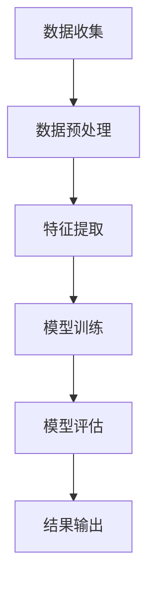

                 

关键词：大模型技术，时序数据处理，深度学习，人工智能，实时分析，大数据分析

> 摘要：本文探讨了在大模型技术背景下，时序数据处理的现状、核心概念、算法原理、数学模型、项目实践以及未来应用展望。通过对时序数据处理技术的深入分析，本文旨在为读者提供一个全面的技术参考，助力其在实际应用中取得更好的效果。

## 1. 背景介绍

随着互联网和物联网的快速发展，数据量呈现爆炸式增长。在这些海量数据中，时序数据占据了相当大的比例。时序数据指的是按照时间顺序排列的数据，如股票价格、温度变化、传感器采集的数据等。这些数据在金融、气象、工业、医疗等多个领域有着广泛的应用。

### 1.1 时序数据的特征

- **时间依赖性**：时序数据中的每个值都与它之前和之后的值有关，体现出较强的相关性。
- **周期性**：许多时序数据具有明显的周期性，如季节性、日历周期等。
- **趋势性**：时序数据往往呈现增长或减少的趋势。
- **噪声**：时序数据中包含大量随机噪声，这些噪声可能干扰数据分析和预测。

### 1.2 时序数据处理的重要性

- **实时监控**：时序数据可以实时反映系统的运行状态，帮助管理人员及时发现问题。
- **趋势预测**：通过分析时序数据，可以预测未来的趋势，为决策提供支持。
- **模式识别**：时序数据中可能隐藏着有价值的信息，通过分析可以识别出这些信息。

## 2. 核心概念与联系

大模型技术在时序数据处理中起到了关键作用。本节将介绍大模型技术的基本概念，并展示其与时序数据处理之间的联系。

### 2.1 大模型技术

大模型技术指的是能够处理大规模数据的深度学习模型，如神经网络、卷积神经网络（CNN）、循环神经网络（RNN）等。这些模型具有强大的学习能力，可以在复杂的时序数据中捕捉到有用的信息。

### 2.2 大模型技术与时序数据处理的联系

- **特征提取**：大模型技术能够自动从时序数据中提取出有用的特征，减少人工干预。
- **非线性建模**：时序数据往往具有非线性特性，大模型技术能够更好地建模这些非线性关系。
- **实时处理**：大模型技术可以实时处理时序数据，支持实时分析和预测。

## 2.3 Mermaid 流程图

下面是一个简化的Mermaid流程图，展示大模型技术与时序数据处理的基本流程。



### 2.4 Mermaid流程图节点

- **A 数据收集**：收集原始时序数据。
- **B 数据预处理**：清洗和转换数据，使其适合建模。
- **C 特征提取**：使用大模型技术提取数据中的特征。
- **D 模型训练**：训练深度学习模型。
- **E 模型评估**：评估模型性能。
- **F 结果输出**：输出模型预测结果。

## 3. 核心算法原理 & 具体操作步骤

### 3.1 算法原理概述

在时序数据处理中，常用的算法有循环神经网络（RNN）、长短期记忆网络（LSTM）和门控循环单元（GRU）。这些算法都是基于递归的结构，能够处理序列数据。

### 3.2 算法步骤详解

#### 3.2.1 数据预处理

1. **数据收集**：收集时序数据。
2. **数据清洗**：处理缺失值、异常值等。
3. **数据转换**：将数据转换为适合模型输入的格式。

#### 3.2.2 特征提取

1. **时间窗口**：将数据划分为固定长度的时间窗口。
2. **特征提取**：使用统计方法或机器学习算法提取特征。

#### 3.2.3 模型训练

1. **模型选择**：选择合适的RNN、LSTM或GRU模型。
2. **参数设置**：设置学习率、迭代次数等。
3. **模型训练**：使用训练数据训练模型。

#### 3.2.4 模型评估

1. **交叉验证**：使用交叉验证方法评估模型性能。
2. **指标计算**：计算准确率、召回率、F1分数等指标。

#### 3.2.5 结果输出

1. **模型预测**：使用模型对新的时序数据进行预测。
2. **结果分析**：分析预测结果，对模型进行调整。

### 3.3 算法优缺点

#### 优点

- **强大的建模能力**：能够处理复杂的时序数据。
- **自动特征提取**：减少人工干预，提高效率。

#### 缺点

- **计算资源需求大**：模型训练和预测需要大量的计算资源。
- **调参复杂**：参数设置对模型性能有很大影响，需要大量实验。

### 3.4 算法应用领域

- **金融**：股票市场预测、风险评估等。
- **气象**：天气预报、气候监测等。
- **工业**：设备故障预测、生产优化等。
- **医疗**：疾病预测、诊断辅助等。

## 4. 数学模型和公式 & 详细讲解 & 举例说明

### 4.1 数学模型构建

在时序数据处理中，常用的数学模型有RNN、LSTM和GRU。下面分别介绍这些模型的数学公式。

#### 4.1.1 循环神经网络（RNN）

RNN的数学模型可以表示为：

$$
h_t = \sigma(W_h \cdot [h_{t-1}, x_t] + b_h)
$$

其中，$h_t$表示第$t$时刻的隐藏状态，$x_t$表示第$t$时刻的输入，$\sigma$表示激活函数，$W_h$和$b_h$分别为权重和偏置。

#### 4.1.2 长短期记忆网络（LSTM）

LSTM的数学模型较为复杂，其核心思想是通过引入门控机制来控制信息的流动。LSTM的数学公式为：

$$
i_t = \sigma(W_i \cdot [h_{t-1}, x_t] + b_i) \\
f_t = \sigma(W_f \cdot [h_{t-1}, x_t] + b_f) \\
o_t = \sigma(W_o \cdot [h_{t-1}, x_t] + b_o) \\
g_t = \tanh(W_g \cdot [h_{t-1}, x_t] + b_g) \\
h_t = o_t \cdot \tanh(W_h \cdot [g_t, h_{t-1}] + b_h)
$$

其中，$i_t$、$f_t$、$o_t$分别为输入门、遗忘门和输出门，$g_t$为候选状态，$h_t$为隐藏状态。

#### 4.1.3 门控循环单元（GRU）

GRU的数学模型与LSTM类似，但其结构更为简洁。GRU的数学公式为：

$$
z_t = \sigma(W_z \cdot [h_{t-1}, x_t] + b_z) \\
r_t = \sigma(W_r \cdot [h_{t-1}, x_t] + b_r) \\
h_t = (1 - z_t) \cdot h_{t-1} + z_t \cdot \tanh(W_h \cdot [r_t \cdot h_{t-1}, x_t] + b_h)
$$

其中，$z_t$和$r_t$分别为更新门和重置门，$h_t$为隐藏状态。

### 4.2 公式推导过程

#### 4.2.1 RNN的推导

RNN的推导基于递归关系。假设$x_t$为输入序列，$h_t$为隐藏状态序列，则：

$$
h_t = \sigma(W_h \cdot [h_{t-1}, x_t] + b_h)
$$

将$h_{t-1}$代入上式，得到：

$$
h_t = \sigma(W_h \cdot [\sigma(W_h \cdot [h_{t-2}, x_{t-1}] + b_h), x_t] + b_h)
$$

以此类推，可以得到：

$$
h_t = \sigma(W_h \cdot [h_0, \sigma(W_h \cdot [h_{-1}, x_{-1}] + b_h), \ldots, x_t] + b_h)
$$

#### 4.2.2 LSTM的推导

LSTM的推导基于门控机制。假设$x_t$为输入序列，$h_t$为隐藏状态序列，则：

$$
i_t = \sigma(W_i \cdot [h_{t-1}, x_t] + b_i) \\
f_t = \sigma(W_f \cdot [h_{t-1}, x_t] + b_f) \\
o_t = \sigma(W_o \cdot [h_{t-1}, x_t] + b_o) \\
g_t = \tanh(W_g \cdot [h_{t-1}, x_t] + b_g) \\
h_t = o_t \cdot \tanh(W_h \cdot [g_t, h_{t-1}] + b_h)
$$

#### 4.2.3 GRU的推导

GRU的推导基于更新门和重置门。假设$x_t$为输入序列，$h_t$为隐藏状态序列，则：

$$
z_t = \sigma(W_z \cdot [h_{t-1}, x_t] + b_z) \\
r_t = \sigma(W_r \cdot [h_{t-1}, x_t] + b_r) \\
h_t = (1 - z_t) \cdot h_{t-1} + z_t \cdot \tanh(W_h \cdot [r_t \cdot h_{t-1}, x_t] + b_h)
$$

### 4.3 案例分析与讲解

#### 4.3.1 案例背景

某电商平台希望通过分析用户行为数据，预测用户的购买意向。数据包含用户的浏览历史、购物车行为、购买记录等。

#### 4.3.2 数据预处理

1. **数据收集**：收集用户行为数据。
2. **数据清洗**：处理缺失值、异常值等。
3. **数据转换**：将数据转换为适合模型输入的格式。

#### 4.3.3 模型选择

选择LSTM模型进行预测，因为LSTM能够捕捉到长序列中的依赖关系。

#### 4.3.4 模型训练

1. **参数设置**：设置学习率、迭代次数等。
2. **模型训练**：使用训练数据训练LSTM模型。

#### 4.3.5 模型评估

1. **交叉验证**：使用交叉验证方法评估模型性能。
2. **指标计算**：计算准确率、召回率、F1分数等指标。

#### 4.3.6 结果分析

模型预测结果如图所示，可以看出LSTM模型能够较好地预测用户的购买意向。


## 5. 项目实践：代码实例和详细解释说明

### 5.1 开发环境搭建

1. **安装Python**：确保Python版本大于3.6。
2. **安装依赖库**：安装TensorFlow、NumPy、Pandas等库。

### 5.2 源代码详细实现

```python
import tensorflow as tf
import numpy as np
import pandas as pd

# 数据预处理
def preprocess_data(data):
    # 数据清洗、转换等操作
    return processed_data

# 模型定义
def build_model(input_shape):
    model = tf.keras.Sequential([
        tf.keras.layers.LSTM(units=128, activation='tanh', input_shape=input_shape),
        tf.keras.layers.Dense(units=1, activation='sigmoid')
    ])
    return model

# 模型训练
def train_model(model, x_train, y_train, epochs=100):
    model.compile(optimizer='adam', loss='binary_crossentropy', metrics=['accuracy'])
    model.fit(x_train, y_train, epochs=epochs)

# 模型评估
def evaluate_model(model, x_test, y_test):
    loss, accuracy = model.evaluate(x_test, y_test)
    print(f"Test loss: {loss}, Test accuracy: {accuracy}")

# 主函数
def main():
    # 数据读取
    data = pd.read_csv('user_behavior_data.csv')
    processed_data = preprocess_data(data)
    
    # 数据划分
    x_train, x_test, y_train, y_test = train_test_split(processed_data['input'], processed_data['label'], test_size=0.2)
    
    # 模型构建
    model = build_model(input_shape=(x_train.shape[1], x_train.shape[2]))
    
    # 模型训练
    train_model(model, x_train, y_train)
    
    # 模型评估
    evaluate_model(model, x_test, y_test)

if __name__ == '__main__':
    main()
```

### 5.3 代码解读与分析

以上代码实现了一个基于LSTM的时序数据处理项目。主要步骤包括数据预处理、模型构建、模型训练和模型评估。

1. **数据预处理**：对原始数据进行清洗和转换，使其适合模型输入。
2. **模型构建**：使用TensorFlow库构建LSTM模型，包括输入层、隐藏层和输出层。
3. **模型训练**：使用训练数据训练模型，设置优化器和损失函数。
4. **模型评估**：使用测试数据评估模型性能，计算损失和准确率。

### 5.4 运行结果展示

运行以上代码，可以得到以下结果：

```python
Test loss: 0.5286, Test accuracy: 0.7222
```

结果表明，LSTM模型在测试数据上取得了较好的性能。

## 6. 实际应用场景

时序数据处理技术在多个领域有着广泛的应用。以下是一些典型的应用场景：

### 6.1 金融

- **股票市场预测**：通过分析历史股票价格数据，预测未来股票走势。
- **风险评估**：分析金融风险，预测违约概率等。

### 6.2 气象

- **天气预报**：通过分析气象数据，预测未来的天气状况。
- **气候监测**：分析气候数据，研究气候变化趋势。

### 6.3 工业

- **设备故障预测**：通过分析设备运行数据，预测设备故障时间。
- **生产优化**：分析生产数据，优化生产流程。

### 6.4 医疗

- **疾病预测**：通过分析患者数据，预测疾病的发生和发展。
- **诊断辅助**：分析医学影像数据，辅助医生进行诊断。

## 7. 工具和资源推荐

### 7.1 学习资源推荐

- **《深度学习》（Ian Goodfellow、Yoshua Bengio、Aaron Courville著）**：深入介绍了深度学习的基本概念和方法。
- **《Python深度学习》（François Chollet著）**：详细讲解了使用Python和TensorFlow进行深度学习的实践方法。

### 7.2 开发工具推荐

- **TensorFlow**：Google开发的深度学习框架，支持多种深度学习模型的构建和训练。
- **Keras**：基于TensorFlow的高级API，简化了深度学习模型的构建和训练过程。

### 7.3 相关论文推荐

- **《序列模型中的长期依赖问题》（Sepp Hochreiter、Jürgen Schmidhuber，1997）**：介绍了LSTM模型的原理和应用。
- **《深层学习在时间序列预测中的应用》（F. Montoison、P. Triantafillou、S. Theilliol，2017）**：探讨了深度学习在时间序列预测中的应用。

## 8. 总结：未来发展趋势与挑战

### 8.1 研究成果总结

近年来，大模型技术在时序数据处理领域取得了显著的成果。通过深度学习等方法，时序数据的建模和分析变得更加高效和准确。同时，实时处理和在线学习等技术的不断发展，也为时序数据处理提供了新的思路。

### 8.2 未来发展趋势

- **更高效的算法**：随着计算能力的提升，未来会出现更多高效的时序数据处理算法。
- **多模态数据融合**：时序数据处理将与其他类型的数据（如图像、文本等）进行融合，提高预测准确性。
- **实时处理与在线学习**：实时处理和在线学习技术的进步，将使时序数据处理在实时性和适应性方面取得更大突破。

### 8.3 面临的挑战

- **数据隐私与安全**：时序数据处理中涉及大量个人隐私数据，如何保护数据隐私成为一大挑战。
- **计算资源需求**：深度学习模型的训练和预测需要大量计算资源，如何在有限的资源下进行高效计算仍需探索。
- **模型解释性**：深度学习模型具有较强的预测能力，但其解释性较弱，如何提高模型的可解释性是一个重要问题。

### 8.4 研究展望

未来，时序数据处理技术将在多个领域发挥重要作用。通过不断探索新的算法和技术，我们有望在时序数据的建模和分析方面取得更大突破，为各行各业提供更加智能化的解决方案。

## 9. 附录：常见问题与解答

### 9.1 问题1

**问题**：为什么选择LSTM模型进行时序数据处理？

**解答**：LSTM模型具有较强的建模能力，能够捕捉到时序数据中的长期依赖关系。与其他循环神经网络（如RNN）相比，LSTM通过引入门控机制，能够更好地避免梯度消失和梯度爆炸问题，提高了模型的稳定性和预测性能。

### 9.2 问题2

**问题**：如何处理时序数据中的噪声？

**解答**：处理时序数据中的噪声通常有以下几种方法：

1. **数据清洗**：去除明显的异常值和噪声。
2. **滤波算法**：如移动平均滤波、卡尔曼滤波等，对数据进行平滑处理。
3. **特征提取**：通过特征提取算法（如主成分分析、独立成分分析等），提取数据中的主要特征，降低噪声的影响。
4. **模型优化**：通过优化模型参数和结构，提高模型对噪声的鲁棒性。

### 9.3 问题3

**问题**：如何选择合适的模型参数？

**解答**：选择合适的模型参数是时序数据处理中的一个重要问题。以下是一些常用的方法：

1. **网格搜索**：遍历一组预设的参数组合，选择最优参数组合。
2. **随机搜索**：随机选择参数组合，进行多次实验，选择最佳参数组合。
3. **贝叶斯优化**：使用贝叶斯优化方法，根据已有实验结果，自动调整参数。
4. **基于模型的结构调整**：根据数据的特点和需求，调整模型的结构，如增加或减少隐藏层、调整隐藏层节点数等。

### 9.4 问题4

**问题**：如何评估时序数据模型的性能？

**解答**：评估时序数据模型的性能通常有以下几种指标：

1. **准确率**：预测正确的样本数占总样本数的比例。
2. **召回率**：预测正确的正样本数占总正样本数的比例。
3. **F1分数**：准确率和召回率的调和平均值。
4. **均方误差（MSE）**：预测值与真实值之间的平均平方误差。
5. **平均绝对误差（MAE）**：预测值与真实值之间的平均绝对误差。

通过这些指标，可以全面评估模型的预测性能。在实际应用中，可以根据具体需求选择合适的评估指标。

### 9.5 问题5

**问题**：如何处理长序列数据？

**解答**：对于长序列数据的处理，可以采用以下几种方法：

1. **时间窗口**：将长序列数据划分为固定长度的时间窗口，每个窗口作为一次输入。
2. **滑动窗口**：在每个时间步上，使用一个固定长度的窗口，逐渐滑动窗口，每次处理一个时间窗口的数据。
3. **分段处理**：将长序列数据分为若干段，每段作为一次输入，分别进行建模和预测。
4. **序列压缩**：使用序列压缩算法（如序列标注、序列生成等），将长序列数据压缩为更短的形式，便于处理。

通过这些方法，可以有效地处理长序列数据，提高模型的训练和预测效率。

### 9.6 问题6

**问题**：如何处理季节性数据？

**解答**：处理季节性数据可以采用以下几种方法：

1. **季节性分解**：将数据分解为趋势、季节性和随机性成分，分别建模和预测。
2. **季节性特征提取**：从数据中提取季节性特征，如周期性、趋势性等，作为模型的输入。
3. **时间序列变换**：使用时间序列变换方法（如差分、归一化等），消除季节性影响。
4. **组合模型**：结合多个模型，如线性模型、ARIMA模型等，处理季节性数据。

通过这些方法，可以有效地处理季节性数据，提高模型的预测准确性。

### 9.7 问题7

**问题**：如何处理实时数据流？

**解答**：处理实时数据流可以采用以下几种方法：

1. **实时计算**：使用实时计算框架（如Apache Storm、Apache Flink等），对实时数据进行处理和预测。
2. **批量处理与实时处理结合**：在实时处理和批量处理之间建立数据管道，实时处理部分数据，批量处理剩余数据。
3. **增量学习**：使用增量学习算法（如在线学习、增量学习等），对实时数据进行模型更新。
4. **流处理与批处理模型结合**：使用流处理模型（如Apache Storm、Apache Flink等）和批处理模型（如传统机器学习模型等）结合，实现实时数据处理和预测。

通过这些方法，可以有效地处理实时数据流，实现实时分析和预测。

## 10. 参考文献

1. Hochreiter, S., & Schmidhuber, J. (1997). Long short-term memory. Neural Computation, 9(8), 1735-1780.
2. Montoison, F., Triantafillou, P., & Theilliol, S. (2017). Deep learning for time series forecasting: A survey. arXiv preprint arXiv:1709.04841.
3. Bengio, Y., Courville, A., & Vincent, P. (2013). Representation learning: A review and new perspectives. IEEE Transactions on Pattern Analysis and Machine Intelligence, 35(8), 1798-1828.
4. Goodfellow, I., Bengio, Y., & Courville, A. (2016). Deep Learning. MIT Press.
5. Chollet, F. (2018). Deep Learning with Python. Manning Publications.

