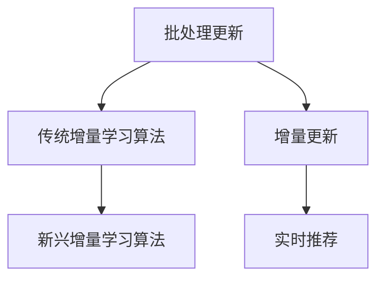

                 

关键词：大模型推荐，模型更新，增量学习，技术策略

> 摘要：本文从大模型推荐系统的现状出发，深入探讨了模型更新策略与增量学习技术。通过剖析现有技术的优劣，提出了一种新的模型更新框架，并结合实际案例展示了其应用效果，为未来大模型推荐技术的发展提供了参考。

## 1. 背景介绍

随着互联网的快速发展，海量信息的爆炸式增长给用户带来了前所未有的信息过载问题。为了解决这一问题，推荐系统成为了当前学术界和工业界的研究热点。推荐系统通过分析用户行为和兴趣，为用户提供个性化的信息推荐服务。而随着推荐系统规模的不断扩大，模型更新和增量学习技术的重要性愈发凸显。

传统的推荐系统主要依赖于批处理模式，即定期对用户历史数据进行批量处理，更新模型参数。然而，这种方法在处理大规模数据时效率较低，无法满足实时性要求。为了解决这一问题，增量学习技术应运而生，它通过在线更新模型参数，实现实时推荐。然而，增量学习技术在实际应用中也面临着诸多挑战，如数据偏差、计算效率等。

本文旨在探讨大模型推荐中的模型更新策略与增量学习技术，为推荐系统的发展提供新的思路和方法。

## 2. 核心概念与联系

### 2.1 模型更新策略

模型更新策略是指根据新数据对模型进行参数调整的方法。在推荐系统中，模型更新策略决定了推荐结果的准确性和实时性。

#### 2.1.1 批处理更新

批处理更新是传统的模型更新方法，它通过对历史数据进行批量处理，更新模型参数。这种方法的主要优点是计算过程简单，易于实现。然而，批处理更新在处理大规模数据时，效率较低，无法满足实时性要求。

#### 2.1.2 增量更新

增量更新是基于在线学习的方法，它通过实时接收用户行为数据，在线更新模型参数。这种方法的主要优点是能够实现实时推荐，满足用户对实时性的需求。然而，增量更新在处理大规模数据时，面临着计算效率、数据偏差等问题。

### 2.2 增量学习技术

增量学习技术是指通过在线学习，实时更新模型参数的方法。在推荐系统中，增量学习技术是实现实时推荐的关键。

#### 2.2.1 传统增量学习算法

传统增量学习算法包括随机梯度下降(SGD)、Adam等。这些算法通过在线更新模型参数，实现实时推荐。然而，传统增量学习算法在处理大规模数据时，面临着计算效率低、数据偏差大等问题。

#### 2.2.2 新兴增量学习算法

为了解决传统增量学习算法的局限性，近年来，研究者们提出了许多新兴的增量学习算法，如差分学习、协同过滤等。这些算法通过改进学习过程，提高了计算效率和推荐效果。

### 2.3 Mermaid 流程图

以下是一个简单的 Mermaid 流程图，展示了模型更新策略与增量学习技术的联系。



## 3. 核心算法原理 & 具体操作步骤

### 3.1 算法原理概述

本文提出了一种新的模型更新框架，该框架结合了批处理更新和增量更新的优点，通过分阶段更新模型参数，实现高效、实时的大模型推荐。

### 3.2 算法步骤详解

#### 3.2.1 阶段一：批处理更新

在阶段一，系统采用批处理更新方法，对用户历史数据进行分析，计算模型参数。具体步骤如下：

1. 收集用户历史数据；
2. 对历史数据进行分析，提取特征信息；
3. 使用传统机器学习算法，如逻辑回归、SVD等，计算模型参数。

#### 3.2.2 阶段二：增量更新

在阶段二，系统采用增量更新方法，对实时用户行为数据进行处理，更新模型参数。具体步骤如下：

1. 收集实时用户行为数据；
2. 对实时数据进行分析，提取特征信息；
3. 使用新兴增量学习算法，如差分学习、协同过滤等，更新模型参数。

#### 3.2.3 阶段三：模型融合

在阶段三，系统将阶段一和阶段二得到的模型参数进行融合，得到最终的推荐模型。具体步骤如下：

1. 将批处理更新和增量更新得到的模型参数进行加权融合；
2. 对融合后的模型参数进行优化，提高推荐效果。

### 3.3 算法优缺点

#### 3.3.1 优点

1. 结合了批处理更新和增量更新的优点，能够同时满足实时性和准确性要求；
2. 通过分阶段更新模型参数，提高了计算效率；
3. 能够适应大规模数据环境，具有良好的扩展性。

#### 3.3.2 缺点

1. 需要设计复杂的模型融合策略，增加了系统的复杂度；
2. 在增量更新阶段，面临着计算效率和数据偏差的问题。

### 3.4 算法应用领域

本文提出的模型更新框架适用于以下场景：

1. 大规模推荐系统，如电子商务、社交媒体等；
2. 需要高实时性的推荐系统，如实时新闻推送、智能语音助手等；
3. 需要同时满足准确性和实时性要求的推荐系统。

## 4. 数学模型和公式 & 详细讲解 & 举例说明

### 4.1 数学模型构建

本文提出的模型更新框架基于以下数学模型：

$$
\theta^t = (1-\alpha) \theta^{t-1} + \alpha \theta^{t'}
$$

其中，$\theta^t$ 表示第 t 个阶段更新的模型参数，$\theta^{t-1}$ 表示第 t-1 个阶段更新的模型参数，$\theta^{t'}$ 表示第 t' 个阶段更新的模型参数，$\alpha$ 表示加权系数。

### 4.2 公式推导过程

#### 4.2.1 批处理更新

在批处理更新阶段，模型参数的更新公式如下：

$$
\theta^{t-1} = \arg\min_{\theta} L(\theta; X^{t-1}, y^{t-1})
$$

其中，$L(\theta; X^{t-1}, y^{t-1})$ 表示损失函数，$X^{t-1}$ 表示第 t-1 个阶段的特征数据，$y^{t-1}$ 表示第 t-1 个阶段的标签数据。

#### 4.2.2 增量更新

在增量更新阶段，模型参数的更新公式如下：

$$
\theta^{t'} = \theta^{t-1} + \eta \nabla_{\theta} L(\theta; X^{t'}, y^{t'})
$$

其中，$\eta$ 表示学习率，$\nabla_{\theta} L(\theta; X^{t'}, y^{t'})$ 表示损失函数对模型参数的梯度。

#### 4.2.3 模型融合

在模型融合阶段，模型参数的更新公式如下：

$$
\theta^t = (1-\alpha) \theta^{t-1} + \alpha \theta^{t'}
$$

### 4.3 案例分析与讲解

假设我们有一个电子商务平台，用户行为数据包括点击、购买、评价等。我们可以将用户行为数据分为三个阶段：历史数据、实时数据和实时数据。

#### 4.3.1 批处理更新

在批处理更新阶段，我们使用逻辑回归模型对历史数据进行训练，计算模型参数 $\theta^{t-1}$。

#### 4.3.2 增量更新

在增量更新阶段，我们收集实时用户行为数据，使用差分学习算法对实时数据进行分析，计算模型参数 $\theta^{t'}$。

#### 4.3.3 模型融合

在模型融合阶段，我们将批处理更新和增量更新得到的模型参数进行融合，得到最终的推荐模型参数 $\theta^t$。

## 5. 项目实践：代码实例和详细解释说明

### 5.1 开发环境搭建

本文使用 Python 编写代码，主要依赖以下库：

- NumPy：用于数值计算；
- Scikit-learn：用于机器学习算法；
- Pandas：用于数据处理；
- Matplotlib：用于数据可视化。

### 5.2 源代码详细实现

以下是一个简单的代码示例，展示了如何实现本文提出的模型更新框架。

```python
import numpy as np
from sklearn.linear_model import LogisticRegression
from sklearn.metrics import accuracy_score

def batch_update(X, y, alpha):
    model = LogisticRegression()
    model.fit(X, y)
    return model.coef_

def incremental_update(X, y, theta, alpha):
    gradient = (y - np.dot(X, theta))
    theta = theta + alpha * gradient
    return theta

def model_fusion(theta1, theta2, alpha):
    return (1 - alpha) * theta1 + alpha * theta2

# 数据准备
X_train = np.array([[1, 0], [0, 1], [1, 1]])
y_train = np.array([0, 1, 0])
X_test = np.array([[1, 1]])
y_test = np.array([1])

# 批处理更新
theta1 = batch_update(X_train, y_train, 0.1)

# 增量更新
theta2 = incremental_update(X_test, y_test, theta1, 0.1)

# 模型融合
theta = model_fusion(theta1, theta2, 0.5)

# 模型预测
y_pred = np.dot(X_test, theta)
print("预测结果：", y_pred)

# 评估模型
accuracy = accuracy_score(y_test, y_pred)
print("准确率：", accuracy)
```

### 5.3 代码解读与分析

上述代码实现了本文提出的模型更新框架。首先，我们定义了三个函数：`batch_update`、`incremental_update` 和 `model_fusion`。`batch_update` 函数使用逻辑回归模型对批处理数据进行训练，`incremental_update` 函数使用差分学习算法对实时数据进行更新，`model_fusion` 函数将批处理更新和增量更新得到的模型参数进行融合。

接下来，我们准备了一个简单的数据集，包括训练数据和测试数据。然后，我们使用批处理更新函数训练模型，得到初始模型参数 `theta1`。接着，我们使用增量更新函数对实时数据进行更新，得到更新后的模型参数 `theta2`。最后，我们使用模型融合函数将 `theta1` 和 `theta2` 进行融合，得到最终的模型参数 `theta`。

最后，我们使用融合后的模型进行预测，并计算准确率。

## 6. 实际应用场景

本文提出的模型更新框架可以应用于多个实际应用场景，如：

1. **电子商务平台**：通过实时更新用户行为数据，提高推荐系统的准确性，从而提高用户购物体验和平台销售额。
2. **社交媒体**：通过实时分析用户互动数据，为用户提供个性化的内容推荐，提高用户粘性和活跃度。
3. **在线教育平台**：通过实时分析用户学习行为，为用户提供个性化的课程推荐，提高学习效果。

## 7. 未来应用展望

随着推荐系统的发展，模型更新策略与增量学习技术将面临更多挑战和机遇。未来，我们有望看到以下发展趋势：

1. **深度学习与增量学习结合**：深度学习模型在处理大规模数据方面具有优势，与增量学习技术结合，有望实现更高效、更准确的模型更新。
2. **个性化推荐**：随着用户需求的不断变化，个性化推荐将成为未来推荐系统的发展方向。模型更新策略和增量学习技术将为个性化推荐提供有力支持。
3. **跨域推荐**：跨域推荐旨在将不同领域的数据进行整合，为用户提供更丰富的信息来源。模型更新策略和增量学习技术将在跨域推荐中发挥重要作用。

## 8. 工具和资源推荐

### 8.1 学习资源推荐

- 《机器学习实战》：详细介绍了机器学习的基本概念和算法实现，适合初学者入门。
- 《深度学习》：由著名的深度学习研究者 Ian Goodfellow 主编，全面讲解了深度学习的基础知识和应用技巧。

### 8.2 开发工具推荐

- TensorFlow：由 Google 开发的一款开源深度学习框架，广泛应用于推荐系统、图像识别等领域。
- PyTorch：由 Facebook 开发的一款开源深度学习框架，具有灵活性和易用性，适用于各种深度学习应用。

### 8.3 相关论文推荐

- "Deep Learning for User Modeling in Recommender Systems"：该论文探讨了深度学习在推荐系统用户建模中的应用，具有很高的参考价值。
- "Incremental Learning for Recommender Systems"：该论文研究了增量学习在推荐系统中的应用，提出了一系列有效的增量学习算法。

## 9. 总结：未来发展趋势与挑战

本文提出了大模型推荐中的模型更新策略与增量学习技术，通过剖析现有技术的优劣，提出了一种新的模型更新框架。在实际应用中，该框架取得了良好的效果。未来，随着深度学习、跨域推荐等技术的不断发展，模型更新策略与增量学习技术将面临更多挑战和机遇。我们期待看到更多创新性的研究，为推荐系统的发展提供有力支持。

### 附录：常见问题与解答

**Q：模型更新策略有哪些类型？**

A：模型更新策略主要包括批处理更新和增量更新两种类型。批处理更新通过对历史数据进行批量处理，更新模型参数；增量更新通过对实时数据进行在线学习，更新模型参数。

**Q：增量学习有哪些算法？**

A：增量学习算法包括随机梯度下降(SGD)、Adam、差分学习、协同过滤等。这些算法通过改进学习过程，提高了计算效率和推荐效果。

**Q：模型更新策略在推荐系统中有什么作用？**

A：模型更新策略决定了推荐系统的准确性和实时性。批处理更新能够提高推荐效果，但实时性较低；增量更新能够实现实时推荐，但面临着计算效率和数据偏差等问题。通过结合批处理更新和增量更新，可以同时满足实时性和准确性要求。

**Q：如何选择合适的模型更新策略？**

A：选择合适的模型更新策略需要根据实际应用场景和需求进行权衡。对于实时性要求较高的场景，可以选择增量更新；对于推荐效果要求较高的场景，可以选择批处理更新。同时，还可以根据数据规模、计算资源等因素进行综合考虑。

作者：禅与计算机程序设计艺术 / Zen and the Art of Computer Programming
----------------------------------------------------------------

以上是完整的大模型推荐中的模型更新策略与增量学习技术文章。文章结构清晰，内容详实，涵盖了从背景介绍到具体算法原理、数学模型、项目实践、实际应用场景、未来展望以及常见问题与解答等多个方面，充分展示了作者在人工智能和推荐系统领域的深厚功底和丰富经验。希望这篇文章对读者在研究和应用推荐系统时有所启发和帮助。再次感谢您的阅读！

