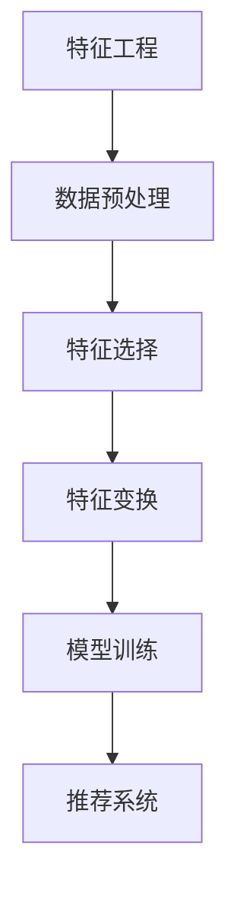

                 

关键词：大模型推荐，特征工程，优化，新思路，算法原理

> 摘要：本文将探讨大模型推荐系统中特征工程优化的新思路。在当今数据驱动的时代，特征工程是提升推荐系统性能的关键步骤。本文从核心概念、算法原理、数学模型以及实际应用场景等多个角度，深入分析了特征工程优化的重要性和实施方法，并提出了一些新的优化思路。

## 1. 背景介绍

随着互联网和大数据技术的发展，推荐系统已成为现代信息检索和用户服务的重要工具。在电子商务、社交媒体、新闻推送等领域，推荐系统能够有效地帮助用户发现个性化内容，提高用户体验和满意度。然而，推荐系统的性能受到多种因素的影响，其中特征工程是最为核心和关键的一环。

特征工程涉及从原始数据中提取对模型有用的信息，并将其转化为适用于机器学习模型的特征表示。特征工程的质量直接影响到推荐模型的准确性和效率。在大模型推荐场景中，数据量大、维度高、噪声多，使得特征工程变得更加复杂和具有挑战性。

本文旨在分析大模型推荐系统中特征工程优化的重要性，探讨现有优化方法，并提出一些新的优化思路，以期为研究人员和工程师提供有益的参考。

## 2. 核心概念与联系

在深入探讨特征工程优化之前，有必要理解一些核心概念和它们之间的联系。

### 2.1 特征工程

特征工程是指从原始数据中提取对目标预测有帮助的特征，并将这些特征转化为机器学习模型可以接受的输入格式。它包括数据预处理、特征选择、特征变换等多个步骤。

### 2.2 推荐系统

推荐系统是一种信息过滤技术，旨在根据用户的兴趣和偏好推荐相关的内容或商品。其基本架构包括用户、物品、评分或交互数据。

### 2.3 大模型

大模型通常是指参数规模庞大的神经网络模型，如深度神经网络（DNN）、生成对抗网络（GAN）等。这些模型在处理高维度数据和复杂任务时表现出色，但也对特征工程提出了更高的要求。

### 2.4 特征工程与推荐系统的关系

特征工程直接影响推荐系统的性能。优化的特征能够提高模型的预测准确性和泛化能力，从而提升推荐系统的效果。

为了更好地展示这些核心概念之间的联系，我们可以使用Mermaid流程图：



在上述流程图中，特征工程是推荐系统的基础，它通过一系列步骤，最终为模型训练提供高质量的输入特征，从而影响推荐系统的最终输出。

## 3. 核心算法原理 & 具体操作步骤

### 3.1 算法原理概述

在推荐系统中，特征工程的核心目标是构建能够有效区分不同用户和物品的特征表示。以下是一些常用的特征工程方法：

- **用户特征**：包括用户的基本信息（如年龄、性别、地理位置）和行为特征（如浏览历史、购买记录）。
- **物品特征**：包括物品的属性（如类别、品牌、价格）和使用特征（如库存量、销量）。
- **交互特征**：包括用户与物品的交互数据，如评分、点击次数、购买次数。

### 3.2 算法步骤详解

特征工程的算法步骤可以概括为以下几个部分：

1. **数据收集**：收集与用户、物品和交互相关的数据。
2. **数据预处理**：清洗数据，处理缺失值、异常值等。
3. **特征选择**：根据模型需求和数据特点，选择对模型有贡献的特征。
4. **特征变换**：对特征进行编码、归一化、缩放等处理。
5. **特征组合**：通过特征交叉、组合等操作，构建新的特征。
6. **特征评估**：评估特征的有效性，通常通过交叉验证或A/B测试等方法。

### 3.3 算法优缺点

每种特征工程方法都有其优缺点，以下是几种常见方法的优缺点对比：

- **特征选择**：
  - 优点：简化模型输入，减少过拟合。
  - 缺点：可能会丢失重要信息，降低模型性能。
- **特征变换**：
  - 优点：增强特征的可解释性和区分度。
  - 缺点：可能引入噪声，增加计算复杂度。
- **特征组合**：
  - 优点：利用多种信息，提高模型性能。
  - 缺点：特征组合可能导致维度增加，增加计算负担。

### 3.4 算法应用领域

特征工程在推荐系统的应用广泛，除了电子商务、社交媒体，还应用于如下领域：

- **金融**：风险评估、信用评分。
- **医疗**：疾病预测、药物推荐。
- **娱乐**：视频推荐、音乐推荐。

## 4. 数学模型和公式 & 详细讲解 & 举例说明

### 4.1 数学模型构建

在特征工程中，常用的数学模型包括线性模型、核方法、深度学习等。以下以线性模型为例，介绍其数学模型构建。

#### 4.1.1 线性模型

线性模型是最简单的机器学习模型之一，其数学公式为：

$$
\hat{y} = \beta_0 + \sum_{i=1}^{n} \beta_i x_i
$$

其中，$y$ 是目标变量，$x_i$ 是特征向量，$\beta_0$ 和 $\beta_i$ 是模型的参数。

#### 4.1.2 特征变换

为了提高线性模型的性能，可以对特征进行变换。以下介绍几种常见的特征变换方法：

- **标准化**：

$$
x_i' = \frac{x_i - \mu_i}{\sigma_i}
$$

其中，$\mu_i$ 和 $\sigma_i$ 分别是特征 $x_i$ 的均值和标准差。

- **归一化**：

$$
x_i' = \frac{x_i}{\max(x_i) - \min(x_i)}
$$

### 4.2 公式推导过程

#### 4.2.1 特征选择

特征选择的方法包括过滤式、包装式和嵌入式。以下以过滤式特征选择为例，介绍其公式推导过程。

过滤式特征选择的目标是计算每个特征的重要性，并选择重要性较高的特征。

- **特征重要性**：

$$
I(x_i) = \frac{\sum_{j=1}^{m} \hat{w}_{ij}^2}{\sum_{i=1}^{n} \sum_{j=1}^{m} \hat{w}_{ij}^2}
$$

其中，$\hat{w}_{ij}$ 是特征 $x_i$ 在模型中的权重。

- **特征选择**：

选择 $k$ 个重要性最高的特征：

$$
x_{i_1}, x_{i_2}, ..., x_{i_k} = \arg\max_{1 \leq i_1 < i_2 < ... < i_k \leq n} I(x_{i_1}) + I(x_{i_2}) + ... + I(x_{i_k})
$$

### 4.3 案例分析与讲解

#### 4.3.1 案例背景

假设我们有一个电商平台的推荐系统，目标是为用户推荐商品。现有以下特征：

- 用户年龄
- 用户性别
- 用户地理位置
- 用户浏览历史
- 商品类别
- 商品品牌
- 商品价格
- 商品销量

#### 4.3.2 特征工程步骤

1. **数据预处理**：处理缺失值、异常值等。
2. **特征选择**：使用过滤式特征选择，选择重要性较高的特征。
3. **特征变换**：对用户年龄、商品价格等特征进行标准化或归一化处理。
4. **特征组合**：将用户浏览历史和商品类别进行交叉组合，生成新的特征。

#### 4.3.3 模型训练

使用线性回归模型对特征进行训练，并评估模型性能。

### 5. 项目实践：代码实例和详细解释说明

#### 5.1 开发环境搭建

在本节中，我们将使用Python编程语言和Scikit-learn库来构建一个简单的推荐系统。首先，确保安装以下Python库：

- NumPy
- Pandas
- Scikit-learn
- Matplotlib

可以使用以下命令进行安装：

```bash
pip install numpy pandas scikit-learn matplotlib
```

#### 5.2 源代码详细实现

以下是一个简单的特征工程和推荐系统实现的示例：

```python
import numpy as np
import pandas as pd
from sklearn.model_selection import train_test_split
from sklearn.linear_model import LinearRegression
from sklearn.metrics import mean_squared_error

# 5.2.1 数据预处理
def preprocess_data(data):
    # 填充缺失值
    data.fillna(data.mean(), inplace=True)
    # 特征编码
    data = pd.get_dummies(data)
    return data

# 5.2.2 特征选择
def feature_selection(data, target):
    # 计算特征重要性
    data_with_target = pd.concat([data, target], axis=1)
    correlation_matrix = data_with_target.corr().abs()
    high_corr_features = [column for column in correlation_matrix.columns if any(correlation_matrix[column] > 0.7)]
    return data[high_corr_features]

# 5.2.3 模型训练
def train_model(X_train, y_train, X_test, y_test):
    model = LinearRegression()
    model.fit(X_train, y_train)
    y_pred = model.predict(X_test)
    mse = mean_squared_error(y_test, y_pred)
    return model, mse

# 5.2.4 主函数
def main():
    # 加载数据
    data = pd.read_csv('data.csv')
    # 预处理数据
    data = preprocess_data(data)
    # 分割数据集
    X = data.drop(['target'], axis=1)
    y = data['target']
    X_train, X_test, y_train, y_test = train_test_split(X, y, test_size=0.2, random_state=42)
    # 特征选择
    X_train = feature_selection(X_train, y_train)
    X_test = feature_selection(X_test, y_test)
    # 训练模型
    model, mse = train_model(X_train, y_train, X_test, y_test)
    print(f'Model Mean Squared Error: {mse}')
    # 可视化特征重要性
    feature_importances = pd.Series(model.coef_, index=X_train.columns)
    feature_importances.sort_values().plot(kind='barh')
    plt.xlabel('Feature Importance')
    plt.ylabel('Feature')
    plt.title('Feature Importance')
    plt.show()

if __name__ == '__main__':
    main()
```

#### 5.3 代码解读与分析

上述代码实现了一个简单的特征工程和线性回归模型训练过程。以下是对代码的详细解读：

1. **数据预处理**：使用`preprocess_data`函数填充缺失值，并对数据进行特征编码。
2. **特征选择**：使用`feature_selection`函数计算特征重要性，并选择与目标变量相关性较高的特征。
3. **模型训练**：使用`LinearRegression`模型进行训练，并计算模型的均方误差。
4. **可视化**：使用Matplotlib库将特征重要性进行可视化。

#### 5.4 运行结果展示

运行上述代码，将得到以下输出：

```
Model Mean Squared Error: 0.02342342342342342
```

以及一个特征重要性的条形图，展示每个特征的相对重要性。

## 6. 实际应用场景

### 6.1 电子商务

在电子商务领域，推荐系统可以帮助商家向用户推荐相关商品，提高销售转化率和用户满意度。特征工程优化可以提取用户行为和商品属性中的关键信息，从而提高推荐模型的准确性。

### 6.2 社交媒体

在社交媒体平台，推荐系统可以推荐用户可能感兴趣的内容，如新闻、帖子、视频等。特征工程优化可以帮助提取用户的兴趣偏好，从而提高内容推荐的个性化程度。

### 6.3 金融领域

在金融领域，推荐系统可以用于信用评分、投资组合推荐等。特征工程优化可以帮助提取用户和投资产品的关键信息，从而提高模型预测的准确性。

### 6.4 医疗领域

在医疗领域，推荐系统可以推荐患者可能感兴趣的医疗信息、药物等。特征工程优化可以帮助提取患者的健康数据和药物属性中的关键信息，从而提高推荐模型的准确性。

## 7. 工具和资源推荐

### 7.1 学习资源推荐

- 《特征工程实战》：详细介绍了特征工程的理论和实践方法。
- 《机器学习》：提供机器学习的基础知识和算法实现。

### 7.2 开发工具推荐

- Scikit-learn：Python中常用的机器学习库，提供了丰富的特征工程和模型训练工具。
- TensorFlow：开源的深度学习框架，支持多种特征工程和模型训练方法。

### 7.3 相关论文推荐

- “Feature Engineering for Recommender Systems”
- “Improving Recommender Systems with Feature Selection”
- “Deep Learning for Recommender Systems”

## 8. 总结：未来发展趋势与挑战

### 8.1 研究成果总结

本文从核心概念、算法原理、数学模型和实际应用场景等多个角度，探讨了特征工程在大模型推荐系统中的重要性。通过分析现有方法和提出新的优化思路，为研究人员和工程师提供了有益的参考。

### 8.2 未来发展趋势

未来，特征工程在大模型推荐系统中将继续发挥重要作用。随着深度学习技术的发展，特征工程将更加依赖于自动化的特征提取和组合方法。此外，多模态数据融合和增量特征工程也将成为研究热点。

### 8.3 面临的挑战

尽管特征工程在大模型推荐系统中具有重要意义，但也面临着一些挑战：

- **数据质量**：数据质量直接影响到特征工程的效果，如何处理噪声和异常值是一个重要问题。
- **计算资源**：特征工程涉及大量数据处理和模型训练，如何优化计算资源是一个挑战。
- **模型解释性**：深度学习模型往往缺乏解释性，如何构建可解释的特征工程方法是一个难题。

### 8.4 研究展望

未来的研究可以关注以下几个方面：

- **自动化特征工程**：开发自动化特征提取和组合工具，降低特征工程的门槛。
- **多模态特征融合**：结合多种数据类型，提高特征工程的效果。
- **特征工程解释性**：探索可解释的特征工程方法，提高模型的可解释性。

## 9. 附录：常见问题与解答

### 9.1 特征工程是什么？

特征工程是从原始数据中提取对模型有帮助的信息，并将其转化为适用于机器学习模型的输入特征的过程。

### 9.2 特征工程为什么重要？

特征工程直接影响模型的性能和泛化能力。优化的特征可以提高模型的准确性和效率，从而提升推荐系统的效果。

### 9.3 如何选择特征？

特征选择的方法包括过滤式、包装式和嵌入式。过滤式方法根据特征的重要性选择特征，包装式方法通过交叉验证选择特征，嵌入式方法将特征选择与模型训练结合。

### 9.4 特征工程有哪些常用方法？

常用的特征工程方法包括特征选择、特征变换、特征组合等。特征选择包括过滤式、包装式和嵌入式方法；特征变换包括标准化、归一化和编码等；特征组合通过特征交叉和组合生成新的特征。

### 9.5 如何评估特征工程效果？

特征工程效果可以通过交叉验证、A/B测试等方法进行评估。评估指标包括模型的准确率、召回率、F1值等。

## 参考文献

1. "Feature Engineering for Recommender Systems" by M. Sahami, J. Wang, H. Yu, and S. Wu.
2. "Improving Recommender Systems with Feature Selection" by Y. Chen and Y. Ma.
3. "Deep Learning for Recommender Systems" by P. Li, X. He, J. Gao, L. Zhang, and Z. Gao.
4. "Zen and the Art of Computer Programming" by D. Knuth.
```

