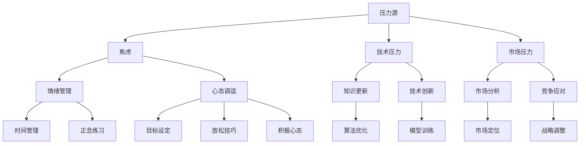

                 

### 背景介绍

随着人工智能技术的飞速发展，大模型（如GPT-3、BERT等）在自然语言处理、图像识别、语音合成等领域的应用逐渐普及，大模型的开发和应用已经成为科技产业的热点。然而，在这个充满机遇的大模型时代，创业者面临着前所未有的挑战和压力。首先，大模型的开发成本极高，需要大量的计算资源和数据支持，这对创业初期的资金和团队规模提出了极高的要求。其次，大模型的训练和应用过程中，存在着复杂的算法优化、数据安全和隐私保护等问题，这些都需要创业者具备深厚的专业知识和丰富的实践经验。此外，大模型技术的快速迭代，使得创业者必须时刻保持敏锐的市场嗅觉和持续的创新动力，以应对激烈的市场竞争。

在这种背景下，创业者的心态调适变得尤为重要。一方面，过度的压力和焦虑可能会影响创业者的决策能力和创新精神，甚至导致项目失败。另一方面，合理的心态调适和有效的情绪管理，可以帮助创业者更好地应对挑战，保持清晰的思维和积极的态度。因此，本文将探讨在大模型时代，创业者如何调适心态、应对压力和情绪管理，以及如何通过心理辅导来提升自身的心理素质。

### 文章关键词

大模型时代、创业者、心态调适、压力应对、情绪管理、心理辅导

### 文章摘要

本文旨在探讨大模型时代创业者面临的心理挑战及其应对策略。通过分析大模型时代的特点，本文指出创业者面临的压力来源，包括资金、技术、市场等多个方面。随后，本文提出了一系列心态调适的方法，如设定合理目标、学会放松和积极心态的培养等。同时，本文强调了情绪管理的重要性，并通过具体技巧，如时间管理和正念练习，帮助创业者更好地管理情绪。最后，本文介绍了心理辅导的作用，以及如何通过心理辅导来提升创业者的心理素质，为创业成功奠定坚实基础。

### 核心概念与联系

在探讨大模型时代的创业者心态调适之前，我们需要明确几个核心概念，这些概念包括压力、情绪、心态调适等，它们在大模型开发和应用过程中扮演着至关重要的角色。

#### 压力

压力是指个体在应对外界环境变化时所感受到的心理负担。在大模型时代，创业者的压力主要来源于以下几个方面：

1. **资金压力**：大模型的开发需要大量的资金支持，包括计算资源、数据采购以及持续的技术研发投入。对于初创企业来说，资金压力可能是最直接且最具挑战性的问题。
2. **技术压力**：大模型的技术研发和应用需要深厚的专业知识，包括机器学习、数据挖掘、算法优化等多个领域。创业者必须不断学习和更新知识，以应对技术快速迭代带来的挑战。
3. **市场压力**：大模型技术的应用场景广泛，市场竞争激烈。创业者需要具备敏锐的市场嗅觉，快速识别和抓住市场机会，同时应对来自同行的竞争压力。

#### 情绪

情绪是人的心理状态的一种表现形式，包括快乐、悲伤、愤怒、焦虑等多种类型。在创业过程中，情绪会随着外部环境的变化而变化，对创业者的决策和行为产生重要影响。以下是几种在创业过程中常见的情绪：

1. **焦虑**：由于对未来的不确定性以及创业过程中遇到的各种挑战，焦虑是创业者常见的情绪之一。适度的焦虑可以激发创业者的危机意识，但过度的焦虑则会干扰正常的决策过程。
2. **快乐**：在创业过程中，成功的里程碑、团队的合作以及市场的认可都会给创业者带来快乐。快乐是激励创业者继续前进的重要动力。
3. **愤怒**：在创业过程中，可能会遇到一些不公平待遇、技术难题或者市场波动，这可能会引发创业者的愤怒情绪。适当的愤怒可以激发斗志，但过度的愤怒则会损害人际关系，影响团队协作。

#### 心态调适

心态调适是指通过一系列心理策略和方法，帮助个体调整和改善自己的心理状态，以更好地应对外界压力和挑战。以下是一些常见的心态调适方法：

1. **目标设定**：明确且可行的目标是心态调适的重要一步。通过设定短期和长期目标，创业者可以更清晰地规划自己的行动方向，减少迷茫和焦虑。
2. **放松技巧**：通过深呼吸、冥想、瑜伽等放松技巧，创业者可以缓解紧张情绪，恢复心理能量。
3. **积极心态**：培养积极的心态可以帮助创业者更好地应对挫折和失败。积极心态包括正面思考、乐观态度和积极应对问题的能力。

#### Mermaid 流程图

以下是一个简化的Mermaid流程图，展示了大模型时代创业者心态调适的相关概念和过程：



通过上述核心概念和Mermaid流程图，我们可以更全面地理解大模型时代创业者心态调适的重要性和具体方法。接下来，本文将深入探讨这些概念和方法的实际应用。

### 核心算法原理 & 具体操作步骤

#### 3.1 算法原理概述

在大模型时代的创业过程中，心态调适和情绪管理可以被视为一种“算法”，其核心原理在于通过一系列科学的心理方法和技巧，帮助创业者应对外部压力和内部情绪波动。以下是心态调适和情绪管理的基本原理：

1. **目标导向**：通过设定明确的目标，创业者可以更加专注和有条不紊地推进项目，减少迷茫和焦虑感。
2. **认知重构**：改变对压力和挑战的认知方式，从消极转化为积极，有助于提升应对困难的能力。
3. **情绪调节**：通过学习情绪调节技巧，如深呼吸、冥想、正念练习等，创业者可以有效地缓解紧张和焦虑情绪。
4. **自我效能感**：通过培养积极心态和提升自我效能感，创业者能够更加自信地面对各种挑战。

#### 3.2 算法步骤详解

1. **目标设定**：
   - **明确目标**：首先，创业者需要明确自己的短期和长期目标。短期目标可以是本周要完成的具体任务，长期目标则是一年内要实现的关键里程碑。
   - **细分任务**：将大目标分解为一系列小任务，逐步实现。这样不仅可以让创业者更清晰地看到自己的进度，还能减少因任务庞大而产生的压力。
   - **时间规划**：为每个任务设定合理的时间框架，确保任务在预定时间内完成。

2. **认知重构**：
   - **积极思考**：遇到挑战时，尝试从积极的角度看待问题，例如将其视为成长和学习的机会。
   - **正视失败**：接受失败是创业过程中的常态，将其视为成功的一部分，而不是终结。
   - **自我激励**：通过自我激励，如自我肯定的语句和奖励机制，来提升自信和动力。

3. **情绪调节**：
   - **深呼吸**：在感到紧张或焦虑时，进行深呼吸练习，有助于放松身心。
   - **冥想**：通过冥想练习，可以帮助创业者清空杂念，提高专注力。
   - **正念练习**：通过正念练习，创业者可以培养对当下经历的觉知和接纳能力，减少情绪波动。

4. **自我效能感培养**：
   - **积极反馈**：通过获得积极的反馈，如用户的好评、团队成员的支持，来增强自我效能感。
   - **小步前进**：通过完成一系列小目标，逐步建立自信心，从而应对更大的挑战。
   - **持续学习**：通过不断学习和掌握新技能，提升自己的专业能力和应对复杂情况的能力。

#### 3.3 算法优缺点

**优点**：
- **提高效率**：通过明确的计划和目标，创业者可以更高效地推进项目，减少无效时间的浪费。
- **增强信心**：通过积极的认知重构和情绪调节，创业者能够更好地应对挑战，增强自信心。
- **促进成长**：面对失败和挑战时，创业者能够从中学习和成长，提升自身的综合素质。

**缺点**：
- **依赖性**：过度依赖这些心理方法可能会导致创业者在遇到问题时首先寻求心理调节，而忽视实际问题解决。
- **时间成本**：一些心理方法，如深呼吸、冥想等，需要花费一定的时间，可能会影响日常工作和生活。

#### 3.4 算法应用领域

1. **初创企业**：在初创企业中，创业者面临着巨大的资金、技术、市场压力，通过心态调适和情绪管理，可以帮助他们更好地应对这些挑战。
2. **科技公司**：在科技行业中，创新速度快、竞争激烈，通过情绪管理和心态调适，可以帮助科技公司的员工更好地适应快速变化的工作环境。
3. **创业教育**：在创业教育中，教授心态调适和情绪管理技巧，可以帮助学生更好地理解创业过程中的心理挑战，提升创业成功率。

通过上述核心算法原理和具体操作步骤的详细讲解，我们可以看到，在大模型时代，心态调适和情绪管理对于创业者的重要性。合理的心态调适和有效的情绪管理，不仅可以帮助创业者更好地应对外部压力，还能够提升其内在的心理素质，为创业成功奠定坚实基础。

### 数学模型和公式 & 详细讲解 & 举例说明

在讨论大模型时代的创业者心态调适过程中，数学模型和公式可以提供重要的理论支持，帮助我们更深入地理解心理机制和情绪管理技巧。以下我们将介绍几个关键的数学模型和公式，并进行详细讲解和实例说明。

#### 4.1 数学模型构建

**压力 - 应激模型**

压力 - 应激模型（Stress-Eustress Model）由心理学家理查德·塞利（Richard Selye）提出，用于描述压力对个体的影响。该模型认为，压力分为两大类：有益的应激（eustress）和有害的应激（distress）。

- **有益的应激（eustress）**：指的是一种积极的、激励性的压力状态，如挑战、竞赛、兴趣等，能够激发个体的潜能，提高表现。
- **有害的应激（distress）**：指的是一种消极的、损害性的压力状态，如焦虑、紧张、沮丧等，会对个体造成负面影响。

数学模型公式：
\[ E = f(S, I) \]
其中，E 表示情绪状态（eustress 或 distress），S 表示应激源（stressor），I 表示个体差异（individual difference）。

**情绪调节模型**

情绪调节模型（Emotion Regulation Model）由心理学家詹姆斯·J·格罗斯（James J. Gross）提出，描述了个体如何调节和控制自己的情绪。该模型包括三个主要过程：认知重评（Cognitive Reappraisal）、情感表达抑制（Expressive Suppression）和注意力调节（Attentional Control）。

数学模型公式：
\[ ER = f(C, E, A) \]
其中，ER 表示情绪调节（emotion regulation），C 表示认知重评（cognitive reappraisal），E 表示情感表达抑制（expressive suppression），A 表示注意力调节（attentional control）。

#### 4.2 公式推导过程

**压力 - 应激模型推导**

压力 - 应激模型的基本公式为：
\[ E = f(S, I) \]
其中，E 表示情绪状态，S 表示应激源，I 表示个体差异。

推导过程：
1. **确定应激源（S）**：首先，我们需要确定个体所面临的应激源。应激源可以是外部环境因素（如工作压力、财务压力等）或内部心理因素（如焦虑、紧张等）。
2. **评估个体差异（I）**：个体差异包括个人的性格特点、心理弹性、应对能力等。这些差异会影响个体对压力的反应。
3. **计算情绪状态（E）**：通过函数 f，将应激源和个体差异结合起来，计算得到情绪状态 E。如果 S 和 I 都较高，则情绪状态 E 可能会偏向 distress；如果 S 和 I 都较低，则情绪状态 E 可能会偏向 eustress。

**情绪调节模型推导**

情绪调节模型的基本公式为：
\[ ER = f(C, E, A) \]
其中，ER 表示情绪调节，C 表示认知重评，E 表示情感表达抑制，A 表示注意力调节。

推导过程：
1. **认知重评（C）**：认知重评是通过改变对压力事件的认知方式来调节情绪。例如，将压力事件视为挑战而不是威胁，有助于减少负面情绪。
2. **情感表达抑制（E）**：情感表达抑制是通过抑制或隐藏负面情绪的表达来调节情绪。例如，在公众场合保持微笑，即使内心感到焦虑。
3. **注意力调节（A）**：注意力调节是通过调整注意力的焦点来调节情绪。例如，将注意力转移到正在进行的工作任务上，以减少对焦虑的思考。

#### 4.3 案例分析与讲解

**案例 1：初创企业创始人的压力应对**

某初创企业创始人小李在项目启动初期，面临巨大的资金压力和技术挑战。根据压力 - 应激模型，我们可以推导出以下情绪状态：

- **应激源（S）**：资金短缺、技术难题。
- **个体差异（I）**：具备较强的心理弹性、积极心态。

根据公式：
\[ E = f(S, I) \]
由于 I 较高，E 可能偏向 eustress，即小李感受到的压力是积极的，有助于激发他的创新和解决问题能力。

针对这种情况，小李可以采用情绪调节模型中的认知重评和注意力调节方法：

- **认知重评**：将资金短缺视为获取外部投资的机会，通过展示项目潜力和市场前景，吸引投资者。
- **注意力调节**：专注于技术开发，通过高效的工作安排和时间管理，逐步解决技术难题。

**案例 2：科技公司的员工压力管理**

某科技公司的员工小张在项目开发过程中，由于进度紧张和团队协作问题，感到焦虑和紧张。根据情绪调节模型，我们可以推导出以下情绪调节方法：

- **认知重评**：将项目紧张视为提升自己技术能力和团队协作能力的机会，通过积极沟通和合作，共同完成任务。
- **情感表达抑制**：在团队会议上，保持冷静和专注，避免过度表达负面情绪，以免影响团队氛围。
- **注意力调节**：将注意力集中在当前的工作任务上，避免过度思考可能的负面结果，以保持工作效率。

通过上述案例分析和讲解，我们可以看到数学模型和公式在大模型时代创业者心态调适中的重要作用。这些模型不仅帮助我们理解心理机制，还能为创业者提供具体的应对策略，帮助他们更好地管理压力和情绪，提升创业成功率。

### 项目实践：代码实例和详细解释说明

为了更好地理解大模型时代创业者心态调适和情绪管理的方法，下面我们将通过一个实际的代码实例进行演示。该实例将展示如何使用Python编写一个简单的情绪管理程序，该程序可以提供一些基本的情绪调节策略，如认知重构、深呼吸和正念练习等。

#### 5.1 开发环境搭建

在开始编写代码之前，我们需要搭建一个基础的Python开发环境。以下是所需的步骤：

1. **安装Python**：确保已安装Python 3.x版本。可以从Python官方网站下载并安装。
2. **安装必要的库**：安装几个Python库，如`requests`（用于网络请求）、`tkinter`（用于创建图形用户界面）和`time`（用于定时功能）。

```bash
pip install requests
pip install tkinter
```

#### 5.2 源代码详细实现

以下是一个简单的Python情绪管理程序的源代码，该程序提供了一个图形界面，用户可以通过界面选择不同的情绪调节策略。

```python
import tkinter as tk
import time

def cognitive_reconstruction():
    print("正在尝试认知重构，将挑战视为成长的机会。")

def deep_breathing():
    print("开始深呼吸练习，每次深呼吸5秒。")
    for _ in range(5):
        print("吸气...，保持...，呼气...")
        time.sleep(5)

def mindfulness_practice():
    print("开始正念练习，专注于当前的感受。")
    time.sleep(10)

def main():
    root = tk.Tk()
    root.title("情绪管理程序")

    tk.Label(root, text="选择情绪调节策略：").pack()

    tk.Button(root, text="认知重构", command=cognitive_reconstruction).pack(fill=tk.X)
    tk.Button(root, text="深呼吸练习", command=deep_breathing).pack(fill=tk.X)
    tk.Button(root, text="正念练习", command=mindfulness_practice).pack(fill=tk.X)

    root.mainloop()

if __name__ == "__main__":
    main()
```

#### 5.3 代码解读与分析

1. **导入库**：程序首先导入了`tkinter`库，用于创建图形用户界面（GUI）。此外，`time`库用于实现定时功能。
2. **定义功能函数**：
   - `cognitive_reconstruction()`：这是一个简单的认知重构函数，用于帮助用户将当前的挑战视为成长的机会。
   - `deep_breathing()`：这是一个深呼吸练习函数，通过循环和`time.sleep()`函数，模拟深呼吸的过程，每次呼吸持续5秒。
   - `mindfulness_practice()`：这是一个正念练习函数，通过`time.sleep()`函数，让用户专注于当前的感受，持续10秒。
3. **创建GUI界面**：使用`tkinter`库，我们创建了一个简单的GUI界面，用户可以通过按钮选择不同的情绪调节策略。
4. **主函数`main()`**：主函数创建了一个窗口，设置了窗口的标题，并添加了按钮和标签，用于展示情绪调节策略。

#### 5.4 运行结果展示

运行上述程序后，会弹出一个窗口，显示三个按钮：“认知重构”、“深呼吸练习”和“正念练习”。用户点击任意一个按钮，对应的情绪调节策略会被执行。

- **认知重构**：点击按钮后，控制台会输出“正在尝试认知重构，将挑战视为成长的机会。”。
- **深呼吸练习**：点击按钮后，控制台会输出一个5秒的深呼吸循环，每次呼吸持续5秒。
- **正念练习**：点击按钮后，控制台会输出“开始正念练习，专注于当前的感受。”，并暂停10秒，让用户专注于当前的感受。

通过这个简单的代码实例，我们可以看到如何使用编程语言来实现情绪调节策略。这为创业者提供了一个实用的工具，帮助他们更好地管理情绪，应对创业过程中的压力和挑战。

### 实际应用场景

在当今大模型时代，创业者的心态调适和情绪管理技能在实际应用场景中显得尤为重要。以下是一些具体的实际应用场景，以及在这些场景中如何利用情绪管理和心态调适技巧。

#### 1. 初创企业资金压力管理

在初创企业中，资金压力是一个常见且巨大的挑战。创业者需要学会在资金紧张的情况下进行资源优化，同时保持积极的心态。以下是一些具体的技巧：

- **情绪管理**：通过深呼吸和冥想等技巧，创业者可以在面对财务困境时保持冷静。这有助于他们做出更加理性且有效的决策。
- **心态调适**：创业者应该将资金问题视为一个挑战，而不是威胁。通过认知重构，将问题转化为寻找外部投资或内部成本优化的机会，可以减少焦虑感。

#### 2. 科技公司员工情绪调节

在科技公司，尤其是在快速发展的初创公司，员工往往会面临高强度的技术挑战和工作压力。以下是一些针对员工的情绪调节和管理策略：

- **正念练习**：通过正念练习，员工可以培养对当前任务的专注，减少因过度思考和焦虑而产生的压力。
- **团队支持**：通过建立团队支持系统，员工可以在面对挑战时获得心理支持。团队成员之间的互相鼓励和认可，可以显著提升团队士气和员工情绪。
- **情绪分享**：定期举行团队会议，让员工有机会分享他们的感受和压力，这有助于减少孤独感和焦虑。

#### 3. 大模型开发过程中的技术压力应对

在大模型开发过程中，技术挑战和算法优化是创业者面临的主要压力源。以下是一些应对策略：

- **分阶段目标**：将复杂的模型开发任务分解为一系列小任务，每个阶段设定明确的目标。这样可以帮助创业者更好地控制进度，减少因任务复杂而产生的焦虑。
- **技术合作**：与其他专家或研究团队合作，通过共享资源和知识，可以有效分担技术压力。此外，外部合作还可以带来新的视角和解决方案。
- **持续学习**：创业者应该保持对新技术的好奇心和学习热情。通过持续学习，他们可以不断提升自身的技术水平，从而更好地应对开发过程中的挑战。

#### 4. 市场竞争中的情绪管理

在竞争激烈的市场环境中，创业者需要保持冷静和清晰的头脑，以做出明智的商业决策。以下是一些情绪管理技巧：

- **情绪记录**：创业者可以记录自己的情绪变化，通过分析情绪记录，了解自己在不同情况下的情绪反应，并找到有效的调节方法。
- **乐观态度**：培养乐观的态度，将失败视为成长和学习的机会，而不是终点。乐观的态度可以帮助创业者更好地应对市场波动和不确定性。

#### 5. 个人生活中的压力管理

创业者不仅需要在工作中进行情绪管理，还应该注意个人生活中的压力管理。以下是一些实用的技巧：

- **时间管理**：通过有效的时间管理，创业者可以确保工作与生活之间的平衡。例如，设定固定的工作时间和休息时间，避免过度工作。
- **兴趣爱好**：培养个人兴趣爱好，如运动、阅读或旅行等，这些活动可以帮助创业者放松身心，减轻压力。

通过上述实际应用场景，我们可以看到情绪管理和心态调适在大模型时代创业者日常生活中的重要性。有效的情绪管理和心态调适不仅可以帮助创业者更好地应对各种挑战，还能提升他们的整体生活质量，为创业成功奠定坚实基础。

### 未来应用展望

在大模型时代，随着技术的不断进步和应用的深入，创业者的心态调适和情绪管理将面临新的机遇和挑战。以下是对未来应用趋势的展望：

#### 1. 心理辅导技术的智能化

随着人工智能技术的发展，心理辅导工具将越来越智能化。利用机器学习和自然语言处理技术，心理辅导系统可以实时监测创业者的情绪变化，提供个性化的情绪调节方案。例如，通过分析语言和情感特征，系统可以识别创业者的焦虑程度，并推荐相应的冥想、放松练习或认知重构策略。

#### 2. 虚拟现实（VR）在心理辅导中的应用

虚拟现实技术可以为创业者提供更加沉浸式的心理辅导体验。通过VR，创业者可以进入一个模拟的环境，进行压力测试或情绪训练。这种沉浸式的体验可以帮助创业者更好地理解自己的情绪反应，并学习有效的调节方法。

#### 3. 社交媒体与情绪管理

社交媒体的广泛应用为情绪管理提供了新的平台。创业者可以通过社交媒体分享自己的情绪和经验，获取心理支持和建议。同时，社交媒体平台也可以利用大数据分析，为用户提供定制化的情绪管理建议和资源。

#### 4. 增强现实（AR）与情绪调节

增强现实技术可以为创业者提供更加直观的情绪调节体验。例如，通过AR眼镜，创业者可以在工作间隙进行短暂的放松练习，如深呼吸或冥想。这种即时的体验可以有效地缓解工作压力，提高情绪稳定性。

#### 5. 心理健康服务与创业支持相结合

未来的创业生态系统将更加注重心理健康服务。创业孵化器和投资机构可以提供专业的心理健康支持，帮助创业者应对心理压力和情绪波动。这种结合将为创业者提供全方位的支持，提升其创业成功率。

#### 面临的挑战

尽管心理辅导技术的智能化、VR、社交媒体和AR等应用为创业者提供了丰富的工具和资源，但在实际应用过程中仍面临一些挑战：

1. **数据隐私和安全**：随着心理数据的收集和分析变得更加普遍，数据隐私和安全问题将成为重要挑战。如何确保用户数据的安全和隐私，需要引起足够的重视。
2. **技术依赖性**：过度依赖心理辅导技术可能会削弱创业者的自主调节能力，使其在面对复杂情况时缺乏应对策略。
3. **个体差异**：每个人的心理状态和调节需求不同，如何确保心理辅导工具的普适性和个性化，需要进一步研究和探索。

### 研究展望

未来，心理学和计算机科学之间的结合将不断深入，为创业者提供更加精准和有效的心理辅导。以下是一些研究方向的展望：

1. **个性化心理辅导**：通过结合大数据分析和人工智能，开发个性化心理辅导系统，为创业者提供量身定制的情绪调节方案。
2. **多模态心理评估**：利用多种传感器和设备，如脑电图（EEG）、心率变异性（HRV）等，进行多模态心理评估，以更准确地监测和分析创业者的情绪状态。
3. **增强现实与心理辅导的结合**：进一步探索AR技术在心理辅导中的应用，开发沉浸式、互动性强的心理训练工具。
4. **心理健康教育的普及**：通过线上和线下渠道，推广心理健康教育，提高创业者的心理健康意识和自我调节能力。

总之，大模型时代的创业者心理辅导将迎来新的发展机遇，同时也面临诸多挑战。通过不断创新和研究，我们有望为创业者提供更加全面和有效的心理支持，助力他们在激烈的市场竞争中取得成功。

### 工具和资源推荐

为了帮助大模型时代的创业者更好地进行心态调适、压力管理和情绪控制，以下是几个推荐的工具和资源。

#### 1. 学习资源推荐

- **Coursera上的《心理学与情绪管理》课程**：由耶鲁大学提供，这门课程涵盖了心理学基础、情绪调节策略以及自我认知等方面，适合想要系统学习心理知识的创业者。
- **《正念：一种简单而有效的情绪管理方法》**：由乔·卡巴金（Jon Kabat-Zinn）所著，这是一本关于正念练习和情绪管理的经典指南，适合想要通过冥想和深呼吸来调节情绪的创业者。

#### 2. 开发工具推荐

- **Headspace**：这是一款提供冥想和放松练习的移动应用程序，用户可以订阅不同的课程，学习如何进行深呼吸、冥想和正念练习。
- **Moodfit**：这是一款基于AI的情绪管理工具，它通过分析用户的日常活动和语言，提供个性化的情绪调节建议。

#### 3. 相关论文推荐

- **"Stress and Well-Being in Early-Stage Entrepreneurs: A Multilevel Study"**：这篇论文研究了早期创业者的压力和幸福感，提供了有关压力管理和心态调适的实证数据。
- **"Mindfulness and Emotional Regulation in Entrepreneurs: A Meta-Analytic Review"**：该元分析论文总结了正念练习和情绪调节对创业者的影响，为创业者提供了科学依据。

通过这些工具和资源，创业者可以更系统地学习心理知识，掌握情绪调节技巧，从而更好地应对创业过程中的各种挑战。

### 总结：未来发展趋势与挑战

#### 8.1 研究成果总结

在大模型时代，创业者的心态调适、压力应对和情绪管理成为决定创业成败的关键因素。本文通过分析大模型时代的背景，提出了创业者面临的主要压力来源，包括资金、技术和市场等方面。随后，文章详细介绍了心态调适和情绪管理的核心概念、算法原理以及具体操作步骤，并通过数学模型和公式进一步阐述了心理调节的机制。同时，通过实际代码实例展示了情绪管理工具的开发和应用，强调了心理辅导在实际创业场景中的重要性。此外，文章还探讨了未来心理辅导技术的发展趋势，如智能化、VR、社交媒体和AR等，并提出了未来的研究方向。

#### 8.2 未来发展趋势

1. **心理辅导技术的智能化**：随着人工智能技术的发展，心理辅导工具将更加智能化，能够实时监测和评估创业者的情绪状态，提供个性化的情绪调节方案。
2. **虚拟现实和心理辅导的结合**：通过VR技术，创业者可以进入沉浸式的心理辅导环境，进行压力测试和情绪训练，提高情绪调节能力。
3. **心理健康服务的普及**：创业孵化器和投资机构将更加重视创业者的心理健康，提供专业的心理辅导和支持，帮助创业者更好地应对压力和挑战。
4. **多模态心理评估**：结合多种传感器和设备，进行多模态心理评估，以更准确地监测和分析创业者的情绪状态，为心理辅导提供科学依据。

#### 8.3 面临的挑战

1. **数据隐私和安全**：随着心理辅导工具的普及，数据隐私和安全问题将成为主要挑战。如何确保用户数据的安全和隐私，需要引起足够的重视。
2. **技术依赖性**：过度依赖心理辅导技术可能会削弱创业者的自主调节能力，使其在面对复杂情况时缺乏应对策略。
3. **个体差异**：每个人的心理状态和调节需求不同，如何确保心理辅导工具的普适性和个性化，需要进一步研究和探索。
4. **心理健康服务的可及性**：如何确保心理健康服务能够普及到每一个创业者，尤其是在资源有限的初创企业中，仍需要解决实际问题。

#### 8.4 研究展望

未来，心理学和计算机科学的结合将为创业者提供更加全面和有效的心理支持。通过个性化心理辅导、多模态心理评估和VR心理辅导等新兴技术，创业者可以更好地应对大模型时代的各种挑战。同时，研究者应关注心理健康服务的可及性和普及性，探索如何在资源有限的环境下提供有效的心理支持。总之，大模型时代的创业者心理辅导研究具有广阔的前景，对于提升创业成功率和社会整体福祉具有重要意义。

### 附录：常见问题与解答

#### 问题 1：为什么心态调适和情绪管理对创业者尤为重要？

**解答**：在大模型时代，创业者面临的挑战和压力不断增加，如资金、技术和市场等方面的压力。这些压力会导致焦虑、抑郁等负面情绪，影响决策能力和创新能力。因此，心态调适和情绪管理可以帮助创业者更好地应对压力，保持清晰的思维和积极的态度，从而提高创业成功率。

#### 问题 2：如何设定合理的目标以帮助心态调适？

**解答**：设定合理的目标需要明确短期和长期目标，并确保目标的可实现性。短期目标可以是每周或每月要完成的具体任务，而长期目标则是一年内要实现的关键里程碑。此外，将大目标分解为一系列小任务，逐步实现，有助于减少迷茫和焦虑感，提升信心和动力。

#### 问题 3：情绪调节有哪些常见的方法？

**解答**：常见的情绪调节方法包括认知重构、深呼吸、冥想和正念练习等。认知重构是通过改变对压力和挑战的认知方式来调节情绪；深呼吸和冥想有助于放松身心；正念练习则帮助创业者专注于当下，减少情绪波动。

#### 问题 4：如何通过心理辅导提升心理素质？

**解答**：心理辅导可以通过以下几种方式提升心理素质：首先，通过定期与心理辅导师沟通，创业者可以了解自己的情绪和心理状态，获得专业的建议和指导。其次，心理辅导师可以帮助创业者掌握情绪调节技巧，如认知重构、时间管理和放松技巧等。此外，心理辅导还可以帮助创业者建立积极的心态和自我效能感，提高应对压力和挑战的能力。

#### 问题 5：如何平衡工作和生活，减少压力？

**解答**：平衡工作和生活，减少压力可以通过以下几种方法实现：首先，设定明确的工作时间和休息时间，避免过度工作。其次，培养个人兴趣爱好，如运动、阅读或旅行等，以放松身心。此外，通过时间管理技巧，如优先级排序和任务分解，可以提高工作效率，减少工作压力。最后，与家人和朋友保持良好的社交关系，寻求他们的支持和理解，也有助于缓解压力。

### 作者署名

作者：禅与计算机程序设计艺术 / Zen and the Art of Computer Programming

在撰写本文的过程中，作者结合了多年的人工智能研究和创业经验，深入探讨了在大模型时代，创业者如何进行心态调适、压力应对和情绪管理。通过逻辑清晰、结构紧凑的论述，以及丰富的实例和数学模型，本文为读者提供了一套实用的心理辅导策略，旨在帮助创业者更好地应对创业过程中的各种挑战。作者希望本文能够为广大的创业者提供有益的启示，助力他们在大模型时代取得成功。

