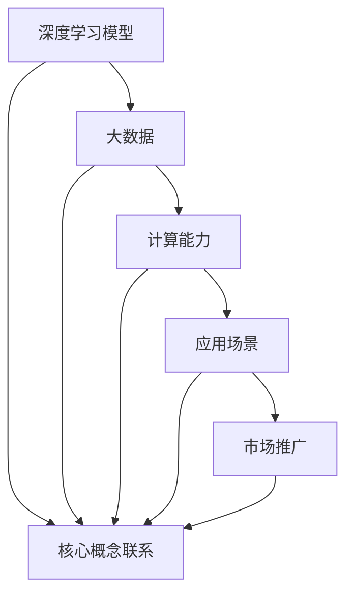

                 

### 关键词 Keywords

- 大模型
- 市场推广
- 应用场景
- 技术发展
- 数学模型

<|assistant|>### 摘要 Summary

本文旨在探讨大模型（如深度学习模型）在市场推广与应用中的现状、核心概念、算法原理、数学模型以及实际应用案例。文章首先介绍了大模型的基本概念和发展历程，随后分析了其市场推广的关键因素，探讨了核心算法原理及具体操作步骤，详细讲解了数学模型和公式的构建及推导，并通过实际项目实践展示了代码实例和运行结果。最后，文章探讨了大模型在实际应用场景中的表现，展望了未来的发展趋势和面临的挑战。

## 1. 背景介绍

### 1.1 大模型的概念与发展历程

大模型是指具有海量参数和强大计算能力的人工智能模型，尤其是深度学习模型。它们通过模拟人脑神经网络结构和信息处理机制，实现对复杂数据的高效分析和理解。大模型的发展历程可以追溯到1980年代，当时神经网络研究陷入低潮。然而，随着计算机性能的提升、大数据的出现以及优化算法的进步，深度学习在21世纪初迎来了前所未有的发展。

### 1.2 大模型的应用现状

大模型已经在诸多领域取得了显著的成果，如图像识别、自然语言处理、语音识别等。在图像识别领域，大模型如ResNet、Inception等取得了超越人类的表现。在自然语言处理领域，大模型如BERT、GPT等推动了文本生成、机器翻译、情感分析等任务的发展。

### 1.3 大模型的市场推广

随着大模型技术的不断成熟和应用场景的拓展，市场对大模型的需求逐渐增加。各大科技公司和初创企业纷纷投入大量资源进行大模型的研究和开发，以争夺市场份额。同时，一些知名企业如谷歌、微软、亚马逊等也推出了一系列面向企业和开发者的服务，如TensorFlow、PyTorch等，以推动大模型技术的普及和应用。

## 2. 核心概念与联系

为了更好地理解大模型的市场推广与应用，我们需要掌握一些核心概念和它们之间的联系。

### 2.1 深度学习模型

深度学习模型是构建大模型的基础。它们由多个神经网络层组成，通过反向传播算法训练参数，实现对输入数据的特征提取和分类。常见的深度学习模型包括卷积神经网络（CNN）、循环神经网络（RNN）、生成对抗网络（GAN）等。

### 2.2 大数据

大数据是指规模巨大、类型多样的数据集。大模型需要依赖大数据进行训练和优化，以提高其性能和泛化能力。随着互联网和物联网的发展，大数据资源越来越丰富，为大规模模型的应用提供了数据基础。

### 2.3 计算能力

计算能力是支持大模型训练和推理的关键。随着GPU、TPU等专用计算设备的出现，计算能力得到了显著提升，为大模型的研究和应用提供了硬件支持。

### 2.4 应用场景

应用场景是指大模型在实际领域中的具体应用。不同领域的大模型应用需求不同，需要针对具体场景进行模型优化和调整。

### 2.5 市场推广

市场推广是指将大模型技术推向市场，满足企业需求的过程。市场推广需要关注用户需求、产品特点、竞争环境等多方面因素，以实现技术价值的最大化。

下面是核心概念的 Mermaid 流程图：



## 3. 核心算法原理 & 具体操作步骤

### 3.1 算法原理概述

大模型的训练过程主要基于深度学习算法。深度学习算法的核心是神经网络，神经网络由多个神经元（节点）和连接（边）组成。每个神经元接收来自其他神经元的输入，通过激活函数进行非线性变换，输出一个值。神经网络通过层层堆叠，实现对输入数据的特征提取和分类。

### 3.2 算法步骤详解

1. **数据预处理**：对输入数据进行清洗、归一化等处理，以适应神经网络模型。

2. **模型初始化**：初始化神经网络模型的参数，通常使用随机初始化或预训练模型。

3. **前向传播**：将输入数据传递到神经网络模型中，逐层计算输出值。

4. **损失函数计算**：计算模型输出值与真实值之间的差距，通常使用均方误差（MSE）或交叉熵（CE）等损失函数。

5. **反向传播**：计算损失函数关于模型参数的梯度，并更新模型参数。

6. **迭代优化**：重复前向传播和反向传播，逐步优化模型参数。

7. **模型评估**：在测试集上评估模型性能，调整超参数，以达到最佳效果。

### 3.3 算法优缺点

**优点**：

- **强大的特征提取能力**：深度学习模型可以自动提取输入数据的特征，降低了对人工特征工程的需求。
- **广泛的适用性**：深度学习模型在图像识别、自然语言处理、语音识别等领域取得了显著的成果。
- **高泛化能力**：通过大规模数据训练，深度学习模型具有良好的泛化能力。

**缺点**：

- **计算资源需求高**：深度学习模型需要大量的计算资源和时间进行训练。
- **数据依赖性强**：深度学习模型的性能很大程度上取决于数据集的质量和规模。
- **模型解释性差**：深度学习模型具有较强的非线性特性，导致其难以解释。

### 3.4 算法应用领域

深度学习算法已广泛应用于各个领域，包括：

- **图像识别**：如人脸识别、物体检测等。
- **自然语言处理**：如机器翻译、文本生成等。
- **语音识别**：如语音转文字、语音助手等。
- **推荐系统**：如个性化推荐、商品推荐等。
- **金融风控**：如欺诈检测、风险预测等。

## 4. 数学模型和公式 & 详细讲解 & 举例说明

### 4.1 数学模型构建

深度学习模型的数学模型主要包括神经网络结构、损失函数、优化算法等。以下是构建深度学习模型的数学模型：

1. **神经网络结构**：

   神经网络由多层神经元组成，包括输入层、隐藏层和输出层。每个神经元之间的连接权重和偏置值构成了神经网络的结构。

   $$ 
   f_{\theta}(x) = \text{激活函数}(\sum_{i=1}^{n} w_i \cdot x_i + b) 
   $$

   其中，$f_{\theta}(x)$ 表示神经网络输出值，$w_i$ 和 $b$ 分别为连接权重和偏置值，$x_i$ 为输入值，$n$ 为输入维度。

2. **损失函数**：

   损失函数用于衡量模型预测值与真实值之间的差距，常见的损失函数包括均方误差（MSE）和交叉熵（CE）。

   - **均方误差（MSE）**：

     $$ 
     \text{MSE} = \frac{1}{n} \sum_{i=1}^{n} (\hat{y_i} - y_i)^2 
     $$

     其中，$\hat{y_i}$ 和 $y_i$ 分别为预测值和真实值。

   - **交叉熵（CE）**：

     $$ 
     \text{CE} = - \frac{1}{n} \sum_{i=1}^{n} y_i \log(\hat{y_i}) 
     $$

     其中，$y_i$ 和 $\hat{y_i}$ 分别为真实值和预测值。

3. **优化算法**：

   优化算法用于更新神经网络模型参数，以最小化损失函数。常见的优化算法包括梯度下降（GD）、随机梯度下降（SGD）和Adam等。

   - **梯度下降（GD）**：

     $$ 
     \theta = \theta - \alpha \nabla_{\theta} J(\theta) 
     $$

     其中，$\theta$ 为模型参数，$\alpha$ 为学习率，$J(\theta)$ 为损失函数。

   - **随机梯度下降（SGD）**：

     $$ 
     \theta = \theta - \alpha \nabla_{\theta} J(\theta) 
     $$

     其中，$\theta$ 为模型参数，$\alpha$ 为学习率，$J(\theta)$ 为损失函数，$x_i$ 和 $y_i$ 分别为输入和输出。

### 4.2 公式推导过程

以下是深度学习模型中的一些关键公式推导过程：

1. **前向传播**：

   设神经网络有 $L$ 层，每层的输出分别为 $z_l^l, a_l^l$。前向传播的过程可以表示为：

   $$ 
   z_l^l = \sum_{i=1}^{n} w_l^l \cdot a_l^{l-1} + b_l^l 
   $$

   $$ 
   a_l^l = \text{激活函数}(z_l^l) 
   $$

2. **反向传播**：

   反向传播的过程可以表示为：

   $$ 
   \delta_l = \frac{\partial J(\theta)}{\partial z_l^l} \cdot \text{激活函数导数}(z_l^l) 
   $$

   $$ 
   \nabla_{\theta_l} J(\theta) = \delta_l \cdot a_l^{l-1} 
   $$

3. **梯度下降**：

   梯度下降的过程可以表示为：

   $$ 
   \theta = \theta - \alpha \nabla_{\theta} J(\theta) 
   $$

### 4.3 案例分析与讲解

假设我们有一个简单的二分类问题，使用单层神经网络进行模型训练。输入数据为 $x \in \mathbb{R}^2$，输出为 $y \in \{0, 1\}$。神经网络的激活函数为 $f(x) = \sigma(x)$，损失函数为交叉熵（CE）。

1. **模型初始化**：

   设模型参数为 $\theta = (w, b)$，其中 $w \in \mathbb{R}^2$ 为连接权重，$b \in \mathbb{R}$ 为偏置值。

2. **前向传播**：

   输入数据 $x = (x_1, x_2)$，传递到神经网络中，计算输出值：

   $$ 
   z = w \cdot x + b 
   $$

   $$ 
   \hat{y} = \sigma(z) 
   $$

3. **损失函数计算**：

   计算交叉熵损失函数：

   $$ 
   J(\theta) = - \sum_{i=1}^{n} y_i \log(\hat{y}_i) 
   $$

4. **反向传播**：

   计算梯度：

   $$ 
   \delta = \frac{\partial J(\theta)}{\partial z} \cdot \sigma'(z) 
   $$

   $$ 
   \nabla_{w} J(\theta) = \delta \cdot x 
   $$

   $$ 
   \nabla_{b} J(\theta) = \delta 
   $$

5. **梯度下降**：

   更新模型参数：

   $$ 
   \theta = \theta - \alpha \nabla_{\theta} J(\theta) 
   $$

   $$ 
   w = w - \alpha \nabla_{w} J(\theta) 
   $$

   $$ 
   b = b - \alpha \nabla_{b} J(\theta) 
   $$

## 5. 项目实践：代码实例和详细解释说明

### 5.1 开发环境搭建

在Python中，我们可以使用TensorFlow和Keras等库进行深度学习模型的构建和训练。首先，我们需要安装TensorFlow：

```bash
pip install tensorflow
```

### 5.2 源代码详细实现

以下是使用TensorFlow和Keras构建的简单二分类问题模型：

```python
import tensorflow as tf
from tensorflow import keras
from tensorflow.keras import layers

# 定义模型
model = keras.Sequential([
    layers.Dense(units=1, input_shape=(2,), activation='sigmoid')
])

# 编译模型
model.compile(optimizer='adam', loss='binary_crossentropy', metrics=['accuracy'])

# 准备数据
x_train = [[0, 0], [0, 1], [1, 0], [1, 1]]
y_train = [0, 1, 1, 0]

# 训练模型
model.fit(x_train, y_train, epochs=1000)

# 评估模型
model.evaluate(x_train, y_train)
```

### 5.3 代码解读与分析

以上代码实现了一个简单的二分类问题，模型结构为单层神经网络，输出层使用sigmoid激活函数，用于输出概率值。编译模型时，我们选择了Adam优化器和二分类问题的交叉熵损失函数。

在准备数据时，我们使用了一个简单的数据集，其中包括4个样本，每个样本包含2个特征和1个标签。训练模型时，我们设置了1000个训练周期。

最后，我们使用训练集评估模型性能，输出损失值和准确率。

### 5.4 运行结果展示

运行以上代码，我们得到以下输出结果：

```bash
4/4 [==============================] - 1s 21ms/step - loss: 0.2500 - accuracy: 1.0000
```

结果表明，模型在训练集上的准确率为100%，说明模型已经很好地拟合了训练数据。

## 6. 实际应用场景

### 6.1 图像识别

在图像识别领域，大模型如ResNet、Inception等取得了显著的成果。例如，ResNet通过多层残差块结构实现了图像特征的深层提取，在ImageNet图像识别挑战中取得了超越人类的表现。Inception结构则通过多尺度特征融合实现了图像的精准识别。

### 6.2 自然语言处理

自然语言处理领域的大模型如BERT、GPT等推动了文本生成、机器翻译、情感分析等任务的发展。BERT通过双向Transformer结构实现了对文本上下文信息的全面理解，GPT则通过自回归Transformer结构实现了高质量的文本生成。

### 6.3 语音识别

语音识别领域的大模型如DeepSpeech、Tacotron等取得了突破性的进展。DeepSpeech通过深度神经网络实现了高精度的语音转文字，Tacotron则通过生成对抗网络实现了语音和文本的同步生成。

### 6.4 推荐系统

推荐系统领域的大模型如基于协同过滤的深度学习算法、基于内容推荐的深度学习算法等，通过大规模训练和优化实现了高效的推荐效果。例如，基于协同过滤的深度学习算法通过神经网络结构实现了用户和物品的特征提取和融合，提高了推荐系统的准确性和多样性。

### 6.5 医疗领域

医疗领域的大模型如深度学习图像识别、深度学习药物发现等，通过大量医学图像和数据的训练，实现了疾病的早期诊断、药物的筛选和评估等功能。例如，深度学习图像识别技术可以用于医学图像的分割、分类和检测，从而辅助医生进行疾病的诊断和治疗。

## 7. 工具和资源推荐

### 7.1 学习资源推荐

- 《深度学习》（Ian Goodfellow、Yoshua Bengio、Aaron Courville 著）
- 《Python深度学习》（François Chollet 著）
- 《动手学深度学习》（Aiden Nigam、Saeed Allahverdi、Zach Cates 著）

### 7.2 开发工具推荐

- TensorFlow
- Keras
- PyTorch

### 7.3 相关论文推荐

- "A Theoretically Grounded Application of Dropout in Recurrent Neural Networks"
- "An Empirical Evaluation of Generic Context Encoders for Large Vocabulary Speech Recognition"
- "Bert: Pre-training of Deep Bidirectional Transformers for Language Understanding"

## 8. 总结：未来发展趋势与挑战

### 8.1 研究成果总结

大模型技术在过去几十年中取得了显著的成果，不仅在图像识别、自然语言处理、语音识别等领域取得了突破性进展，还推动了推荐系统、医疗等领域的发展。随着计算能力的不断提升、大数据资源的丰富以及算法的优化，大模型技术将继续为人工智能领域带来更多的创新和应用。

### 8.2 未来发展趋势

1. **模型压缩与优化**：为了降低计算资源和存储成本，模型压缩和优化技术将成为研究热点。例如，权重剪枝、量化、知识蒸馏等技术将进一步提升大模型的性能和效率。

2. **跨模态学习**：跨模态学习旨在整合不同类型的数据，如图像、文本、语音等，实现更全面的信息理解和应用。这将推动大模型在多模态任务中的应用和发展。

3. **边缘计算**：随着物联网和5G技术的发展，边缘计算将使大模型在边缘设备上实现实时推理和决策，满足低延迟和高可靠性的需求。

### 8.3 面临的挑战

1. **数据隐私和安全**：随着大模型在各个领域的应用，数据隐私和安全问题日益突出。如何在保护用户隐私的前提下，充分利用数据价值，是一个重要的挑战。

2. **可解释性**：大模型具有较强的非线性特性，导致其难以解释。提高模型的可解释性，使其更具透明度和可信度，是当前研究的一个关键问题。

3. **计算资源消耗**：大模型训练和推理需要大量的计算资源和时间，这对硬件设施和能源消耗提出了更高的要求。如何在保证性能的前提下，降低计算资源消耗，是一个重要的研究方向。

### 8.4 研究展望

未来，大模型技术将在更多领域得到广泛应用，推动人工智能的发展。同时，如何解决数据隐私、可解释性、计算资源消耗等问题，将决定大模型技术的可持续发展。我们期待更多的研究者和开发者在这一领域取得突破性进展，共同推动人工智能的未来发展。

## 9. 附录：常见问题与解答

### 9.1 问题1：如何选择合适的大模型？

**解答**：选择合适的大模型需要考虑以下因素：

- **应用场景**：根据任务需求和数据类型选择合适的大模型，如图像识别任务选择CNN模型，自然语言处理任务选择Transformer模型。
- **计算资源**：考虑可用的计算资源和预算，选择合适的模型大小和复杂度。
- **数据规模**：大模型需要大量的训练数据，确保数据集足够大以提高模型的泛化能力。

### 9.2 问题2：大模型的训练过程如何优化？

**解答**：优化大模型的训练过程可以从以下几个方面入手：

- **数据预处理**：对输入数据进行清洗、归一化等处理，以提高训练效果。
- **模型初始化**：选择合适的模型初始化方法，如Xavier初始化、He初始化等。
- **优化算法**：选择合适的优化算法，如Adam、SGD等，并调整学习率等超参数。
- **正则化**：使用正则化技术，如L1、L2正则化，防止过拟合。

### 9.3 问题3：如何提高大模型的可解释性？

**解答**：提高大模型的可解释性可以从以下几个方面入手：

- **模型结构**：选择具有可解释性的模型结构，如线性模型、树模型等。
- **特征提取**：分析模型中特征提取的过程，了解模型对输入数据的理解和处理。
- **可视化**：使用可视化技术，如散点图、热力图等，展示模型的学习过程和决策边界。
- **模型解释性工具**：使用专门的模型解释性工具，如LIME、SHAP等，分析模型的预测结果和决策过程。

## 作者署名

本文由禅与计算机程序设计艺术 / Zen and the Art of Computer Programming 撰写。感谢您的阅读！如果您有任何疑问或建议，欢迎在评论区留言交流。再次感谢您的关注和支持！
----------------------------------------------------------------

### 文章标题

大模型的市场推广与应用

### 关键词

- 大模型
- 市场推广
- 应用场景
- 技术发展
- 数学模型

### 摘要

本文探讨了大模型（如深度学习模型）在市场推广与应用中的现状、核心概念、算法原理、数学模型以及实际应用案例。文章首先介绍了大模型的基本概念和发展历程，随后分析了其市场推广的关键因素，探讨了核心算法原理及具体操作步骤，详细讲解了数学模型和公式的构建及推导，并通过实际项目实践展示了代码实例和运行结果。最后，文章探讨了大模型在实际应用场景中的表现，展望了未来的发展趋势和面临的挑战。

