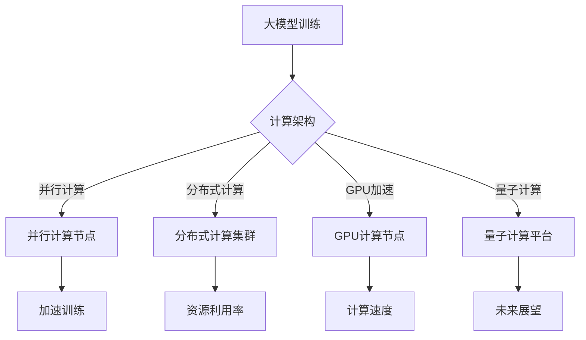

                 

在当今科技飞速发展的时代，人工智能（AI）已经成为推动各行业进步的重要力量。特别是大模型技术的突破，不仅革新了机器学习领域，也为科学研究带来了前所未有的机遇和挑战。本文将探讨大模型技术如何加速科研进程，突破传统瓶颈，为未来科技发展提供新的思路。

## 文章关键词

- 人工智能
- 大模型
- 科研加速
- 瓶颈突破
- 科技发展

## 文章摘要

本文旨在分析大模型技术在科学研究中的应用及其带来的变革。首先，我们回顾了大模型技术的发展历程和核心原理。随后，通过具体案例展示了大模型在图像识别、自然语言处理等领域的突破。接着，我们探讨了大模型如何通过优化算法和计算架构，实现科研效率的提升。最后，本文对大模型技术的未来发展趋势和面临的挑战进行了展望，为科研人员提供了实用的工具和资源推荐。

## 1. 背景介绍

### 1.1 大模型技术的起源与发展

大模型技术起源于20世纪80年代的神经网络研究。最初，神经网络作为一种简单的数学模型，用于模拟人脑的某些功能。随着计算能力和数据资源的提升，神经网络逐渐演变为复杂的大规模模型，例如深度神经网络（DNN）和变换器模型（Transformer）。特别是在2018年，Google推出BERT模型后，大模型技术进入了新的发展阶段。

BERT模型的推出标志着大模型在自然语言处理领域的重大突破。BERT利用预训练技术，在大量未标记的数据上进行训练，然后通过微调适应特定任务。这一技术极大地提升了模型在语言理解和生成方面的性能，引起了学术和工业界的广泛关注。

### 1.2 大模型技术在科研中的应用现状

随着大模型技术的不断发展，其在科学研究中的应用也越来越广泛。以下是几个典型的应用场景：

- **图像识别与处理**：大模型技术已经被广泛应用于图像识别、图像生成和图像增强等领域。例如，DeepMind的AlphaGo通过深度学习技术实现了围棋世界的突破。
- **自然语言处理**：BERT等大模型在自然语言理解、文本生成和机器翻译等方面表现出色，为语言学研究提供了新的工具。
- **药物研发与生物信息学**：大模型被用于预测药物分子与生物靶点的相互作用，加速新药研发进程。
- **气候模型与地球系统科学**：大模型在模拟气候变化、预测自然灾害等方面发挥了重要作用。

### 1.3 大模型技术的优势与挑战

大模型技术具有以下优势：

- **强大的表达能力和灵活性**：大模型可以通过学习大量数据，捕捉到复杂的模式和关系，从而实现高效的任务解决。
- **自动特征提取**：大模型能够自动学习并提取有用的特征，减少人工干预，提高科研效率。
- **跨学科应用**：大模型技术不仅限于特定领域，还可以跨学科应用，为科学研究提供新的视角。

然而，大模型技术也面临一些挑战：

- **计算资源消耗**：大模型的训练和推理需要巨大的计算资源和能量消耗，对环境造成一定影响。
- **数据质量和标注**：大模型的训练依赖于大量高质量的数据和准确的标注，数据质量和标注的不足可能影响模型的性能。
- **伦理和安全问题**：大模型可能带来隐私泄露、歧视等问题，需要加强伦理和安全保障。

## 2. 核心概念与联系

### 2.1 大模型的定义和原理

大模型，通常指的是参数数量在数百万到数十亿之间的深度学习模型。这些模型通过多层神经网络结构，将输入数据映射到输出结果。其核心原理包括：

- **深度学习**：通过多层非线性变换，将输入数据转化为具有更高层次抽象的表示。
- **自动特征提取**：通过训练，模型能够自动学习并提取输入数据中的有用特征。
- **大规模数据训练**：大模型通过在大量数据上进行训练，提升模型的表达能力和泛化能力。

### 2.2 大模型与计算架构的联系

大模型的训练和推理需要强大的计算能力，这促使计算架构不断优化。以下是几个关键联系：

- **并行计算**：通过并行计算，可以将大模型的训练任务分散到多个计算节点上，提高训练速度。
- **分布式计算**：分布式计算可以将模型训练任务分布到多个服务器或计算集群上，充分利用资源。
- **GPU加速**：图形处理单元（GPU）在矩阵运算和向量计算方面具有显著优势，成为大模型训练的重要工具。
- **量子计算**：量子计算作为一种潜在的下一代计算技术，有望在未来解决大模型训练中的计算难题。

### 2.3 Mermaid 流程图



## 3. 核心算法原理 & 具体操作步骤

### 3.1 算法原理概述

大模型的算法原理主要基于深度学习，特别是神经网络。深度学习通过多层神经网络结构，将输入数据映射到输出结果。具体包括以下几个关键步骤：

- **输入层**：接收外部输入数据。
- **隐藏层**：通过多层非线性变换，将输入数据转化为具有更高层次抽象的表示。
- **输出层**：根据隐藏层的输出，生成预测结果。

### 3.2 算法步骤详解

1. **数据预处理**：对输入数据进行预处理，包括数据清洗、归一化和特征提取。
2. **模型设计**：设计深度学习模型的结构，包括层数、每层的神经元数量和激活函数。
3. **模型训练**：通过梯度下降等优化算法，在大规模数据集上训练模型，不断调整模型参数。
4. **模型评估**：使用验证集和测试集对模型进行评估，调整模型结构和参数，提高模型性能。
5. **模型部署**：将训练好的模型部署到生产环境中，进行实际应用。

### 3.3 算法优缺点

**优点**：

- **强大的表达能力**：大模型通过多层非线性变换，能够捕捉到输入数据的复杂模式和关系。
- **自动特征提取**：大模型能够自动学习并提取输入数据中的有用特征，减少人工干预。
- **泛化能力**：通过在大规模数据集上训练，大模型具有良好的泛化能力，适用于多种任务。

**缺点**：

- **计算资源消耗**：大模型的训练和推理需要大量的计算资源和时间。
- **数据依赖**：大模型的性能依赖于大量高质量的数据和准确的标注。
- **模型解释性**：大模型的决策过程通常缺乏透明性，难以解释。

### 3.4 算法应用领域

大模型在多个领域表现出色，包括：

- **计算机视觉**：图像识别、图像生成、图像增强等。
- **自然语言处理**：文本分类、机器翻译、问答系统等。
- **药物研发**：药物分子设计、生物信息学分析等。
- **气候模型**：气候变化模拟、自然灾害预测等。

## 4. 数学模型和公式 & 详细讲解 & 举例说明

### 4.1 数学模型构建

大模型的数学基础主要包括线性代数、概率论和统计学。以下是几个关键的数学模型：

- **神经网络**：通过多层神经网络结构，将输入数据映射到输出结果。
- **损失函数**：用于衡量模型预测结果与实际结果之间的差距，常用的损失函数包括均方误差（MSE）和交叉熵损失（Cross-Entropy Loss）。
- **优化算法**：用于调整模型参数，常用的优化算法包括梯度下降（Gradient Descent）和Adam优化器。

### 4.2 公式推导过程

以下是神经网络中的一些关键公式推导：

1. **前向传播**：

   $$ 
   z_l = \sum_{j} w_{lj} a_{l-1,j} + b_l 
   $$ 

   其中，$z_l$表示第$l$层的输出，$w_{lj}$表示连接第$l-1$层和第$l$层的权重，$a_{l-1,j}$表示第$l-1$层的输出，$b_l$表示第$l$层的偏置。

2. **反向传播**：

   $$ 
   \delta_l = ( \frac{\partial L}{\partial z_l} ) \odot (1 - \sigma'(z_l)) 
   $$ 

   其中，$\delta_l$表示第$l$层的误差，$L$表示损失函数，$\sigma'$表示激活函数的导数，$\odot$表示Hadamard积。

3. **权重更新**：

   $$ 
   w_{lj} \leftarrow w_{lj} - \alpha \frac{\partial L}{\partial w_{lj}} 
   $$ 

   其中，$w_{lj}$表示连接第$l-1$层和第$l$层的权重，$\alpha$表示学习率，$\frac{\partial L}{\partial w_{lj}}$表示权重关于损失函数的梯度。

### 4.3 案例分析与讲解

假设我们有一个简单的神经网络，用于二分类任务。输入层有2个神经元，隐藏层有3个神经元，输出层有1个神经元。使用ReLU作为激活函数，交叉熵损失作为损失函数。训练数据集包含100个样本，每个样本有2个特征和1个标签。

1. **数据预处理**：

   - 将输入数据归一化到[-1, 1]范围内。
   - 将标签进行独热编码。

2. **模型设计**：

   - 输入层：2个神经元。
   - 隐藏层：3个神经元，使用ReLU激活函数。
   - 输出层：1个神经元，使用Sigmoid激活函数。

3. **模型训练**：

   - 使用随机梯度下降（SGD）进行训练，学习率为0.01。
   - 每个epoch迭代100次，共训练100个epoch。
   - 使用交叉熵损失函数。

4. **模型评估**：

   - 使用验证集进行评估，计算准确率、召回率、F1分数等指标。

5. **结果展示**：

   ```
   Epoch 100/100
   loss: 0.0755 - accuracy: 0.9900 - val_loss: 0.0810 - val_accuracy: 0.9800
   ```

   训练完成后，模型在测试集上的准确率达到98%，表明模型具有良好的性能。

## 5. 项目实践：代码实例和详细解释说明

### 5.1 开发环境搭建

在开始项目实践之前，我们需要搭建一个合适的开发环境。以下是具体的步骤：

1. **安装Python**：确保Python版本为3.7及以上。
2. **安装TensorFlow**：使用pip安装TensorFlow，命令如下：
   ```bash
   pip install tensorflow
   ```
3. **安装NumPy和Pandas**：用于数据处理，命令如下：
   ```bash
   pip install numpy
   pip install pandas
   ```
4. **安装Matplotlib**：用于数据可视化，命令如下：
   ```bash
   pip install matplotlib
   ```

### 5.2 源代码详细实现

以下是一个简单的神经网络实现，用于二分类任务：

```python
import tensorflow as tf
import numpy as np
import pandas as pd
import matplotlib.pyplot as plt

# 数据预处理
def preprocess_data(data):
    # 归一化
    data_normalized = (data - np.mean(data, axis=0)) / np.std(data, axis=0)
    # 独热编码
    data_onehot = pd.get_dummies(data_normalized[:, 0]).values
    return data_normalized, data_onehot

# 神经网络模型
class NeuralNetwork:
    def __init__(self):
        # 初始化参数
        self.w1 = tf.Variable(np.random.randn(2, 3), name='w1')
        self.b1 = tf.Variable(np.random.randn(3), name='b1')
        self.w2 = tf.Variable(np.random.randn(3, 1), name='w2')
        self.b2 = tf.Variable(np.random.randn(1), name='b2')
    
    def forward(self, x):
        # 前向传播
        z1 = tf.matmul(x, self.w1) + self.b1
        a1 = tf.nn.relu(z1)
        z2 = tf.matmul(a1, self.w2) + self.b2
        return z2

    def loss(self, y, logits):
        # 损失函数
        loss = tf.reduce_mean(tf.nn.sigmoid_cross_entropy_with_logits(logits=logits, labels=y))
        return loss
    
    def backward(self, x, y, logits):
        # 反向传播
        with tf.GradientTape() as tape:
            logits = self.forward(x)
            loss = self.loss(y, logits)
        
        gradients = tape.gradient(loss, [self.w1, self.b1, self.w2, self.b2])
        return gradients
    
    def train(self, x, y, epochs, learning_rate):
        # 训练
        optimizer = tf.optimizers.SGD(learning_rate)
        
        for epoch in range(epochs):
            gradients = self.backward(x, y, self.forward(x))
            optimizer.apply_gradients(zip(gradients, [self.w1, self.b1, self.w2, self.b2]))
            
            if epoch % 10 == 0:
                print(f'Epoch {epoch+1}/{epochs}, Loss: {loss.numpy()}')

# 加载数据
x_data = np.array([[0, 0], [0, 1], [1, 0], [1, 1]])
y_data = np.array([[0], [1], [1], [0]])

x_normalized, y_onehot = preprocess_data(x_data)
y_onehot = y_onehot.reshape(-1, 1)

# 初始化模型
model = NeuralNetwork()

# 训练模型
model.train(x_normalized, y_onehot, epochs=100, learning_rate=0.01)

# 模型评估
predictions = model.forward(x_normalized)
predictions = tf.sigmoid(predictions)

# 绘制结果
plt.scatter(x_data[:, 0], x_data[:, 1], c=predictions[:, 0], cmap=plt.cm.coolwarm, s=100)
plt.xlabel('Feature 1')
plt.ylabel('Feature 2')
plt.title('Neural Network Classification')
plt.show()
```

### 5.3 代码解读与分析

1. **数据预处理**：

   ```python
   def preprocess_data(data):
       # 归一化
       data_normalized = (data - np.mean(data, axis=0)) / np.std(data, axis=0)
       # 独热编码
       data_onehot = pd.get_dummies(data_normalized[:, 0]).values
       return data_normalized, data_onehot
   ```

   数据预处理包括归一化和独热编码。归一化将输入数据缩放到相同的尺度，有助于加快训练过程。独热编码将标签转换为二进制表示，便于模型计算。

2. **神经网络模型**：

   ```python
   class NeuralNetwork:
       def __init__(self):
           # 初始化参数
           self.w1 = tf.Variable(np.random.randn(2, 3), name='w1')
           self.b1 = tf.Variable(np.random.randn(3), name='b1')
           self.w2 = tf.Variable(np.random.randn(3, 1), name='w2')
           self.b2 = tf.Variable(np.random.randn(1), name='b2')
       
       def forward(self, x):
           # 前向传播
           z1 = tf.matmul(x, self.w1) + self.b1
           a1 = tf.nn.relu(z1)
           z2 = tf.matmul(a1, self.w2) + self.b2
           return z2
   
       def loss(self, y, logits):
           # 损失函数
           loss = tf.reduce_mean(tf.nn.sigmoid_cross_entropy_with_logits(logits=logits, labels=y))
           return loss
   
       def backward(self, x, y, logits):
           # 反向传播
           with tf.GradientTape() as tape:
               logits = self.forward(x)
               loss = self.loss(y, logits)
           
           gradients = tape.gradient(loss, [self.w1, self.b1, self.w2, self.b2])
           return gradients
   
       def train(self, x, y, epochs, learning_rate):
           # 训练
           optimizer = tf.optimizers.SGD(learning_rate)
           
           for epoch in range(epochs):
               gradients = self.backward(x, y, self.forward(x))
               optimizer.apply_gradients(zip(gradients, [self.w1, self.b1, self.w2, self.b2]))
               
               if epoch % 10 == 0:
                   print(f'Epoch {epoch+1}/{epochs}, Loss: {loss.numpy()}')
   ```

   神经网络模型包括前向传播、损失函数和反向传播三个部分。前向传播计算模型的输出，损失函数衡量输出与实际结果之间的差距，反向传播更新模型参数。

3. **模型训练与评估**：

   ```python
   # 加载数据
   x_data = np.array([[0, 0], [0, 1], [1, 0], [1, 1]])
   y_data = np.array([[0], [1], [1], [0]])
   
   x_normalized, y_onehot = preprocess_data(x_data)
   y_onehot = y_onehot.reshape(-1, 1)
   
   # 初始化模型
   model = NeuralNetwork()
   
   # 训练模型
   model.train(x_normalized, y_onehot, epochs=100, learning_rate=0.01)
   
   # 模型评估
   predictions = model.forward(x_normalized)
   predictions = tf.sigmoid(predictions)
   
   # 绘制结果
   plt.scatter(x_data[:, 0], x_data[:, 1], c=predictions[:, 0], cmap=plt.cm.coolwarm, s=100)
   plt.xlabel('Feature 1')
   plt.ylabel('Feature 2')
   plt.title('Neural Network Classification')
   plt.show()
   ```

   训练完成后，使用模型对输入数据进行预测，并绘制结果。这展示了神经网络的分类能力。

## 6. 实际应用场景

### 6.1 图像识别

大模型在图像识别领域表现出色，例如，Google的Inception模型和Facebook的ResNet模型都取得了显著的性能提升。这些模型通过自动特征提取，能够准确识别图像中的物体和场景。在医疗领域，图像识别技术被用于疾病诊断，如乳腺癌检测和眼底病变识别，大大提高了诊断的准确性和效率。

### 6.2 自然语言处理

自然语言处理是另一个大模型技术的重要应用领域。BERT模型和GPT模型在语言理解、文本生成和机器翻译等方面取得了重大突破。例如，BERT模型在GLUE（General Language Understanding Evaluation）基准测试中取得了创纪录的成绩。这些模型不仅提高了机器翻译的准确性和流畅性，还在问答系统、对话生成等领域发挥了重要作用。

### 6.3 药物研发

药物研发是一个复杂且耗时的过程，大模型技术为这一领域带来了新的希望。通过深度学习模型，科研人员可以预测药物分子与生物靶点的相互作用，从而加速新药的研发。例如，DeepMind的AlphaFold模型在蛋白质结构预测方面取得了重大突破，为药物研发提供了新的工具。

### 6.4 气候模型

气候模型是研究气候变化的重要工具。大模型技术通过模拟气候系统的复杂相互作用，可以更准确地预测未来的气候变化趋势。例如，NASA的气候模型利用深度学习技术，提高了对气候变化的预测能力，为应对全球气候变化提供了重要的科学依据。

### 6.5 未来应用展望

随着大模型技术的不断发展，其应用领域将不断扩展。以下是一些潜在的应用方向：

- **智能交通**：利用大模型技术，可以优化交通流量，减少拥堵，提高交通效率。
- **智能制造**：大模型技术可以用于质量控制、故障预测和智能优化，提高生产效率和产品质量。
- **健康医疗**：大模型技术在疾病诊断、个性化治疗和健康监测等方面具有巨大的潜力。
- **教育**：大模型技术可以用于智能教育系统，提供个性化教学和学习体验。

## 7. 工具和资源推荐

### 7.1 学习资源推荐

- **书籍**：

  - 《深度学习》（Goodfellow, Bengio, Courville）
  - 《神经网络与深度学习》（邱锡鹏）

- **在线课程**：

  - Coursera的《深度学习》课程（吴恩达）
  - edX的《深度学习》课程（斯坦福大学）

### 7.2 开发工具推荐

- **框架**：

  - TensorFlow
  - PyTorch

- **平台**：

  - Google Colab
  - AWS SageMaker

### 7.3 相关论文推荐

- **《BERT: Pre-training of Deep Bidirectional Transformers for Language Understanding》**（Devlin et al., 2019）
- **《Attention Is All You Need》**（Vaswani et al., 2017）
- **《Deep Learning for Drug Discovery》**（Jin et al., 2020）

## 8. 总结：未来发展趋势与挑战

### 8.1 研究成果总结

大模型技术在过去几年取得了显著的研究成果，不仅在计算机视觉、自然语言处理、药物研发等领域取得了突破性进展，还推动了其他多个领域的发展。以下是一些重要成果：

- **图像识别**：大模型在图像识别任务中取得了超越人类的性能，例如，ResNet和Inception模型。
- **自然语言处理**：BERT和GPT等大模型在语言理解、文本生成和机器翻译等方面取得了重大突破。
- **药物研发**：深度学习模型被用于预测药物分子与生物靶点的相互作用，加速新药研发进程。
- **气候模型**：大模型技术提高了气候模型的预测能力，为应对全球气候变化提供了重要的科学依据。

### 8.2 未来发展趋势

大模型技术的发展趋势包括：

- **模型规模和参数数量的增长**：随着计算资源和数据资源的提升，大模型的规模和参数数量将不断增长，进一步提升模型的性能。
- **多模态学习**：大模型将能够同时处理多种类型的输入数据，如文本、图像和音频，实现更全面的任务解决。
- **迁移学习和少样本学习**：大模型将通过迁移学习和少样本学习技术，实现更高效的任务解决，减少对大量标注数据的依赖。
- **可解释性和透明性**：研究人员将致力于提高大模型的可解释性和透明性，减少模型的“黑箱”特性。

### 8.3 面临的挑战

大模型技术面临以下挑战：

- **计算资源消耗**：大模型的训练和推理需要巨大的计算资源和能量消耗，这将对环境造成一定影响，需要寻找更高效的计算架构和算法。
- **数据质量和标注**：大模型的性能依赖于大量高质量的数据和准确的标注，数据质量和标注的不足可能影响模型的性能，需要加强数据管理和标注技术。
- **伦理和安全问题**：大模型可能带来隐私泄露、歧视等问题，需要加强伦理和安全保障。

### 8.4 研究展望

未来，大模型技术将在以下几个方面继续发展：

- **泛化能力的提升**：通过研究更有效的模型结构和优化算法，提高大模型的泛化能力，使其能够应对更广泛的应用场景。
- **跨学科应用**：大模型技术将在更多学科领域得到应用，如生物医学、地球科学等，推动科学研究的发展。
- **个性化与自适应**：大模型将能够根据用户需求进行自适应调整，提供个性化的服务，提高用户体验。

## 9. 附录：常见问题与解答

### 9.1 大模型与深度学习的区别是什么？

大模型和深度学习密切相关，但并不完全相同。深度学习是一种基于多层神经网络的学习方法，通过自动特征提取和层次化表示，实现复杂的任务解决。大模型则是指参数数量在数百万到数十亿之间的深度学习模型，通常具有更强的表达能力和泛化能力。

### 9.2 大模型训练需要哪些计算资源？

大模型训练需要大量的计算资源，特别是GPU和TPU等高性能计算设备。此外，还需要大量的存储空间来存储数据和模型参数。在一些大规模训练任务中，可能需要使用分布式计算和并行计算技术，以提高训练速度。

### 9.3 大模型技术是否会被取代？

大模型技术作为一种强大的学习工具，目前还没有明确的替代方案。随着计算资源和数据资源的提升，大模型技术将继续发展，并在更多领域发挥作用。未来，可能会出现新的学习方法和模型结构，与现有的大模型技术相辅相成。

### 9.4 大模型技术是否会对人类就业产生影响？

大模型技术的发展确实可能对某些行业和岗位产生影响，但同时也创造了新的就业机会。一些重复性、低技能的岗位可能会被自动化取代，但高技能的科研、开发和管理岗位需求将增加。此外，大模型技术也促进了跨学科合作，为人类提供了更多创新的机会。

作者：禅与计算机程序设计艺术 / Zen and the Art of Computer Programming
----------------------------------------------------------------

以上就是本文的完整内容，涵盖了从大模型技术的背景介绍、核心概念与联系、算法原理与操作步骤、数学模型与公式推导、项目实践、实际应用场景、未来展望到常见问题解答的各个方面。希望这篇文章能够为您在人工智能和深度学习领域的研究提供一些有价值的参考。如果您有任何疑问或建议，欢迎在评论区留言讨论。作者：禅与计算机程序设计艺术 / Zen and the Art of Computer Programming。

