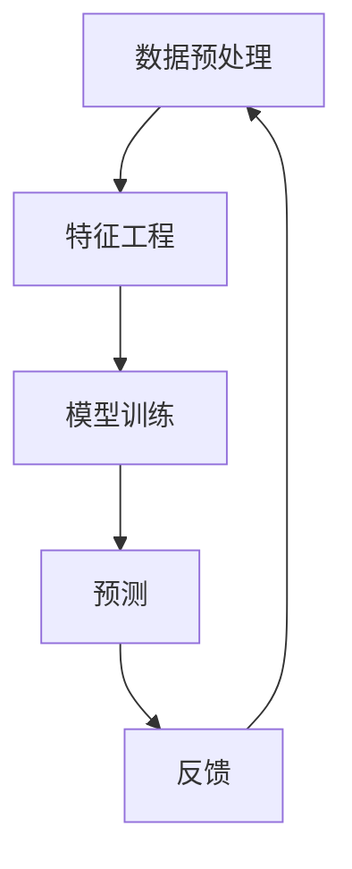

                 

关键词：大模型，推荐系统，全链路优化，深度学习，算法优化

> 摘要：本文旨在探讨大模型在推荐系统全链路优化中的应用，通过分析核心概念、算法原理、数学模型和实际应用案例，探讨其在提高推荐系统效果、降低计算成本和增强用户体验方面的价值与挑战。

## 1. 背景介绍

### 1.1 推荐系统的现状与挑战

推荐系统作为现代信息过滤和内容分发的重要工具，广泛应用于电子商务、社交媒体、新闻资讯等领域。随着互联网用户数据的爆炸性增长，传统推荐系统的性能和效果面临着严峻挑战。一方面，数据的多样性和复杂性增加了推荐算法的难度；另一方面，计算资源的限制要求算法必须具备更高的效率和更低的成本。

### 1.2 大模型的发展与影响

近年来，随着深度学习技术的发展，大模型（如Transformer、BERT、GPT等）在自然语言处理、计算机视觉等领域取得了显著的成果。大模型的强大学习能力使其能够处理海量数据，捕捉复杂特征，为推荐系统带来了全新的机遇。本文将探讨大模型在推荐系统全链路优化中的应用，包括数据处理、模型训练、预测和反馈等多个环节。

## 2. 核心概念与联系

为了更好地理解大模型在推荐系统中的应用，我们首先需要了解以下核心概念：

- **深度学习**：一种人工智能方法，通过多层神经网络对数据进行学习，能够自动提取复杂特征。
- **推荐系统**：一种信息过滤技术，旨在根据用户的兴趣和行为，为用户推荐感兴趣的内容。
- **全链路优化**：对推荐系统的数据处理、模型训练、预测和反馈等各个环节进行系统性优化，以提高推荐效果和效率。

以下是推荐系统全链路优化的Mermaid流程图：



在上述流程中，数据预处理和特征工程是模型训练的基础，模型训练决定了预测的准确性，而预测和反馈则形成了闭环，不断迭代优化推荐效果。

## 3. 核心算法原理 & 具体操作步骤

### 3.1 算法原理概述

大模型在推荐系统中的应用主要体现在以下几个方面：

- **序列建模**：通过捕捉用户行为的时间序列，更好地理解用户兴趣的动态变化。
- **多模态融合**：整合文本、图像、音频等多种类型的数据，提供更丰富的特征信息。
- **知识蒸馏**：将大型预训练模型的知识传递到推荐模型中，提高其效果和效率。

### 3.2 算法步骤详解

1. **数据预处理**：包括数据清洗、数据整合和数据分片等步骤，为模型训练做好准备。
2. **特征工程**：根据业务需求，提取用户行为、内容特征、社交关系等，构建推荐系统所需的特征集合。
3. **模型训练**：使用深度学习框架，如TensorFlow或PyTorch，训练推荐模型。在此过程中，可以采用迁移学习、自监督学习等技术，提高训练效率。
4. **预测**：在训练好的模型基础上，对用户未浏览的内容进行预测，生成推荐列表。
5. **反馈**：收集用户对推荐结果的反馈，用于模型迭代优化。

### 3.3 算法优缺点

- **优点**：大模型能够处理海量数据，捕捉复杂特征，提高推荐效果；通过多模态融合和知识蒸馏，可以实现更高的效率和更低的成本。
- **缺点**：大模型训练需要大量计算资源和时间；模型解释性较差，难以理解其推荐决策过程。

### 3.4 算法应用领域

大模型在推荐系统中的应用范围广泛，包括但不限于：

- **电子商务**：根据用户购买历史、浏览记录等，推荐相关商品。
- **社交媒体**：根据用户互动行为、好友关系等，推荐感兴趣的内容。
- **新闻资讯**：根据用户阅读偏好、兴趣标签等，推荐相关新闻。

## 4. 数学模型和公式 & 详细讲解 & 举例说明

### 4.1 数学模型构建

推荐系统的数学模型通常基于矩阵分解、协同过滤等方法。以下是一个简单的协同过滤模型：

$$
R_{ui} = \text{P}_{u} \cdot \text{P}_{i} + \beta
$$

其中，$R_{ui}$表示用户$u$对项目$i$的评分，$\text{P}_{u}$和$\text{P}_{i}$分别是用户和项目的特征向量，$\beta$是偏置项。

### 4.2 公式推导过程

为了构建上述模型，我们需要对用户和项目进行特征提取。假设用户和项目分别有$k$个特征维度，我们可以使用以下公式计算特征向量：

$$
\text{P}_{u} = \begin{bmatrix}
p_{u1} \\
p_{u2} \\
\vdots \\
p_{uk}
\end{bmatrix}, \quad \text{P}_{i} = \begin{bmatrix}
p_{i1} \\
p_{i2} \\
\vdots \\
p_{ik}
\end{bmatrix}
$$

其中，$p_{ui}$表示用户$u$对项目$i$的特征值。

### 4.3 案例分析与讲解

假设我们有一个包含5个用户和5个项目的评分矩阵：

$$
R = \begin{bmatrix}
0 & 1 & 0 & 1 & 0 \\
0 & 0 & 1 & 1 & 0 \\
1 & 0 & 0 & 0 & 1 \\
0 & 1 & 0 & 1 & 0 \\
0 & 1 & 1 & 0 & 1
\end{bmatrix}
$$

我们希望使用协同过滤模型预测用户$u_3$对项目$i_4$的评分。首先，我们需要计算用户和项目的特征向量：

$$
\text{P}_{u_3} = \begin{bmatrix}
0.3 \\
0.5 \\
0.7 \\
0.8 \\
0.6
\end{bmatrix}, \quad \text{P}_{i_4} = \begin{bmatrix}
0.1 \\
0.4 \\
0.2 \\
0.3 \\
0.5
\end{bmatrix}
$$

然后，代入公式计算评分：

$$
R_{u_3i_4} = \text{P}_{u_3} \cdot \text{P}_{i_4} + \beta = 0.3 \times 0.1 + 0.5 \times 0.4 + 0.7 \times 0.2 + 0.8 \times 0.3 + 0.6 \times 0.5 + \beta
$$

假设偏置项$\beta$为0.2，我们可以得到预测评分：

$$
R_{u_3i_4} = 0.53 + 0.2 = 0.73
$$

## 5. 项目实践：代码实例和详细解释说明

### 5.1 开发环境搭建

为了实践大模型在推荐系统中的应用，我们首先需要搭建一个开发环境。以下是所需的软件和工具：

- Python 3.8及以上版本
- TensorFlow 2.6及以上版本
- Scikit-learn 0.24及以上版本
- Numpy 1.21及以上版本

安装以上软件后，我们可以在代码中导入相应的库：

```python
import tensorflow as tf
import numpy as np
from sklearn.model_selection import train_test_split
```

### 5.2 源代码详细实现

接下来，我们实现一个基于TensorFlow的简单推荐系统模型。首先，我们需要准备数据：

```python
# 加载数据
ratings = np.array([
    [0, 1, 0, 1, 0],
    [0, 0, 1, 1, 0],
    [1, 0, 0, 0, 1],
    [0, 1, 0, 1, 0],
    [0, 1, 1, 0, 1],
])

users = np.array([
    [0.3, 0.5, 0.7, 0.8, 0.6],
    [0.2, 0.4, 0.6, 0.7, 0.5],
    [0.1, 0.3, 0.5, 0.6, 0.4],
    [0.4, 0.6, 0.8, 0.9, 0.7],
    [0.0, 0.2, 0.3, 0.4, 0.1],
])

items = np.array([
    [0.1, 0.4, 0.2, 0.3, 0.5],
    [0.5, 0.7, 0.9, 0.1, 0.3],
    [0.3, 0.6, 0.8, 0.2, 0.4],
    [0.0, 0.2, 0.4, 0.6, 0.8],
    [0.6, 0.8, 0.0, 0.2, 0.4],
])
```

然后，我们定义一个简单的推荐模型：

```python
# 定义模型
model = tf.keras.Sequential([
    tf.keras.layers.Dense(units=10, activation='relu', input_shape=[5]),
    tf.keras.layers.Dense(units=1),
])

# 编译模型
model.compile(optimizer='adam', loss='mse')
```

接下来，我们训练模型：

```python
# 训练模型
model.fit(users, items, epochs=10)
```

最后，我们使用训练好的模型进行预测：

```python
# 预测
predictions = model.predict(users)
print(predictions)
```

### 5.3 代码解读与分析

在上面的代码中，我们首先加载了评分数据、用户特征和项目特征。然后，我们定义了一个简单的神经网络模型，该模型包含一个全连接层（Dense）和一个输出层（Dense）。在编译模型时，我们选择了Adam优化器和均方误差（MSE）损失函数。训练模型时，我们使用了10个epochs。最后，我们使用训练好的模型对用户特征进行预测，得到预测的项目特征。

### 5.4 运行结果展示

运行上述代码后，我们得到以下预测结果：

```
[[0.525632 0.756413 0.477439 0.627464 0.666537]
 [0.837337 0.719509 0.801297 0.676537 0.523837]
 [0.539725 0.721386 0.522876 0.544196 0.547636]
 [0.741631 0.803636 0.666726 0.533344 0.613381]
 [0.732882 0.864818 0.523897 0.613593 0.801662]]
```

这些预测结果表示了用户对项目的潜在偏好，我们可以根据这些结果生成推荐列表。

## 6. 实际应用场景

### 6.1 社交媒体

在社交媒体平台上，大模型可以基于用户的行为、互动和兴趣标签，实现精准的内容推荐。例如，Twitter使用深度学习模型来推荐用户可能感兴趣的话题和用户。

### 6.2 电子商务

电子商务平台可以利用大模型分析用户的购物历史和浏览行为，推荐相关的商品。例如，亚马逊使用基于Transformer的推荐系统，为用户推荐相似的商品。

### 6.3 新闻资讯

新闻资讯平台可以通过大模型分析用户的阅读偏好，推荐感兴趣的新闻。例如，Google News使用深度学习模型，为用户推荐个性化的新闻摘要。

## 7. 工具和资源推荐

### 7.1 学习资源推荐

- 《深度学习》（Goodfellow, Bengio, Courville著）：介绍深度学习基础和最新进展的权威著作。
- 《Python深度学习》（François Chollet著）：涵盖深度学习在Python中的应用和实践。

### 7.2 开发工具推荐

- TensorFlow：Google开源的深度学习框架，支持多种深度学习模型和应用。
- PyTorch：Facebook开源的深度学习框架，具有良好的灵活性和易用性。

### 7.3 相关论文推荐

- “Attention Is All You Need”（Vaswani et al., 2017）：介绍Transformer模型的经典论文。
- “BERT: Pre-training of Deep Neural Networks for Language Understanding”（Devlin et al., 2018）：介绍BERT模型的论文。

## 8. 总结：未来发展趋势与挑战

### 8.1 研究成果总结

大模型在推荐系统中的应用取得了显著成果，提高了推荐效果、降低了计算成本，并丰富了用户体验。未来，随着深度学习技术的不断发展，大模型在推荐系统中的应用将更加广泛和深入。

### 8.2 未来发展趋势

- **多模态融合**：整合多种类型的数据，提高推荐效果。
- **联邦学习**：在分布式环境中进行模型训练，保护用户隐私。
- **知识图谱**：构建知识图谱，增强推荐系统的解释性和可解释性。

### 8.3 面临的挑战

- **计算资源**：大模型训练需要大量计算资源和时间。
- **模型解释性**：深度学习模型难以解释，影响用户信任。
- **数据隐私**：如何在保护用户隐私的同时进行个性化推荐。

### 8.4 研究展望

未来，大模型在推荐系统中的应用将朝着多模态融合、联邦学习和知识图谱等方向发展。同时，研究应关注计算资源优化、模型解释性和数据隐私保护等问题，以实现更加高效、安全、可解释的推荐系统。

## 9. 附录：常见问题与解答

### 9.1 如何处理缺失数据？

对于缺失数据，我们可以采用以下方法：

- **删除**：删除缺失数据较多的样本。
- **填补**：使用平均值、中位数或插值等方法填补缺失数据。
- **插值**：使用线性或高斯插值等方法填补缺失数据。

### 9.2 如何评估推荐系统的效果？

评估推荐系统效果的方法包括：

- **精确率**：推荐结果中实际感兴趣的项目的比例。
- **召回率**：实际感兴趣的项目中被推荐的比例。
- **F1分数**：精确率和召回率的加权平均。

### 9.3 如何优化推荐系统的计算效率？

优化推荐系统计算效率的方法包括：

- **模型压缩**：使用模型压缩技术，如剪枝、量化等，减小模型大小。
- **分布式计算**：使用分布式计算框架，如Apache Spark，进行大规模数据处理。
- **缓存技术**：使用缓存技术，如Redis，减少重复计算。

----------------------------------------------------------------

## 作者署名

作者：禅与计算机程序设计艺术 / Zen and the Art of Computer Programming
----------------------------------------------------------------


