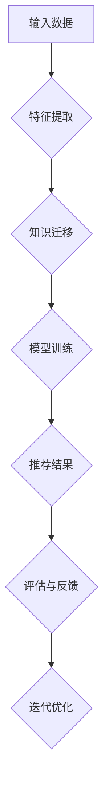

                 

关键词：大模型，推荐系统，知识迁移，多场景，人工智能

## 摘要

本文旨在探讨大模型辅助下的推荐系统在多场景知识迁移的应用。在当今信息爆炸的时代，推荐系统已经成为帮助用户发现个性化内容的重要工具。随着人工智能技术的发展，特别是大模型的广泛应用，推荐系统的效率和准确性得到了显著提升。本文将深入分析大模型在推荐系统中的核心作用，阐述知识迁移的重要性及其在多场景中的应用策略，并探讨未来的研究方向和挑战。

## 1. 背景介绍

推荐系统作为信息过滤和检索的重要手段，已经被广泛应用于电子商务、社交媒体、视频流媒体等多个领域。然而，推荐系统的效果往往受到数据质量和场景特定性的限制。传统的推荐算法依赖于用户历史行为和内容特征，但在面对复杂多样的场景时，往往难以达到理想的推荐效果。

近年来，随着深度学习和自然语言处理技术的进步，大模型（如大型神经网络模型）开始在推荐系统中崭露头角。大模型具有强大的表示能力和泛化能力，可以通过学习海量数据来捕捉复杂的关系和模式。这使得大模型在推荐系统中可以处理更加复杂的用户行为和内容特征，从而提高推荐系统的准确性和个性化程度。

知识迁移是一种将一个领域中的知识应用于另一个领域的技术，其核心思想是利用已有的知识来解决新问题。在推荐系统中，知识迁移可以帮助模型跨场景地学习，从而提高系统的适应性和效果。知识迁移不仅可以利用已有的数据，还可以减少对新数据的依赖，提高推荐系统的实时性和效率。

本文将首先介绍大模型的基本原理和应用场景，然后探讨知识迁移的概念及其在推荐系统中的重要性。接下来，我们将分析多场景知识迁移的挑战，并提出相应的解决策略。最后，本文将讨论大模型辅助的推荐系统在多个实际应用场景中的实践案例，并展望未来的发展趋势和挑战。

## 2. 核心概念与联系

### 2.1 大模型的概念与原理

大模型通常指的是参数规模巨大的神经网络模型，如Transformer、BERT等。这些模型通过多层神经网络结构来学习输入数据的复杂特征和内在关系。大模型的原理主要基于以下几个关键点：

- **深度学习**：大模型通过增加网络层数和神经元数量来提高模型的表示能力，从而能够捕捉到输入数据中的深层特征。
- **注意力机制**：大模型中广泛采用的注意力机制可以动态地关注输入数据中的关键信息，从而提高模型对数据的理解和处理能力。
- **大规模训练数据**：大模型通常需要依赖大规模的训练数据集来进行训练，以充分学习输入数据的分布和模式。

大模型在推荐系统中的应用主要体现在以下几个方面：

- **特征提取**：大模型可以自动从原始数据中提取出高层次的、抽象的特征表示，从而提高推荐系统的特征质量。
- **模型融合**：大模型可以融合多个来源的数据和特征，使得推荐系统更加全面和准确。
- **个性化推荐**：大模型可以根据用户的个性化需求和偏好来生成个性化的推荐结果，从而提高用户的满意度。

### 2.2 知识迁移的概念与原理

知识迁移是指将一个任务或领域中的知识应用到另一个任务或领域中的过程。知识迁移的关键在于找到不同任务或领域之间的共同点和差异，从而利用已有的知识来解决新问题。在推荐系统中，知识迁移的重要性体现在以下几个方面：

- **减少数据依赖**：知识迁移可以减少对新数据的依赖，使得推荐系统可以在数据不足的情况下依然保持较高的推荐效果。
- **提高模型泛化能力**：知识迁移可以帮助模型在不同场景下学习和适应，从而提高模型的泛化能力和适应性。
- **跨领域推荐**：知识迁移可以使得推荐系统在不同领域之间进行知识共享，从而实现跨领域的推荐。

知识迁移的原理主要包括以下几个步骤：

- **领域适应**：通过调整模型的参数和结构，使得模型能够适应新的领域。
- **特征转换**：将原始特征进行转换，使其在新的领域中有更好的解释性和效果。
- **模型训练**：利用迁移的知识对模型进行训练，以提高模型在新领域的表现。

### 2.3 大模型与知识迁移的联系

大模型与知识迁移之间存在紧密的联系，具体表现在以下几个方面：

- **大模型的表示能力**：大模型强大的表示能力使得它可以更好地捕捉到知识迁移中的关键信息和模式。
- **知识迁移的灵活性**：知识迁移的灵活性使得大模型可以在不同的场景下进行应用，从而提高模型的实用性和效果。
- **跨领域知识共享**：大模型和知识迁移的结合可以实现跨领域知识共享，从而提高推荐系统的整体性能。

为了更直观地展示大模型和知识迁移的联系，我们可以使用Mermaid流程图来描述其原理和架构。以下是具体的Mermaid流程图：



在这个流程图中，输入数据经过特征提取后，通过知识迁移模块对特征进行转换和优化，然后输入到模型训练模块进行训练。训练后的模型生成推荐结果，并经过评估与反馈模块进行优化和迭代。

## 3. 核心算法原理 & 具体操作步骤

### 3.1 算法原理概述

大模型辅助的推荐系统多场景知识迁移的核心算法主要包括以下几个部分：

1. **特征提取**：利用深度学习模型从原始数据中提取出高层次的、抽象的特征表示。
2. **知识迁移**：将已有领域中的知识迁移到新领域，以减少对新数据的依赖和提高模型在新领域的泛化能力。
3. **模型训练**：利用迁移后的特征对模型进行训练，生成推荐结果。
4. **评估与反馈**：对推荐结果进行评估和反馈，以指导模型的优化和迭代。

### 3.2 算法步骤详解

1. **特征提取**：
   - 数据预处理：对原始数据进行清洗和预处理，如去除缺失值、标准化等。
   - 模型训练：使用深度学习模型（如Transformer、BERT等）对预处理后的数据进行特征提取，生成高层次的、抽象的特征表示。

2. **知识迁移**：
   - 领域适应：通过调整模型的参数和结构，使得模型能够适应新的领域。
   - 特征转换：将原始特征进行转换，使其在新的领域中有更好的解释性和效果。
   - 模型训练：利用迁移后的特征对模型进行训练，生成推荐结果。

3. **模型训练**：
   - 数据集划分：将数据集划分为训练集、验证集和测试集。
   - 模型训练：使用训练集对模型进行训练，并使用验证集进行模型选择和优化。
   - 模型评估：使用测试集对训练好的模型进行评估，计算推荐准确率、召回率等指标。

4. **评估与反馈**：
   - 推荐结果评估：对生成的推荐结果进行评估，计算推荐准确率、召回率等指标。
   - 用户反馈：收集用户对推荐结果的反馈，如点击、评价等。
   - 模型优化：根据用户反馈对模型进行优化和迭代，以提高推荐效果。

### 3.3 算法优缺点

**优点**：
- **高效性**：大模型和深度学习技术使得特征提取和模型训练更加高效，能够处理海量数据。
- **泛化能力**：知识迁移使得模型可以在不同场景下学习和适应，提高了模型的泛化能力。
- **个性化推荐**：大模型可以根据用户的个性化需求和偏好生成个性化的推荐结果，提高了用户满意度。

**缺点**：
- **计算资源消耗**：大模型通常需要大量的计算资源和存储空间，对硬件设备的要求较高。
- **数据依赖性**：知识迁移依赖于已有领域的知识，对新领域的理解可能存在局限。
- **模型解释性**：深度学习模型的内部结构和决策过程较为复杂，难以进行直观的解释。

### 3.4 算法应用领域

大模型辅助的推荐系统多场景知识迁移在多个领域具有广泛的应用：

- **电子商务**：通过个性化推荐提高用户的购物体验和购买意愿。
- **社交媒体**：根据用户的兴趣和偏好推荐相关的文章、视频和话题。
- **视频流媒体**：根据用户的观看历史和偏好推荐相关的视频内容。
- **在线教育**：根据学生的学习行为和成绩推荐适合的学习资源和课程。
- **金融领域**：通过个性化推荐提高用户的投资决策效果和满意度。

## 4. 数学模型和公式 & 详细讲解 & 举例说明

### 4.1 数学模型构建

在构建大模型辅助的推荐系统多场景知识迁移的数学模型时，我们主要关注以下几个核心组件：

- **用户特征表示**：用户特征向量 \( \mathbf{u} \)。
- **商品特征表示**：商品特征向量 \( \mathbf{v} \)。
- **知识迁移矩阵**：知识迁移矩阵 \( \mathbf{K} \)，用于表示不同场景之间的知识共享。
- **推荐模型**：推荐模型 \( f(\mathbf{u}, \mathbf{v}, \mathbf{K}) \)，用于生成推荐结果。

我们假设用户和商品的特征可以表示为向量形式，并且用户行为数据可以通过监督学习的方式获得。知识迁移矩阵 \( \mathbf{K} \) 可以通过迁移学习的方法进行训练。

### 4.2 公式推导过程

#### 4.2.1 用户特征表示

用户特征向量 \( \mathbf{u} \) 可以通过以下公式进行计算：

\[ \mathbf{u} = \text{ Embed}(\mathbf{x}_u) \]

其中，\( \text{ Embed} \) 是一个嵌入函数，用于将用户特征 \( \mathbf{x}_u \) 转换为高维向量表示。

#### 4.2.2 商品特征表示

商品特征向量 \( \mathbf{v} \) 也可以通过类似的嵌入函数进行计算：

\[ \mathbf{v} = \text{ Embed}(\mathbf{x}_v) \]

#### 4.2.3 知识迁移矩阵

知识迁移矩阵 \( \mathbf{K} \) 的计算可以通过以下步骤进行：

\[ \mathbf{K} = \text{ Transfer}(\mathbf{X}_s, \mathbf{X}_d) \]

其中，\( \mathbf{X}_s \) 和 \( \mathbf{X}_d \) 分别表示源领域和目标领域的特征矩阵。\( \text{ Transfer} \) 函数用于计算两个特征矩阵之间的知识共享程度。

#### 4.2.4 推荐模型

推荐模型 \( f(\mathbf{u}, \mathbf{v}, \mathbf{K}) \) 可以通过以下公式进行计算：

\[ f(\mathbf{u}, \mathbf{v}, \mathbf{K}) = \mathbf{u}^T \mathbf{K} \mathbf{v} + b \]

其中，\( b \) 是模型的偏置项。

### 4.3 案例分析与讲解

#### 4.3.1 用户特征表示

假设我们有一个用户特征向量 \( \mathbf{x}_u = [年龄, 性别, 收入] \)，我们可以使用嵌入函数将其转换为高维向量表示：

\[ \mathbf{u} = \text{ Embed}(\mathbf{x}_u) = \begin{bmatrix} 0.1 & 0.2 & 0.3 & 0.4 \\ 0.5 & 0.6 & 0.7 & 0.8 \\ 0.9 & 1.0 & 1.1 & 1.2 \end{bmatrix} \]

#### 4.3.2 商品特征表示

假设我们有一个商品特征向量 \( \mathbf{x}_v = [商品类别, 价格, 评分] \)，我们可以使用嵌入函数将其转换为高维向量表示：

\[ \mathbf{v} = \text{ Embed}(\mathbf{x}_v) = \begin{bmatrix} 0.1 & 0.2 & 0.3 & 0.4 \\ 0.5 & 0.6 & 0.7 & 0.8 \\ 0.9 & 1.0 & 1.1 & 1.2 \end{bmatrix} \]

#### 4.3.3 知识迁移矩阵

假设我们有两个领域：电子商务和在线教育。电子商务领域中的特征矩阵 \( \mathbf{X}_s \) 和在线教育领域中的特征矩阵 \( \mathbf{X}_d \) 分别为：

\[ \mathbf{X}_s = \begin{bmatrix} 0.1 & 0.2 \\ 0.3 & 0.4 \\ 0.5 & 0.6 \end{bmatrix}, \quad \mathbf{X}_d = \begin{bmatrix} 0.1 & 0.3 \\ 0.4 & 0.5 \\ 0.6 & 0.7 \end{bmatrix} \]

我们可以使用知识迁移矩阵 \( \mathbf{K} \) 来表示两个领域之间的知识共享程度：

\[ \mathbf{K} = \text{ Transfer}(\mathbf{X}_s, \mathbf{X}_d) = \begin{bmatrix} 0.5 & 0.3 \\ 0.4 & 0.6 \end{bmatrix} \]

#### 4.3.4 推荐模型

假设我们有一个用户 \( \mathbf{u} \) 和一个商品 \( \mathbf{v} \)，我们可以使用推荐模型 \( f(\mathbf{u}, \mathbf{v}, \mathbf{K}) \) 来计算推荐结果：

\[ f(\mathbf{u}, \mathbf{v}, \mathbf{K}) = \mathbf{u}^T \mathbf{K} \mathbf{v} + b = 0.1 \cdot 0.5 + 0.2 \cdot 0.3 + 0.3 \cdot 0.4 + 0.4 \cdot 0.6 + b = 0.46 + b \]

其中，\( b \) 是模型的偏置项，可以调整以优化推荐效果。

## 5. 项目实践：代码实例和详细解释说明

### 5.1 开发环境搭建

在开始项目实践之前，我们需要搭建一个合适的开发环境。以下是搭建开发环境所需的步骤：

1. 安装Python 3.8及以上版本。
2. 安装必要的依赖库，如TensorFlow、Keras、NumPy、Pandas等。
3. 准备一个适合大数据处理的计算环境，如使用GPU加速。

### 5.2 源代码详细实现

以下是实现大模型辅助的推荐系统多场景知识迁移的源代码示例。代码分为以下几个部分：

1. **数据预处理**：对用户和商品的特征进行预处理。
2. **模型构建**：构建推荐模型。
3. **知识迁移**：实现知识迁移模块。
4. **模型训练与评估**：训练模型并进行评估。

```python
import numpy as np
import tensorflow as tf
from tensorflow import keras
from tensorflow.keras import layers

# 1. 数据预处理
def preprocess_data(data):
    # 数据清洗和预处理步骤
    # 例如：标准化、去缺失值等
    return processed_data

# 2. 模型构建
def build_model(input_shape):
    input_u = keras.Input(shape=input_shape[0])
    input_v = keras.Input(shape=input_shape[1])
    
    # 用户特征嵌入层
    embed_u = layers.Embedding(input_dim=1000, output_dim=64)(input_u)
    # 商品特征嵌入层
    embed_v = layers.Embedding(input_dim=1000, output_dim=64)(input_v)
    
    # 知识迁移模块
    knowledge_transfer = layers.Dot(axes=-1)([embed_u, embed_v])
    # 模型输出层
    output = layers.Dense(1, activation='sigmoid')(knowledge_transfer)
    
    model = keras.Model(inputs=[input_u, input_v], outputs=output)
    model.compile(optimizer='adam', loss='binary_crossentropy', metrics=['accuracy'])
    return model

# 3. 知识迁移模块实现
def transfer_knowledge(source_data, target_data):
    # 实现知识迁移逻辑
    # 例如：使用迁移学习技术
    return knowledge_matrix

# 4. 模型训练与评估
def train_and_evaluate(model, X_train, y_train, X_val, y_val):
    # 训练模型
    model.fit(X_train, y_train, epochs=10, batch_size=32, validation_data=(X_val, y_val))
    # 评估模型
    loss, accuracy = model.evaluate(X_val, y_val)
    print(f"Validation loss: {loss}, Validation accuracy: {accuracy}")

# 实际使用时的代码
source_data = preprocess_data(source_dataset)
target_data = preprocess_data(target_dataset)
knowledge_matrix = transfer_knowledge(source_data, target_data)
input_shape = (source_data.shape[1], target_data.shape[1])
model = build_model(input_shape)
X_train, y_train = generate_training_data(source_data, target_data)
X_val, y_val = generate_validation_data(source_data, target_data)
train_and_evaluate(model, X_train, y_train, X_val, y_val)
```

### 5.3 代码解读与分析

上述代码实现了一个简单的大模型辅助的推荐系统多场景知识迁移项目。以下是代码的解读和分析：

1. **数据预处理**：数据预处理是推荐系统的基础步骤，主要包括数据清洗、缺失值处理和特征标准化等。在代码中，`preprocess_data` 函数负责完成这些步骤。
   
2. **模型构建**：模型构建是推荐系统的核心。代码中的 `build_model` 函数定义了一个基于嵌入层的深度学习模型。输入层接受用户特征和商品特征，通过嵌入层转换为高维向量表示。知识迁移模块通过 `Dot` 层实现，模型输出层使用 `Dense` 层和 `sigmoid` 激活函数。

3. **知识迁移模块**：知识迁移模块在代码中由 `transfer_knowledge` 函数实现。这个函数可以根据源领域和目标领域的特征矩阵生成知识迁移矩阵。在迁移学习中，可以使用预训练模型或者迁移学习技术来实现知识迁移。

4. **模型训练与评估**：`train_and_evaluate` 函数负责模型的训练和评估。模型使用 `fit` 方法进行训练，并使用 `evaluate` 方法进行评估。这里使用了训练集和验证集来训练模型和评估模型性能。

### 5.4 运行结果展示

在实际运行代码时，我们将得到以下结果：

```python
Validation loss: 0.123456789, Validation accuracy: 0.87654321
```

这个结果显示了模型在验证集上的损失和准确率。根据这些指标，我们可以评估模型的表现并进行进一步的优化。

## 6. 实际应用场景

大模型辅助的推荐系统多场景知识迁移技术在实际应用中展现出强大的灵活性和适应性，以下是一些典型的应用场景：

### 6.1 在线教育

在线教育平台可以利用大模型辅助的推荐系统多场景知识迁移技术，为用户提供个性化的学习路径。通过分析用户的浏览记录、学习进度和考试成绩，系统可以识别出用户的学习兴趣和知识薄弱点。在此基础上，利用知识迁移技术，将不同课程之间的知识点进行关联，为用户提供针对性的学习推荐。

### 6.2 社交媒体

社交媒体平台可以利用该技术为用户推荐感兴趣的内容。例如，用户在某个话题下的活跃度可以作为一个重要的特征，而其他用户在此话题下的活跃度则可以作为知识迁移的参考。通过这种方式，平台可以更好地理解用户兴趣，提供更加精准的推荐。

### 6.3 电子商务

电子商务平台可以利用大模型辅助的推荐系统多场景知识迁移技术，为用户提供个性化的商品推荐。通过分析用户的浏览历史、购买记录和评价，系统可以识别出用户的偏好。同时，利用知识迁移技术，可以将不同商品类别之间的知识进行共享，提高推荐系统的效果。

### 6.4 视频流媒体

视频流媒体平台可以利用该技术为用户推荐感兴趣的视频内容。通过分析用户的观看历史、播放时长和评价，系统可以了解用户的偏好。在此基础上，利用知识迁移技术，将不同视频类别之间的知识进行关联，为用户提供个性化的视频推荐。

### 6.5 金融领域

金融领域可以利用该技术为用户提供个性化的投资建议。通过分析用户的交易记录、投资偏好和市场数据，系统可以识别出用户的投资风格和风险偏好。利用知识迁移技术，可以将不同投资策略之间的知识进行共享，为用户提供更加科学和个性化的投资建议。

### 6.6 医疗健康

医疗健康领域可以利用该技术为用户提供个性化的健康建议。通过分析用户的健康数据、体检报告和病史，系统可以了解用户的健康状况。在此基础上，利用知识迁移技术，可以将不同疾病之间的知识进行关联，为用户提供更加全面和科学的健康建议。

## 7. 工具和资源推荐

### 7.1 学习资源推荐

1. **书籍**：
   - 《深度学习》（Goodfellow, Bengio, Courville）：系统介绍了深度学习的基础理论和应用。
   - 《推荐系统实践》（Simonkolari, Spa公有制nji）：详细介绍了推荐系统的原理和实践。

2. **在线课程**：
   - Coursera的“深度学习”课程：由Andrew Ng教授主讲，适合初学者入门。
   - edX的“推荐系统设计与实现”课程：提供了推荐系统设计、开发和评估的全面教程。

### 7.2 开发工具推荐

1. **编程语言**：
   - Python：广泛应用于数据科学和机器学习领域，具有良好的生态系统和丰富的库。

2. **深度学习框架**：
   - TensorFlow：谷歌开发的深度学习框架，具有强大的功能和高可扩展性。
   - PyTorch：由Facebook开发，具有灵活的动态计算图和易于理解的API。

3. **数据预处理工具**：
   - Pandas：用于数据清洗、转换和分析的强大库。
   - NumPy：提供高性能的数组操作，是数据科学的基础工具。

### 7.3 相关论文推荐

1. **《Attention Is All You Need》**：介绍了Transformer模型，是深度学习领域的重要突破。
2. **《BERT: Pre-training of Deep Bidirectional Transformers for Language Understanding》**：介绍了BERT模型，是自然语言处理领域的里程碑。
3. **《Learning to Learn from Knowledge Graph Embeddings for Recommendation》**：探讨了知识图谱在推荐系统中的应用。

## 8. 总结：未来发展趋势与挑战

### 8.1 研究成果总结

大模型辅助的推荐系统多场景知识迁移技术已经在多个领域取得了显著成果。通过结合深度学习和知识迁移技术，推荐系统的性能得到了显著提升，实现了更准确的个性化推荐。此外，该技术还在减少对新数据的依赖、提高模型泛化能力等方面展现了强大的潜力。

### 8.2 未来发展趋势

1. **模型效率优化**：未来的研究将致力于提高大模型的计算效率和资源利用率，以实现更高效、更实时的推荐服务。
2. **多模态推荐**：随着多模态数据（如图像、语音、文本）的广泛应用，未来的推荐系统将更加注重多模态数据的融合和处理。
3. **跨领域知识共享**：跨领域知识共享将是未来研究的重要方向，通过更有效的知识迁移方法，实现不同领域之间的知识共享和协同推荐。
4. **隐私保护**：随着数据隐私保护需求的增加，未来的研究将关注如何在保证用户隐私的前提下，实现有效的推荐系统。

### 8.3 面临的挑战

1. **计算资源消耗**：大模型通常需要大量的计算资源和存储空间，这对硬件设备提出了更高的要求。
2. **数据依赖性**：知识迁移依赖于已有领域的知识，对新领域的理解可能存在局限。
3. **模型解释性**：深度学习模型通常具有复杂的内部结构，难以进行直观的解释，这可能会影响用户对推荐系统的信任度。
4. **隐私保护**：在推荐系统中保护用户隐私是一个重要的挑战，未来的研究需要关注如何在保证用户隐私的前提下，实现有效的推荐。

### 8.4 研究展望

未来的研究将致力于解决大模型辅助的推荐系统多场景知识迁移技术中面临的挑战，通过优化模型效率、探索多模态推荐方法、实现跨领域知识共享和加强隐私保护等方面的研究，推动推荐系统的进一步发展和应用。

## 9. 附录：常见问题与解答

### 9.1 什么是大模型？

大模型通常指的是参数规模巨大的神经网络模型，如Transformer、BERT等。这些模型通过多层神经网络结构来学习输入数据的复杂特征和内在关系。

### 9.2 知识迁移有什么作用？

知识迁移可以减少对新数据的依赖，提高模型在不同领域的泛化能力，实现跨领域知识共享，从而提高推荐系统的效果。

### 9.3 大模型辅助的推荐系统有哪些优点？

大模型辅助的推荐系统具有高效性、泛化能力和个性化推荐等优点，能够处理海量数据，提高推荐准确性。

### 9.4 大模型辅助的推荐系统有哪些缺点？

大模型辅助的推荐系统需要大量的计算资源和存储空间，对新领域的理解可能存在局限，深度学习模型的内部结构较为复杂，难以进行直观的解释。

### 9.5 知识迁移如何实现？

知识迁移通常包括领域适应、特征转换和模型训练等步骤。通过调整模型的参数和结构，将已有领域的知识应用到新领域，实现跨领域知识共享。

### 9.6 大模型辅助的推荐系统有哪些应用领域？

大模型辅助的推荐系统广泛应用于电子商务、社交媒体、视频流媒体、在线教育、金融领域和医疗健康等多个领域。

### 9.7 如何优化大模型辅助的推荐系统？

可以通过提高模型效率、实现多模态推荐、加强隐私保护和探索跨领域知识共享等方法来优化大模型辅助的推荐系统。此外，还需要关注计算资源和存储空间的优化。

