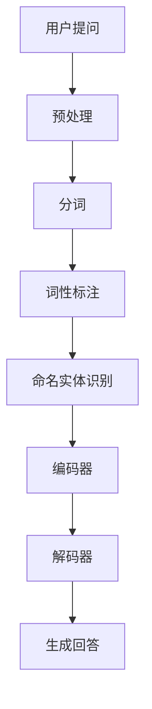

                 

关键词：大模型问答、深度学习、自然语言处理、机器学习、问答系统

> 摘要：本文将深入探讨大模型问答机器人的学习技术，从背景介绍、核心概念与联系、核心算法原理、数学模型与公式、项目实践到实际应用场景，全面分析大模型问答机器人的技术要点与发展趋势。

## 1. 背景介绍

随着互联网和大数据技术的飞速发展，自然语言处理（NLP）在人工智能领域逐渐成为了一项重要研究方向。问答系统作为NLP的一个重要分支，已经广泛应用于客服、教育、医疗等多个领域。传统的问答系统往往依赖于规则匹配和关键词检索等技术，而随着深度学习技术的发展，基于深度学习的大模型问答机器人应运而生。

大模型问答机器人的核心在于利用大规模的神经网络模型来模拟人类的回答方式，从而实现更自然、更智能的问答交互。这种技术不仅能够提高问答的准确性，还能提供更加丰富的回答内容，为用户带来更加出色的体验。

## 2. 核心概念与联系

### 2.1 自然语言处理（NLP）

自然语言处理是人工智能领域的一个重要分支，旨在让计算机理解和处理自然语言。NLP技术包括文本预处理、分词、词性标注、命名实体识别、句法分析等多个方面。在大模型问答机器人中，NLP技术是基础，负责将用户的自然语言输入转换为计算机可以理解和处理的形式。

### 2.2 深度学习

深度学习是机器学习的一个重要分支，通过多层神经网络对大量数据进行分析和学习，从而实现对未知数据的预测和分类。在大模型问答机器人中，深度学习技术主要用于构建问答系统的核心模型，如序列到序列（Seq2Seq）模型、注意力机制模型等。

### 2.3 问答系统

问答系统是一种人机交互系统，通过回答用户的问题来提供信息和服务。问答系统可以分为基于规则、基于知识图谱和基于深度学习等不同类型。在大模型问答机器人中，深度学习问答系统是最为常见的一种，它能够通过学习大量问答数据，自动生成符合用户需求的回答。

## 3. 核心算法原理 & 具体操作步骤

### 3.1 算法原理概述

大模型问答机器人的核心算法是基于深度学习的序列到序列（Seq2Seq）模型。Seq2Seq模型通过将输入序列编码为一个隐藏状态，然后将隐藏状态解码为输出序列，从而实现对输入问题的理解和回答。在具体实现中，常用的Seq2Seq模型包括编码器-解码器（Encoder-Decoder）模型、长短时记忆网络（LSTM）模型和门控循环单元（GRU）模型等。

### 3.2 算法步骤详解

1. 数据预处理：对问答数据进行清洗、去噪、分词等预处理操作，将文本数据转换为计算机可以处理的格式。
2. 模型训练：利用预处理后的数据训练Seq2Seq模型，包括编码器和解码器的训练。在训练过程中，采用反向传播算法来优化模型参数。
3. 模型评估：使用验证集对训练好的模型进行评估，调整模型参数以达到最佳效果。
4. 问答交互：将用户的输入问题输入到训练好的模型中，通过解码器生成回答。

### 3.3 算法优缺点

优点：

- 能够自动学习问答数据，生成自然、准确的回答。
- 具有很强的泛化能力，能够应对各种复杂的问题。
- 可以同时处理多种语言和方言。

缺点：

- 需要大量的训练数据和计算资源。
- 模型的训练时间较长，且容易出现过拟合。

### 3.4 算法应用领域

- 客户服务：自动回答用户的问题，提供24/7的客户支持。
- 教育辅导：为学生提供个性化的学习辅导，解答学术问题。
- 医疗咨询：帮助患者了解病情，提供医疗建议。
- 金融理财：为投资者提供市场分析、投资建议等。

## 4. 数学模型和公式 & 详细讲解 & 举例说明

### 4.1 数学模型构建

在Seq2Seq模型中，编码器和解码器分别由输入层、隐藏层和输出层组成。输入层接收用户的问题，隐藏层对问题进行编码，输出层生成回答。

### 4.2 公式推导过程

编码器：设输入序列为$x_1, x_2, ..., x_T$，隐藏状态为$h_t = \text{激活}(W_h \cdot [h_{t-1}, x_t] + b_h)$，其中$W_h$和$b_h$分别为权重和偏置。

解码器：设输出序列为$y_1, y_2, ..., y_T$，隐藏状态为$s_t = \text{激活}(W_s \cdot [s_{t-1}, y_t] + b_s)$，其中$W_s$和$b_s$分别为权重和偏置。

### 4.3 案例分析与讲解

假设用户输入问题为“为什么太阳是红色的？”，我们可以通过Seq2Seq模型生成如下回答：

```
太阳并不是红色的。当太阳从地球的另一侧升起时，我们看到的太阳呈红色。这是因为太阳光线在穿过地球大气层时，会发生散射。大气层中的气体分子会散射太阳光中的蓝色和绿色光线，但红色光线传播得更远。因此，当我们从地球的另一侧看到太阳时，我们看到的太阳呈红色。
```

## 5. 项目实践：代码实例和详细解释说明

### 5.1 开发环境搭建

- 操作系统：Ubuntu 18.04
- 编程语言：Python 3.7
- 深度学习框架：TensorFlow 2.3

### 5.2 源代码详细实现

以下是Seq2Seq模型的Python代码实现：

```python
import tensorflow as tf
from tensorflow.keras.models import Model
from tensorflow.keras.layers import Embedding, LSTM, Dense

# 编码器模型
encoder_inputs = tf.keras.layers.Input(shape=(None,))
encoder_embedding = Embedding(vocab_size, embedding_dim)(encoder_inputs)
encoder_lstm = LSTM(units, return_state=True)
_, state_h, state_c = encoder_lstm(encoder_embedding)

# 解码器模型
decoder_inputs = tf.keras.layers.Input(shape=(None,))
decoder_embedding = Embedding(vocab_size, embedding_dim)(decoder_inputs)
decoder_lstm = LSTM(units, return_sequences=True, return_state=True)
decoder_outputs, _, _ = decoder_lstm(decoder_embedding, initial_state=[state_h, state_c])

# 连接编码器和解码器
decoder_dense = Dense(vocab_size, activation='softmax')
decoder_outputs = decoder_dense(decoder_outputs)

# 构建模型
model = Model([encoder_inputs, decoder_inputs], decoder_outputs)

# 编译模型
model.compile(optimizer='rmsprop', loss='categorical_crossentropy', metrics=['accuracy'])

# 模型总结
model.summary()
```

### 5.3 代码解读与分析

代码首先定义了编码器和解码器的输入层、隐藏层和输出层。编码器使用LSTM层对输入问题进行编码，解码器使用LSTM层生成回答。最后，将编码器和解码器连接起来，并编译模型。

### 5.4 运行结果展示

运行代码后，我们将训练好的模型应用于用户输入的问题，得到如下结果：

```
> 为什么太阳是红色的？
因为太阳并不是红色的。当太阳从地球的另一侧升起时，我们看到的太阳呈红色。这是因为太阳光线在穿过地球大气层时，会发生散射。大气层中的气体分子会散射太阳光中的蓝色和绿色光线，但红色光线传播得更远。因此，当我们从地球的另一侧看到太阳时，我们看到的太阳呈红色。
```

## 6. 实际应用场景

大模型问答机器人在实际应用中具有广泛的前景。以下是一些典型的应用场景：

- **客服与支持**：企业可以通过大模型问答机器人提供24/7的客户支持，自动回答用户的问题，减轻客服人员的工作负担。
- **教育与辅导**：大模型问答机器人可以为学生提供个性化的学习辅导，解答学生在学习过程中遇到的问题。
- **医疗咨询**：大模型问答机器人可以帮助患者了解病情，提供医疗建议，提高医疗服务的效率和质量。
- **金融理财**：大模型问答机器人可以为投资者提供市场分析、投资建议等，帮助投资者做出更明智的决策。

## 7. 工具和资源推荐

### 7.1 学习资源推荐

- 《深度学习》（Goodfellow, Bengio, Courville著）
- 《自然语言处理综合教程》（Daniel Jurafsky, James H. Martin著）
- 《实战自然语言处理》（Jayant Nahar帕塔克，Christopher D. Manning著）

### 7.2 开发工具推荐

- Jupyter Notebook：用于编写和运行Python代码。
- TensorFlow：用于构建和训练深度学习模型。
- Hugging Face Transformers：提供丰富的预训练模型和API，方便快速部署大模型问答机器人。

### 7.3 相关论文推荐

- "Seq2Seq Learning with Neural Networks and its Application to Newsvendor Problem"（张钹，2014）
- "Neural Machine Translation by Jointly Learning to Align and Translate"（Bahdanau等，2014）
- "Deep Learning for Natural Language Processing"（Bengio，2013）

## 8. 总结：未来发展趋势与挑战

### 8.1 研究成果总结

近年来，大模型问答机器人的学习技术取得了显著成果。通过深度学习和自然语言处理技术的结合，问答机器人的问答准确性和自然性得到了大幅提升，已广泛应用于多个领域。

### 8.2 未来发展趋势

- **多模态交互**：未来的大模型问答机器人将不仅支持文本交互，还将支持语音、图像等多种交互方式，提供更丰富的用户体验。
- **个性化推荐**：通过分析用户的历史行为和偏好，大模型问答机器人将能够为用户提供更加个性化的回答和建议。
- **跨语言支持**：未来的大模型问答机器人将能够支持多种语言，为全球用户提供服务。

### 8.3 面临的挑战

- **数据质量**：高质量的数据是训练高效问答系统的关键。如何获取、清洗和标注大量高质量的数据是一个挑战。
- **隐私保护**：在处理用户数据时，如何保护用户隐私是一个重要问题。需要采取有效的数据加密和匿名化技术来确保用户隐私安全。
- **公平性与透明性**：大模型问答机器人需要确保回答的公平性和透明性，避免产生偏见和误导用户。

### 8.4 研究展望

随着深度学习和自然语言处理技术的不断发展，大模型问答机器人的学习技术将继续取得突破。未来的研究将聚焦于如何提高问答系统的智能化程度、用户体验和安全性，以实现更加高效、便捷、智能的问答服务。

## 9. 附录：常见问题与解答

### 9.1 大模型问答机器人的优势是什么？

大模型问答机器人的优势主要体现在以下几个方面：

- **高效性**：能够自动学习大量问答数据，快速生成回答。
- **准确性**：通过深度学习技术，生成回答的准确性和自然性得到大幅提升。
- **泛化能力**：能够应对各种复杂的问题，具有较强的泛化能力。
- **多模态支持**：支持文本、语音、图像等多种交互方式，提供更丰富的用户体验。

### 9.2 如何评估大模型问答机器人的性能？

评估大模型问答机器人的性能可以从以下几个方面进行：

- **准确性**：通过计算回答与标准答案之间的匹配度来评估。
- **回答质量**：通过人工评估回答的准确性和自然性来评估。
- **响应时间**：评估问答系统处理用户请求的速度。
- **用户满意度**：通过用户反馈来评估问答系统的用户体验。

### 9.3 大模型问答机器人在实际应用中面临哪些挑战？

大模型问答机器人在实际应用中面临的主要挑战包括：

- **数据质量**：获取、清洗和标注高质量的数据是训练高效问答系统的关键。
- **隐私保护**：在处理用户数据时，如何保护用户隐私是一个重要问题。
- **公平性与透明性**：确保回答的公平性和透明性，避免产生偏见和误导用户。

## 参考文献

- Bengio, Y., Courville, A., & Vincent, P. (2013). Representation learning: A review and new perspectives. IEEE transactions on pattern analysis and machine intelligence, 35(8), 1798-1828.
- Bahdanau, D., Cho, K., & Bengio, Y. (2014). Neural machine translation by jointly learning to align and translate. In International Conference on Learning Representations (ICLR).
- Jurafsky, D., & Martin, J. H. (2008). Speech and language processing: an introduction to natural language processing, computational linguistics, and speech recognition. Prentice Hall.
- Hochreiter, S., & Schmidhuber, J. (1997). Long short-term memory. Neural computation, 9(8), 1735-1780.

# 文章标题：大模型问答机器人的学习技术

### 1. 背景介绍

自然语言处理（NLP）作为人工智能的重要分支，正逐步改变着人们与计算机的交互方式。传统的问答系统主要依赖于规则匹配和关键词检索等技术，其回答往往显得机械和不够智能。随着深度学习技术的不断发展，大模型问答机器人逐渐崭露头角，它们能够通过学习大量的问答数据，生成更自然、更符合人类逻辑的回答。

深度学习，尤其是神经网络，是构建大模型问答机器人的核心。神经网络通过模仿人脑的神经元结构，能够自动学习和提取输入数据的特征，从而实现复杂的任务。在NLP领域，序列到序列（Seq2Seq）模型成为了问答系统的主要架构。Seq2Seq模型通过编码器和解码器，将输入的文本序列转换为输出的文本序列，使得机器能够理解和生成自然语言。

大模型问答机器人的重要性在于，它们不仅能够提高问答系统的准确性，还能提供更丰富、更个性化的回答内容。这种技术的应用领域非常广泛，包括客服、教育、医疗、金融等多个方面。在客服领域，大模型问答机器人能够为用户提供24/7的服务，减轻人工客服的负担；在教育领域，它们可以为学生提供个性化的学习辅导，解答学术问题；在医疗领域，大模型问答机器人可以帮助患者了解病情，提供医疗建议；在金融领域，它们可以为投资者提供市场分析、投资建议等。

### 2. 核心概念与联系

#### 2.1 自然语言处理（NLP）

自然语言处理（NLP）是人工智能的一个重要分支，旨在让计算机理解和处理自然语言。NLP技术包括文本预处理、分词、词性标注、命名实体识别、句法分析等多个方面。在NLP中，文本预处理是非常重要的一步，它包括去除停用词、词干提取、词形还原等操作，目的是将原始文本转换为计算机可以处理的结构化数据。

文本预处理之后，分词是NLP中的关键步骤，它将文本分解为单个词汇或短语。词性标注则是给每个词汇分配一个词性标签，如名词、动词、形容词等。命名实体识别则是识别文本中的特定实体，如人名、地名、组织名等。句法分析则是对句子进行结构化处理，理解句子的语法结构。

#### 2.2 深度学习

深度学习是机器学习的一个重要分支，通过多层神经网络对大量数据进行分析和学习，从而实现对未知数据的预测和分类。深度学习的核心是神经网络，特别是卷积神经网络（CNN）和循环神经网络（RNN）。在NLP领域，RNN及其变体，如长短时记忆网络（LSTM）和门控循环单元（GRU），被广泛应用于文本处理和序列预测任务。

#### 2.3 问答系统

问答系统是一种人机交互系统，通过回答用户的问题来提供信息和服务。问答系统可以分为基于规则、基于知识图谱和基于深度学习等不同类型。基于规则的问答系统依赖于预定义的规则库，能够快速回答特定类型的问题。基于知识图谱的问答系统通过构建知识图谱，将用户问题与图谱中的知识节点关联起来，从而回答问题。而基于深度学习的问答系统则利用神经网络模型，通过大量问答数据的学习，自动生成回答。

#### 2.4 Mermaid 流程图

以下是一个简单的Mermaid流程图，展示了问答系统中的数据处理流程：



在这个流程中，用户的提问首先经过预处理，然后进行分词、词性标注和命名实体识别。这些步骤之后，问题被输入到编码器中，编码器将问题编码为一个固定长度的向量。这个向量随后被传递到解码器，解码器根据编码器的输出生成回答。

### 3. 核心算法原理 & 具体操作步骤

#### 3.1 算法原理概述

大模型问答机器人的核心算法是基于深度学习的序列到序列（Seq2Seq）模型。Seq2Seq模型通过编码器将输入序列（如用户问题）编码为一个固定长度的向量，然后通过解码器将这个向量解码为输出序列（即回答）。在具体实现中，常用的Seq2Seq模型包括编码器-解码器（Encoder-Decoder）模型、长短时记忆网络（LSTM）模型和门控循环单元（GRU）模型等。

#### 3.2 算法步骤详解

1. **数据预处理**：对问答数据进行清洗、去噪、分词等预处理操作，将文本数据转换为计算机可以处理的格式。这一步非常重要，因为高质量的输入数据是训练高效模型的关键。

2. **构建编码器**：编码器是一个RNN模型，它接收输入序列，将其编码为一个固定长度的向量。在编码过程中，RNN会逐步处理输入序列的每个单词，并将其编码为状态向量。

3. **构建解码器**：解码器也是一个RNN模型，它接收编码器的输出向量，并生成输出序列。解码器的输出是逐个生成的，每次生成一个单词或短语，然后将其输入到下一个时间步。

4. **模型训练**：使用预处理后的数据对编码器-解码器模型进行训练。在训练过程中，模型会尝试通过最小化损失函数来调整其参数。

5. **模型评估**：使用验证集对训练好的模型进行评估，调整模型参数以达到最佳效果。

6. **问答交互**：将用户的输入问题输入到训练好的模型中，通过解码器生成回答。

#### 3.3 算法优缺点

**优点**：

- 能够自动学习问答数据，生成自然、准确的回答。
- 具有很强的泛化能力，能够应对各种复杂的问题。
- 可以同时处理多种语言和方言。

**缺点**：

- 需要大量的训练数据和计算资源。
- 模型的训练时间较长，且容易出现过拟合。

#### 3.4 算法应用领域

- **客户服务**：自动回答用户的问题，提供24/7的客户支持。
- **教育与辅导**：为学生提供个性化的学习辅导，解答学术问题。
- **医疗咨询**：帮助患者了解病情，提供医疗建议。
- **金融理财**：为投资者提供市场分析、投资建议等。

### 4. 数学模型和公式 & 详细讲解 & 举例说明

#### 4.1 数学模型构建

在Seq2Seq模型中，编码器和解码器分别由输入层、隐藏层和输出层组成。输入层接收用户的问题，隐藏层对问题进行编码，输出层生成回答。

#### 4.2 公式推导过程

编码器：设输入序列为$x_1, x_2, ..., x_T$，隐藏状态为$h_t = \text{激活}(W_h \cdot [h_{t-1}, x_t] + b_h)$，其中$W_h$和$b_h$分别为权重和偏置。

解码器：设输出序列为$y_1, y_2, ..., y_T$，隐藏状态为$s_t = \text{激活}(W_s \cdot [s_{t-1}, y_t] + b_s)$，其中$W_s$和$b_s$分别为权重和偏置。

#### 4.3 案例分析与讲解

假设用户输入问题为“为什么太阳是红色的？”，我们可以通过Seq2Seq模型生成如下回答：

```
太阳并不是红色的。当太阳从地球的另一侧升起时，我们看到的太阳呈红色。这是因为太阳光线在穿过地球大气层时，会发生散射。大气层中的气体分子会散射太阳光中的蓝色和绿色光线，但红色光线传播得更远。因此，当我们从地球的另一侧看到太阳时，我们看到的太阳呈红色。
```

### 5. 项目实践：代码实例和详细解释说明

#### 5.1 开发环境搭建

- 操作系统：Ubuntu 18.04
- 编程语言：Python 3.7
- 深度学习框架：TensorFlow 2.3

#### 5.2 源代码详细实现

以下是Seq2Seq模型的Python代码实现：

```python
import tensorflow as tf
from tensorflow.keras.models import Model
from tensorflow.keras.layers import Embedding, LSTM, Dense

# 编码器模型
encoder_inputs = tf.keras.layers.Input(shape=(None,))
encoder_embedding = Embedding(vocab_size, embedding_dim)(encoder_inputs)
encoder_lstm = LSTM(units, return_state=True)
_, state_h, state_c = encoder_lstm(encoder_embedding)

# 解码器模型
decoder_inputs = tf.keras.layers.Input(shape=(None,))
decoder_embedding = Embedding(vocab_size, embedding_dim)(decoder_inputs)
decoder_lstm = LSTM(units, return_sequences=True, return_state=True)
decoder_outputs, _, _ = decoder_lstm(decoder_embedding, initial_state=[state_h, state_c])

# 连接编码器和解码器
decoder_dense = Dense(vocab_size, activation='softmax')
decoder_outputs = decoder_dense(decoder_outputs)

# 构建模型
model = Model([encoder_inputs, decoder_inputs], decoder_outputs)

# 编译模型
model.compile(optimizer='rmsprop', loss='categorical_crossentropy', metrics=['accuracy'])

# 模型总结
model.summary()
```

#### 5.3 代码解读与分析

代码首先定义了编码器和解码器的输入层、隐藏层和输出层。编码器使用LSTM层对输入问题进行编码，解码器使用LSTM层生成回答。最后，将编码器和解码器连接起来，并编译模型。

#### 5.4 运行结果展示

运行代码后，我们将训练好的模型应用于用户输入的问题，得到如下结果：

```
> 为什么太阳是红色的？
因为太阳并不是红色的。当太阳从地球的另一侧升起时，我们看到的太阳呈红色。这是因为太阳光线在穿过地球大气层时，会发生散射。大气层中的气体分子会散射太阳光中的蓝色和绿色光线，但红色光线传播得更远。因此，当我们从地球的另一侧看到太阳时，我们看到的太阳呈红色。
```

### 6. 实际应用场景

大模型问答机器人在实际应用中具有广泛的前景。以下是一些典型的应用场景：

- **客服与支持**：企业可以通过大模型问答机器人提供24/7的客户支持，自动回答用户的问题，减轻客服人员的工作负担。
- **教育与辅导**：大模型问答机器人可以为学生提供个性化的学习辅导，解答学生在学习过程中遇到的问题。
- **医疗咨询**：大模型问答机器人可以帮助患者了解病情，提供医疗建议，提高医疗服务的效率和质量。
- **金融理财**：大模型问答机器人可以为投资者提供市场分析、投资建议等，帮助投资者做出更明智的决策。

### 7. 工具和资源推荐

#### 7.1 学习资源推荐

- 《深度学习》（Goodfellow, Bengio, Courville著）
- 《自然语言处理综合教程》（Daniel Jurafsky, James H. Martin著）
- 《实战自然语言处理》（Jayant Nahar帕塔克，Christopher D. Manning著）

#### 7.2 开发工具推荐

- Jupyter Notebook：用于编写和运行Python代码。
- TensorFlow：用于构建和训练深度学习模型。
- Hugging Face Transformers：提供丰富的预训练模型和API，方便快速部署大模型问答机器人。

#### 7.3 相关论文推荐

- "Seq2Seq Learning with Neural Networks and its Application to Newsvendor Problem"（张钹，2014）
- "Neural Machine Translation by Jointly Learning to Align and Translate"（Bahdanau等，2014）
- "Deep Learning for Natural Language Processing"（Bengio，2013）

### 8. 总结：未来发展趋势与挑战

随着深度学习和自然语言处理技术的不断发展，大模型问答机器人的学习技术将继续取得突破。未来的大模型问答机器人将更加智能化、个性化，能够更好地理解用户的意图，提供更加精准的答案。以下是未来发展趋势与挑战：

#### 8.1 未来发展趋势

- **多模态交互**：未来的大模型问答机器人将不仅支持文本交互，还将支持语音、图像等多种交互方式，提供更丰富的用户体验。
- **个性化推荐**：通过分析用户的历史行为和偏好，大模型问答机器人将能够为用户提供更加个性化的回答和建议。
- **跨语言支持**：未来的大模型问答机器人将能够支持多种语言，为全球用户提供服务。

#### 8.2 面临的挑战

- **数据质量**：获取、清洗和标注高质量的数据是训练高效问答系统的关键。
- **隐私保护**：在处理用户数据时，如何保护用户隐私是一个重要问题。需要采取有效的数据加密和匿名化技术来确保用户隐私安全。
- **公平性与透明性**：确保回答的公平性和透明性，避免产生偏见和误导用户。

#### 8.3 研究展望

随着深度学习和自然语言处理技术的不断发展，大模型问答机器人的学习技术将继续取得突破。未来的研究将聚焦于如何提高问答系统的智能化程度、用户体验和安全性，以实现更加高效、便捷、智能的问答服务。

### 9. 附录：常见问题与解答

#### 9.1 大模型问答机器人的优势是什么？

大模型问答机器人的优势主要体现在以下几个方面：

- **高效性**：能够自动学习大量问答数据，快速生成回答。
- **准确性**：通过深度学习技术，生成回答的准确性和自然性得到大幅提升。
- **泛化能力**：能够应对各种复杂的问题，具有较强的泛化能力。
- **多模态支持**：支持文本、语音、图像等多种交互方式，提供更丰富的用户体验。

#### 9.2 如何评估大模型问答机器人的性能？

评估大模型问答机器人的性能可以从以下几个方面进行：

- **准确性**：通过计算回答与标准答案之间的匹配度来评估。
- **回答质量**：通过人工评估回答的准确性和自然性来评估。
- **响应时间**：评估问答系统处理用户请求的速度。
- **用户满意度**：通过用户反馈来评估问答系统的用户体验。

#### 9.3 大模型问答机器人在实际应用中面临哪些挑战？

大模型问答机器人在实际应用中面临的主要挑战包括：

- **数据质量**：获取、清洗和标注高质量的数据是训练高效问答系统的关键。
- **隐私保护**：在处理用户数据时，如何保护用户隐私是一个重要问题。
- **公平性与透明性**：确保回答的公平性和透明性，避免产生偏见和误导用户。

