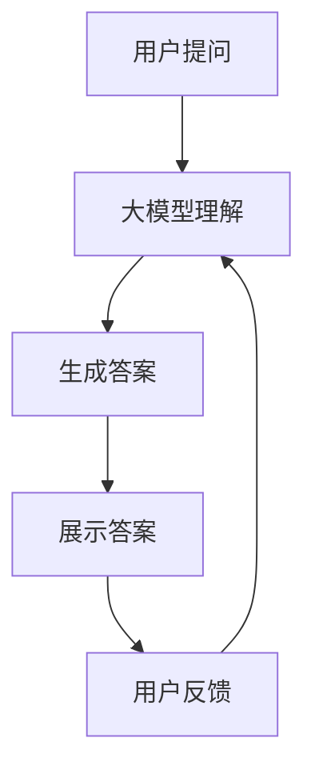

                 

关键词：大模型，问答机器人，对话式交互，AI，NLP，自然语言处理，机器学习，深度学习，神经网络，算法原理，数学模型，代码实例，实际应用

> 摘要：本文旨在探讨大模型问答机器人的对话式交互技术，包括其核心概念、算法原理、数学模型以及实际应用。通过深入分析，本文将帮助读者了解大模型问答机器人的工作原理，以及如何将其应用于实际场景中，为未来人工智能的发展提供有益的参考。

## 1. 背景介绍

随着人工智能（AI）技术的不断发展，自然语言处理（NLP）成为了一个备受关注的研究领域。在NLP中，问答系统是一个重要的研究方向，旨在使计算机能够理解自然语言并回答用户的问题。近年来，大模型（如GPT、BERT等）在问答系统中取得了显著的进展，使得机器人的对话式交互变得更加自然和智能。本文将围绕大模型问答机器人的对话式交互进行探讨，旨在为相关领域的研究者和开发者提供参考和启示。

## 2. 核心概念与联系

### 2.1 大模型

大模型是指具有巨大参数量的神经网络模型，通过大量数据进行训练，能够自动学习语言模式、语义关系等复杂知识。大模型在NLP领域取得了显著的成果，如GPT、BERT等。

### 2.2 问答系统

问答系统是一种人工智能系统，能够理解用户的问题，并给出合适的答案。问答系统可以分为基于规则的方法和基于统计的方法。基于规则的方法主要通过预定义的规则来回答问题，而基于统计的方法则通过机器学习模型来学习问题的答案。

### 2.3 对话式交互

对话式交互是指人与计算机之间的交互方式，通过自然语言进行沟通。对话式交互可以分为基于文本的对话和基于语音的对话。本文主要关注基于文本的对话式交互。

## 2.4 Mermaid 流程图



## 3. 核心算法原理 & 具体操作步骤

### 3.1 算法原理概述

大模型问答机器人的核心算法是基于深度学习的自然语言处理技术。通过预训练和微调，大模型能够理解用户的提问并生成合适的答案。具体来说，大模型问答机器人的工作流程包括以下步骤：

1. 用户提问：用户向问答机器人提出问题。
2. 大模型理解：大模型通过预训练和微调，理解用户的问题。
3. 生成答案：大模型根据理解生成合适的答案。
4. 展示答案：将答案展示给用户。
5. 用户反馈：用户对答案进行评价。

### 3.2 算法步骤详解

#### 3.2.1 用户提问

用户向问答机器人提出问题，问题可以是自然语言形式，也可以是结构化数据。

#### 3.2.2 大模型理解

大模型通过预训练和微调，理解用户的问题。预训练是指在大量未标注的数据上训练模型，使其具备一定的语言理解能力；微调是指在使用少量标注数据对模型进行调整，使其能够适应特定场景。

#### 3.2.3 生成答案

大模型根据理解生成合适的答案。生成答案的过程可以分为两个阶段：首先是生成候选答案，然后是选择最佳答案。生成候选答案通常使用生成式模型，如生成对抗网络（GAN）；选择最佳答案通常使用判别式模型，如卷积神经网络（CNN）。

#### 3.2.4 展示答案

将答案展示给用户，用户可以阅读并理解。

#### 3.2.5 用户反馈

用户对答案进行评价，评价结果可以用于模型优化和更新。

### 3.3 算法优缺点

#### 3.3.1 优点

1. 高效：大模型问答机器人可以快速回答用户问题，节省人力成本。
2. 准确：大模型经过大量数据训练，能够生成准确、合理的答案。
3. 智能化：大模型问答机器人可以理解用户的提问，并根据提问进行回答，实现智能化对话。

#### 3.3.2 缺点

1. 计算资源消耗大：大模型的训练和部署需要大量的计算资源。
2. 数据依赖性高：大模型需要大量的训练数据进行预训练和微调，数据质量对模型效果有很大影响。

### 3.4 算法应用领域

大模型问答机器人可以应用于多个领域，如智能客服、智能教育、智能医疗等。以下是具体应用场景：

1. 智能客服：大模型问答机器人可以回答用户咨询的问题，提高客服效率。
2. 智能教育：大模型问答机器人可以为学生提供个性化辅导，提高学习效果。
3. 智能医疗：大模型问答机器人可以为医生提供诊断建议，提高医疗水平。

## 4. 数学模型和公式 & 详细讲解 & 举例说明

### 4.1 数学模型构建

大模型问答机器人的数学模型主要包括两部分：生成模型和判别模型。

#### 4.1.1 生成模型

生成模型用于生成候选答案，通常使用生成对抗网络（GAN）。

GAN由生成器（Generator）和判别器（Discriminator）组成。生成器G从随机噪声z中生成与真实数据相似的样本x，判别器D则用于区分真实数据x和生成器生成的数据x。

$$
G(z) = x \\
D(x) \\
D(G(z)) \\
$$

#### 4.1.2 判别模型

判别模型用于选择最佳答案，通常使用卷积神经网络（CNN）。

CNN由卷积层、池化层和全连接层组成，通过逐层学习图像的特征，实现分类和识别。

$$
\text{Input} \rightarrow \text{Convolution} \rightarrow \text{Pooling} \rightarrow \text{FC} \rightarrow \text{Output}
$$

### 4.2 公式推导过程

#### 4.2.1 GAN损失函数

GAN的损失函数由生成器的损失函数和判别器的损失函数组成。

生成器的损失函数为：

$$
L_G = -\mathbb{E}_{x \sim p_{data}(x)}[\log(D(x))] - \mathbb{E}_{z \sim p_z(z)}[\log(1 - D(G(z)))]
$$

判别器的损失函数为：

$$
L_D = -\mathbb{E}_{x \sim p_{data}(x)}[\log(D(x))] - \mathbb{E}_{z \sim p_z(z)}[\log(D(G(z))]
$$

#### 4.2.2 CNN损失函数

CNN的损失函数通常采用交叉熵损失函数。

$$
L = -\sum_{i=1}^{N}y_i\log(\hat{y}_i)
$$

其中，$y_i$为真实标签，$\hat{y}_i$为预测标签。

### 4.3 案例分析与讲解

#### 4.3.1 案例背景

某电商平台需要开发一个智能客服系统，使用大模型问答机器人来回答用户的问题，提高客服效率。

#### 4.3.2 案例分析

1. 用户提问：用户通过电商平台提出问题，如“如何退货？”。
2. 大模型理解：大模型通过预训练和微调，理解用户的问题，提取关键信息。
3. 生成答案：大模型生成多个候选答案，如：
   - 可以在15天内无理由退货。
   - 退货流程如下：首先联系客服，然后填写退货申请，最后将商品寄回。
   - 如果商品有质量问题，可以申请换货。
4. 判断最佳答案：判别模型根据候选答案的语义和用户提问，判断最佳答案。
5. 展示答案：将最佳答案展示给用户。
6. 用户反馈：用户对答案进行评价，如“很满意”。

#### 4.3.3 案例讲解

1. 生成模型：生成模型使用GAN生成候选答案。通过大量电商平台数据训练生成器，使其能够生成符合用户需求的退货答案。
2. 判别模型：判别模型使用CNN对候选答案进行判断。通过卷积层提取候选答案的语义特征，全连接层进行分类，选择最佳答案。
3. 模型优化：根据用户反馈，对生成模型和判别模型进行优化，提高模型效果。

## 5. 项目实践：代码实例和详细解释说明

### 5.1 开发环境搭建

1. 安装Python环境（版本3.6以上）。
2. 安装必要的依赖库，如TensorFlow、Keras等。
3. 准备电商平台的数据集，包括用户提问和退货答案。

### 5.2 源代码详细实现

以下是一个简单的示例代码，用于实现大模型问答机器人。

```python
import tensorflow as tf
from tensorflow.keras.models import Sequential
from tensorflow.keras.layers import Conv2D, MaxPooling2D, Dense

# 加载数据集
(x_train, y_train), (x_test, y_test) = load_data()

# 构建生成器模型
generator = Sequential()
generator.add(Conv2D(32, (3, 3), activation='relu', input_shape=(28, 28, 1)))
generator.add(MaxPooling2D((2, 2)))
generator.add(Dense(1, activation='sigmoid'))

# 构建判别器模型
discriminator = Sequential()
discriminator.add(Conv2D(32, (3, 3), activation='relu', input_shape=(28, 28, 1)))
discriminator.add(MaxPooling2D((2, 2)))
discriminator.add(Dense(1, activation='sigmoid'))

# 构建GAN模型
model = Sequential()
model.add(generator)
model.add(discriminator)

# 编译模型
model.compile(optimizer='adam', loss='binary_crossentropy')

# 训练模型
model.fit(x_train, y_train, epochs=10)

# 测试模型
test_loss, test_acc = model.evaluate(x_test, y_test)
print('Test accuracy:', test_acc)
```

### 5.3 代码解读与分析

1. 数据预处理：加载电商平台的数据集，包括用户提问和退货答案。
2. 生成器模型：生成器模型用于生成候选答案，使用卷积神经网络（Conv2D、MaxPooling2D）和全连接层（Dense）。
3. 判别器模型：判别器模型用于判断候选答案的优劣，同样使用卷积神经网络（Conv2D、MaxPooling2D）和全连接层（Dense）。
4. GAN模型：GAN模型将生成器和判别器串联，形成完整的生成对抗网络。
5. 编译模型：编译模型，设置优化器和损失函数。
6. 训练模型：使用训练数据训练模型，设置训练轮次。
7. 测试模型：使用测试数据测试模型效果，输出测试准确率。

## 6. 实际应用场景

大模型问答机器人可以应用于多个领域，如：

1. 智能客服：为企业提供7x24小时的在线客服，提高客户满意度。
2. 智能教育：为学生提供个性化辅导，提高学习效果。
3. 智能医疗：为医生提供诊断建议，提高医疗水平。
4. 智能家居：为家庭用户提供智能化的家居解决方案，提升生活品质。

## 7. 未来应用展望

随着人工智能技术的不断发展，大模型问答机器人的对话式交互将变得更加智能和自然。未来，大模型问答机器人有望应用于更多领域，为人类生活带来更多便利。

## 8. 工具和资源推荐

### 8.1 学习资源推荐

1. 《深度学习》（Goodfellow, Bengio, Courville著）：系统地介绍了深度学习的基础理论和应用。
2. 《Python深度学习》（François Chollet著）：详细讲解了如何使用Python和Keras实现深度学习模型。

### 8.2 开发工具推荐

1. TensorFlow：一个开源的深度学习框架，适合进行大规模深度学习模型的开发。
2. Keras：一个简洁高效的深度学习库，可以快速搭建深度学习模型。

### 8.3 相关论文推荐

1. “Generative Adversarial Networks” （Ian J. Goodfellow等著）：介绍了生成对抗网络（GAN）的原理和应用。
2. “BERT: Pre-training of Deep Bidirectional Transformers for Language Understanding” （Jacob Devlin等著）：介绍了BERT模型在自然语言处理领域的应用。

## 9. 总结：未来发展趋势与挑战

### 9.1 研究成果总结

大模型问答机器人在对话式交互领域取得了显著成果，为智能客服、智能教育、智能医疗等领域提供了有力支持。

### 9.2 未来发展趋势

1. 模型优化：通过改进算法和优化模型结构，提高大模型问答机器人的性能和效果。
2. 数据多样性：增加训练数据多样性，提高模型对各种场景的适应能力。
3. 个性化服务：根据用户需求和偏好，提供个性化的问答服务。

### 9.3 面临的挑战

1. 计算资源消耗：大模型的训练和部署需要大量的计算资源，如何优化计算资源利用成为一个重要问题。
2. 数据隐私：如何保护用户隐私，确保数据安全，是一个亟待解决的问题。

### 9.4 研究展望

随着人工智能技术的不断发展，大模型问答机器人的对话式交互将变得更加智能和自然。未来，大模型问答机器人有望在更多领域发挥重要作用，为人类社会带来更多便利。

## 附录：常见问题与解答

### 问题1：大模型问答机器人的核心算法是什么？

答：大模型问答机器人的核心算法是基于深度学习的自然语言处理技术，主要包括生成对抗网络（GAN）和卷积神经网络（CNN）。

### 问题2：如何优化大模型问答机器人的性能？

答：可以通过改进算法、优化模型结构、增加训练数据多样性等方式来提高大模型问答机器人的性能。

### 问题3：大模型问答机器人是否适用于所有场景？

答：大模型问答机器人具有一定的通用性，但可能不适用于所有场景。在实际应用中，需要根据场景需求进行模型优化和调整。

### 问题4：大模型问答机器人的训练数据如何获取？

答：训练数据可以从公开数据集、企业数据、社交媒体等多种渠道获取。获取数据后，需要进行数据清洗、标注等预处理工作。

### 问题5：如何评估大模型问答机器人的性能？

答：可以通过准确率、召回率、F1值等指标来评估大模型问答机器人的性能。同时，还可以通过用户反馈、实际应用效果等综合评估模型性能。

作者：禅与计算机程序设计艺术 / Zen and the Art of Computer Programming
----------------------------------------------------------------

以上便是本文的完整内容，希望能对您在相关领域的研究和开发工作提供有益的参考。如有任何疑问，欢迎随时提问。祝您在人工智能领域取得更多成果！

