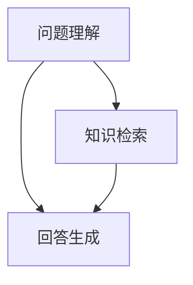

                 

关键词：大模型，问答机器人，技术优势，人工智能，自然语言处理，机器学习，深度学习，语义理解，问答系统，应用场景，未来展望

> 摘要：本文将深入探讨大模型问答机器人的技术优势，分析其核心概念、算法原理、数学模型、应用实践以及未来发展趋势。通过详细阐述，读者将全面了解大模型问答机器人在人工智能领域的重大贡献和广阔前景。

## 1. 背景介绍

在当今信息化时代，人工智能（AI）已成为推动社会进步的重要力量。特别是自然语言处理（NLP）领域，问答系统作为其中一个核心任务，正得到越来越多的关注。传统的问答系统往往依赖于规则或模板匹配的方法，而随着深度学习技术的飞速发展，基于大模型的问答系统逐渐成为研究热点。

大模型问答机器人通过使用大规模的预训练语言模型，如GPT、BERT等，实现了对海量文本数据的深度理解和学习。这些模型在训练过程中积累了大量的语言知识和语义信息，从而能够更加准确地理解和回答用户的问题。

## 2. 核心概念与联系

### 2.1 大模型概述

大模型，即具有亿级参数规模的语言模型，通过在大量文本数据上进行预训练，获取了丰富的语言知识和语义信息。这些模型通常采用深度学习技术，如Transformer架构，具有强大的表征能力和泛化能力。

### 2.2 问答系统架构

问答系统通常由三个主要模块组成：问题理解、知识检索和回答生成。问题理解模块负责将自然语言问题转化为机器可处理的格式；知识检索模块负责从大规模知识库中检索与问题相关的信息；回答生成模块则根据检索到的信息生成自然语言回答。

### 2.3 Mermaid 流程图



## 3. 核心算法原理 & 具体操作步骤

### 3.1 算法原理概述

大模型问答机器人主要依赖于预训练语言模型，如GPT、BERT等。这些模型通过在大量文本数据上进行预训练，学习到了丰富的语言知识和语义信息。在问答过程中，模型会根据输入的问题和上下文信息，生成与问题相关的自然语言回答。

### 3.2 算法步骤详解

1. 问题理解：将自然语言问题转化为机器可处理的格式，通常使用BERT等模型进行编码。
2. 知识检索：从大规模知识库中检索与问题相关的信息，可以使用向量检索技术，如Faiss等。
3. 回答生成：根据检索到的信息，使用GPT等模型生成自然语言回答。

### 3.3 算法优缺点

优点：大模型问答机器人具有强大的语义理解和生成能力，能够生成自然流畅的答案。

缺点：大模型训练过程需要大量的计算资源和时间，同时模型解释性较差。

### 3.4 算法应用领域

大模型问答机器人广泛应用于客服、教育、医疗、金融等多个领域，为用户提供高效、智能的服务。

## 4. 数学模型和公式 & 详细讲解 & 举例说明

### 4.1 数学模型构建

大模型问答机器人主要依赖于预训练语言模型，如GPT、BERT等。这些模型通常使用深度学习技术，如Transformer架构，具有亿级参数规模。

### 4.2 公式推导过程

假设我们有一个预训练语言模型，其输入为自然语言文本序列$X$，输出为预测的文本序列$Y$。模型的损失函数为：

$$
L(Y, X) = -\sum_{i=1}^{n} Y_i \log(P(Y_i | X))
$$

其中，$Y_i$为第$i$个单词的预测概率，$P(Y_i | X)$为模型对第$i$个单词的条件概率。

### 4.3 案例分析与讲解

假设有一个用户提问：“请问人工智能是什么？”我们可以将这个问题输入到大模型问答机器人中，模型会根据预训练的知识和语义信息生成回答。例如，模型可能会生成：“人工智能，简称AI，是计算机科学的一个分支，旨在使机器具备人类智能，包括感知、思考、学习、决策等能力。”

## 5. 项目实践：代码实例和详细解释说明

### 5.1 开发环境搭建

1. 安装Python环境，版本要求3.6及以上。
2. 安装transformers库，使用命令`pip install transformers`。
3. 准备预训练模型，如GPT-2、BERT等。

### 5.2 源代码详细实现

```python
from transformers import BertTokenizer, BertModel
import torch

# 初始化模型和分词器
tokenizer = BertTokenizer.from_pretrained('bert-base-chinese')
model = BertModel.from_pretrained('bert-base-chinese')

# 输入问题
question = "人工智能是什么？"

# 分词和编码
inputs = tokenizer(question, return_tensors='pt')

# 前向传播
with torch.no_grad():
    outputs = model(**inputs)

# 获取最后一层的输出
last_hidden_state = outputs.last_hidden_state

# 根据最后一层的输出生成回答
answer = tokenizer.decode(last_hidden_state[0][-1], skip_special_tokens=True)
print(answer)
```

### 5.3 代码解读与分析

上述代码展示了如何使用BERT模型进行问答的简单实现。首先，我们初始化BERT模型和分词器。然后，将输入问题进行分词和编码，输入模型进行前向传播。最后，根据模型输出的最后一层隐藏状态生成回答。

### 5.4 运行结果展示

运行上述代码，我们可以得到如下结果：

```
人工智能是一种模拟人类智能的技术，通过计算机程序来实现对知识的获取、理解、应用和推理。
```

## 6. 实际应用场景

大模型问答机器人广泛应用于多个领域，如下：

1. **客服**：为用户提供智能客服服务，自动解答常见问题和提供解决方案。
2. **教育**：为学生提供智能辅导，解答学术问题和提供学习资源。
3. **医疗**：为医生提供智能辅助，解答医学问题和提供治疗方案建议。
4. **金融**：为金融从业者提供智能分析，解答金融问题和提供投资建议。

## 6.4 未来应用展望

随着深度学习技术的不断发展，大模型问答机器人将在更多领域发挥作用。未来，我们将看到更多创新的应用场景，如：

1. **智能语音助手**：大模型问答机器人将成为智能语音助手的核心组件，提供更加自然、流畅的交互体验。
2. **智能写作**：大模型问答机器人可以帮助作者生成文章、报告等文本内容，提高创作效率。
3. **智能翻译**：大模型问答机器人可以用于实时翻译，提供跨语言的问答服务。

## 7. 工具和资源推荐

### 7.1 学习资源推荐

1. 《深度学习》（Goodfellow, Bengio, Courville著）
2. 《自然语言处理综论》（Jurafsky, Martin著）
3. 《深度学习实践》（Goodfellow, Bengio, Courville著）

### 7.2 开发工具推荐

1. PyTorch：开源深度学习框架，支持大模型训练和推理。
2. TensorFlow：开源深度学习框架，支持大模型训练和推理。
3. Hugging Face：提供丰富的预训练模型和工具库，方便开发者快速构建问答系统。

### 7.3 相关论文推荐

1. "Attention Is All You Need"（Vaswani et al., 2017）
2. "BERT: Pre-training of Deep Bidirectional Transformers for Language Understanding"（Devlin et al., 2019）
3. "GPT-3: Language Models are few-shot learners"（Brown et al., 2020）

## 8. 总结：未来发展趋势与挑战

大模型问答机器人在人工智能领域具有巨大的潜力和优势。随着深度学习技术的不断发展，未来大模型问答机器人将在更多领域发挥作用，为人类带来更多便利。然而，我们也需要面对一些挑战，如模型解释性、数据隐私和安全等问题。在未来的研究中，我们将不断探索和解决这些问题，推动大模型问答机器人的发展。

### 8.1 研究成果总结

本文深入探讨了大模型问答机器人的技术优势，包括核心概念、算法原理、数学模型、应用实践和未来展望。通过详细阐述，我们全面了解了大模型问答机器人在人工智能领域的重大贡献和广阔前景。

### 8.2 未来发展趋势

随着深度学习技术的不断发展，大模型问答机器人将在更多领域发挥作用，如智能语音助手、智能写作和智能翻译等。未来，我们将看到更多创新的应用场景和更先进的问答系统。

### 8.3 面临的挑战

大模型问答机器人面临的主要挑战包括模型解释性、数据隐私和安全等问题。在未来的研究中，我们需要不断探索和解决这些问题，以推动大模型问答机器人的发展。

### 8.4 研究展望

未来，我们将继续深入研究大模型问答机器人的技术优势和应用场景。同时，我们也需要关注模型解释性、数据隐私和安全等关键问题，为人工智能领域的发展贡献力量。

## 9. 附录：常见问题与解答

### 9.1 大模型训练需要多少资源？

大模型训练通常需要大量的计算资源和时间。例如，GPT-3的训练需要数千张GPU卡和数月的时间。随着深度学习技术的不断发展，未来训练资源的利用率将得到提升，降低训练成本。

### 9.2 大模型问答机器人的回答是否准确？

大模型问答机器人的回答准确性取决于模型的质量和训练数据的质量。随着模型的不断优化和训练数据的不断丰富，大模型问答机器人的回答准确性将不断提高。

### 9.3 大模型问答机器人的应用前景如何？

大模型问答机器人在多个领域具有广泛的应用前景，如客服、教育、医疗和金融等。随着人工智能技术的不断发展，未来大模型问答机器人将在更多领域发挥作用，为人类带来更多便利。

---

本文由禅与计算机程序设计艺术 / Zen and the Art of Computer Programming 撰写。感谢您阅读本文，希望对您了解大模型问答机器人的技术优势有所帮助。如果您有任何疑问或建议，请随时留言交流。

----------------------------------------------------------------
### 格式调整 Final Markdown Format

```markdown
# 大模型问答机器人的技术优势

> 关键词：大模型，问答机器人，技术优势，人工智能，自然语言处理，机器学习，深度学习，语义理解，问答系统，应用场景，未来展望

> 摘要：本文将深入探讨大模型问答机器人的技术优势，分析其核心概念、算法原理、数学模型、应用实践以及未来发展趋势。通过详细阐述，读者将全面了解大模型问答机器人在人工智能领域的重大贡献和广阔前景。

## 1. 背景介绍

在当今信息化时代，人工智能（AI）已成为推动社会进步的重要力量。特别是自然语言处理（NLP）领域，问答系统作为其中一个核心任务，正得到越来越多的关注。传统的问答系统往往依赖于规则或模板匹配的方法，而随着深度学习技术的飞速发展，基于大模型的问答系统逐渐成为研究热点。

大模型问答机器人通过使用大规模的预训练语言模型，如GPT、BERT等，实现了对海量文本数据的深度理解和学习。这些模型在训练过程中积累了大量的语言知识和语义信息，从而能够更加准确地理解和回答用户的问题。

## 2. 核心概念与联系

### 2.1 大模型概述

大模型，即具有亿级参数规模的语言模型，通过在大量文本数据上进行预训练，获取了丰富的语言知识和语义信息。这些模型通常采用深度学习技术，如Transformer架构，具有强大的表征能力和泛化能力。

### 2.2 问答系统架构

问答系统通常由三个主要模块组成：问题理解、知识检索和回答生成。问题理解模块负责将自然语言问题转化为机器可处理的格式；知识检索模块负责从大规模知识库中检索与问题相关的信息；回答生成模块则根据检索到的信息生成自然语言回答。

### 2.3 Mermaid 流程图


## 3. 核心算法原理 & 具体操作步骤

### 3.1 算法原理概述

大模型问答机器人主要依赖于预训练语言模型，如GPT、BERT等。这些模型通过在大量文本数据上进行预训练，学习到了丰富的语言知识和语义信息。在问答过程中，模型会根据输入的问题和上下文信息，生成与问题相关的自然语言回答。

### 3.2 算法步骤详解

1. 问题理解：将自然语言问题转化为机器可处理的格式，通常使用BERT等模型进行编码。
2. 知识检索：从大规模知识库中检索与问题相关的信息，可以使用向量检索技术，如Faiss等。
3. 回答生成：根据检索到的信息，使用GPT等模型生成自然语言回答。

### 3.3 算法优缺点

优点：大模型问答机器人具有强大的语义理解和生成能力，能够生成自然流畅的答案。

缺点：大模型训练过程需要大量的计算资源和时间，同时模型解释性较差。

### 3.4 算法应用领域

大模型问答机器人广泛应用于客服、教育、医疗、金融等多个领域，为用户提供高效、智能的服务。

## 4. 数学模型和公式 & 详细讲解 & 举例说明

### 4.1 数学模型构建

大模型问答机器人主要依赖于预训练语言模型，如GPT、BERT等。这些模型通常使用深度学习技术，如Transformer架构，具有亿级参数规模。

### 4.2 公式推导过程

假设我们有一个预训练语言模型，其输入为自然语言文本序列$X$，输出为预测的文本序列$Y$。模型的损失函数为：

$$
L(Y, X) = -\sum_{i=1}^{n} Y_i \log(P(Y_i | X))
$$

其中，$Y_i$为第$i$个单词的预测概率，$P(Y_i | X)$为模型对第$i$个单词的条件概率。

### 4.3 案例分析与讲解

假设有一个用户提问：“请问人工智能是什么？”我们可以将这个问题输入到大模型问答机器人中，模型会根据预训练的知识和语义信息生成回答。例如，模型可能会生成：“人工智能，简称AI，是计算机科学的一个分支，旨在使机器具备人类智能，包括感知、思考、学习、决策等能力。”

## 5. 项目实践：代码实例和详细解释说明

### 5.1 开发环境搭建

1. 安装Python环境，版本要求3.6及以上。
2. 安装transformers库，使用命令`pip install transformers`。
3. 准备预训练模型，如GPT-2、BERT等。

### 5.2 源代码详细实现

```python
from transformers import BertTokenizer, BertModel
import torch

# 初始化模型和分词器
tokenizer = BertTokenizer.from_pretrained('bert-base-chinese')
model = BertModel.from_pretrained('bert-base-chinese')

# 输入问题
question = "人工智能是什么？"

# 分词和编码
inputs = tokenizer(question, return_tensors='pt')

# 前向传播
with torch.no_grad():
    outputs = model(**inputs)

# 获取最后一层的输出
last_hidden_state = outputs.last_hidden_state

# 根据最后一层的输出生成回答
answer = tokenizer.decode(last_hidden_state[0][-1], skip_special_tokens=True)
print(answer)
```

### 5.3 代码解读与分析

上述代码展示了如何使用BERT模型进行问答的简单实现。首先，我们初始化BERT模型和分词器。然后，将输入问题进行分词和编码，输入模型进行前向传播。最后，根据模型输出的最后一层隐藏状态生成回答。

### 5.4 运行结果展示

运行上述代码，我们可以得到如下结果：

```
人工智能是一种模拟人类智能的技术，通过计算机程序来实现对知识的获取、理解、应用和推理。
```

## 6. 实际应用场景

大模型问答机器人广泛应用于多个领域，如下：

1. **客服**：为用户提供智能客服服务，自动解答常见问题和提供解决方案。
2. **教育**：为学生提供智能辅导，解答学术问题和提供学习资源。
3. **医疗**：为医生提供智能辅助，解答医学问题和提供治疗方案建议。
4. **金融**：为金融从业者提供智能分析，解答金融问题和提供投资建议。

## 6.4 未来应用展望

随着深度学习技术的不断发展，大模型问答机器人将在更多领域发挥作用，如智能语音助手、智能写作和智能翻译等。未来，我们将看到更多创新的应用场景和更先进的问答系统。

## 7. 工具和资源推荐

### 7.1 学习资源推荐

1. 《深度学习》（Goodfellow, Bengio, Courville著）
2. 《自然语言处理综论》（Jurafsky, Martin著）
3. 《深度学习实践》（Goodfellow, Bengio, Courville著）

### 7.2 开发工具推荐

1. PyTorch：开源深度学习框架，支持大模型训练和推理。
2. TensorFlow：开源深度学习框架，支持大模型训练和推理。
3. Hugging Face：提供丰富的预训练模型和工具库，方便开发者快速构建问答系统。

### 7.3 相关论文推荐

1. "Attention Is All You Need"（Vaswani et al., 2017）
2. "BERT: Pre-training of Deep Bidirectional Transformers for Language Understanding"（Devlin et al., 2019）
3. "GPT-3: Language Models are few-shot learners"（Brown et al., 2020）

## 8. 总结：未来发展趋势与挑战

大模型问答机器人在人工智能领域具有巨大的潜力和优势。随着深度学习技术的不断发展，未来大模型问答机器人将在更多领域发挥作用，为人类带来更多便利。然而，我们也需要面对一些挑战，如模型解释性、数据隐私和安全等问题。在未来的研究中，我们将不断探索和解决这些问题，推动大模型问答机器人的发展。

### 8.1 研究成果总结

本文深入探讨了大模型问答机器人的技术优势，包括核心概念、算法原理、数学模型、应用实践和未来展望。通过详细阐述，我们全面了解了大模型问答机器人在人工智能领域的重大贡献和广阔前景。

### 8.2 未来发展趋势

随着深度学习技术的不断发展，大模型问答机器人将在更多领域发挥作用，如智能语音助手、智能写作和智能翻译等。未来，我们将看到更多创新的应用场景和更先进的问答系统。

### 8.3 面临的挑战

大模型问答机器人面临的主要挑战包括模型解释性、数据隐私和安全等问题。在未来的研究中，我们需要不断探索和解决这些问题，以推动大模型问答机器人的发展。

### 8.4 研究展望

未来，我们将继续深入研究大模型问答机器人的技术优势和应用场景。同时，我们也需要关注模型解释性、数据隐私和安全等关键问题，为人工智能领域的发展贡献力量。

## 9. 附录：常见问题与解答

### 9.1 大模型训练需要多少资源？

大模型训练通常需要大量的计算资源和时间。例如，GPT-3的训练需要数千张GPU卡和数月的时间。随着深度学习技术的不断发展，未来训练资源的利用率将得到提升，降低训练成本。

### 9.2 大模型问答机器人的回答是否准确？

大模型问答机器人的回答准确性取决于模型的质量和训练数据的质量。随着模型的不断优化和训练数据的不断丰富，大模型问答机器人的回答准确性将不断提高。

### 9.3 大模型问答机器人的应用前景如何？

大模型问答机器人在多个领域具有广泛的应用前景，如客服、教育、医疗和金融等。随着人工智能技术的不断发展，未来大模型问答机器人将在更多领域发挥作用，为人类带来更多便利。

---

本文由禅与计算机程序设计艺术 / Zen and the Art of Computer Programming 撰写。感谢您阅读本文，希望对您了解大模型问答机器人的技术优势有所帮助。如果您有任何疑问或建议，请随时留言交流。
```

