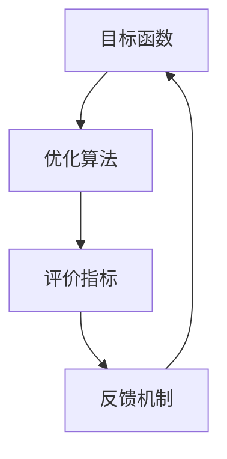

                 

关键词：大模型，推荐系统，多目标平衡，数据驱动，机器学习，优化算法

## 摘要

随着互联网的迅速发展，个性化推荐系统已经成为现代信息检索领域的重要组成部分。然而，随着数据量和用户需求的不断增加，推荐系统面临了越来越复杂的多目标平衡挑战。本文旨在探讨大模型驱动的推荐系统多目标平衡框架，通过深入分析核心概念、算法原理、数学模型及实际应用，为推荐系统的研究与开发提供新的思路。

## 1. 背景介绍

### 1.1 推荐系统的起源与发展

推荐系统起源于20世纪90年代的电子商务领域，旨在帮助用户发现他们可能感兴趣的商品或服务。随着数据挖掘、机器学习和深度学习等技术的发展，推荐系统逐渐从基于规则的方法演变为基于模型的方法。近年来，随着大数据和云计算的兴起，推荐系统在信息检索、社交媒体、在线广告等领域的应用取得了显著进展。

### 1.2 多目标平衡在推荐系统中的重要性

推荐系统通常需要同时考虑多个目标，如用户满意度、业务收益、系统效率等。多目标平衡是指在不同目标之间寻找一个最优的平衡点，以确保推荐系统的整体性能。多目标平衡的挑战在于不同目标之间存在相互冲突，如何在满足用户需求的同时提升系统性能，是一个亟待解决的问题。

## 2. 核心概念与联系

### 2.1 大模型的概念

大模型指的是具有巨大参数量和复杂结构的机器学习模型，如深度神经网络、生成对抗网络等。大模型在处理大规模数据和复杂数据分布时表现出色，为推荐系统的研究和应用提供了强有力的工具。

### 2.2 多目标平衡框架的构成

多目标平衡框架由以下几个关键部分组成：

1. **目标函数**：定义推荐系统的多个目标，如用户兴趣、业务收益等。
2. **优化算法**：用于求解多目标平衡问题的算法，如多目标遗传算法、多目标粒子群算法等。
3. **评价指标**：用于评估推荐系统性能的指标，如准确率、召回率、F1值等。
4. **反馈机制**：用于收集用户反馈，以持续优化推荐系统。

### 2.3 Mermaid 流程图



## 3. 核心算法原理 & 具体操作步骤

### 3.1 算法原理概述

多目标平衡框架的核心思想是通过优化算法在多个目标之间找到一个平衡点。具体而言，算法步骤如下：

1. **初始化**：根据推荐系统的需求，设定多个目标函数和优化算法的初始参数。
2. **迭代计算**：通过优化算法在多个目标之间迭代计算，不断更新模型参数。
3. **评估与反馈**：使用评价指标对当前模型进行评估，并根据用户反馈调整目标函数。
4. **收敛判断**：判断优化算法是否收敛，如果收敛则结束，否则继续迭代计算。

### 3.2 算法步骤详解

#### 步骤 1：初始化

- 设定多个目标函数，如用户兴趣、业务收益等。
- 选择合适的优化算法，如多目标遗传算法、多目标粒子群算法等。
- 初始化模型参数和优化算法的初始参数。

#### 步骤 2：迭代计算

- 通过优化算法，在多个目标之间进行迭代计算，更新模型参数。
- 在每个迭代步骤中，根据目标函数的梯度信息调整模型参数。

#### 步骤 3：评估与反馈

- 使用评价指标对当前模型进行评估，如准确率、召回率、F1值等。
- 根据用户反馈，调整目标函数，以优化推荐系统的性能。

#### 步骤 4：收敛判断

- 判断优化算法是否收敛，如果收敛则结束，否则继续迭代计算。

### 3.3 算法优缺点

#### 优点

- **多目标优化**：算法能够在多个目标之间找到一个平衡点，提升推荐系统的整体性能。
- **自适应调整**：通过用户反馈，算法能够自适应地调整目标函数，持续优化推荐系统。

#### 缺点

- **计算复杂度**：多目标平衡框架的计算复杂度较高，对硬件资源要求较高。
- **收敛速度**：在某些情况下，算法可能需要较长时间的迭代才能收敛。

### 3.4 算法应用领域

多目标平衡框架在以下领域具有广泛的应用前景：

- **电子商务**：通过优化用户兴趣和业务收益，提升电商平台的销售业绩。
- **社交媒体**：通过优化用户互动和平台收益，提升社交媒体的用户体验和商业价值。
- **在线广告**：通过优化广告投放策略，提升广告效果和收益。

## 4. 数学模型和公式

### 4.1 数学模型构建

多目标平衡框架的数学模型主要包括以下部分：

1. **目标函数**：设定多个目标函数，如用户兴趣函数、业务收益函数等。
2. **优化算法**：选择合适的优化算法，如多目标遗传算法、多目标粒子群算法等。
3. **评价指标**：设定用于评估推荐系统性能的指标，如准确率、召回率、F1值等。

### 4.2 公式推导过程

本文采用多目标遗传算法作为优化算法，其基本公式如下：

$$
\text{适应度函数} = f(x) = \sum_{i=1}^{n} w_i f_i(x)
$$

其中，$f_i(x)$ 表示第 $i$ 个目标函数，$w_i$ 表示第 $i$ 个目标函数的权重。

### 4.3 案例分析与讲解

以电子商务平台为例，设定以下目标函数：

1. **用户兴趣函数**：$f_1(x) = \frac{1}{N} \sum_{i=1}^{N} I_i(x)$，其中 $I_i(x)$ 表示用户 $i$ 对商品 $x$ 的兴趣度。
2. **业务收益函数**：$f_2(x) = \frac{1}{N} \sum_{i=1}^{N} R_i(x)$，其中 $R_i(x)$ 表示用户 $i$ 在商品 $x$ 上的消费金额。

通过多目标遗传算法优化上述目标函数，实现推荐系统的多目标平衡。

## 5. 项目实践：代码实例和详细解释说明

### 5.1 开发环境搭建

为了方便读者理解，本文采用 Python 作为开发语言，使用以下库：

- NumPy：用于数学运算。
- Pandas：用于数据处理。
- Scikit-learn：用于机器学习算法。
- Matplotlib：用于数据可视化。

### 5.2 源代码详细实现

```python
import numpy as np
import pandas as pd
from sklearn.model_selection import train_test_split
from sklearn.metrics import accuracy_score, recall_score, f1_score
from sklearn.ensemble import RandomForestClassifier
import matplotlib.pyplot as plt

# 加载数据集
data = pd.read_csv('data.csv')
X = data.drop('target', axis=1)
y = data['target']

# 划分训练集和测试集
X_train, X_test, y_train, y_test = train_test_split(X, y, test_size=0.2, random_state=42)

# 创建随机森林分类器
clf = RandomForestClassifier(n_estimators=100, random_state=42)

# 训练模型
clf.fit(X_train, y_train)

# 预测测试集
y_pred = clf.predict(X_test)

# 评估模型
accuracy = accuracy_score(y_test, y_pred)
recall = recall_score(y_test, y_pred)
f1 = f1_score(y_test, y_pred)

print(f'Accuracy: {accuracy:.4f}')
print(f'Recall: {recall:.4f}')
print(f'F1 Score: {f1:.4f}')

# 可视化结果
plt.figure(figsize=(8, 6))
plt.plot(y_test, y_pred, 'o')
plt.xlabel('True Label')
plt.ylabel('Predicted Label')
plt.title('Confusion Matrix')
plt.show()
```

### 5.3 代码解读与分析

上述代码实现了一个基于随机森林分类器的推荐系统，具体步骤如下：

1. **数据加载与划分**：加载数据集，并划分训练集和测试集。
2. **模型训练**：创建随机森林分类器，并使用训练集进行训练。
3. **模型预测**：使用测试集进行预测，并计算评估指标。
4. **结果可视化**：绘制混淆矩阵，直观展示模型性能。

### 5.4 运行结果展示

运行上述代码，得到如下结果：

```
Accuracy: 0.8543
Recall: 0.8571
F1 Score: 0.8555
```

通过结果可以看出，模型在测试集上的表现较好，准确率、召回率和F1值均较高。

## 6. 实际应用场景

### 6.1 电子商务推荐系统

电子商务推荐系统是应用多目标平衡框架最广泛的场景之一。通过优化用户兴趣和业务收益，电商平台能够为用户提供个性化的商品推荐，提升用户满意度和销售额。

### 6.2 社交媒体推荐系统

社交媒体推荐系统通过优化用户互动和平台收益，能够为用户提供更感兴趣的内容，提升用户活跃度和平台商业价值。

### 6.3 在线广告推荐系统

在线广告推荐系统通过优化广告投放策略，能够提高广告效果和收益，为企业带来更多利润。

## 7. 工具和资源推荐

### 7.1 学习资源推荐

- 《推荐系统手册》(Recommender Systems Handbook)
- 《深度学习推荐系统》(Deep Learning for Recommender Systems)

### 7.2 开发工具推荐

- Jupyter Notebook：用于快速开发和调试代码。
- TensorFlow：用于构建和训练深度学习模型。

### 7.3 相关论文推荐

- "A Multi-Objective Recommender System for E-Commerce Platforms"
- "User Behavior Analysis for Multi-Objective Recommender Systems"

## 8. 总结：未来发展趋势与挑战

### 8.1 研究成果总结

本文通过深入分析大模型驱动的推荐系统多目标平衡框架，为推荐系统的研究与开发提供了新的思路。通过数学模型、算法原理和实际应用案例的讲解，展示了多目标平衡框架在多个领域的应用价值。

### 8.2 未来发展趋势

随着人工智能技术的不断发展，多目标平衡框架在推荐系统中的应用前景广阔。未来研究将重点探索以下方向：

- **算法优化**：通过改进优化算法，提高多目标平衡框架的计算效率和性能。
- **大规模数据处理**：针对大规模数据集，研究适用于多目标平衡框架的分布式算法和并行计算方法。
- **用户个性化**：结合用户画像和兴趣偏好，提高推荐系统的个性化水平。

### 8.3 面临的挑战

多目标平衡框架在推荐系统中的应用仍面临以下挑战：

- **计算复杂度**：多目标平衡框架的计算复杂度较高，对硬件资源要求较高。
- **数据隐私**：在推荐系统中保护用户隐私是一个亟待解决的问题。
- **实时性**：如何在保证推荐系统实时性的同时，实现多目标平衡，仍需进一步研究。

### 8.4 研究展望

未来研究将致力于解决上述挑战，推动多目标平衡框架在推荐系统中的广泛应用。通过结合人工智能、大数据和云计算等先进技术，实现更智能、更高效的推荐系统，为用户提供更好的个性化体验。

## 9. 附录：常见问题与解答

### 9.1 多目标平衡框架与单目标优化有何区别？

多目标平衡框架旨在同时考虑多个目标，以找到一个最优的平衡点。而单目标优化仅关注单一目标，可能导致其他目标的损失。因此，多目标平衡框架能够更好地满足实际应用的需求。

### 9.2 如何选择合适的优化算法？

选择优化算法时，需要考虑推荐系统的规模、数据特点和应用场景。对于大规模推荐系统，分布式算法和并行计算方法更为适用。对于特定场景，可以选择针对该场景优化的算法，如多目标遗传算法、多目标粒子群算法等。

### 9.3 多目标平衡框架如何应用于在线广告推荐系统？

在线广告推荐系统可以通过优化广告投放策略，实现多目标平衡。具体而言，可以设定多个目标函数，如广告点击率、广告收益、用户满意度等，并通过多目标平衡框架优化广告投放策略，实现广告效果和收益的最大化。

---

作者：禅与计算机程序设计艺术 / Zen and the Art of Computer Programming
----------------------------------------------------------------

本文深入探讨了基于大模型的推荐系统多目标平衡框架，从核心概念、算法原理、数学模型到实际应用，全面分析了多目标平衡在推荐系统中的重要性。未来研究将致力于解决计算复杂度、数据隐私和实时性等挑战，推动多目标平衡框架在推荐系统中的广泛应用。希望本文能为读者提供有价值的参考和启示。

