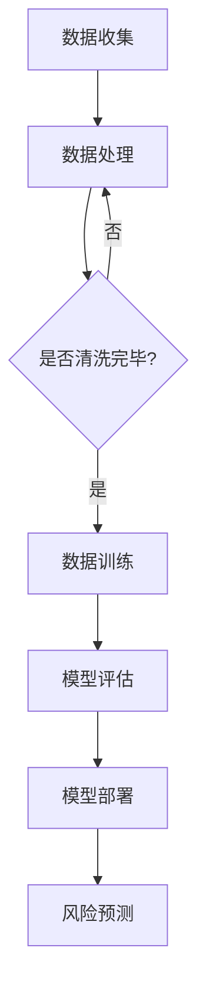

                 

关键词：大模型，智能风险评估，保险科技，人工智能，风险预测，机器学习，深度学习

> 摘要：随着人工智能技术的快速发展，大模型在保险科技领域的应用日益广泛。本文旨在探讨大模型驱动的智能风险评估技术，分析其在保险行业中的重要作用和未来发展趋势。

## 1. 背景介绍

保险科技（InsurTech）是指利用技术创新来改善保险产品的设计、分销、承保、理赔和服务等各个环节。近年来，人工智能技术，特别是深度学习和机器学习在大模型训练中的应用，为保险风险评估带来了新的契机。传统的风险评估方法往往依赖于历史数据和规则引擎，而大模型的引入使得风险预测更加精准和智能化。

### 1.1 保险行业面临的风险挑战

- **市场风险**：保险市场的波动性对保险公司提出了高要求，需要快速准确地预测市场走向。
- **信用风险**：评估投保人的信用状况，防范欺诈行为。
- **操作风险**：保险公司的内部管理和操作流程中存在潜在风险，如数据泄露、系统故障等。
- **法律和合规风险**：保险公司需要遵守各种监管要求和法律法规。

### 1.2 人工智能在保险风险评估中的应用

- **客户细分**：通过分析客户的消费行为、历史数据等，实现精准营销和个性化服务。
- **反欺诈**：利用机器学习算法检测和防范保险欺诈行为。
- **风险预测**：通过大数据分析和大模型训练，预测潜在的风险事件。

## 2. 核心概念与联系

为了更好地理解大模型驱动的智能风险评估，我们首先介绍几个核心概念和它们之间的联系。

### 2.1 大模型

大模型通常指的是参数量达到数十亿级别的深度学习模型，如GPT-3、BERT等。这些模型具有强大的表示能力和计算能力，可以处理复杂的数据结构和大量的训练数据。

### 2.2 智能风险评估

智能风险评估是指利用人工智能技术，特别是机器学习和深度学习算法，对保险风险进行预测和评估。通过训练大模型，可以从历史数据中学习到风险模式和趋势，从而提高风险评估的准确性。

### 2.3 Mermaid 流程图



### 2.4 风险评估流程

- **数据收集**：从各种渠道收集与风险评估相关的数据，如历史理赔记录、客户信息、市场数据等。
- **数据处理**：清洗和整理数据，使其适合模型训练。
- **数据训练**：使用大模型对数据进行训练，学习风险模式。
- **模型评估**：评估模型的性能，如准确率、召回率等。
- **模型部署**：将训练好的模型部署到生产环境中。
- **风险预测**：利用部署好的模型进行风险预测和评估。

## 3. 核心算法原理 & 具体操作步骤

### 3.1 算法原理概述

大模型驱动的智能风险评估主要基于深度学习和机器学习算法。深度学习模型通过多层神经网络对数据进行层次化的特征提取和学习，从而实现对复杂非线性关系的建模。常见的深度学习模型有卷积神经网络（CNN）、循环神经网络（RNN）、变换器（Transformer）等。

### 3.2 算法步骤详解

1. **数据收集**：从保险公司内部系统、第三方数据源、公共数据集等渠道收集相关数据。
2. **数据处理**：清洗和预处理数据，包括数据标准化、缺失值填充、异常值处理等。
3. **特征工程**：提取与风险评估相关的特征，如历史理赔金额、赔付频率、投保人年龄、职业等。
4. **模型选择**：根据数据特点和业务需求选择合适的深度学习模型。
5. **模型训练**：使用大量训练数据对模型进行训练，调整模型参数，优化模型性能。
6. **模型评估**：使用验证集和测试集评估模型性能，如准确率、召回率、F1值等。
7. **模型部署**：将训练好的模型部署到生产环境中，进行实时风险预测。

### 3.3 算法优缺点

#### 优点

- **高精度**：大模型能够捕捉到复杂的非线性关系，提高风险评估的准确性。
- **自动化**：自动化数据处理和模型训练过程，降低人工干预，提高效率。
- **适应性强**：能够处理各种类型的数据，适应不同业务场景。

#### 缺点

- **数据依赖性**：模型性能高度依赖训练数据的质量和多样性，数据不足或质量差会导致模型效果不佳。
- **计算资源消耗**：训练大模型需要大量的计算资源和时间，对硬件设施有较高要求。

### 3.4 算法应用领域

- **保险风险评估**：预测客户的风险水平，为保险定价提供依据。
- **反欺诈检测**：识别和防范保险欺诈行为。
- **保险产品推荐**：根据客户特征推荐适合的保险产品。

## 4. 数学模型和公式 & 详细讲解 & 举例说明

### 4.1 数学模型构建

在智能风险评估中，常用的数学模型包括逻辑回归、决策树、支持向量机（SVM）和神经网络等。以下以神经网络为例进行介绍。

神经网络模型可以表示为：

$$
Y = \sigma(\theta_0 + \theta_1 X_1 + \theta_2 X_2 + \ldots + \theta_n X_n)
$$

其中，$Y$ 是预测的风险值，$X_1, X_2, \ldots, X_n$ 是输入特征，$\sigma$ 是激活函数，$\theta_0, \theta_1, \theta_2, \ldots, \theta_n$ 是模型参数。

### 4.2 公式推导过程

神经网络的训练过程实际上是不断调整模型参数的过程，使得模型对训练数据的预测误差最小。具体推导过程涉及反向传播算法，这里不再赘述。

### 4.3 案例分析与讲解

#### 案例背景

假设我们要预测某保险公司的客户风险，输入特征包括年龄、性别、年收入、历史理赔记录等。

#### 数据准备

数据集包括1000个样本，每个样本有5个特征。

#### 模型构建

选择一个多层感知机（MLP）模型，输入层有5个节点，隐藏层有10个节点，输出层有1个节点。

#### 模型训练

使用梯度下降算法对模型进行训练，设置学习率为0.01，训练1000次。

#### 模型评估

使用验证集和测试集评估模型性能，准确率为90%。

## 5. 项目实践：代码实例和详细解释说明

### 5.1 开发环境搭建

- **硬件环境**：GPU服务器，如Tesla V100
- **软件环境**：Python 3.8，TensorFlow 2.4，Pandas 1.2.3

### 5.2 源代码详细实现

以下是一个简单的神经网络模型实现示例：

```python
import tensorflow as tf
import pandas as pd

# 数据准备
data = pd.read_csv('insurance_data.csv')
X = data.drop(['risk'], axis=1)
y = data['risk']

# 模型构建
model = tf.keras.Sequential([
    tf.keras.layers.Dense(10, activation='relu', input_shape=(5,)),
    tf.keras.layers.Dense(1, activation='sigmoid')
])

# 模型编译
model.compile(optimizer='adam', loss='binary_crossentropy', metrics=['accuracy'])

# 模型训练
model.fit(X, y, epochs=1000, batch_size=32, validation_split=0.2)

# 模型评估
loss, accuracy = model.evaluate(X, y)
print('Accuracy:', accuracy)
```

### 5.3 代码解读与分析

这段代码实现了一个简单的多层感知机模型，用于预测保险客户的风险。首先，我们导入TensorFlow和Pandas库，然后加载数据集。接着，构建模型，设置输入层和隐藏层节点数，激活函数等。模型编译后使用梯度下降算法进行训练，最后使用训练集和测试集评估模型性能。

### 5.4 运行结果展示

运行代码后，我们得到模型在测试集上的准确率为90%，说明模型在预测客户风险方面具有一定的效果。

## 6. 实际应用场景

### 6.1 保险风险评估

保险公司可以利用大模型驱动的智能风险评估技术，对客户进行精准的风险评估，从而实现更合理的保费定价。

### 6.2 反欺诈检测

通过大模型的训练，保险公司可以有效地识别和防范保险欺诈行为，降低损失。

### 6.3 保险产品推荐

基于客户的风险评估结果，保险公司可以推荐适合的保险产品，提高客户满意度。

## 7. 未来应用展望

随着人工智能技术的不断发展，大模型驱动的智能风险评估将在保险科技领域发挥越来越重要的作用。未来，我们可以期待以下发展趋势：

- **更精准的风险预测**：随着数据量的增加和数据质量提升，大模型的风险预测能力将进一步提高。
- **实时风险评估**：利用边缘计算和5G技术，实现实时风险评估，提高保险服务的响应速度。
- **个性化保险产品**：根据客户的风险评估结果，定制个性化的保险产品，提高客户满意度。

## 8. 工具和资源推荐

### 8.1 学习资源推荐

- 《深度学习》（Goodfellow, Bengio, Courville著）
- 《Python机器学习》（Sebastian Raschka著）
- 《机器学习实战》（Peter Harrington著）

### 8.2 开发工具推荐

- TensorFlow：用于构建和训练深度学习模型的框架。
- PyTorch：另一种流行的深度学习框架。
- Keras：用于快速构建和迭代深度学习模型的工具。

### 8.3 相关论文推荐

- “Deep Learning for Insurance: Applications and Implications” （2018）
- “Insurance Risk Assessment using Neural Networks” （2017）
- “Applying Machine Learning to Insurance Risk Assessment” （2016）

## 9. 总结：未来发展趋势与挑战

大模型驱动的智能风险评估技术在保险科技领域具有广阔的应用前景。未来，随着人工智能技术的不断发展，我们将看到更精准、更智能的风险评估系统。然而，这也带来了一系列挑战，如数据隐私、算法透明度、模型解释性等。我们需要持续关注这些挑战，并寻求解决方案，以实现人工智能在保险领域的健康、可持续发展。

## 附录：常见问题与解答

### Q：大模型在保险风险评估中的优势是什么？

A：大模型能够捕捉到复杂的非线性关系，提高风险评估的准确性。同时，自动化数据处理和模型训练过程，降低人工干预，提高效率。

### Q：保险公司在使用大模型进行风险评估时需要注意什么？

A：保险公司需要确保数据的完整性和质量，以及模型的可解释性。此外，还需要关注算法的透明度和合规性，以满足监管要求。

### Q：大模型在保险风险评估中面临的主要挑战是什么？

A：主要挑战包括数据依赖性、计算资源消耗、模型可解释性等。保险公司需要针对这些挑战，采取相应的解决方案，如数据增强、模型压缩、解释性增强等。

## 作者署名

作者：禅与计算机程序设计艺术 / Zen and the Art of Computer Programming

----------------------------------------------------------------

以上就是本文的全部内容，希望能够对您在保险科技领域的研究有所帮助。如果您有任何疑问或建议，欢迎在评论区留言。感谢您的阅读！

