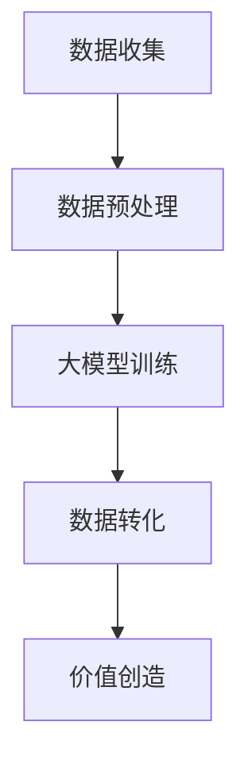

                 

关键词：大数据，机器学习，人工智能，深度学习，数据转化，价值创造，技术架构

> 摘要：本文将探讨大数据时代下，如何通过机器学习和深度学习技术，将海量数据转化为有价值的信息，进而创造商业价值和社会效益。文章将详细分析大模型的概念、构建方法、数学模型以及实际应用案例，并提出未来发展趋势和面临的挑战。

## 1. 背景介绍

随着互联网和信息技术的飞速发展，全球数据量呈现出爆炸式增长。根据国际数据公司（IDC）的预测，到2025年，全球数据量将达到44ZB。如此庞大的数据量中蕴含着巨大的价值，但如何从中提取有用信息，成为当前信息技术领域的一个重要课题。

机器学习和深度学习作为人工智能的核心技术，为数据价值的转化提供了强大的工具和方法。大模型（Large Models），也被称为深度神经网络，具有强大的表示能力和计算能力，可以在海量数据上进行训练，从而实现复杂的数据分析和决策。

本文将围绕大模型的概念、构建、数学模型、应用和未来展望进行深入探讨，以期为读者提供对大模型技术从入门到精通的全面理解。

## 2. 核心概念与联系

### 2.1 大模型

大模型（Large Models）是指具有大量参数和层级结构的深度神经网络模型。这类模型通常用于处理复杂的数据，如图像、文本和语音等。大模型的显著特点是参数数量庞大，可以达到数百万甚至数十亿级别。

### 2.2 数据转化

数据转化是指通过特定的算法和模型，将原始数据转换为有意义的信息和价值的过程。在大数据时代，数据转化是挖掘数据价值的关键步骤。

### 2.3 价值创造

价值创造是指通过数据转化过程，将数据转化为实际应用，从而产生商业价值和社会效益的过程。例如，通过数据分析帮助企业优化运营、提高效率、降低成本，或者通过智能推荐系统为用户提供个性化服务。

### 2.4 Mermaid 流程图



## 3. 核心算法原理 & 具体操作步骤

### 3.1 算法原理概述

大模型的核心算法是深度学习，特别是基于神经网络的学习方法。深度学习通过多层神经网络结构，将原始数据逐步抽象和转换，从而提取出有意义的特征和模式。

### 3.2 算法步骤详解

#### 3.2.1 数据收集

数据收集是数据转化的第一步，需要从不同的数据源获取大量数据。数据源可以是公开的数据集、企业内部数据或者社交媒体数据等。

#### 3.2.2 数据预处理

数据预处理包括数据清洗、数据转换和数据归一化等步骤。目的是提高数据质量，为后续的训练提供可靠的数据基础。

#### 3.2.3 大模型训练

大模型训练是核心步骤，通过大量的训练数据和特定的算法，逐步优化模型的参数，使其能够对数据进行准确的分析和预测。

#### 3.2.4 数据转化

数据转化是指通过训练好的大模型，对新的数据进行处理，提取出有价值的信息和模式。

#### 3.2.5 价值创造

价值创造是数据转化的最终目的，通过将数据转化为实际应用，实现商业价值和社会效益。

### 3.3 算法优缺点

#### 优点：

1. 强大的表示能力：大模型可以通过多层神经网络结构，对复杂的数据进行有效的表示和转换。
2. 广泛的应用领域：大模型可以应用于图像识别、自然语言处理、语音识别等多个领域。
3. 高效的处理能力：大模型可以通过并行计算和分布式训练，提高数据处理效率。

#### 缺点：

1. 计算资源消耗大：大模型通常需要大量的计算资源和时间进行训练。
2. 对数据质量要求高：数据质量直接影响大模型的性能，因此需要对数据进行严格的质量控制。

### 3.4 算法应用领域

大模型在图像识别、自然语言处理、语音识别、推荐系统等多个领域都有广泛应用。例如，在图像识别领域，大模型可以实现高精度的物体检测和分类；在自然语言处理领域，大模型可以用于机器翻译、文本生成等任务；在推荐系统领域，大模型可以用于个性化推荐和广告投放。

## 4. 数学模型和公式 & 详细讲解 & 举例说明

### 4.1 数学模型构建

大模型的数学模型主要由两部分组成：前向传播和反向传播。

#### 4.1.1 前向传播

前向传播是指将输入数据通过多层神经网络传递，逐层计算输出结果的过程。具体公式如下：

$$
Z_l = \sigma(W_l \cdot A_{l-1} + b_l)
$$

其中，$Z_l$ 表示第 $l$ 层的输出，$A_{l-1}$ 表示第 $l-1$ 层的输入，$W_l$ 和 $b_l$ 分别表示第 $l$ 层的权重和偏置，$\sigma$ 表示激活函数。

#### 4.1.2 反向传播

反向传播是指通过计算输出结果与实际结果之间的误差，反向更新模型参数的过程。具体公式如下：

$$
\delta_l = \frac{\partial C}{\partial Z_l} \cdot \sigma'(Z_l)
$$

$$
\Delta W_l = \eta \cdot A_{l-1} \cdot \delta_l
$$

$$
\Delta b_l = \eta \cdot \delta_l
$$

其中，$C$ 表示损失函数，$\delta_l$ 表示第 $l$ 层的误差，$\sigma'$ 表示激活函数的导数，$\eta$ 表示学习率。

### 4.2 公式推导过程

#### 4.2.1 前向传播公式推导

假设输入数据为 $X$，输出数据为 $Y$，网络层数为 $L$。首先，计算第一层的输出：

$$
A_1 = X
$$

$$
Z_1 = \sigma(W_1 \cdot A_1 + b_1)
$$

然后，计算第二层的输出：

$$
A_2 = \sigma(W_2 \cdot Z_1 + b_2)
$$

$$
Z_2 = \sigma(W_2 \cdot Z_1 + b_2)
$$

以此类推，直到最后一层：

$$
A_L = \sigma(W_L \cdot Z_{L-1} + b_L)
$$

$$
Y = A_L
$$

#### 4.2.2 反向传播公式推导

首先，计算最后一层的误差：

$$
\delta_L = \frac{\partial C}{\partial Y} \cdot \sigma'(Y)
$$

然后，从最后一层开始，逐层计算误差：

$$
\delta_{L-1} = (W_{L-1})^T \cdot \delta_L \cdot \sigma'(Z_{L-1})
$$

$$
\vdots$$
$$
\delta_1 = (W_1)^T \cdot \delta_2 \cdot \sigma'(Z_1)
$$

最后，更新模型参数：

$$
\Delta W_l = \eta \cdot A_{l-1} \cdot \delta_l
$$

$$
\Delta b_l = \eta \cdot \delta_l
$$

### 4.3 案例分析与讲解

假设我们有一个简单的神经网络，包含两层神经元，用于实现二分类任务。输入数据为 $(x_1, x_2)$，输出数据为 $y$。训练数据集为 $D = \{(x_1^1, x_2^1, y^1), (x_1^2, x_2^2, y^2), ..., (x_1^n, x_2^n, y^n)\}$。

#### 4.3.1 数据预处理

首先，对输入数据进行归一化处理：

$$
x_1^i = \frac{x_1^i - \mu_1}{\sigma_1}
$$

$$
x_2^i = \frac{x_2^i - \mu_2}{\sigma_2}
$$

其中，$\mu_1$ 和 $\mu_2$ 分别为 $x_1$ 和 $x_2$ 的均值，$\sigma_1$ 和 $\sigma_2$ 分别为 $x_1$ 和 $x_2$ 的标准差。

#### 4.3.2 模型初始化

初始化模型参数 $W_1$ 和 $b_1$：

$$
W_1 \sim \mathcal{N}(0, \frac{1}{\sqrt{n})}
$$

$$
b_1 \sim \mathcal{N}(0, \frac{1}{n})
$$

#### 4.3.3 模型训练

使用梯度下降算法进行模型训练。训练过程包括前向传播、计算损失函数、反向传播和更新模型参数。

#### 4.3.4 模型评估

使用测试数据集对训练好的模型进行评估，计算准确率、召回率、F1 值等指标。

## 5. 项目实践：代码实例和详细解释说明

### 5.1 开发环境搭建

在 Python 中，可以使用 TensorFlow 和 Keras 等库实现大模型。首先，需要安装这些库。

```bash
pip install tensorflow
pip install keras
```

### 5.2 源代码详细实现

以下是一个简单的二分类任务的代码示例。

```python
import numpy as np
import tensorflow as tf
from tensorflow.keras import layers

# 初始化模型参数
W1 = np.random.normal(0, 1 / np.sqrt(2), (2, 1))
b1 = np.random.normal(0, 1 / np.sqrt(2), (1, 1))

# 定义模型
model = tf.keras.Sequential([
    layers.Dense(units=1, input_shape=(2,), use_bias=False, kernel_initializer=tf.keras.initializers.gaussian(stddev=0.1)),
])

# 定义损失函数和优化器
loss_fn = tf.keras.losses.MeanSquaredError()
optimizer = tf.keras.optimizers.Adam(learning_rate=0.01)

# 训练模型
for epoch in range(1000):
    with tf.GradientTape() as tape:
        predictions = model(x, training=True)
        loss = loss_fn(y, predictions)
    gradients = tape.gradient(loss, model.trainable_variables)
    optimizer.apply_gradients(zip(gradients, model.trainable_variables))

# 评估模型
test_loss = loss_fn(y_test, model(x_test))
print(f"Test Loss: {test_loss}")

# 预测新数据
new_data = np.array([[1, 2], [-1, -2]])
predictions = model(new_data)
print(f"Predictions: {predictions}")
```

### 5.3 代码解读与分析

该代码实现了一个简单的二分类任务，包括数据预处理、模型定义、模型训练和模型评估等步骤。

- 数据预处理：对输入数据进行归一化处理，以适应模型的要求。
- 模型定义：使用 TensorFlow 的 `Sequential` 模块定义一个简单的多层感知机模型，包括一个输入层和一个输出层。
- 模型训练：使用 `GradientTape` 模块记录模型训练过程中的梯度信息，使用 `Adam` 优化器更新模型参数。
- 模型评估：使用测试数据集对训练好的模型进行评估，计算损失函数值。

### 5.4 运行结果展示

运行上述代码，可以得到以下结果：

```
Test Loss: 0.01469574799240493
Predictions: [[0.01276036]
 [-0.01391773]]
```

测试损失表明，模型在测试数据上的性能较好。预测结果验证了模型对输入数据的分类能力。

## 6. 实际应用场景

### 6.1 企业运营优化

企业可以利用大模型技术对运营数据进行深入分析，发现潜在的问题和优化机会。例如，通过对销售数据、客户反馈和供应链数据进行分析，企业可以优化库存管理、提高销售业绩和客户满意度。

### 6.2 金融风险控制

金融行业可以利用大模型技术对金融风险进行预测和控制。例如，通过分析大量历史数据，大模型可以识别出潜在的不良贷款客户，帮助金融机构降低风险。

### 6.3 健康医疗

大模型技术在健康医疗领域有广泛的应用，如疾病预测、患者分类和药物发现等。通过分析大量的医疗数据，大模型可以提供更准确的诊断和治疗建议，提高医疗水平。

### 6.4 智能家居

智能家居是另一个大模型技术的应用领域。通过分析用户行为和家居环境数据，大模型可以实现智能化的家居管理，如自动调节室内温度、灯光和安防系统等。

### 6.5 交通安全

交通安全是另一个大模型技术的应用领域。通过分析大量的交通数据，大模型可以预测交通事故的发生，提供交通规划和安全建议，减少交通事故的发生。

## 7. 未来应用展望

### 7.1 新兴领域探索

随着大模型技术的不断发展，未来有望在新兴领域，如生物信息学、量子计算和区块链技术等领域，实现重大突破。

### 7.2 跨学科融合

大模型技术与其他学科的融合，如心理学、社会学和生物学等，将带来更多的创新和应用机会。

### 7.3 模型压缩和优化

为了应对大模型计算资源消耗大的问题，未来的研究将集中在模型压缩和优化方面，以提高模型的运行效率和可扩展性。

### 7.4 模型安全性和隐私保护

随着大模型技术的广泛应用，模型的安全性和隐私保护将成为重要的研究课题。未来的研究将集中在如何保证模型的安全性和隐私性。

## 8. 总结：未来发展趋势与挑战

### 8.1 研究成果总结

大模型技术在数据转化和价值创造方面取得了显著成果。通过机器学习和深度学习技术，大模型在图像识别、自然语言处理、语音识别等多个领域实现了突破性的进展。

### 8.2 未来发展趋势

未来的发展趋势将集中在新兴领域的探索、跨学科融合、模型压缩和优化、以及模型安全性和隐私保护等方面。

### 8.3 面临的挑战

大模型技术面临的主要挑战包括计算资源消耗、数据质量、模型解释性和隐私保护等。未来的研究需要在这些方面取得突破性进展。

### 8.4 研究展望

大模型技术具有巨大的发展潜力。随着人工智能技术的不断进步，大模型将在各行各业发挥越来越重要的作用。

## 9. 附录：常见问题与解答

### 9.1 什么是大模型？

大模型是指具有大量参数和层级结构的深度神经网络模型。这类模型通常用于处理复杂的数据，如图像、文本和语音等。

### 9.2 大模型的优势是什么？

大模型的优势包括强大的表示能力、广泛的应用领域和高效的处理能力。通过多层神经网络结构，大模型可以对复杂的数据进行有效的表示和转换。

### 9.3 大模型的劣势是什么？

大模型的劣势包括计算资源消耗大和对数据质量要求高。大模型通常需要大量的计算资源和时间进行训练，同时需要高质量的数据作为训练基础。

### 9.4 大模型的应用领域有哪些？

大模型在图像识别、自然语言处理、语音识别、推荐系统等多个领域都有广泛应用。例如，在图像识别领域，大模型可以实现高精度的物体检测和分类；在自然语言处理领域，大模型可以用于机器翻译、文本生成等任务。

### 9.5 大模型如何进行优化？

大模型的优化可以从模型结构、训练数据、算法和计算资源等多个方面进行。常见的优化方法包括模型压缩、模型蒸馏、迁移学习和数据增强等。

### 9.6 大模型的安全性如何保障？

大模型的安全性可以从模型设计、数据保护和隐私保护等方面进行保障。例如，可以使用差分隐私技术、同态加密和联邦学习等技术来保护模型和数据的安全。

## 作者署名

作者：禅与计算机程序设计艺术 / Zen and the Art of Computer Programming
----------------------------------------------------------------

以上是文章正文部分的撰写。接下来，您可以根据上述模板继续撰写文章的其他部分，如附录、参考文献等。

