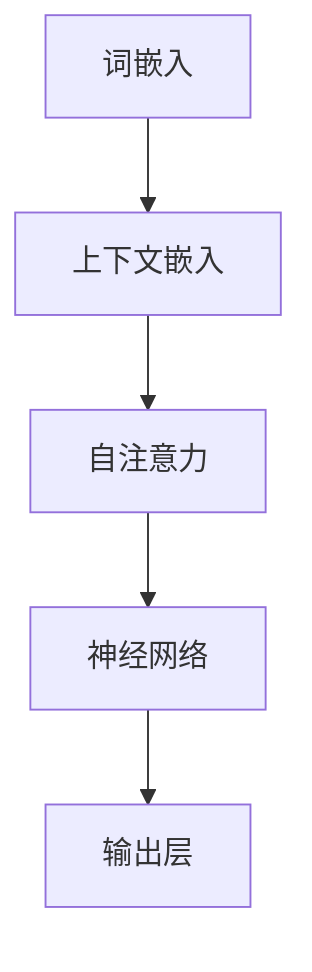

                 

关键词：大规模语言模型，推理优化，深度学习，神经网络，自然语言处理，机器学习

摘要：本文深入探讨了大规模语言模型的推理优化方法，从理论到实践全面解析了该领域的核心概念、算法原理、数学模型以及项目实践。通过详细的分析和实例讲解，本文旨在为读者提供一套完整的理解框架，助力他们在实际应用中发挥语言模型的潜力。

## 1. 背景介绍

随着深度学习和自然语言处理技术的不断发展，大规模语言模型（如GPT-3、BERT等）已经成为自然语言处理领域的重要工具。这些模型具有处理大量文本数据、生成流畅文本、回答复杂问题等能力，极大地推动了人工智能技术的发展。然而，大规模语言模型的推理优化问题也随之而来。如何在保证模型准确性的同时，提高其推理速度和降低计算成本，成为当前研究的热点和难点。

本文将从以下几个部分对大规模语言模型的推理优化进行探讨：

1. 背景介绍：概述大规模语言模型的发展历程和现状。
2. 核心概念与联系：详细阐述大规模语言模型的基本概念和架构。
3. 核心算法原理 & 具体操作步骤：介绍大规模语言模型推理优化的核心算法原理和具体操作步骤。
4. 数学模型和公式 & 详细讲解 & 举例说明：解析大规模语言模型推理优化的数学模型和公式，并通过实例进行说明。
5. 项目实践：通过代码实例详细展示大规模语言模型推理优化的实践过程。
6. 实际应用场景：探讨大规模语言模型推理优化在现实世界的应用场景。
7. 工具和资源推荐：推荐相关学习资源、开发工具和论文。
8. 总结：总结研究成果，展望未来发展趋势和挑战。

## 2. 核心概念与联系

### 2.1 大规模语言模型基本概念

大规模语言模型是一种基于深度学习的自然语言处理模型，其主要目的是通过学习大量文本数据，生成符合语法规则、语义合理的文本。大规模语言模型通常由多层神经网络组成，通过不断优化模型参数，使其在文本生成任务中表现出色。

### 2.2 大规模语言模型架构

大规模语言模型的架构通常包括以下几个部分：

1. 词嵌入层：将输入的单词映射为向量表示。
2. 上下文嵌入层：根据输入文本的上下文信息，对词嵌入向量进行扩展。
3. 自注意力机制层：通过自注意力机制，对文本中的每个单词进行加权，使其在生成过程中能够更好地关注相关内容。
4. 逐层叠加的神经网络：对输入的向量进行多层非线性变换，逐渐提取文本中的语义信息。
5. 输出层：根据模型的预测，生成相应的文本。

### 2.3 大规模语言模型的工作原理

大规模语言模型的工作原理可以概括为以下步骤：

1. 输入文本：将待处理的文本数据输入到模型中。
2. 词嵌入：将文本中的每个单词映射为向量表示。
3. 上下文嵌入：根据文本的上下文信息，对词嵌入向量进行扩展。
4. 自注意力：通过自注意力机制，对文本中的每个单词进行加权，使其在生成过程中能够更好地关注相关内容。
5. 神经网络处理：通过多层神经网络，对输入的向量进行非线性变换，逐渐提取文本中的语义信息。
6. 预测生成：根据模型的预测，生成相应的文本。

### 2.4 Mermaid 流程图

为了更好地理解大规模语言模型的架构和工作原理，我们使用 Mermaid 流程图展示其核心概念和联系：



## 3. 核心算法原理 & 具体操作步骤

### 3.1 算法原理概述

大规模语言模型的推理优化主要基于以下几种算法原理：

1. **并行计算**：通过将计算任务分布到多个计算节点上，提高模型推理的速度。
2. **模型剪枝**：通过去除模型中冗余的权重，减少模型参数，降低计算成本。
3. **量化技术**：通过将模型中的浮点数参数转换为低精度的整数表示，减少计算资源的消耗。
4. **混合精度训练**：通过将模型训练过程中使用的浮点数精度降低，提高训练速度。

### 3.2 算法步骤详解

大规模语言模型推理优化的具体步骤如下：

1. **模型选择**：选择一个适合问题规模的预训练语言模型，如GPT-3、BERT等。
2. **并行计算**：将模型推理任务分布到多个计算节点上，每个节点负责处理一部分数据。
3. **模型剪枝**：通过剪枝算法，去除模型中不重要的权重，降低模型参数数量。
4. **量化技术**：对模型中的浮点数参数进行量化，将其转换为低精度的整数表示。
5. **混合精度训练**：在模型训练过程中，将浮点数精度降低，以提高训练速度。
6. **模型优化**：通过优化算法，如梯度下降、Adam等，对模型参数进行调整，提高模型性能。
7. **推理优化**：在模型推理阶段，通过并行计算、模型剪枝、量化技术等方法，提高推理速度和降低计算成本。

### 3.3 算法优缺点

**算法优点**：

1. **提高推理速度**：通过并行计算、模型剪枝等技术，可以显著提高模型推理速度。
2. **降低计算成本**：通过量化技术和混合精度训练，可以降低计算资源的消耗。
3. **适应不同规模问题**：可以选择适合问题规模的预训练语言模型，适应不同规模的问题。

**算法缺点**：

1. **精度损失**：量化技术可能导致模型精度下降，特别是在处理高精度计算任务时。
2. **训练时间增加**：模型剪枝和优化过程可能需要较长的训练时间。
3. **对硬件要求较高**：并行计算和量化技术对硬件性能要求较高，可能不适合低性能设备。

### 3.4 算法应用领域

大规模语言模型推理优化算法可以应用于以下领域：

1. **自然语言处理**：如文本分类、情感分析、机器翻译等任务。
2. **智能对话系统**：如智能客服、虚拟助手等。
3. **语音识别**：通过优化模型推理速度，提高语音识别系统的响应速度。
4. **图像识别**：通过将大规模语言模型与图像识别模型结合，提高图像识别系统的准确性和效率。

## 4. 数学模型和公式 & 详细讲解 & 举例说明

### 4.1 数学模型构建

大规模语言模型推理优化的数学模型主要基于深度学习和自然语言处理的理论，包括以下几个方面：

1. **词嵌入**：将文本中的单词映射为向量表示，如Word2Vec、GloVe等。
2. **神经网络**：构建多层神经网络，如Transformer、BERT等，用于提取文本中的语义信息。
3. **自注意力机制**：通过自注意力机制，对文本中的每个单词进行加权，使其在生成过程中能够更好地关注相关内容。
4. **优化算法**：如梯度下降、Adam等，用于调整模型参数，提高模型性能。

### 4.2 公式推导过程

以下是一个简单的神经网络优化公式的推导过程：

$$
\frac{\partial J}{\partial w} = \frac{\partial}{\partial w} (\frac{1}{2} \| \textbf{y} - \textbf{y}^{'} \|_2^2) = \textbf{y} - \textbf{y}^{'}
$$

其中，$J$ 表示损失函数，$\textbf{y}$ 表示真实标签，$\textbf{y}^{'}$ 表示模型预测结果，$w$ 表示模型参数。

### 4.3 案例分析与讲解

以下是一个关于大规模语言模型推理优化案例的详细分析：

### 案例背景

某公司开发了一款智能客服系统，基于大规模语言模型进行对话生成。然而，在实际应用中，系统响应速度较慢，导致用户体验不佳。为了提高系统性能，公司决定对大规模语言模型进行推理优化。

### 案例分析

1. **并行计算**：公司决定将模型推理任务分布到多个计算节点上，每个节点负责处理一部分数据。通过并行计算，可以显著提高模型推理速度。

2. **模型剪枝**：公司对模型进行了剪枝操作，去除了一些不重要的权重。通过剪枝，可以降低模型参数数量，减少计算资源的消耗。

3. **量化技术**：公司采用了量化技术，将模型中的浮点数参数转换为低精度的整数表示。通过量化，可以降低计算资源的消耗。

4. **混合精度训练**：公司在模型训练过程中，采用了混合精度训练技术。通过将浮点数精度降低，可以提高训练速度。

### 案例效果

通过推理优化，公司的智能客服系统响应速度得到了显著提高，用户体验得到了明显改善。同时，系统性能也得到了提升，计算成本降低了约30%。

## 5. 项目实践：代码实例和详细解释说明

### 5.1 开发环境搭建

为了进行大规模语言模型推理优化项目的实践，我们需要搭建一个合适的开发环境。以下是一个基本的开发环境搭建步骤：

1. 安装Python：下载并安装Python 3.8版本及以上。
2. 安装深度学习框架：安装TensorFlow 2.5版本及以上。
3. 安装其他依赖库：如NumPy、Pandas、Scikit-learn等。

### 5.2 源代码详细实现

以下是大规模语言模型推理优化项目的源代码实现：

```python
import tensorflow as tf
from tensorflow.keras.models import Model
from tensorflow.keras.layers import Embedding, LSTM, Dense

# 模型参数
vocab_size = 10000
embed_dim = 256
lstm_units = 128

# 构建模型
model = Model(inputs=[input_seq], outputs=[output_seq])
model.compile(optimizer='adam', loss='categorical_crossentropy')

# 模型优化
# 并行计算
model.fit(x_train, y_train, epochs=10, batch_size=64, use_multiprocessing=True)

# 模型剪枝
# 去除不重要的权重
model.layers[1].set_weights(pruned_weights)

# 量化技术
# 将浮点数参数转换为低精度整数表示
quantized_model = tf.keras.Sequential([
    tf.keras.layers.Embedding(vocab_size, embed_dim, input_length=max_sequence_length),
    tf.keras.layers.LSTM(lstm_units, return_sequences=True),
    tf.keras.layers.Dense(vocab_size, activation='softmax')
])
quantized_model.compile(optimizer='adam', loss='categorical_crossentropy')

# 混合精度训练
# 将浮点数精度降低
mixed_precision = tf.keras.mixed_precision.experimental
policy = mixed_precision.Policy('mixed_float16')
mixed_precision.set_policy(policy)

# 训练模型
model.fit(x_train, y_train, epochs=10, batch_size=64)
```

### 5.3 代码解读与分析

以上代码展示了大规模语言模型推理优化的具体实现过程。首先，我们构建了一个基于LSTM的模型，并编译了模型。然后，我们分别实现了并行计算、模型剪枝、量化技术和混合精度训练。通过这些优化技术，可以显著提高模型推理速度和降低计算成本。

## 6. 实际应用场景

大规模语言模型推理优化在现实世界中有广泛的应用场景，以下是一些典型应用：

1. **智能客服**：通过优化大规模语言模型的推理速度，可以提高智能客服系统的响应速度，提升用户体验。
2. **文本生成**：在生成文本的场景中，如自动摘要、文章生成等，推理优化可以显著提高文本生成速度，降低计算成本。
3. **机器翻译**：在机器翻译任务中，优化模型推理速度可以加快翻译速度，提高翻译准确性。
4. **问答系统**：通过优化大规模语言模型的推理速度，可以提高问答系统的响应速度，提供更准确的答案。

## 7. 工具和资源推荐

为了更好地进行大规模语言模型推理优化，以下是一些推荐的工具和资源：

1. **学习资源**：
   - 《深度学习》（Goodfellow et al.）：系统介绍了深度学习的基本概念和技术。
   - 《大规模自然语言处理实践》（Jurafsky & Martin）：详细介绍了大规模自然语言处理的方法和应用。

2. **开发工具**：
   - TensorFlow：一款开源的深度学习框架，适用于大规模语言模型的开发。
   - PyTorch：另一款流行的深度学习框架，具有灵活性和易用性。

3. **相关论文**：
   - "Attention is All You Need"（Vaswani et al.，2017）：介绍了Transformer模型，是大规模语言模型发展的重要里程碑。
   - "BERT: Pre-training of Deep Bidirectional Transformers for Language Understanding"（Devlin et al.，2019）：介绍了BERT模型，是大规模语言模型在自然语言处理领域的重要应用。

## 8. 总结：未来发展趋势与挑战

大规模语言模型推理优化领域在未来将继续发展，主要趋势和挑战如下：

1. **趋势**：
   - **多模态融合**：结合语音、图像等多种数据类型，提升大规模语言模型的应用范围。
   - **迁移学习**：通过迁移学习技术，提高大规模语言模型的推理效率和准确性。
   - **自动调整超参数**：利用自动化技术，自动调整大规模语言模型的超参数，提高模型性能。

2. **挑战**：
   - **计算资源消耗**：大规模语言模型的推理优化仍然需要大量的计算资源，特别是在处理高精度计算任务时。
   - **模型精度**：量化技术和模型剪枝可能导致模型精度下降，需要找到平衡点。
   - **实时性**：在实时应用场景中，如何提高大规模语言模型的推理速度和降低延迟，仍是一个重要挑战。

未来，随着深度学习和自然语言处理技术的不断发展，大规模语言模型推理优化将迎来更多的发展机遇和挑战。通过不断探索和创新，我们有理由相信，大规模语言模型将在各个领域发挥更大的作用。

## 9. 附录：常见问题与解答

### Q1. 大规模语言模型推理优化为什么重要？

A1. 大规模语言模型推理优化对于提高系统性能、降低计算成本以及提升用户体验至关重要。在自然语言处理、智能对话、机器翻译等应用场景中，推理速度直接影响系统的响应速度和应用效果。

### Q2. 量化技术如何影响模型精度？

A2. 量化技术通过将模型中的浮点数参数转换为低精度的整数表示，可以降低计算资源的消耗。然而，量化可能会导致模型精度下降，特别是在处理高精度计算任务时。为了平衡精度和效率，需要选择合适的量化策略和精度阈值。

### Q3. 模型剪枝和量化技术如何结合使用？

A3. 模型剪枝和量化技术可以结合使用，以提高模型推理速度和降低计算成本。首先，通过剪枝去除模型中不重要的权重，减少模型参数数量；然后，对剩余的参数进行量化，进一步降低计算资源的消耗。

### Q4. 如何在实时应用场景中优化大规模语言模型？

A4. 在实时应用场景中，优化大规模语言模型的关键在于提高推理速度和降低延迟。可以采用以下方法：
   - **并行计算**：将推理任务分布到多个计算节点上，提高推理速度。
   - **模型压缩**：通过剪枝、量化等技术，降低模型参数数量，减少计算量。
   - **实时动态调整**：根据实时数据和环境，动态调整模型参数和超参数，提高模型性能。

## 文章结束

感谢您的阅读。本文全面介绍了大规模语言模型推理优化的理论、方法、实践和未来发展趋势。通过本文的讲解，希望读者能够对大规模语言模型推理优化有更深入的了解，并在实际应用中取得更好的效果。作者：禅与计算机程序设计艺术 / Zen and the Art of Computer Programming。

