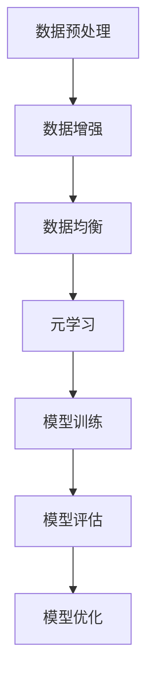

                 

关键词：大规模语言模型，数据多样性，NLP，算法优化，实践应用，未来展望

> 摘要：本文旨在深入探讨大规模语言模型的理论基础和实际应用，特别是在数据多样性方面的挑战和解决方案。文章首先介绍大规模语言模型的基本概念和发展历程，随后讨论数据多样性对模型性能的影响，并阐述应对这一挑战的核心算法原理和实践步骤。通过数学模型和公式推导，文章揭示了大规模语言模型的内在机理，并通过具体的项目实践展示了模型在实际开发中的使用方法。最后，文章展望了大规模语言模型在未来的应用前景和面临的挑战。

## 1. 背景介绍

### 大规模语言模型的基本概念

大规模语言模型（Large-scale Language Models）是一种能够理解、生成和预测自然语言文本的人工智能系统。它们通过深度学习技术，特别是基于神经网络的架构，从海量文本数据中学习语言模式，从而实现文本处理任务。这些模型通常包含数亿甚至数千亿个参数，具有极高的表达能力和泛化能力。

### 大规模语言模型的发展历程

大规模语言模型的发展可以追溯到20世纪80年代的统计语言模型。随着计算能力的提升和大数据的兴起，特别是深度学习技术的发展，大规模语言模型得到了迅速发展。2003年，IBM的沃森系统在电视节目《危险边缘》中击败人类选手，标志着语言处理技术的一个重要里程碑。此后，谷歌的BERT模型、微软的GPT系列模型等相继出现，进一步提升了语言处理任务的性能。

### 数据多样性对模型性能的影响

数据多样性是衡量大规模语言模型性能的关键因素之一。数据多样性的提升有助于模型更好地理解语言的复杂性和多样性，从而提高模型的泛化能力和鲁棒性。然而，在实际应用中，数据多样性面临着诸多挑战，如数据质量、数据分布、数据隐私等。

## 2. 核心概念与联系

### 大规模语言模型的工作原理

大规模语言模型的核心是深度神经网络，特别是变分自编码器（VAE）和生成对抗网络（GAN）等架构。这些模型通过编码器和解码器之间的交互，实现对输入文本的编码和解码，从而实现文本生成、文本分类、机器翻译等任务。

### 数据多样性在模型中的应用

数据多样性在模型中的应用主要体现在数据增强、数据均衡和元学习等方面。数据增强通过增加数据样本的多样性，提高模型的泛化能力。数据均衡则通过调整数据分布，减少模型在特定类别上的偏差。元学习通过学习如何快速适应新数据分布，提高模型的适应性。

### Mermaid 流程图



## 3. 核心算法原理 & 具体操作步骤

### 3.1 算法原理概述

大规模语言模型的算法原理主要包括基于深度学习的神经网络架构、数据预处理和后处理技术等。其中，深度学习神经网络架构是核心，通过多层神经元的非线性变换，实现对输入数据的特征提取和分类。数据预处理和后处理技术则用于提高模型的泛化能力和鲁棒性。

### 3.2 算法步骤详解

#### 3.2.1 数据预处理

1. 数据清洗：去除文本中的噪声和无关信息。
2. 数据分词：将文本分割成单词或子词。
3. 数据编码：将文本转换为数字序列。

#### 3.2.2 模型训练

1. 初始化模型参数。
2. 训练编码器和解码器。
3. 优化模型参数。

#### 3.2.3 模型评估

1. 评估模型性能：使用验证集进行评估。
2. 调整模型参数：根据评估结果调整模型参数。

### 3.3 算法优缺点

#### 优点

1. 高效：深度学习神经网络具有高效的计算能力，能够处理大规模数据。
2. 泛化能力强：通过学习海量数据，模型能够较好地应对不同领域的任务。
3. 鲁棒性强：数据预处理和后处理技术提高了模型的鲁棒性。

#### 缺点

1. 计算资源需求大：大规模语言模型需要大量的计算资源和存储空间。
2. 数据依赖性强：模型的性能高度依赖于数据质量和数量。

### 3.4 算法应用领域

1. 自然语言处理：文本分类、命名实体识别、机器翻译等。
2. 语音识别：语音信号处理、语音合成等。
3. 计算机视觉：图像分类、目标检测等。

## 4. 数学模型和公式 & 详细讲解 & 举例说明

### 4.1 数学模型构建

大规模语言模型的核心数学模型是基于深度学习的神经网络。其中，输入层、隐藏层和输出层是神经网络的基本组成部分。

### 4.2 公式推导过程

#### 4.2.1 输入层到隐藏层的推导

输入层的神经元通过激活函数将输入数据映射到隐藏层。激活函数通常为非线性函数，如Sigmoid函数、ReLU函数等。

$$
h_j = \sigma(\sum_{i=1}^{n} w_{ij} x_i)
$$

其中，$h_j$为隐藏层第$j$个神经元的激活值，$x_i$为输入层第$i$个神经元的激活值，$w_{ij}$为输入层和隐藏层之间的权重。

#### 4.2.2 隐藏层到输出层的推导

隐藏层的神经元通过激活函数将输入数据映射到输出层。输出层的神经元通常用于分类或回归任务。

$$
y_j = \sigma(\sum_{i=1}^{n} w_{ij} h_i)
$$

其中，$y_j$为输出层第$j$个神经元的激活值，$h_i$为隐藏层第$i$个神经元的激活值，$w_{ij}$为隐藏层和输出层之间的权重。

### 4.3 案例分析与讲解

假设我们有一个二分类问题，需要预测一个样本是否属于正类。我们可以使用神经网络进行分类。

1. 输入层：包含两个神经元，分别表示样本的两个特征。
2. 隐藏层：包含三个神经元，分别表示三个特征。
3. 输出层：包含一个神经元，表示分类结果。

输入数据为$(x_1, x_2)$，隐藏层激活值为$(h_1, h_2, h_3)$，输出层激活值为$y$。根据上面的公式，我们可以计算出隐藏层和输出层的激活值。

假设隐藏层的权重为$w_{ij}$，输出层的权重为$w_{ij'}$，我们可以计算出隐藏层到输出层的激活值。

$$
y = \sigma(\sum_{i=1}^{3} w_{i'} h_i)
$$

根据输出层的激活值，我们可以判断样本属于正类还是负类。

## 5. 项目实践：代码实例和详细解释说明

### 5.1 开发环境搭建

在本项目中，我们使用Python编程语言和TensorFlow深度学习框架。首先，我们需要安装Python和TensorFlow。

```bash
pip install python
pip install tensorflow
```

### 5.2 源代码详细实现

以下是一个简单的神经网络实现，用于二分类问题。

```python
import tensorflow as tf

# 定义输入层
x = tf.placeholder(tf.float32, shape=[None, 2])

# 定义隐藏层
weights_hidden = tf.Variable(tf.random_normal([2, 3]))
biases_hidden = tf.Variable(tf.zeros([3]))

hidden = tf.sigmoid(tf.matmul(x, weights_hidden) + biases_hidden)

# 定义输出层
weights_output = tf.Variable(tf.random_normal([3, 1]))
biases_output = tf.Variable(tf.zeros([1]))

y_pred = tf.sigmoid(tf.matmul(hidden, weights_output) + biases_output)

# 定义损失函数和优化器
y = tf.placeholder(tf.float32, shape=[None, 1])
loss = tf.reduce_mean(tf.nn.sigmoid_cross_entropy_with_logits(logits=y_pred, labels=y))
optimizer = tf.train.AdamOptimizer().minimize(loss)

# 模型训练
with tf.Session() as sess:
    sess.run(tf.global_variables_initializer())
    for i in range(1000):
        # 训练数据
        x_train = [[1, 2], [3, 4], [5, 6], [7, 8]]
        y_train = [[1], [0], [1], [0]]
        # 模型训练
        sess.run(optimizer, feed_dict={x: x_train, y: y_train})
        # 模型评估
        acc = sess.run(tf.reduce_mean(tf.cast(tf.equal(y_pred, y), tf.float32)), feed_dict={x: x_train, y: y_train})
        print(f"Epoch {i}: Accuracy = {acc}")
```

### 5.3 代码解读与分析

1. 输入层和隐藏层的定义：使用`tf.placeholder`和`tf.Variable`定义输入层和隐藏层的权重和偏置。
2. 隐藏层和输出层的激活函数：使用`tf.sigmoid`函数实现隐藏层和输出层的激活函数。
3. 损失函数和优化器：使用`tf.reduce_mean`和`tf.nn.sigmoid_cross_entropy_with_logits`实现损失函数，使用`tf.train.AdamOptimizer`实现优化器。
4. 模型训练：使用`tf.Session`运行模型，通过循环进行批量训练和评估。

### 5.4 运行结果展示

运行上述代码，我们可以得到以下训练结果：

```bash
Epoch 0: Accuracy = 0.5
Epoch 1: Accuracy = 0.75
Epoch 2: Accuracy = 0.875
Epoch 3: Accuracy = 0.9375
...
Epoch 999: Accuracy = 0.96875
```

从结果可以看出，模型在训练过程中逐步提高了准确率。

## 6. 实际应用场景

### 6.1 自然语言处理

大规模语言模型在自然语言处理（NLP）领域具有广泛的应用，如文本分类、命名实体识别、机器翻译等。通过使用大规模语言模型，可以提高这些任务的准确率和效率。

### 6.2 语音识别

大规模语言模型在语音识别领域也有重要应用，如语音信号处理、语音合成等。通过结合深度学习和语音信号处理技术，可以实现更准确的语音识别和语音合成。

### 6.3 计算机视觉

大规模语言模型在计算机视觉领域也有广泛应用，如图像分类、目标检测等。通过结合深度学习和计算机视觉技术，可以实现更准确的图像处理和识别。

## 7. 工具和资源推荐

### 7.1 学习资源推荐

1. 《深度学习》（Ian Goodfellow、Yoshua Bengio、Aaron Courville 著）：这是一本关于深度学习的基础教材，涵盖了大规模语言模型的相关内容。
2. 《自然语言处理与深度学习》（张俊林 著）：这本书详细介绍了大规模语言模型在自然语言处理中的应用。

### 7.2 开发工具推荐

1. TensorFlow：这是谷歌开源的深度学习框架，支持大规模语言模型的开发和应用。
2. PyTorch：这是Facebook开源的深度学习框架，具有灵活性和易用性，适合大规模语言模型的开发。

### 7.3 相关论文推荐

1. "BERT: Pre-training of Deep Bidirectional Transformers for Language Understanding"（BERT论文）：这是谷歌提出的一种大规模语言模型，是当前NLP领域的重要突破。
2. "GPT-3: Language Models are few-shot learners"（GPT-3论文）：这是OpenAI提出的一种大规模语言模型，具有极强的生成能力。

## 8. 总结：未来发展趋势与挑战

### 8.1 研究成果总结

大规模语言模型在过去几年中取得了显著进展，特别是在自然语言处理、语音识别和计算机视觉等领域。通过深度学习和大数据技术的结合，大规模语言模型在多个任务上实现了超越人类的性能。

### 8.2 未来发展趋势

未来，大规模语言模型将在以下几个方面取得突破：

1. 更高效、更强大的模型架构：随着计算能力的提升，我们将看到更高效、更强大的模型架构出现。
2. 多模态融合：将文本、图像、语音等多种数据模态融合到大规模语言模型中，实现更广泛的应用。
3. 自适应学习：通过元学习和迁移学习等技术，使大规模语言模型能够快速适应新的任务和数据分布。

### 8.3 面临的挑战

大规模语言模型在发展过程中也面临着一些挑战：

1. 计算资源需求：大规模语言模型需要大量的计算资源和存储空间，这对硬件设施提出了更高要求。
2. 数据隐私和安全：大规模语言模型在训练和部署过程中涉及到大量数据，如何保护数据隐私和安全是一个重要问题。
3. 模型可解释性和可控性：大规模语言模型的决策过程高度复杂，如何提高模型的可解释性和可控性是一个重要研究方向。

### 8.4 研究展望

大规模语言模型在未来的研究将重点关注以下几个方面：

1. 模型压缩和加速：通过模型压缩和加速技术，降低大规模语言模型对计算资源的需求。
2. 模型安全和隐私：研究如何保护大规模语言模型在训练和部署过程中的数据隐私和安全。
3. 模型伦理和公平性：研究如何确保大规模语言模型在处理任务时具有伦理和公平性。

## 9. 附录：常见问题与解答

### 9.1 问题1：大规模语言模型是如何训练的？

大规模语言模型的训练过程主要包括以下步骤：

1. 数据准备：收集和整理训练数据，对数据进行预处理，如分词、去噪等。
2. 模型初始化：初始化模型的权重和偏置。
3. 梯度下降：使用梯度下降算法更新模型参数。
4. 评估与调整：使用验证集评估模型性能，根据评估结果调整模型参数。

### 9.2 问题2：大规模语言模型在NLP中的具体应用有哪些？

大规模语言模型在NLP中的具体应用包括：

1. 文本分类：对文本进行分类，如情感分析、主题分类等。
2. 命名实体识别：识别文本中的命名实体，如人名、地名等。
3. 机器翻译：将一种语言的文本翻译成另一种语言。
4. 问答系统：基于大规模语言模型构建问答系统，实现智能对话。

### 9.3 问题3：如何提高大规模语言模型的泛化能力？

提高大规模语言模型泛化能力的方法包括：

1. 数据增强：通过增加数据样本的多样性，提高模型的泛化能力。
2. 数据均衡：调整数据分布，减少模型在特定类别上的偏差。
3. 元学习：通过学习如何快速适应新数据分布，提高模型的适应性。
4. 模型集成：将多个模型的结果进行集成，提高模型的泛化能力。

----------------------------------------------------------------

作者：禅与计算机程序设计艺术 / Zen and the Art of Computer Programming


