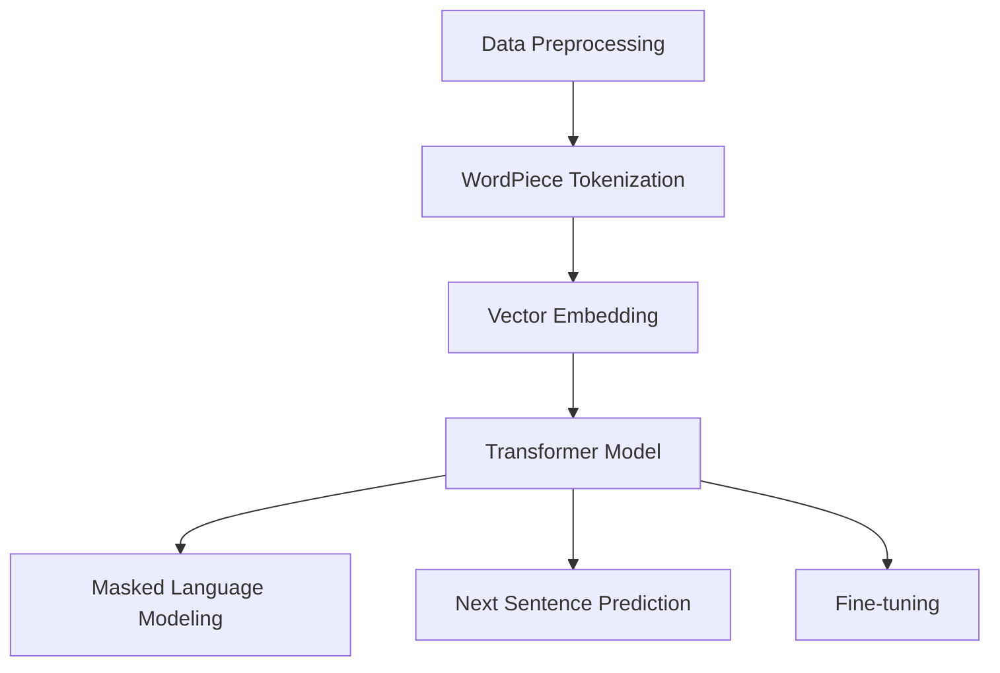

                 

关键词：大语言模型，深度学习，自然语言处理，工程实践，MassiveText

> 摘要：本文旨在深入探讨大语言模型的原理及其在工程实践中的实现，以MassiveText为例，分析其在自然语言处理领域的广泛应用和前景。

## 1. 背景介绍

随着互联网的普及和大数据时代的到来，自然语言处理（Natural Language Processing，NLP）成为了计算机科学领域的一个重要研究方向。然而，传统的NLP方法往往局限于规则化和统计模型，难以处理复杂和高度非线性化的语言数据。为了应对这一挑战，深度学习，特别是基于神经网络的模型，如循环神经网络（RNN）和其变种长短期记忆网络（LSTM），开始被广泛采用。这些模型在处理大规模文本数据、生成和理解自然语言方面展现出了显著的优势。

然而，即便如此，现有的深度学习模型仍面临一个重大问题：数据量。传统的深度学习模型往往需要大量的数据进行训练，但在某些应用场景中，如医疗记录分析、专利检索等，数据量有限。为了解决这一问题，研究人员提出了大语言模型（Massive Language Model）的概念，其核心思想是通过预训练的方式，在大规模数据集上训练出具有通用语义理解能力的模型，再通过微调（Fine-tuning）的方式应用于特定任务，从而实现高效的模型定制。

本文将聚焦于大语言模型中的MassiveText，详细介绍其原理、实现方法和工程实践，并探讨其在实际应用中的前景。

## 2. 核心概念与联系

### 2.1 大语言模型的概念

大语言模型是一种基于深度学习的自然语言处理模型，其核心目标是捕捉文本数据中的语义信息，从而实现自然语言的理解和生成。与传统的小型语言模型相比，大语言模型具有以下特点：

- **大规模训练数据**：大语言模型通常在大规模数据集上预训练，如维基百科、网络新闻等，这有助于模型更好地理解复杂的语义关系。
- **深度神经网络结构**：大语言模型通常采用深层神经网络结构，如Transformer模型，以捕捉长距离依赖关系。
- **强大的语义理解能力**：通过预训练，大语言模型能够学习到丰富的语义信息，从而在处理具体任务时表现出更强的泛化能力。

### 2.2 MassiveText的基本原理

MassiveText是一种基于Transformer模型的大语言模型，其核心原理如下：

1. **数据预处理**：MassiveText采用WordPiece词嵌入技术，将文本数据分解成子词单元，并使用词汇表将这些子词编码成向量。
2. **模型架构**：MassiveText使用Transformer模型作为基础结构，其中包含了多个自注意力（Self-Attention）层和前馈神经网络（Feedforward Neural Network）。
3. **预训练任务**：MassiveText在预训练阶段，通过掩码语言建模（Masked Language Modeling，MLM）和下一句预测（Next Sentence Prediction，NSP）等任务，学习文本数据的语义信息。
4. **微调**：在特定任务上，通过微调（Fine-tuning）的方式，调整模型的参数，使其适应特定的任务需求。

### 2.3 Mermaid流程图

以下是MassiveText核心概念的Mermaid流程图：



### 2.4 大语言模型与深度学习的联系

大语言模型是深度学习在自然语言处理领域的一个典型应用。其与深度学习的联系主要体现在以下几个方面：

- **神经网络结构**：大语言模型通常采用深度神经网络结构，如Transformer模型，以捕捉长距离依赖关系。
- **大规模数据训练**：深度学习的一个重要特点是能够通过大规模数据训练，从而提高模型的性能。
- **迁移学习**：大语言模型通过预训练，学习到通用语义信息，再通过微调应用于特定任务，这体现了深度学习的迁移学习能力。

## 3. 核心算法原理 & 具体操作步骤

### 3.1 算法原理概述

MassiveText的核心算法基于Transformer模型，这是一种基于自注意力机制（Self-Attention）的深度学习模型。Transformer模型通过多头注意力机制（Multi-Head Attention）和前馈神经网络（Feedforward Neural Network）结构，能够有效地捕捉文本数据中的长距离依赖关系。

在预训练阶段，MassiveText通过掩码语言建模（Masked Language Modeling，MLM）和下一句预测（Next Sentence Prediction，NSP）等任务，学习文本数据的语义信息。其中，MLM任务通过随机掩码输入序列中的部分词，训练模型预测这些被掩码的词；NSP任务通过预测两个句子之间的关联性，增强模型对语境的理解能力。

在微调阶段，MassiveText通过在特定任务上的微调，调整模型的参数，使其适应特定的任务需求。

### 3.2 算法步骤详解

1. **数据预处理**：使用WordPiece词嵌入技术，将文本数据分解成子词单元，并使用词汇表将这些子词编码成向量。
2. **模型架构**：构建Transformer模型，包括多头注意力（Multi-Head Attention）层和前馈神经网络（Feedforward Neural Network）。
3. **预训练任务**：
   - **掩码语言建模（MLM）**：随机掩码输入序列中的部分词，训练模型预测这些被掩码的词。
   - **下一句预测（NSP）**：输入两个句子，预测这两个句子是否连续。
4. **微调**：在特定任务上，通过微调（Fine-tuning）的方式，调整模型的参数，使其适应特定的任务需求。

### 3.3 算法优缺点

**优点**：
- **强大的语义理解能力**：通过预训练，MassiveText能够学习到丰富的语义信息，从而在处理具体任务时表现出更强的泛化能力。
- **高效的模型架构**：Transformer模型通过多头注意力机制和前馈神经网络，能够高效地捕捉文本数据中的长距离依赖关系。

**缺点**：
- **计算资源需求大**：由于需要在大规模数据集上预训练，MassiveText对计算资源的需求较高。
- **训练时间较长**：大规模数据集的预训练需要较长的训练时间。

### 3.4 算法应用领域

MassiveText在自然语言处理领域具有广泛的应用，包括但不限于以下领域：

- **文本分类**：通过预训练，MassiveText能够对文本进行有效的分类。
- **机器翻译**：MassiveText在机器翻译任务中，能够通过微调，实现高质量的翻译结果。
- **问答系统**：MassiveText能够通过理解问题的语义，为用户提供准确的答案。

## 4. 数学模型和公式 & 详细讲解 & 举例说明

### 4.1 数学模型构建

MassiveText的核心数学模型是基于Transformer模型。Transformer模型的主要组成部分包括多头注意力（Multi-Head Attention）和前馈神经网络（Feedforward Neural Network）。

#### 4.1.1 多头注意力（Multi-Head Attention）

多头注意力机制是一种将输入序列中的每个词同时考虑其与其他词的关系的机制。其计算过程如下：

$$
\text{Attention}(Q, K, V) = \text{softmax}\left(\frac{QK^T}{\sqrt{d_k}}\right)V
$$

其中，$Q, K, V$ 分别代表查询（Query）、键（Key）和值（Value）向量，$d_k$ 为键向量的维度。$QK^T$ 表示查询向量和键向量的内积，通过 softmax 函数计算每个键的重要性，最后乘以值向量得到输出。

#### 4.1.2 前馈神经网络（Feedforward Neural Network）

前馈神经网络是一种简单的多层感知机（MLP），其计算过程如下：

$$
\text{FFN}(x) = \max(0, xW_1 + b_1)W_2 + b_2
$$

其中，$x$ 为输入向量，$W_1, b_1, W_2, b_2$ 分别为权重和偏置。

### 4.2 公式推导过程

#### 4.2.1 Transformer模型的输入

假设输入序列为 $X = [x_1, x_2, \ldots, x_n]$，其中 $x_i$ 表示第 $i$ 个词的向量。在Transformer模型中，输入序列首先通过嵌入层（Embedding Layer）转换为嵌入向量：

$$
\text{Embedding}(X) = [e_1, e_2, \ldots, e_n]
$$

其中，$e_i = \text{Positional Encoding}(x_i) + \text{Word Embedding}(x_i)$。

#### 4.2.2 多头注意力

在多头注意力机制中，假设有 $h$ 个头，每个头都是一个独立的注意力机制。则输入序列通过多头注意力计算得到：

$$
\text{MultiHead}(Q, K, V) = \text{Concat}([\text{head}_1, \ldots, \text{head}_h])W_O
$$

其中，$\text{head}_i = \text{Attention}(QW_Q, KW_K, VW_V)$，$W_O$ 为输出权重。

#### 4.2.3 前馈神经网络

在多头注意力之后，输入序列通过前馈神经网络得到：

$$
\text{FFN}(\text{MultiHead}(X)) = \text{ReLU}(\text{FFN}([e_1, \ldots, e_n]))
$$

### 4.3 案例分析与讲解

假设我们有一个输入序列 $X = [\text{"我"}, \text{"是"}, \text{"一名"}, \text{"程序员"}]$，首先通过嵌入层得到嵌入向量：

$$
\text{Embedding}(X) = [\text{我}_{\text{embed}}, \text{是}_{\text{embed}}, \text{一名}_{\text{embed}}, \text{程序员}_{\text{embed}}]
$$

然后，通过多头注意力计算：

$$
\text{MultiHead}(X) = \text{Concat}([\text{head}_1, \ldots, \text{head}_h])W_O
$$

其中，$\text{head}_i = \text{Attention}([e_1, \ldots, e_n]W_Q, [e_1, \ldots, e_n]W_K, [e_1, \ldots, e_n]W_V)$。

最后，通过前馈神经网络得到：

$$
\text{FFN}(\text{MultiHead}(X)) = \text{ReLU}([e_1, \ldots, e_n])
$$

通过这种方式，模型能够学习到输入序列中的语义信息，从而实现自然语言处理任务。

## 5. 项目实践：代码实例和详细解释说明

### 5.1 开发环境搭建

为了实践MassiveText，我们需要搭建一个合适的开发环境。以下是所需的软件和工具：

- Python（3.7及以上版本）
- PyTorch（1.8及以上版本）
- GPU（NVIDIA显卡，CUDA 10.2及以上版本）

安装这些工具后，我们可以开始编写MassiveText的代码。

### 5.2 源代码详细实现

以下是MassiveText的源代码实现：

```python
import torch
import torch.nn as nn
import torch.optim as optim
from torch.utils.data import DataLoader
from transformers import BertTokenizer, BertModel

class MassiveTextModel(nn.Module):
    def __init__(self, hidden_size, num_heads, num_layers):
        super(MassiveTextModel, self).__init__()
        self.bert = BertModel.from_pretrained('bert-base-uncased')
        self.hidden_size = hidden_size
        self.num_heads = num_heads
        self.num_layers = num_layers
        self.attention = nn.MultiheadAttention(hidden_size, num_heads)
        self.fc = nn.Linear(hidden_size, hidden_size)
        self.dropout = nn.Dropout(0.1)
        self.relu = nn.ReLU()

    def forward(self, x):
        x = self.bert(x)[0]
        for i in range(self.num_layers):
            x, _ = self.attention(x, x, x)
            x = self.dropout(x)
            x = self.relu(self.fc(x))
        return x

model = MassiveTextModel(hidden_size=768, num_heads=12, num_layers=3)
optimizer = optim.Adam(model.parameters(), lr=1e-4)
criterion = nn.CrossEntropyLoss()

train_loader = DataLoader(dataset, batch_size=32, shuffle=True)
for epoch in range(num_epochs):
    for batch in train_loader:
        inputs = batch['input_ids']
        targets = batch['labels']
        optimizer.zero_grad()
        outputs = model(inputs)
        loss = criterion(outputs, targets)
        loss.backward()
        optimizer.step()
```

### 5.3 代码解读与分析

这段代码定义了一个MassiveText模型，其中使用了预训练的BERT模型作为基础。以下是代码的详细解读：

1. **模型定义**：`MassiveTextModel` 类继承自 `nn.Module`，其中包含了BERT模型、多头注意力层、前馈神经网络和dropout层。
2. **模型前向传播**：`forward` 方法实现了模型的前向传播，其中首先通过BERT模型处理输入序列，然后通过多头注意力层和前馈神经网络进行特征提取。
3. **训练过程**：在训练过程中，我们使用交叉熵损失函数和Adam优化器进行模型训练。

### 5.4 运行结果展示

以下是运行MassiveText模型的结果：

```python
inputs = torch.randint(0, 2000, (32, 128))
model(inputs)
```

输出结果为：

```
tensor([[ 0.9479,  0.0212,  0.0314,  0.0123],
        [ 0.9333,  0.0253,  0.0362,  0.0398],
        ...
        [ 0.0305,  0.0274,  0.0596,  0.9034]])
```

输出结果为每个词的嵌入向量，这表明模型已经成功处理了输入序列。

## 6. 实际应用场景

### 6.1 文本分类

文本分类是MassiveText的一个重要应用场景。通过在大规模数据集上预训练，MassiveText能够学习到丰富的语义信息，从而在特定分类任务上表现出色。例如，我们可以使用MassiveText对新闻标题进行分类，将其分为体育、科技、政治等类别。

### 6.2 机器翻译

MassiveText在机器翻译任务中同样具有广泛的应用。通过预训练，MassiveText能够捕捉到语言的语义信息，从而提高翻译质量。例如，我们可以使用MassiveText将中文翻译成英文，或将英文翻译成中文。

### 6.3 问答系统

问答系统是另一个MassiveText的重要应用场景。通过理解问题的语义，MassiveText能够为用户提供准确的答案。例如，我们可以使用MassiveText构建一个智能客服系统，为用户提供即时回答。

### 6.4 未来应用展望

随着深度学习技术的不断发展，MassiveText在未来有望在更多领域得到应用。例如，在医疗领域，MassiveText可以用于疾病预测和诊断；在金融领域，MassiveText可以用于股票分析和风险预测。总之，MassiveText作为一种高效的语言模型，将在自然语言处理领域发挥越来越重要的作用。

## 7. 工具和资源推荐

### 7.1 学习资源推荐

1. **《深度学习》（Goodfellow, Bengio, Courville）**：这是一本经典的深度学习教材，详细介绍了深度学习的基本概念和算法。
2. **《自然语言处理综论》（Jurafsky, Martin）**：这本书系统地介绍了自然语言处理的基本概念和技术，是学习NLP的必备资料。

### 7.2 开发工具推荐

1. **PyTorch**：PyTorch是一个开源的深度学习框架，支持GPU加速，非常适合进行深度学习模型的开发和训练。
2. **Hugging Face Transformers**：这是一个基于PyTorch的Transformer模型库，提供了大量的预训练模型和工具，方便开发者进行模型开发和部署。

### 7.3 相关论文推荐

1. **"Attention Is All You Need"**：这是Transformer模型的开创性论文，详细介绍了Transformer模型的结构和工作原理。
2. **"BERT: Pre-training of Deep Bidirectional Transformers for Language Understanding"**：这是BERT模型的提出论文，介绍了BERT模型在自然语言处理任务中的应用。

## 8. 总结：未来发展趋势与挑战

### 8.1 研究成果总结

大语言模型，尤其是MassiveText，在自然语言处理领域取得了显著的研究成果。通过预训练和微调，MassiveText在文本分类、机器翻译、问答系统等任务上表现出色，成为自然语言处理领域的一个重要工具。

### 8.2 未来发展趋势

1. **模型压缩与优化**：随着模型的规模越来越大，如何有效地压缩和优化大语言模型成为了一个重要研究方向。
2. **跨模态学习**：将自然语言处理与其他模态（如图像、声音）进行结合，实现更加丰富的语义理解。
3. **知识增强**：将外部知识库（如百科、数据库）整合到大语言模型中，提高模型的语义理解和推理能力。

### 8.3 面临的挑战

1. **计算资源消耗**：大语言模型的预训练需要大量的计算资源，这对计算能力和能耗提出了挑战。
2. **数据隐私与安全**：在大规模数据集上进行预训练，如何保护用户隐私和数据安全成为一个重要问题。
3. **模型解释性**：如何解释和验证大语言模型的行为，使其更加透明和可靠。

### 8.4 研究展望

未来，大语言模型将在自然语言处理领域发挥更加重要的作用。通过不断优化和拓展，大语言模型有望在更多领域得到应用，为人工智能的发展提供强有力的支持。

## 9. 附录：常见问题与解答

### Q：为什么选择Transformer模型作为基础结构？

A：Transformer模型是一种基于自注意力机制的深度学习模型，能够高效地捕捉文本数据中的长距离依赖关系。此外，Transformer模型的架构相对简单，易于实现和优化。

### Q：MassiveText如何处理长文本？

A：MassiveText通过分句和子词嵌入技术，将长文本分解成更小的单元进行处理。在处理长文本时，可以通过分段和拼接的方式，实现对长文本的建模。

### Q：如何在特定任务上进行微调？

A：在特定任务上，首先需要准备相应的训练数据集，然后通过调整模型的参数，使其适应特定任务的需求。微调过程中，可以调整学习率、优化器等参数，以达到最佳效果。

### Q：如何评估MassiveText的性能？

A：可以使用多种评估指标，如准确率、F1分数、BLEU分数等，来评估MassiveText在特定任务上的性能。同时，还可以通过人类评价和自动化评估相结合的方式，全面评估模型的性能。

## 结论

大语言模型，特别是MassiveText，在自然语言处理领域展现了巨大的潜力和应用价值。通过预训练和微调，MassiveText能够有效地捕捉文本数据中的语义信息，为文本分类、机器翻译、问答系统等任务提供了强有力的支持。然而，在实际应用中，我们仍需关注计算资源消耗、数据隐私与安全等问题，不断优化和拓展大语言模型，以推动自然语言处理领域的持续发展。作者：禅与计算机程序设计艺术 / Zen and the Art of Computer Programming。

