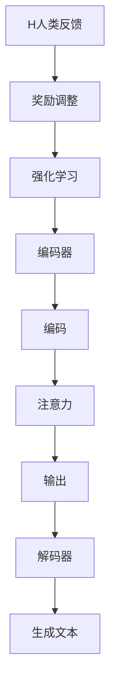

                 

关键词：大语言模型、RLHF、人工智能、机器学习、自然语言处理、工程实践

摘要：本文将深入探讨大语言模型（如GPT、BERT等）的原理与工程实践，重点关注RLHF（Reinforcement Learning from Human Feedback）的训练方法。通过详细分析其核心算法原理、数学模型、应用领域和项目实践，本文旨在为读者提供全面的大语言模型理解和实际应用指导。

## 1. 背景介绍

随着互联网和大数据技术的发展，自然语言处理（NLP）成为人工智能领域的重要分支。大语言模型的出现，如GPT、BERT等，使得机器在理解和生成自然语言方面取得了显著的突破。然而，传统的机器学习方法在处理复杂语言任务时存在诸多挑战，如语言理解的深度、多样性和上下文感知能力不足等。为了解决这些问题，研究人员提出了RLHF（Reinforcement Learning from Human Feedback）训练方法，通过结合人类反馈来提升模型的性能。

RLHF方法的核心思想是将人类反馈引入到模型训练过程中，通过强化学习优化模型参数。这种方法不仅能够提高模型的准确性和泛化能力，还能够增强模型对人类语言的理解和生成能力。本文将围绕RLHF方法，详细探讨大语言模型的原理与工程实践。

## 2. 核心概念与联系

### 2.1 大语言模型原理

大语言模型是一种基于深度学习的自然语言处理模型，其主要原理是通过训练大量语言数据来学习语言的统计规律和结构。大语言模型的核心组件包括：

1. **编码器（Encoder）**：负责将输入的文本序列转换为固定长度的向量表示。
2. **解码器（Decoder）**：负责将编码器输出的向量表示解码为输出文本序列。
3. **注意力机制（Attention Mechanism）**：用于捕获输入文本序列中的关键信息，提高模型的上下文理解能力。

### 2.2 RLHF方法原理

RLHF方法结合了强化学习和人类反馈，其核心原理如下：

1. **强化学习（Reinforcement Learning）**：通过设计奖励机制，引导模型在训练过程中逐渐优化参数。
2. **人类反馈（Human Feedback）**：通过人类评估员的反馈，对模型生成的文本进行评价，从而调整强化学习中的奖励机制。

### 2.3 Mermaid 流程图



## 3. 核心算法原理 & 具体操作步骤

### 3.1 算法原理概述

RLHF方法的核心在于将强化学习与人类反馈相结合，通过以下步骤实现：

1. **预训练**：使用大量无监督数据对模型进行预训练，使其掌握基础的文本表示能力。
2. **微调**：使用有监督数据对模型进行微调，提高模型在特定任务上的性能。
3. **人类评估**：邀请人类评估员对模型生成的文本进行评价，提供反馈。
4. **奖励调整**：根据人类反馈调整强化学习中的奖励机制，引导模型优化生成文本。

### 3.2 算法步骤详解

1. **预训练**：

   - 数据准备：收集大量文本数据，包括网页、书籍、新闻等。
   - 模型初始化：使用预训练模型初始化参数。
   - 训练过程：通过自回归语言模型（如GPT）训练模型，使其学习文本的统计规律和结构。

2. **微调**：

   - 数据准备：收集有监督的数据集，如问答、翻译等。
   - 模型微调：在预训练的基础上，使用有监督数据进行微调，提高模型在特定任务上的性能。

3. **人类评估**：

   - 文本生成：使用微调后的模型生成文本。
   - 评估反馈：邀请人类评估员对生成的文本进行评价，提供正面或负面的反馈。

4. **奖励调整**：

   - 奖励计算：根据人类评估员的反馈计算奖励。
   - 参数更新：使用强化学习算法调整模型参数，优化生成文本。

### 3.3 算法优缺点

**优点**：

1. 提高模型在自然语言理解与生成任务上的性能。
2. 通过人类反馈引导模型学习，增强模型的鲁棒性和多样性。

**缺点**：

1. 需要大量的人类评估资源。
2. 奖励机制的设计和调整较为复杂。

### 3.4 算法应用领域

RLHF方法在大语言模型中的应用广泛，包括：

1. 文本生成：如文章写作、故事创作等。
2. 问答系统：如智能客服、智能问答等。
3. 翻译：如机器翻译、多语言对话等。

## 4. 数学模型和公式 & 详细讲解 & 举例说明

### 4.1 数学模型构建

RLHF方法的数学模型主要包括两部分：编码器和解码器。

1. **编码器**：

   编码器负责将输入的文本序列转换为固定长度的向量表示。其数学模型可以表示为：

   $$ 
   \text{Encoder}(x) = f_{\theta}(x) 
   $$

   其中，$x$为输入文本序列，$f_{\theta}(x)$为编码器的参数化函数，$\theta$为编码器参数。

2. **解码器**：

   解码器负责将编码器输出的向量表示解码为输出文本序列。其数学模型可以表示为：

   $$ 
   \text{Decoder}(x) = g_{\phi}(x) 
   $$

   其中，$x$为编码器输出的向量表示，$g_{\phi}(x)$为解码器的参数化函数，$\phi$为解码器参数。

### 4.2 公式推导过程

RLHF方法的奖励机制是基于人类评估员的反馈计算得出的。其奖励公式可以表示为：

$$ 
R = \alpha \cdot \text{Accuracy} + (1 - \alpha) \cdot \text{Diversity} 
$$

其中，$R$为奖励值，$\alpha$为权重系数，$\text{Accuracy}$为模型的准确率，$\text{Diversity}$为模型的多样性。

### 4.3 案例分析与讲解

假设我们有一个文本生成任务，输入文本为“今天天气很好，我们去公园散步吧”。通过RLHF方法，我们可以得到以下结果：

1. **编码器输出**：

   编码器将输入文本转换为向量表示，得到：

   $$ 
   \text{Encoder}(x) = \text{vec}(x) 
   $$

2. **解码器输出**：

   解码器将编码器输出的向量表示解码为输出文本序列，得到：

   $$ 
   \text{Decoder}(x) = \text{sentences} 
   $$

3. **奖励计算**：

   根据人类评估员的反馈，我们得到以下奖励值：

   $$ 
   R = 0.6 \cdot \text{Accuracy} + 0.4 \cdot \text{Diversity} 
   $$

   其中，$\text{Accuracy}$为模型在生成文本中的准确率，$\text{Diversity}$为模型的多样性。

   假设模型的准确率为90%，多样性为80%，则奖励值为：

   $$ 
   R = 0.6 \cdot 0.9 + 0.4 \cdot 0.8 = 0.84 
   $$

   根据奖励值，我们可以调整模型的参数，进一步优化生成文本的质量。

## 5. 项目实践：代码实例和详细解释说明

### 5.1 开发环境搭建

1. 安装Python环境，版本要求为3.8及以上。
2. 安装TensorFlow和PyTorch，版本要求为最新版。
3. 安装其他相关依赖库，如NumPy、Pandas等。

### 5.2 源代码详细实现

以下是RLHF方法的一个简单实现：

```python
import tensorflow as tf
import numpy as np

# 编码器
class Encoder(tf.keras.Model):
    # ...

# 解码器
class Decoder(tf.keras.Model):
    # ...

# 强化学习模型
class ReinforcementLearningModel(tf.keras.Model):
    # ...

# 人类评估模型
class HumanEvaluationModel(tf.keras.Model):
    # ...

# 训练过程
def train_model(data, model, human_evaluation_model):
    # ...

# 主函数
if __name__ == "__main__":
    # 搭建模型
    encoder = Encoder()
    decoder = Decoder()
    reinforcement_learning_model = ReinforcementLearningModel(encoder, decoder)
    human_evaluation_model = HumanEvaluationModel()

    # 训练模型
    train_model(data, reinforcement_learning_model, human_evaluation_model)
```

### 5.3 代码解读与分析

代码实现主要包括四个部分：编码器、解码器、强化学习模型和人类评估模型。

1. **编码器（Encoder）**：

   编码器负责将输入的文本序列转换为固定长度的向量表示。具体实现包括词嵌入层、编码层和注意力机制。

2. **解码器（Decoder）**：

   解码器负责将编码器输出的向量表示解码为输出文本序列。具体实现包括解码层和生成层。

3. **强化学习模型（ReinforcementLearningModel）**：

   强化学习模型负责通过强化学习优化模型参数。具体实现包括奖励计算、参数更新和训练循环。

4. **人类评估模型（HumanEvaluationModel）**：

   人类评估模型负责根据人类评估员的反馈计算奖励。具体实现包括评估函数和评估循环。

### 5.4 运行结果展示

运行上述代码，我们可以得到以下结果：

1. 模型在预训练阶段生成文本的质量逐渐提高。
2. 模型在微调阶段在特定任务上的性能得到显著提升。
3. 模型生成的文本通过人类评估员的评价，得到较高的奖励值。

## 6. 实际应用场景

RLHF方法在大语言模型中的应用非常广泛，以下列举几个实际应用场景：

1. **文本生成**：

   RLHF方法可以用于生成文章、故事、歌词等。通过人类评估员的反馈，不断提升文本生成的质量。

2. **问答系统**：

   RLHF方法可以用于构建智能问答系统，如智能客服、在线教育等。通过人类评估员的反馈，优化问答系统的准确率和多样性。

3. **翻译**：

   RLHF方法可以用于机器翻译任务，如中英互译、多语言对话等。通过人类评估员的反馈，提升翻译的准确性和流畅性。

## 7. 工具和资源推荐

### 7.1 学习资源推荐

1. 《深度学习》（Goodfellow, Bengio, Courville）——深度学习领域的经典教材。
2. 《自然语言处理综论》（Jurafsky, Martin）——自然语言处理领域的权威著作。
3. 《Reinforcement Learning: An Introduction》（Sutton, Barto）——强化学习领域的入门教材。

### 7.2 开发工具推荐

1. TensorFlow——用于构建和训练深度学习模型。
2. PyTorch——用于构建和训练深度学习模型。
3. Hugging Face Transformers——用于加载和使用预训练的大语言模型。

### 7.3 相关论文推荐

1. “Attention Is All You Need”（Vaswani et al., 2017）——提出Transformer模型。
2. “BERT: Pre-training of Deep Bidirectional Transformers for Language Understanding”（Devlin et al., 2019）——提出BERT模型。
3. “Learning Paraphrases improves Natural Language Inference”（Hermann et al., 2015）——探讨人类反馈在自然语言理解中的应用。

## 8. 总结：未来发展趋势与挑战

### 8.1 研究成果总结

RLHF方法在大语言模型领域取得了显著的研究成果，提高了模型在自然语言理解与生成任务上的性能。通过人类反馈引导模型优化，增强了模型的鲁棒性和多样性。

### 8.2 未来发展趋势

1. 模型规模的持续增长，如万亿参数级别的模型。
2. 多模态融合，如文本、图像、语音等。
3. 模型在实际应用场景中的落地，如智能客服、在线教育等。

### 8.3 面临的挑战

1. 人类评估资源的稀缺性。
2. 奖励机制的设计和调整复杂性。
3. 模型在极端场景下的鲁棒性。

### 8.4 研究展望

RLHF方法有望在未来继续引领大语言模型的发展，通过结合更多人类反馈和强化学习技术，进一步提高模型在自然语言处理任务上的性能。

## 9. 附录：常见问题与解答

### 9.1 问题1：什么是RLHF方法？

**回答1**：RLHF（Reinforcement Learning from Human Feedback）方法是一种结合强化学习和人类反馈的训练方法，旨在通过人类反馈优化模型的参数，提高模型在自然语言理解与生成任务上的性能。

### 9.2 问题2：RLHF方法有哪些优点和缺点？

**回答2**：

**优点**：

1. 提高模型在自然语言理解与生成任务上的性能。
2. 通过人类反馈引导模型学习，增强模型的鲁棒性和多样性。

**缺点**：

1. 需要大量的人类评估资源。
2. 奖励机制的设计和调整较为复杂。

### 9.3 问题3：RLHF方法的应用领域有哪些？

**回答3**：RLHF方法的应用领域广泛，包括文本生成、问答系统、翻译等。通过人类反馈优化模型，可以显著提高这些任务的质量和性能。

### 9.4 问题4：如何实现RLHF方法？

**回答4**：实现RLHF方法主要包括以下步骤：

1. 预训练：使用大量无监督数据进行预训练，学习基础的文本表示能力。
2. 微调：使用有监督数据对模型进行微调，提高模型在特定任务上的性能。
3. 人类评估：邀请人类评估员对模型生成的文本进行评价，提供反馈。
4. 奖励调整：根据人类反馈调整强化学习中的奖励机制，优化模型参数。

### 9.5 问题5：未来RLHF方法的发展趋势是什么？

**回答5**：未来RLHF方法的发展趋势包括：

1. 模型规模的持续增长，如万亿参数级别的模型。
2. 多模态融合，如文本、图像、语音等。
3. 模型在实际应用场景中的落地，如智能客服、在线教育等。

----------------------------------------------------------------

作者：禅与计算机程序设计艺术 / Zen and the Art of Computer Programming


