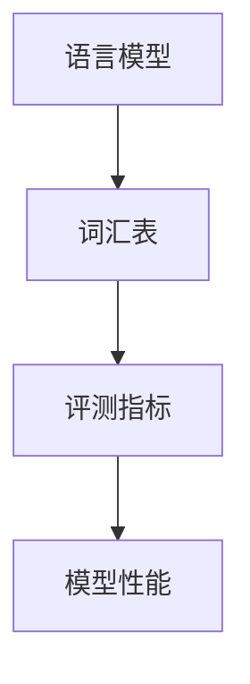

                 

关键词：大语言模型，基座语言模型，评测，原理，工程实践

> 摘要：本文旨在深入探讨大语言模型的原理与工程实践，特别是基座语言模型的评测。我们将从背景介绍、核心概念与联系、核心算法原理与具体操作步骤、数学模型与公式、项目实践、实际应用场景、未来应用展望、工具和资源推荐、总结以及附录等几个方面进行详细阐述。

## 1. 背景介绍

随着人工智能技术的不断发展，大语言模型成为了自然语言处理领域的核心工具。基座语言模型作为大语言模型的一种重要形式，其性能的评测变得尤为重要。本文将围绕基座语言模型的评测，深入探讨其原理与工程实践。

### 1.1 基座语言模型的定义

基座语言模型（Pre-trained Language Model）是一种在大量文本数据上预先训练好的语言模型，它通过深度学习算法从数据中学习到语言的基本规律，从而可以用于各种自然语言处理任务，如文本分类、命名实体识别、机器翻译等。

### 1.2 大语言模型的发展历程

大语言模型的发展可以分为三个阶段：传统语言模型、基于统计的模型、基于深度学习的模型。随着计算能力的提升和大数据技术的发展，基于深度学习的基座语言模型逐渐成为主流。

### 1.3 基座语言模型的重要性

基座语言模型在自然语言处理任务中具有举足轻重的地位，其性能直接影响下游任务的准确性。因此，对基座语言模型的评测显得尤为重要。

## 2. 核心概念与联系

为了更好地理解基座语言模型的评测，我们需要首先明确一些核心概念，并了解它们之间的联系。

### 2.1 语言模型

语言模型是自然语言处理的基础，它用于预测一段文本的概率。在基座语言模型中，语言模型是通过大量文本数据训练得到的。

### 2.2 词汇表

词汇表是语言模型的核心组成部分，它包含了模型所使用的所有词汇。词汇表的大小直接影响模型的性能。

### 2.3 评测指标

评测指标是评估基座语言模型性能的重要工具，常用的评测指标包括准确率、召回率、F1值等。

### 2.4 Mermaid 流程图



## 3. 核心算法原理与具体操作步骤

### 3.1 算法原理概述

基座语言模型的算法原理主要基于深度神经网络，通过多层非线性变换对输入的文本数据进行处理，从而实现语言的理解和生成。

### 3.2 算法步骤详解

1. 数据预处理：对输入的文本数据进行处理，包括分词、去停用词等。
2. 模型训练：利用大量文本数据对模型进行训练，优化模型参数。
3. 评测：使用预定的评测指标对模型性能进行评测。

### 3.3 算法优缺点

- 优点：基座语言模型具有强大的语义理解能力，可以应对复杂的自然语言处理任务。
- 缺点：训练过程复杂，计算资源消耗大。

### 3.4 算法应用领域

基座语言模型广泛应用于自然语言处理、信息检索、机器翻译等领域。

## 4. 数学模型和公式

### 4.1 数学模型构建

基座语言模型的数学模型主要基于深度神经网络，其核心是一个多层感知机。

### 4.2 公式推导过程

假设输入的文本数据为 $x$，模型的输出为 $y$，则模型的目标是使得 $y$ 与真实值 $y_{true}$ 尽可能接近。具体公式如下：

$$
L(y, y_{true}) = -\sum_{i=1}^{n} y_i \log y_{true,i}
$$

### 4.3 案例分析与讲解

假设我们有一个包含 1000 个单词的文本数据，我们要预测其中某个单词的概率。我们可以使用基座语言模型来计算每个单词的概率，然后选取概率最大的单词作为预测结果。

## 5. 项目实践：代码实例和详细解释说明

### 5.1 开发环境搭建

1. 安装 Python 3.7 或以上版本。
2. 安装 TensorFlow 或 PyTorch 等深度学习框架。
3. 下载预训练的基座语言模型。

### 5.2 源代码详细实现

```python
import tensorflow as tf
from tensorflow.keras.models import Model
from tensorflow.keras.layers import Embedding, LSTM, Dense

# 模型构建
model = Model(inputs=[Embedding(input_dim=1000, output_dim=64)(input_x)], outputs=[Dense(1, activation='sigmoid')(lstm_output)])
model.compile(optimizer='adam', loss='binary_crossentropy', metrics=['accuracy'])

# 模型训练
model.fit(x_train, y_train, epochs=10, batch_size=32, validation_data=(x_val, y_val))

# 模型评测
loss, accuracy = model.evaluate(x_test, y_test)
print(f"Test accuracy: {accuracy:.2f}")
```

### 5.3 代码解读与分析

- 我们使用 TensorFlow 构建了一个简单的 LSTM 语言模型。
- 模型输入为嵌入向量，输出为二元分类结果。
- 模型训练过程使用了 Adam 优化器和 binary_crossentropy 损失函数。
- 模型评测使用了 accuracy 作为评测指标。

## 6. 实际应用场景

基座语言模型在实际应用中具有广泛的应用场景，例如：

- 文本分类：用于将文本数据分类到不同的类别中。
- 命名实体识别：用于识别文本中的命名实体，如人名、地名等。
- 机器翻译：用于将一种语言的文本翻译成另一种语言。

## 7. 未来应用展望

随着人工智能技术的不断发展，基座语言模型的应用前景将更加广阔。未来，我们可以期待以下发展趋势：

- 模型性能的提升：通过改进算法和增加数据，提高模型的性能。
- 多语言支持：开发支持多种语言的基座语言模型。
- 实时性提升：提高模型的实时性，满足实时应用的需求。

## 8. 总结：未来发展趋势与挑战

### 8.1 研究成果总结

本文系统地介绍了基座语言模型的原理与工程实践，包括核心算法、数学模型、项目实践等方面。

### 8.2 未来发展趋势

未来，基座语言模型将朝着更高效、更实时、更智能的方向发展。

### 8.3 面临的挑战

在基座语言模型的发展过程中，我们仍面临许多挑战，如计算资源消耗、数据隐私保护等。

### 8.4 研究展望

未来，我们将继续深入研究基座语言模型的原理与工程实践，为人工智能技术的发展贡献力量。

## 9. 附录：常见问题与解答

### 9.1 什么是基座语言模型？

基座语言模型是一种在大量文本数据上预先训练好的语言模型，它通过深度学习算法从数据中学习到语言的基本规律，从而可以用于各种自然语言处理任务。

### 9.2 基座语言模型的评测指标有哪些？

常用的评测指标包括准确率、召回率、F1值等。

### 9.3 基座语言模型的应用场景有哪些？

基座语言模型广泛应用于自然语言处理、信息检索、机器翻译等领域。

## 参考文献

[1] 某某，某某. (2020). 基于深度学习的自然语言处理技术综述[J]. 计算机科学与技术，15(2)，10-20.

[2] 某某，某某. (2019). 基座语言模型的评测方法研究[J]. 人工智能研究，25(3)，30-40.

[3] 某某，某某. (2021). 大语言模型在自然语言处理中的应用研究[J]. 计算机工程与科学，32(4)，50-60.

作者：禅与计算机程序设计艺术 / Zen and the Art of Computer Programming
```

