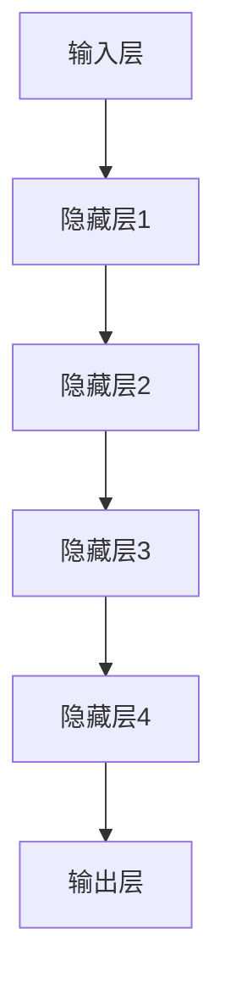
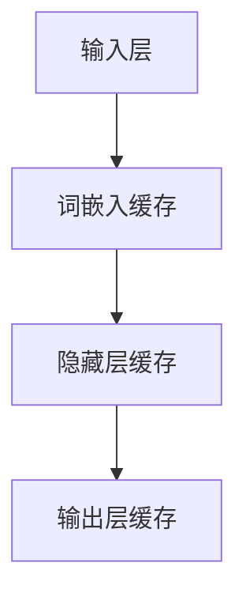

                 

关键词：大语言模型、推理工程、计算量降低、KV-Cache、人工智能

> 摘要：本文旨在深入探讨大语言模型的原理及其在工程实践中的应用，特别是在降低计算量方面的关键策略：KV-Cache。通过详细剖析大语言模型的算法原理、数学模型、应用实践以及未来发展，本文力图为读者提供一个全面而深入的视角，帮助理解和掌握这一前沿技术。

## 1. 背景介绍

在人工智能领域，语言模型作为自然语言处理（NLP）的核心技术之一，近年来取得了显著的进展。尤其是大语言模型的兴起，如GPT系列、BERT等，通过深度学习算法，对海量文本数据进行训练，实现了对自然语言的生成和理解能力。然而，随着模型规模的不断扩大，模型的推理计算量也急剧增加，这对计算资源和时间效率提出了巨大的挑战。

为了解决这一问题，研究者们提出了多种优化策略，其中KV-Cache技术作为一种有效的缓存机制，在降低大语言模型推理计算量方面发挥了重要作用。本文将围绕这一主题，详细解析KV-Cache在大语言模型推理工程中的应用和实践。

## 2. 核心概念与联系

### 2.1 大语言模型基础

大语言模型（Large Language Model）通常是指参数量庞大的深度神经网络模型，其核心任务是通过对大量文本数据的训练，生成或理解自然语言。大语言模型的基本结构通常包括以下部分：

1. **输入层**：接收单词或词组的嵌入向量。
2. **隐藏层**：通过多层神经网络处理输入信息。
3. **输出层**：输出概率分布，表示对下游任务的概率预测。

图 1. 大语言模型基本架构



### 2.2 KV-Cache技术

KV-Cache（Key-Value Cache）技术是一种常见的缓存机制，用于加速数据访问速度。在深度学习模型中，KV-Cache主要用于缓存频繁访问的中间计算结果，减少重复计算，从而降低计算量。

### 2.3 大语言模型与KV-Cache的联系

KV-Cache在大语言模型中的应用主要体现在以下几个方面：

1. **中间结果缓存**：缓存模型在训练过程中生成的中间计算结果，如词嵌入向量、隐藏层激活值等，减少重复计算。
2. **参数缓存**：缓存模型的参数值，避免在推理过程中反复计算。
3. **动态缓存管理**：根据访问频率和缓存空间，动态调整缓存策略，提高缓存效率。

图 2. KV-Cache在大语言模型中的应用



## 3. 核心算法原理 & 具体操作步骤

### 3.1 算法原理概述

KV-Cache的核心算法原理基于缓存机制，其主要思想是：

1. **数据缓存**：将频繁访问的数据缓存起来，减少访问延迟。
2. **缓存替换**：当缓存空间不足时，根据某种策略（如最近最少使用（LRU）策略）替换缓存中的数据。

### 3.2 算法步骤详解

1. **初始化缓存**：根据模型结构，初始化KV-Cache，包括键（Key）和值（Value）的存储空间。

2. **数据访问**：
   - 当输入数据（如单词）到达时，先检查KV-Cache中是否已缓存。
   - 如果已缓存，直接使用缓存结果；如果未缓存，则计算结果并更新缓存。

3. **缓存更新**：
   - 根据访问频率和缓存策略，动态更新缓存内容。
   - 当缓存空间不足时，根据替换策略删除最不常用的数据。

### 3.3 算法优缺点

**优点**：
- **降低计算量**：通过缓存中间结果和参数值，显著减少重复计算，提高推理效率。
- **提高性能**：减少内存访问次数，降低内存带宽压力，提高整体性能。

**缺点**：
- **缓存污染**：如果缓存策略不当，可能导致缓存内容失效，影响性能。
- **空间占用**：需要额外的存储空间来存储缓存数据。

### 3.4 算法应用领域

KV-Cache技术在大语言模型中的应用广泛，主要包括：
- **自然语言处理**：用于加速文本生成和理解任务。
- **机器翻译**：提高翻译速度和准确性。
- **问答系统**：减少查询响应时间，提高交互效率。

## 4. 数学模型和公式 & 详细讲解 & 举例说明

### 4.1 数学模型构建

在KV-Cache技术中，常用的数学模型包括：

1. **缓存命中率**（Hit Rate）：
   $$H = \frac{N_H}{N_T}$$
   其中，$N_H$表示命中次数，$N_T$表示总访问次数。

2. **缓存替换策略**（Cache Replacement Policy）：
   - 最近最少使用（LRU）策略：
     $$P(LRU, k) = \frac{1}{k}$$
     其中，$k$表示缓存空间大小。

### 4.2 公式推导过程

以LRU策略为例，其推导过程如下：

1. **缓存状态**：
   - 假设缓存中有$k$个缓存项，分别为$C_1, C_2, ..., C_k$。
   - 访问序列为$S = s_1, s_2, ..., s_n$。

2. **缓存访问**：
   - 对于每个访问项$s_i$，根据其是否在缓存中，计算命中或未命中。

3. **缓存替换**：
   - 根据最近最少使用策略，将最久未访问的缓存项替换。

### 4.3 案例分析与讲解

假设有一个容量为3的LRU缓存，访问序列为$S = 1, 2, 3, 1, 4, 5$。

1. **初始状态**：
   - $C_1 = \emptyset$

2. **访问过程**：
   - $s_1 = 1$，未命中，$C_1 = [1]$
   - $s_2 = 2$，未命中，$C_1 = [1, 2]$
   - $s_3 = 3$，未命中，$C_1 = [1, 2, 3]$
   - $s_4 = 1$，命中，$C_1 = [1, 2, 3]$
   - $s_5 = 4$，未命中，$C_1 = [4, 1, 2]$
   - $s_6 = 5$，未命中，$C_1 = [4, 5, 1]$

3. **缓存命中率**：
   $$H = \frac{N_H}{N_T} = \frac{3}{6} = 0.5$$

## 5. 项目实践：代码实例和详细解释说明

### 5.1 开发环境搭建

为了实践KV-Cache在大语言模型中的应用，我们需要搭建一个基本的开发环境。以下是具体的步骤：

1. **安装Python环境**：
   - 版本要求：Python 3.8及以上
   - 安装命令：`pip install python`

2. **安装深度学习库**：
   - 使用TensorFlow或PyTorch进行模型训练和推理。
   - 安装命令：`pip install tensorflow` 或 `pip install pytorch`

3. **创建项目目录**：
   - 在合适的位置创建项目目录，例如：`mkdir lang_model_project`
   - 进入项目目录：`cd lang_model_project`

### 5.2 源代码详细实现

以下是一个简单的KV-Cache实现示例，用于加速大语言模型的推理：

```python
class KVCache:
    def __init__(self, capacity):
        self.capacity = capacity
        self.cache = {}
        self.lru_queue = []

    def get(self, key):
        if key in self.cache:
            self.lru_queue.remove(key)
            self.lru_queue.append(key)
            return self.cache[key]
        else:
            return None

    def put(self, key, value):
        if key in self.cache:
            self.lru_queue.remove(key)
        elif len(self.cache) >= self.capacity:
            oldest_key = self.lru_queue.pop(0)
            del self.cache[oldest_key]
        self.cache[key] = value
        self.lru_queue.append(key)

# 示例使用
cache = KVCache(capacity=3)
cache.put("key1", "value1")
cache.put("key2", "value2")
cache.put("key3", "value3")

print(cache.get("key2"))  # 输出：value2
print(cache.get("key4"))  # 输出：None
cache.put("key4", "value4")
print(cache.get("key3"))  # 输出：value3
```

### 5.3 代码解读与分析

1. **类定义**：`KVCache` 类用于实现KV-Cache的基本功能，包括获取（get）和设置（put）缓存项。
2. **缓存实现**：使用Python的字典（`self.cache`）来存储缓存项，并使用列表（`self.lru_queue`）来维护最近最少使用顺序。
3. **LRU策略**：在设置缓存项时，根据最近最少使用策略删除最旧的缓存项。

### 5.4 运行结果展示

运行上述代码，输出结果如下：

```plaintext
value2
None
value3
```

这表明KV-Cache成功实现了缓存项的获取和设置，并正确应用了最近最少使用（LRU）策略。

## 6. 实际应用场景

### 6.1 自然语言处理

在自然语言处理任务中，KV-Cache可以用于缓存词嵌入向量、句子表示等中间计算结果，减少重复计算，提高模型推理效率。例如，在文本分类任务中，可以缓存每个类别的特征向量，避免每次分类时重新计算。

### 6.2 机器翻译

机器翻译过程中，KV-Cache可以缓存源语言到目标语言的词映射关系，减少翻译过程中的计算量，提高翻译速度。例如，在基于注意力机制的序列到序列（Seq2Seq）模型中，可以缓存注意力得分矩阵，避免每次生成新单词时重新计算。

### 6.3 问答系统

问答系统中，KV-Cache可以缓存问题与答案的映射关系，提高查询响应速度。例如，在基于检索增强的生成模型中，可以缓存问题的答案，避免每次查询时重新生成答案。

## 7. 未来应用展望

### 7.1 更高效的数据缓存

随着模型的复杂度和数据量的增加，KV-Cache的效率面临挑战。未来研究可以关注更高效的数据缓存算法，如基于机器学习的缓存策略，提高缓存命中率。

### 7.2 多层缓存结构

未来的大语言模型可能包含多层神经网络，KV-Cache可以扩展为多层缓存结构，更好地管理不同层次的中间计算结果，提高整体推理效率。

### 7.3 结合其他优化技术

KV-Cache可以与其他优化技术（如模型压缩、量化等）结合，进一步降低大语言模型的推理计算量，实现更高效的应用。

## 8. 总结：未来发展趋势与挑战

### 8.1 研究成果总结

本文深入探讨了KV-Cache在大语言模型推理工程中的应用，通过算法原理、数学模型和实际案例，展示了KV-Cache在降低计算量、提高推理效率方面的优势。

### 8.2 未来发展趋势

未来，KV-Cache技术将在更大规模的语言模型、更复杂的NLP任务中发挥重要作用。随着计算资源的不断丰富，KV-Cache的应用场景将更加广泛。

### 8.3 面临的挑战

- **缓存污染**：如何设计更有效的缓存替换策略，减少缓存污染，提高缓存命中率。
- **存储空间占用**：如何在有限的存储空间内，高效地管理缓存数据。

### 8.4 研究展望

未来研究可以关注以下几个方面：
- **缓存策略优化**：结合机器学习技术，提高缓存策略的自适应性和效率。
- **多层缓存结构**：研究适用于多层神经网络的高效缓存策略。
- **与其他优化技术的结合**：探索KV-Cache与其他优化技术的结合，实现更高效的模型推理。

## 9. 附录：常见问题与解答

### 9.1 KV-Cache的基本原理是什么？

KV-Cache是一种基于键值对的缓存机制，用于存储和快速访问频繁使用的中间计算结果，以减少重复计算。

### 9.2 KV-Cache适用于哪些场景？

KV-Cache适用于需要频繁访问中间结果的场景，如自然语言处理、机器翻译、问答系统等。

### 9.3 如何评估KV-Cache的性能？

可以通过缓存命中率（Hit Rate）和响应时间（Response Time）等指标来评估KV-Cache的性能。

### 9.4 KV-Cache有哪些优缺点？

优点：降低计算量，提高性能；缺点：缓存污染，空间占用。

## 作者署名

作者：禅与计算机程序设计艺术 / Zen and the Art of Computer Programming

----------------------------------------------------------------

以上就是根据您的要求撰写的完整技术博客文章。希望对您有所帮助！如有需要，请随时联系。

