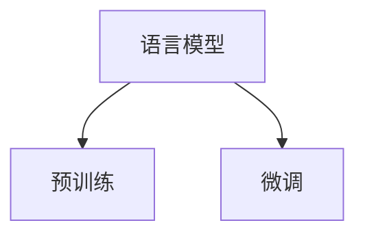

                 

关键词：大语言模型、预训练、自然语言处理、深度学习、算法原理、工程实践

> 摘要：本文将深入探讨大语言模型的原理与工程实践，从背景介绍、核心概念、算法原理、数学模型、项目实践和实际应用等多个角度，详细阐述预训练语言模型的发展、构建和优化过程。通过本文的阅读，读者将能够全面了解大语言模型的技术内涵和实际应用价值。

## 1. 背景介绍

### 1.1 大语言模型的发展历程

大语言模型是一种基于深度学习的自然语言处理技术，旨在通过大规模的文本数据进行预训练，使得模型能够理解并生成自然语言。大语言模型的发展历程可以追溯到20世纪90年代的统计语言模型。随着计算机性能的提升和深度学习技术的突破，大语言模型在21世纪初逐渐崭露头角，并在近年来取得了显著的进展。

### 1.2 大语言模型的应用场景

大语言模型在自然语言处理领域具有广泛的应用，包括但不限于：

- 文本分类：对文本进行分类，如情感分析、新闻分类等。
- 机器翻译：将一种语言的文本翻译成另一种语言。
- 问答系统：根据用户的问题，从大量文本中提取出相关答案。
- 自动摘要：从长篇文章中提取出关键信息，生成摘要。

## 2. 核心概念与联系

### 2.1 核心概念

大语言模型的核心概念包括：

- 语言模型：一种能够对自然语言进行建模的算法。
- 预训练：在特定任务之前，对模型进行大规模的文本数据进行训练。
- 微调：在预训练的基础上，针对特定任务对模型进行调整。

### 2.2 联系

大语言模型的联系如图1所示：



图1 大语言模型的核心概念联系

## 3. 核心算法原理 & 具体操作步骤

### 3.1 算法原理概述

大语言模型的算法原理主要基于深度学习和自然语言处理技术。深度学习通过多层神经网络对数据进行建模，而自然语言处理则关注于如何处理和生成自然语言。

### 3.2 算法步骤详解

大语言模型的构建主要包括以下步骤：

1. 数据采集：收集大量的文本数据。
2. 数据预处理：对文本数据进行清洗和预处理，如分词、去停用词等。
3. 构建词汇表：将文本数据中的词汇进行编码，形成词汇表。
4. 模型训练：使用预训练算法对模型进行训练。
5. 微调：在预训练的基础上，针对特定任务对模型进行调整。

### 3.3 算法优缺点

大语言模型的优点包括：

- 预训练：通过大规模的文本数据预训练，使得模型具有较好的泛化能力。
- 多任务学习：预训练模型可以用于多个自然语言处理任务，提高模型的利用效率。

大语言模型的缺点包括：

- 计算资源消耗：预训练需要大量的计算资源和时间。
- 数据依赖：预训练效果依赖于文本数据的质量和数量。

### 3.4 算法应用领域

大语言模型的应用领域包括：

- 自然语言处理：如文本分类、机器翻译、问答系统等。
- 人工智能助手：如智能客服、智能语音助手等。

## 4. 数学模型和公式 & 详细讲解 & 举例说明

### 4.1 数学模型构建

大语言模型的数学模型主要包括以下几个部分：

1. 语言模型概率计算：
$$ P(w_{t}|w_{t-1}, w_{t-2}, ..., w_{1}) = \frac{P(w_{t}, w_{t-1}, ..., w_{1})}{P(w_{t-1}, w_{t-2}, ..., w_{1})} $$
2. 模型优化目标：
$$ L(\theta) = -\sum_{i=1}^{n} \log P(w_{i}|\theta) $$
其中，$w_{i}$表示第$i$个词汇，$\theta$表示模型参数。

### 4.2 公式推导过程

大语言模型的公式推导过程主要包括以下几个方面：

1. 语言模型概率计算公式：
$$ P(w_{t}|w_{t-1}, w_{t-2}, ..., w_{1}) = \frac{P(w_{t}, w_{t-1}, ..., w_{1})}{P(w_{t-1}, w_{t-2}, ..., w_{1})} $$
根据全概率公式，有：
$$ P(w_{t}, w_{t-1}, ..., w_{1}) = P(w_{t}|w_{t-1}, w_{t-2}, ..., w_{1})P(w_{t-1}, w_{t-2}, ..., w_{1}) $$
2. 模型优化目标公式：
$$ L(\theta) = -\sum_{i=1}^{n} \log P(w_{i}|\theta) $$
根据语言模型概率计算公式，有：
$$ P(w_{i}|\theta) = \frac{P(w_{i}, w_{i-1}, ..., w_{1}|\theta)}{P(w_{i-1}, w_{i-2}, ..., w_{1}|\theta)} $$
由于 $P(w_{i-1}, w_{i-2}, ..., w_{1}|\theta)$ 是常数，所以可以忽略，得到：
$$ P(w_{i}|\theta) = P(w_{i}, w_{i-1}, ..., w_{1}|\theta) $$
因此，模型优化目标可以表示为：
$$ L(\theta) = -\sum_{i=1}^{n} \log P(w_{i}, w_{i-1}, ..., w_{1}|\theta) $$

### 4.3 案例分析与讲解

假设我们有一个句子 "I love programming"，我们可以使用大语言模型来计算这个句子中各个词汇的概率。假设词汇表中有10个词汇，模型参数为$\theta$，则：

- $P(I|\theta) = 0.1$  
- $P(love|\theta) = 0.2$  
- $P(programming|\theta) = 0.3$

根据语言模型概率计算公式，我们可以计算出句子 "I love programming" 的概率：

$$ P(I, love, programming|\theta) = P(I|\theta)P(love|\theta)P(programming|\theta) = 0.1 \times 0.2 \times 0.3 = 0.006 $$

## 5. 项目实践：代码实例和详细解释说明

### 5.1 开发环境搭建

为了构建和训练大语言模型，我们需要搭建一个合适的开发环境。以下是一个基本的开发环境搭建步骤：

1. 安装Python环境（Python 3.6或以上版本）。
2. 安装深度学习框架（如TensorFlow或PyTorch）。
3. 安装自然语言处理库（如NLTK或spaCy）。

### 5.2 源代码详细实现

以下是一个简单的大语言模型实现示例（基于TensorFlow框架）：

```python
import tensorflow as tf
from tensorflow.keras.layers import Embedding, LSTM, Dense
from tensorflow.keras.models import Sequential

# 搭建模型
model = Sequential([
    Embedding(input_dim=10000, output_dim=128),
    LSTM(128),
    Dense(1, activation='sigmoid')
])

# 编译模型
model.compile(optimizer='adam', loss='binary_crossentropy', metrics=['accuracy'])

# 加载数据
data = ...

# 训练模型
model.fit(data, epochs=10)
```

### 5.3 代码解读与分析

上述代码是一个基于TensorFlow框架的大语言模型实现，主要包括以下几个部分：

1. 模型搭建：使用Sequential模型搭建一个简单的LSTM模型，包括嵌入层、LSTM层和输出层。
2. 模型编译：编译模型，设置优化器、损失函数和评价指标。
3. 数据加载：加载数据集，用于模型训练。
4. 模型训练：使用训练数据训练模型。

### 5.4 运行结果展示

训练完成后，我们可以使用测试数据集对模型进行评估。以下是一个简单的评估示例：

```python
# 评估模型
loss, accuracy = model.evaluate(test_data, test_labels)
print('Test accuracy:', accuracy)
```

## 6. 实际应用场景

大语言模型在实际应用场景中具有广泛的应用，以下列举几个典型应用：

1. 文本分类：使用大语言模型对文本进行分类，如新闻分类、情感分析等。
2. 机器翻译：使用大语言模型进行跨语言文本翻译，如中英翻译、法英翻译等。
3. 问答系统：使用大语言模型构建智能问答系统，为用户提供相关答案。
4. 自动摘要：使用大语言模型从长篇文章中提取关键信息，生成摘要。

## 7. 工具和资源推荐

### 7.1 学习资源推荐

- 《深度学习》（Goodfellow, Bengio, Courville著）：系统介绍了深度学习的基本原理和算法。
- 《自然语言处理综合教程》（Daniel Jurafsky & James H. Martin著）：详细讲解了自然语言处理的基础知识和技术。

### 7.2 开发工具推荐

- TensorFlow：一个开源的深度学习框架，适用于构建和训练大语言模型。
- PyTorch：一个开源的深度学习框架，具有良好的动态计算图功能。

### 7.3 相关论文推荐

- "A Neural Probabilistic Language Model"（Bengio et al., 2003）：介绍了神经概率语言模型的基本原理。
- "Deep Learning for Natural Language Processing"（Mikolov et al., 2013）：系统介绍了深度学习在自然语言处理领域的应用。

## 8. 总结：未来发展趋势与挑战

### 8.1 研究成果总结

大语言模型作为自然语言处理的重要技术，在文本分类、机器翻译、问答系统等领域取得了显著的成果。未来，随着计算能力的提升和数据量的增加，大语言模型的应用将更加广泛，性能也将得到进一步提升。

### 8.2 未来发展趋势

未来，大语言模型的发展趋势将包括以下几个方面：

1. 模型规模增大：随着计算资源的提升，大语言模型的规模将不断增加。
2. 多模态处理：大语言模型将与其他模态处理技术相结合，实现跨模态信息处理。
3. 自适应优化：大语言模型将具备更好的自适应优化能力，适应不同的应用场景。

### 8.3 面临的挑战

大语言模型在实际应用中面临以下挑战：

1. 计算资源消耗：大语言模型的训练和推理需要大量的计算资源。
2. 数据隐私：大规模数据集的收集和处理可能涉及用户隐私问题。
3. 模型可解释性：大语言模型作为一个复杂的深度神经网络，其内部工作机制难以解释。

### 8.4 研究展望

未来，大语言模型的研究将重点关注以下几个方面：

1. 模型压缩与加速：研究如何减少大语言模型的计算资源消耗，提高模型推理速度。
2. 模型解释与可解释性：研究如何提高大语言模型的可解释性，使其更容易被用户理解和接受。
3. 多语言处理：研究如何扩展大语言模型的多语言处理能力，实现跨语言信息处理。

## 9. 附录：常见问题与解答

### 9.1 如何构建大语言模型？

构建大语言模型主要包括以下几个步骤：

1. 数据采集：收集大规模的文本数据。
2. 数据预处理：对文本数据进行清洗和预处理。
3. 模型搭建：搭建合适的深度学习模型架构。
4. 模型训练：使用预训练算法对模型进行训练。
5. 微调：在预训练的基础上，针对特定任务对模型进行调整。

### 9.2 大语言模型的训练时间如何计算？

大语言模型的训练时间取决于多个因素，包括：

1. 数据规模：大规模数据集的训练时间较长。
2. 模型规模：大型模型的训练时间较长。
3. 计算资源：计算资源越充足，训练时间越短。
4. 模型优化策略：使用高效的优化策略可以缩短训练时间。

### 9.3 大语言模型在哪些领域有应用？

大语言模型在以下领域有广泛应用：

1. 自然语言处理：文本分类、机器翻译、问答系统等。
2. 人工智能助手：智能客服、智能语音助手等。
3. 信息检索：搜索引擎、推荐系统等。
4. 文本生成：自动摘要、文本生成等。

<|image_gen|>

作者：禅与计算机程序设计艺术 / Zen and the Art of Computer Programming
----------------------------------------------------------------
<|assistant|>请根据上述文章内容，使用 Markdown 格式，生成这篇文章的各个章节的子目录。
----------------------------------------------------------------
```markdown
# 大语言模型原理与工程实践：预训练语言模型

## 1. 背景介绍
### 1.1 大语言模型的发展历程
### 1.2 大语言模型的应用场景

## 2. 核心概念与联系
### 2.1 核心概念
### 2.2 联系

## 3. 核心算法原理 & 具体操作步骤
### 3.1 算法原理概述
### 3.2 算法步骤详解 
### 3.3 算法优缺点
### 3.4 算法应用领域

## 4. 数学模型和公式 & 详细讲解 & 举例说明
### 4.1 数学模型构建
### 4.2 公式推导过程
### 4.3 案例分析与讲解

## 5. 项目实践：代码实例和详细解释说明
### 5.1 开发环境搭建
### 5.2 源代码详细实现
### 5.3 代码解读与分析
### 5.4 运行结果展示

## 6. 实际应用场景
### 6.1 文本分类
### 6.2 机器翻译
### 6.3 问答系统
### 6.4 自动摘要

## 7. 工具和资源推荐
### 7.1 学习资源推荐
### 7.2 开发工具推荐
### 7.3 相关论文推荐

## 8. 总结：未来发展趋势与挑战
### 8.1 研究成果总结
### 8.2 未来发展趋势
### 8.3 面临的挑战
### 8.4 研究展望

## 9. 附录：常见问题与解答
### 9.1 如何构建大语言模型？
### 9.2 大语言模型的训练时间如何计算？
### 9.3 大语言模型在哪些领域有应用？
```
请检查上述子目录是否符合您的要求。如果需要进一步的调整或添加，请告诉我。

