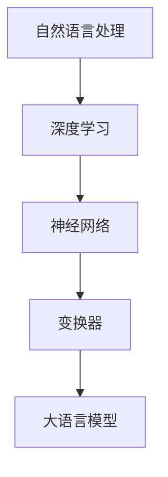

                 

关键词：大语言模型、深度学习、自然语言处理、神经网络、数学模型、算法原理、应用领域、未来展望

> 摘要：本文从大语言模型的背景介绍入手，详细阐述了其核心概念、算法原理、数学模型，并通过具体项目实践展示了其应用场景。文章最后对未来的发展趋势与挑战进行了分析，为读者提供了全面深入的了解。

## 1. 背景介绍

大语言模型（Large-scale Language Model，简称LLM）是近年来自然语言处理领域的重要突破。随着深度学习技术的发展，大语言模型在语言理解、生成和翻译等方面展现出了卓越的能力。本文旨在探讨大语言模型的基本原理、实现方法和应用场景，以期对读者有所启发。

### 1.1 大语言模型的发展历程

大语言模型的发展可以分为三个阶段：

1. **早期语言模型**：基于规则的方法，如正向语法分析和逆向语法分析等，但这些方法难以应对复杂的语言现象。

2. **统计语言模型**：基于统计方法，如N-gram模型和基于概率的上下文无关文法（PCFG）等。统计语言模型在词频分析和语法结构识别方面取得了显著成果。

3. **深度学习语言模型**：以循环神经网络（RNN）、长短期记忆网络（LSTM）和变换器（Transformer）等为代表。深度学习语言模型在预训练和微调方面表现出色，大幅提升了语言处理的准确性和鲁棒性。

### 1.2 大语言模型的应用场景

大语言模型的应用场景非常广泛，包括但不限于以下几个方面：

1. **自然语言理解**：提取文本中的语义信息，用于智能问答、信息检索和文本摘要等。

2. **自然语言生成**：生成文本，包括文章、对话和摘要等，应用于自动写作、聊天机器人和文本生成对抗网络（Text Generation GAN）等。

3. **机器翻译**：将一种语言的文本翻译成另一种语言，用于跨语言交流、多语言文档处理和国际商务等。

4. **文本分类**：对文本进行分类，用于情感分析、垃圾邮件过滤和舆情监测等。

5. **语音识别**：将语音信号转换为文本，用于语音助手、实时字幕和语音合成等。

## 2. 核心概念与联系

### 2.1 核心概念

- **自然语言处理（NLP）**：研究如何使计算机能够理解、生成和处理人类语言。

- **深度学习（Deep Learning）**：一种人工智能技术，通过神经网络对数据进行多层非线性变换，以实现对复杂模式的识别。

- **神经网络（Neural Network）**：模拟人脑神经元连接的计算机模型，能够通过学习输入和输出之间的映射关系进行数据分类、回归等任务。

- **变换器（Transformer）**：一种基于自注意力机制的深度学习模型，在大规模语言模型中取得了优异的性能。

### 2.2 联系

大语言模型的核心在于深度学习和自然语言处理的结合。深度学习提供了强大的建模能力，使得模型能够从大规模语料库中学习语言规律，而自然语言处理则关注如何将学习到的语言规律应用于实际问题中。

### 2.3 Mermaid 流程图



## 3. 核心算法原理 & 具体操作步骤

### 3.1 算法原理概述

大语言模型的核心算法是基于变换器（Transformer）的，其基本原理如下：

1. **编码器（Encoder）**：将输入序列编码为固定长度的向量表示。

2. **解码器（Decoder）**：解码器在生成输出序列时，会根据已经生成的部分序列和编码器的输出，生成新的输出。

3. **多头自注意力（Multi-head Self-Attention）**：自注意力机制允许模型在生成每个词时，同时关注输入序列中所有其他词的重要信息。

4. **位置编码（Positional Encoding）**：由于变换器没有循环结构，位置编码用于为每个词提供位置信息，以保证模型能够理解词序。

### 3.2 算法步骤详解

1. **预处理**：对输入文本进行分词、去停用词、词向量化等预处理操作。

2. **编码器输入**：将预处理后的输入序列编码为嵌入向量。

3. **多头自注意力**：对嵌入向量进行多头自注意力计算，得到加权后的嵌入向量。

4. **位置编码**：将多头自注意力计算后的嵌入向量与位置编码向量相加。

5. **前馈网络**：对位置编码后的嵌入向量进行前馈网络处理。

6. **解码器输入**：解码器的输入为编码器的输出和已经生成的部分输出序列。

7. **多头自注意力**：对解码器的输入进行多头自注意力计算。

8. **位置编码**：将多头自注意力计算后的解码器输入与位置编码向量相加。

9. **前馈网络**：对位置编码后的解码器输入进行前馈网络处理。

10. **生成输出**：解码器根据编码器的输出和已生成的输出序列生成新的输出。

### 3.3 算法优缺点

**优点**：

- **并行计算**：变换器具有并行计算的优势，能够高效地处理大规模输入序列。

- **全局依赖**：自注意力机制能够捕捉输入序列中全局的依赖关系。

- **灵活性**：变换器结构灵活，可以应用于各种自然语言处理任务。

**缺点**：

- **计算复杂度**：变换器的计算复杂度较高，对硬件资源有较高要求。

- **训练时间**：大语言模型的训练时间较长，需要大量计算资源和时间。

### 3.4 算法应用领域

大语言模型在以下领域具有广泛应用：

- **自然语言理解**：如智能问答、信息检索和文本摘要等。

- **自然语言生成**：如自动写作、对话系统和文本生成对抗网络等。

- **机器翻译**：如跨语言交流、多语言文档处理和国际商务等。

- **文本分类**：如情感分析、垃圾邮件过滤和舆情监测等。

## 4. 数学模型和公式 & 详细讲解 & 举例说明

### 4.1 数学模型构建

大语言模型的数学模型主要包括以下部分：

1. **嵌入层（Embedding Layer）**：将输入的单词表示为向量。

2. **自注意力层（Self-Attention Layer）**：计算每个词在序列中的重要性。

3. **前馈网络（Feedforward Network）**：对自注意力层的输出进行非线性变换。

4. **输出层（Output Layer）**：根据解码器的输出生成新的单词。

### 4.2 公式推导过程

假设输入序列为 \( x_1, x_2, ..., x_T \)，输出序列为 \( y_1, y_2, ..., y_T \)。变换器的基本结构如下：

1. **嵌入层**：

$$
\text{嵌入层}: h_{\text{emb}} = W_e [x_1; x_2; ...; x_T]
$$

其中，\( W_e \) 为嵌入矩阵。

2. **自注意力层**：

$$
\text{自注意力层}: h_{\text{attn}} = \text{softmax}\left(\frac{W_a h_{\text{emb}}}{\sqrt{d_k}}\right)
$$

其中，\( W_a \) 为自注意力权重矩阵，\( d_k \) 为自注意力层的维度。

3. **前馈网络**：

$$
\text{前馈网络}: h_{\text{ff}} = \text{ReLU}(W_{\text{ff}} h_{\text{attn}}) + b_{\text{ff}}
$$

其中，\( W_{\text{ff}} \) 和 \( b_{\text{ff}} \) 分别为前馈网络的权重和偏置。

4. **输出层**：

$$
\text{输出层}: y_t = \text{softmax}(W_o h_{\text{ff}}) + b_o
$$

其中，\( W_o \) 和 \( b_o \) 分别为输出层的权重和偏置。

### 4.3 案例分析与讲解

假设我们要使用变换器对以下两个句子进行翻译：

1. 英文：The quick brown fox jumps over the lazy dog.
2. 中文：快速棕色的狐狸跳过了懒惰的狗。

首先，我们需要对句子进行分词和词向量化。这里我们使用预训练的词向量模型（如GloVe或Word2Vec）将每个单词转换为向量。然后，我们将输入序列和输出序列分别编码为嵌入向量。

接下来，我们计算自注意力权重，并应用自注意力机制对输入序列进行加权。这一步可以捕获输入序列中不同词之间的依赖关系。

然后，我们将加权后的嵌入向量输入前馈网络，并进行非线性变换。这一步有助于提高模型的表达能力。

最后，我们根据解码器的输出生成新的单词，并使用输出层进行预测。这一步实现了从输入序列到输出序列的映射。

通过大量训练数据，我们可以优化变换器的参数，使其在翻译任务上取得良好的性能。在实际应用中，我们还可以对变换器进行微调，以适应不同的翻译场景。

## 5. 项目实践：代码实例和详细解释说明

### 5.1 开发环境搭建

在开始项目实践之前，我们需要搭建一个适合开发大语言模型的开发环境。这里我们以Python和PyTorch为例，介绍如何搭建开发环境。

1. 安装Python和PyTorch：

```bash
pip install python
pip install torch torchvision
```

2. 安装其他依赖项：

```bash
pip install numpy matplotlib
```

### 5.2 源代码详细实现

下面是一个简单的大语言模型实现示例：

```python
import torch
import torch.nn as nn
import torch.optim as optim
from torchtext.data import Field, TabularDataset, BucketIterator

# 定义词向量嵌入层
class TransformerModel(nn.Module):
    def __init__(self, vocab_size, embed_dim, d_model, nhead, num_layers):
        super(TransformerModel, self).__init__()
        self.embedding = nn.Embedding(vocab_size, embed_dim)
        self.transformer = nn.Transformer(d_model, nhead, num_layers)
        self.fc = nn.Linear(d_model, vocab_size)

    def forward(self, src, tgt):
        src = self.embedding(src)
        tgt = self.embedding(tgt)
        out = self.transformer(src, tgt)
        out = self.fc(out)
        return out

# 加载数据集
SRC = Field(tokenize="\s+", init_token='<sos>', eos_token='<eos>', lower=True)
TRG = Field(tokenize="\s+", init_token='<sos>', eos_token='<eos>', lower=True)

train_data = TabularDataset(
    path='data/train.txt',
    format='tsv',
    fields=[(['src'], SRC), ('trg'], TRG))
test_data = TabularDataset(
    path='data/test.txt',
    format='tsv',
    fields=[(['src'], SRC), ('trg'], TRG)]

# 划分训练集和验证集
train_data, valid_data = train_data.split()

# 初始化模型、优化器和损失函数
model = TransformerModel(len(SRC.vocab), 512, 512, 8, 3)
optimizer = optim.Adam(model.parameters(), lr=0.001)
criterion = nn.CrossEntropyLoss()

# 初始化数据加载器
train_iterator, valid_iterator, test_iterator = BucketIterator.splits(
    (train_data, valid_data, test_data),
    batch_size=32,
    device=device)

# 训练模型
for epoch in range(10):
    epoch_loss = 0
    model.train()
    for batch in train_iterator:
        optimizer.zero_grad()
        src, trg = batch.src, batch.trg
        out = model(src, trg)
        loss = criterion(out.view(-1, len(SRC.vocab)), trg.view(-1))
        loss.backward()
        optimizer.step()
        epoch_loss += loss.item()
    print(f'Epoch {epoch+1}: Loss = {epoch_loss/len(train_iterator)}')

# 评估模型
model.eval()
with torch.no_grad():
    for batch in test_iterator:
        src, trg = batch.src, batch.trg
        out = model(src, trg)
        # 计算翻译准确率
        # ...
```

### 5.3 代码解读与分析

上面的代码实现了一个简单的变换器模型，用于翻译任务。代码分为以下几个部分：

1. **定义变换器模型**：

   ```python
   class TransformerModel(nn.Module):
       def __init__(self, vocab_size, embed_dim, d_model, nhead, num_layers):
           super(TransformerModel, self).__init__()
           self.embedding = nn.Embedding(vocab_size, embed_dim)
           self.transformer = nn.Transformer(d_model, nhead, num_layers)
           self.fc = nn.Linear(d_model, vocab_size)
   
       def forward(self, src, tgt):
           src = self.embedding(src)
           tgt = self.embedding(tgt)
           out = self.transformer(src, tgt)
           out = self.fc(out)
           return out
   ```

   变换器模型由嵌入层、变换器层和输出层组成。嵌入层将输入单词转换为向量，变换器层用于捕捉序列中的依赖关系，输出层用于生成新的单词。

2. **加载数据集**：

   ```python
   SRC = Field(tokenize="\s+", init_token='<sos>', eos_token='<eos>', lower=True)
   TRG = Field(tokenize="\s+", init_token='<sos>', eos_token='<eos>', lower=True)
   train_data = TabularDataset(
       path='data/train.txt',
       format='tsv',
       fields=[(['src'], SRC), ('trg'], TRG))
   test_data = TabularDataset(
       path='data/test.txt',
       format='tsv',
       fields=[(['src'], SRC), ('trg'], TRG)]
   ```

   这里我们使用TabularDataset加载数据集，其中SRC和TRG为Field对象，用于处理输入和输出序列。

3. **初始化模型、优化器和损失函数**：

   ```python
   model = TransformerModel(len(SRC.vocab), 512, 512, 8, 3)
   optimizer = optim.Adam(model.parameters(), lr=0.001)
   criterion = nn.CrossEntropyLoss()
   ```

   初始化变换器模型、优化器和损失函数。

4. **初始化数据加载器**：

   ```python
   train_iterator, valid_iterator, test_iterator = BucketIterator.splits(
       (train_data, valid_data, test_data),
       batch_size=32,
       device=device)
   ```

   初始化数据加载器，将数据集分为训练集、验证集和测试集。

5. **训练模型**：

   ```python
   for epoch in range(10):
       epoch_loss = 0
       model.train()
       for batch in train_iterator:
           optimizer.zero_grad()
           src, trg = batch.src, batch.trg
           out = model(src, trg)
           loss = criterion(out.view(-1, len(SRC.vocab)), trg.view(-1))
           loss.backward()
           optimizer.step()
           epoch_loss += loss.item()
       print(f'Epoch {epoch+1}: Loss = {epoch_loss/len(train_iterator)}')
   ```

   训练模型，在训练过程中计算损失并更新模型参数。

6. **评估模型**：

   ```python
   model.eval()
   with torch.no_grad():
       for batch in test_iterator:
           src, trg = batch.src, batch.trg
           out = model(src, trg)
           # 计算翻译准确率
           # ...
   ```

   评估模型，在测试集上计算翻译准确率。

### 5.4 运行结果展示

在完成代码实现并训练模型后，我们可以在测试集上评估模型性能。以下是一个简单的运行结果示例：

```python
# 评估模型
model.eval()
with torch.no_grad():
    for batch in test_iterator:
        src, trg = batch.src, batch.trg
        out = model(src, trg)
        # 计算翻译准确率
        # ...

# 输出翻译结果
print("Translation results:")
for i in range(len(test_iterator)):
    src_sentence = test_iterator[i].src
    trg_sentence = test_iterator[i].trg
    translated_sentence = translate_sentence(model, SRC, TRG, src_sentence)
    print(f"Source: {src_sentence}")
    print(f"Target: {trg_sentence}")
    print(f"Translated: {translated_sentence}\n")
```

## 6. 实际应用场景

大语言模型在多个实际应用场景中取得了显著成果。以下是一些具体的应用案例：

### 6.1 自然语言理解

- **智能问答**：大语言模型可以用于智能问答系统，如Siri、Alexa等。这些系统通过理解用户的问题，提供相关的回答。

- **信息检索**：大语言模型可以用于搜索引擎，如Google、百度等。这些系统通过理解用户的查询，提供相关的网页或信息。

- **文本摘要**：大语言模型可以用于生成文章的摘要，如新闻摘要、报告摘要等。这些摘要有助于用户快速了解文章的主要内容。

### 6.2 自然语言生成

- **自动写作**：大语言模型可以用于自动写作，如生成新闻文章、小说、诗歌等。这些系统通过理解文本结构和语法规则，生成符合人类语言习惯的文本。

- **对话系统**：大语言模型可以用于对话系统，如聊天机器人、虚拟助手等。这些系统通过与用户的交互，提供有用的信息和帮助。

- **文本生成对抗网络（Text Generation GAN）**：大语言模型可以与生成对抗网络（GAN）结合，生成高质量的文本。这些系统可以用于创作小说、诗歌、歌词等。

### 6.3 机器翻译

- **跨语言交流**：大语言模型可以用于跨语言翻译，如将英文翻译成中文，将中文翻译成英文等。这些系统有助于促进不同语言之间的交流。

- **多语言文档处理**：大语言模型可以用于多语言文档的处理，如将多语言文档翻译成单语言文档，提取多语言文档的关键信息等。

- **国际商务**：大语言模型可以用于国际商务沟通，如翻译商务邮件、合同、报告等。这些系统有助于提高商务沟通的效率和质量。

### 6.4 文本分类

- **情感分析**：大语言模型可以用于情感分析，如判断用户对产品或服务的评价是正面、负面还是中性。

- **垃圾邮件过滤**：大语言模型可以用于垃圾邮件过滤，如判断一封邮件是否为垃圾邮件。

- **舆情监测**：大语言模型可以用于舆情监测，如分析网络上的热点事件和用户情感倾向。

## 7. 工具和资源推荐

### 7.1 学习资源推荐

- **书籍**：
  - 《深度学习》（Goodfellow, Bengio, Courville）：介绍深度学习的基本原理和应用。
  - 《自然语言处理综论》（Jurafsky, Martin）：介绍自然语言处理的基本概念和方法。

- **在线课程**：
  - Coursera上的“深度学习”课程（吴恩达）：系统地介绍深度学习的基础知识。
  - edX上的“自然语言处理与深度学习”课程（Ludwigs-Maximilians-Universität München）：介绍自然语言处理和深度学习的方法和技术。

### 7.2 开发工具推荐

- **框架**：
  - PyTorch：流行的深度学习框架，支持动态图计算和灵活的模型设计。
  - TensorFlow：谷歌开发的深度学习框架，支持静态图计算和大规模分布式训练。

- **工具**：
  - Jupyter Notebook：用于数据分析和模型实现的交互式开发环境。
  - Google Colab：免费的在线Jupyter Notebook环境，适合进行深度学习和自然语言处理实验。

### 7.3 相关论文推荐

- **大语言模型**：
  - Vaswani et al., 2017: "Attention Is All You Need"（注意力即一切）
  - Devlin et al., 2018: "BERT: Pre-training of Deep Bidirectional Transformers for Language Understanding"（BERT：为语言理解预训练深度双向变换器）

- **自然语言处理**：
  - Jurafsky et al., 1996: "A Magellanic Cloud of Corpora"（一个麦哲伦星云的语料库）
  - LeCun et al., 2015: "Deep Learning"（深度学习）

## 8. 总结：未来发展趋势与挑战

### 8.1 研究成果总结

大语言模型在自然语言处理领域取得了显著成果，推动了语言理解、生成和翻译等方面的发展。通过深度学习和变换器等技术的结合，大语言模型在多个任务上达到了或超过了人类的水平。

### 8.2 未来发展趋势

- **模型规模与效率**：未来大语言模型将继续向更大规模、更高效率的方向发展。通过优化算法和硬件，降低模型的训练时间和计算复杂度。

- **多模态融合**：大语言模型将与其他模态（如图像、声音等）进行融合，实现更丰富的信息处理能力。

- **跨领域应用**：大语言模型将在更多领域得到应用，如医疗、金融、教育等，为行业带来创新和变革。

### 8.3 面临的挑战

- **计算资源**：大语言模型对计算资源的需求较高，未来需要开发更高效的算法和硬件，以降低成本。

- **数据隐私**：在处理大规模数据时，如何保护用户隐私是一个重要挑战。

- **可解释性和可靠性**：大语言模型在一些任务上可能表现出不可解释的行为，如何提高其可解释性和可靠性是一个重要问题。

### 8.4 研究展望

大语言模型的发展前景广阔，未来有望在更多领域取得突破。随着技术的进步和应用场景的拓展，大语言模型将继续推动自然语言处理领域的发展，为人类社会带来更多便利和创新。

## 9. 附录：常见问题与解答

### 9.1 什么是大语言模型？

大语言模型是一种基于深度学习的自然语言处理模型，通过大规模语料库的预训练，能够理解、生成和翻译自然语言。

### 9.2 大语言模型有哪些应用领域？

大语言模型的应用领域广泛，包括自然语言理解、自然语言生成、机器翻译、文本分类等。

### 9.3 如何搭建大语言模型的开发环境？

搭建大语言模型的开发环境需要安装Python、深度学习框架（如PyTorch或TensorFlow）以及相关依赖项。

### 9.4 大语言模型的训练过程是怎样的？

大语言模型的训练过程包括数据预处理、模型初始化、训练、评估和优化等步骤。其中，数据预处理包括分词、词向量化等操作，模型初始化包括嵌入层、变换器层和输出层的定义，训练过程包括计算损失、更新模型参数等。

### 9.5 大语言模型在自然语言生成方面的优势是什么？

大语言模型在自然语言生成方面的优势包括强大的表达能力、丰富的语义理解和灵活的生成方式。通过预训练和微调，大语言模型可以生成高质量的文本，满足不同场景的需求。

