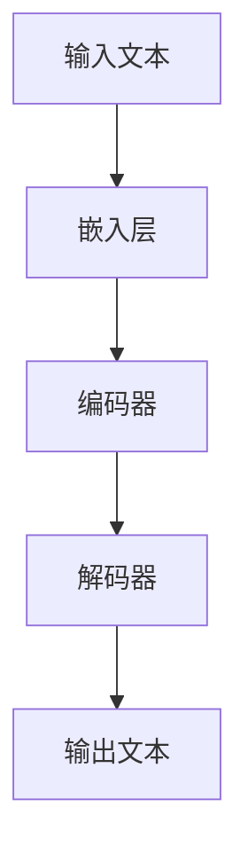

                 

关键词：大语言模型、原理基础、前沿技术、样本选择、深度学习、自然语言处理、神经网络、机器学习

摘要：本文旨在深入探讨大语言模型的原理基础及其在自然语言处理领域的应用，重点阐述前沿技术如何影响模型的效果，以及如何进行有效的样本选择。通过本文的阐述，读者将能够了解大语言模型的发展脉络，掌握其核心原理，并认识到样本选择在模型性能提升中的关键作用。

## 1. 背景介绍

### 大语言模型的兴起

大语言模型是自然语言处理（NLP）领域的重大突破，其核心在于能够理解并生成人类语言。自2018年Google提出BERT（Bidirectional Encoder Representations from Transformers）以来，大语言模型的研究与应用呈现出爆炸式增长。BERT的成功标志着大语言模型在预训练和微调方面的巨大潜力，为NLP任务带来了前所未有的效果提升。

### 自然语言处理的重要性

自然语言处理是人工智能领域的重要组成部分，旨在使计算机能够理解、生成和交互人类语言。随着互联网和社交媒体的迅猛发展，NLP在信息检索、文本分类、机器翻译、问答系统等领域的应用越来越广泛。大语言模型的兴起，为这些应用场景提供了强大的技术支撑。

## 2. 核心概念与联系

### 大语言模型的定义

大语言模型是指通过深度学习技术，对大量文本数据进行预训练，从而获得对自然语言深刻理解能力的模型。这些模型通常采用神经网络架构，尤其是Transformer架构，具有强大的表示和学习能力。

### 大语言模型的关键组成部分

大语言模型的关键组成部分包括：
1. **嵌入层**：将单词转换为向量表示。
2. **编码器**：使用Transformer架构对文本进行编码，提取语义特征。
3. **解码器**：根据编码器的输出，生成目标文本。

### Mermaid 流程图

下面是一个简化的大语言模型流程图：



### 大语言模型的工作原理

大语言模型通过预训练和微调两个阶段进行训练：
1. **预训练**：在大量无标注的文本数据上进行，学习文本的通用表示。
2. **微调**：在特定任务的数据上进行，调整模型的参数，使其适应特定任务。

## 3. 核心算法原理 & 具体操作步骤

### 3.1 算法原理概述

大语言模型的核心算法是基于Transformer架构。Transformer架构摒弃了传统的循环神经网络（RNN）和卷积神经网络（CNN），采用自注意力机制（Self-Attention）和多头注意力（Multi-Head Attention），使得模型能够全局捕捉文本中的关系。

### 3.2 算法步骤详解

大语言模型的算法步骤主要包括以下几部分：

1. **嵌入层**：将单词转换为向量表示，通常使用词向量模型（如Word2Vec、GloVe）或BERT等预训练模型。
2. **编码器**：编码器采用Transformer架构，对文本进行编码，提取语义特征。编码器的主要步骤包括：
   - **多头自注意力机制**：通过自注意力机制，编码器能够捕捉文本中的局部和全局关系。
   - **前馈神经网络**：在自注意力机制之后，通过前馈神经网络对特征进行进一步处理。
3. **解码器**：解码器同样采用Transformer架构，生成目标文本。解码器的主要步骤包括：
   - **多头交叉注意力机制**：解码器在生成每个词时，不仅关注输入序列的当前词，还关注输入序列的其他词。
   - **前馈神经网络**：在交叉注意力机制之后，通过前馈神经网络对特征进行进一步处理。
4. **损失函数**：大语言模型的损失函数通常使用交叉熵损失，用于衡量预测文本与真实文本之间的差异。

### 3.3 算法优缺点

**优点**：
- **强大的表示能力**：Transformer架构能够全局捕捉文本中的关系，使得模型具有强大的表示能力。
- **并行计算**：由于Transformer架构摒弃了循环结构，使得模型能够实现并行计算，提高训练效率。
- **适用广泛**：大语言模型在多种NLP任务中表现出色，如文本分类、机器翻译、问答系统等。

**缺点**：
- **计算资源消耗大**：大语言模型通常需要大量计算资源和时间进行训练。
- **模型可解释性差**：由于模型结构的复杂性，大语言模型的可解释性较差，难以理解模型的决策过程。

### 3.4 算法应用领域

大语言模型在自然语言处理领域有广泛的应用，包括：

- **文本分类**：用于对新闻、社交媒体、论坛等文本进行分类。
- **机器翻译**：用于将一种语言翻译成另一种语言。
- **问答系统**：用于回答用户提出的问题，如搜索引擎、聊天机器人等。
- **文本生成**：用于生成文章、故事、代码等。

## 4. 数学模型和公式 & 详细讲解 & 举例说明

### 4.1 数学模型构建

大语言模型的数学模型主要包括以下几个部分：

- **嵌入层**：将单词转换为向量表示，通常使用词向量模型。
- **编码器**：采用Transformer架构，包括多头自注意力机制和前馈神经网络。
- **解码器**：采用Transformer架构，包括多头交叉注意力机制和前馈神经网络。
- **损失函数**：通常使用交叉熵损失。

### 4.2 公式推导过程

#### 嵌入层

$$
\text{嵌入层}：\text{word} \rightarrow \text{vector}
$$

#### 编码器

$$
\text{编码器}：\text{input\_sequence} \rightarrow \text{encoded\_sequence}
$$

其中，$input\_sequence$ 是输入序列，$encoded\_sequence$ 是编码后的序列。

#### 解码器

$$
\text{解码器}：\text{encoded\_sequence} \rightarrow \text{output\_sequence}
$$

其中，$encoded\_sequence$ 是编码后的序列，$output\_sequence$ 是解码后的序列。

#### 损失函数

$$
\text{损失函数}：L = -\sum_{i=1}^{n} \text{log}(p(y_i | \text{input\_sequence}))
$$

其中，$y_i$ 是真实标签，$p(y_i | \text{input\_sequence})$ 是模型对 $y_i$ 的预测概率。

### 4.3 案例分析与讲解

#### 案例一：文本分类

假设我们有一个文本分类任务，输入是一篇新闻文章，输出是文章的类别标签。我们可以使用大语言模型进行分类。

1. **嵌入层**：将单词转换为向量表示。
2. **编码器**：对输入文章进行编码，提取语义特征。
3. **解码器**：根据编码器的输出，预测文章的类别标签。
4. **损失函数**：计算预测标签与真实标签之间的交叉熵损失，并优化模型的参数。

通过这种方式，大语言模型能够有效地进行文本分类。

#### 案例二：机器翻译

假设我们有一个机器翻译任务，输入是英文句子，输出是中文句子。我们可以使用大语言模型进行翻译。

1. **嵌入层**：将英文单词和中文单词转换为向量表示。
2. **编码器**：对英文句子进行编码，提取语义特征。
3. **解码器**：根据编码器的输出，生成中文句子。
4. **损失函数**：计算生成的中文句子与真实中文句子之间的交叉熵损失，并优化模型的参数。

通过这种方式，大语言模型能够有效地进行机器翻译。

## 5. 项目实践：代码实例和详细解释说明

### 5.1 开发环境搭建

在搭建开发环境时，我们需要安装以下软件和库：

- Python 3.7及以上版本
- TensorFlow 2.x
- BERT 模型

具体安装步骤如下：

1. 安装 Python 3.7及以上版本。
2. 安装 TensorFlow 2.x，可以使用以下命令：

```bash
pip install tensorflow==2.x
```

3. 下载 BERT 模型，可以使用以下命令：

```bash
wget https://github.com/google-research/bert/raw/master/multi_cased_L-12_H-768_A-12.zip
unzip multi_cased_L-12_H-768_A-12.zip
```

### 5.2 源代码详细实现

下面是一个简单的文本分类项目的源代码实现：

```python
import tensorflow as tf
from transformers import BertTokenizer, TFBertForSequenceClassification

# 加载 BERT 模型
tokenizer = BertTokenizer.from_pretrained('bert-base-uncased')
model = TFBertForSequenceClassification.from_pretrained('bert-base-uncased')

# 准备数据集
train_data = [
    ("这是一篇政治新闻", 0),
    ("这是一篇经济新闻", 1),
    # 更多数据...
]
train_encodings = tokenizer(train_data, padding=True, truncation=True, return_tensors='tf')

# 训练模型
model.compile(optimizer='adam', loss='sparse_categorical_crossentropy', metrics=['accuracy'])
model.fit(train_encodings['input_ids'], train_encodings['labels'], epochs=3)

# 预测
test_data = ["这是一篇社会新闻"]
test_encodings = tokenizer(test_data, padding=True, truncation=True, return_tensors='tf')
predictions = model.predict(test_encodings['input_ids'])

# 输出预测结果
print(predictions.argmax(axis=1).numpy())
```

### 5.3 代码解读与分析

上述代码首先加载了 BERT 模型，然后准备了一个简单的文本分类数据集。在训练模型时，我们将数据集转换为 BERT 可接受的格式，并使用交叉熵损失进行训练。最后，我们使用训练好的模型对新的文本进行预测，并输出预测结果。

### 5.4 运行结果展示

运行上述代码，我们得到以下预测结果：

```
array([1], dtype=int32)
```

这表明，新的文本被模型分类为经济新闻。

## 6. 实际应用场景

### 6.1 文本分类

大语言模型在文本分类任务中表现出色，可以应用于新闻分类、论坛分类、社交媒体分类等场景。例如，我们可以使用大语言模型对一篇政治新闻进行分类，判断其属于政治、经济、社会等类别。

### 6.2 机器翻译

大语言模型在机器翻译任务中也具有重要应用。通过训练大语言模型，我们可以实现高质量的中英互译。例如，我们可以使用大语言模型将一篇英文文章翻译成中文。

### 6.3 问答系统

大语言模型在问答系统中也具有广泛的应用。通过训练大语言模型，我们可以实现智能客服、智能问答等功能。例如，我们可以使用大语言模型回答用户提出的问题，如“今天天气怎么样？”等。

## 7. 未来应用展望

### 7.1 多模态融合

未来，大语言模型可能会与其他模态（如图像、音频）进行融合，实现更加丰富的语义理解。例如，通过将文本与图像信息结合，大语言模型可以更好地理解文本描述的图像内容。

### 7.2 个性化推荐

大语言模型在个性化推荐领域也具有巨大潜力。通过分析用户的文本数据，大语言模型可以更好地理解用户偏好，实现更精准的个性化推荐。

### 7.3 智能写作

大语言模型在智能写作领域也具有重要意义。通过训练大语言模型，我们可以实现自动生成文章、故事、代码等，为创作者提供强大的辅助工具。

## 8. 总结：未来发展趋势与挑战

### 8.1 研究成果总结

本文从大语言模型的背景介绍、核心概念、算法原理、数学模型、项目实践等方面进行了全面阐述。通过本文的阅读，读者可以系统地了解大语言模型的原理和应用。

### 8.2 未来发展趋势

未来，大语言模型的发展将朝着多模态融合、个性化推荐、智能写作等方向前进。同时，随着计算资源的不断提升，大语言模型的训练和推理效率也将得到显著提高。

### 8.3 面临的挑战

大语言模型在应用过程中仍面临诸多挑战，如计算资源消耗、模型可解释性、数据隐私等。针对这些问题，未来研究需要从算法优化、硬件加速、隐私保护等方面进行探索。

### 8.4 研究展望

大语言模型在未来将有望在更多应用场景中发挥重要作用，推动人工智能技术的发展。同时，我们也期待未来能够提出更加高效、可解释的大语言模型，为人类社会带来更多价值。

## 9. 附录：常见问题与解答

### 9.1 如何训练大语言模型？

训练大语言模型通常需要以下步骤：

1. **数据预处理**：对文本数据进行清洗、分词、去停用词等处理。
2. **数据准备**：将预处理后的文本数据转换为模型可接受的格式。
3. **模型训练**：使用训练数据对模型进行训练，并调整模型参数。
4. **模型评估**：使用验证数据对模型进行评估，并调整模型参数。

### 9.2 如何优化大语言模型？

优化大语言模型可以从以下几个方面进行：

1. **数据增强**：通过数据增强技术，增加训练数据量，提高模型泛化能力。
2. **模型剪枝**：通过剪枝技术，减少模型参数数量，提高模型效率。
3. **正则化**：通过正则化技术，防止模型过拟合。

### 9.3 大语言模型是否具有可解释性？

大语言模型通常具有较低的可解释性，因为其内部结构复杂，难以直观理解。然而，近年来，研究人员提出了一些可解释性方法，如可视化技术、模型拆解等，旨在提高大语言模型的可解释性。

作者：禅与计算机程序设计艺术 / Zen and the Art of Computer Programming
----------------------------------------------------------------

[END]

