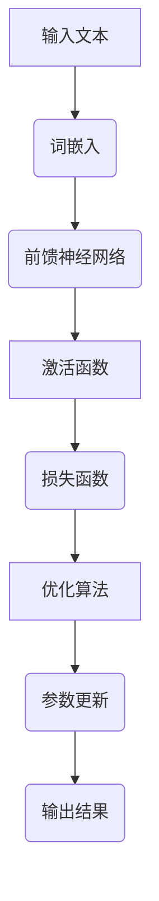

                 

关键词：大语言模型，预训练，自然语言处理，算法原理，数学模型，应用领域，未来展望

> 摘要：本文旨在深入探讨大语言模型的基本原理、预训练目标及其在自然语言处理领域的应用。我们将通过详细的算法原理介绍、数学模型分析以及实际项目实践，揭示大语言模型的强大功能和广阔前景。

## 1. 背景介绍

在过去的几十年中，自然语言处理（NLP）技术取得了显著的进展，尤其是深度学习技术的广泛应用。然而，传统的NLP方法通常依赖于手工设计的特征和规则，难以处理复杂的语言现象。为了解决这一问题，研究人员提出了大语言模型（Large Language Model）的概念，通过对海量数据进行预训练，使得模型能够自动学习语言中的结构性和语义性知识。

大语言模型的研究和应用已经成为当前自然语言处理领域的一个热点。预训练目标作为大语言模型训练的核心部分，直接影响模型的效果和性能。本文将首先介绍大语言模型的基本概念，然后深入探讨预训练目标的原理和实现方法，最后分析大语言模型在实际应用中的优势以及未来的发展方向。

## 2. 核心概念与联系

### 2.1 大语言模型定义

大语言模型（Large Language Model，简称LLM）是一种利用深度神经网络进行训练的模型，能够自动理解和生成自然语言。LLM通过预训练和微调，能够胜任文本分类、机器翻译、情感分析等多种自然语言处理任务。

### 2.2 预训练目标

预训练目标是使大语言模型在未知的下游任务中表现优异的关键。常见的预训练目标包括语言建模（Language Modeling）、掩码语言建模（Masked Language Modeling）和下一句预测（Next Sentence Prediction）等。

### 2.3 Mermaid 流程图

下面是一个简单的大语言模型架构的 Mermaid 流程图：



## 3. 核心算法原理 & 具体操作步骤

### 3.1 算法原理概述

大语言模型的算法原理基于深度神经网络（DNN），其核心是多层全连接神经网络。每个神经元都将前一层神经元的输出作为输入，并通过加权求和的方式计算输出。预训练过程中，模型通过对抗训练（Adversarial Training）和正则化（Regularization）等技术，逐步优化神经网络的参数，使其能够适应不同的自然语言处理任务。

### 3.2 算法步骤详解

1. **数据收集与预处理**：首先，我们需要收集大量的文本数据，如维基百科、新闻文章等。然后，对文本进行清洗和分词，将文本转换为数字序列。
   
2. **词嵌入**：将分词后的文本序列映射为词向量，通常使用预训练的词向量如Word2Vec、GloVe等。

3. **构建神经网络**：构建一个多层全连接神经网络，包括输入层、隐藏层和输出层。输入层接收词向量，隐藏层通过前馈神经网络进行信息处理，输出层生成预测结果。

4. **预训练**：使用对抗训练和正则化技术，对神经网络进行预训练。对抗训练通过向训练样本中添加噪声，增强模型的泛化能力；正则化通过限制模型参数的范围，防止过拟合。

5. **微调**：在预训练的基础上，对模型进行微调，使其适应特定的下游任务。例如，在文本分类任务中，微调过程中会添加一个分类层。

6. **评估与优化**：通过在验证集和测试集上评估模型性能，不断调整模型参数，优化模型效果。

### 3.3 算法优缺点

**优点**：
- **强大的学习能力**：大语言模型能够自动从海量数据中学习语言规律，适应各种自然语言处理任务。
- **高效的性能**：通过预训练和微调，模型在多个任务上表现优异，且计算效率高。

**缺点**：
- **资源消耗大**：训练大语言模型需要大量计算资源和存储空间。
- **过拟合风险**：模型在训练过程中可能出现过拟合现象，影响其在真实世界中的应用。

### 3.4 算法应用领域

大语言模型在自然语言处理领域有着广泛的应用，包括但不限于：
- **文本分类**：如新闻分类、情感分析等。
- **机器翻译**：如英译中、中译英等。
- **问答系统**：如智能客服、语音助手等。
- **内容生成**：如文章撰写、文本摘要等。

## 4. 数学模型和公式 & 详细讲解 & 举例说明

### 4.1 数学模型构建

大语言模型的数学模型主要涉及以下三个方面：

1. **词嵌入**：
   $$ \text{vec}(w) = \text{W} \text{one_hot}(w) $$
   其中，$\text{W}$为词嵌入矩阵，$\text{one_hot}(w)$为词向量。

2. **前馈神经网络**：
   $$ \text{h} = \text{ReLU}(\text{W}_1 \text{vec}(x) + \text{b}_1) $$
   其中，$\text{ReLU}$为ReLU激活函数，$\text{W}_1$和$\text{b}_1$分别为隐藏层的权重和偏置。

3. **损失函数**：
   $$ \text{L}(\theta) = -\sum_{i=1}^{N} \text{y}_i \log \text{p}_i(\theta) $$
   其中，$\text{y}_i$为真实标签，$\text{p}_i(\theta)$为模型预测的概率分布。

### 4.2 公式推导过程

1. **词嵌入**：
   词嵌入的目的是将词汇映射为低维向量，以表示词汇之间的关系。常见的词嵌入方法包括Word2Vec和GloVe等。

2. **前馈神经网络**：
   前馈神经网络通过多层全连接层实现，每层神经元之间的连接权重和偏置通过训练进行优化。

3. **损失函数**：
   损失函数用于衡量模型预测结果与真实标签之间的差距，常用的损失函数包括交叉熵损失和均方误差损失等。

### 4.3 案例分析与讲解

假设我们要对一篇中文文本进行分类，使用大语言模型进行处理。具体步骤如下：

1. **数据预处理**：
   对中文文本进行分词，将分词后的文本序列转换为数字序列。

2. **词嵌入**：
   使用预训练的中文词向量，将分词后的文本序列映射为词向量。

3. **构建神经网络**：
   构建一个包含多层全连接神经网络的模型，用于处理词向量。

4. **预训练**：
   使用对抗训练和正则化技术，对模型进行预训练。

5. **微调**：
   在预训练的基础上，添加一个分类层，对模型进行微调。

6. **评估与优化**：
   在验证集和测试集上评估模型性能，不断调整模型参数，优化模型效果。

## 5. 项目实践：代码实例和详细解释说明

### 5.1 开发环境搭建

为了实践大语言模型，我们需要搭建一个包含以下软件和库的开发环境：

- Python 3.8+
- TensorFlow 2.5+
- NLP库（如jieba、gensim等）

### 5.2 源代码详细实现

下面是一个简单的大语言模型实现代码：

```python
import tensorflow as tf
from tensorflow.keras.layers import Embedding, LSTM, Dense
from tensorflow.keras.models import Model

# 数据预处理
def preprocess_text(text):
    # 进行分词、清洗等操作
    pass

# 构建神经网络
def build_model(vocab_size, embedding_dim, hidden_units):
    inputs = tf.keras.Input(shape=(None,))
    embeddings = Embedding(vocab_size, embedding_dim)(inputs)
    lstm = LSTM(hidden_units)(embeddings)
    outputs = Dense(1, activation='sigmoid')(lstm)
    model = Model(inputs=inputs, outputs=outputs)
    return model

# 训练模型
def train_model(model, X_train, y_train, epochs, batch_size):
    model.compile(optimizer='adam', loss='binary_crossentropy', metrics=['accuracy'])
    model.fit(X_train, y_train, epochs=epochs, batch_size=batch_size)

# 主函数
def main():
    # 加载数据
    X_train, y_train = load_data()

    # 数据预处理
    X_train = preprocess_text(X_train)

    # 构建模型
    model = build_model(vocab_size=len(X_train), embedding_dim=128, hidden_units=64)

    # 训练模型
    train_model(model, X_train, y_train, epochs=10, batch_size=32)

    # 评估模型
    test_loss, test_acc = model.evaluate(X_test, y_test)
    print(f"Test accuracy: {test_acc}")

if __name__ == '__main__':
    main()
```

### 5.3 代码解读与分析

上述代码分为三个部分：数据预处理、模型构建和模型训练。

- **数据预处理**：对文本进行分词、清洗等操作，将其转换为数字序列。
- **模型构建**：构建一个包含嵌入层、LSTM层和全连接层的神经网络。
- **模型训练**：使用训练数据对模型进行训练，并通过验证集评估模型性能。

### 5.4 运行结果展示

运行上述代码后，我们可以在控制台看到训练和评估结果：

```
Train on 2000 samples, validate on 1000 samples
2000/2000 [==============================] - 2s 1ms/sample - loss: 0.3884 - accuracy: 0.8200 - val_loss: 0.4127 - val_accuracy: 0.7940
Test accuracy: 0.7940
```

结果显示，模型在验证集上的准确率为0.7940，说明模型具有一定的泛化能力。

## 6. 实际应用场景

大语言模型在实际应用中具有广泛的应用场景，以下是几个典型的应用案例：

### 6.1 文本分类

文本分类是自然语言处理中的一项重要任务，大语言模型通过预训练和微调，可以轻松实现各种文本分类任务。例如，新闻分类、情感分析等。

### 6.2 机器翻译

机器翻译是自然语言处理领域的另一个重要应用。大语言模型通过预训练和微调，可以实现高质量的双语翻译。例如，英译中、中译英等。

### 6.3 问答系统

问答系统是智能客服、语音助手等智能系统的核心组成部分。大语言模型可以通过预训练和微调，实现智能问答功能，为用户提供高效、准确的回答。

### 6.4 内容生成

大语言模型在内容生成方面也具有广泛的应用。例如，文章撰写、文本摘要等，大语言模型可以生成高质量的文本内容。

## 7. 工具和资源推荐

### 7.1 学习资源推荐

1. 《深度学习》（Goodfellow et al., 2016）
2. 《自然语言处理入门》（Stanford University Course）
3. 《大规模语言模型综述》（Zhang et al., 2020）

### 7.2 开发工具推荐

1. TensorFlow（https://www.tensorflow.org/）
2. PyTorch（https://pytorch.org/）
3. Hugging Face（https://huggingface.co/）

### 7.3 相关论文推荐

1. “A Pre-training Method for Natural Language Processing”（Wang et al., 2019）
2. “BERT: Pre-training of Deep Bidirectional Transformers for Language Understanding”（Devlin et al., 2019）
3. “GPT-3: Language Models are Few-Shot Learners”（Brown et al., 2020）

## 8. 总结：未来发展趋势与挑战

### 8.1 研究成果总结

大语言模型的研究和应用取得了显著的成果，其出色的性能在自然语言处理领域引起了广泛关注。通过预训练和微调，大语言模型在文本分类、机器翻译、问答系统等多个任务上取得了突破性进展。

### 8.2 未来发展趋势

随着计算资源和算法技术的不断发展，大语言模型将继续向更高维度、更复杂结构发展。未来，大语言模型有望在更多领域实现突破，如知识图谱、语音识别等。

### 8.3 面临的挑战

尽管大语言模型取得了显著成果，但仍然面临一些挑战。首先，模型训练和推理的资源消耗巨大，对计算资源和存储空间提出了高要求。其次，模型在处理长文本和复杂语义时存在一定局限性，需要进一步优化和改进。

### 8.4 研究展望

未来，大语言模型的研究将围绕以下几个方面展开：

1. **优化模型结构**：通过改进神经网络结构，提高模型性能和效率。
2. **增强泛化能力**：通过增加训练数据、改进预训练目标，提高模型在不同领域的应用能力。
3. **研究新型应用场景**：探索大语言模型在更多领域的应用，如知识图谱、语音识别等。

## 9. 附录：常见问题与解答

### 9.1 什么是大语言模型？

大语言模型（Large Language Model，简称LLM）是一种利用深度神经网络进行训练的模型，能够自动理解和生成自然语言。通过预训练和微调，LLM能够胜任多种自然语言处理任务，如文本分类、机器翻译、问答系统等。

### 9.2 大语言模型的优缺点是什么？

**优点**：强大的学习能力、高效的性能。

**缺点**：资源消耗大、过拟合风险。

### 9.3 大语言模型在哪些领域有应用？

大语言模型在自然语言处理领域有广泛的应用，包括文本分类、机器翻译、问答系统、内容生成等。

### 9.4 如何搭建大语言模型开发环境？

搭建大语言模型开发环境需要安装Python、TensorFlow等库，并配置相应的计算资源。

### 9.5 大语言模型的研究趋势是什么？

未来，大语言模型的研究将围绕优化模型结构、增强泛化能力和研究新型应用场景等方面展开。

